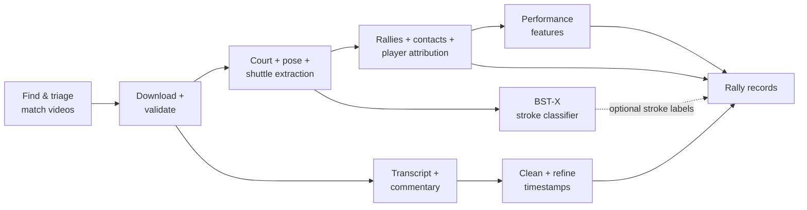
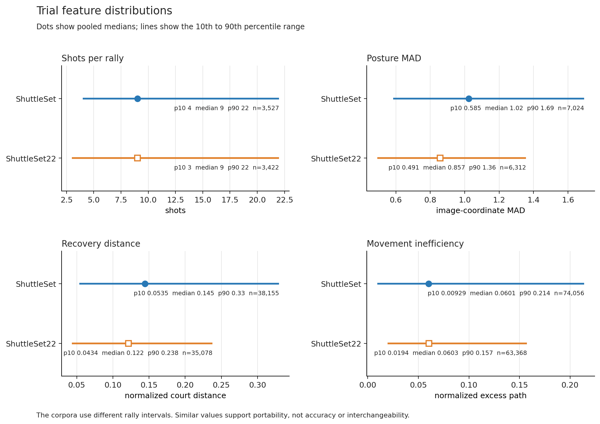

# Badminton CV Annotator

We're trying to turn ordinary badminton broadcasts into structured evidence about **how each player is actually playing**.

We couldn't find a large existing dataset built around individual badminton performance, so we're building one.

Our pipeline runs end-to-end: from video discovery through to download, auto-annotation and dataset compilation. It can discover and triage videos, extract court geometry, player pose and shuttle tracks, detect rallies and contacts, attribute contacts to players, clean and align commentary, derive performance features, and assemble the whole lot into a research-backed featureset.



Most of our system is custom-built. There are explicit rules and learned components for things like court handling, replay exclusion, rally segmentation, contact candidate generation, player attribution and feature extraction. The pipeline is also resumable, so expensive vision outputs can be checked and reused instead of recomputed whenever a later stage changes.

The commentary path is one example of the extra plumbing around the edges: transcripts are cleaned, useful spans can be refined to word-level timing with WhisperX, and commentary is then paired to the rally it most plausibly describes rather than dumped against an entire match.

On the modelling side, we extract the useful raw primitives--pose, court position, shuttle tracks, rally spans and contact events--as well as engineered measurements Like posture variability, recovery behaviour, movement and timing features. The aim is to give a future weakly-supervised model enough information to learn meaningful dimensions of player performance rather than just predicting match outcomes or stroke labels.

At this stage we've built a proof of concept dataset by extracting and deriving features from the ShuttleSet and ShuttleSet22 datasets. These had existing annotations for contact timing and rally boundaries--areas where our auto-annotator isn't yet reliable enough to autonomously build a research dataset.



See the [trial feature definitions](docs/trial_feature_list.md), the [feature benchmark](docs/dataset_builder/issue_104_shuttleset_benchmark.md), and the [frozen v1 dataset schema](docs/dataset_v1_schema.md).

## Court-detection dataset

The [ShuttleSet and ShuttleSet22 court detections](data/court_detections/sset_and_sset22/extractions_20261003/README.md)
contain one prediction file per video: **86 videos and 44,810 scenes**. Start
there to load the extracted court coordinates. These predictions are separate
from the older performance-feature handover below.

The [court research map](experiments/court_detector/README.md) points to the
accuracy report, galleries and tools for improving the detector.

## Dataset handover

The COSC595 handover is a frozen delivery of the existing dataset exports and supporting model outputs. It is not a fresh extraction run.

The [handover folder](https://drive.google.com/drive/folders/1BnkYZrfo1KfIXe4aK7PSRtrEirVhWHP1) contains the packages and their README. [Issue #134](https://github.com/ahalp90/badminton_cv_annotator/issues/134) records the delivery checks and review status. The [`START-HERE.md` developer guide](https://drive.google.com/file/d/1rrfn8f0zK75nDKESeBlJQSU2FBtpW_5j/view) gives the shortest route into the code and the remaining work.

| Download | Contents |
| --- | --- |
| `cosc595-dataset-v1-main.zip` (about 130 MB) | Tables, manifests, player signals, schema, attribution, loading example and checks |
| `cosc595-dataset-v1-supporting-extracts.zip` (about 8.2 GB) | Optional pose, bounding-box, shuttle, court and mask outputs referenced by the dataset; these are model outputs, not match videos |

Both archives unpack into a `dataset-v1/` directory, so they can share one parent folder. `SHA256SUMS` and `archive-inventory.json` record the published contents.

The main dataset contains **6,833 human-source rallies across 86 videos**: 3,182 from 40 ShuttleSet videos and 3,651 from 46 ShuttleSet22 videos. ShuttleSet also contains automatically generated rally rows; `rally_origin == "source_contacts"` identifies the human-source population.

ShuttleSet22 video 15 is excluded because its labels are misaligned; [PR #159](https://github.com/ahalp90/badminton_cv_annotator/pull/159) records that change. The schema is [`rally-dataset/1.3`](docs/dataset_v1_schema.md), and the frozen repository baseline is [`2488f9b`](https://github.com/ahalp90/badminton_cv_annotator/tree/2488f9b5c116d499ef79e9ed21dd837ec0b0c44f). The handover also keeps the original export provenance in `docs/SOURCE_RECORD.md` and the package manifests.

A later manual review checked 134 commentary passages covering 135 of the dataset's 3,500 candidate commentary–rally links. It found 116 matching passages, 13 general-discussion passages and five unclear passages. The sample was selected rather than random, so it does **not** establish whole-dataset pairing accuracy. The [review record](docs/dataset_builder/commentary_manual_review_20261002.md) preserves the labels, timing checks and notes.

The frozen handover predates the latest court integration and annotator refit. Existing court errors can therefore affect its derived features. The features are experimental measurements, not validated player-skill grades. Full match videos are also outside the packages; the handover's rebuild notes list the extra inputs needed to reproduce the exports.

## Auto-annotator

The auto-annotator is the part of the project that tries to turn badminton
footage into complete, correctly labelled rallies. It finds live play, detects
racket contacts, assigns them to the near or far player, repairs the contact
sequence and ranks rallies for human review.

Over several months, the work progressed from hand-written shuttle and pose
rules to learned contact detection, rally-wide side assignment, bounded sequence
repairs and a separate review model. Court detection and player tracking also
needed substantial work: bad geometry can spoil the evidence supplied to every
later stage. The [development narrative](experiments/annotator/development.md)
explains the experiments, including approaches that were tried and rejected.

Individual contacts are now much more reliable than complete rallies. The
selected model finds 34,200 of 37,184 labelled contacts and recovers **1,744 of
3,327 complete rallies (52.4%)** on the 46-video ShuttleSet22 comparison, using
a ±10-frame timing allowance at 30 fps. This is a frequently examined development
benchmark; transfer to unfamiliar broadcasts and club footage remains unproven.
The [evaluation guide](experiments/annotator/evaluation.md) explains the scoring,
historical baselines and limits. The output still needs human review before it
can supply trustworthy research labels.

The [student handover](experiments/annotator/README.md) covers the project
and remaining research questions. The [quickstart](docs/annotator/quickstart.md)
covers running the selected model; [how it works](docs/annotator/how_it_works.md)
explains the implementation.

## Court detector

The court detector finds the four outer court corners from line markings and
player positions. It can combine evidence within a scene or across returning
camera views. Each scene still receives one fixed court projection.

The [detector overview](docs/court_detector/README.md) explains its role and
main stages. The [usage guide](docs/court_detector/usage.md) covers input needs,
setup, commands and every CLI option. [Design notes](docs/court_detector/design.md)
explain the current choices; the [experiment reports](experiments/court_detector/README.md)
record the development and evaluation.

## Earlier work: BST-X

This project grew out of our earlier badminton stroke-classification work.

**BST-X** classifies an individual stroke from pose and shuttle information around the contact window. In our ShuttleSet comparison it outperformed the published BST and TemPose baselines on the original 25-class taxonomy, with the strongest recorded run reaching about **0.830 macro-F1**.


That work is largely finished; the current project is about moving from isolated strokes toward understanding complete rallies and, eventually, player performance.

## Running it

Using the saved dataset only requires the smaller environment described in the handover README. The commands below install the repository base dependencies and development tools. Additional setup is needed for vision processing and the full test suite.

The base development install does not include all dependencies imported by the full test suite. Before running `uv run pytest`, install the dependencies for the components under test. These include `safetensors` for court models and `positional-encodings`, `tensorboard` and `torcheval` for classifier modules. See the runtime and training extras in [`pyproject.toml`](pyproject.toml).

Before running the trial pipeline:

- Configure the separate pose environment using the [pose extraction requirements and GPU setup notes](src/bst_x/preparing_data/requirements.txt).
- Set `BADMINTON_TRACKNET_PYTHON` and `BADMINTON_POSE_PYTHON` to the Python executables for the extraction environments.
- Supply the TrackNet, InpaintNet and court model weights at the paths in [`configs/dataset_builder/trial.toml`](configs/dataset_builder/trial.toml), or update the configuration to match their locations.
- Set `GEMINI_API_KEY` for the trial's enabled commentary stage. Full vision processing also needs FFmpeg and a suitable GPU environment.

A fresh full pipeline rebuild was not tested during this handover. The package's `docs/REBUILD.md` lists the additional source data and saved records needed to reproduce the delivered exports.

Requires Python 3.12+, [uv](https://docs.astral.sh/uv/), FFmpeg, and CUDA-capable hardware for the full vision pipeline.

```bash
git clone https://github.com/ahalp90/badminton_cv_annotator.git
cd badminton_cv_annotator
uv sync --extra dev

uv run ruff check .
uv run pyrefly check
uv run pytest
```

The dataset builder is a one-shot, resumable CLI:

```bash
PYTHONPATH=src uv run python -m dataset_builder run \
  --config configs/dataset_builder/trial.toml \
  --run-dir /absolute/path/to/run
```

The trial configuration includes video discovery and commentary. Re-running against the same directory validates and reuses completed stages rather than blindly recomputing expensive vision work.

Useful starting points are the [dataset-builder trial](docs/dataset_builder/issue_15_batch_5_e2e_report.md), [feature benchmark](docs/dataset_builder/issue_104_shuttleset_benchmark.md), [annotator handover](experiments/annotator/README.md), and [HPC quickstart](docs/hpc_quickstart.md).

## Project

This repository supports COSC595 and COSC320 projects at the University of New England and continues the earlier [Badminton Stroke Classification](https://github.com/Kira-Le/badminton_stroke_classification) project.

Current COSC595 contributors are **Ariel Halperin** and **Curtis Martin**. The earlier COSC594/COSC320 foundation was created by Ariel Halperin, Curtis Martin, Scott Bailey, Kiri Lefebvre, Isiah Darcy, Ethan McDonough and Jared Pitman.

Licensed under the **GNU Lesser General Public License v3.0 or later**. See [COPYING.LESSER](COPYING.LESSER), [COPYING](COPYING), and [`data/ATTRIBUTION.md`](data/ATTRIBUTION.md) for third-party and dataset attribution.
