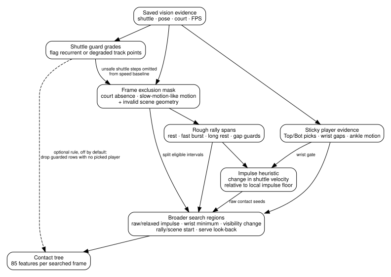

# Fixed heuristics before the trees

Before the fitted models score possible hits, rules select usable evidence,
find rough rally boundaries and track a player on each court half. They narrow
the timeline to places where a contact looks plausible. The trees then make
the contact choices from those candidates.

These rules shape what the models learn from and what they see during
annotation. A substantial change to the rules therefore usually requires a
new model fit.



## Two different kinds of rejection

The annotator has two separate ways of withholding unreliable evidence. They solve different problems.

### Frame exclusion mask

The exclusion mask removes whole frames from normal rally and contact evidence.

In the dataset-builder path, the first mask combines two signals:

- **Sustained court absence.** A missing court for at least 15 frames at 30 FPS marks that whole run as excluded. The duration scales with frame rate.
- **Slow-motion-like shuttle movement.** The shuttle is still moving, but its rolling median speed has fallen below 15% of the video's normal rally speed. Genuine rest is not classified as slow motion.

Short exclusion runs are removed unless they last at least 15 frames at 30 FPS. Full annotation then excludes frames that sit outside accepted court-scene geometry. The dataset-builder path also treats court-invalid frames as excluded.

The purpose is to keep replay, slow motion, prolonged non-court footage and unusable camera sections from looking like normal live-play motion. Otherwise they can create false rally boundaries, false contact evidence or misleading player geometry.

A camera angle change alone does not establish replay. The code can measure perspective shift, but the current replay mask does not reject a frame only because the court is viewed from a different angle.

Relevant code: `masks/replay.py`, `masks/dead.py`, `run_video.py`.

### Shuttle guard grades

Shuttle guard grades apply to the shuttle track itself rather than to the whole frame.

`masks/inpaint.py` looks for exact coordinate sequences that recur far more often than ordinary shuttle motion should. The default pattern width is 16 frames. Repeated moving patterns are strong evidence that an inpainting or tracking stage has fallen into a fabricated loop. Repeated flat positions are suspicious but less conclusive because a real shuttle can remain still.

The current codes are:

| Code | Meaning | Current treatment |
| ---: | --- | --- |
| `0` | no flag | usable |
| `1` | repeated moving pattern; treated as fabricated | rejected |
| `2` | repeated flat pattern; suspicious | rejected |
| `3` | degraded frame near one of those recurrent patterns | rejected |

`BaseAnnotatorConfig.rejected_grades` currently contains `{1, 2, 3}`. `run_video()` turns the rejected grades into one boolean frame mask, which the code calls the shuttle hallucination mask.

The rejection matters because fabricated shuttle coordinates can create convincing but false movement. A repeated or inpainted track can produce a sharp change in velocity, an apparent contact, or a plausible landing even when the shuttle was not really observed there.

Rejected frames are handled in three places:

- **Slow-motion detection.** Speed steps that touch a rejected frame are left out when the detector estimates normal rally speed.
- **Outcome rules.** Landing estimates do not use rejected frames. If the last contact of a rally sits on a rejected frame, the landing is left empty rather than measured from an earlier hit.
- **Contact candidates, only when the optional rule below is on.**

By default the contact tree still scores rejected frames, and a contact can be selected on one. Grades `2` and `3` mark suspicious or degraded tracking; they do not prove that no hit happened.

The saved `*_inpaint_mask.json.gz` has a different role. It records which positions came from the upstream inpainting stage. The guard codes are a later check on whether the final track contains recurrence patterns that look unsafe.

Relevant code: `masks/inpaint.py`, `run_video.py::build_shuttle_hallucination_mask()`, `outcomes/video.py`, `dataset_builder/shuttle_evidence.py`.

### Optional rule for guarded candidates

`ContactModelConfig.reject_masked_without_player` is off by default. When it is on, a candidate frame is dropped before the contact tree scores it if both of these hold:

- the frame's shuttle guard grade is one of the model's rejected grades (`1`, `2` and `3` by default);
- the player tracker has selected no detected person on either court half at any of the five feature offsets (`-10`, `-5`, `0`, `+5` and `+10` frames at 30 FPS, scaled to the video).

A picked player counts even when its wrists were not measured. An offset that falls outside the candidate's search interval counts as no player.

Dropped rows leave the candidate pool completely. They cannot be selected as initial contacts, and the sequence stage cannot shortlist them later as a serve or a missed contact.

The setting is saved in `models.joblib` with the contact score cutoff, so annotation follows whatever the model directory was fitted with. The standalone commands have no flag for it. The [refit guide](retuning.md#10-contact-selection-settings) covers how it is set for a fit.

Relevant code: `contacts/model.py::score_contact_features()`, `hybrid.py`, `training/workflow.py`.

## Frame-rate scaling

Most time-based constants are written as 30 FPS reference values and scaled once for the source video.

Examples at 30 FPS include:

| What the rule controls | 30 FPS reference | Code name |
| --- | ---: | --- |
| Shuttle movement below this level counts as rest | `0.002` normalised image units per frame | `rest_speed` |
| Shuttle movement above this level can confirm the start of active play | `0.015` per frame | `start_speed` |
| Fast movement must last this long before it counts as a rally-start burst | 3 frames | `start_min_frames` |
| Shuttle positions are smoothed across this many frames before motion changes are measured | 3 frames | `smooth_window` |
| A rest period this long separates one rally from the next | 90 frames | `end_rest_frames` |
| The court must be absent this long before the full absence run is excluded | 15 frames | `court_absent_window` |
| A replay or slow-motion exclusion signal must last this long before it is kept | 15 frames | `replay_mask_min_frames` |
| A possible hit is compared with nearby shuttle-motion changes across this many junctions on each side | 12 junctions | `impulse_floor_half_window_frames` |
| Raw hit-like motion changes closer than this compete so the stronger one survives | 3 frames | `contact_dedup_radius_frames` |
| Heuristic contact candidates closer than this compete after the wrist check | 9 frames | `contact_suppression_radius_frames` |

Frame counts grow with FPS. Per-frame speed thresholds shrink as FPS rises because the shuttle moves a shorter image distance between adjacent frames.

Relevant code: `fps_constants.py`, `resolve.py`.

## Sticky player evidence

Pose extraction can return several people and can change detection slots from one frame to the next. The sticky player logic converts that into more stable badminton-specific evidence.

Within accepted court intervals it keeps one usable pose detection for the far court half (`Top`) and one for the near half (`Bot`). From those picks it records:

- wrist-to-shuttle distance, measured in player body-height units;
- ankle position and ankle movement;
- the raw pose slot assigned to each court half;
- whether each player or wrist measurement is available.

This information later feeds contact features, serve-repair features and the initial `Top`/`Bot` guess for each contact.

Relevant code: `rally/evidence.py`, `types.py::StickyResult`.

## Rough rally spans

Rally segmentation starts from shuttle speed and visibility.

A frame reads as rest when the local shuttle speed is low. Long or difficult tracking gaps can also become rest, with guards that stop a high shot leaving the frame from immediately ending the rally.

At the current defaults:

1. shuttle position is smoothed over a short window;
2. a sustained fast burst confirms that an active region contains real play;
3. a long rest separates one active region from the next;
4. `SpanOpen.BACK_FILL` opens the rally at the start of that active region once a qualifying burst has been found.

This gives deliberately broad rally spans. The fitted sequence stage later has room to repair the first contact, and final bounds can move again after contacts are selected.

The code also contains optional serve-gated and quiet-start span modes. The normal dataset-builder annotation call does not pass those options.

Relevant code: `rally/spans.py`, `rally/trajectory.py`, `config.py`.

## The impulse contact heuristic

An **impulse** is the size of the change in shuttle velocity around a frame.

After smoothing the shuttle coordinates, the code forms a velocity vector between each pair of neighbouring smoothed positions. At each junction it then compares the incoming and outgoing velocity vectors:

```text
impulse = magnitude(outgoing velocity - incoming velocity)
```

A straight flight at steady speed has a small impulse. A racket contact often changes shuttle speed, direction, or both, which produces a larger value.

The heuristic does not use one global impulse threshold. It compares each impulse with a rolling local median, called the **impulse floor**. A raw candidate currently needs:

- visible shuttle positions across the three frames around the junction;
- an impulse more than 4 times the local floor;
- enough spacing from a stronger raw impulse candidate.

The heuristic chain then checks whether a tracked wrist is within 1.4 player-box heights of the shuttle. Nearby passing candidates compete again within a wider time radius, with the larger impulse surviving.

Those heuristic survivors are useful evidence, but the fitted contact model is not limited to them.

Relevant code: `rally/contacts.py`.

## Contact search regions

The contact tree scores a broader set of frames than the raw impulse heuristic accepts.

Search regions grow around seven kinds of seed:

| Seed | Why it can contain a hit |
| --- | --- |
| raw heuristic contact | strong local velocity change already passed the rule-based contact chain |
| relaxed impulse | weaker velocity change; current seed threshold is 1.25 times the local floor |
| wrist-distance minimum | shuttle is locally closest to a tracked wrist |
| visibility change | shuttle appears or disappears around a possible hit or occlusion |
| rally start | first-hit timing is often difficult |
| court-scene start | a cut or new accepted view can disturb nearby evidence |
| serve look-back | an earlier serve may sit before the first initially selected contact |

Each seed expands into a small time region. The tree receives every row in those regions and can decide that the heuristic seed itself was wrong.

Relevant code: `contacts/features.py`.

## What reaches the contact tree

For every searched frame, the contact model receives 17 signals at five time offsets. At 30 FPS those offsets are `-10`, `-5`, `0`, `+5` and `+10` frames.

The signals are:

- shuttle x and y velocity;
- shuttle speed;
- impulse and impulse-to-local-floor ratio;
- nearest, far-half and near-half wrist gaps;
- x and y displacement from shuttle to nearest wrist;
- ankle speed on each court half;
- shuttle visibility;
- player-pose validity on each court half;
- wrist-measurement validity on each court half.

That produces 85 fitted input columns. Missing physical measurements remain `NaN`; explicit validity features tell the model what was unavailable.

The next layer is described in [How the trees work together](tree_stack.md).

## Where the main rules live

| Concern | Main source |
| --- | --- |
| FPS-relative constants | `fps_constants.py` |
| assembled preprocessing settings | `config.py`, `resolve.py` |
| replay / off-rally exclusion | `masks/replay.py`, `masks/dead.py` |
| shuttle recurrence guard | `masks/inpaint.py` |
| sticky player picks | `rally/evidence.py` |
| rally boundaries | `rally/spans.py` |
| impulse contacts and wrist gate | `rally/contacts.py` |
| broader contact search regions | `contacts/features.py` |
