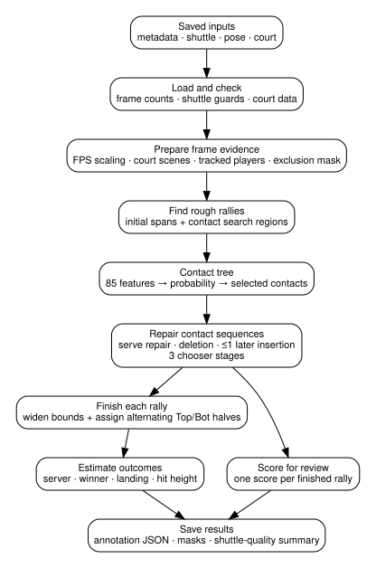

# How the auto-annotator works

The auto-annotator finds rallies and racket hits in saved shuttle, pose and
court data. A hit is called a **contact** in the code, and its time is recorded
as a video frame. The [quickstart](quickstart.md) covers running the annotator;
this guide explains how it selects contacts and builds the final annotation.

Rules first remove unusable frames and mark places where a hit is plausible.
A fitted classifier scores those possible hit frames. Later classifiers look
at the rally as a whole and compare a few repairs, such as finding an earlier
serve or adding a missed hit. Once the hits are settled, rule-based code assigns
player sides, adjusts the clip boundaries and estimates outcomes. The code calls
the classifiers the contact tree and sequence trees.

Each video goes through this chain once. The three sequence-repair stages each
make one choice, in order; they do not repeatedly revise the rally until it settles.

**Contents**

| Inputs and contact selection | Rallies and outcomes | Reference |
| --- | --- | --- |
| [What goes in](#what-goes-in) | [4. Bounds and court halves](#stage-4-set-rally-bounds-and-court-halves) | [Model directory](#model-directory-contents) |
| [1. Search area](#stage-1-build-the-search-area) | [5. Rally outcomes](#stage-5-estimate-rally-outcomes) | [Result fields](#result-fields-at-a-glance) |
| [2. Contact scoring](#stage-2-score-possible-contact-frames) | [6. Review scores](#stage-6-score-rallies-for-review) | [Code terminology](#terms-used-in-the-code) |
| [3. Sequence repairs](#stage-3-compare-possible-sequence-repairs) | [Rules versus fitted models](#rules-versus-fitted-models) | [Main call chain](#main-call-chain) |



## What goes in

One video contributes four kinds of saved data:

- **Video metadata** — frame count, frame rate and image width and height.
- **Shuttle track** — one `(x, y, visibility)` row per frame, plus a record of positions filled in by the inpainting stage and shuttle-quality grades.
- **Pose detections** — player boxes and keypoints for each frame.
- **Court data** — the scenes with usable court detections, the image-to-court
  transforms (homographies), a per-frame record of court presence, and the
  net position used to separate the near and far court halves when assigning hits.

Both the standalone command and the dataset builder load these files through the same dataset-builder functions. The annotation code therefore receives the same in-memory inputs in both cases.

The court detector supplies scene boundaries and court geometry. Its scene histograms are not inputs to the contact or sequence models.

## Stage 1: build the search area

`run_video()` first converts frame-count settings from their 30 FPS reference values to the video's actual frame rate.

It then selects court and player data, marks frames to exclude, estimates rough
rally boundaries and chooses where to look for hits.

### Court scenes and tracked players

Within each scene with an accepted court, the player picker tries to follow
one detected person on the far half (`Top`) and one on the near half (`Bot`).
It favours keeping the same person across nearby frames, which is why the code
calls it the sticky player picker.

For each video frame, that provides:

- the pose detection assigned to each court half;
- wrist-to-shuttle distance;
- ankle position and movement;
- whether enough player data is present on the frame.

Keeping the same people across frames reduces switches between detections
that would occur if each frame were matched independently.

### Frames and shuttle positions excluded from evidence

The annotator can exclude a whole stretch of video or flag just the shuttle
track. Those choices have different effects on which hits can survive.

The **frame exclusion mask** marks stretches of video to leave out. The dataset
builder marks prolonged court absence and shuttle movement that looks like
slow motion, then removes very short flagged stretches. Full annotation also
leaves out frames without accepted court geometry. This is intended to keep
replays, slow motion and footage away from the court from producing false hits.

The **shuttle guard** applies to the track rather than the whole frame. It looks for exact shuttle-coordinate patterns that recur many times, which can happen when tracking or inpainting falls into a fabricated loop. Grades `1`, `2` and `3` mean fabricated, suspicious-flat and degraded shuttle positions. The default settings treat all three as unreliable.

The grading matters in three places:

- unreliable frames are left out of the normal-speed estimate used by the slow-motion detector;
- the outcome rules do not use unreliable frames for a landing, and they leave the landing empty when the last hit of a rally sits on one;
- an optional model setting drops candidate contact frames that are unreliable and have no picked player nearby in time.

That optional setting is off by default. With it off, the contact tree still scores unreliable shuttle frames and can select one as a contact.

The two mechanisms are described in detail in [Fixed heuristics](heuristics.md).

### Rough rallies and contact search regions

Shuttle motion gives the initial rally spans: the start and end frames of each
possible rally. Long rests separate stretches of activity. A sustained fast
burst confirms play within a stretch, and the rally starts at the beginning
of that activity. Special handling keeps some difficult tracking gaps from
immediately ending a high shot.

One important heuristic inside those spans is **shuttle impulse**: the size of the change between the incoming and outgoing shuttle velocity. A racket hit often creates a sudden change in speed, direction, or both. The rule compares that change with a rolling local baseline, called the
impulse floor. A candidate therefore has to stand out from nearby shuttle motion,
rather than exceed one fixed value for the whole video.

Within and around the rough spans, several signals mark frames as worth scoring:

- a strong change in shuttle velocity that passed the earlier contact rules;
- a weaker change at least 1.25 times the local impulse floor;
- a frame where the shuttle is closer to a wrist than in nearby frames;
- a visibility change;
- a rally start;
- a court-scene start;
- the serve look-back window.

These rules choose **which frames are worth scoring as possible hits**. The
fitted contact classifier then decides which frames to keep.

The rule settings are saved with the models because they determine which
frames and measurements the trees learn from. Changing those settings usually
requires refitting the models.

## Stage 2: score possible contact frames

`contacts/features.py` builds one feature row for every searched frame.

The contact tree sees 85 values: 17 signals sampled at five time offsets. At 30 FPS the offsets are `-10, -5, 0, +5, +10` frames; the offsets scale with frame rate.

The 17 signals cover:

- shuttle x/y velocity, speed, impulse and impulse ratio;
- nearest, Top and Bot wrist gaps;
- x/y offset from the shuttle to the nearest wrist;
- Top and Bot ankle speed;
- shuttle visibility;
- pose validity for each court half;
- wrist validity for each court half.

Missing measurements remain `NaN`. Separate validity fields tell the model whether the player or wrist measurement was available. Feature windows stop at search-interval boundaries, so values are not borrowed from an unrelated region of the video.

Motion features keep their raw per-frame units. Changing those units, or the feature order, would change what the fitted tree sees.

The contact model is a `HistGradientBoostingClassifier`, which combines small
decision trees. It uses the 85 measurements to score how much a frame looks
like a hit. During training, frames close to human-labelled hits are positive
examples. Ambiguous
frames nearby are left out, and other frames are sampled as negative examples.

The code reads the score through `predict_proba()` and initially keeps frames
scoring at least `0.9`. That is the model's selection cutoff. Treating it as
“90% of these hits are correct” would require a separate calibration check.

Current initial selection rules are:

- contact score must reach `0.9`;
- contacts within six frames at 30 FPS compete with each other, inside one search interval;
- the higher score wins;
- equal scores keep the earlier frame.

The surviving frames form the initial contact sequence. Lower-scoring candidate rows are still available to the later sequence models, so sequence repair can recover one when the wider rally pattern supports it. [Tree model stack](tree_stack.md) explains that interaction and the evidence used by each later tree.

When the optional rule for guarded candidates is on, the dropped rows are removed before scoring. They then take no part in the initial selection or in later sequence repair.

## Stage 3: compare possible sequence repairs

The first list of hits can still contain a wrong hit or miss a real one. The
sequence models try a small, fixed set of repairs to that list.

For each rough rally, the sequence code creates alternatives that can:

- keep the current contacts;
- add or replace an earlier serve;
- delete one contact;
- combine one permitted early edit with one later-contact insertion.

The selected design allows at most one later inserted contact.

The serve shortlist contains up to two earlier frames to try as a replacement
or addition. It can be empty when no earlier candidate is available; the first
selected hit may already be the serve. Later-hit candidates come from inside
the rally, away from the contacts already selected.

A rally itself can contain just one hit, such as a serve that is not returned.
The shortlist limits how many alternative serve frames the models compare.

Three chooser models examine the same set of alternatives:

1. **Whole sequence** — compares the original sequence with serve repairs and deletions. A change must beat the unchanged sequence.
2. **Later contact** — can switch to an alternative containing one added later hit, but only with a score margin of at least `0.05` over the previous choice.
3. **Scored insertion** — makes the same comparison while also considering a separate score for the proposed inserted contact. The same `0.05` margin applies.

Each stage starts from the previous stage's choice and compares it with the
same list of possible repairs. Later stages can choose a different repair, but
cannot invent another one. Ties go to the simpler option.

## Stage 4: set rally bounds and court halves

After contact selection, rally bounds can expand around the chosen contacts. The default padding is ten frames at 30 FPS, scaled for the video. Bounds stay inside the video and stop at the neighbouring rallies.

A boundary change is accepted only when it leaves contact membership unchanged. It cannot pull a gap contact into the rally or remove a selected contact.

Each contact also gets an initial court-half guess. The annotator finds the tracked player whose wrist is nearest the visible shuttle, then compares the bottom of that player's bounding box with the net band. The net band is the vertical image range around the net that separates far and near player positions. Feet above the band give `Top`, feet below give `Bot`, and feet inside the band leave the side unknown. Missing evidence also leaves it unknown.

The model directory stores one of two geometry modes:

- `video` — one net band is used for the whole video;
- `scene` — the net band comes from the contact's camera scene.

The final side pass chooses the alternating `Top`/`Bot` pattern that best matches those initial guesses. A tie leaves the individual guesses unchanged, including unknown sides. Contacts outside every rally also keep their initial guesses.

`Top` and `Bot` refer to physical court halves in the image. `Top` is the far half; `Bot` is the near half. They do not identify a particular player across a change of ends.

## Stage 5: estimate rally outcomes

Outcome code runs after final contacts and sides are known.

A known server in the next rally can identify the previous rally winner because the winner serves next. When that evidence is unavailable, landing geometry can sometimes provide an answer instead. A landing that is out behind or wide of the player credited with the last hit leaves the geometry-based winner undecided. It does not change that contact's court half.

The outcome code also estimates shuttle landing and hit height when the required shuttle and court data is available.

Two cases limit the landing search:

- **The last hit happens before a normal court view returns.** The search can start in the first accepted scene inside the predicted rally. It uses that scene's geometry and ends at the scene boundary or the rally end. A returning view that is masked is not used. The contact keeps its original time and court half. Because part of the flight was not seen, this partial flight cannot produce a net-fault verdict.
- **The shuttle data at the last hit is unreliable.** The landing is left empty. Searching from the previous hit could measure the other player's shot while keeping the last hitter's identity. Contacts and court halves are kept, and the next-server winner rule can still apply.

Outcome fields can remain empty when the evidence is insufficient. Missing data stays explicit rather than being replaced with a guess.

## Stage 6: score rallies for review

After the contact sequence is finalised, a separate confidence tree scores each rally using the chosen sequence and nearby evidence of discarded or possibly missing contacts. It returns one score per rally.

A higher score means the rally looks more like the correctly assembled training
examples. It ranks promising clips first for review. The score leaves the
rally unchanged, and it needs its own calibration check before being read as a
probability that the whole rally is correct. It also answers a different question
from contact precision, which counts how many predicted hits match labels.

The [completed new-court evaluation](../../experiments/annotator/reports/model_selection.md#does-confidence-give-a-better-review-queue)
compares equally sized review queues by counting correct, wrong and unjudgeable
clips among each model's highest-ranked outputs. This gives a practical way to
compare the ranking: how much correct annotation appears in the first set of
clips a person would review? The selected base model currently uses this score
for ordering review; an automatic-acceptance cutoff has yet to be chosen.

## Rules versus fitted models

| Part | Main job | Learned? |
| --- | --- | --- |
| FPS scaling, masks, court scenes, tracked players | Prepare frame-aligned evidence and reject bad frames | No |
| Initial rally spans and search regions | Decide where contact scoring is worth running | No |
| Contact tree | Score possible contact frames | Yes |
| Serve / sequence / insertion choosers | Select one contact sequence from a limited set of alternatives | Yes |
| Boundary widening | Expand rally bounds without changing contact membership | No |
| Side alternation | Reconcile individual court-half guesses across a rally | No |
| Server / winner / landing / hit height | Derive outcome fields from final contacts and geometry | No |
| Rally confidence | Rank completed rallies for review | Yes |

A rule change can still require a new fit. For example, changing the contact search regions changes the frames and features that the contact and sequence models receive, even if no tree code changes. The [maintainer guide](maintaining.md) lists the common cases.

## Model directory contents

A model directory contains:

```text
models/annotator/
├── models.joblib
└── metadata.json
```

`models.joblib` saves the complete fitted model as one `AnnotatorModels` Python
object, using `joblib.dump()`. It contains:

- the contact classifier;
- the six models in `SequenceModels`;
- the rally confidence classifier;
- the contact prediction settings: the score cutoff and the optional rule for guarded candidates;
- rough-rally, mask and other preprocessing settings;
- the side-geometry mode.

`metadata.json` records the model schema, exact scikit-learn version, contact feature order and side-geometry mode. Loading stops if these do not match the current runtime or the serialised model object.

Changing contact feature order or scikit-learn version therefore requires a new fit. An old tree cannot be safely reused with a different feature order or scikit-learn runtime.

The main settings live in small Python config objects:

- `ContactModelConfig` — contact score cutoff and the optional rule for guarded candidates;
- `ContactFitConfig`, `SequenceFitConfig`, `ConfidenceFitConfig` — tree fitting settings and seeds;
- `TrainingSettings` — everything the fitting workflow uses, including the preprocessing settings;
- `BaseAnnotatorConfig` — rough-rally, mask and shuttle-guard settings.

## Result fields at a glance

The most commonly useful fields are:

- `spans` — final rally bounds, including the start frame and excluding the end frame;
- `filtered_by_rally` — final contact frames grouped by rally;
- `contact_events` — the full final contact stream, with score and court half;
- `rally_confidence` — one review-ordering score per rally;
- `fitted_first_all`, `next_servers` and `striker_halves` — court-half and server information;
- `landings`, `verdict_rows`, `geometric_verdict_rows` — outcome data;
- `hit_height_by_frame` and `hit_height_failures` — hit-height results and explicit failures.

The exact saved files and all result fields are listed in [Inputs and outputs](inputs_outputs.md).

## Terms used in the code

| Term | Meaning here |
| --- | --- |
| **candidate region** | A time interval where at least one rule says a contact is plausible enough to score |
| **raw contact** | A heuristic contact candidate before the fitted contact tree selects final contact frames |
| **contact event** | A selected contact frame with its model score and court-half assignment |
| **sticky player** | The pose detection held for the `Top` or `Bot` court half across nearby frames |
| **scene court** | Court geometry associated with one accepted camera scene |
| **exclusion mask** | Boolean frame mask for frames removed from normal rally/contact evidence |
| **shuttle hallucination mask** | Boolean frame mask for shuttle positions flagged as unreliable by the model's guard settings |
| **option pool** | The limited keep/repair/delete/insert alternatives compared by the sequence models |
| **model directory** | `models.joblib` plus `metadata.json`, containing fitted models and their required settings; the code also calls it the model bundle |

## Main call chain

```text
python -m annotator
    ↓
annotator.cli.annotate_saved_video
    ↓
dataset_builder.vision loaders
    ↓
dataset_builder.vision.run_full_annotation_stage
    ↓
annotator.run_video.run_video
    ├─ rally / masks / courts  → rough rallies and frame evidence
    ├─ annotator.hybrid        → contacts, sequence repair, review score
    └─ outcomes                → winner, landing, hit height
    ↓
dataset_builder.vision.persist_annotation_run
```

The [code map](code_map.md) gives the file-by-file view.

For historical context, [PR 149](https://github.com/ahalp90/badminton_cv_annotator/pull/149)
describes the retained rule-and-tree model and
[PR 150](https://github.com/ahalp90/badminton_cv_annotator/pull/150) its court-failure
analysis. Both concern the old court inputs. The
[development history](../../experiments/annotator/development.md)
records the later experiments and their outcomes.
