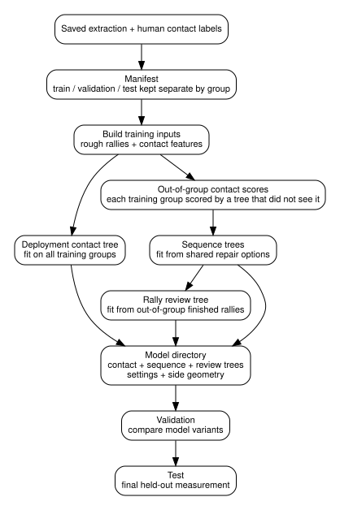

# Refit guide

Refitting trains a new set of models from labelled videos and saves them as
`models.joblib`, alongside the compatibility information in `metadata.json`.
Evaluation then checks those saved models on validation or test videos kept
out of training.

The models are trained as a set because the later models learn to repair the
list of hits produced by the contact model.

**Contents**

| Preparation | Fitting and evaluation | Settings and selected model |
| --- | --- | --- |
| [When a new fit is needed](#when-a-new-fit-is-needed) | [4. Fit commands](#4-fit-commands) | [8. Python fit settings](#8-python-fit-settings) |
| [1. Saved extraction run](#1-saved-extraction-run) | [5. Fitting process](#5-what-happens-during-fitting) | [9. Contact selection](#9-contact-selection-settings) |
| [2. Contact labels](#2-contact-labels) | [6. Validation](#6-validation) | [10. Model-selection checks](#10-checks-before-selecting-a-model-directory) |
| [3. Manifest](#3-manifest) | [7. Evaluation report](#7-reading-the-evaluation-report) | [Completed new-court refit](#completed-new-court-refit) |
| [Validation and test roles](#validation-and-test-roles) |  | [Selected model files](#which-model-files-to-use) |
| [Match groups](#groups) |  | [Comparison details](#what-was-compared) |



The commands below fit and evaluate models from a manifest: a file listing the
videos, labels and training splits. The [completed new-court comparison](#completed-new-court-refit)
used a separate experiment script. Its results and selected model files are
recorded at the end of this guide.

## When a new fit is needed

A new fit is normally needed when a change alters the frames, features or sequence alternatives seen by a fitted tree.

Common examples include:

- a new or materially changed court detector;
- a shuttle or pose change that materially changes the values seen by the models;
- changes to contact feature values, units, windows or order;
- changes to rough-rally or contact-search rules;
- a different contact score cutoff, or turning the optional rule for guarded candidates on or off;
- changes to serve or later-contact alternatives;
- changes to sequence features;
- changing between `video` and `scene` side geometry;
- a scikit-learn version change.

A change that only affects winner, landing or hit-height logic after final contacts have been selected does not by itself require a new contact/sequence fit. The [maintainer guide](maintaining.md) has a fuller table.

## 1. Saved extraction run

Training reads the same saved metadata, shuttle, pose and court files as annotation:

```text
<run-dir>/stages/
  metadata/<video-id>/...
  shuttle/<video-id>/...
  pose/<video-id>/...
  court/<video-id>/...
```

Training and later annotation need the same kind of shuttle, pose and court data. A model fitted on old court geometry is not directly comparable with one run against materially different court outputs.

Training needs the same court files that annotation will use, plus the shuttle
guard codes that flag unreliable tracking. Raw court-detector JSON needs
conversion into the dataset builder's saved court format first. A missing file or unusable
court geometry stops the command.

## 2. Contact labels

Each labelled video has a CSV with exactly these columns:

```csv
rally_id,frame,side
rally-1,100,Top
rally-1,130,Bot
rally-1,160,Top
rally-2,300,
rally-2,330,Top
```

Rules for the file:

- one row per human-labelled contact;
- frame numbers use the zero-based source-video timeline;
- `side` is `Top` for the far court half, `Bot` for the near half, or blank;
- `side` is blank when the player side is unknown;
- rows for one rally are contiguous;
- frames within a rally are strictly increasing;
- every rally/contact in the included video is labelled.

The labels provide contact times and known court halves. Rally start and end frames are not labelled separately; the evaluation code matches the labelled contacts to predicted sections.

Partial labelling can turn an unlabelled real contact into a negative training example, so the included videos need complete contact labels.

## 3. Manifest

The manifest points at the saved extraction run and assigns each labelled video to `train`, `validation` or `test`.

Example `retune/manifest.json`:

```json
{
  "run_dir": "../data/court-extracted-run",
  "videos": [
    {"id": "train-a", "group": "match-a", "split": "train", "labels": "labels/train-a.csv"},
    {"id": "train-b", "group": "match-b", "split": "train", "labels": "labels/train-b.csv"},
    {"id": "train-c", "group": "match-c", "split": "train", "labels": "labels/train-c.csv"},
    {"id": "validation-a", "group": "match-d", "split": "validation", "labels": "labels/validation-a.csv"},
    {"id": "test-a", "group": "match-e", "split": "test", "labels": "labels/test-a.csv"}
  ]
}
```

Paths are resolved relative to the manifest file. Each `id` matches a video directory name in the extraction run and can appear only once.

### Validation and test roles

Validation compares model variants with fixed video splits and labels. A
separate test set measures the chosen model on footage that did not guide its
selection. Repeated development decisions based on test errors remove that
independence. The completed ShuttleSet22 comparison below has informed such
decisions and is now a familiar benchmark.

### Groups

`group` keeps related footage together. Videos from the same match, or footage with closely shared scene/player conditions, belong to the same group.

A group can contain several video IDs but cannot appear in more than one split.

Sequence fitting needs at least three training groups. Each classifier also
needs examples of both outcomes it is learning to distinguish. For example, a
repair model needs both useful and useless edits; the review model needs both
correct and wrong rallies. This must hold for each training subset formed when
a group is held out. If one outcome is missing, fitting stops with an error.

## 4. Fit commands

With `video` geometry, one net position defines the near and far halves for
the whole video:

```bash
PYTHONPATH=src uv run python -m annotator.training fit \
  --manifest retune/manifest.json \
  --output models/annotator-video \
  --side-geometry video
```

With `scene` geometry, each camera scene's net position defines those halves:

```bash
PYTHONPATH=src uv run python -m annotator.training fit \
  --manifest retune/manifest.json \
  --output models/annotator-scene \
  --side-geometry scene
```

`--side-geometry` defaults to `video`. The fitting command reads only `train` videos and labels.

Using a separate output directory for each model variant keeps later validation results tied to the exact model that produced them.

## 5. What happens during fitting

### Contact tree

For each training video, the training code runs the rule-based preprocessing and builds contact feature rows.

Training labels are assigned around human contact frames, with distances scaled for the source FPS:

- within 1 frame at 30 FPS — positive;
- 2–4 frames away — ignored as ambiguous;
- up to 15 frames away — nearby negative;
- more distant candidate rows — sampled to fill the remaining negative budget.

All nearby negatives are kept; the remaining negative examples are sampled
with a fixed seed. Reproduction also depends on stable manifest order, because
it affects both sampling and training.

The contact fit keeps scikit-learn's automatic early stopping: a large fit sets aside part of its own training rows to decide when to stop. `ContactFitConfig.early_stopping` makes that choice explicit.

The final contact tree is then fitted on all training videos.

### Contact scores for sequence training

The sequence models need realistic contact-model mistakes to learn from.
For each training group, a contact tree is trained on the other groups and
then scores the excluded group's videos. Those scores are the sequence models'
training input. This is what the code calls out-of-group prediction: the
contact tree has not trained on the match group it is scoring.

The contact score cutoff and the optional rule for guarded candidates are applied at this point, exactly as they are during annotation. Neither changes the rows the contact tree itself is trained on.

### Sequence trees

The same code used during annotation creates possible repairs: keep the
current hits, repair the serve, remove a hit or insert a later hit.

Human labels mark which alternatives are useful or correct. Grouped fitting then trains the sequence models from those rows.

The final sequence models are fitted after the out-of-group training examples have been constructed.

The grouped sequence fits reuse those contact scores. They do not repeat the
contact-tree fitting inside each sequence-model training subset. This matches
the original procedure. The separate validation and test groups stay outside
every fit and provide the overall quality measurements.

### Rally review tree

The review tree assigns a score for ordering rallies during human review.
It learns from rally predictions made while each video's group
was held out of the sequence fit. Each predicted clip gets one of three labels:

- `1` — correct;
- `0` — known wrong;
- `-1` — not judgeable because required human side labels are missing, or because no labelled rally overlaps the section.

Rows labelled `-1` are left out of the confidence fit.

### Saved model directory

The resulting directory contains models and settings for the whole learned chain:

- contact tree;
- sequence model stack;
- rally review tree;
- contact-selection settings;
- rough-rally, mask and other preprocessing settings;
- side-geometry mode.

Keeping these together ensures that the sequence models receive the same kind of contact stream and rule-based inputs used to create their training examples.

### Reproducing the same fit

All nearby negatives are kept. Distant negative sampling uses a fixed seed and follows the order of the training videos, so manifest order is part of a reproducible comparison.

The order of the selected rows matters too. The same examples and seed fitted in a different row order give a different tree. The `fit` command samples and fits in manifest order. From Python, `fit_contact_model(..., fit_video_order=[...])` reorders the selected rows by video for the fit while sampling stays in the supplied order. Leaving it out keeps the default behaviour.

A reproducible comparison records the input files, library version, settings
and video order alongside the results. The new-court experiment's runner explicitly
sets a fit order; the general command on this page follows the manifest.

## 6. Validation

Example for the video-geometry model:

```bash
PYTHONPATH=src uv run python -m annotator.training evaluate \
  --manifest retune/manifest.json \
  --models models/annotator-video \
  --split validation \
  --output retune/validation-video.json.gz
```

Example for the scene-geometry model:

```bash
PYTHONPATH=src uv run python -m annotator.training evaluate \
  --manifest retune/manifest.json \
  --models models/annotator-scene \
  --split validation \
  --output retune/validation-scene.json.gz
```

Evaluation loads the saved model directory and does not fit anything. It reads only the requested `validation` or `test` split and uses the settings stored in the model directory. The output path must end in `.json.gz`.

## 7. Reading the evaluation report

The report contains per-video counts and totals.

### Contact metrics

Predicted and labelled contacts are matched one-to-one within ten frames at 30 FPS, scaled for each video's FPS.

The report includes:

- labelled contacts;
- predicted contacts;
- matched contacts;
- contact precision;
- contact recall.

Precision measures the fraction of predicted hits that match a label. Recall
measures the fraction of labelled hits found. Together they describe the
trade-off between extra and missed contacts.

### Rally-section metrics

A predicted rally section counts as correct when it matches one labelled rally and contains every labelled contact from that rally. It must contain no extra contacts and must agree with all known human side labels.

A missing contact, an extra contact, a merged rally, a partial rally or a contradicted known side makes a section wrong. Otherwise, missing human side labels make it unjudgeable. A predicted section that overlaps no labelled rally is also unjudgeable.

The report counts:

- judged predicted sections;
- correct predicted sections;
- unjudgeable predicted sections.

These rows count the clips the model produced. If it misses a rally entirely,
there is no predicted clip to score, so clip correctness alone hides that miss.
Rally recovery counts distinct fully correct labelled rallies divided by all
labelled rallies, including missed ones. Contact recall separately
counts how many labelled hits were found.

The hit labels used here provide no correctness measure for winners, landings
or hit heights. Changes to those rules need their own evaluation.

## 8. Python fit settings

The CLI takes the manifest, output path and choice of net geometry for player
sides. `TrainingSettings`, passed to `fit_from_manifest()` from Python,
provides the more detailed options.

Current defaults are below.

### Contact tree

| Setting | Default |
| --- | ---: |
| learning rate | `0.06` |
| max iterations | `180` |
| max leaf nodes | `31` |
| min samples per leaf | `40` |
| L2 regularisation | `1.0` |
| seed | `20260824` |
| early stopping | `"auto"` |

### Sequence trees

General sequence-tree defaults:

| Setting | Default |
| --- | ---: |
| learning rate | `0.05` |
| max iterations | `200` |
| max leaf nodes | `15` |
| min samples per leaf | `20` |
| L2 regularisation | `1.0` |
| seed | `20260905` |

The serve tree uses 100 iterations, 7 leaves and seed `20260824`.

### Rally review tree

| Setting | Default |
| --- | ---: |
| learning rate | `0.05` |
| max iterations | `100` |
| max leaf nodes | `7` |
| min samples per leaf | `20` |
| L2 regularisation | `1.0` |
| seed | `20260905` |

A comparison is easier to interpret when one variable changes at a time. For example, a contact-tree hyperparameter comparison can keep preprocessing and the data split fixed.

## 9. Contact selection settings

`ContactModelConfig` holds two settings. Both are saved in the model directory and used again at annotation time.

| Setting | Default | Effect |
| --- | ---: | --- |
| `score_cutoff` | `0.9` | Lowest contact score kept in the initial contact stream |
| `reject_masked_without_player` | `False` | When true, drops candidate frames that have a shuttle guard grade flagged as unreliable and no picked player at the five feature offsets |

[Fixed heuristics](heuristics.md#optional-rule-for-guarded-candidates) gives the exact condition for the second setting.

Both settings affect which contacts reach sequence refinement. A different value therefore also changes the sequence-model inputs and the examples used to fit the review tree. The contact tree's own training rows do not change.

Both settings are chosen through `TrainingSettings.contact_prediction` in
Python, followed by a full model fit. This lets the later models learn from
the contact stream that annotation will use. The `fit` command has no flag for
either setting. This example enables the optional rule for guarded candidates:

```python
from pathlib import Path

from annotator.contacts.model import ContactModelConfig
from annotator.training.workflow import TrainingSettings, fit_from_manifest, load_manifest

settings = TrainingSettings(
    contact_prediction=ContactModelConfig(reject_masked_without_player=True),
)
fit_from_manifest(
    load_manifest(Path("retune/manifest.json")),
    Path("models/annotator-rule"),
    settings=settings,
)
```

## 10. Checks before selecting a model directory

A complete model comparison normally includes:

- disjoint train, validation and test groups;
- full labels for every included video;
- model selection based on validation rather than test;
- both contact precision and contact recall;
- rally-section metrics interpreted as section correctness, not rally recall;
- inspection of representative changed predictions as well as aggregate counts;
- the same scikit-learn version for fitting and annotation;
- both `models.joblib` and `metadata.json` kept together;
- the selected model path recorded in the dataset-builder config (`models.annotator`).

## Completed new-court refit

The 3 October 2026 comparison selected **base**, with contact cutoff **0.9**,
`reject_masked_without_player=False` and `video` contact-side geometry. That
geometry setting uses one net position for the whole video when assigning hits
to court halves; player tracking still selects people separately within each
scene.

Base produced 273 fully correct rallies out of 668 on validation and 1,744 out
of 3,327 on ShuttleSet22. The alternative veto rule discards unreliable shuttle
candidates when no player is selected nearby. After retraining the later models
for that rule, it gained three complete rallies on validation but lost four on
ShuttleSet22, with three fewer labelled-hit timing matches on each dataset.
Its earliest review clips were better, but the advantage faded with larger
queues. Those results supported keeping the simpler base model. The
[evaluation report](../../experiments/annotator/reports/model_selection.md)
shows the gains, losses and remaining failures.

### Which model files to use

The selected final directory is `base/bundle`. It loads with Python 3.12.13 and
scikit-learn 1.9.1. Loading requires both `models.joblib` and `metadata.json`
and the same scikit-learn version used for fitting. The files are included in
[`data/annotator/sset_and_sset22_trained_20261003T041112Z`](../../data/annotator/sset_and_sset22_trained_20261003T041112Z/).
`models/annotator` in the example commands is an alternative installation location.

The run also saved a validation bundle so that the eight validation videos,
called group V, could be evaluated with a contact tree that had not trained on
them:

| Directory | Contact-tree training videos | Use |
|---|---|---|
| `base/bundle` | All 40 development videos | ShuttleSet22 and later annotation |
| `base/bundle_v32` | The other 32 videos, in groups A–D | Validation on group V |

Both bundles' sequence and review models were trained on the 32 A–D videos.
The comparison selected a model for annotation and review ordering; it did not
choose a new automatic-acceptance threshold. Winner, landing and hit-height
accuracy need separate labels and were not established by this evaluation.

### What was compared

Both base and veto used the released 86-video patched court dataset. They
shared contact features and fitted contact trees, then fitted separate
sequence and confidence models. To make the run reproducible, contact sampling
kept the historical per-fit order and the selected training rows were fitted
in ShuttleSet video-ID order. The [reproduction guide](../../experiments/annotator/reports/model_selection.md#reproduction)
records the code and court-release revisions and the commands.

Both models were evaluated on validation and ShuttleSet22 before selection.
The 46-video ShuttleSet22 set excluded video 15 because its labels were
misaligned. The development video named `sset_15` belongs to the original
ShuttleSet dataset and stayed included. ShuttleSet22 had already helped guide
earlier changes, so its results describe performance on familiar footage.

Compared with the [recent old-court refit](../../experiments/annotator/reports/refit_regression.md),
base recovered ten more complete rallies and 671 more labelled contacts on
ShuttleSet22. Courts, fitted models and contact-fit row order all changed in
that comparison, so the result measures their combined effect.
