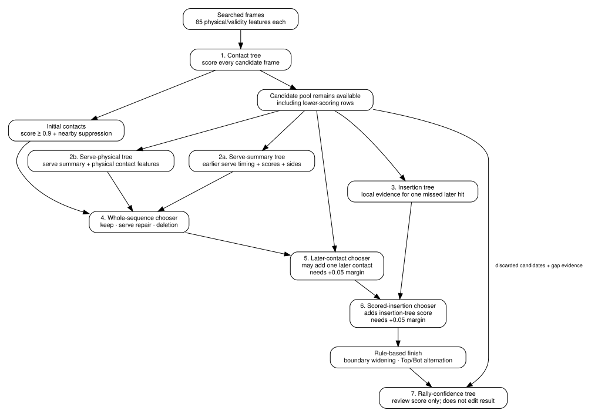

# How the trees work together

The annotator's eight fitted classifiers work in sequence. One scores possible
hits, others judge repairs to the contact sequence, and the final classifier
ranks completed rallies for review. Earlier scores help the later classifiers
make those decisions. All eight use histogram gradient boosting.

## The stack in one table

| Model | Question it answers | Main evidence |
| --- | --- | --- |
| Contact tree | Does this searched frame look like a real racket contact? | shuttle motion, impulse, wrist geometry, player movement and missing-data signals over time |
| Serve-summary tree | Would this earlier candidate improve the first contact? | contact scores, timing, side availability and add/replace choice |
| Serve-physical tree | Same serve question, with the raw physical contact features included | serve-summary inputs plus the 85 contact features for the candidate and existing first contact |
| Insertion tree | Does this later candidate look like a useful missing contact? | candidate score, surrounding time gaps, side consistency and the candidate's physical features |
| Whole-sequence chooser | Is a keep/serve-repair/delete option a complete correct sequence? | before/after sequence summaries, edit type, serve scores, side agreement, deleted/candidate physical evidence |
| Later-contact chooser | Is an option with or without one later insertion better? | whole-sequence inputs plus insertion context |
| Scored-insertion chooser | Same sequence choice, now with the insertion tree's judgement available | later-contact inputs plus insertion-model score |
| Rally-confidence tree | How much does the finished rally resemble correct held-group predictions? | chooser margins, discarded candidates, gap evidence, side agreement and sequence summaries |

All eight models are `HistGradientBoostingClassifier` instances.

## 1. Contact probability

The contact tree sees one row for every frame inside the rule-based search regions. Each row has 85 values: 17 physical or validity signals sampled at five time offsets.

Training labels are built from human contact frames:

- a searched row within 1 frame at 30 FPS of a labelled contact is positive;
- rows 2–4 frames away are ignored as ambiguous;
- nearby negatives through 15 frames are retained;
- more distant negatives are sampled, with a nominal budget of 24 negatives per positive;
- the classifier uses balanced class weights.

The classifier combines shuttle, wrist, player-motion and missing-data evidence
into a **contact score**, returned by `predict_proba(...)[..., 1]`. The initial
contact stream keeps rows scoring at least `0.9`, then keeps only the strongest
score among nearby duplicates. That value controls selection; interpreting it
as a 90% chance of a real hit would require a separate calibration check.

### The cutoff does not discard the rest of the candidate pool

Rows below `0.9` can still matter later.

The sequence stage keeps access to the contact tree's scores for all candidate rows. It can shortlist an earlier serve or one later missed-contact candidate even when that frame did not survive the initial `0.9` cutoff. Sequence evidence can therefore recover a lower-scoring contact when it makes the rally as a whole look better.

This is the main reason the contact tree and sequence trees are better thought of as a stack rather than independent filters.

### The optional rule removes rows before scoring

A model directory can turn on `ContactModelConfig.reject_masked_without_player`. It is off by default. When on, candidate rows with a shuttle guard grade flagged as unreliable and no picked player at the five feature offsets are removed before the contact tree scores anything. Those rows are then missing from the whole candidate pool, including the serve and later-contact shortlists described below. [Fixed heuristics](heuristics.md#optional-rule-for-guarded-candidates) gives the exact condition.

The rule does not change which rows the contact tree is trained on. It changes the candidates that the sequence trees and the rally-confidence tree are trained and run on.

## 2. Serve models

The sequence stage can consider up to two earlier serve candidates before the first selected contact.

Two trees score each possible add-or-replace serve edit.

### Serve-summary tree

The first tree sees compact facts such as:

- the earlier candidate's contact score;
- the current first contact's score;
- how far apart they are;
- how close the candidate is to the rough rally start;
- rally duration;
- whether the earlier candidate was already in the initial contact stream;
- whether each candidate has a known `Top`/`Bot` guess;
- whether the two raw side guesses agree;
- whether the edit adds the earlier contact or replaces the current first contact.

### Serve-physical tree

The second serve tree sees those same summary values plus the complete 85-feature contact rows for both the earlier candidate and the current first contact.

The two scores are then attached to the sequence options as extra evidence for the main sequence choosers.

## 3. Insertion model

A rough rally can also have a plausible contact missing later in the sequence. Up to six later candidates are shortlisted from the contact tree's scored rows.

The insertion tree looks at one candidate in the context of the current sequence. Its inputs include:

- the candidate's contact score;
- time to the selected contact on the left and right;
- whether its raw side agrees with neighbouring contacts;
- the current `Top`/`Bot` vote balance;
- the candidate's 85 physical contact features.

Its training target asks whether adding that candidate creates a new match to a human-labelled contact without damaging the contacts already matched.

## 4. Whole-sequence chooser

The first main chooser compares options that do not contain a later insertion.

Possible edits include keeping the sequence, repairing the serve, deleting one contact, or combining an allowed serve repair with one deletion.

The chooser can see:

- contact count and rally duration before and after the edit;
- minimum, median and weakest-contact scores;
- shortest and longest gaps between contacts;
- time from rally start to first contact and from last contact to rally end;
- number of contacts with unknown sides;
- edit type;
- serve-model scores;
- score of a deleted contact;
- how well raw sides fit an alternating `Top`/`Bot` pattern;
- physical feature rows for the original first contact, serve candidate and deleted contact where applicable.

Training labels call an option correct only when it reproduces the complete human-labelled contact sequence and the known court-half labels within the configured timing tolerance.

The unchanged sequence remains the reference. An edit must score strictly higher before the chooser switches away from it.

## 5. Later-contact chooser

The second chooser sees the same option pool, now including options with one later candidate inserted.

It receives the whole-sequence evidence plus insertion context such as left/right timing gaps, raw side relationships and the candidate's physical features.

A new choice replaces the previous stage's choice only when its score is at least `0.05` higher. This avoids changing the sequence for a marginal improvement.

## 6. Scored-insertion chooser

The third chooser repeats that comparison with one extra input: the insertion tree's own score for the proposed added contact.

This lets the final sequence choice combine two views of the same candidate:

- **local insertion evidence** from the insertion tree;
- **whole-rally evidence** from the sequence chooser.

The same `0.05` margin applies before this stage can replace the preceding choice.

The option pool does not grow between chooser stages. The models are rescoring the same finite alternatives rather than repeatedly inventing new contacts.

## 7. Boundary and side rules run after the sequence trees

The selected sequence then passes through two rule-based steps:

- rally boundaries can widen around the final contacts without changing which contacts belong to the rally;
- raw `Top`/`Bot` guesses are reconciled into the alternating court-half pattern that best matches the available evidence.

These operations are not extra trees.

## 8. Rally-confidence tree

The confidence tree does not change the annotation. It produces the review-ordering score returned as `rally_confidence`.

Its evidence is deliberately broader than the selected sequence itself. It includes:

- the selected sequence score;
- the margin over the next-best output;
- the best insertion and alternative-start scores;
- how many candidate contacts were discarded;
- the strongest discarded contact score;
- where that discarded candidate sits between selected contacts;
- whether adding a discarded candidate would improve side alternation;
- raw side coverage and vote balance;
- the finished sequence summary;
- physical evidence for the strongest discarded candidate;
- how many gaps contain unused candidates;
- local insertion-model scores inside those gaps;
- the longest empty gap and whether the final gap still contains a candidate.

During fitting, the target is whether the whole predicted rally section is correct. Unjudgeable sections are excluded from the fit.

The returned value is useful for ranking review work. It is not an independent contact probability and is not assumed to remain calibrated after a dataset shift.

## How training avoids self-scoring

Several later trees consume scores produced by earlier trees. Their training procedure prevents a model from learning from upstream predictions fitted on the same video's group.

For training videos:

1. the contact score for a video's sequence-training rows comes from a contact tree fitted without that video's group;
2. serve and insertion scores used to train a chooser come from upstream models that exclude the chooser row's group;
3. rally-confidence rows come from complete sequence predictions made by models that held that group out.

The final saved models are fitted on all training groups after those cross-fitted training rows have been built.

The [refit guide](retuning.md) describes the split and grouping mechanics in more detail.

## What is stored in `models.joblib`

`models.py` uses `joblib.dump()` to save the fitted classifiers and their
settings together as one `AnnotatorModels` object in `models.joblib`.

It contains:

- 1 contact classifier;
- 6 sequence-stage classifiers in `SequenceModels`;
- 1 rally-confidence classifier;
- the contact score cutoff and the optional rule for guarded candidates;
- the preprocessing settings used with those models;
- the chosen side-geometry mode.

`metadata.json` sits beside it and records the schema, exact scikit-learn version, contact feature order and side-geometry mode. Both files are required for loading.
