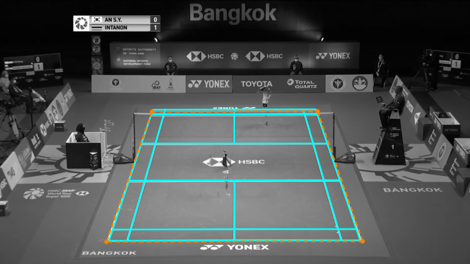
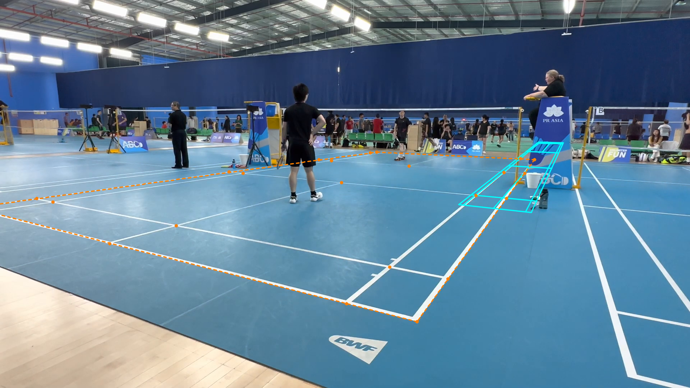
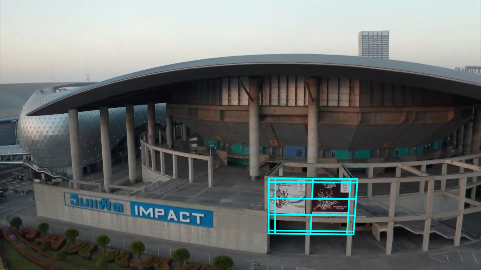

# First experiment: image lines cannot yet replace CourtKeyNet

The first custom line-based prototype is not ready to replace CourtKeyNet. It can
recover a full broadcast court without neural corner predictions, but its
acceptance rules still admit severe errors. All three accepted amateur fits
were wrong, and a building passed as a court. Production remains unchanged.

This development pass tests court recovery from visible painted lines alone.
It allows corners outside the image and keeps competing court placements.
The aim is to support static cameras with cropped or occluded courts while
rejecting fits that the image cannot resolve.

## What was compared

The prototype extracts OpenCV line fragments, groups them into two directions,
and matches possible line identities to the badminton layout. It scores only
the visible portions of finite painted markings. The net is excluded from the
floor template. The design draws on tennis-court-detection and MonoTrack's
badminton adaptation; the implementation is custom Python.

The comparator is the existing CourtKeyNet model and its line-based fallback,
run afresh on the same single images. Raw model validity and availability of a
combined model-and-line proposal are separate outputs. This comparison does
not run production scene acceptance, player checks, repair or calibration
sharing. A proposal count therefore does not measure usable production courts.

The development images cover these populations:

| Population | Images and reference scope |
| --- | --- |
| Original ShuttleSet broadcasts | 20 cached median images from videos 3 and 21; 18 match the official reference view. Two visibly mixed-camera medians have no numerical score. |
| Amateur courts | All 11 committed labelled frames from four videos; every frame has extrapolated corners. Three cameras are static; one moves between labelled frames. |
| Broadcast controls | 24 sampled raw frames from original video 21: eight visually labelled non-court frames and 16 unlabelled camera-view challenges. |

Each broadcast median combines three resized grayscale samples. These are
images from two broadcasts, not 20 independent videos or raw gameplay frames.
Video 3 contributes the six largest historical local-corner errors and four
spaced controls. Video 21 contributes ten spaced cases. Selection preceded the
new detector outputs. Scenes 10 and 39 in video 21 were excluded from numerical
scoring after visual inspection of their mixed views.

These are development results. Search settings and rejection rules changed
during the work, including after synthetic review failures. No held-out claim
is made. ShuttleSet22 supplied no tuning or feature selection.

Errors below use 1280x720 coordinates. An **accurate proposal** has at most
15 pixels of error at its worst corner, including extrapolated corners. This
is a descriptive reporting tolerance, not a fitted production threshold.
Amateur landmark root mean square (RMS) separately measures Euclidean
reprojection error over visible reference clicks. Reference geometry never
enters the detector.

## What happened

| Population | Experimental acceptance | Correctness of accepted fits |
| --- | ---: | --- |
| Broadcast medians | 2/20 | One matches the reference within 7.1 px at every corner; the other is a mixed-view image with no numerical score. |
| Amateur frames | 3/11 | 0/3 meet the 15 px tolerance. Worst-corner errors are 891.9–925.7 px; visible-landmark RMS is 358.1–426.1 px. |
| Raw controls | 3/24 | One of eight non-court frames is accepted. The other two accepted frames are unlabelled and have no measured accuracy. |

The fresh baseline produced no model-valid detections or fallback proposals
on the 11 amateur frames. On the 20 broadcast medians it produced two
model-valid detections and 20 combined proposals. These counts describe the
single-image proposal stage only.

Proposal accuracy tells a different part of the story. On the 18 matching-view
broadcast medians, the prototype's highest-scoring proposal meets the 15 px
tolerance in 15/18 cases. Only one of those 15 is accepted. The existing combined
model-and-line proposal meets the tolerance in 14/18 cases; raw model output
does so in 18/18 despite failing its validity gate on all 18. The two model-valid
cases are the unscored mixed-view medians. This comparison exposes the difference
between geometric accuracy and a detector's acceptance rules.

Among the up to 32 retained candidates per image, the best reference match meets the
tolerance in 16/18 broadcast cases and 0/11 amateur cases. This label-guided
selection measures what the candidate pool contains; it is not an available
automatic selection rule. One amateur image has no retained candidate.

The examples show why support scores cannot serve as confidence. Solid cyan
lines show the predicted painted markings. Dashed orange outlines and orange
points show reference geometry where available.

Video 21, scene 0: accepted, with 7.1 px worst-corner error. The input is a
grayscale median image; faint duplicated players come from its three samples.

Amateur video BkjErIAsZu4, frame 150: accepted despite 905.4 px worst-corner
error and 426.1 px visible-landmark RMS. Visible court structure does not ensure
the search assigns the right lines to the target court.

Original video 21, frame 100347: a non-court image passes the same line-support
rules. Architectural edges can supply a plausible template match.

## Why the detector fails

The current direction split assumes an upright view from behind a baseline.
It favours a nearly horizontal baseline and can lose the actual line families
in oblique amateur views. A label-guided diagnostic inserted the reference
transform directly into an earlier scorer: only 3/11 amateur courts passed
its observed-line support rules. Those three reference fits were also absent
from the search's retained candidates. This diagnostic used the earlier
4-pixel merge and three-line minimum; it is not a final-detector accuracy result.

The final search retains at most 32 distinct candidates. A large score gap
can reflect a missing competitor. Its spatial ambiguity rule also rejects a
good court when background structures form a separate supported candidate.
Increasing rejection alone trades false acceptance for lost useful courts.

Independent review reproduced two synthetic defects: opposite Canny edges of
one stripe counted as separate markings, and retaining only one candidate
disabled ambiguity comparison. The final version widens stripe merging to
8 working pixels, requires four observed lines in each direction, and requires
at least two retained-candidate slots. Any pair of spatially separate supported
court regions makes the result ambiguous. Synthetic regressions pass, but the
real false acceptances above remain.

These four-line requirements also exclude some valid partial courts. The
experiment demonstrates off-screen coordinate handling; it does not establish
reliable recovery when a baseline is missing. Court support scores and score
gaps are uncalibrated measures of image agreement, not probabilities.

## Decision and next work

Keep this fitter as an isolated experiment. Its false acceptances make a
production replacement unsafe for player-to-court projection and downstream
movement features. The baseline's amateur failures also remain unresolved;
the result does not justify more CourtKeyNet-specific recovery exceptions.

The next bounded experiment should improve line-family recovery and candidate
selection on complete courts with occlusion. It must recover labelled courts
and reject the existing non-court controls before expanding partial-view
coverage. Use the same retained failure cases to distinguish better line
extraction from better assignment of lines to a court.

DeepLSD has not been evaluated. The reference-transform diagnostic does not
show that sharper fragments would fix grouping or candidate ranking, so adding
a neural line detector is a hypothesis to test, not an established solution.
The optional OpenCV line segment detector (LSD) is implemented but has no
reported comparison.

The three additional static-camera examples E8WW8DFCnwk, Cb-xs5rPyxI and
l-I_Di1Ad2Y were not evaluated in this first pass: gameplay downloads returned
HTTP 403. A retry with updated download tools belongs to the next experiment.

## Evidence and reproduction

The [experiment README](../../../experiments/annotator/independent_court/README.md)
documents the manifest and evaluation commands. Its `recorded` bundles preserve
all 55 cases, reference coordinates, retained candidates, settings and decisions.
They also contain the 31 fresh baseline records. Full input images remain
external; the three overlays above are included for inspection.

The detector revision is `064d988`. A final ambiguity correction was replayed
over unchanged saved candidates, changing only video 21 scene 24 to rejected.
A fresh search on that case reproduced all candidates, scores and the final
decision exactly. Saved timings cover the original concurrent CPU runs and
exclude the acceptance-only replay; they are not a speed benchmark.

The 13 detector and evaluator boundary tests pass. Scoped Ruff and Pyrefly
checks pass. The earlier whole-project Pyrefly run reported 11 findings.
The 8 September audit found 13 with the same local profile, including two
unresolved imports of the new experiment package. Adding the repository root
to the local search path resolves those and other repository imports. Three
missing optional VLM dependency imports remain (exit 1).
Production code was unchanged, so the prior production suite was not rerun.
