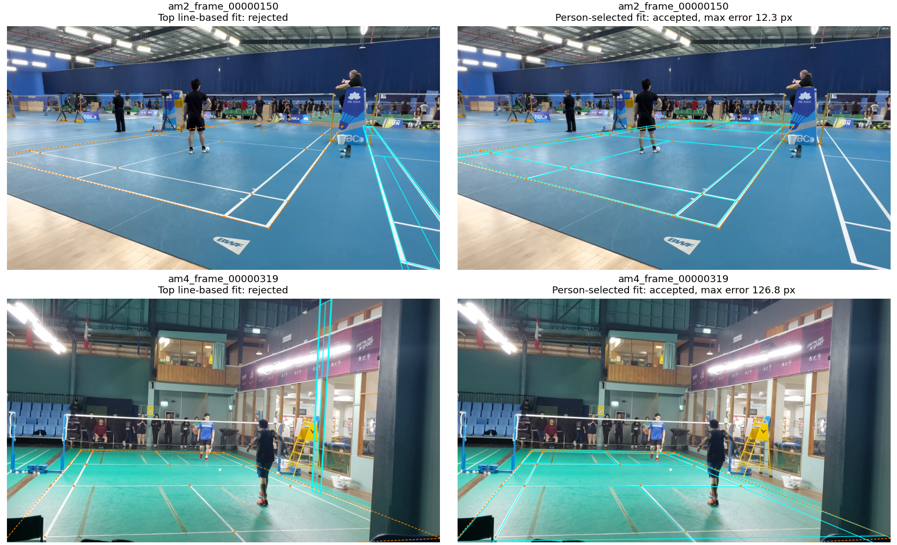
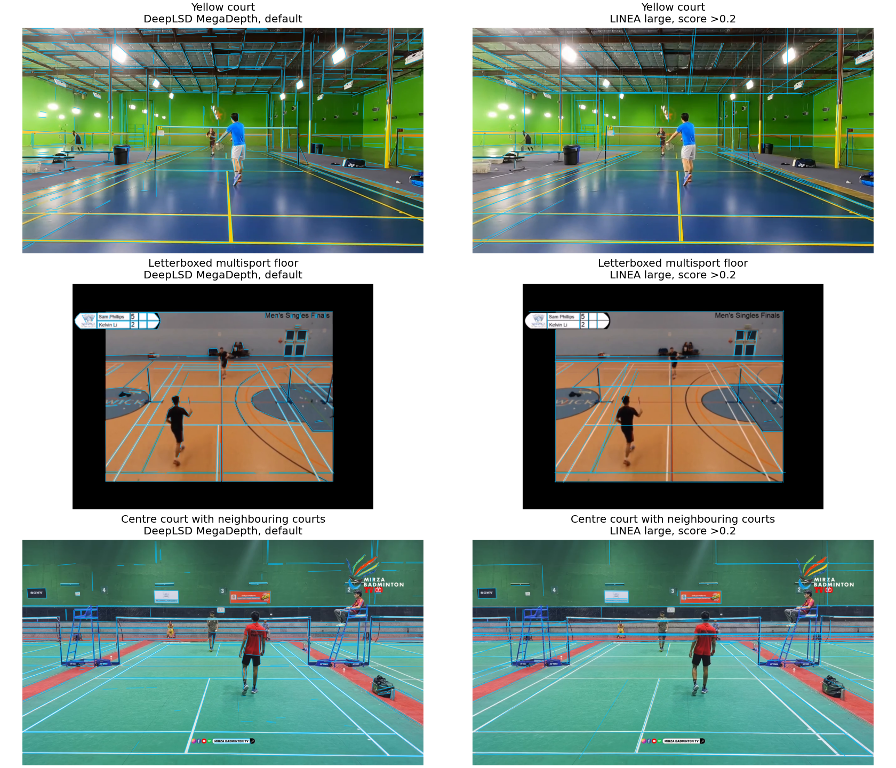

# Neural lines and partial-court fitting

The custom detector cannot yet replace CourtKeyNet. DeepLSD and LINEA provide
useful court lines, but the current fitter still selects wall grids,
neighbouring courts and service lines mistaken for court boundaries. Broader
line groups recover useful candidates, but the person check still accepts
incorrect fits.

Further threshold patches to this prototype are paused. The next substantial
attempt needs better identification of the target court and its individual
markings. Static-camera manual annotation remains necessary for unresolved
views. No production model or annotation pipeline code changed.

Court geometry lets the annotation pipeline map image positions into shared
court coordinates and check which detected people are on court. A wrong fit
can therefore corrupt the evidence used to select gameplay frames. Reliable
geometry is necessary for extending automatic annotation to amateur videos.

## Images and measures

These are development results from 58 selected images, not a general reliability
estimate. Every neural variant used the same inputs:

| Input set | Images | Reference status |
| --- | ---: | --- |
| Original ShuttleSet broadcast medians | 20 | 18 match the reference view; two mixed-camera medians are unverified and unscored |
| Committed Curtis amateur reference frames | 11 | Labelled frames from four videos; off-screen corners are extrapolated from clicked landmarks |
| Original-video controls | 24 | Eight non-court images and 16 unlabelled view challenges, including oblique and multiple-court views |
| Newly downloaded static-camera gameplay examples | 3 | Unlabelled; used for qualitative inspection only |

Each broadcast median combines three sampled frames. One Curtis video moves;
the other three have static views. The new examples are single gameplay images;
temporal scene aggregation was not evaluated.

An **accurate fit** has maximum corner error at most 15 pixels in 1280x720
coordinates, including extrapolated off-screen corners. This is a descriptive
development criterion. A **retained candidate** is a fit kept by the search;
the **top proposal** is its highest-ranked fit. **Acceptance** means the
experimental support and ambiguity rules passed. An accepted fit can still be
wrong.

The fitter samples rectangles formed by image lines and tries them against the
badminton template. It scores visible portions of 12 finite painted segments;
the net is excluded. The experiment tests whether this custom geometry search
and frozen neural line detectors can replace CourtKeyNet on partial views.

This follows the [first OpenCV experiment](independent_detector.md). In that
earlier comparison, CourtKeyNet's raw corners were accurate on all 18 matching
broadcast views, although none passed its model-validity check. Useful corner
geometry and the rules that accept it need separate assessment.

## Original geometry: no accurate amateur proposals

Four frozen neural variants were compared with the two OpenCV baselines.
“MD” denotes MegaDepth weights. DeepLSD's “hard” setting disables
image-gradient checking; “default” enables it. Full inference settings are
listed below.

| Extractor | Accurate broadcast accepts /18 | Wrong broadcast accepts /18 | Wrong amateur accepts /11 | Non-court accepts /8 | Unlabelled control accepts /16 |
| --- | ---: | ---: | ---: | ---: | ---: |
| OpenCV Hough | 1 | 0 | 3 | 1 | — |
| Hough with painted-stripe filter | 10 | 0 | 4 | 0 | — |
| DeepLSD MD hard | 2 | 1 | 1 | 0 | 5 |
| DeepLSD MD default | 12 | 3 | 2 | 1 | 5 |
| DeepLSD Wireframe hard | 4 | 2 | 2 | 1 | 4 |
| LINEA large | 5 | 7 | 0 | 0 | 2 |

All six methods produced **zero accurate amateur top proposals and zero accurate
amateur accepts**. LINEA rejected all eleven amateur frames. Its useful visible
fragments did not meet this fitter's support rules at the reference courts. That result applies to this model-and-fitter
combination, not LINEA in general.

The optional painted-stripe filter remains the strongest broadcast result in
this comparison: 10 accurate accepts and no wrong accepts among the 18 labelled
views. MD default accepts more accurate fits, but also accepts three wrong ones.

The two unverified broadcast medians are excluded from accuracy counts.
Unlabelled controls are separate from non-court controls because their accepted
fits have unknown correctness. Dashes mean counts are not reported here.

## Broader groups recover candidates, but selection still fails

The original fitter groups lines around one dominant nearly horizontal angle.
Projected court lines fan out under perspective. A diagnostic using the known
amateur homographies—the mappings between the reference court and image—found
63 of 252 visible crosscourt markings outside the original 12-degree direction
tolerance. The fitter therefore sometimes removes lines needed to support the
reference court.

A fixed broader grouping admits lengthwise lines with absolute angle at least
10 degrees and crosscourt lines with absolute angle at most 35 degrees. The
groups overlap. The experiment also lowered the minimum number of distinct
observed lines from four to three per direction. Other scoring and ambiguity
rules stayed fixed.

The following diagnostic asks whether the detected lines support the **known
reference court**. It uses labels to test available evidence; these counts are
**not automatic detection accuracy**.

| Reference-support diagnostic | MD hard | MD default | Wireframe hard | LINEA large |
| --- | ---: | ---: | ---: | ---: |
| Original groups, minimum four lines | 0/11 | 2/11 | 1/11 | 0/11 |
| Broad groups, minimum four lines | 3/11 | 4/11 | 3/11 | 0/11 |
| Broad groups, minimum three lines | 9/11 | 10/11 | 9/11 | 3/11 |

Labels did not enter line extraction, grouping or the subsequent unaided
searches. Full searches with broad groups and three-line support then ran for
both MegaDepth variants on all 58 images:

| Broad-group search | Accurate amateur candidates retained /11 | Accurate amateur top proposals /11 | Amateur accepts /11 | Accurate broadcast accepts /18 | Non-court accepts /8 |
| --- | ---: | ---: | ---: | ---: | ---: |
| MD default | 4 | 0 | 0 | 2 | 1 |
| MD hard | 0 | 0 | 0 | 0 | 2 |

MD default ranked a wrong court first in every amateur frame. Both variants
rejected all eleven amateur outputs as ambiguous. MD hard accepted no broadcast
fits. Broader support recovers useful geometry, but does not provide a useful
replacement acceptance rule.

## A person check accepts both correct and incorrect courts

The existing person rule requires exactly two detections within a margin around
the proposed court. It rejects a plausible fit in the new letterboxed example
because a seated spectator enters that margin. It rejects the centre-court fit
because an extra overlapping person box enters the margin.

A separate diagnostic requires at least one detected footpoint inside each
court half. This allows doubles and uses no extra court margin. Broadcast
medians use votes from the three underlying raw-frame pose samples. Other
images use frozen RTMDet person boxes from the same image. At least half the
samples must pass. Candidate scores and ambiguity rules stay unchanged.

With broad-group MD default candidates, the check accepts one accurate amateur
fit and one wrong fit. The wrong fit has maximum corner error **126.8 pixels**.
The other three accurate retained candidates remain rejected. With
painted-stripe Hough candidates, the check accepts 14 accurate broadcast fits
and one wrong fit with maximum error **1654.1 pixels**. These errors rule out
using the person check as a sufficient acceptance condition.

*Cyan shows the proposed court; dashed orange shows the reference. The left
column shows the original top proposal, and the right shows the person-selected
proposal. These are both accepted amateur outcomes for MD default: one accurate
and one wrong. Errors use 1280x720 coordinates and include off-screen corners.*

## The three new videos: useful lines, unresolved acceptance

The new samples are the [yellow court](https://www.youtube.com/watch?v=E8WW8DFCnwk),
[letterboxed multisport floor](https://www.youtube.com/watch?v=Cb-xs5rPyxI) and
[centre court with neighbouring courts](https://www.youtube.com/watch?v=l-I_Di1Ad2Y).
They come from sections starting at 120, 720 and 120 seconds, respectively.
The 720-second section avoids an interview in the second video. Saved inputs
record the selected decoded frame and section boundaries.

*Blue strokes show detected line fragments, not accepted courts. Both models
also detect ceilings, walls and other sports' markings. The three rows cover
all newly supplied videos; they were not selected by detector success.*

With the original geometry, MD default and Wireframe hard accepted the
letterboxed example. All other neural outputs for these three images were
rejected. With the separate person check, painted-stripe Hough produced
qualitatively plausible accepts for the letterboxed and centre-court examples;
the yellow court remained unsupported. Broad-group MD default with this check
remained ambiguous on all three.

These outcomes were evaluated without numerical ground truth. They support
visual inspection, not pixel-accuracy claims.

### Manual annotations — 2026-09-08

Each example clip now has three manually annotated frames:
`E8WW8DFCnwk_sample.mp4` frames 14/90/156, `Cb-xs5rPyxI_gameplay.mp4` frames
45/58/78, and `l-I_Di1Ad2Y_h264.mp4` frames 36/64/71. The
[annotation dataset](../../../data/amateur_court_corners/2026-09-08/README.md)
contains compressed corner and landmark CSVs, source clip details and overlays
for all nine frames. Source videos remain local. Hidden corners were projected from
the marked landmarks. Frame numbers are local to the clips. The nearby frames
cover one camera view per video, rather than the full source videos.
The published evaluation results have not been rescored against these annotations.

## What the next attempt needs

Line extraction, court identification and acceptance are separate problems.
Neural models provide useful line evidence, but more detected lines alone have
already been tested. The next attempt needs stronger identification of the
target playing surface before fitting and better assignment of detected lines
to court markings. Testing the arrangement and finite extent of inner markings
is another useful direction.

CourtKeyNet cannot safely be removed on this evidence. Further threshold patches to
this unanchored rectangle search are paused.

## Settings, evidence and validation

The neural models were frozen. No training or manual image regions were used.
ShuttleSet22 supplied no tuning or feature selection.

| Extractor | Weights and inference settings |
| --- | --- |
| DeepLSD MD hard | MegaDepth; image-gradient checking disabled |
| DeepLSD MD default | Same MegaDepth weights; image-gradient checking enabled |
| DeepLSD Wireframe hard | Wireframe; image-gradient checking disabled |
| LINEA large | Large HGNetv2 checkpoint; score strictly greater than 0.2 |

DeepLSD uses grey images with longest dimension at most 960. Its normal line
filter is enabled and line merging is disabled. LINEA uses the authors' RGB
640x640 preprocessing. Both return native-image XY coordinates to the same
court fitter. The [frozen line caches](../../../experiments/annotator/independent_court/recorded/neural_lines/)
record source commits, weight hashes and exact configurations. Upstream
instructions are available for [DeepLSD](https://github.com/cvg/DeepLSD#usage)
and [LINEA](https://github.com/SebastianJanampa/LINEA).

The [portable experiment](../../../experiments/annotator/independent_court/README.md)
contains inference and evaluation commands. `--wide-families --min-supported-lines 3`
reproduces the broader geometry probe. The
[neural evidence bundle](../../../experiments/annotator/independent_court/recorded/neural.json.gz)
contains all **348 court searches: 232 with original geometry and 116 with broad
groups**. It preserves inputs, all retained candidates, decisions,
reference-support diagnostics and person replays. Four separate caches preserve
all neural line predictions and their image, model and source provenance.
The original OpenCV evidence remains unchanged.

Validation recorded:

- 28 focused tests, plus scoped Ruff and Pyrefly checks with exit code 0
- 16 portable-export parity checks: line coordinates and scores matched exactly
  on four representative images across four model variants
- Fresh public-CLI court runs matching the private default and broad-group runs
  exactly
- Independent reviews of inference and cache boundaries, which prompted fixes
  for cache-content SHA hashing and upstream source-path priority

Two long local control jobs ended before completion. Controls were recovered
through independent per-image runs with the same frozen settings and seed.
Completed results were joined in manifest order. Timings reflect concurrent
CPU work and are not a performance benchmark.
