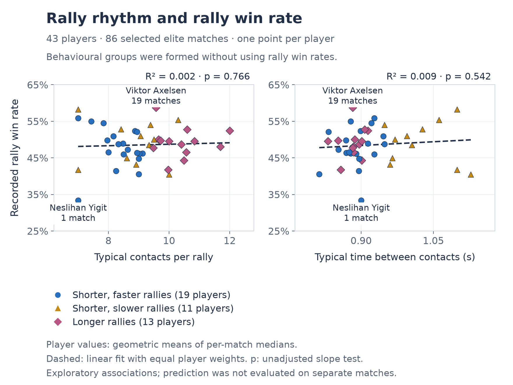
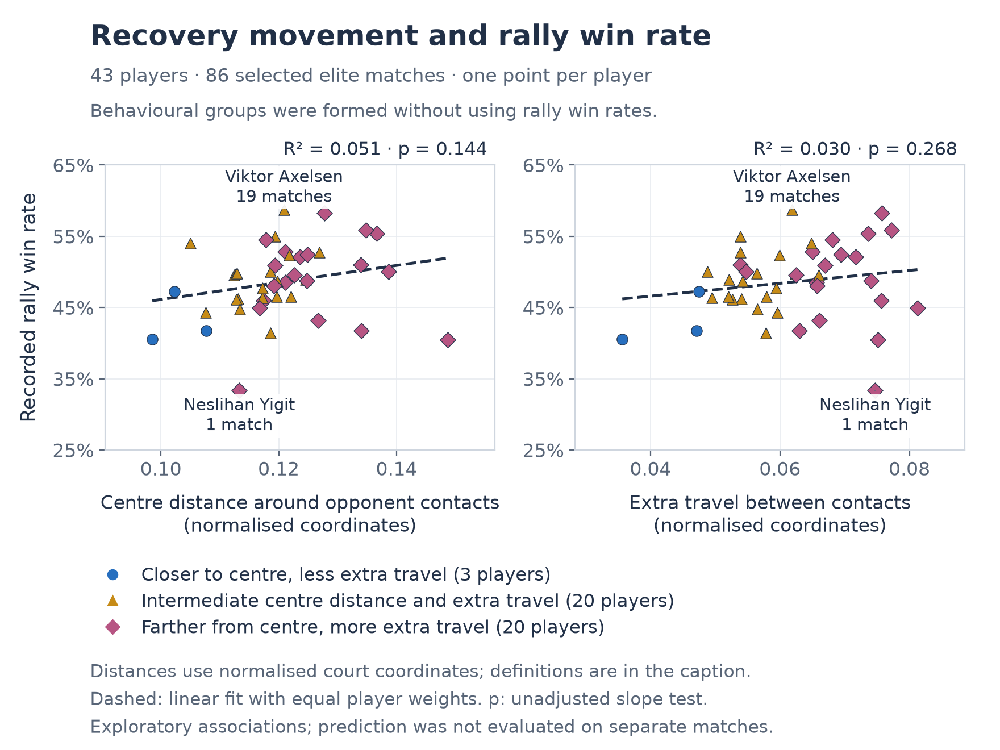
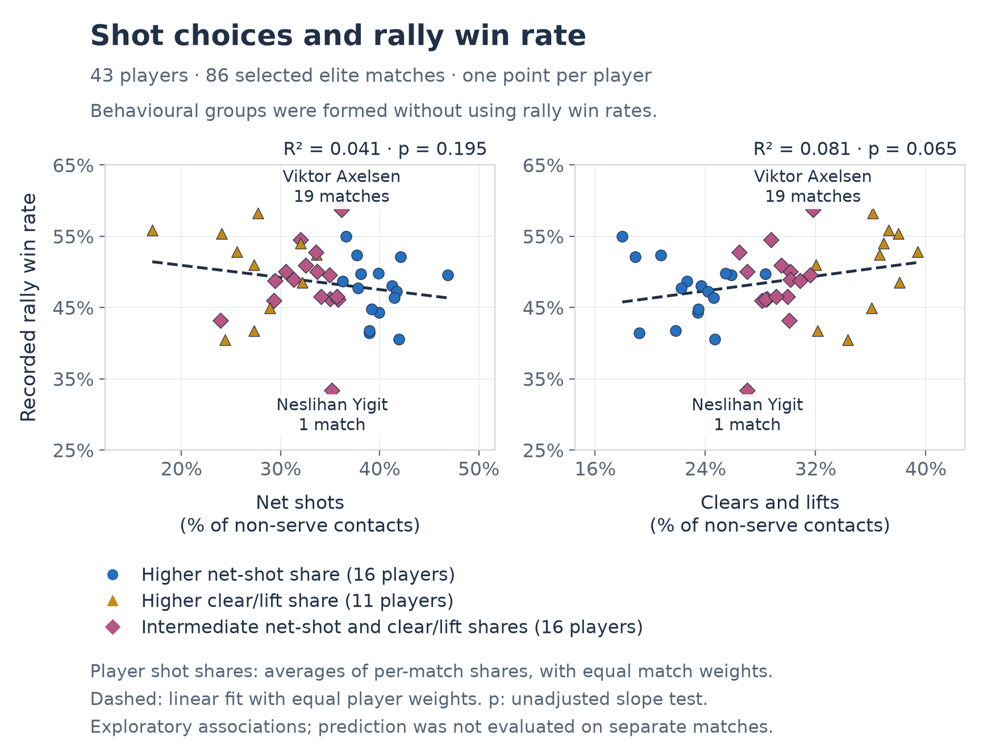
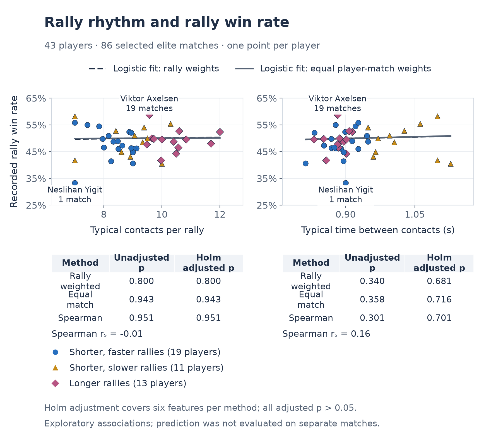
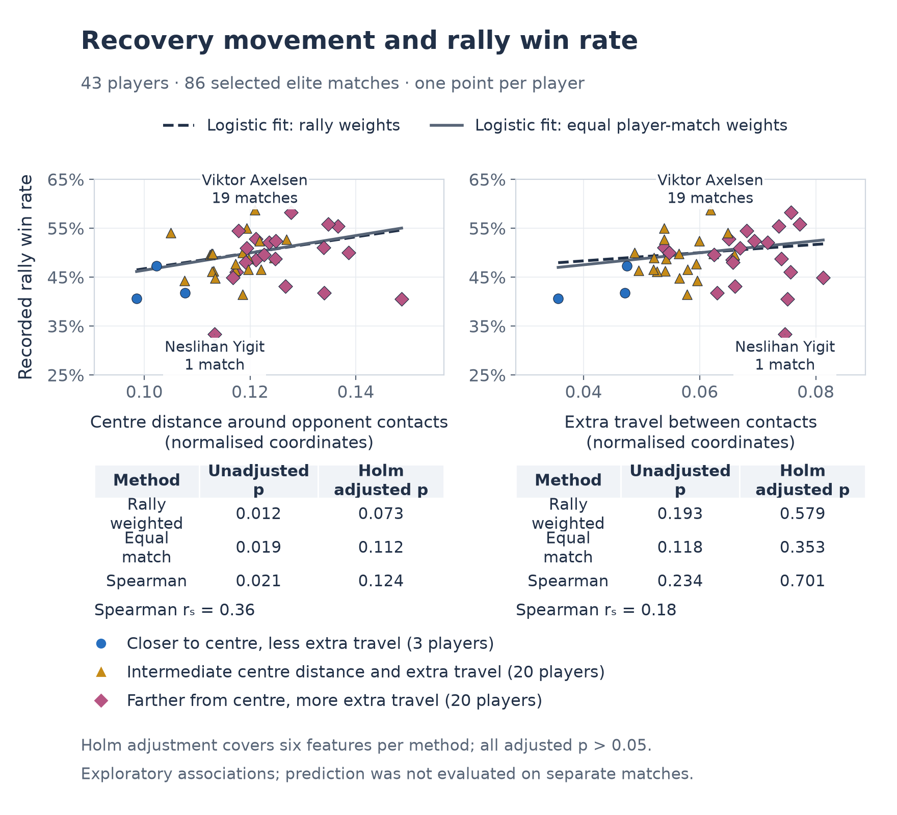
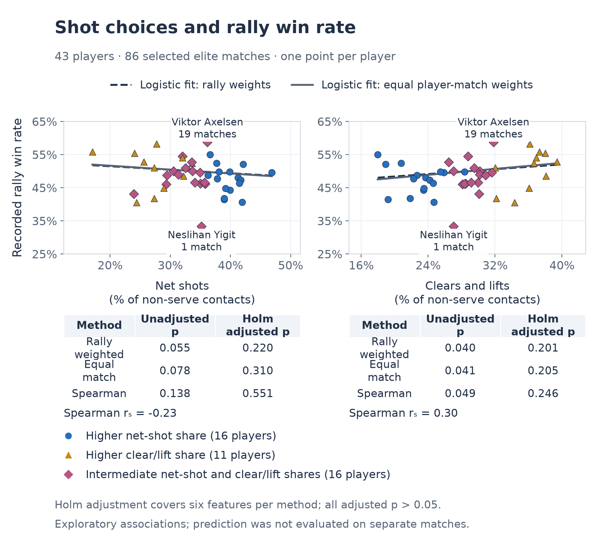

# Player feature evaluation: figures

> **[Figure placement: keep Figures A12–A17 together in the report appendix, after Figure A11.]** These figures support the short evaluation in [the report text](evaluation.md).

## Shared methods note

Each panel shows 43 players from 86 elite matches. Win rates pool 6,857 rallies whose winner labels agreed with score changes; 353 outcomes were excluded. Colours and shapes indicate three behavioural groups formed without win rates. Groups differ between rhythm, movement and shot-choice views.

In A12–A14, dashed lines are linear fits with equal player weights; R² is the fraction of win-rate variation explained, and p-values are unadjusted. In A15–A17, dashed curves use rally weights and solid curves give each player-match equal weight. Spearman rₛ correlates feature and win-rate ranks. Holm adjustment covers six features per method; all adjusted p-values exceed 0.05. Logistic standard errors account for both players in each match; recurring players and opponent strength remain limitations.

### Figure A12. Rally rhythm and rally win rate

Contacts per rally and seconds between contacts are geometric means of each player's match medians, with equal match weights. Both measures describe exchanges involving both opponents.

### Figure A13. Recovery movement and rally win rate

Centre distance is measured from the player's court-half centre around opponent contacts. Extra travel is path length minus straight-line distance between contacts. Distances use normalised court coordinates and are averaged as in A12. Tracking and court calibration were not independently checked for this analysis.

### Figure A14. Shot choices and rally win rate

Net-shot and clear/lift shares average per-match proportions of labelled non-serve contacts, with equal match weights. Grouping uses all six shot shares.

### Figure A15. Rally rhythm and rally win rate: logistic fits and Spearman correlation

Logistic and Spearman checks for the same measures and player groups as Figure A12.

### Figure A16. Recovery movement and rally win rate: logistic fits and Spearman correlation

Logistic and Spearman checks for the same measures and player groups as Figure A13.

### Figure A17. Shot choices and rally win rate: logistic fits and Spearman correlation

Logistic and Spearman checks for the same measures and player groups as Figure A14.
