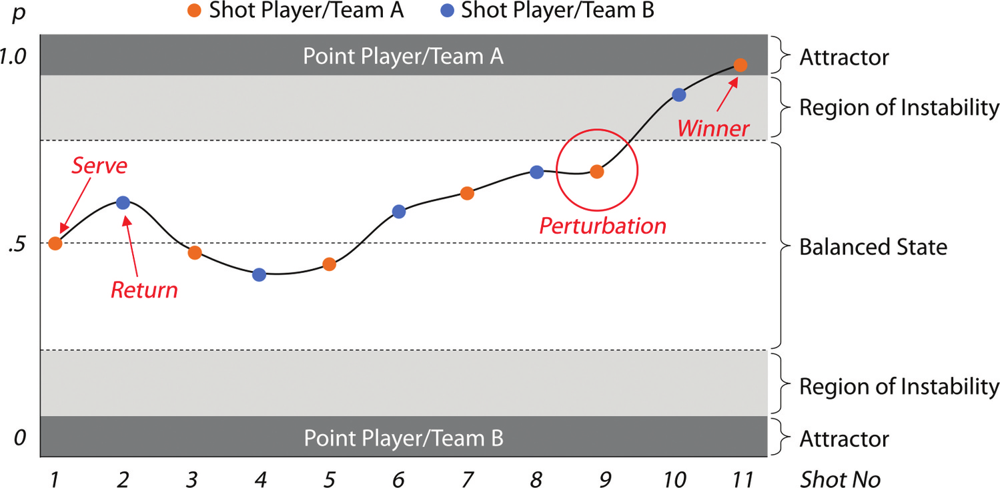
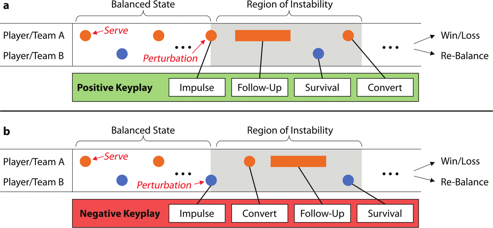
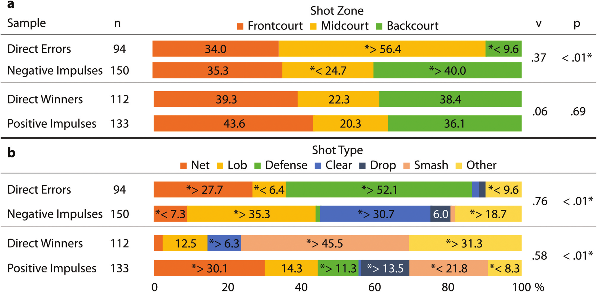
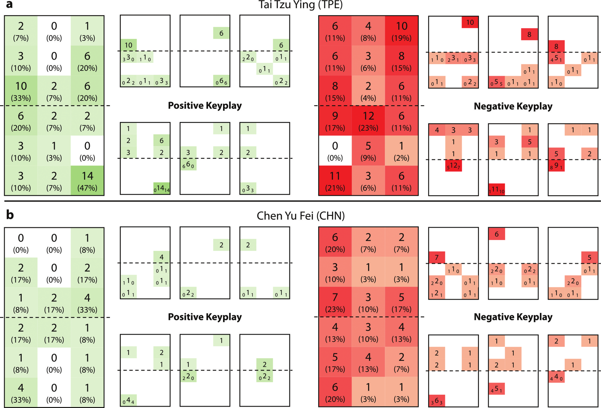

<!--
provenance:
  doi: 10.1080/02640414.2024.2323327
  title: Badminton as a dynamic system: A new method for analyzing badminton matches based on perturbations
  source: unknown
  download_url: unknown
  final_host: unknown
  filed: 2026-07-12
-->

<!-- page 1 -->

## **Journal of Sports Sciences** 

**ISSN: 0264-0414 (Print) 1466-447X (Online) Journal homepage: www.tandfonline.com/journals/rjsp20** 

# **Badminton as a dynamic system – A new method for analyzing badminton matches based on perturbations** 

#### **Fabian Hammes & Daniel Link** 

**To cite this article:** Fabian Hammes & Daniel Link (2024) Badminton as a dynamic system – A new method for analyzing badminton matches based on perturbations, Journal of Sports Sciences, 42:2, 160-168, DOI: 10.1080/02640414.2024.2323327 

**To link to this article:** <u>https://doi.org/10.1080/02640414.2024.2323327</u> 

© 2024 The Author(s). Published by Informa UK Limited, trading as Taylor & Francis Group. 

Published online: 13 Mar 2024. 

Submit your article to this journal 

Article views: 5152 

View related articles 

View Crossmark data 

Citing articles: 5 View citing articles

<!-- page 2 -->

##### SPORTS PERFORMANCE 

### **Badminton as a dynamic system – A new method for analyzing badminton matches based on perturbations** 

Fabian Hammes and Daniel Link 

Chair of Performance Analysis and Sports Informatics, Department of Sport and Health Sciences, Technical University of Munich, Munich, Germany 

###### **ABSTRACT** 

This study presents a method for analysing badminton matches based on the concept of perturbations. We transfer this principle to a badminton rally and describe the decisive shot, which turns a balanced situation into an advantage for one team or one player. Our paper proposes an observational system, which models the decisive shots by using four consecutive actions: _impulse_ (the perturbation), _follow-up_ , _survival_ , and _convert_ . To test the objectivity of the operationalization, independent raters analysed six matches in the singles disciplines of the 2022 World Championships. To evaluate rater agreement, Jaccard coefficient and Cohen’s kappa were used. Results show an agreement in identifying impulses of J(R1, R2) = .80, while the agreement in classifying the impulse type (positive/negative) reached κ = .70. A comparison of this perturbation-based analysis and last shot analyses shows significantly different results. Direct errors usually occur in the midcourt (56.4%), whereas most negative perturbations originate from the backcourt (40.0%). In contrast to direct winners, mostly originating from a smash (45.5%), most positive perturbations are created by net shots (30.1%). We argue that our method can be complementary to common last shot analyses and provides a possibility to describe players’ strengths and weaknesses in more detail. 

###### **ARTICLE HISTORY** 

Received 23 January 2023 Accepted 19 February 2024 

###### **KEYWORDS** 

Match analysis; performance analysis; player profiling; observational system; perturbations 

##### **1. Introduction** 

Dynamic systems exist in various fields. They can be found in the world of elementary particles (Nambu & Jona-Lasinio, 1961), the structure of biological systems (Zhao, 2017), psychological development (van Geert, 2013), as well as the organization of human societies (Thelen & Smith, 1996). One important feature of a dynamic system is its evolution over time. It runs through a series of states and often generates a pattern of stability under specific circumstances (Kelso & Haken, 1995). The theory of dynamic systems, which has its intellectual roots in mathematics and physics, addresses the process of change and development by using the interaction of the elements of a dynamic system. The theory includes various terms and principles, including self-organization, order and control parameters, emergence, hysteresis, bifurcation, attractors and perturbations. A good overview can be found in Kelso et al. (1988). 

The principles of dynamic systems theory have also become an important framework for sport science (Lames & McGarry, 2007; Robins & Hughes, 2015). They were used to describe aspects of motor control (Latash et al., 2002), motor development (Kamm et al., 1990), as well as interpersonal coordination of teams (Gréhaigne et al., 1997). An important concept of dynamic system theory is perturbations. Generally, perturbations are disruptions, which lead to a temporary instability of a dynamic system. This instability can lead to a transition between states, or the system can return to the pre-existing 

state (McGarry et al., 2002). For the domain of sports games, Robins and Hughes (2015) suggest defining perturbations as events that disrupt the normal flow and rhythm of a game and that can lead to scoring opportunities. 

In this paper, we apply dynamic systems theory and the concept of perturbations to badminton match analysis and develop an observational system, which focuses on the potentially decisive sequence of shots in a badminton rally. We interpret one badminton rally as a dynamic system consisting of two interaction elements, Player A and Player B (for badminton doubles, this corresponds to Team A and Team B, with two players each) (Figure 1). At the beginning of a rally, the system is in a state of balance, which means that both parties have similar chances to score (Carboch & Smocek, 2020). During the rally, the system tends to evolve to two other states, which are either a point for Player A or Player B. These states represent the endpoints – so-called attractors – of a dynamic system, since it is not possible to leave this state during the same rally. 

The “design” of badminton (shuttle properties, court size, net height) does not render it very easy to score with a single good shot. Players on a similar skill level must try to create an advantage during the rally, e.g., by playing well-placed and fast shots to the borders of the pitch. This advantage is usually related to the time available for a shot, which has already been studied by others for different sports (Vilar et al., 2013; Vučković et al., 2013): in an advantageous situation one player has a lot of time, whereas the other has not enough time for the shot. This advantage may be converted into a point in the 

**CONTACT** Fabian Hammes fabian.hammes@tum.de Chair of Performance Analysis and Sports Informatics, Department of Sport and Health Sciences, Technical University of Munich, Georg-Brauchle-Ring 60/62, Munich 80992, Germany 

© 2024 The Author(s). Published by Informa UK Limited, trading as Taylor & Francis Group. This is an Open Access article distributed under the terms of the Creative Commons Attribution License (http://creativecommons.org/licenses/by/4.0/), which permits unrestricted use, distribution, and reproduction in any medium, provided the original work is properly cited. The terms on which this article has been published allow the posting of the Accepted Manuscript in a repository by the author(s) or with their consent.

<!-- page 3 -->

**Figure 1.** Example of a badminton rally modelled by using the dynamic systems theory. With each shot, the scoring probability of players changes according to the spatiotemporal situation. Consequently, the system moves between the two attractor points A and B. When this probability of scoring rises above a certain threshold, we consider this as leaving the state of balance. In this example, shot 9 led to a significantly increased scoring probability for player a and represents the perturbation. In shot 11, player a was able to convert this advantage into a point.

_[Schematic, low-value: a line plot of scoring probability across shots 1-11 oscillating between attractor A (top) and attractor B (bottom), with shot 9 marked as the perturbation crossing the instability threshold and shot 11 as the convert to a point.]_

following shots (e.g., by smashing a shuttle, which was returned too high and close to the net) or rebalanced by good defending shots from the opponent. The shot, which creates the advantage – in other words, changes the dynamic system from the balanced state to a state of instability – represents the perturbation in a badminton rally. In addition, unforced errors and direct winners from a balanced situation are also considered as perturbations, since they transition the system directly into an attractor state. We argue that the ability to create perturbations to one’s own favour and prevent the opponent from doing the same, is the most important component for winning badminton. This makes the study of perturbations and how they can be achieved, a promising subject for performance analysis. 

Perturbations have been a part of the scientific research regarding different sports thus far. McGarry et al. (1999) showed that experts were able to identify shots that perturbed a squash rally with a good interrater agreement. In this work, the exact occurrence of the perturbation mostly only differed in a range of ± one shot. In addition, they used players’ positional data to identify the perturbation based on the relative phase, which represents the spatiotemporal shift between players in their recurring cyclical movements (Palut & Zanone, 2005). A similar study was conducted by Lames and Walter (2006) in tennis, who also used the relative phase to describe the changes in the advantage and disadvantage for one player in a rally. Jörg and Lames (2009) also studied perturbations in tennis based on qualitative identification of the decisive shots. Perturbations have also been described in soccer. James et al. (2012) performed a study, wherein they evaluated the success of “perturbation attempts”. A perturbation attempt is described as a dribbling or a pass that aims to create an instability in one’s own favour. In his dissertation, Schmalhofer (2016) examined the perturbation profiles of soccer matches in different junior categories. An extensive overview of the use of dynamic systems and the phenomenon of perturbations in sports was provided by Robins and Hughes (2015). 

Evaluations of potentially decisive situations in the middle of a badminton rally are not currently available to the extent to 

make it deem necessary. In their analysis of the Olympic Games 2012, Gawin et al. (2012) proposed a method for evaluating decisive shots, which they called _keyplays_ . They defined a keyplay as a situation, where the point is lost or won, and assigned this situation to one of the categories of _rally opening, attack, defense, net game_ , and _half-court_ . However, this approach differs significantly from the one proposed in this work, for example, in terms of operationalization and the level of details. 

Against this background, the paper aims to introduce a new method for observing badminton matches based on the concept of perturbations. We argue that this approach adds value to existing methods such as a last shot analysis (Abián et al., 2014; Laffaye et al., 2015), since it quantifies behaviour in the decisive shots in the middle of a rally. We organize the paper along four sub-goals. First (i), we present our observational system, which focuses on sequence of shots around the perturbation in a badminton rally. Second (ii), we determine the extent to which badminton experts can identify perturbations objectively. To achieve this goal, we performed an empirical study on interobserver agreements. Third (iii), we show that match analysis based on perturbations yields different results compared to the last shot analysis. This is done by analysing the performance of top-level players in six matches of the 2022 World Championships in Tokyo. The results also provide first insights into how the ability to create or prevent perturbations influences winning or losing in badminton. Fourth (iv), we consider the Olympic women’s singles final in Tokyo 2021 as an example and show how the data can be used to characterize the playing style of the players. Our method can complement common last shot analyses to describe the strengths and weaknesses of players, which is an important aspect for match preparation and deriving goals for training. Consequently, the paper provides a new, validated tool for coaches and scientists for analysing the players’ performance in badminton.

<!-- page 4 -->

##### **2. Methods** 

##### **_2.1. Observational system – keyplay model_** 

For application, we must transform the concept of perturbations into an observational system and annotate it using operational definitions (the challenges are discussed extensively by Memmert, 2021). Therefore, we use the term _keyplay_ , which we define as a sequence of actions that describe the transition of the rally from a balanced state to a state of instability. This definition does not focus on scoring, but on an instability that holds the potential for performance diagnostics. Most rallies must contain at least one keyplay; the shot that creates the instability or directly leads to a point. In case no player scores from the sole keyplay, and the rally returns to a balanced state again, there can be more than one keyplay in a rally. In some rare cases, e.g., when one player misjudges that the shuttle will go out, but it lands inside the line, there might be no keyplay in a rally. 

A keyplay represents a construct in our notational system and consists of up to four consecutive actions: 1) impulse, 2) follow-up, 3) survival, and 4) convert. The _impulse_ represents the shot that causes the perturbation. _Survival_ refers to the shot, wherein the defending player tries to rebalance the rally in an unfavourable situation. _Convert_ is the shot of the attacking player after the impulse, which aims to convert the advantage into a point – or at least prepares the point win. The _follow-up_ action models the court covering behaviour of the attacking player, which intends to create a promising spatiotemporal constellation for the conversion. 

A keyplay can either be positive – where a particularly good shot is the impulse – or negative – where a particularly bad shot creates the instability. According to this differentiation, the order of the subsequent actions differs from each other (Figure 2). In a positive keyplay, the player holding the 

advantage can gain more momentum directly after the impulse during a good coverage behaviour, and not just with the next shot. This is followed by the actions, _survival_ and _convert_ . In a negative keyplay, the first action that the advantageous player can take after the impulse is a shot, not a coverage behaviour. Therefore, the convert shot originates before the follow-up, whereas the survival shot ends the negative keyplay. 

Table 1 describes the attributes associated with the data for each action in a keyplay. A total of nine attributes are recorded, two of which are related to the keyplay, four to the impulse, and one each to the observational units _follow-up_ , _convert_ and _survival_ . The attribute _leads to a point_ indicates whether the scoring can be derived from the described keyplay, regardless of how long the rally lasts after it. According to the model, as soon as equilibrium is disturbed after the keyplay, it leads to a point gain. However, if the balance is restored or the side with the advantage acts poorly, no point gain can be attributed to the keyplay. The attributes _shot zone_ and _shot placement_ describe the position on the court at the time of the shot or the shot placement by using a 3 × 3 grid – therefore, we divide the court into three parts each horizontally and vertically–of the court. A modified form of the previously described 3 × 3 grid is used in the follow-up. Meanwhile, the three areas in the frontand backcourt remain unchanged and state that a player primarily covers this one described corner, and the three areas in the midcourt are replaced by the expressions, right, left, and neutral. These should either express a cover on the right or the left side, which cannot be assigned to a corner but cover the half court or even a completely neutral cover, covering the entire court equally. The two attributes _shot type_ and _shot laterality_ refer to the applied shot. Thus, the shot laterality refers to either the use of forehand or backhand, while the shot type described is intended to show its type. While it is very easy to 

**Figure 2.** Example of a badminton rally with highlighted keyplays. (a) Shows a positive keyplay – where a particular good shot causes the instability (impulse) – with the order of the subsequent actions, follow-up, survival, and convert. (b) Shows a negative keyplay – where a particular bad shot causes the instability (impulse) – with the alternated order of the subsequent actions, convert, follow-up, and survival. After the keyplay, the rally can lead to an attractor state or become rebalanced.

_[Schematic, low-value: two shot-sequence timelines. (a) positive keyplay orders the actions impulse -> follow-up -> survival -> convert; (b) negative keyplay orders them impulse -> convert -> follow-up -> survival.]_

<!-- page 5 -->

**Table 1.** Actions and attributes associated with a keyplay. 

|Action|Attribute|Categories|
|---|---|---|
||Positive/Negative Leads to a point|{Positive, Negative} {Yes, No}|
|Impulse|Shot Laterality Shot Zone|{Forehand, Backhand} {rf, mf, lf, rm, mm, lm, rb, mb, lb}|
||Shot Placement Shot Type|{rf, mf, lf, rm, mm, lm, rb, mb, lb} {Net, Lob, Defense, Drive, Smash, Drop, Clear, Other}|
|Follow-Up|Coverage Behavior|{rf, mf, lf, r, neutral, l, rb, mb, lb}|
|Convert|Shot Placement|{rf, mf, lf, rm, mm, lm, rb, mb, lb}|
|Survival|Shot Placement|{rf, mf, lf, rm, mm, lm, rb, mb, lb}|

was perceived in nearly the same moment without considering the impulse type (positive/negative). Jaccard coefficient is used for agreement quantification (Jaccard, 1912). Second, for all agreements identified in the first step, we asked whether the impulse type was identified consistently. Results are reported by using Cohen’s kappa (Cohen, 1960). For interpretation of Cohen’s kappa, the suggestions of McHugh (2012) are used: 0–.20 = none, .21–.39 = minimal, .40–.59 = weak, .60–.79 = moderate, .80–.89 = strong, ≥ .90 = almost perfect. 

##### **_2.3. Keyplay analysis vs. Last shot analysis_** 

distinguish between a forehand and a backhand, it is often not easy to distinguish between the types of shots, as the transitions are fluid. 

The most crucial issue in this model is the impulse identification. There are two reasons for this. First, there might be different opinions whether a shot has created a sustainable instability, “strong” enough to be interesting for performance analysis. In order to objectively define this “threshold” that separates the balanced state from the state of instability (according to Figure 1), we create a set of rules. These are based on the shot position on the court, the shot height – which almost determines the trajectory of the shuttle (increasing, decreasing, almost straight) – and the temporal pressure on the player at the time of the shot. These rules also consider the consecutive shots: for example, when one player is under pressure and is forced to lift the shuttle more than one time in a row, this is mostly considered as a situation of instability. 

Second, there might be ambiguous situations, where it is unclear whether the instability was created by a good shot of one player or a bad shot (before or after) of the other player. The ruleset defines a set of typical situations and how they are considered. As an example, we take the situation when a player scores with a smash after a clear played from the opponent. When the scoring player hits the shuttle and lands in front of the double service line, we consider the clear as a negative keyplay impulse, since this shot was obviously too short. Otherwise, the clear was long enough and the smash is considered as a positive keyplay impulse. 

For comparing the results of the keyplay analysis with those of the last shot analysis, we obtained the annotation from one observer. We contrasted the parameters of positive keyplay impulses with those of direct winners and the parameters of negative keyplay impulses with those of direct errors. Since a keyplay impulse can be the last shot of a rally, some shots would be included in both sets. Therefore, we excluded those shots from the keyplay set to obtain independent samples. The analysis provided the distributions for the shot zones and the main shot types ( _net_ , _lob_ , _defence, clear_ , _drop, smash, other)_ , which we consider as important indicators for performance analysis. To test the differences, we applied a Chi-squared test and a Chi-squared post-hoc test, comparing each category with all others. Cramer’s V was used to describe the effect sizes of significant differences. 

##### **_2.4. Player profiling_** 

To demonstrate the merit for individual performance analyses, we present a single case example, which gives insights into the match strategy of players. For this purpose, we analysed the Olympic women’s singles final between Tai Tzu Ying (TPE) and Chen Yu Fei (CHN) (both right-handed), which ended in victory for Chen Yu Fei (21–18, 19–21, 21–18). Results are reported using a visualization of the spatial distribution of positive and negative keyplay impulses by using the 3 × 3 grid described earlier. 

##### **3. Results** 

##### **_2.2. Objectivity of keyplay identification_** 

For testing the objectivity of keyplay detection, badminton matches were analysed by two raters, according to our model. The sample, also used in the performance analysis section of this paper, comprised six matches, namely the semifinals and finals of the 2022 Individual World Championships in Tokyo in both women’s singles and men’s singles. Data was recorded using the myDartfish Live S software. As mentioned above, it might be discussed among badminton experts, whether a perturbation was created by the negative keyplay impulse of a player or the next positive keyplay impulse from the other player. Therefore, our procedure consists of two consecutive steps. First, we tested the agreement in detecting the keyplay impulse by both raters with a tolerance of one shot. This is in line with the findings of McGarry et al. (1999, L. 93–96), who reported that perturbations in squash only differed in a range of +/- one shot. This aims to clarify whether the keyplay 

Our sample for testing the objectivity of keyplay identification (ii) contained 488 rallies. The cardinality of the union of the identified keyplays was 632, whereas that of the intersection was 503. This leads to an overall J(R1, R2) = .80, which corresponds to an agreement of 80% between raters. The analysis on the match level shows a range of .73 to .91. In the intersection set, 144 positive keyplay impulses and 291 negative keyplay impulses were identified consistently. In 69 cases, raters showed a disagreement regarding the impulse type, which led to an overall moderate agreement of κ = .70, ranging from κ = .53 (weak) to κ = .81 (strong) on the match level. 

Results of keyplay vs. last shot analysis (iii) included 565 keyplays. In 282 cases, the keyplay impulse and the last shot of the rally were the same, where both analyses led to the same result. Figure 3 shows the results of the keyplay vs. last shot analysis, according to shot zones (Figure 3(a)) and shot types (Figure 3(b)) using independent samples. Significant

<!-- page 6 -->

differences could be found when comparing negative keyplay impulses with direct errors played from back- and midcourt. Here, 40.0% of negative keyplay impulses were played from the backcourt, with only 9.6% of direct errors. Conversely, 24.7% of the negative keyplay impulses were played from the midcourt, with 56.4% of direct errors. This is reasonable, since direct errors are often caused by a smash, played into the midcourt, which is totally different from a negative keyplay impulse from the midcourt, played in an almost balanced situation. An opposite situation arises when observing the backcourt. Since most attacks by the opponent in an already instable situation land in the front- and midcourt, an error often does not occur in the backcourt. However, a negative keyplay impulse in the backcourt from a balanced situation can arise in the same way as in the front- and backcourt. When comparing positive keyplay impulses with direct winners, the differences are not significant. However, more positive keyplay impulses are likely played from the frontcourt compared to direct winners. Despite a different distribution of shot types (described in the next paragraph), a similar distribution in shot zones can be explained by the fact that different shot types balance each other out to a certain extent in the shot zones. 

The distribution of shot types indicated the clearest differences in the shots to the backcourt of the opponent (lob shots/clears) in negative keyplay impulses and direct errors. Here, 66.0% of the negative keyplay impulses were of these two types, with only 8.5% of the errors. An explanation could be found in shots that are insufficiently long, thus causing an instability in the opponent’s favour. This is different than the errors made from an already unstable situation played to the backcourt, which occurs infrequently. When comparing positive keyplay impulses with the 

winners, two differences were highlighted. First, 30.1% of positive keyplay impulses were net shots, but only 4.5% were winners. Second, while only 21.8% of the positive keyplay impulses were smashes, 45.5% of them were smashes for the winners, which could be explained by the specifics of these shots. While a net shot is often played as a preparation shot to bring the opponent into a disadvantageous position, smashes are often found as convert shots after the impulse. 

Figure 4 shows the results of the player profiling based on a single case analysis (iv). Four points of the current analysis were highlighted. First, Tai Tzu Ying was considerably more active. This interpretation was based on the total number of impulses played – both negative and positive in nature (83 vs. 42). During the match, she changed the relative balance 30 times in her favour and 53 times in her opponent’s favour. 

Second, Tai Tzu Ying appeared more dangerous when looking at the backcourt from the right backcourt, but more prone to making mistakes or inaccuracies from the left backcourt. For this interpretation, only the backcourt of Tai Tzu Ying must be considered. Here, 14 positive keyplay impulses-eight were placed longline and six were placed cross–were played from the right backcourt, with only five from the left and the centre backcourt areas. In contrast, she played negative keyplay impulses mainly from the left backcourt–11 times compared to nine times from the centre and right backcourt areas. Notably, seven of the 11 negative keyplay impulses from the left backcourt were played cross. 

Third, Chen Yu Fei appeared to be following a neutral playing style, particularly from the right half of the court. The absolute number of impulses from her was significantly lower than that from Tai Tzu Ying, but interpretations could 

**Figure 3.** Analysis of the distributions of keyplay impulses and last shots in singles badminton matches. We show the share (%) of each category (a): Frontcourt, Midcourt, Backcourt; (b): Net, Lob, Defense, Clear, Drop, Smash, Other) when comparing the errors with negative keyplay impulses and the winners with positive keyplay impulses. Sample sizes (n), effect sizes (v), and _p_ values are given. * indicates significant differences in the distribution between samples. *<> indicates if the cell value is significantly greater or lesser when comparing the errors with negative keyplay impulses and the wines [sic] with positive keyplay impulses (p < .05).

_Data transcribed from Figure 3 (stacked percentage bars; `*>` = category significantly greater, `*<` = significantly lesser than the paired sample at p < .05):_

_(a) Shot Zone (% of sample):_

|Sample|n|Frontcourt|Midcourt|Backcourt|v|p|
|---|---|---|---|---|---|---|
|Direct Errors|94|34.0|56.4 *>|9.6 *<|.37|< .01 *|
|Negative Impulses|150|35.3|24.7 *<|40.0 *>|||
|Direct Winners|112|39.3|22.3|38.4|.06|.69|
|Positive Impulses|133|43.6|20.3|36.1|||

_(b) Shot Type (% of sample; Net, Lob, Defense, Clear, Drop, Smash, Other):_

|Sample|n|Net|Lob|Defense|Clear|Drop|Smash|Other|v|p|
|---|---|---|---|---|---|---|---|---|---|---|
|Direct Errors|94|27.7 *>|6.4 *<|52.1 *>|—|—|—|9.6 *<|.76|< .01 *|
|Negative Impulses|150|7.3 *<|35.3 *>|—|30.7 *>|6.0|—|18.7 *>||||
|Direct Winners|112|—|12.5|—|6.3 *>|—|45.5 *>|31.3 *>|.58|< .01 *|
|Positive Impulses|133|30.1 *>|14.3|11.3 *>|—|13.5 *>|21.8 *<|8.3 *<||||

_[Note: some Figure 3(b) cells are too small to carry printed labels and are left as "—"; the seven categories sum to 100% within each row. Cross-check against prose on p.5-6: errors midcourt 56.4% vs negative impulses backcourt 40.0%; winners smash 45.5% vs positive impulses net 30.1%.]_

<!-- page 7 -->

**Figure 4.** Evaluation of the keyplay impulses in the Olympic women’s singles final where (a) shows Tai Tzu Ying and (b) shows Chen Yu Fei. Positive and negative keyplay impulses are shown on the left and right parts, respectively. The dashed line represents the net. The nine areas below the dashed line represent the shot zone, whereas those above it represent the shot placement. The big courts show the overview of the keyplay impulses, and the small courts display the most common shot placements (upper courts) and shot zones (bottom courts). The subscripted numbers on the small courts demonstrate the laterality.

_Data transcribed from Figure 4. Each player has a large 3-column x 6-row grid of positive impulses (green) and one of negative impulses (red); rows 1-3 are above the net (opponent half / shot placement) and rows 4-6 are the player's own half (shot zone). Cell = count (percentage of that player's impulses in that colour). Aggregate impulse totals from the prose: Tai Tzu Ying 83 total (30 in her favour, 53 in opponent's), Chen Yu Fei 42 total._

_(a) Tai Tzu Ying — POSITIVE impulse grid (count (%)), rows top(=opponent backcourt) to bottom(=own backcourt), columns left/centre/right:_

|row|left|centre|right|
|---|---|---|---|
|1|2 (7%)|0 (0%)|1 (3%)|
|2|3 (10%)|0 (0%)|6 (20%)|
|3|10 (33%)|2 (7%)|6 (20%)|
|4|6 (20%)|2 (7%)|2 (7%)|
|5|3 (10%)|1 (3%)|0 (0%)|
|6|3 (10%)|2 (7%)|14 (47%)|

_(a) Tai Tzu Ying — NEGATIVE impulse grid:_

|row|left|centre|right|
|---|---|---|---|
|1|6 (11%)|4 (8%)|10 (19%)|
|2|6 (11%)|3 (6%)|8 (15%)|
|3|8 (15%)|2 (4%)|6 (11%)|
|4|9 (17%)|12 (23%)|6 (11%)|
|5|0 (0%)|5 (9%)|1 (2%)|
|6|11 (21%)|3 (6%)|6 (11%)|

_(b) Chen Yu Fei — POSITIVE impulse grid:_

|row|left|centre|right|
|---|---|---|---|
|1|0 (0%)|0 (0%)|1 (8%)|
|2|2 (17%)|0 (0%)|2 (17%)|
|3|1 (8%)|2 (17%)|4 (33%)|
|4|2 (17%)|2 (17%)|1 (8%)|
|5|1 (8%)|0 (0%)|1 (8%)|
|6|4 (33%)|0 (0%)|1 (8%)|

_(b) Chen Yu Fei — NEGATIVE impulse grid:_

|row|left|centre|right|
|---|---|---|---|
|1|6 (20%)|2 (7%)|2 (7%)|
|2|3 (10%)|1 (3%)|1 (3%)|
|3|7 (23%)|3 (10%)|5 (17%)|
|4|4 (13%)|3 (10%)|4 (13%)|
|5|5 (17%)|4 (13%)|2 (7%)|
|6|6 (20%)|1 (3%)|1 (3%)|

_[The small companion courts (shot placement above net, shot zone below) carry laterality subscripts of the form `L count R`; these fine-grained placement breakdowns are not transcribed cell-by-cell. Key prose figures: from the right backcourt Tai Tzu Ying played 14 positive impulses (8 longline, 6 cross); from the left backcourt she played 11 negative impulses (7 cross). Chen Yu Fei: 22 impulses from the left half (7 positive, 15 negative) vs 10 from the right (3 positive, 7 negative).]_

also be derived from these numbers. The comparison of the left and the right halves of the court was the most conspicuous. A total of 22 impulses were played from the left half (7 positive and 15 negative) of the court, while only 10 impulses occurred on the right half (three positive and seven negative). One possible interpretation was her neutral playing style, particularly on her forehand side; thus, her first intention could have been not to put herself at a disadvantage. Simultaneously, she seemed to accept that she did not play particularly dangerous shots for the opponent. This neutral playing style was not likely as pronounced on the left half of the court. Rather, she might have remained more active on the left half, accepting that she sometimes played less precisely or was more errorprone. Fourth, when observing her shot placement, Chen Yu Fei maintained a better balance of positive vs. negative keyplay impulses on the right half (seven positive keyplay impulses vs. eight negative keyplay impulses on the right half, but three positive keyplay impulses vs. 16 negative keyplay impulses on the left half). Up to our interpretation, she played more dangerously on this side but also more secure. 

##### **4. Discussion** 

This work aimed to introduce a new method for analysing badminton matches based on the concept of perturbations. Therefore, we (i) described our observational system, (ii) evaluated the objectivity of identifying perturbations, (iii) compared this method against the existing last shot analyses and (iv) showed an example of how this method can be used for player profiling in top-level badminton. 

The description of our method (i) is limited by the fact that it does not provide a precise definition of how to detect keyplays at an operational level. This is due to the fact that our ruleset is quite extensive and covers many different situations, which cannot be described in a scientific paper due to their extent. However, the methods section gives an insight into the principles we used. 

Our method describes rallies by using a carefully considered balance between data collection effort and depth of information, which was developed with the German national badminton team. On one hand, we focus only on important situations and not on every shot of a rally (which is quite laborious, when doing this by hand). On the other hand, we do not look at just one shot, but at a set of shot characteristics that represent the entire sequence of decisive actions.

<!-- page 8 -->

When comparing our observational system to the one by Gawin et al. (2012), who also used the term “keyplay”, several differences emerged. First, they focused on situations only leading to a point, whereas our approach also considered situations after which the rallies were rebalanced again. Second, they classified the decisive shot into one of the categories, _rally opening, attack, defense, net game_ , and _half-court_ without using further variables (like zone or technique) to describe this shot. Third, our model is more comprehensive since it did not only consider a shot, but also the follow-up actions. However, due to the restrictions of a single paper, we showed the evaluations of the keyplay impulse only. 

Testing the interrater reliability of keyplay detection (ii) revealed moderate agreements between two raters. Results indicated that interrater reliability of detecting an impulse +/one shot is slightly higher than that for the distinction between a positive and a negative keyplay impulse. This could be because general instability is relatively easy to recognize, since in most cases, a point win results from it. Nevertheless, there is always room for a subjective assessment in keyplay detection that is unlikely to archive full objectivity by any meaningful operationalization. However, this problem not only exists in our case, but in all team sports in general. Other studies have reported an interrater agreement between κ = .80 (strong) in Badminton (Gawin et al., 2012) and κ = .93 (almost perfect) in Squash (McGarry et al., 1999). However, their approaches are somehow different from ours. We argue that the conceptual superiority of keyplays will not disappear; thus, despite a comparatively small uncertainty of rating, the analysis results will still have merit. A possibility to improve the method could include an assessment by the analyst regarding each scene of how confidently a situation is rated (e.g., a threepoint scale of _very confident_ , _relatively confident_ , and _uncertain_ ). 

Regarding our methodological approach when comparing the keyplay analysis with the last shot analysis (iii), it is debatable why not to include last shots in the keyplay sample. However, we argue that independent samples contrast the two methods more optimally. Results indicated that both methods lead to a significantly different distribution of shot zones and types (Figure 3). Results of the last shot analysis can, for example, lead to the assessment that a player faces challenges with defence shots, since most errors occur in this case. However, in most cases, the perturbation already occurs beforehand; thus, the error in the defence is only a consequence of it. Another example can be found in the difference in the _net shots_ and _smashes_ when comparing positive keyplay impulses with direct winners. In our eyes, a preparation of a point win often happens through very good and accurate net shots, whereas direct winners often emerge from smashes. To illustrate this, consider a rally in which Player A played a particular accurate net shot and caused a perturbation. Player B, who was clearly in a disadvantageous position at the time, could only produce a lob shot to the backcourt that was clearly too short. Player A finished the rally with a “simple” smash. When focusing on the last shot, only the smash winner is evaluated. The fact that this was the subsequent action based on the previous two shots is taken into account in our keyplay analysis, but not in the last shot 

analysis. In summary, our proposed observational system can complement common last shot analyses. Running both analyses gives a better description of players’ strengths and weaknesses. 

Kepylay analysis also provides initial insights into the situations in which instabilities occur, which contributes to the question of what factors influence winning or losing. Our data show, for example, that positive impulses mostly come from net play (Figure 3). Further large-scale studies can use the keyplay method to identify success factors differentiated by gender, age, and anthropometric factors. 

Single case analysis (iv) shows how the method can be used for individual player profiling in badminton. Visualizations like that shown in Figure 4, possibly combined with normative values, make it possible to show the strengths and weaknesses in specific situations or even different techniques. In our example, Tai Tzu Ying did not struggle with her backhand here, but mostly with the forehand. This information might be useful for training. However, such interpretations on quantitative match data are always limited. For example, keyplays arise from a number of factors such as the quality of anticipation and the running behaviour of players. In addition, the selection of shot type is determined by many factors such as personal preference but also the quality of the opponent’s previous shot. Therefore, qualitative match analysis is needed in order to light the reasons behind such findings (Lames & Hansen, 2001). Specialized software tools, which support a quick selection of crucial video scene, can implement such approaches in sports practice (Memmert, 2021). 

Notably, the demonstrated single case analysis does not explore all the possibilities, since follow-up, convert and survival data have not been considered. There might be merit in studying whether there are different playout strategies of the players after creating an advantage, or whether certain players have clearly recognizable strengths or weaknesses in playing out such advantages. 

Broadly, this paper contributes to the discussion on applying dynamic systems theory and the concept of perturbations in sports. Over 20 years ago, McGarry et al. (2002) already suggested to model badminton based on dynamic systems theory by using the perturbations. They hypothesized that perturbations in badminton might be reflected in atypical changes in the spatial coupling of the opponent teams and stressed the demand for scientific studies on this topic. However, our paper provides the first approach to quantify and use such perturbations for badminton performance analysis. The operationalization employed for determining impulses used the information on the coupling of players. 

McGarry et al. (2002) also highlighted that perturbations in sports might be found on different time scales. In our paper, we use the term “perturbation” as a metaphor for the transition from a balanced to an unstable situation within a single badminton rally. While this is a short-term perspective, perturbations could also be used in badminton in other ways. For example, a sequence of rallies, wherein the players score equally, could be considered as a stable state. There might be single rallies or short sequences (e.g., which are highly con-

<!-- page 9 -->

tested), which perturb this stability and lead to a lasting performance shift in favour of one player. Sports psychology uses constructs, such as “breakdown”, “choking”, or “cold-hand” (Cohen-Zada et al., 2017; Hill & Shaw, 2013; Link & Raab, 2022) to describe such effects. Similar phenomena might be found on a season level, when a player runs into a series of successful or unsuccessful matches based on one critical event, which could be considered as a perturbation. 

The way perturbations were used in this study could also be applied to other sports. Apparently, dyadic sports, such as tennis, squash, and table tennis could benefit in a similar way. Additionally, invasion sports, like football, field hockey, or rugby could also be modelled in terms of perturbations. We hope that this paper will serve as a reference for further research in this area. 

##### **5. Conclusion** 

This paper provides a method for analysing badminton based on perturbations. Evaluation data indicates that a) perturbations can be analysed with a sufficient degree of objectivity, b) derived performance profiles significantly differ from the ones obtained from the last shot analysis and c) player profiling based on perturbations leads to meaningful and interpretable results. Therefore, we propose that our method should complement existing last shot analyses for badminton performance analysis. It can be used in sports science, e.g., to identify general success factors in badminton or support individual performance analysis to derive consequences for training and competition. 

##### **Acknowledgments** 

German Badminton Federation (DBV, http://www.badminton.de), especially Hannes Käsbauer and David Fischer-Eisentraut for their contribution in creating the model, and Kai Schäfer, Philip Wong, Niklas Diglidis, and Lukas Leupold (coaches) for collecting and providing data. 

##### **Disclosure statement** 

The authors declare that the research was conducted in the absence of any commercial or financial relationships that could be construed as a potential conflict of interest. 

##### **Funding** 

The study was supported by the German Federal Institute of Sport Science (BISp, http://www.bisp.de). Grant numbers: 071610/20, 071605/21, 072109/ 21. The publication of the study was supported by the  Technical University of Munich (TUM, www.tum.de) in the framework of the Open Access Publishing Program. These institutions had no role in study design, data collection and analysis, decision to publish, or preparation of the manuscript. 

##### **ORCID** 

Fabian Hammes http://orcid.org/0000-0001-9123-2656 Daniel Link http://orcid.org/0000-0003-3606-2986 

##### **Author contribution statement** 

FH contributed to the conception, design of the study, statistical analysis and wrote the manuscript. DL contributed to the conception and design of the study. All authors contributed to manuscript revision, read, and approved it for publication. 

##### **Data availability statement** 

The data and the complete ruleset to identify keyplays that support the findings of this study are available from the corresponding author, FH, upon reasonable request. 

##### **Ethics declaration** 

A special approval for this study from an ethics committee was not required since each player agreed to the video recording of matches on signing their player licence. Nevertheless, all procedures performed in the study were in strict accordance with the Declaration of Helsinki as well as with the ethical standards of the local ethics committee. 

##### **References** 

- Abián, P., Castanedo, A., Feng, X. Q., Sampedro, J., & Abian-Vicen, J. (2014). Notational comparison of men’s singles badminton matches between Olympic Games in Beijing and London. _International Journal of Performance Analysis in Sport_ , _14_ (1), 42–53. https://doi.org/10.1080/ 24748668.2014.11868701 

- Carboch, J., & Smocek, P. (2020). Serve and return in badminton: gender differences of elite badminton players. _International Journal of Physical Education, Fitness and Sports_ , _9_ (1), 44–48. https://doi.org/10.34256/ ijpefs2014 

- Cohen, J. (1960). A coefficient of agreement for nominal scales. _Educational and Psychological Measurement_ , _20_ (1), 37–46. https://doi.org/10.1177/ 001316446002000104 

- Cohen-Zada, D., Krumer, A., Rosenboim, M., & Shapir, O. M. (2017). Choking under pressure and gender: Evidence from professional tennis. _Journal of Economic Psychology_ , _61_ , 176–190. https://doi.org/10.1016/j.joep. 2017.04.005 

- Gawin, W., Beyer, C. ‑., Büsch, D., & Hasse, H. (2012). Analyse der Olympischen Spiele 2012 in der Sportart Badminton [Analysis of the Olympic Games 2012 in Badminton]. _Zeitschrift für Angewandte Trainingswissenschaft_ , _19_ (2), 16–34. 

- Gréhaigne, J. F., Bouthier, D., & David, B. (1997). Dynamic-system analysis of opponent relationships in collective actions in soccer. _Journal of Sports Sciences_ , _15_ (2), 137–149. https://doi.org/10.1080/026404197367416 

- Hill, D. M., & Shaw, G. (2013). A qualitative examination of choking under pressure in team sport. _Psychology of Sport and Exercise_ , _14_ (1), 103–110. https://doi.org/10.1016/j.psychsport.2012.07.008 

- Jaccard, P. (1912). The distribution of the Flora in the Alpine Zone. _New Phytologist_ , _11_ (2), 37–50. https://doi.org/10.1111/j.1469-8137.1912. tb05611.x 

- James, N., Rees, G. D., Griffin, E., Barter, P., Taylor, J., Heath, L., & Vučković, G. (2012). Analysing soccer using perturbation attempts. _Journal of Human Sport & Exercise_ , _7_ (2), 413–420. https://doi.org/10.4100/jhse.2012.72.07 

- Jörg, D., & Lames, M. (2009). Perturbationen im Tennis: Beobachtbarkeit und Stabilität [Perturbations in Tennis: Observability and Stability]. In M. Lames (Ed.), _Schriften der Deutschen Vereinigung für Sportwissenschaft: Vol. 189. Gegenstand und Anwendungsfelder der Sportinformatik: Symposium der dvs-Sektion Sportinformatik vom_ 22. - 24. Mai 2008 in Augsburg (pp. pp. 86–96). Czwalina. 

- Kamm, K., Thelen, E., & Jensen, J. L. (1990). A dynamical systems approach to motor development. _Physical Therapy_ , _70_ (12), 763–775. https://doi.org/ 10.1093/ptj/70.12.763 

- Kelso, J. A. S., & Haken, H. (1995). _Dynamic patterns: The self-organization of brain and behavior_ . A Bradford book. MIT Press. 

- Kelso, J. A. S., Mandell, A. J., & Shlesinger, M. F. (Eds.). (1988). _Dynamic patterns in complex systems_ . World Scientific.

<!-- page 10 -->

- Laffaye, G., Phomsoupha, M., & Dor, F. (2015). Changes in the game characteristics of a badminton match: A longitudinal study through the Olympic game finals analysis in men’s singles. _Journal of Sports Science & Medicine_ , _14_ (3), 584–590. 

- Lames, M., & Hansen, G. (2001). Designing observational systems to support top-level teams in game sports. _International Journal of Performance Analysis in Sport_ , _1_ (1), 83–90. https://doi.org/10.1080/24748668.2001. 11868251 

- Lames, M., & McGarry, T. (2007). On the search for reliable performance indicators in game sports. _International Journal of Performance Analysis in Sport_ , _7_ (1), 62–79. https://doi.org/10.1080/24748668.2007.11868388 

- Lames, M., & Walter, F. (2006). Druck machen und Ausspielen: Die relative Phase und die Interaktion in Rückschlagspielen am Beispiel Tennis [Exerting pressure and making the running: The relative phase and interaction in racket sports with special respect to tennis]. _Spectrum Der Sportwissenschaften_ , _18_ (2), 7–24. 

- Latash, M. L., Scholz, J. P., & Schöner, G. (2002). Motor control strategies revealed in the structure of motor variability. _Exercise and Sport Sciences Reviews_ , _30_ (1), 26. https://doi.org/10.1097/00003677-200201000-00006 

- Link, D., & Raab, M. (2022). Experts use base rates in real-world sequential decisions. _Psychonomic Bulletin & Review_ , _29_ (2), 660–667. https://doi.org/ 10.3758/s13423-021-02024-6 

- McGarry, T., Anderson, D. I., Wallace, S. A., Hughes, M. D., & Franks, I. M. (2002). Sport competition as a dynamical self-organizing system. _Journal of Sports Sciences_ , _20_ (10), 771–781. https://doi.org/10.1080/026404102320675620 

- McGarry, T., Khan, M. A., & Franks, I. M. (1999). On the presence and absence of behavioural traits in sport: An example from championship squash matchplay. _Journal of Sports Science_ , _17_ (4), 297–311. https://doi.org/10. 1080/026404199366019 

- McHugh, M. L. (2012). Interrater reliability: The kappa statistic. _Biochemia Medica_ , _22_ (3), 276–282. https://doi.org/10.11613/BM.2012.031 

- Memmert, D. (2021). _Match analysis: How to use data in professional sport_ . Routledge. https://doi.org/10.4324/978100316095 

- Nambu, Y., & Jona-Lasinio, G. (1961). Dynamical model of elementary particles based on an analogy with superconductivity. I. _Physical Review_ , _122_ (1), 345–358. https://doi.org/10.1103/PhysRev.122.345 

- Palut, Y., & Zanone, P. (2005). A dynamical analysis of tennis: Concepts and data. _Journal of Sports Sciences_ , _23_ (10), 1021–1032. https://doi.org/10. 1080/02640410400021682 

- Robins, M., & Hughes, M. (2015). Dynamic systems and ‘perturbations. In M. Hughes, I. M. Franks, & R. Bartlett (Eds.), _Essentials of performance analysis in sport_ (pp. 239–269). Routledge. https://doi.org/10.4324/ 9781315776743-15 

- Schmalhofer, A. (2016). _Perturbationsprofile im Nachwuchsleistungsfußball: am Beispiel der U15-, U17-, U19- und U23-Mannschaft eines Bundesligisten [Perturbation profiles in youth elite soccer: using the example of the U15, U17, U19 and U23 teams of a Bundesliga club]_ [Dissertation]. Technical University, 

- Thelen, E., & Smith, L. B. (1996). _A dynamic systems approach to the development of cognition and action_ (First MIT Press paperback ed). A Bradford book. MIT Press. 

- van Geert, P. (2013). Nonlinear complex dynamical systems in developmental psychology. In S. J. Guastello, M. Koopmans, & D. Pincus (Eds.), _Chaos and complexity in psychology_ (pp. 242–281). Cambridge University Press. https://doi.org/10.1017/CBO9781139058544.009 

- Vilar, L., Araújo, D., Davids, K., Correia, V., & Esteves, P. T. (2013). Spatialtemporal constraints on decision-making during shooting performance in the team sport of futsal. _Journal of Sports Sciences_ , _31_ (8), 840–846. https://doi.org/10.1080/02640414.2012.753155 

- Vučković, G., James, N., Hughes, M., Murray, S., Sporiš, G., & Perš, J. (2013). The effect of court location and available time on the tactical shot selection of elite squash players. _Journal of Sports Science & Medicine_ , _12_ (1), 66–73. https://www.ncbi.nlm.nih.gov/pmc/articles/PMC3761750/ 

- Zhao, X. (2017). _Dynamical systems in population biology_ (2nd ed.). Springer International Publishing. https://doi.org/10.1007/978-3-31956433-3