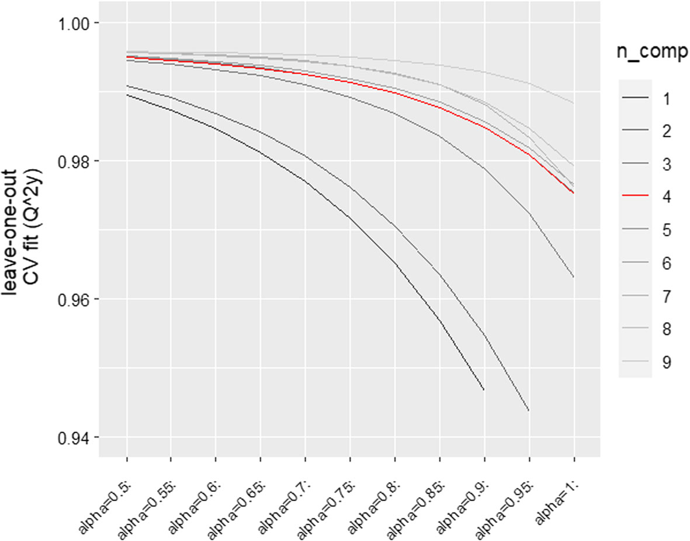
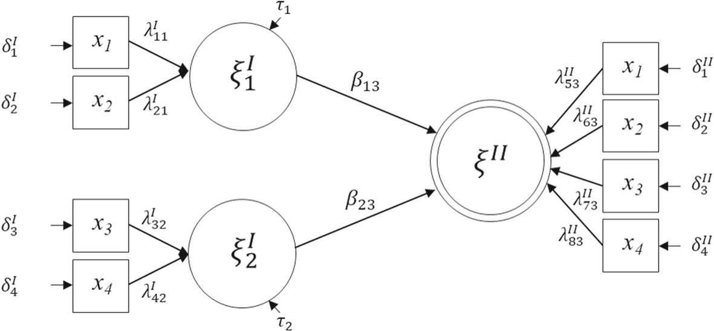

<!--
provenance:
  doi: 10.1007/s10479-023-05185-w
  title: Clustering of variables methods and measurement models for soccer players' performances
  source: unknown
  download_url: unknown
  final_host: unknown
  filed: 2026-07-12
-->

<!-- page 1 -->

# **Clustering of variables methods and measurement models for soccer players’ performances** 

**Maurizio Carpita****1** **· Paola Pasca****2** **· Serena Arima****2** **· Enrico Ciavolino****3** 

Accepted: 16 January 2023 / Published online: 6 February 2023 © The Author(s) 2023 

#### **Abstract** 

In sports, studying player performances is a key issue since it provides a guideline for strategic choices and helps teams in the complex procedure of buying and selling of players. In this paper we aim at investigating the ability of various composite indicators to define a measurement structure for the global soccer performance. We rely on data provided by the EA Sports experts, who are the ultimate authority on soccer performance measurement: they periodically produce a set of players’ attributes that make up the broader, theoretical performance dimensions. Considering the potential of clustering techniques to confirm or disconfirm the experts’ assumptions in terms of aggregations between indicators, 29 players’ performance attributes or variables (from the FIFA19 version of the videogame, that is, _sofifa_ ) have been considered and processed with three different techniques: the _Cluster of variables around latent variables_ (CLV), the _Principal covariates regression_ (PCovR) and _Bayesian modelbased clustering_ (B-MBC). The three procedures yielded clusters that differed from experts’ classification. In order to identify the most appropriate measurement structure, the resulting clusters have been embedded into _Structural equation models with partial least squares_ (PLS-SEMs) with a Higher-Order Component (that is, the overall soccer performance). The statistically derived composite indicators have been compared with those of experts’ classification. Results support the concurrent validity of composite indicators derived through the statistical methods: overall, they show that, in the lack of expert judgement, composite indicators, as well as the resulting PLS-SEM models, are a viable alternative given their greater correlation to players’ economic value and salary. 

**Keywords** Soccer performance · Cluster of variables around latent variables · Principal covariates regression · Bayesian model-based clustering · Structural equation model · Partial least squares · Higher order component 

**Mathematics Subject Classification** 62H30 · 62H25 · 62H12 · 62P25 

> B Paola Pasca paola.pasca@unisalento.it 

> 1 Department of Economics and Management, University of Brescia, Brescia, Italy 

> 2 Department of Human and Social Sciences, University of Salento, Lecce, Italy 

> 3 WSB University, Gda´nsk, Poland

<!-- page 2 -->

## **1 Introduction** 

In sports, players performance has become increasingly important from a metric standpoint: from coaches to the team itself, from bookmakers to fans, they are interested in knowing about players’ performance characteristics and how they combine to make up the overall performance. In soccer in particular, experts from the major video game company, Electronic Arts (EA), are a world-renowned authority. As developers of soccer simulators (i.e. the FIFA videogame series), they are constantly maintaining a database of realistic soccer players’ performance attributes. These result from a thorough survey of a large interested audience: assumptions, observations and evaluations provided by sport clubs, viewers, supporters and even the players themselves are collected at regular intervals and checked by a network of more than 9000 scouts, coaches and players–who watch as many matches as possible—before being officialised for the game (FifaUltimateTeamit, 2018). Although, over time, EA experts have developed various theoretical classifications depending on the edition of the FIFA videogame, their soccer performance attributes lend themselves to statistical treatment and are of great value, when it comes to predicting actual outcomes. Along with other widely available data (i.e., players’ wage and monetary value), performance attributes guide strategies for forming competitive sports teams: rather than relying exclusively on subjective and error-prone intuition, scouts, technical directors and coaches turn to plausible, available and up-to-date data to select players for their teams or to determine the team line-up (Bidaurrazaga-Letona et al., 2014). A number of studies confirm how experts’ evaluations proved useful not only for skills classification, but also for the prediction of players’ monetary value (Singh & Lamba, 2019) as well as merchandising potential (Coates & Parshakov, 2021; Kirschstein & Liebscher, 2019). From this starting point, two main research strands have emerged: a first exploratory, classification-oriented one, which relies on a large use of dimension reduction and clustering techniques in order to build up composite indicators based on statistical criteria. In the _handbook of composites_ (Commission JRCE, 2008), a composite indicator is defined as a single index resulting from the combination of individual variables based on a statistical model. The potential of composite indicators as a valid, synthetic and easy to interpret refinement of raw data has been highlighted by a number of studies (El Gibari et al., 2019; Freudenberg, 2003; McHale et al., 2012) and becomes particularly relevant when there is up-to-date, open-access and good quality data available, such as those of soccer performance (Mathien, 2016; Leone, 2019; Carpita et al., 2021; Liu et al., 2016; Lopes & Tenreiro Machado, 2021; Schultze & Wellbrock, 2018). 

Although often based on the use of composite indicators, the second is more of a forecasting approach, where match data, along with players’ indices (performance, spatial, networks in an either raw or composite form) are used to feed statistical learning models and test their accuracy in predicting match outcomes (Hassan et al., 2020; Carpita et al., 2015; Hughes et al., 2012) or even chances in players’ promotion (Jamil et al., 2021). In view of prediction improvement, previous research highlighted the importance of the spatial placement of players and their role in the soccer pitch. Moreover, it highlighted performance indicators aggregations other than those hypothesized by the experts (Carpita et al., 2019), confirming that the theoretical classification may not be statistically supported, therefore being worthy of further investigation. It seems useful to examine the different aggregations of performance attributes with a method that allows a thorough examination of the overall performance in soccer: some recent applications started this investigation, on the one hand examining the presence of observed heterogeneity in the data (for instance, taking into account both league and players’ role on the soccer pitch, as in , Cefis, 2022), on the other clarifying the original

<!-- page 3 -->

nature of the measurement structure of performance variables defined by experts (Cefis & Carpita, 2022). In particular, the latter study suggests that the broad performance dimensions hypothesised by the experts do not behave as “watertight compartments”with individual indicators only and necessarily correlated with each other (reflective nature), but rather that there is a bottom-up contribution of such indicators to the wider areas of player’s performance (formative nature). 

After the introductory session, Sect. 2 provides an in-depth description of the dataset and its variables (aka performance attributes) as conceived by the EA experts. Section 3 will be devoted to the statistical methods for variables aggregation: in particular, Sect. 3.1 describes the _Cluster of variables around latent variables_ (Vigneau & Qannari, 2003; Vigneau et al., 2015), a clustering technique designed for variables rather than observations; Sect. 3.2 illustrates the _Principal covariates regression_ (De Jong & Kiers, 1992; Vervloet et al., 2015), an approach that allows to modulate the weight attributable to dimensionality reduction rather than to the predictive ability of a regression model; Sect. 3.3 describes the _Bayesian modelbased clustering_ (Fruhwirth-Schnatter, 2006; McLachlan & Peel, 2000), a method that relies on the definition of a mixture distribution for players’ performance attributes with a random number of mixture components. Section 4 outlines a real application: in particular, the statistically produced composite indicators, along with their measurement structure, will be examined through different higher-order PLS-SEM models, compared with experts’ classification and associated with real indicators (i.e., players’ wage, monetary value) to test concurrent validity. Results will be reported and commented. Final considerations, along with future research directions will be provided in Sect. 5. 

## **2 The FIFA19 soccer dataset** 

The reference dataset is the one uploaded by Leone (2019) on Kaggle, a well-known platform for data sharing and data science competitions: it includes players’ data for the Career Mode from FIFA15 to FIFA20 (EA SPORTS, 2021). Each FIFA table contains players’ details, ranging from physical variables (i. e., age, weight, as well as the sports performance attributes measured on a 0–100 scale) to economic variables (i.e., player wage and monetary value). Previous studies, in which quantity was considered as a relevant aspect for the use of clustering and statistical learning procedures, focused on a larger amount of data, considering various soccer seasons of the European league, as well as indicators of overall performance of the soccer teams. Results highlighted the hierarchical nature of the data (Carpita et al., 2019), the relevance of experts’ classification to predict real outcomes (Coates & Parshakov, 2021; Kirschstein & Liebscher, 2019; Singh & Lamba, 2019), as well as the need to examine it in further statistical detail with the aim of implementing a more effective, automatic classification system (Carpita et al., 2021). Such evidence prompted the authors to narrow the field. Therefore, the focus of the present work will be on individual performance attributes of a single season (2018–2019). In particular, the top 5 teams (English Premiere League, French Ligue 1, Italian Serie A, Spain Primera Division, German 1 Bundesliga) of season 2018–2019 have been considered: observations concern a total of 2662 players, none of which is a goalkeeper. Players’ performance attributes are those of the FIFA19 version of the videogame and are reported in Table 1. 

As it can be noted, all players except goalkeepers are considered, since this latter category includes abilities unique to this role. According to experts’ classification, performance variables (measured periodically and on a 0–100 scale), group into 6 more abstract performance

<!-- page 4 -->

**Table 1** The 29 performance attributes with the _sofifa_ classification 

|Attributes (variables)|Experts’ classifcation (dimensions)|Long names|_soffa_(LABEL)|
|---|---|---|---|
|_x_1|Power|Shot power|POW1|
|_x_2|Power|Jumping|POW2|
|_x_3|Power|Stamina|POW3|
|_x_4|Power|Strength|POW4|
|_x_5|Power|Long shots|POW5|
|_x_6|Mentality|Aggression|MEN1|
|_x_7|Mentality|Interceptions|MEN2|
|_x_8|Mentality|Positioning|MEN3|
|_x_9|Mentality|Vision|MEN4|
|_x_10|Mentality|Penalties|MEN5|
|_x_11|Mentality|Composure|MEN6|
|_x_12|Skill|Dribbling|SKI1|
|_x_13|Skill|Curve|SKI2|
|_x_14|Skill|Free kick|SKI3|
|_x_15|Skill|Long passing|SKI4|
|_x_16|Skill|Ball control|SKI5|
|_x_17|Movement|Acceleration|MOV1|
|_x_18|Movement|Sprint speed|MOV2|
|_x_19|Movement|Agility|MOV3|
|_x_20|Movement|Reactions|MOV4|
|_x_21|Movement|Balance|MOV5|
|_x_22|Attacking|Crossing|ATT1|
|_x_23|Attacking|Finishing|ATT2|
|_x_24|Attacking|Heading|ATT3|
|_x_25|Attacking|Short passing|ATT4|
|_x_26|Attacking|Volleys|ATT5|
|_x_27|Defending|Marking|DEF1|
|_x_28|Defending|Standing tackle|DEF2|
|_x_29|Defending|Sliding tackle|DEF3|

dimensions: _power, mentality, skill, movement, attacking_ and _defending_ . Against this background, clustering techniques can be useful either to confirm or disconfirm the aggregations between indicators proposed by the experts. Hence, the techniques outlined in the following section have been tested on the FIFA19 dataset. 

## **3 Clustering of variables methods** 

### **3.1 Cluster of variables around latent variables (CLV)** 

Traditionally, clustering techniques are used to identify aggregates of similar observations through distance metrics (e.g. the centroid), with the aim to produce internally homogeneous

<!-- page 5 -->

clusters. Instead, a clustering procedure designed for variables is represented by the CLV: developed by Vigneau and Qannari (2003) and Vigneau (2016), the procedure aims to identify _K_ clusters of _J_ variables, highly and exclusively associated with _K_ latent dimensions, by maximizing their covariances in a cluster _Gk_ . Specifically, CLV maximizes the quantity: 

$$T = n \sum_{k=1}^{K} \sum_{j=1}^{J} \delta_{kj}\, \mathrm{Cov}^2(\mathbf{x}_j, \mathbf{c}_k) \tag{1}$$

under the constraint $\mathbf{c}'_k \mathbf{c}_k = 1$, which denotes the covariance between variables _x j_ and _K_ latent components **_c_** _k_ , where _δkj_ = 1 if the _j_ − _th_ th variable belongs to cluster _Gk_ and _δkj_ = 0 otherwise. _T_ can also be written as: 

$$T = n \sum_{k=1}^{K} \mathbf{c}'_k \mathbf{X}_k \mathbf{X}'_k \mathbf{c}_k \tag{2}$$

where the columns of the matrix **_X_** _k_ contain data on _N_ units of the variables belonging to cluster _Gk_ . As in PCA (Jolliffe & Cadima, 2016) a plot of the variation of the criterion _ΔT_ , along with a hierarchical clustering procedure, allows to select an optimal number of clusters, while a partitioning algorithm lets variables to move in and out of the clusters at different stages. Each time, latent components **_c_** _k_ are defined as the first standardized principal components of **_X_** _k_ achieving a step-by-step increase of criterion _T_ . A new cluster is made up by those variables showing a squared covariance higher than with any other latent component. These stages go on iteratively until stability is achieved. Vigneau et al. (2015) developed the ClustVarLV package for R: in particular, the CLV function performs an initial agglomerative hierarchical clustering followed by a consolidation step on the highest level of hierarchy, where the number of solutions considered for the consolidation are specified by the user. On a larger data set, clusters produced with CLV deviated from experts’ classification, although they did not consistently improve the predictive performance of statistical models (Carpita et al., 2021). 

### **3.2 Principal covariates regression (PCovR)** 

Originally proposed by De Jong and Kiers (1992), Principal Covariates Regression (PCovR) allows to handle the interpretational and technical problems that are often encountered when applying linear regression analysis using a relatively high number of predictor variables, in that it simultaneously accounts for the role of _J_ predictors and _I_ criterion variables present in the data. When it comes to interpreting regression weights, both predictors and predictor weights matter. In PCovR, the predictor variables in the _N_ units × _J_ variables matrix **_X_** are reduced to a limited number of components _K_ ; simultaneously, the _I_ criterion variables contained in a second matrix **_Y_** are regressed on these components. Specifically, components are linear combinations of the predictor variables which summarize them as best as possible, but at the same time allow for an optimal prediction of the criterion variables. Within the loss function 

$$L = \alpha \cdot \frac{\lVert \mathbf{X} - \mathbf{C}\mathbf{P}_X \rVert^2}{\lVert \mathbf{X}^2 \rVert} + (1-\alpha) \cdot \frac{\lVert \mathbf{Y} - \mathbf{C}\mathbf{P}_Y \rVert^2}{\lVert \mathbf{Y}^2 \rVert} \tag{3}$$

**_C_** is an _N_ × _K_ component score matrix that contains the scores of the _N_ observations on the _K_ components, **_PX_** is the _K_ × _J_ matrix that contains the loadings of the units on the _K_

<!-- page 6 -->

**Fig. 1** Plot of the simulations through leave-one-out cross-validation 

Data-bearing line plot (PCovR model selection). Y-axis: leave-one-out CV fit (Q²y), scale 0.94 to 1.00. X-axis: 10 alpha values from alpha=0.5 to alpha=1 in steps of 0.05. Legend `n_comp`: number of components extracted, 1 to 9, one line each. All curves start near 0.99–0.995 at alpha=0.5 and decline as alpha rises toward 1, the drop steepest for the 1- and 2-component curves (down to ~0.945–0.965). The optimal solution is drawn in red and corresponds to 4 components. Text confirms the optimum is alpha=0.5 with 4 clusters extracted.

components, while **_PY_** is a _K_ × _I_ matrix that contains the resulting regression weights for each of the _I_ criteria. The left side of the function stands for principal components regression (PCR) (Jolliffe, 1982), while the right side stands for the reduced-rank regression (RRR) part (Izenman, 1975). When using PCovR, a first decision concerns the number of components to be extracted, while the emphasis given to prediction than reduction is adjusted through the parameter _α_ ∈ [0; 1] where 0 corresponds to RRR and 1 corresponds to PCR. In their PCovR package, Vervloet et al. (2015) include a simultaneous procedure to determine the optimal _α_ and _R_ values by means of the leave-one-out cross-validation (Hastie et al., 2001): in this work, the criterion variable is represented by the _overall_ (OVE) variable, that is, a weighted indicator of player’s overall performance also developed by experts based on the 29 attributes. Therefore, the model selection procedure tested 10 _α_ values (ranging from 0.5 to 1, by 0.05) and a number of components ranging from 1 to 9. 

As Fig. 1 shows, the greater the number of clusters, the lighter the line representing them, while the best solution is highlighted in red. The simulations determined an _α_ value of 0.5 (i.e. equal weight given to both parts of the formula) and 4 clusters to be extracted as the optimal solution. 

### **3.3 Bayesian Model-Based Clustering (B-MBC)** 

Model-based clustering requires the formulation of a probabilistic model which is used to fit the data in defining the cluster shapes as well as the probability of cluster membership of each statistical unit: heuristic clustering methods are based on notions of similarity and dissimilarity between observations and groups of observations. Model-based methods also rely on the similarity between observations where two observations are defined similar if they can be considered as a sample from the same probability distribution. Mixture model

<!-- page 7 -->

are usually involved to address this issue (see McLachlan & Peel, 2000, and FruhwirthSchnatter, 2006, for a review). 

More formally, let **_X_** be the _N_ units × _J_ variables data matrix and let _xi j_ be a generic element ( _i_ = 1 _, . . . , N_ and _j_ = 1 _, . . . , J_ ). The observed samples are modeled as a _K_ −component Gaussian mixture model with mean _μk_ and common variance _σ_2 for _k_ = 1 _, . . . , K_ as follows: 

$$X_{ij} \sim \sum_{k=1}^{K} \pi_k\, N(\mu_k, \sigma^2) \tag{4}$$

where $\sum_{k=1}^{K}\pi_k = 1$. The mixture in Eq. (4) is a convex combination of Gaussian distributions. According to the model, the _K_ mixtures define the distribution of the latent traits that the manifest variables aim at measuring. Units belonging to the same cluster can be intended as measure of the same latent trait. For this model we rely on a Bayesian approach according to which the probability of each cluster component _πk_ ( _k_ = 1 _, . . . , K_ ) are sampled according to a Dirichlet prior distribution _π_ ∼ _Dir (α_ 1 _, α_ 2 _, . . . , αK )_ One common default under a Dirichlet prior sets equal prior masses on each subgroup, for example _α_ 1 = _α_ 2 = _. . ._ = _αK_ . 

In this paper, we propose a slightly different approach: we do not fix the number of clusters but we estimate it jointly with all the other model parameters. In particular, we rely on a Bayesian non-parametric mixture modelling assuming that the data are a sample from an infinite mixture distribution and estimation is accomplished via Dirichlet process priors (DPP). There are several ways to implement a DPP. Following Sethuraman (1994), we consider the stick-breaking representation of the model according to which for some _ϵ >_ 0, there exists a _K_ such that�∞ _k_ = _K__πk< ϵ_and components_K_and beyond can reasonably be ignored. According to that the model can be written as a finite mixture model with _K_ →∞: 

$$X_{ij} \sim N(\mu_j, \sigma^2) \tag{5}$$

$$\mu_j \sim \sum_{k=1}^{\infty} \pi_k\, \delta_{\mu^*_k} \tag{6}$$

$$\sigma^2 \sim \mathrm{InvGamma}(a_{\sigma^2}, b_{\sigma^2}) \tag{7}$$

where _InvGamma_ denotes the inverse gamma distribution, _δμ_∗ _k_is the Dirac measure at_μ_ _k_∗ and _μ_∗ _k_∼_G_0=_N(μ_0_, σ_2 0_)_. Probabilities_π_follow the stick-breaking construction according to which _πk_ = _νk_ � _l< j__(_1 −_νl)_,_ν j_∼_Beta(_1_, a)_(for_k<K_) and_νK_= 1. 

Within this study, let _xi j_ be the observed value on the _i_ th player ( _i_ = 1 _, . . . , N_ = 2662) of the _j_ th performance attribute ( _j_ = 1 _, . . . , J_ = 29). According to the mixture in Eq. (4), players are treated as replicates and performance attributes that measure the same latent trait are grouped in the same cluster. For specifying the stick-breaking process, we fix _K_ = 20. Hyperparameters have been chosen in order to have non-informative priors, that is _μ_ 0 = 0, _σ_ 02= 100,_a_ _σ_2=_b_ _σ_2= 0_._01 and_a_= 1. 

The model can be estimated using the R package rjags Lunn et al. (2009): in particular, we allow for two chains and 55,000 MCMC iterations with 5000 burn-in and thin rate equals to 10. Convergence has been inspected visually and with standard diagnostic tools (e.g. Gelman-Rubin test) provided in R package coda (Plummer et al., 2006).

<!-- page 8 -->

**Table 2** The _sofifa_ classification and groups of 29 performance attributes obtained with _CLV_ , _PCovR_ and _B-MBC_ 

|Attributes (variables)|Dimension|Long names|Groupin soffa|gs CLV|PCovR|B-MBC|
|---|---|---|---|---|---|---|
|_x_1|Power|Shot power|POW1|Cluster 2|Cluster 1|Cluster 4|
|_x_2|Power|Jumping|POW2|Cluster 5|Cluster 2|Cluster 1|
|_x_3|Power|Stamina|POW3|Cluster 3|Cluster 2|Cluster 1|
|_x_4|Power|Strength|POW4|Cluster 5|Cluster 1|Cluster 1|
|_x_5|Power|Long shots|POW5|Cluster 2|Cluster 1|Cluster 3|
|_x_6|Mentality|Aggression|MEN1|Cluster 6|Cluster 1|Cluster 4|
|_x_7|Mentality|Interceptions|MEN2|Cluster 6|Cluster 1|Cluster 3|
|_x_8|Mentality|Positioning|MEN3|Cluster 2|Cluster 4|Cluster 2|
|_x_9|Mentality|Vision|MEN4|Cluster 1|Cluster 4|Cluster 2|
|_x_10|Mentality|Penalties|MEN5|Cluster 2|Cluster 4|Cluster 3|
|_x_11|Mentality|Composure|MEN6|Cluster 3|Cluster 1|Cluster 1|
|_x_12|Skill|Dribbling|SKI1|Cluster 1|Cluster 1|Cluster 1|
|_x_13|Skill|Curve|SKI2|Cluster 1|Cluster 1|Cluster 3|
|_x_14|Skill|Free kick|SKI3|Cluster 1|Cluster 2|Cluster 3|
|_x_15|Skill|Long passing|SKI4|Cluster 3|Cluster 2|Cluster 2|
|_x_16|Skill|Ball control|SKI5|Cluster 1|Cluster 2|Cluster 1|
|_x_17|Movement|Acceleration|MOV1|Cluster 4|Cluster 4|Cluster 1|
|_x_18|Movement|Sprint speed|MOV2|Cluster 4|Cluster 1|Cluster 1|
|_x_19|Movement|Agility|MOV3|Cluster 4|Cluster 4|Cluster 1|
|_x_20|Movement|Reactions|MOV4|Cluster 3|Cluster 1|Cluster 1|
|_x_21|Movement|Balance|MOV5|Cluster 4|Cluster 3|Cluster 1|
|_x_22|Attacking|Crossing|ATT1|Cluster 1|Cluster 1|Cluster 2|
|_x_23|Attacking|Finishing|ATT2|Cluster 2|Cluster 1|Cluster 3|
|_x_24|Attacking|Heading|ATT3|Cluster 5|Cluster 3|Cluster 2|
|_x_25|Attacking|Short passing|ATT4|Cluster 3|Cluster 1|Cluster 1|
|_x_26|Attacking|Volleys|ATT5|Cluster 2|Cluster 1|Cluster 3|
|_x_27|Defending|Marking|DEF1|Cluster 6|Cluster 1|Cluster 3|
|_x_28|Defending|Standing tackle|DEF2|Cluster 6|Cluster 1|Cluster 3|
|_x_29|Defending|Sliding tackle|DEF3|Cluster 6|Cluster 1|Cluster 3|

### **3.4 Clustering results** 

The three clustering procedures have been carried out in R (R Core Team, 2021). In addition, iteration procedures (e.g. parameter values, number of clusters selection) have been facilitated by the purrr package (Henry & Wickham, 2020). Groupings derived from the three variable aggregation procedures, along with the _sofifa_ classification, are reported in Table 2. 

As it can be noted, the statistical aggregation procedures yielded different groupings than those assumed by the experts. The different methods led to the selection of 6 clusters for CLV (similarly to the _sofifa_ classification, albeit with different groupings) and 4 clusters for both PCovR and B-MBC. In some cases, aggregations result in greater consistency of interpretation and practical use, as evidenced in CLV’s solution: for instance, the first cluster

<!-- page 9 -->

comprises 4 of the 5 attributes that experts ascribe to the _Skills_ category, along with a _Mentality_ variable ( _vision_ ) and an attacking one ( _crossing_ ). Overall, this cluster clearly defines specific technical skills of ball touch. They concern the way in which the ball is controlled (and in which awareness of teammates’ and opponents’ positions is of great importance); Cluster 2 combines 6 attributes belonging, in pairs, to the categories _Power_ ( _shot power, long shots_ ), _Mentality_ ( _positioning, penalties_ ) and _Attacking_ ( _finishing, volleys_ ). It concerns what players can do with the ball, particularly technical accuracy in shooting it. In addition, there is _positioning_ , an attribute reflecting tactical intelligence and thus not necessarily dependent on the ball. In summary, Cluster 2 indicates what to do in order to make the best use of the ball and to receive it in the best possible way. Cluster 3 combines more diverse attributes: _stamina_ ( _Power_ ), _composure_ ( _Mentality_ ), _long passing_ ( _Skill_ ), _reactions_ ( _Movement_ ) and _short passing_ ( _Attacking_ ), which seem to reflect a players’ general state of readiness and reactivity. Cluster 4 covers the whole aspect of speed (being agile and balanced), combining the variables _acceleration_ , _sprint speed_ , _agility_ and _balance_ , all belonging to the _Movement_ dimension. Cluster 5 pools _jumping_ and _strength_ from the _Power_ dimension, as well as _heading_ from the _Attacking_ one, reflecting players’ aerial skills. Finally, Cluster 6 seems to mirror the broader defensive skills, where variables belonging to the _Defending_ dimension (i.e, _marking_ , _standing tackle_ and _sliding tackle_ ) are complemented by variables reflecting the ability to intercept the ball before it lands where it is meant to land ( _aggression_ and _interceptions_ from the _Mentality_ dimension). As for the other statisticalcombinations (PCovR and B-MBC), they both generate a first larger cluster, comprising 16 and 12 attributes, respectively. However, these clustering solutions group together variables that are much more heterogeneous than the expert classification and, therefore, more difficult to interpret. This result is further corroborated by the Rand Index, a measure of similarity between data clustering(Rand, 1971):theCLVaggregationseemstobetheclosesttothe _sofifa_ classification ( _RI_ = 0 _._ 810) followed by B-MBC ( _RI_ = 0 _._ 665) and PCovR ( _RI_ = 0 _._ 594). In general, with the exception of the defence variables that always tend to cluster together, the groupings seem to behave less like “sealed compartments”and appear closer to the complex nature of soccer performance. This was also evident from an examination of the correlations between experts’ indicators, which showed an inconsistent correlational structure (Carpita et al., 2019). Given that such initial evidence does not necessarily imply a poor measurement structure, it is worth testing the clusters from this viewpoint. Hence, they are used as manifest variables within a set of four PLS-SEM models. 

## **4 PLS-SEM with higher order component** 

### **4.1 Theoretical model** 

When an exploratory and theory development aim is contemplated, a soft-modelling technique, such as the _Structural equation models with partial least squares_ (PLS-SEM), seems to be particularly appropriate (Tenenhaus, 2009). This non-parametric, variance-based estimation technique (Wold, 1966, 1975, 1985; Hair et al., 2016; Tenenhaus et al., 2005; Ciavolino et al., 2022a) allows to evaluate a model on two different fronts: on the one hand, the measurement structure, where a set of _x_ manifest variables (MVs, in our case, players’ performance attributes) are combined into non-directly observable Latent Variables (LVs) _ξ_ whose explained variance is maximised (e.g., the 6 _sofifa_ dimensions, as well as the clusters statistically produced); on the other hand, the relationships between LVs, which are specified

<!-- page 10 -->

in a structural model via path analysis. When research is well grounded in theory and aims to identify a model with the best measurement structure, PLS allows the specification of a model with Higher Order Components (HOCs, Lohmöller, 1989; Sarstedt et al., 2019a) also known as Hierarchical Components Model (HCM). The model definition is rooted in considerations not just of a conceptual nature, but also relating to the relationships between variables (MVs with LVs and LVs with LVs, respectively). In the extant literature, there are four types of specifiable HOCs models (Becker et al., 2012; Cheah et al., 2019; Ringle et al., 2012) each characterised by different relationships between the HOCs and the Lower Order Components (LOCs), the constructs and their indicators: 

1. reflective-reflective, where the HOC is represented by its specific components (i.e., the LOCs) and explains their correlations as a spurious cause. Both the HOC and the LOCs are measured in a reflective way (Velotti et al., 2021); 

2. reflective-formative, in which the HOC represents a more general construct of the reflectively measured LOCs. The specific LOCs do not necessarily share a common cause (i.e., covary). Consequently, a change in one LOC does not imply a change in the other LOCs. Therefore, they rather form the general HOC (Barroso & Picón, 2012; Pasca et al., 2022); 

3. formative-reflective, which includes a more general HOC that explains the formatively measured LOCs. Aim of this HCM type is to extract the common part of several formatively measured LOCs that have been established to represent the same theoretical content. However, every LOC builds on a set of different indicators. Using similar yet distinct formatively measured LOCs as representations of the HOC offers a broader coverage of the construct domain; 

4. formative-formative, describing the relative contribution of the formatively measured LOCs to the more abstract HOC. This type of HCM is useful to structure a complex formative construct with many indicators within several sub-constructs, as is the case when researchers subsume several concrete aspects under a more general concept (Jarvis et al., 2003; Petter et al., 2007); 

A PLS-SEM investigation of soccer performance indicators (Cefis & Carpita, 2022) highlights how soccer performance represent a concept of the latter HCM kind: it includes LOCs representing different aspects of soccer performance (e.g. mental, physical, just to mention experts’ classification). Therefore we assume that the manifest variables (i.e., players’ attributes) give rise to the respective _ξ__I_ LVs (aka experts’ dimensions as well as statistically determined clusters), which in turn give rise to _ξ__I I_ , a LV on a “higher-order”level of abstraction (i.e., the overall players’ performance). The result is a formative-formative HCM model. Among the guidelines developed for the evaluation of measurement models is the Confirmatory Composite Analysis based on Partial Least Squares (PLS-CCA; Hair Jr et al., 2020). Hair et al. (2020) clarify how the evaluation procedure of the model type used in this study differs from the one used for reflective models (Ciavolino et al., 2022b): indeed, formative measurement models are linear combinations of a set of indicators that form the construct. In other words, all indicators are considered causal, and thus not necessarily associated with each other. It follows that the concepts of reliability (e.g. internal consistency, composite reliability, average variance extracted) and construct validity typically used for reflective models are not appropriate. Rather, since the formative model assumes that the composite indicators fully capture the domain of the construct under study, one must ensure that the indicators are neither redundant nor suffer from consistent multicollinearity issues (Hair et al., 2020). As regards the measurement of the higher-order construct _ξ__I I_ (overall soccer performance), a repeated-indicators approach was chosen. In the latter, the 2_nd_ order LV is directly measured

<!-- page 11 -->

**Fig. 2** Example of 2_nd_ order path diagram 

Schematic (non-data). A generic second-order PLS path diagram: two first-order latent variables ξ₁ᴵ (measured by MVs x₁, x₂) and ξ₂ᴵ (measured by x₃, x₄), each linked by path coefficients β₁₃ and β₂₃ to a second-order latent variable ξᴵᴵ, which is also directly formed by all four MVs (repeated-indicators approach). λ terms are loadings/weights; τ and δ are error terms.

by the observed variables previously used to define the Lower Order Components (LOCs). Despite recent developments in alternative methods (Sarstedt et al., 2019b; Cheah et al., 2019; Crocetta et al., 2021), the repeated indicators approach represents the most popular method for estimating HOCs through PLS (Ciavolino & Nitti, 2013; Nitti & Ciavolino, 2014) besides being the one that produces the smallest bias in HOC measurement models (Sarstedt et al., 2019a). The measurement and the path coefficients’ matrices assume, in this case, a particular structure: let us suppose that a model has two 1_st_ order LVs _ξ__I_ = _(ξ_ 1_I, ξ I_ 2_)_′, and one 2_nd_ order LV _ξ__I I_ . The LVs can be formalized in a single vector **_ξ_** = _(ξ_ 1_I, ξ I_ 2_, ξ I I )_′. Each of the 1_st_ order LV is measured by two MVs ( _x_ 1 − _x_ 2 and _x_ 3 − _x_ 4 respectively), while the HOC is formed by the four MVs (see Fig. 2). 

The specification of the 2_nd_ order model is formalized by the following equations, the first for the structural model and remaining two for the measurement model: 

$$\boldsymbol{\xi}_{(3,1)} = \mathbf{B}_{(3,3)}\, \boldsymbol{\xi}_{(3,1)} + \boldsymbol{\tau}_{(3,1)} \tag{8}$$

$$\boldsymbol{\xi}^{I}_{(2,1)} = \boldsymbol{\Lambda}^{I}_{(2,4)}\, \mathbf{x}_{(4,1)} + \boldsymbol{\delta}^{I}_{(2,1)} \tag{9}$$

$$\boldsymbol{\xi}^{II} = \boldsymbol{\Lambda}^{II}_{(1,4)}\, \mathbf{x}_{(4,1)} + \boldsymbol{\delta}^{II} \tag{10}$$

In the equations, **_ξ_** and **_x_** represent the vectors of the LVs and MVs, **_B_** indicates the path coefficients linking LVs, which represent the second order factor loadings in HOC models, **_Λ_** are the formative weights, which connect the MVs to the LVs, while **_τ_** and **_δ_** represent the error terms of the model. The theoretical path models specified in the present work are illustrated in Fig. 3. PLS-SEM analyses were conducted using smartPLS software (Ringle et al., 2015), selecting the path weighting scheme for the inner model as recommended by Hair et al. (2016) in presence of HOCs. Initial weights were left to 1, as per default, while the final composite indicators are given by the constructs scores, which are the initial key results of the PLS path model estimation. These scores are treated as perfect substitutes for the indicator variables in the measurement models and therefore use all the variance that can help explain the endogenous constructs. 

### **4.2 PLS-SEM results** 

Since previous works had shown strong within and between dimension correlations in the _sofifa_ classification (Carpita et al., 2021), the VIF indices of the measurement models have been examined: in particular, it appears that, regardless of the cluster in which they are

<!-- page 12 -->

**Fig. 3** PLS-SEM inner models (sofifa and CLV in the top left and right respectively, PCovR and B-MBC at the bottom lef and right respectively) specified in a formative-formative mode 

located, variables DEF2, DEF3 and MEN2 show problematic VIF values (VIF _>_ 10). This is not surprising, given the correlations between DEF2 and DEF3 ( _r_ = 0 _._ 97) and between DEF2 and MEN2 ( _r_ = 0 _._ 95), indicating that the information provided by some variable may be redundant. If, on the one hand, it is reasonable to expect that variables belonging to the same cluster and detected through statistical methods would show higher VIF values, on the other these preliminary results call for action: therefore, DEF2 was removed from the models and from further analyses. Table 3 reports the new VIF values (minimum, average and maximum) of the outer model, as well as those of the inner model, respectively. 

With respect to the outer model, no particularly critical values are observed, with the exception of CLUST1 of PCovR and CLUST3 of B-MBC that are just above the threshold. At the inner model level, only 3 VLs located in the _sofifa_ and in the PCovR model show a VIF greater than 10. B-MBC and CLV inner models seem to suffer less from multicollinearity issues. The significance and relevance of the contribution of the LOCs to the HOC overall players’ performance was assessed through a bootstrapping procedure (5000 resamplings, no sign changes). The estimates represent the higher-order component’s weights, but appear as path coefficients in the PLS-SEM (Table 4). 

Except for one _β_ˆ within the _sofifa_ model, all the absolute contributions of the LOCs turn out to be statistically significant, as observed by the _t_ -statistics and the confidence intervals. In both _sofifa_ and the CLV model, LOCs with the lowest contribution ( _β_ˆ close to 0) are those including the DEF attributes. Model selection criteria AIC and BIC seem to be the lowest

<!-- page 13 -->

**Table 3** VIF of the outer and inner model 

|Models|LVs (#MVs)|Outer model Min|Outer model Average|Outer model Max|Inner model VIF|
|---|---|---|---|---|---|
|**Soffa**|POW (5)|1.322|2.349|3_._827|4_._051|
||MEN (6)|2.253|2.667|3_._285|8_._298|
||SKI (5)|1.805|3.633|5_._158|8_._844|
||MOV (5)|1.118|3.954|7_._123|3_._279|
||ATT (5)|1.128|2.473|3_._842|11_._386|
||DEF (2)|4.239|4.239|4_._239|1_._052|
|**CLV**|CLUST1 (6)|2.688|3.872|4_._923|7_._574|
||CLUST2 (6)|2.623|4.222|5_._557|3_._052|
||CLUST3 (5)|1.550|3.231|4_._520|5_._165|
||CLUST4 (4)|2.628|4.552|7_._027|1_._703|
||CLUST5 (3)|1.455|1.904|2_._287|1_._406|
||CLUST6 (4)|1.956|6.216|9_._518|1_._447|
|**pCovR**|CLUST1 (16)|3.115|6.028|11_._159|12_._963|
||CLUST2 (5)|1.915|4.629|9_._770|11_._216|
||CLUST3 (2)|3.246|3.370|3_._493|1_._440|
||CLUST4 (5)|3.130|5.757|7_._577|3_._740|
|**B-MBC**|CLUST1 (12)|1.513|4.493|8_._916|6_._497|
||CLUST2 (5)|1.120|2.924|4_._890|8_._349|
||CLUST3 (9)|2.863|6.611|11_._153|6_._805|
||CLUST4 (2)|1.027|1.027|1_._027|2_._702|

Values in parentheses represent the number of attributes merged within the respective cluster 

in the PCovR model, followed by CLV, _sofifa_ , and B-MBC. In contrast, SRMR values are almost identical across the models. Although the model selection criteria point the choice towards PCovR, the bootstrap estimates reveal the presence of a coefficient close to 0, negative and statistically significant. This element does not make CLUST4 very consistent with the definition of an overall performance factorial structure. Similarly, EA Sport’s rating does not appear to be adequate, with two _β_ˆ close to 0 and not statistically significant. For the sake of clarity, Table 5 reports the correlations between the overall performance indicator as built by the EA experts and the composite indicator of overall performance resulting from the PLS-SEM models. Consistent with previous studies that showed the importance of players’ role on the pitch (Hughes et al., 2012), the same correlations are computed on the models nested by players’ role, also illustrated with a graphical representation (scatterplots in Fig. 4). It can be seen that the correlations vary from medium-high to high depending on players’ role and that B-MBC has the highest correlations, followed by CLV. Looking at the scatterplots, a greater dispersion of scores in all other PLS-SEMs clearly appears. Taking the EA experts classification ( _sofifa_ ) as gold standard, a difficulty in discriminating player roles emerges. In particular, the _sofifa_ composite indicator shows even lower minimum scores than the other models. In contrast, the B-MBC model, along with the CLV, show more compact scores (even from a nested point of view) and higher general correlations. To sum up, the evaluation of VIFs, path coefficients, model selection criteria, correlations and scatterplot suggest CLV and B-MBC clusterings as viable alternatives to experts’ classifications.

<!-- page 14 -->

**Table 4** Estimated path coefficients, model selection criteria and model fit index, per each of the four PLSSEMs 

|Models|Relationship|Bootstrap ˆ_β_|_SE_|_t_ statistic|CI_LOW E R_|CI_U P P E R_|
|---|---|---|---|---|---|---|
|**soffa**|POW→OVE|0.232***|0.009|26.149|0.213|0.248|
||MEN→OVE|0.270***|0.015|17.814|0.239|0.299|
||SKI→OVE|0.013|0.016|0.732|-0.020|0.042|
||MOV→OVE|0.294***|0.007|40.233|0.282|0.311|
||ATT→OVE|0.259***|0.015|17.742|0.231|0.288|
||DEF→OVE|0.023|0.013|1.826|0.000|0.049|
||||**AIC**|**BIC**|**SRMR**||
||||−90079|−90045|0.203||
|**CLV**|CLUST 1→OVE|0.288***|0.023|12.97|0.245|0.331|
||CLUST 2→OVE|0.271***|0.010|28.372|0.252|0.289|
||CLUST 3→OVE|0.401***|0.020|19.905|0.362|0.437|
||CLUST 4→OVE|0.127***|0.012|10.712|0.105|0.152|
||CLUST 5→OVE|0.130***|0.009|15.304|0.116|0.149|
||CLUST 6→OVE|0.029**|0.009|3.032|0.009|0.045|
||||**AIC**|**BIC**|**SRMR**||
||||−90231|−90197|0.207||
|**PCovR**|CLUST 1→OVE|0.808***|0.012|67.365|0.783|0.829|
||CLUST 2→OVE|0.180***|0.010|17.942|0.163|0.202|
||CLUST 3→OVE|0.074***|0.004|17.393|0.068|0.085|
||CLUST 4→OVE|−0.027***|0.005|5.914|−0.038|−0.019|
||||**AIC**|**BIC**|**SRMR**||
||||−97779|−97755|0.209||
|**B-MBC**|CLUST 1→OVE|0.625***|0.010|60.418|0.604|0.645|
||CLUST 2→OVE|0.082***|0.014|5.903|0.052|0.106|
||CLUST 3→OVE|0.250***|0.012|21.254|0.228|0.275|
||CLUST 4→OVE|0.092***|0.006|14.317|0.081|0.106|
||||**AIC** −87161|**BIC** −87136|**SRMR** 0.205||

_Notes_ : Reported are the 95% bias-corrected percentile confidence intervals derived from bootstrapping with 5000 subsamples.∗∗ _p <_ 0 _._ 01;∗∗∗ _p <_ 0 _._ 001 

**Table 5** Correlations of the overall HOCs of the PLS-SEMs and the EA overall performance index 

||Player’s role|soffa|CLV|PCovR|B-MBC|
|---|---|---|---|---|---|
|**Overall**|Central back|0.559|0.666|0.575|0.750|
||Forward|0.876|0.900|0.778|0.968|
||Full back|0.667|0.798|0.769|0.869|
||Midfielder|0.713|0.809|0.691|0.889|
||Offensive midfielder|0.953|0.954|0.899|0.956|
||Wing|0.963|0.950|0.942|0.960|
||**General**|**0**.**476**|**0**.**605**|**0**.**529**|**0**.**731**|

<!-- page 15 -->

**Fig. 4** Scatterplots of the EA overall vs overall composite indicators of the PLS-SEMs: _sofifa_ (upper left), CLV (upper right), PCovR (lower left), B-MBC (lower right) 

As the extant literature related experts’ classified attributes to actual outcomes, such as players’ economic value and wages, it seems useful to extend further the investigation to the solutions obtained by the statistical procedures. From a methodological standpoint, the correspondence degree between a theoretical model and an external variable falls under the so-called external (or criterion) validity. This can be assessed in two ways: on the one hand, via the association between the constructs of the theoretical model and an external criterion, which could be either concurrent (concurrent validity) or delayed in time (predictive validity) (Kaplan, 2004; Hair et al., 2020). Both concurrent and predictive validity are relevant: knowing that a player has greater or lesser monetary value based on higher or lower scores in performance composite indicators provided by statistically obtained clusters means to target the purchase on that player and make it at a low cost in the future. In this respect, the main focus is on concurrent validity, with the aim of delving into predictive validity in a future research stage. Table 6 reports the correlations between the overall HOCs, players’ monetary value and wage of the same year (2019). 

In general, correlations to both real world indicators seem to be higher for PLS-SEM models produced by the statistical clustering procedures, compared to the expert classification _sofifa_ . Both cases rank B-MBC first, followed by CLV, PCovR and _sofifa_ . Looking at the correlations by player role, the ranking remains the same, except for the Forward, Wing and Offensive midfielder roles, in which _sofifa_ comes immediately after B-MBC. Letting the correlation matrices complement the previous results, the most appropriate model for defining the measurement structure for soccer performance would be the CLV, followed by the B-MBC as an alternative. Even though formulated without taking into account players’ role, the latter seems to discriminate them clearly better (as the results in Table 5 show). Moreover, in absence of any expert opinion about players’ skills, statistically generated clusters highlight dimensions of football performance closer to the economic reality. This evidence confirms the importance of examining expert indicators from a computational perspective and the possibility to create composite indicators that are efficient in real and predictive terms. Therefore, deepening the predictive power will be the focus of a further development, using the emerged clusters to

<!-- page 16 -->

**Table 6** Correlations of the overall HOCs of the PLS-SEMs with players’ monetary value (in BC) and wage (in BC)) respectively 

||Player’s Role|soffa|CLV|PCovR|B-MBC|
|---|---|---|---|---|---|
|**Value**|Central back|0.409|0.472|0.445|**0**.**520**|
||Forward|0.671|0.634|0.611|**0**.**680**|
||Full back|0.602|0.667|**0**.**671**|0.658|
||Midfielder|0.598|0.646|0.598|**0**.**667**|
||Offensive midfielder|0.719|0.704|**0**.**720**|0.680|
||Wing|**0**.**755**|0.705|0.753|0.734|
||**General**|0.440|0.502|0.473|**0**.**546**|
|**Wage**|Central back|0.426|0.456|0.420|**0**.**534**|
||Forward|0.611|0.585|0.551|**0**.**637**|
||Full back|0.481|0.567|0.567|**0**.**611**|
||Midfielder|0.522|0.567|0.522|**0**.**605**|
||Offensive midfielder|0.634|0.621|**0**.**650**|0.592|
||Wing|0.715|0.667|0.709|**0**.**731**|
||**General**|0.380|0.442|0.414|**0**.**510**|

All of them proved to be statistically significant at the _p <_ 0 _._ 001 level 

predict future monetary value and wages, and examining any changes over time. Also, an additional aspect to be considered is the presence of observed heterogeneity: the examination of heterogeneity through Multigroup analyses stands as a future exploratory direction. 

## **5 Conclusions** 

Aim of this work was to investigate the ability of various composite indicators to define a football performance measurement framework that has strong application potential. In fact, understanding the ways in which sport performance occurs has several major implications: not only it allows to guide the strategic choices of the coaches (e.g., a player who stands out in technical accuracy and tactical intelligence may be positioned differently to one who has excellent control in ball reception and shooting), but also to customize the training plans (e.g., monitoring scores on composite performance indicators allows to clearly identify any skills that need improvement), to guide in the buying and selling of players and even to predict, with greater certainty, match outcomes. 

The starting point are the EA Videogame Sports experts, who are the ultimate authority on soccer performance measurement: they constantly maintain a database of realistic players’ performance attributes resulting from careful and systematic data collection. According to the experts, performance variables make up several broader, theoretical dimensions. However, previous research has revealed correlational discrepancies, identifying indicators that are either redundant with each other or correlated with other experts’ theoretical dimensions. The potential of composite indicators as a valid refinement and synthesis of raw data and as efficient tools for drawing real and/or predictive conclusions is well known, and becomes possible when there is up-to-date, open-access and good quality data available, such as those of soccer performance. In the present study, players’ attributes from the FIFA19 version of the videogame ( _sofifa_ ) have been processed with three different clustering techniques for

<!-- page 17 -->

variables: the first one, the _Cluster of variables around latent variables_ (CLV) is a clustering procedure designed for grouping variables rather than observations; the second, _Principal covariatesregression_ (PCovR),takesintoaccounttheroleofacriterionvariableinformingthe clusters, giving greater or lesser importance to either dimensionality reduction or predictive ability of the composite indicators generated. Finally, the third technique is _Bayesian modelbased clustering_ (B-MBC), which takes into account the distribution of players’ performance attributes as a mixture. The three procedures yielded clusters that differed from experts’ classification. In order to identify the mostappropriate measurementstructure, the statistically derived clusters, along with the _sofifa_ classification, were embedded into _Structural equation models with partial least squares_ (PLS-SEMs) with a Higher-Order Component (that is, the overall soccer performance). 

The model selection indices and the estimates obtained with a bootstrap procedure with 5000 resamplings were not particularly in line with each other. Although the model selection criteria suggested PCovR and _sofifa_ as better, bootstrap estimates close to 0, negative, and not statistically significant were observed in both. In contrast, CLV showed no collinearity issues, better selection criteria and path coefficients. Along with the B-MBC model, CLV showed medium to high correlations with the overall soccer performance attributes developed by the EA experts, as well as the clearest graphical clustering of players’ roles. The evaluation of external validity shed light on the application potential of the statistically obtained solutions: specifically, in absence of any expert opinion about players’ skills, clusters resulting from CLV, B-MBC, and the statistical methods used in this study, turned out to be valid alternatives to be related to real indicators such as players’ monetary value or salary. Therefore, the applied potential of the methods used is twofold: on the one hand, they highlight dimensions of football performance closer to the economic reality; on the other hand, they provide guidelines to maximise the success of investment in players and lend themselves to being integrated with automated sports performance classification procedures. Finally, the results raise additional considerations. Criterion validity and in particular, predictive validity, can be further investigated by benchmarking a time-delayed criterion against player performance constructs. This might confirm the usefulness of composite indicators produced via statistical methods. Last but not least, the ability of both models to discriminate player role calls for consideration and examination of the observed heterogeneity: Multi-Group analysis arises as a future direction for this investigation. Another future direction is to expand the amount of data, to observe how much does the measurement structure of the composite indicators hold. In general, it appears that a complex type of data such as soccer performance could be adequately captured by elegant yet straightforward statistical techniques such as CLV and B-MBC. 

**Funding** Open access funding provided by Universitá del Salento within the CRUI-CARE Agreement. The 

**Data availability** The dataset analyzed for the current study belongs to the _FIFA 20 complete player dataset_ available on Kaggle at https://www.kaggle.com/stefanoleone992/fifa-20-complete-player-dataset 

## **Declaration** 

**Conflict of interest** All authors certify that they have no affiliations with or involvement in any organization or entity with any financial interest or non-financial interest in the subject matter or materials discussed in this manuscript. The authors have no financial or proprietary interests in any material discussed in this article.

<!-- page 18 -->

**Open Access** This article is licensed under a Creative Commons Attribution 4.0 International License, which permits use, sharing, adaptation, distribution and reproduction in any medium or format, as long as you give appropriate credit to the original author(s) and the source, provide a link to the Creative Commons licence, and indicate if changes were made. The images or other third party material in this article are included in the article’s Creative Commons licence, unless indicated otherwise in a credit line to the material. If material is not included in the article’s Creative Commons licence and your intended use is not permitted by statutory regulation or exceeds the permitted use, you will need to obtain permission directly from the copyright holder. To view a copy of this licence, visit http://creativecommons.org/licenses/by/4.0/. 

## **References** 

- Barroso, C., & Picón, A. (2012). Multi-dimensional analysis of perceived switching costs. _Industrial Marketing Management, 41_ (3), 531–543. 

- Becker, J. M., Klein, K., & Wetzels, M. (2012). Hierarchical latent variable models in PLS-SEM: guidelines for using reflective-formative type models. _Long Range planning, 45_ (5–6), 359–394. 

- Bidaurrazaga-Letona, I., Lekue, J. A., Amado, M., Santos-Concejero, J., & Gil S. M. (2014). Identifying talented young soccer players: conditional, anthropometrical and physiological characteristics as predictors of performance. [Identificación de jóvenes talentos en fútbol: características condicionales, antropométricas y fisiológicas como predictores del rendimiento]. _RICYDE Revista Internacional de Ciencias del Deporte 11_ (39), 79–95, 105232/ricyde. 

- Carpita, M., Sandri, M., Simonetto, A., & Zuccolotto, P. (2015). Discovering the drivers of football match outcomes with data mining. _Quality Technology & Quantitative Management, 12_ (4), 561–577. 

- Carpita, M., Ciavolino, E., & Pasca, P. (2019). Exploring and modelling team performances of the Kaggle European Soccer database. _Statistical Modelling, 19_ (1), 74–101. 

- Carpita, M., Ciavolino, E., & Pasca, P. (2021). Players’ role-based performance composite indicators of soccer teams: A statistical perspective. _Social Indicators Research, 156_ (2–3), 815–830. 

- Cefis, M. (2022). Observed heterogeneity in players’ football performance analysis using PLS-PM. _Journal of Applied Statistics_ , 1–20. 

- Cefis, M., & Carpita, M. (2022). The higher-order PLS-SEM confirmatory approach for composite indicators of football performance quality. _Computational Statistics_ , 1–24. 

- Cheah, J. H., Ting, H., Ramayah, T., Memon, M. A., Cham, T. H., & Ciavolino, E. (2019). A comparison of five reflective-formative estimation approaches: reconsideration and recommendations for tourism research. _Quality & Quantity, 53_ (3), 1421–1458. 

- Ciavolino, E., & Nitti, M. (2013). Using the hybrid two-step estimation approach for the identification of second-order latent variable models. _Journal of Applied Statistics, 40_ (3), 508–526. 

- Ciavolino, E., Aria, M., Cheah, J. H., & Roldán, J. L. (2022). A tale of PLS structural equation modelling: episode I-a bibliometrix citation analysis. _Social Indicators Research, 164_ (3), 1323–1348. 

- Ciavolino, E., Ferrante, L., Sternativo, G. A., Cheah, J. H., Rollo, S., Marinaci, T., & Venuleo, C. (2022). A confirmatory composite analysis for the Italian validation of the interactions anxiousness scale: a higher-order version. _Behaviormetrika, 49_ (1), 23–46. 

- Coates, D., & Parshakov, P. (2021). The wisdom of crowds and transfer market values. _European Journal of Operational Research_ . 

Commission JRCE. (2008). _Handbook on constructing composite indicators: methodology and user guide_ . OECD publishing. 

Crocetta, C., Antonucci, L., Cataldo, R., Galasso, R., Grassia, M. G., Lauro, C. N., & Marino, M. (2021). Higher-order PLS-PM approach for different types of constructs. _Social Indicators Research, 154_ (2), 725–754. 

- De Jong, S., & Kiers, H. A. (1992). Principal covariates regression: part I. _Theory. Chemometrics and Intelligent Laboratory Systems, 14_ (1–3), 155–164. 

EA SPORTS ™. (2021). FIFA. https://www.ea.com/it-it/games/fifa. 

- El Gibari, S., Gómez, T., & Ruiz, F. (2019). Building composite indicators using multicriteria methods: A review. _Journal of Business Economics, 89_ (1), 1–24. 

FifaUltimateTeamit. (2018). FIFA 19: Player ratings secret method of ranking footie stars revealed by insider. https://www.fifaultimateteam.it/en/fifa-19-player-ratings-secret-method-of-ranking-footiestars-revealed-by-insider/. 

- Freudenberg, M. (2003). _Composite indicators of country performance: A critical assessment_ . OECD Science, Technology and Industry Working Papers 16, https://doi.org/10.1787/405566708255.

<!-- page 19 -->

Fruhwirth-Schnatter, S. (2006). _Finite mixture and Markov switching models_ . Springer Series in StatisticsSpringer-Verlag. 

Hair, J. F., Jr., Hult, G. T. M., Ringle, C., & Sarstedt, M. (2016). _A primer on partial least squares structural equation modeling (PLS-SEM)_ . Sage Publications. 

Hair, J. F., Jr., Howard, M. C., & Nitzl, C. (2020). Assessing measurement model quality in pls-sem using confirmatory composite analysis. _Journal of Business Research, 109_ , 101–110. 

Hassan, A., Akl, A. R., Hassan, I., & Sunderland, C. (2020). Predicting wins, losses and attributes’ sensitivities in the soccer world cup 2018 using neural network analysis. _Sensors, 20_ (11), 3213. 

Hastie, T., Tibshirani, R., & Friedman, J. (2001). _The elements of statistical learning. Springer series in statistics_ . Springer. Henry, L., & Wickham, H. (2020). purrr: Functional Programming Tools. https://CRAN.R-project.org/ package=purrr, r package version 0.3.4. Hughes, M. D., Caudrelier, T., James, N., Redwood-Brown, A., Donnelly, I., Kirkbride, A., & Duschesne, C. (2012). Moneyball and soccer - an analysis of the key performance indicators of elite male soccer players by position. _Journal of Human Sport and Exercise, 7_ (2), 402–412. 

Izenman, A. J. (1975). Reduced-rank regression for the multivariate linear model. _Journal of Multivariate Analysis, 5_ (2), 248–264. Jamil, M., Liu, H., Phatak, A., & Memmert, D. (2021). An investigation identifying which key performance indicators influence the chances of promotion to the elite leagues in professional european football. _International Journal of Performance Analysis in Sport, 21_ (4), 641–650. 

Jarvis, C. B., MacKenzie, S. B., & Podsakoff, P. M. (2003). A critical review of construct indicators and measurement model misspecification in marketing and consumer research. _Journal of Consumer Research, 30_ (2), 199–218. 

Jolliffe, I. T. (1982). A note on the use of principal components in regression. _Journal of the Royal Statistical Society: Series C (Applied Statistics), 31_ (3), 300–303. Jolliffe, I. T., & Cadima, J. (2016). Principal component analysis: a review and recent developments. _Philosophical Transactions of the Royal Society A: Mathematical, Physical and Engineering Sciences, 374_ (2065), 20150202. 

Kaplan, D. (2004). _The Sage handbook of quantitative methodology for the social sciences_ . Sage. Kirschstein, T., & Liebscher, S. (2019). Assessing the market values of soccer players-a robust analysis of data from German 1. and 2. Bundesliga. _Journal of Applied Statistics, 46_ (7), 1336–1349. 

Leone, S. (2019). FIFA 20 complete player dataset. https://www.kaggle.com/stefanoleone992/fifa-20complete-player-dataset. 

Liu, H., Gómez, M. A., Gonçalves, B., & Sampaio, J. (2016). Technical performance and match-to-match variation in elite football teams. _Journal of Sports Sciences, 34_ (6), 509–518. 

Lohmöller, J. B. (1989). _Latent variable path modeling with partial least squares, Physica_ . Heidelberg. Lopes, A. M., & Tenreiro Machado, J. A. (2021). Uniform manifold approximation and projection analysis of soccer players. _Entropy, 23_ (7), 793. 

Lunn, D., Spiegelhalter, D., Thomas, A., & Best, N. (2009). The BUGS project: Evolution, critique and future directions. _Statistics in Medicine, 28_ , 3049–3067. 

Mathien, H. (2016). European Soccer Database. www.kaggle.com/hugomathien/soccer. 

McHale, I. G., Scarf, P. A., & Folker, D. E. (2012). On the development of a soccer player performance rating system for the english premier league. _Interfaces, 42_ (4), 339–351. 

McLachlan, G., & Peel, D. (2000). _Finite mixture models_ . John Wiley & Sons. 

Nitti, M., & Ciavolino, E. (2014). A deflated indicators approach for estimating second-order reflective models through PLS-PM: an empirical illustration. _Journal of Applied Statistics, 41_ (10), 2222–2239. 

Pasca, P., De Simone, E., Ciavolino, E., Rochira, A., & Mannarini, T. (2022). A higher-order model of community resilience potential: Development and assessment through confirmatory composite analysis based on partial least squares. Quality & Quantity. https://doi.org/10.1007/s11135-022-01400-1 

Petter, S., Straub, D., & Rai, A. (2007). Specifying formative constructs in information systems research. _MIS quarterly_ , (pp. 623–656). 

Plummer, M., Best, N., Cowles, K., & Vines, K. (2006). CODA: Convergence Diagnosis and Output Analysis for MCMC. _R News, 6_ , 7–11. 

R Core Team. (2021). R: A language and environment for statistical computing. R Foundation for Statistical Computing, Vienna, Austria, https://www.R-project.org/. 

Rand, W. M. (1971). Objective criteria for the evaluation of clustering methods. _Journal of the American Statistical association, 66_ (336), 846–850. 

Ringle, C. M., Sarstedt, M., & Straub, D. W. (2012). Editor’s comments: a critical look at the use of PLS-SEM in” MIS Quarterly”. MIS quarterly pp iii–xiv.

<!-- page 20 -->

Ringle, M. C., Wende, S., & Becker, J. M. (2015). Smartpls 3.0 (software). Boenningstedt: SmartPLS GmbH, www.smartpls.com. 

Sarstedt, M., Hair, J. F., Jr., Cheah, J. H., Becker, J. M., & Ringle, C. M. (2019). How to specify, estimate, and validate higher-order constructs in PLS-SEM. _Australasian Marketing Journal (AMJ), 27_ (3), 197–211. Sarstedt, M., Hair, J. F., Jr., Cheah, J. H., Becker, J. M., & Ringle, C. M. (2019). How to specify, estimate, and validate higher-order constructs in pls-sem. _Australasian Marketing Journal (AMJ), 27_ (3), 197–211. Schultze, S. R., & Wellbrock, C. M. (2018). A weighted plus/minus metric for individual soccer player performance. _Journal of Sports Analytics, 4_ (2), 121–131. 

Sethuraman, J. (1994). A constructive definition of Dirichlet priors. _Statistica Sinica_ , 639–650. 

Singh, P., & Lamba, P. S. (2019). Influence of crowdsourcing, popularity and previous year statistics in market value estimation of football players. _Journal of Discrete Mathematical Sciences and Cryptography, 22_ (2), 113–126. 

Tenenhaus, M. (2009). A SEM approach for composite indicators building. In: _NTTS_ 

Tenenhaus, M., Vinzi, V. E., Chatelin, Y. M., & Lauro, C. (2005). PLS path modeling. _Computational Statistics & Data Analysis, 48_ (1), 159–205. Velotti, P., Rogier, G., Ciavolino, E., Pasca, P., Beyer, S., & Fonagy, P. (2021). Mentalizing impairments, pathological personality and aggression in violent offenders. _Psychology Hub, 38_ (1), 51–60. 

Vervloet, M., Kiers, H. A., Van den Noortgate, W., & Ceulemans, E. (2015). PCovR: An R package for principal covariates regression. _Journal of Statistical Software, 65_ (1), 1–14. 

Vigneau, E. (2016). Dimensionality reduction by clustering of variables while setting aside atypical variables. _Electronic Journal of Applied Statistical Analysis, 9_ (1), 134–153. 

Vigneau, E., & Qannari, E. M. (2003). Clustering of variables around latent components. _Communications in Statistics-Simulation and Computation, 32_ (4), 1131–1150. 

Vigneau, E., Chen, M., & Qannari, E. M. (2015). ClustVarLV: An R Package for the Clustering of Variables Around Latent Variables. _R Journal, 7_ (2), 134–148. Wold, H. (1966). Estimation of principal components and related models by iterative least squares. _Multivariate Analysis, 1_ , 391–420. Wold, H. (1975). Path models with latent variables: The NIPALS approach. In: _Quantitative Sociology_ , (pp. 307–357), Elsevier. Wold, H. (1985). _Partial least squares_ . John Wiley. 

**Publisher’s Note** Springer Nature remains neutral with regard to jurisdictional claims in published maps and