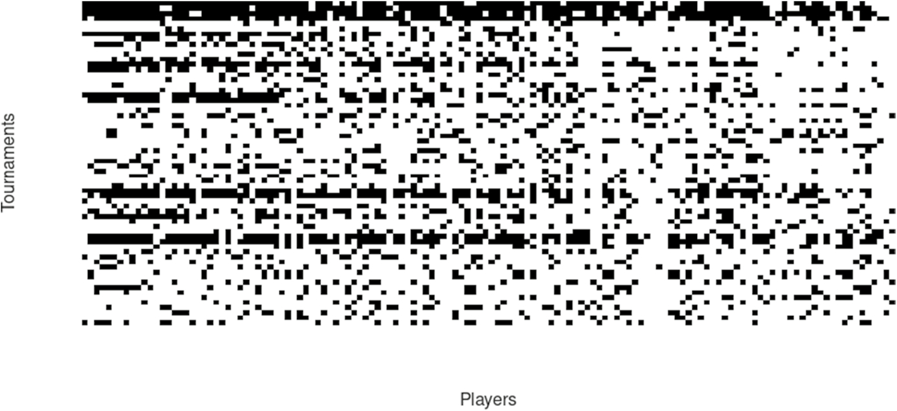
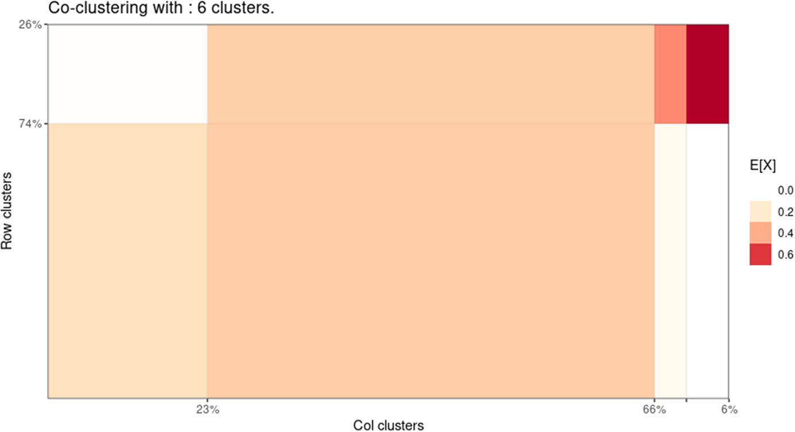
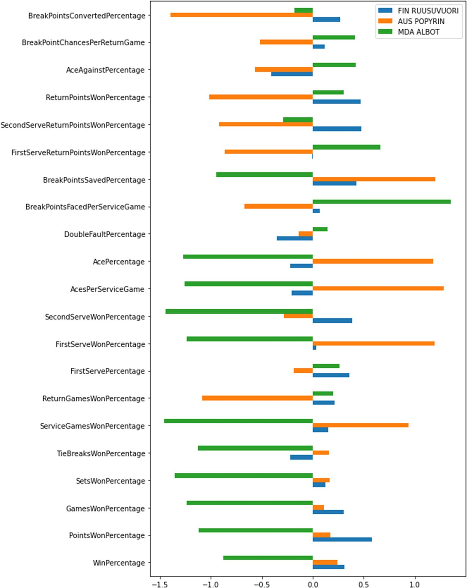
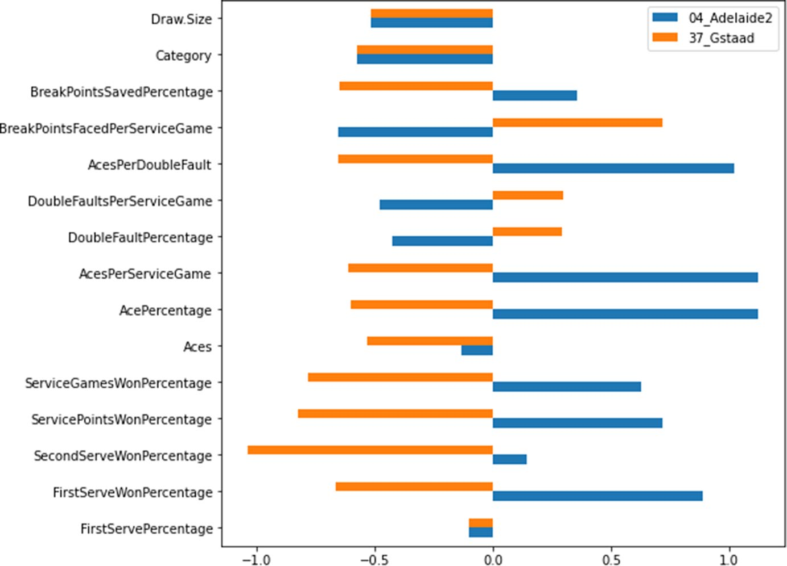
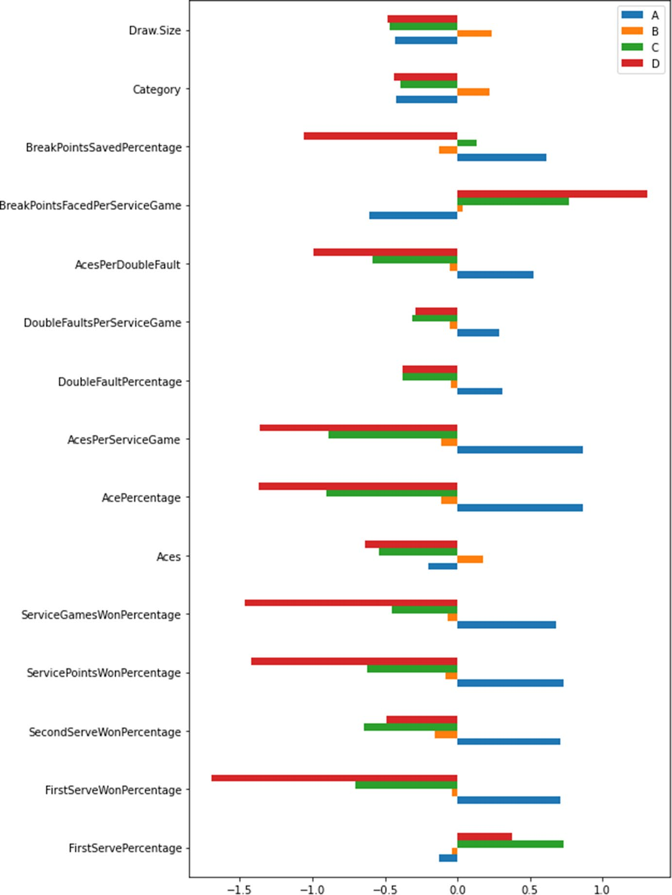
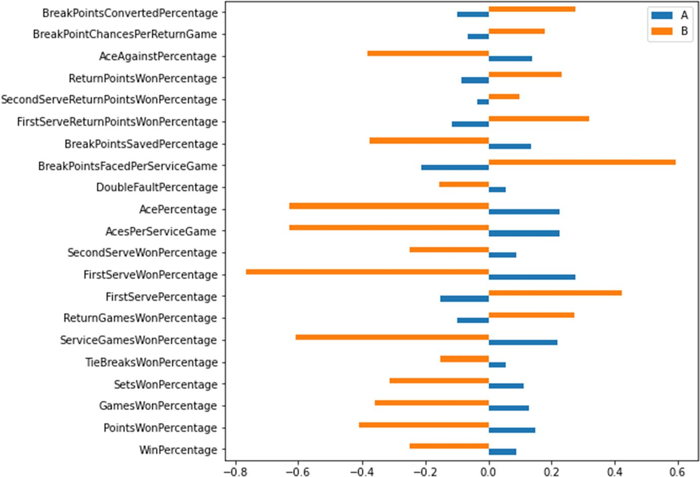

<!--
provenance:
  doi: 10.1007/s00180-024-01493-2
  title: Network and attribute-based clustering of tennis players and tournaments
  source: unknown
  download_url: unknown
  final_host: unknown
  filed: 2026-07-12
-->

<!-- page 1 -->

# **Network and attribute‑based clustering of tennis players and tournaments** 

### **Pierpaolo D’Urso****1** **· Livia De Giovanni****2,3** **· Lorenzo Federico****2,3** **· Vincenzina Vitale****1** 

Received: 2 February 2024 / Accepted: 23 March 2024 / Published online: 16 April 2024 © The Author(s) 2024 

### **Abstract** 

This paper aims at targeting some relevant issues for clustering tennis players and tournaments: (i) it considers players, tournaments and the relation between them; (ii) the relation is taken into account in the fuzzy clustering model based on the Partitioning Around Medoids (PAM) algorithm through spatial constraints; (iii) the attributes of the players and of the tournaments are of different nature, qualitative and quantitative. The proposal is novel for the methodology used, a spatial Fuzzy clustering model for players and for tournaments (based on related attributes), where the spatial penalty term in each clustering model depends on the relation between players and tournaments described in the adjacency matrix. The proposed model is compared with a bipartite players-tournament complex network model (the DegreeCorrected Stochastic Blockmodel) that considers only the relation between players and tournaments, described in the adjacency matrix, to obtain communities on each side of the bipartite network. An application on data taken from the ATP official website with regards to the draws of the tournaments, and from the sport statistics website Wheelo ratings for the performance data of players and tournaments, shows the performances of the proposed clustering model. 

- Lorenzo Federico lfederico@luiss.it 

   - Pierpaolo D’Urso pierpaolo.durso@uniroma1.it 

Livia De Giovanni ldegiovanni@luiss.it 

Vincenzina Vitale 

   - vincenzina.vitale@uniroma1.it 

- 1 Department of Social Science and Economics, Sapienza University, Piazzale Aldo Moro 5, 00185 Rome, Lazio, Italy 

- 2 Department of Political Science, Luiss University, Viale Romania 32, 00197 Rome, Lazio, Italy 

- 3 Data Lab, Luiss University, Viale Pola 12, 00198 Rome, Lazio, Italy

<!-- page 2 -->

**Keywords** Fuzzy clustering · Spatial constraints · Bipartite networks · Tennis 

## **1  Introduction and literature review** 

Data is now extensively gathered and scrutinized in the field of sports through the amalgamation of physical and digital sources. This integration is significantly augmenting the understanding of professional sports for all stakeholders. The statistical analysis of sports data has the potential to refine decision-making processes concerning player and team performance, player health and safety, fan engagement, marketing strategies, revenue generation, sports economics, practice, and overall well-being. Data sources encompass both private and public institutions, the Internet of Things, and social networks. The application of distinct statistical learning methods varies based on the sport, the nature of the data, and the specific objectives of the analysis. Data is systematically collected during both training sessions and matches to extract valuable insights into factors influencing the success of players and teams. These factors encompass the fairness of competition, player assessment, scheduling, tactics, identification of key performance indicators, drafting, rule-making, and ranking. The availability and analysis of data contribute significantly to enhancing the accuracy of forecasting the outcomes (winner) in matches, and understanding the underlying factors influencing these outcomes. The playing characteristics of players are important both from a technical and economic point of view. From the technical point of view, they allow to evaluate the playing characteristics that lead the player and the team to achieve winning results; from the economic point of view, they allow to establish the value of a player. 

In the literature, empirical studies and methodological proposals based on data science and data-driven approaches have been carried out on many sports disciplines to analyze the large mass of sport data both in the field of performance and in the medical, social or economic fields. Recent contributions can be found in the special issues “Statistical Modelling for Sports Analytics” by Groll et al. (2018) and “Big data and data science in sport” by D’Urso et al. (2023). 

Clustering of sport data has been proposed based on traditional clustering approaches and on the theory of networks, either based on modularity (Fortunato 2010; de Arruda et al. 2012) or on a mixture model and the expectationmaximization technique (Snijders and Nowicki 1997). See Ribeiro et al. (2017), Ramos et al. (2018) for the use of network-based approaches in sport. 

2003), Papers specifically on clustering of sports data in football are Lu and Tan ( Gates et al. (2017), Narizuka and Yamazaki (2019), Zachary et al. (2020), D’Urso et al. (2023), Carpita et al. (2023) and in basketball, Behravan and Razavi (2021), Zuccolotto et al. (2018), Ulas (2021), Chessa et al. (2023). In Lu and Tan (2003) an unsupervised clustering of dominant scenes in sports video is presented, in which data are preprocessed by Principal Components and Linear Discriminant Analysis. Gates et al. (2017 ) propose an unsupervised classification method that defines subgroups of individuals that have similar dynamic models. They apply this method on functional MRI from a sample of former American football players. Narizuka and Yamazaki (2019) develop a clustering algorithm to extract transition patterns of the

<!-- page 3 -->

formation of a given team during the game. Zachary et al. (2020) use _K_ -means Clustering to Create Training Groups for Elite American Football Student-athletes Based on Game Demands. In D’Urso et al. (2023) the authors develop a robust fuzzy clustering model for mixed data. For each variable, or attribute, a dissimilarity measure is proposed, and the clustering procedure combines the dissimilarity matrices with weights objectively computed during the optimization process. The weights reflect the relevance of each attribute type in the clustering results. The model is used to cluster football players with respect to mixed data on performances. In Carpita et al. (2023 ) the authors investigate the ability of various composite indicators to define a measurement structure for global football performance. The theoretical football performance dimensions are based on a set of 29 players’ attributes periodically produced by Electronics Arts (EA) Sports experts. The players’ performance attributes or variables are considered and processed with three different techniques: the Cluster of variables around Latent Variables (CLV), the Principal Covariates Regression (PCovR) and Bayesian Model-Based Clustering (B-MBC), and the resulting clusters have been embedded into structural equation models with Partial Least Squares (PLS-SEMs) with a Higher-Order Component (that is, the overall football performance). Results show the validity of composite indicators. 

In Zuccolotto et al. (2018) the authors use random forests and extremely randomized trees to represent maps of the court visualizing areas with different levels of scoring probability of the analysed player or team. The approaches are demonstrated by the analysis of data from the NBA regular season 2020/2021. In Ulas (2021) NBA teams’ characteristics and similarities were assessed firstly with Machine Learning techniques (K-means and Hierarchical clustering) and secondly with Ordinary Linear Regression (OLS) to investigate the factors that affect the NBA team values. In Chessa et al. (2023) the authors propose the use of a weighted complex network to detect communities of basketball players on the basis of their performances. A sparsification procedure to remove weak edges is also applied, confirmed by the normalized mutual information, so that not only the best distribution of nodes into communities is found, but also the ideal number of communities as well. An application to community detection of basketball players for the NBA regular season 2020–2021 is presented. 

Tennis is an individual sport, besides the premier international team event in men’s tennis, the Davis Cup. A review of methods of data collection in tennis can be found in Takahashi et al. (2023). A review of models of data analysis in tennis is given in Kovalchik (2021). Kovalchik observes that despite the extensive historical application of statistical methods to tennis, the current state of analytical work in the sport appears to be trailing behind most professional sports, and delves into the reasons why data-driven methods in tennis have struggled to gain popularity. Unlike baseball, where statistical tabulation has been a staple since the introduction of the first box score in 1845, organizers of tennis competitions have historically neglected to quantify their sport. This oversight stems directly from the decentralized structure and fragmentation among multiple promoters of tennis events, including the International Tennis Federation, the Grand Slam Board, the ATP Tour, and the WTA. 

Probabilistic models in tennis were starting to be utilized to assess strategy, with an early example being the examination of optimal service strategy by

<!-- page 4 -->

George (1973). This work demonstrated that the expected point value of a standard two-service strategy could be formalized as the weighted sum of winning a point on a strong serve and a weak serve, each weighted by the probability that the serve was played and was good. 

Two decades after the initial mathematical studies in the 1970s, tennis experienced a significant surge in statistical research. Leading this wave were Franc Klaassen, a former national junior player for the Netherlands who entered the economics doctoral program at the University of Tilburg in 1995, and Jan Magnus, a Tilburg professor. Their enduring research partnership began with the application of quantitative analysis to various "tennis myths" that had never been scientifically tested (Magnus and Klaassen 1996). In the process, they delved into the independent identically distributed model more extensively than any study before. By 2001, Klaassen and Magnus had validated the model against outcomes from 90,000 points played at Wimbledon, marking the first instance of large-scale statistical analysis in tennis (Klaassen and Magnus 2001). 

Throughout two decades of research into the statistical aspects of tennis, prediction emerged as a predominant theme. Using a paired comparison framework, Klaassen and Magnus pioneered model-based approaches to predict the most likely winner of points in tennis matches and explore contextual factors 2003). Their work influencing a player’s win probability (Klaassen and Magnus propelled tennis prediction beyond the mathematical models of the 1970s, establishing the fitting of statistical models to large competitive datasets as the new standard. Subsequent researchers built on this foundation, measuring and testing predictors of tennis outcomes and creating more sophisticated models of tennis performance (Kovalchik 2016). 

By the 2000s, there was a growing body of statistical research on tennis, highlighting a prevalent data problem in the sport. The introduction of the HawkEye player challenge system at the 2006 U.S. Open marked a pivotal moment. This multi-camera tracking system for line-call review not only addressed the data problem but also positioned tennis at the forefront of officiating innovations, being among the first to adopt a positional tracking system presented tennis with an opportunity to compete in the big data race in sports, aligning it with major leagues in terms of technological advancements. 

In the recent literature aimed at predicting the outcomes of sporting events, tennis still plays a prominent role with a variety of methods. Arcagni et al. (2023) extend the class of paired comparison approaches models by using indicators derived from the theory of complex networks for the predictions. They propose a measure based on eigenvector centrality. Unlike what happens for the standard paired comparisons class (where the rates or latent abilities only change at time _t_ for those players involved in the matches at time _t_ ), the use of a centrality measure allows the ratings of the whole set of players to vary every time there is a new match. The resulting ratings are then used as a covariate in a simple predictive logit model. In Tea and Swartz (2023) the authors investigate intended serve direction with Bayesian hierarchical models applied on an extensive data source of professional tennis players at Roland Garros. They find discernible differences between men’s and women’s tennis, and between individual players. General serve tendencies such

<!-- page 5 -->

as the preference of serving towards the body on second serve and on high pressure points are revealed. 

The presented literature has shown the importance of partitioning and clustering of players on the basis of performance, position, competitions attended and other variables. This paper proposes a clustering model in tennis. The model aims at targeting some relevant issues for clustering tennis players and tournaments: (i) it considers players, tournaments and the relation between them; (ii) the relation is taken into account in the fuzzy clustering model based on the Partitioning Around Medoids (PAM) algorithm through spatial constraints; (iii) the attributes of the players and of the tournaments are of different nature, qualitative and quantitative. 

The proposal is novel for the methodology used, a spatial fuzzy clustering model (cfr Coppi et al. 2010) for players and for tournaments (based on related attributes), where the spatial penalty term in each clustering model depends on the relation between players and tournaments described in the adjacency matrix. The proposed model is compared with a clustering model based on fitting a bipartite playerstournament complex network model (the Degree-Corrected Stochastic Blockmodel) to the adjacency matrix that considers only the relation between players and tournaments, described in the adjacency matrix, to obtain communities on each side of the bipartite network. 

Even though communities form around nodes that have common edges and common attributes, typically, algorithms have only focused on one of these two data modalities: community detection algorithms traditionally focus only on the network structure, while clustering algorithms mostly consider only node attributes. 

The paper is structured as follows. In Sect. 2 the data and models used are presented. Section 3 reports the results of the application of the models to clustering of tennis players and tournaments. Section 4 concludes the paper and provides directions for future work. 

## **2  The models** 

In this section, we give an overview of the data used in the paper in Sect. 2.1 and then define and explain the two clustering algorithms we are going to apply to these data: the Spatially-corrected fuzzy Partition Around Medoids (Sect. 2.2) and the Degree-Corrected Stochastic Blockmodel (Sect. 2.3). 

### **2.1  The data** 

For the analysis in this paper, we use data taken from the ATP official website ATP (2023) with regards to the draws of the tournaments, and from the sport statistics website Wheelo Ratings Wheelo (2023) for the performance data of players and tournaments. 

The data is organized as follows:

<!-- page 6 -->

**Fig. 1** Visual representation of the adjacency matrix **A** . Black squares corresponds to 1s

<!-- Fig. 1 transcription (low-value structural image): a 136-row by 64-column binary grid, players on rows and tournaments on columns, a black square marking each player-tournament participation (a_{n,s}=1). No numeric values to read off; it only shows the sparsity and block structure of who entered which draw. --> 

- Matrix **X** = { _xni_ , _n_ ≤ _N_ , _i_ ≤ _I_ } of player data, recording _I_ = 21 attributes for each of the _N_ = 136 players that played at least 10 matches on the ATP Tour. 

- Matrix **Y** = { _ysj_ , _s_ ≤ _S_ , _j_ ≤ _J_ } of tournament data, recording _J_ = 18 attributes for each of the _M_ = 64 individual tournaments of the ATP tour, after excluding the ATP finals and the team competitions. 

- Adjacency matrix **A** , in which the rows correspond to players and columns to tournaments. Here, _an_ , _s_ = 1 if player _n_ participated to the main draw of tournament _s_ and _an_ , _s_ = 0 otherwise.1 The matrix **A** is visualized in Fig. 1. 

### **2.2  Spatially‑corrected fuzzy partition around medoids** 

The first analysis we perform is based on the application of two distinct versions of Fuzzy Partition around Medoids (PAM) with Spatial Penalty using different distances for player and tournament attributes due to the different nature of the data. Note that we use the term _spatial_ to refer to the correction to the model due to the network structure as this is the standard term used in the literature, but, as can be deduced by the nature of the data, it is not to be intended as adjacency in a physical space but on in an abstract sense in the bipartite network. The goal is to find an optimal fuzzy partition of the sets that clusters together units that are similar both with regards to the attributes in the matrices **X** and **Y** and the adjacency structure in the matrix **A** . We follow an approach similar to the one outlined in Pham (2001), but with some modifications necessary to take into account the bipartite structure of the adjacency matrix **A** . Here, in the data there is no direct measure of adjacency among players or among tournaments, but only between players and tournaments, based on participation, as encoded in **A** . 

1 Here, as it is presented in the official draws available on the ATP website, if a player withdraws before the start of his first match, and is replaced by a lucky loser, he is not considered as a participant.

<!-- page 7 -->

To compute the similarity in the adjacency relations between units on the same side, from the adjacency matrix **A** , we create two distinct similarity matrices **퐁**(**퐩**) for players and **퐁**(**퐭**) for tournaments, applying the cosine similarity (see Wael and Aly 2013) respectively to the rows and columns of the matrix **A** . 

That is, we have for every two players _h_ and _l_ 

$$b^{(p)}_{hl} = \frac{\sum_{s=1}^{S} a_{hs}\,a_{ls}}{\left(\sum_{s=1}^{S} a_{hs}\ \sum_{s=1}^{S} a_{ls}\right)^{1/2}}. \tag{1}$$

By definition $b^{(p)}_{hl} \in [0,1]$, and $b^{(p)}_{hl} = 1$ if both players have played exactly the same tournaments and $b^{(p)}_{hl} = 0$ if the tournaments they played have no overlap. Similarly, for every two tournaments _h_ and _l_ we have 

$$b^{(t)}_{hl} = \frac{\sum_{n=1}^{N} a_{nh}\,a_{il}}{\left(\sum_{n=1}^{N} a_{nh}\ \sum_{n=1}^{N} a_{nl}\right)^{1/2}}. \tag{2}$$

<!-- [sic] the render prints $a_{il}$ in the numerator's second factor; by the column-cosine definition this should be $a_{nl}$. Transcribed as printed. -->

Also here, $b^{(t)}_{hl} = 1$ means that the draws of tournaments _h_ and _l_ contained exactly the 

> same players and _b_( _hl__t_)= 0 means that no player competed in both tournaments_h_and _l_ . The reasons why the cosine similarity is viable as a metric for the proximity of units is that the resulting matrices **퐁**(**퐩**) and **퐁**(**퐭**) are symmetric, and, since the original matrix **A** is non-negative, all the entries in **퐁**(**퐩**) and **퐁**(**퐭**) will be non-negative too. 

We then apply fuzzy spatial partition-around-medoids algorithms on the matrices **X** and **퐁**(**퐩**) on one side, and **Y** and **퐁**(**퐭**) on the other. 

In practice, we want to find two different matrices of membership degree **U** and **W** 

$$\mathbf{U} := \{u_{nc},\ n \le N,\ c \le C\}, \quad \mathbf{W} := \{w_{se},\ s \le S,\ e \le E\}, \tag{3}$$

where _unc_ represents the degree of membership of player _n_ to cluster _c_ and _wse_ the degree of membership of tournament _s_ to cluster _e_ . Furthermore, for each of the two partition matrices, are provided _C_ and _E_ prototypes, called medoids, i.e. the subsets ( **x** 1, … , **x** _c_ , … , **x** _C_ ) and ( **y** 1, … , **y** _e_ , … , **y** _E_ ) , whose generic **x** _c_ , for _c_ ≤ _C_ , is chosen among the _N_ observed units **x** _n_ = ( _xn_ 1, … , _xnI_ ) , with _n_ ≤ _N_ , and the _S_ observed units **y** _s_ = ( _ys_ 1, … , _ysJ_ ) , with _s_ ≤ _S_ , respectively, by solving the following minimization problems. 

To cluster the players we optimize 

$$\min_{\mathbf{U},(\mathbf{x}_1,\dots,\mathbf{x}_C)}:\ \sum_{n=1}^{N}\sum_{c=1}^{C} u_{nc}^{m_1}\, d^2(\mathbf{x}_n,\mathbf{x}_c) + \frac{\beta_1}{2}\sum_{n=1}^{N}\sum_{c=1}^{C} u_{nc}^{m_1}\sum_{n'=1}^{N}\sum_{c'\neq c} b^{(p)}_{nn'}\, u_{n'c'}^{m_1} \quad\text{s.t.}\ \sum_{c=1}^{C} u_{nc}=1,\ u_{nc}\ge 0. \tag{4}$$

> Here the parameter _m_ 1 ≥ 1 tunes the fuzziness of the partition and the parameter _훽_ 1 ≥ 0 the importance of the spatial regularization based on the cosine similarity

<!-- page 8 -->

matrix **퐁**(**퐩**) . In this case _d_ ( **x** _n_ , **x** _c_ ) is the Euclidean distance in ℝ_I_ between the attributes of the unit _n_ and the medoid of the cluster _c_ . 

Similarly, to cluster the tournaments we optimize 

$$\min_{\mathbf{W},(\mathbf{y}_1,\dots,\mathbf{y}_E)}:\ \sum_{s=1}^{S}\sum_{e=1}^{E} w_{se}^{m_2}\, d_G^2(\mathbf{y}_s,\mathbf{y}_e) + \frac{\beta_2}{2}\sum_{s=1}^{S}\sum_{e=1}^{E} w_{se}^{m_2}\sum_{s'=1}^{S}\sum_{e'\neq e} b^{(t)}_{ss'}\, u_{s'e'}^{m_2} \quad\text{s.t.}\ \sum_{e=1}^{E} w_{se}=1,\ w_{se}\ge 0. \tag{5}$$

> Here the parameter _m_ 2 ≥ 1 tunes the fuzziness of the partition and the parameter _훽_ 2 ≥ 0 the importance of the spatial regularization based on the cosine similarity matrix **퐁**(**퐩**) . Here, _dG_ ( **y** _s_ , **y** _e_ ) is the Gower’s distance (see Gower 1971) in the space of attributes between the attributes of the unit _n_ and the medoid of the cluster _e_ . Gower’s distance is chosen as the matrix **Y** contains some columns with qualitative attributes. 

Here, we have to note that the cosine similarity matrices **퐁**(**퐩**) and **퐁**(**퐭**) are dense matrices, i.e., they have few 0 entries. This puts limits on the admissible values of _훽_ 1 , _훽_ 2 , as the spatial penalty term punishes a partition that separates units with high similarity values but does not punish a partition that puts together units with low similarity values. Consequently, if the weight given to the spatial term is too high, the penalty for separating clusters becomes too high, and the entire output partition collapses in one single cluster. 

### **2.3  Degree‑corrected stochastic blockmodel** 

We next want to analyse the adjacency structure between players and tournaments as a bipartite network. To better understand the underlying structure of the bipartite player-tournament network, before the extraction of the cosine similarity matrices and the addition of attributes we fit to them a Degree-Corrected Stochastic Blockmodel (DCSBM) using the R package `greed` . The DCSBM was defined in Karrer and Newman (2011 ) for the goal of community detection, that is, of finding denser subgraphs inside a large network. 

In a DCSBM every vertex is assigned an expected degree and the membership to a cluster. Note that when, as in this paper, we deal with bipartite networks, clusters are defined separately on the left and right side of the network. Nodes of the same cluster are expected to have similar patterns in which neighbours they connect to, while also having the prescribe expected value of the degree. We assign two (crisp) membership matrices **U** ∶= { _unc_ , _n_ ≤ _N_ , _c_ ≤ _C_ } and **W** ∶= { _wse_ , _s_ ≤ _S_ , _e_ ≤ _E_ } , such that _unc_ ∈{0, 1} ,∑ _c__u_ _nc_= 1 for all_n_,_c_and similarly_w_ _se_∈{0, 1} , ∑ _e__w_ _se_= 1 for all _s_ , _e_ . We further define a _C_ × _E_ matrix Ω = { _휔ce_ } _c_ ≤ _C_ , _e_ ≤ _E_ of expected connection intensities between clusters, such that _휔ce_ ≥ 0 for all _c_ , _e_ , and a vector representing the expected degrees of the vertices on both sides **d** ∶= { _dl_ , _l_ ≤ _N_ + _S_ } . Given two vertices _n_ ∈ [ _N_ ], _s_ ∈ [ _S_ ], the number of edges between them is represented by the variable _Xns_ with

$$X_{ns} \sim \mathrm{Poi}(\lambda_{ns}), \quad \lambda_{ns} := \sum_{c \le C,\, e \le E} \tilde{u}_{nc}\,\tilde{w}_{se}\,\omega_{ce}\,d_n\,d_s. \tag{6}$$

<!-- page 9 -->

We fit the parameters (both weights and cluster memberships) of this model to the empirical data using the R package `greed` (Côme and Jouvin 2022). This is done by a variational extension of the expectation-maximization (EM) algorithm. The variational EM algorithm alternates between the optimization of a lower bound on the Integrated Complete-data Likelihood (ICL) of the observed network over the membership matrices **U** , **W** for fixed values of the model parameters Ω, **d** (E-step), and over the parameter for fixed values of the membership matrices (M-step). Here we note that using a Poisson distribution for the number of edges between two vertices instead of a Bernoulli distribution, we allow for multi-edges even if the original matrix **A** is a binary matrix. This choice is made in order to make it feasible to estimate the parameters of the model during the M-step. Indeed, to estimate the distribution of the number of edges between two clusters _c_ and _e_ in the model, we can exploit the fact that Poisson random variables have a simple additive structure such that 

$$\sum_{n=1}^{N}\sum_{s=1}^{S} \mathrm{Poi}\!\left(\tilde{u}_{nc}\tilde{w}_{se}\omega_{ce}d_n d_s\right) \sim \mathrm{Poi}\!\left(\sum_{n=1}^{N}\sum_{s=1}^{S} \tilde{u}_{nc}\tilde{w}_{se}\omega_{ce}d_n d_s\right). \tag{7}$$

The distribution of the sum of a large number of Bernoulli variables with different parameters has instead no tractable representation. Given that in the model studied _𝜆ns <_ 1.5 uniformly, and its average _𝜆<_ 0.3 , we expect the Poisson approximation not to distort heavily the results. 

## **3  Results** 

In this section, we provide a more detailed overview of the data in Sect. 3.1, and then present the outputs of the classification algorithms in Sect. 3.2. Finally, in Sect. 3.3 we analyse the properties of the clusters obtained, both with respect to the attributes and the network, and compare the results of the two models. 

### **3.1  Descriptive analysis** 

In this subsection we present in Tables 1 and 2 the descriptive statistics for all the numeric attributes of players and tournaments, respectively. For the players we extracted a total of 21 numeric attributes from the Wheelo rating website. For the tournaments, we got 13 numeric attributes from the Wheelo rating website, which we supplemented with 5 more attributes, 2 numeric and 3 qualitative ( `Surface, In.Outdoor` and `Nation` ), from the ATP website. We report the names of the attributes from the Wheelo rating website as they were shown there, even if some names might be misleading. Several attributes are referred to as “percentage" which would suggest that they are normalized between 0 e 100, instead for all of them the

<!-- page 10 -->

**Table 1** Mean, Standard Deviation, Maximum and Minimum for each player attribute over all the 136 players considered 

||Mean|StDev|Max|Min|
|---|---|---|---|---|
|WinPercentage*|0.480|0.128|0.902|0.167|
|PointsWonPercentage*|0.497|0.016|0.549|0.447|
|GamesWonPercentage*|0.494|0.033|0.596|0.399|
|SetsWonPercentage*|0.484|0.100|0.825|0.241|
|TieBreaksWonPercentage*|0.494|0.142|1.000|0.000|
|ServiceGamesWonPercentage*|0.788|0.060|0.918|0.638|
|ReturnGamesWonPercentage*|0.200|0.044|0.309|0.074|
|FirstServePercentage*|0.623|0.035|0.720|0.545|
|FirstServeWonPercentage*|0.713|0.044|0.802|0.613|
|SecondServeWonPercentage*|0.506|0.029|0.573|0.411|
|AcesPerServiceGame|0.477|0.218|1.399|0.100|
|AcePercentage*|0.075|0.036|0.229|0.014|
|DoubleFaultPercentage*|0.036|0.015|0.131|0.017|
|BreakPointsFacedPerServiceGame|0.541|0.117|0.845|0.274|
|BreakPointsSavedPercentage*|0.612|0.042|0.703|0.508|
|FirstServeReturnPointsWonPercentage*|0.282|0.026|0.349|0.211|
|SecondServeReturnPointsWonPercentage*|0.488|0.030|0.551|0.392|
|ReturnPointsWonPercentage*|0.360|0.025|0.420|0.282|
|AceAgainstPercentage*|0.078|0.020|0.130|0.037|
|BreakPointChancesPerReturnGame|0.518|0.088|0.772|0.305|
|BreakPointsConvertedPercentage*|0.385|0.045|0.522|0.236|

Attributes with * can only take values in [0, 1] by definition 

normalization is between 0 and 1. As we standardize anyway all numeric variables to have mean 0 and variance 1, this has no impact on the outcome of the analysis. 

### **3.2  Output of the partition algorithms** 

In this section we show the outputs of the partition algorithms. We use numbers to identify the PAM clusters, and letters to identify the DCSBM clusters. We start analysing the Fuzzy Spatial Partition Around Medoids. We set the spatial parameters _훽_ 1 = 1∕10 and _훽_ 2 = 1∕150 so that they would be low enough not cause the partition to collapse into only one cluster. Indeed, the spatial term is defined in the objective function in (4) and (5 ) so that there is a penalty for assigning adjacent units to different clusters, but not for assigning non-adjacent units to the same cluster. Choosing higher values of _훽_ 1 and _훽_ 2 would result in the spatial penalty becoming more important than the contribution from the attributes, and make the optimal solution one in which all units are assigned to the same cluster. We limited ourselves to values of _m_ 1, _m_ 2 ≤ 1.2 to prevent the output of too many fuzzy units and make it more natural the comparison with the partition coming from the DCSBM, which are crisp by nature. We used the

<!-- page 11 -->

**Table 2** Mean, Standard Deviation, Maximum and Minimum for each numerical tournament attribute over all the 64 tournaments considered 

||Mean|StDev|Max|Min|
|---|---|---|---|---|
|FirstServePercentage*|0.624|0.017|0.658|0.583|
|FirstServeWonPercentage*|0.715|0.027|0.781|0.639|
|SecondServeWonPercentage*|0.509|0.016|0.555|0.477|
|ServicePointsWonPercentage*|0.638|0.022|0.682|0.587|
|ServiceGamesWonPercentage*|0.794|0.040|0.874|0.695|
|Aces|511.234|507.885|2597.000|131.000|
|AcePercentage*|0.076|0.023|0.133|0.032|
|AcesPerServiceGame|0.486|0.141|0.849|0.214|
|DoubleFaultPercentage*|0.035|0.007|0.052|0.022|
|DoubleFaultsPerServiceGame|0.227|0.045|0.331|0.140|
|AcesPerDoubleFault|2.241|0.881|5.817|0.812|
|BreakPointsFacedPerServiceGame|0.530|0.072|0.693|0.376|
|BreakPointsSavedPercentage*|0.615|0.033|0.694|0.543|
|Category|515.625|464.781|2000.000|250.000|
|Draw Size|43.000|29.072|128.000|28.000|

Attributes with * can by definition only take values in [0, 1] 

> Fuzzy Silhouette validity index to identify the optimal values of _m_ 1, _m_ 2 and _C_ , _E_ for 

> the fuzzy clustering, obtaining the optimal values of _m_ 1 = 1.15 , _C_ = 3 (see Table 3) 

> for the players and _m_ 2 = 1.05 , _E_ = 2 (see Table 4) for the tournaments. The partition obtained using the optimal choices for the number of clusters and the fuzziness parameter are shown in Table 5. In the analysis we consider a unit a member of a cluster if its fuzzy membership to said cluster is above 0.6 for players, or 0.7 for tournaments (cfr Maharaj and D’Urso 2011). Player and tournaments that do not reach these thresholds for any cluster are considered as fuzzy units. The full tables of the fuzzy memberships are presented in the supplementary material. For the players the optimal clustering produces 3 clusters: cluster 1 (medoid Ruusuvuori) is the largest, containing more than half of the players (74 out of 136), with cluster 2 (medoid Albot) and cluster 3 (medoid Popyrin) containing 27 and 29 players respectively. 6 players are classified as fuzzy units. It is interesting to note that we have fuzzy units with all possible combinations of shared memberships: Thiem and Purcell between clusters 1 and 3, Shang and Gasquet between clusters 1 and 2, Kovacevic between clusters 2 and 3 and Bergs among all of the 3 clusters (see the supplementary material). Tournament clustering instead outputs cluster 1 (medoid Adelaide 2) with 37 units and cluster 2 (medoid Gstaad) with 23 units. 4 units (Delray Beach, Houston, Beijing and Stockholm) are considered fuzzy. 

The Degree-corrected Stochastic Blockmodel outputs instead 6 clusters, 2 for the player side of the network, and 4 on the tournament side, as shown in Fig. 2. Here there is no external validation index for the clustering, the optimization of the ICL is done over the number of clusters together with the optimization of memberships and parameters. On the player side we have cluster _A_ with 100 players and cluster

<!-- page 12 -->

**Fig. 2** Edge densities (number of present edges divided by maximum possible number of edges) between clusters in the DCSBM

<!-- Fig. 2 transcription (data-bearing heatmap). Title: "Co-clustering with : 6 clusters." Rows are the 2 player clusters (marked 26% and 74% of players), columns are the tournament clusters (marked 23%, 66%, 6%). Cell colour = E[X], the expected edge density between a player cluster and a tournament cluster, on a scale 0.0 (pale) to ~0.6 (dark red). The single dark-red high-density cell is the top-right corner: the smaller player cluster (26%) with the smallest tournament group (6%). Most cells sit in the pale 0.2 band. The plot shows which player group concentrates its participation in which tournament group; exact per-cell numbers are not printed. --> 

**Table 3** Fuzzy silhouette of the player clustering for different choices of _C_ and _m_ 1 

| _C_ \ _m_1 | 1.05 | 1.10 | **1.15** | 1.20 |
|---|---|---|---|---|
| 2 | 0.335 | 0.346 | 0.356 | 0.365 |
| **3** | 0.342 | 0.357 | **0.370** | 0.362 |
| 4 | 0.252 | 0.218 | 0.252 | 0.279 |
| 5 | 0.142 | 0.100 | 0.212 | 0.215 |

Bold values indicate the optimal values of _C_ and _m_ 1 , and the corresponding Fuzzy silhouette 

**Table 4** Fuzzy silhouette of the tournament clustering for different choices of _E_ and _m_ 2 

|_E_\_m_2|**1**.**05**|1.10|1.15|1.20|
|---|---|---|---|---|
|**2**|**0**.**293**|0.262|0.277|0.284|
|3|0.218|0.055|0.066|0.075|
|4|0.104|0.166|0.189|0.198|
|5|0.211|0.167|0.190|0.246|

Bold values indicate the optimal values of _E_ and _m_ 2 , and the corresponding Fuzzy silhouette 

_B_ with 36. On the tournament side we have the majority of tournaments (42 out of 64) in cluster _B_ , with cluster _A_ counting 15 units, and cluster _C_ and _D_ only 3 and 4, respectively.

<!-- page 13 -->

**Table 5** Cluster membership for players and tournaments using Degree-Corrected Stochastic Blockmodel (BM) and Fuzzy Partition Around Medoids (PAM) 

|Players|||Tournaments|||
|---|---|---|---|---|---|
|Name|BM|PAM|Name|BM|PAM|
|SRB DJOKOVIC|A|1|01_Adelaide1|A|1|
|ESP ALCARAZ|B|1|02_Pune|B|1|
|ITA SINNER|A|1|03_Auckland|B|1|
|RUS MEDVEDEV|A|1|**04_Adelaide2**|A|1|
|RUS RUBLEV|A|1|S1_Australian_Open|B|1|
|GER ZVEREV|A|1|05_Dallas|A|1|
|BUL DIMITROV|A|1|06_Cordoba|D|2|
|DEN RUNE|A|1|07_Montpellier|A|1|
|POL HURKACZ|A|3|08_Rotterdam|A|1|
|GRE TSITSIPAS|A|1|09_Delray_Beach|A|Fuzzy|
|USA FRITZ|A|1|10_Buenos_Aires|D|2|
|AUS DE MINAUR|A|1|11_Rio_de_Janeiro|D|2|
|CHI JARRY|B|3|12_Doha|A|1|
|GBR DRAPER|A|1|13_Marseille|A|1|
|RUS KHACHANOV|A|1|14_Dubai|A|1|
|USA SHELTON|A|3|15_Acapulco|A|2|
|FRA HUMBERT|A|1|16_Santiago|D|2|
|NOR RUUD|A|1|17_Indian_Wells|B|1|
|RUS SAFIULLIN|A|1|18_Miami|B|1|
|ITA BERRETTINI|A|3|19_Houston|B|Fuzzy|
|ARG CERUNDOLO|B|1|20_Marrakech|B|2|
|CAN AUGER-ALIASSIME|A|3|21_Estoril|B|2|
|USA TIAFOE|A|1|22_MonteCarlo|B|2|
|USA KORDA|A|1|23_Barcelona|B|2|
|USA PAUL|A|1|24_Munich|B|2|
|ITA ARNALDI|A|1|25_BanjaLuka|B|2|
|NED GRIEKSPOOR|A|3|26_Madrid|B|1|
|FRA MANNARINO|A|1|27_Roma|B|2|
|FRA MONFILS|A|1|28_Geneva|B|2|
|ESP DAVIDOVICH FOKINA|A|1|29_Lyon|B|2|
|GBR NORRIE|B|1|S2_Roland_Garros|B|2|
|CZE LEHECKA|A|1|30_Stuttgart|A|1|
|ITA MUSETTI|B|1|31_s’Hertogenbosch|A|1|
|FRA FILS|A|1|32_Queen’s|B|1|
|SRB DJERE|B|1|33_Halle|B|1|
|SUI STRICKER|A|3|34_Mallorca|B|1|
|ARG BAEZ|B|1|35_Eastbourne|B|2|
|RUS KARATSEV|A|1|S3_Wimbledon|B|1|
|GER STRUFF|A|3|36_Newport|A|2|
|JPN NISHIOKA|A|1|**37_Gstaad**|B|2|

<!-- page 14 -->

**Table 5** (continued) 

|Players|||Tournaments|||
|---|---|---|---|---|---|
|Name|BM|PAM|Name|BM|PAM|
|KAZ BUBLIK|A|3|38_Bastad|C|2|
|CRO GOJO|A|3|39_Hamburg|C|2|
|CAN SHAPOVALOV|A|1|40_Atlanta|A|1|
|RUS SHEVCHENKO|A|1|41_Umag|B|2|
|**FIN RUUSUVUORI**|A|1|42_Washington|A|1|
|USA EUBANKS|A|3|43_Los_Cabos|B|2|
|CHI GARIN|B|1|44_Kitzbuhel|C|2|
|NED VAN DE ZANDSCHULP|A|1|45_Toronto|B|1|
|USA WOLF|A|1|46_Cincinnati|B|1|
|USA MCDONALD|A|1|47_Winston-Salem|B|1|
|CRO CORIC|A|1|S4_US_Open|B|1|
|CZE MACHAC|A|1|48_Chengdu|B|1|
|AUS KOKKINAKIS|A|3|49_Zhuhai|B|1|
|HUN FUCSOVICS|A|1|50_Astana|B|1|
|HUN MAROZSAN|A|1|51_Beijing|B|Fuzzy|
|USA GIRON|A|1|52_Shanghai|B|1|
|CHN ZHANG|A|1|53_Tokyo|B|1|
|ITA SONEGO|A|1|54_Stockholm|B|Fuzzy|
|ARG ETCHEVERRY|B|1|55_Antwerp|B|1|
|CHN WU|A|1|56_Vienna|B|1|
|RUS KOTOV|A|1|57_Basel|B|1|
|AUT OFNER|B|1|58_Paris_Bercy|B|1|
|SVK MOLCAN|B|1|59_Metz|B|1|
|GER HANFMANN|B|1|60_Sofia|B|1|
|ESP BAUTISTA AGUT|A|1||||
|SWE YMER|A|2||||
|GBR EVANS|A|1||||
|JPN WATANUKI|A|3||||
|SUI WAWRINKA|A|1||||
|**AUS POPYRIN**|A|3||||
|AUS THOMPSON|A|3||||
|GBR MURRAY|A|1||||
|AUT THIEM|B|Fuzzy||||
|ARG SCHWARTZMAN|B|2||||
|GER MARTERER|B|3||||
|SRB LAJOVIC|B|1||||
|USA MICHELSEN|A|1||||
|USA NAKASHIMA|A|3||||
|AUS O’CONNELL|A|3||||
|FRA BARRERE|A|1||||
|SRB MEDJEDOVIC|B|1||||

<!-- page 15 -->

**Table 5** (continued) 

|Players|||Tournaments|||
|---|---|---|---|---|---|
|Name|BM|PAM|Name|BM|PAM|
|SRB KECMANOVIC|A|1||||
|AUS VUKIC|A|3||||
|USA ISNER|A|3||||
|AUS KUBLER|A|1||||
|USA MMOH|A|1||||
|KOR KWON|A|1||||
|ESP CARBALLES BAENA|B|1||||
|PER VARILLAS|B|1||||
|FRA BONZI|A|1||||
|BEL GOFFIN|A|1||||
|FRA HALYS|A|3||||
|JPN DANIEL|A|2||||
|AUS HIJIKATA|A|2||||
|CHN SHANG|A|Fuzzy||||
|RSA HARRIS|A|3||||
|GBR BROADY|A|1||||
|GER KOEPFER|A|1||||
|ITA FOGNINI|B|2||||
|ESP MUNAR|B|2||||
|**MDA ALBOT**|A|2||||
|ARG CACHIN|B|1||||
|FRA RINDERKNECH|A|3||||
|SRB KRAJINOVIC|A|2||||
|BLR IVASHKA|A|2||||
|AUS PURCELL|A|Fuzzy||||
|POR BORGES|A|2||||
|ESP ZAPATA MIRALLES|B|2||||
|ESP RAMOS-VINOLAS|B|2||||
|FRA MULLER|A|2||||
|GER ALTMAIER|A|1||||
|FRA MOUTET|A|2||||
|FRA GASQUET|A|Fuzzy||||
|ARG PELLA|B|1||||
|GER OTTE|A|3||||
|ARG BAGNIS|B|2||||
|AUT RODIONOV|A|3||||
|BOL DELLIEN|B|2||||
|SWE YMER E|A|2||||
|FRA GASTON|B|2||||
|ITA CECCHINATO|B|2||||
|BRA MONTEIRO|B|3||||

<!-- page 16 -->

**Table 5** (continued) 

|Players|||Tournaments||
|---|---|---|---|---|
|Name|BM|PAM|Name|BM|PAM|
|SUI HUESLER|A|3|||
|FRA VAN ASSCHE|A|2|||
|ARG CORIA|B|2|||
|BRA SEYBOTH WILD|B|1|||
|ARG CERUNDOLO J.M|B|2|||
|COL GALAN|B|2|||
|ESP MARTINEZ|B|2|||
|NED BROUWER|A|3|||
|FRA LESTIENNE|A|2|||
|USA CRESSY|A|3|||
|USA KOVACEVIC|A|Fuzzy|||
|BEL BERGS|A|Fuzzy|||
|POR SOUSA|B|2|||
|ECU GOMEZ|A|2|||

Units in bold characters are the medoids of their fuzzy cluster. Players follow the order given by Wheelo Ratings, tournaments follow the chronological order of the 2023 season 

### **3.3  Labeling of the clusters and comparison of the models** 

Next, we go deeper into the analysis of the properties of the clusters identified by the algorithms. To understand the intrinsic properties of the clusters found by the Partition Around Medoids (PAM) algorithm we look at the values of the attributes of the medoid players and tournaments. In Fig. 3, we see the normalized values of all attributes for the 3 player medoids, Ruusuvuori (cluster 1), Albot (cluster 2) and Popyrin (cluster 3). We see that cluster 1, which is the largest of the 3 represents some sort of “default” cluster, with its medoid never deviating drastically from the global average in almost all the statistics. Given that the cluster contains almost all the top players, the overall results statistics, ( `WinPercentage, PointsWonPercentage, GamesWonPercentage, SetsWonPercentage` ) are above average. Cluster 2 mostly represents clay court specialists and/or lower level players, with serve statistics and overall results below average. Finally, cluster 3 mostly represents big servers, with statistics related to serve games ( `AcesPerServiceGame, FirstServiceWonPecentage, BreakPointsSavedPercentage,` etc...) having much higher values than the global average. 

Similarly, in the tournament clustering we observe that cluster 1, with medoid Adelaide2 contains mostly hardcourt and grass tournaments, while cluster 2, with medoid Gstaad contains mostly clay court tournaments. As expected, the statistics in cluster 1 are much more favourable towards the serving players (see Fig. 4). It has to be noted that for the variables `Draw.Size` and `Category` , the value of both medoids is greatly below the global average. This might look surprising, but it

<!-- page 17 -->

**Fig. 3** Normalized values of the attributes of the player medoids

<!-- Fig. 3 transcription (data-bearing horizontal bar chart). Standardized attribute values (mean 0, SD 1) for the 3 PAM player medoids. Legend: FIN RUUSUVUORI = cluster 1 (blue), AUS POPYRIN = cluster 3 (orange), MDA ALBOT = cluster 2 (green). x-axis roughly -1.5 to +1.3. Approximate bar values read off the axis (directional, not exact):

Cluster 3 / Popyrin (big-server profile): AcePercentage ~+1.2, AcesPerServiceGame ~+1.3, FirstServeWonPercentage ~+1.2, ServiceGamesWonPercentage ~+0.95, BreakPointsSavedPercentage ~+1.2, SecondServeWonPercentage slightly negative; return stats negative (ReturnPointsWonPercentage ~-1.0, FirstServeReturnPointsWonPercentage ~-0.85, ReturnGamesWonPercentage ~-1.1, BreakPointConvertedPercentage ~-1.4). Results near/slightly positive (WinPercentage ~+0.25, PointsWonPercentage ~+0.15).

Cluster 2 / Albot (weak-serve, return-oriented, lower results): serve stats strongly negative (AcePercentage ~-1.3, AcesPerServiceGame ~-1.25, FirstServeWonPercentage ~-1.2, ServiceGamesWonPercentage ~-1.45, SecondServeWonPercentage ~-1.45, BreakPointsSavedPercentage ~-0.95); BreakPointsFacedPerServiceGame strongly positive ~+1.4 (serve gets broken often); return stats positive (FirstServeReturnPointsWonPercentage ~+0.65, ReturnPointsWonPercentage ~+0.3); overall results negative (WinPercentage ~-0.85, PointsWonPercentage ~-1.1, SetsWonPercentage ~-1.3, GamesWonPercentage ~-1.2).

Cluster 1 / Ruusuvuori ("default", contains most top players): most attributes near 0; results slightly positive (WinPercentage ~+0.3, PointsWonPercentage ~+0.6, ReturnPointsWonPercentage ~+0.45). --> 

is due to the fact that ATP 250 tournaments with 28 player draws, the lowest values possible, are by far the most common (36 out of 64) and thus the typical values in both clusters. 

We also look at how these clusters behave when we investigate their adjacency structure in the matrix **A** . In Table 6 we observe the edge densities (number of present edges over maximum number of edges possible) between each of the 3 player clusters and each of the 2 tournament clusters found by PAM. here we do

<!-- page 18 -->

**Fig. 4** Normalized values of the attributes of the tournaments medoids

<!-- Fig. 4 transcription (data-bearing horizontal bar chart). Standardized attribute values for the 2 PAM tournament medoids. Legend: 04_Adelaide2 = cluster 1 (blue, hard/grass court group), 37_Gstaad = cluster 2 (orange, clay court group). x-axis ~-1.0 to +1.2. Approximate values:

Cluster 1 / Adelaide2 (serve-favourable, hard court): AcePercentage ~+1.15, AcesPerServiceGame ~+1.15, AcesPerDoubleFault ~+1.05, FirstServeWonPercentage ~+0.9, ServicePointsWonPercentage ~+0.7, ServiceGamesWonPercentage ~+0.6, BreakPointsSavedPercentage ~+0.35; DoubleFaultPercentage and DoubleFaultsPerServiceGame negative; BreakPointsFacedPerServiceGame negative ~-0.65.

Cluster 2 / Gstaad (return-favourable, clay court): mirror image. AcePercentage ~-0.6, AcesPerServiceGame ~-0.6, ServicePointsWonPercentage ~-0.8, ServiceGamesWonPercentage ~-0.75, SecondServeWonPercentage ~-1.0, BreakPointsSavedPercentage ~-0.65; BreakPointsFacedPerServiceGame positive ~+0.7.

Both medoids have Draw.Size ~-0.5 and Category ~-0.55 (both below global average, because ATP 250 / 28-draw events dominate the season). --> 

not count the contribution from fuzzy units. As expected, the player from cluster 2, which contains most of the clay court players, compete preferentially in the tournaments from cluster 2 which contains most of the clay court tournaments. On the other hand players from cluster 1 and particularly from cluster 3 compete mostly in tournaments from cluster 1. 

If we look at the partitions created by the DCSBM we observe in particular on the tournament side that the partition identifies the periods in which the tennis season splits into different groups of tournaments which differ both for geographic location and playing surface. This happens in particular in February (South American clay court tournaments, US hard court tournaments and European indoor tournaments) and July (European clay court tournaments and US hard court tournaments). We see that clusters _C_ and _D_ are made by clay court tournaments in these periods, while cluster _A_ contains mostly alternative hard court (both indoor and outdoor) tournaments that happen in the same weeks. Cluster _B_ contains the other tournaments of the season and in particular all the mandatory tournaments (1000 and Slam). The two clusters of players are identified based on whether they participated to the tournaments in cluster _A_ or to those in clusters _C_ and _D_ , with both group competing at the same rate in the tournaments from cluster _B_ . If we look at the average values of the attributes over the clusters found by the DCSBM, we observe that, even if said attributes were not used in the clustering algorithms, their values differ significantly across the different clusters. For what concerns the tournament clusters, we see from Fig. 5 that most statistics are more favourable to the serving players in cluster _A_ , more favourable to the returning player in clusters _C_

<!-- page 19 -->

**Fig. 5** Means of the normalized values of the attributes over the different clusters of tournaments found by the DCSBM

<!-- Fig. 5 transcription (data-bearing horizontal bar chart). Mean standardized attribute values over the 4 DCSBM tournament clusters. Legend: A (blue), B (orange), C (green), D (red). x-axis ~-1.75 to +1.3.

Cluster A (serve-favourable, alternative hard court): AcePercentage ~+0.85, AcesPerServiceGame ~+0.85, ServiceGamesWonPercentage ~+0.7, ServicePointsWonPercentage ~+0.75, FirstServeWonPercentage ~+0.7, SecondServeWonPercentage ~+0.7, BreakPointsSavedPercentage ~+0.6, AcesPerDoubleFault ~+0.5; BreakPointsFacedPerServiceGame negative ~-0.6.

Clusters C and D (return-favourable, clay court, in Feb and July): serve stats strongly negative (D more extreme: AcePercentage ~-1.4, AcesPerServiceGame ~-1.35, FirstServeWonPercentage ~-1.7, ServiceGamesWonPercentage ~-1.45; C similar but ~-0.6 to -0.9); BreakPointsFacedPerServiceGame strongly positive (D ~+1.3, C ~+0.75); FirstServePercentage positive (C ~+0.7).

Cluster B (the large "everything else" group incl. all 1000/Slam): most attributes near 0; Draw.Size and Category positive ~+0.2 (only cluster above average on importance measures). --> 

and _D_ and close to the average in cluster _B_ . This is not surprising, given the surfaces _B_ on which the tournaments in different clusters are played, and the fact that cluster is by far the most numerous. For measures of importance ( `Category, Draw. Size` ), instead cluster _B_ is above average, and the others are all below and close to each others. This is due to the fact that cluster _B_ includes all the tournaments of

<!-- page 20 -->

**Fig. 6** Means of the normalized values of the attributes over the different clusters of players found by the DCSBM

<!-- Fig. 6 transcription (data-bearing horizontal bar chart). Mean standardized attribute values over the 2 DCSBM player clusters. Legend: A (blue, 100 players), B (orange, 36 players). x-axis ~-0.8 to +0.6.

Cluster A (serve-oriented, plays the hard-court cluster-A tournaments): AcePercentage ~+0.22, AcesPerServiceGame ~+0.22, FirstServeWonPercentage ~+0.28, ServiceGamesWonPercentage ~+0.22, BreakPointsSavedPercentage ~+0.13, AceAgainstPercentage ~+0.14; return stats slightly negative (ReturnPointsWonPercentage ~-0.08, FirstServeReturnPointsWonPercentage ~-0.1); BreakPointsFacedPerServiceGame negative ~-0.2.

Cluster B (return-oriented, the clay-season players): mirror image. Serve stats negative (AcePercentage ~-0.62, AcesPerServiceGame ~-0.62, FirstServeWonPercentage ~-0.75, ServiceGamesWonPercentage ~-0.6, SecondServeWonPercentage ~-0.25); FirstServePercentage positive ~+0.42; return/break stats positive (FirstServeReturnPointsWonPercentage ~+0.32, ReturnPointsWonPercentage ~+0.23, ReturnGamesWonPercentage ~+0.27, BreakPointsFacedPerServiceGame ~+0.6, BreakPointsConvertedPercentage ~+0.27).

Note: overall-results attributes (WinPercentage, PointsWonPercentage, SetsWonPercentage, GamesWonPercentage) differ far less between A and B (magnitudes ~0.1-0.25) than the serve/return-style attributes do. The DCSBM split, driven only by tournament participation, separates serve vs return style (surface preference), not win rate. --> 

**Table 6** Edge densities (number of present edges divided by maximum possible number of edges) in **A** between the PAM clusters for players (columns) and tournaments (rows) 

| Tournament cluster (row) \ Player cluster (col) | 1 | 2 | 3 |
|---|---|---|---|
| 1 | 0.339 | 0.207 | 0.329 |
| 2 | 0.243 | 0.283 | 0.177 |

**Table 7** Contingency table between Tournament Clustering by spatial fuzzy PAM (columns) and DCSBM (rows)

| DCSBM \ PAM | 1 | 2 | Fuzzy | Tot |
|---|---|---|---|---|
| A | 12 | 2 | 1 | 15 |
| B | 25 | 14 | 3 | 42 |
| C | 0 | 3 | 0 | 3 |
| D | 0 | 4 | 0 | 4 |
| Tot | 37 | 23 | 4 | 64 |

**Table 8** Contingency table between Player Clustering by spatial fuzzy PAM (columns) and DCSBM (rows)

| DCSBM \ PAM | 1 | 2 | 3 | Fuzzy | Tot |
|---|---|---|---|---|---|
| A | 56 | 13 | 26 | 5 | 100 |
| B | 18 | 14 | 3 | 1 | 36 |
| Tot | 74 | 27 | 29 | 6 | 136 |

<!-- page 21 -->

category 1000 and Slam, where participation is mandatory for all those who have high enough ranking to get into the main draw, and thus players of both clusters _A_ and _B_ participate to them equally. If we look at player cluster, we see that in general players from cluster 1 have on average better serve statistics and worse return statistics as seen in Fig. 6. This is not surprising, given that they played preferentially in hard-court tournaments, where serve on average has a bigger impact. 

If we compare instead the memberships of players and tournaments respectively given by the two algorithms, we observe that they differ significantly, but exhibit some correlations, as shown in Tables 7 and 8. As far as players go, we see that cluster _B_ (players who participate to the clay-court seasons in South America and Europe) is made mostly of players from clusters 1 and 2. This is unsurprising, as big servers are unlikely yo choose clay-court tournaments. This reflects on the averages of different player attributes over the blockmodel clusters, with most serve statistics being lower for players in cluster _B_ . We see that out of the 3 players which are in cluster 3 in the fuzzy PAM and in cluster _B_ in the DCSBM, 2 of them, Monteiro and Jarry, are South American and thus likely picked the clay court tournaments in February to play in front of their home crowds in Rio de Janeiro and Santiago (tournament which Jarry won), respectively. On the tournament side instead we observe how clusters _C_ and _D_ are completely contained in cluster 2, being made only of clay-court tournaments, while, as expected, the majority of the tournaments in cluster _A_ are also in cluster 1 

## **4  Conclusions** 

The clustering model proposed in the paper aims at targeting some relevant issues for clustering tennis players and tournaments: (i) it considers players, tournaments and the relation between them; (ii) the relation is taken into account in the Partitiong Around Medoid (PAM) algorithm; (iii) the attributes of the players and of the tournaments are of different nature, qualitative and quantitative. 

The paper fills a gap in the use of clustering in tennis. The proposal is novel for the methodology used, a spatial PAM Fuzzy clustering model for players and for tournaments (based on related attributes), where the model is optimized independently to find players and tournaments partitions and the spatial penalty term in each clustering model depends on the relation between players and tournaments described in the adjacency matrix. The proposed model is compared with a clustering model based on a bipartite players-tournament complex network that considers only the relation between players and tournaments, described in the adjacency matrix, to obtain communities on each side of the bipartite network by fitting a Degree-Corrected Stochastic Blockmodel (DCSBM) to the data. 

An application on data taken from the ATP official website with regards to the draws of the tournaments, and from the sport statistics website Wheelo ratings for the performance data of players and tournaments shows the performances of the proposed clustering model. 

The two models differ substantially both on the form in which the data are fed to them and the way in which the optimization is carried out. The PAM uses data both about the

<!-- page 22 -->

attributes and the adjacency structure, processes the data separately for players and tournaments and finds the optimal number of fuzzy clusters via an _a posteriori_ validity index. The DCSBM only uses adjacency data, optimizes a joint partition of players and tournaments and finds the optimal number of crisp clusters at the same time as the memberships and parameters of the model. For these reasons the two algorithms shed light on different aspects of the data, sometimes confirming each other’s outputs and sometimes highlighting something the other algorithm could not capture. 

Future developments involve integrating the adjacency matrix more directly into the optimization procedure of the Fuzzy PAM and not as a spatial penalty term, in comparison with recent proposals in the field of detecting communities in complex networks that use the two possible sources of information one can use: the network structure, and the features and attributes of nodes. 

**Supplementary Information** The online version contains supplementary material available at https:// doi. org/ 10. 1007/ s00180- 024- 01493-2. 

**Funding** Open access funding provided by Luiss University within the CRUI-CARE Agreement. The research of Livia De Giovanni and Lorenzo Federico is supported by the European Media and Information Fund through the grant Leveraging argument technology for impartial fact-checking (LATIF, Grant Agreement Number 268755). 

**Data availability** The data is publicly available on the websites ATP (2023) and Wheelo (2023). Processed data can be provided by the corresponding author on reasonable request. 

**Code availability** Code used in the analysis can be provided by the corresponding author on reasonable request. 

### **Declarations** 

**Conflict of interest** The authors have no Conflict of interest to declare. 

**Ethics approval** Not applicable. 

**Consent to participate** Not applicable. 

**Consent for publication** Not applicable. 

**Open Access** This article is licensed under a Creative Commons Attribution 4.0 International License, which permits use, sharing, adaptation, distribution and reproduction in any medium or format, as long as you give appropriate credit to the original author(s) and the source, provide a link to the Creative Commons licence, and indicate if changes were made. The images or other third party material in this article are included in the article’s Creative Commons licence, unless indicated otherwise in a credit line to the material. If material is not included in the article’s Creative Commons licence and your intended use is not permitted by statutory regulation or exceeds the permitted use, you will need to obtain permission directly from the copyright holder. To view a copy of this licence, visit http://creativecommons.org/ licenses/by/4.0/. 

## **References** 

Arcagni A, Candila V, Grassi R (2023) A new model for predicting the winner in tennis based on the eigenvector centrality. Ann Oper Res 325(1):615–632 

Atp (2023) _ATP._ https:// www. atpto ur. com/ en/ _. Accessed 18 Dec 2023_

<!-- page 23 -->

Behravan I, Razavi SM (2021) A novel machine learning method for estimating football players’ value in the transfer market. Soft Comput. 25:2499–2511 Carpita M, Pasca P, Arima S, Ciavolino E (2023) Clustering of variables methods and measurement models for soccer players’ performances. Ann Oper Res 325(1):37–56 

Chessa A, D’Urso P, De Giovanni L, Vitale V, Gebbia A (2023) Complex networks for community detection of basketball players. Ann Oper Res 325(1):363–389 Côme E, Jouvin N (2022) _greed:An r package for model-based clustering by greedy maximization of the integrated classification likelihood._ arXivhttps://arxiv.org/abs/2204.14063 Coppi R, D’Urso P, Giordani P (2010) A fuzzy clustering model for multivariate spatial time series. J Classif 27:54–88 de Arruda G, da Fontoura Costa L, Rodrigues F (2012) A complex networks approach for data clustering. Phys A Stat Mech Appl 391(23):6174–6183 

D’Urso P, De Giovanni L, Vitale V (2023) A robust method for clustering football players with mixed attributes. Ann Oper Res 325(1):9–36 

D’Urso P, De Giovanni L, Swartz T (2023) Editorial: big data and data science in sport. Ann Oper Res 325(1):1–7 Fortunato S (2010) Community detection in graphs. Phys Rep 486(3):75–174 Gates KM, Lane ST, Varangis E, Giovanello K, Guiskewicz K (2017) Unsupervised classification during timeseries model building. Multivar Behav Res 52(2):129–148 George SL (1973) Optimal strategy in tennis: a simple probabilistic model. J R Stat Soc Ser C (Appl Stat) 22(1):97–104 Gower JC (1971) A general coefficient of similarity and some of its properties. Biometrics. https:// doi. org/ 10. 2307/ 25288 23 Groll A, Manisera M, Schauberger G, Zuccolotto P (2018) Guest editorial statistical modelling for sports analytics. Stat Modell 18(5–6):385–387 Karrer B, Newman ME (2011) Stochastic blockmodels and community structure in networks. Phys Rev E 83(1):016107 Klaassen F, Magnus JR (2001) Are points in tennis independent and identically distributed? Evidence from a dynamic binary panel data model. J Am Stat Assoc 96(454):500–509 Klaassen F, Magnus J (2003) Forecasting the winner of a tennis match. Eur J Oper Res 148:257–267 Kovalchik S (2016) Searching for the goat of tennis win prediction. J Quantit Anal Sports 12(3):127–138 Kovalchik S (2021) Is still not ready to play moneyball why tennis is still not ready to play moneyball. Harvard Data Sci Rev 3(1):1–11 Lu H, Tan Y (2003) Unsupervised clustering of dominant scenes in sports video. Pattern Recog Lett 24(15):2651–2662 Magnus J, Klaassen F (1996) Testing some common tennis hypotheses: four years at wimbledon. Tilburg University, Center for Economic Research, Discussion Paper 1–29, Maharaj E, D’Urso P (2011) Fuzzy clustering of time series in the frequency domain. Inform Sci 181(7):1187–1211 Narizuka T, Yamazaki Y (2019) Clustering algorithm for formations in football games. Sci Rep 9:1–8 Pham DL (2001) Spatial models for fuzzy clustering. Comput Vis Image Underst 84(2):285–297 Ramos J, Lopes RJ, Araujo D (2018) What’s next in complex networks? Capturing the concept of attacking play in invasive team sports. Sports Med 48:17–28 Ribeiro J, Silva P, Duarte R, Davids K, Garganta J (2017) Team sports performance analysed through the lens of social network theory: implications for research and practice. Sports Med 47:1–8 Snijders TAB, Nowicki K (1997) Estimation and prediction for stochastic blockmodels for graphs with latent block structure. J Classif 14(1):75–100 Takahashi H, Okamura S, Murakami S (2023) Performance analysis in tennis since 2000: a systematic review focused on the methods of data collection. Int J Racket Sports Sci 4(2):40–55 Tea P, Swartz TB (2023) The analysis of serve decisions in tennis using bayesian hierarchical models. Ann Oper Res 325(1):633–648 Ulas E (2021) Examination of national basketball association (NBA) team values based on dynamic linear mixed models. Plos One 16(6):1–16 Wael HG, Aly F (2013) A survey of text similarity approaches. Int J Comput Appl 68(13):13–18 

WheeloRatings (2023) _Wheelo Ratings._ Wheelo ratings. https:// www. wheel orati ngs. com/ index. html. Accessed: (18/12/2023)

<!-- page 24 -->

- Zachary S, Reuben FB, Wenmeng T, Lesley S, Anthony P, Corey B (2020) Using k-means clustering to create training groups for elite American football student-athletes based on game demands. Int J Kinesiol Sports Sci 8(2):47–63 

- Zuccolotto P, Manisera M, Sandri M (2018) Big data analytics for modeling scoring probability in basketball: the effect of shooting under high-pressure conditions. Int J Sports Sci Coach 13(4):569–589 

**Publisher’s Note** Springer Nature remains neutral with regard to jurisdictional claims in published maps and institutional affiliations.