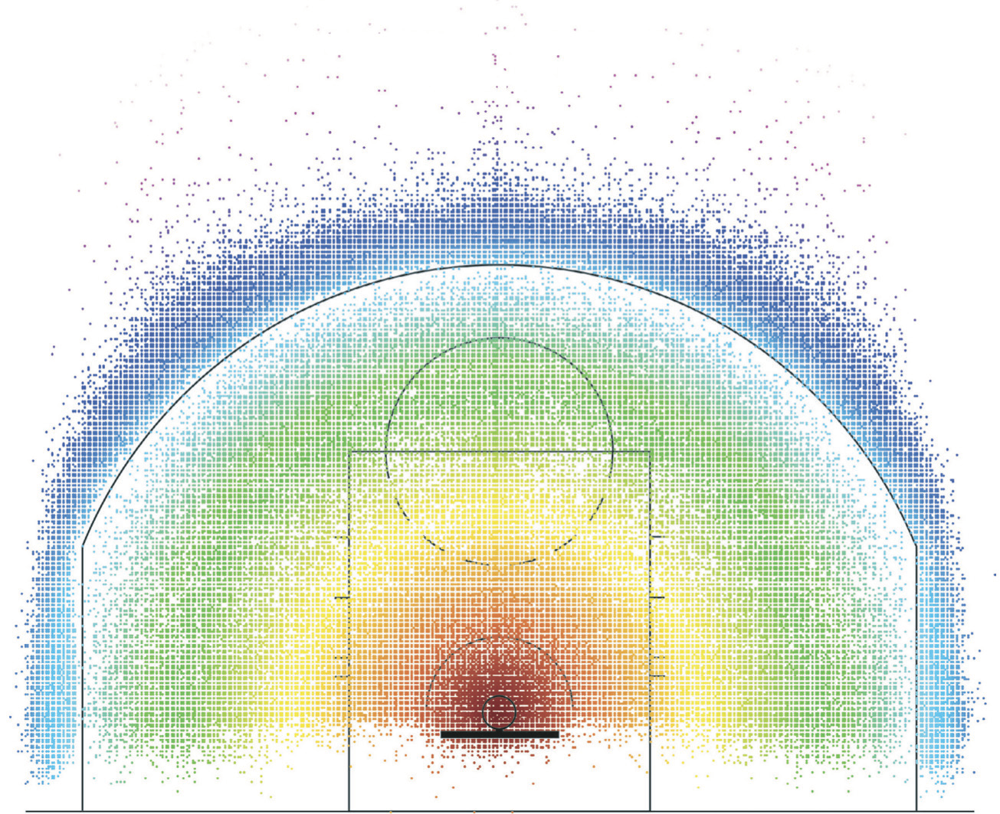
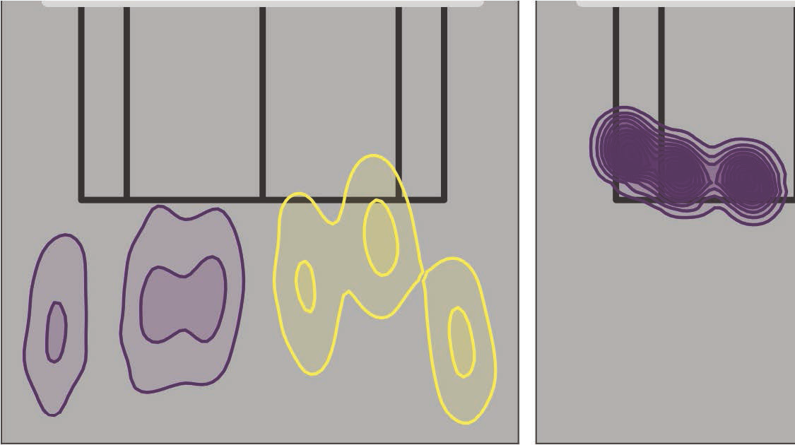
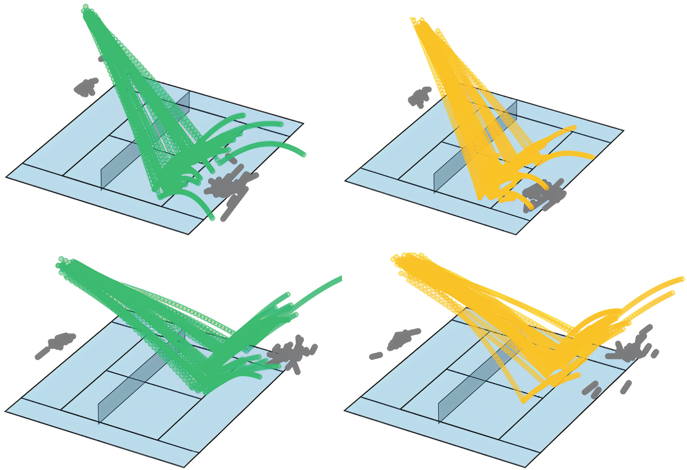

<!--
provenance:
  doi: 10.1146/annurev-statistics-033021-110117
  title: Player Tracking Data in Sports
  source: unknown
  download_url: unknown
  final_host: unknown
  filed: 2026-07-12
-->

<!-- page 1 -->

_Annual Review of Statistics and Its Application_ Player Tracking Data in Sports 

# Stephanie A. Kovalchik 

Zelus Analytics, Austin, Texas, USA; email: skovalchik@zelusanalytics.com 

Annu. Rev. Stat. Appl. 2023. 10:677–97 

First published as a Review in Advance on November 1, 2022 

The _Annual Review of Statistics and Its Application_ is online at statistics.annualreviews.org 

https://doi.org/10.1146/annurev-statistics-033021110117 

Copyright © 2023 by the author(s). This work is licensed under a Creative Commons Attribution 4.0 International License, which permits unrestricted use, distribution, and reproduction in any medium, provided the original author and source are credited. See credit lines of images or other third-party material in this article for license information. 

## **Keywords** 

latent variable, machine learning, prediction, spatiotemporal data, sports analytics 

## **Abstract** 

There has been rapid growth in the collection of player tracking data in recent years. These data,providing spatiotemporal locations of players and ball at high resolution, have spurred methodological developments in a range of sports. There have been impacts in the development of player performance measurement (e.g., distance traveled) and in the attribution of value to specific plays (e.g., expected points from a given position) or even specific actions within a play. This review highlights key methodological contributions via statistical and machine learning approaches. The studies and outcomes discussed show how sports can be a playground for extending analytical techniques in a range of areas. The review also describes the ongoing methodological challenges associated with the use of tracking data.

<!-- page 2 -->

## **1. INTRODUCTION** 

Interest in sports analytics has grown rapidly over the past decade, as evidenced in both market growth and research output. According to market analysts, the worldwide sports analytics market was forecasted to increase by 40% between 2016 and 2022, reaching a total valuation of just under US$4 billion by 2022 (MarketWatch News Dep. 2022). A key contributor to this growth has been the boom in the capture of tracking at competitive sporting events. Indeed, a number of the leading providers of tracking data technologies, such as Second Spectrum ( **https://www.secondspectrum.com** ), Catapult ( **https://www.catapultsports.com** ), and Kinexon ( **https://kinexon.com** ), were founded within the last decade. Academic research using sports tracking data has grown in step with these market trends. While in 2010 a search on Google Scholar returned only 608 links with the keywords “sports” and “tracking data,” the same search in 2020 results in 3,240 links. 

Realizing the potential offered by the growth in sports tracking data fundamentally depends on the quality of the analysis. However, player and ball tracking data present myriad challenges that are not easily addressed with standard statistical methods (Goes et al. 2021b). Here, I introduce three of those challenges. First, with common frame rates of 25 to 100 Hz, tracking systems can generate millions of data points in a single competitive event. Thus, the scale of modern sports data sets can be a hurdle for even basic descriptive analysis (Rein & Memmert 2016). Second, the spatiotemporal detail afforded by tracking data shifts the focus from unidimensional to highly multidimensional estimation, creating numerous challenges when making choices around data representation and model specification. Lastly, sports applications are often interested in highly contextualized and individualized analysis,necessitating multilevel approaches that can accommodate the discovery of numerous effects while protecting against overfitting (Yue et al. 2014). 

The purpose of this review is to provide a concise survey of the ways in which researchers are meeting the challenges presented by sports tracking data. It builds on an earlier review by Terner & Franks (2021), which focused exclusively on methods used for the modeling of player and team performance in basketball. This article expands its purview to all sports studies that are using advanced analysis of positional data. Its methodological focus is reflected in its structure, where sections are organized by analytic objective. The selected objectives span the major topics of sports studies from descriptive metrics to value attribution. While the primary focus is on modelbased approaches that make full use of statistical inference, the review also highlights significant algorithmic developments in each methodological area. In this way, the scope of this review combines the topics of prior collections on statistical (Albert & Koning 2007) and machine learning (Brefeld et al. 2019) studies in sports. The survey of studies that follows shows how tracking data applications have advanced methodological developments and highlights areas where continued development is most needed. 

## **2. TRACKING DATA** 

In sports, “tracking data” refers to fine-grained spatiotemporal data describing ball and/or player positions during a sports event. Modern sports tracking data typically include 2D spatial coordinates of player locations and 3D spatial coordinates of ball locations at a sample frequency of 25 Hz or more. **Table 1** illustrates a common structure for sports tracking data from a single frame of play of a historical National Basketball Association (NBA) game captured by the SportVU optical tracking system ( Johnson 2022). There are a total of 10 data points, 1 for each of the players on court during a play, where each position is measured in feet from the origin at the upper left corner of the court.

<!-- page 3 -->

**Table 1 Illustration of output for a single frame of player positions for the five players on each NBA team, as captured by SportVU** 

|**Time stamp**|**Player ID**|**X**|**Y**|
|---|---|---|---|
|1610612737|102594|45.7|15.7|
|1610612737|200794|56.9|22.9|
|1610612737|201143|47.3|24.2|
|1610612737|201952|28.9|23.5|
|1610612737|203145|40.5|31.6|
|1610612737|101141|56.3|25.5|
|1610612737|202704|73.6|25.4|
|1610612737|202694|48.5|35.3|
|1610612737|203484|48.4|4.5|
|1610612737|203083|47.3|24.2|

For some systems, positional data over multiple frames are summarized as functions, which is most common for the motion of a ball when that motion is smooth over the time interval covered. This is the case for the sport of tennis, for example, where the Hawkeye optical tracking system summarizes a tennis shot as two trajectories—one trajectory into the bounce and the other out of the bounce—where each trajectory is represented as a third-order polynomial for each dimension in 3D space (Kovalchik & Reid 2018). 

Various technologies exist to capture tracking information in sports. The most popular include optical tracking systems, global and local positioning systems (GPS and LPS), and computer vision (Torres-Ronda et al. 2022). Optical tracking systems utilize multiple high-speed cameras to track objects within a given competitive space by use of marker-based or markerless techniques (Hughes et al. 2019). GPS requires a receiver to be placed on the tracked object; the receiver communicates with multiple GPS satellites to determine the object’s location (Baca 2014). Although GPS units are relatively inexpensive in comparison to camera-based systems, their use is limited to outdoor venues. Moreover, several comparative studies have shown that GPS has inferior accuracy compared with optical tracking alternatives (Harley et al. 2011, Taberner et al. 2020). LPS does not require communication with satellites, overcoming some of the limitations of GPS; yet these systems have a similarly suboptimal accuracy profile (Hoppe et al. 2018). Finally, computer vision systems utilize algorithmic methods and neural networks to extract positional data indirectly from images in broadcast video of sports events. While there is a large body of research, both in industry and in academia, exploring the potential of vision-based tracking systems, there remains a wide gap between the real-time accuracy and feasibility of computer vision methods and those of direct measurement systems (Moeslund et al. 2015, Oliva-Lozano et al. 2021), which continue to be the primary source of tracking data in sports. This topic is discussed in more detail in Section 4. 

## **3. METHODOLOGICAL DEVELOPMENTS** 

The following subsections summarize the major methodological developments in sports tracking data. The subsections are organized by technical objective, where the focus is on the methodological rather than the substantive goal of the studies reviewed. 

## **3.1. Performance Metrics** 

One of the most common statistical applications of sports tracking data has been the enrichment of performance metrics. Performance metrics are quantitative measures that aim to describe a specific

<!-- page 4 -->

athletic skill or performance output. Metrics based on tracking data are distinct in their emphasis on spatiotemporal characteristics of performance. Metrics can be derived or model based: Derived quantities can be directly calculated from positional data, whereas model-based metrics are estimated through the implementation of a statistical model or algorithm. 

Distance, velocity, and acceleration—representing the zeroth-, first-, and second-order change in position, respectively—have been some of the most popular physical metrics derived from tracking data. Studies of distance covered have been conducted in multiple professional sports, including futsal (Bueno et al. 2014), soccer (Andrzejewski et al. 2015), and tennis (Pereira et al. 2017). Velocity and acceleration have been central to studies of load in sport. “Load” is a contentious yet common term used to refer to the physical demands of athletic activity thought to be predictive of injury (Delves et al. 2021). Analyses of velocity and acceleration have also been used to better understand player role (Gastin et al. 2013, Oliva-Lozano et al. 2020, Varley & Aughey 2013), movement patterns ( Jones et al. 2015), and the physical demands (Gray & Jenkins 2010, Petway et al. 2020) of a variety of team sports. 

Model-based performance metrics have focused largely on the description of player movement and spatial configuration. Using supervised learning techniques, Giles et al. (2020) developed a method to classify changes in direction of high,medium,and low intensity from positional tracking data of professional tennis players. Park et al. (2019) used unsupervised clustering of player speeds and accelerations to identify velocity patterns among elite female soccer players. Both movement and spatial orientation on the pitch were central to several offensive metrics derived by Link et al. (2016) as part of their characterization of “dangerousity” in soccer. Arbués-Sangüesa et al. (2020) provide another example of the use of geometric-based descriptions of player orientation on the pitch, in relation to the opposing team’s defenders, to develop a new performance metric in soccer: pass feasibility. 

Voronoi tessellation has been central for measures of space control in multiple sports studies. In a team setting, Voronoi tessellation is the process of assigning each point in the competitive space at a given moment in time to one player according to the player with the minimum Euclidean distance from the point of interest (Phillips 2014). Given the Euclidean distance between the _i_ th player and a point in space at coordinate ( _x_ , _y_ ) of _di_ ( _x_ , _y_ ), a Voronoi-based definition of spatial ownership, _Oi_ ( _x_ , _y_ ), can easily be written as 

$$ O_i(x, y) = \mathbb{1}_{\arg\min_j d_j(x,y)}(i). $$

**Figure 1** illustrates the above definition of spatial ownership when applied at one snapshot in time for two teams on a soccer pitch. 

Taki & Hasegawa (2000) propose the use of Voronoi spatial assignment as a general method to describe spatial dominance in team sports. Rein et al. (2016) apply this method to define spatial control in professional soccer to better understand passing behavior. Fonseca et al. (2012) use Voronoi spatial ownership to analyze configuration patterns in elite futsal. Cervone et al. (2016a) develop a weighted Voronoi classification—with inverse weighting by distance—to define court realty in professional basketball. 

For some applications, Voronoi-based definitions of space ownership may not be an ideal choice because, by focusing only on distance, they fail to consider the relevant dynamics of player movement. Fernández & Bornn (2018) highlight this limitation and develop a solution based on an estimate of spatial influence that, in addition to player position, accounts for ball location and player velocities. Similarly, Spearman et al. (2017) propose a pitch control function for soccer that incorporates ball and player dynamics through a physics-based probabilistic model of pass probability.

<!-- page 5 -->

**Figure 1** 

Illustration of Voronoi spatial ownership for one point in time during a soccer match (Rein et al. 2016). Points represent players, with one team in blue and the other in red. The solid black lines indicate the ownership region of the nearest player. 

<!-- Figure 1 is a vector schematic (no raster extracted). Low-value: a diagram of the Voronoi-cell partition of a pitch, not data. -->

## **3.2. Pattern Mapping** 

The advent of sports tracking data has allowed researchers to represent myriad performance quantities through a highly interpretable visual lens: the observed space of the competitive field. The process of encoding statistical summaries of performance as points within a competitive arena is a type of pattern mapping, where the main goal is to reveal how performance may vary by spatial location. 

The NBA shot charts developed by Goldsberry (2019) are among the most popular examples of pattern mapping in sports. A cartographer by training, Goldsberry (2012) introduced the first version of a shot chart a little over a decade ago. The first charts were no more than specialized heat maps, where points are overlaid on a highly stylized basketball court and a color gradient is used to represent observed field goal percentage (Goldsberry 2019) ( **Figure 2** ). Similar discretized visualization approaches have been deployed in soccer to show patterns of ball occupancy (Lucey et al. 2013). Another example is the visualization tool set called SnapShot, which was developed for hockey. In addition to traditional heat maps for summarizing shot outcomes on the ice rink, this tool introduced a novel radial heat map to display shot length and frequency in the same spatial map (Pileggi et al. 2012). 

Model-based extensions of the original shot charts improved on the mapping methodology in several ways. Miller et al. (2014) propose the use of point process models for estimating an intensity surface of NBA performance outcomes over the space of the court. Specifically, these authors use a log Gaussian Cox process that models shooting success at any point in space on the basketball court as a Poisson random variable, **x** ( _s_ ), where **x** is the count of successful shots made at location _s_ . Counts at each location depend on spatially dynamic intensity rates, _λ_ ( _s_ ), which are modeled by a Gaussian process (GP). The model can be represented via a latent spatial variable

<!-- page 6 -->

#### **Figure 2** 

Example of an NBA shot chart (Goldsberry 2019). Each point represents a shot taken in the 2014–2015 NBA season. 

<!-- Data-bearing as a spatial density: dense scatter of shot locations over a half-court, color gradient = shot distance (feet), legend 0 (red, at rim) to 30 (blue, beyond arc). No tabular numbers. -->

**Z** ( _s_ ) on the surface _s_ : 

$$ \mathbf{Z}(s) \sim \mathrm{GP}(\mathbf{0}, \mathbf{k}(s, s')), \tag{1} $$
$$ \lambda(s) \sim \exp(Z(s)), \tag{2} $$
$$ \mathbf{x}(s) \sim \mathcal{PP}(\lambda(s)), \tag{3} $$

where **k** ( _s_ , _s_′ ) is a kernel function determining the form and smoothness of the GP and _PP_ ( _λ_ ( _s_ )) is a Poisson process for intensities on the surface _s_ . The major advantage of the point process approach is that it provides a smooth representation of performance in space in a way that naturally builds on the expectation that performance at one location is likely to be similar to performance at neighboring locations. 

Miller et al. (2014) further show how to identify common patterns across player-specific intensity surfaces by using nonnegative matrix factorization (NMF). The NMF method is an example of a dimension reduction technique that describes each intensity surface as a weighted combination of a low-rank spatial basis. To make the method more concrete, suppose that **_�_** is a _P_ × _N_ matrix, where the _p_ th row represents one basketball player’s set of success rates at _N_ mutually exclusive locations on the basketball court. The NMF procedure seeks the matrices _B_ and _W_ that satisfy **_�_** = **WB** , where the _K_ × _N_ matrix **B** is a set of bases for the spatial distribution of success rates and **W** is a _P_ × _K_ matrix of player-specific loadings of these bases. In this way, the resulting basis captures distinct performance patterns that are shared across players and allows for more robust

<!-- page 7 -->

**Figure 3** 

Illustration of defensive shot charts (Franks et al. 2015). The dots represent locations of shots taken, the color encodes the expected change in shot efficiency in terms of the efficiency quantile _q_ e, and the size of the dots encodes the shot frequency in terms of the frequency quantile _q_ f. 

<!-- Data-bearing: six named-player panels showing how NMF-conditioned defender skill shifts shot efficiency/frequency by court location. Legends: q_e color scale 1/6 to 5/6, q_f size scale 1/6 to 5/6. No numeric table. -->

player estimates through the partial pooling of underlying intensity surfaces. Franks et al. (2015) subsequently used the NMF spatial basis as a conditioning variable in multinomial models of the influence of defender skill on shot outcomes. **Figure 3** shows several examples of the defensive spatial maps that resulted from the Franks et al. (2015) study. 

## **3.3. Latent Variable Estimation** 

As discussed in the previous section, the increasing sophistication of visual mapping approaches in sports has included the quantification of unobserved pattern types. This points to a broader goal of many researchers working with sports tracking data: latent variable estimation. For most sports applications, latent variable estimation is equivalent to what is termed unsupervised classification in the machine learning literature, namely a classification task where class labels are unknown. The main distinguishing characteristic of latent classification methods for tracking data, in comparison to nonspatial sports data types, is the multidimensionality of the data being classified. 

Gaussian mixture models (GMMs) have been a popular technique for discovering latent categories from spatial data in sports. Kovalchik & Albert (2022) proposed an extension of a Gaussian mixed-membership model to quantify return style and pattern types based on the spatial position of the ball on serve return impact in professional tennis matches. Use _Yin_ = ( _xin_ , _din_ ) to denote the 2D position of ball at impact with the racquet of the _n_ th serve return made by the _i_ th receiver, where _x_ is the lateral position and _d_ is the depth.A multivariate normal (MVN) mixed-membership model for **Y** _in_ can be described as follows:

$$ \boldsymbol{\pi}_i \sim \mathrm{Dirichlet}(\boldsymbol{\alpha}), \tag{4} $$
$$ k_i \mid \boldsymbol{\pi}_i \sim \mathrm{categorical}(\boldsymbol{\pi}_i), \tag{5} $$
$$ \mathbf{Y}_{in} \mid k_i \sim \mathrm{MVN}(\boldsymbol{\mu}_{k_i}, \boldsymbol{\Sigma}_{k_i}), \tag{6} $$

<!-- page 8 -->

**Figure 4** 

Posterior spatial distribution of the locations of second serve return impact (where the ball makes contact with the racquet) conditional on the pattern component among professional men’s tennis players (Kovalchik & Albert 2022). 

<!-- Data-bearing model output: the six latent mixture components from the Gaussian mixed-membership model. Each panel = one component's posterior density of return-impact location, split by court side (Ad purple / Deuce yellow). Axes: lateral -6..6 m, depth -4..3 m; density contours 0.1/0.2/0.3/0.4. This is the review's clearest example of unsupervised latent style/pattern discovery from position data. Panels also in page08_img6/7/8.png. -->

where _ki_ is an indicator for the mixture component. This is a continuous-outcome analog of latent Dirichlet allocation models popular in topic analysis. As with document-to-document differences in topics, the mixed-membership approach parsimoniously models player-to-player differences through player-specific mixture weights **_π_** _i_ . 

A primary advantage of model-based latent group detection is the ease with which one can obtain both conditional expectations of the outcome (conditioned on the latent group category) and highly interpretable summaries of the latent class characteristics. **Figure 4** demonstrates this property with a sample of the latent spatial patterns of return impact locations presented by Kovalchik & Albert (2022). In another tennis application, Kovalchik et al. (2020) use a GMM to build a generative model for the functional representation of shot trajectories, where mixtures represent different shot types in 3D space. Dutta et al. (2020) use a GMM to discover coverage types on National Football League passing plays from feature vectors including player speed and distance variables at several time points during a play. 

Several applications have preferred machine learning or deep learning methods over modelbased methods for latent variable discovery with sports tracking data. Goes et al. (2021a) used a _k_ -means algorithm to cluster the average player coordinates of teams in possession and not in possession of the ball in professional soccer. These authors interpreted the resulting clusters as types of different offensive team formations. Team structure in elite soccer was also of interest to Bialkowski et al. (2016), who developed a role-constrained _k_ -means clustering procedure to identify dynamic team formations. The role constraint ensures that each player is assigned a unique role and that this role does not change over the duration of a possession. A major motivation for this formation work is the alignment of tracking data with match video.

<!-- page 9 -->

Despite the growing popularity of the application of deep learning methods in sports, few studies have used neural network architectures to discover latent groups from tracking data (Georgiou et al. 2020). An exception is an analysis by Cho et al. (2021), who applied an autoencoder to speed and distance summary features of soccer matches to detect types of passing styles. A major drawback of these methods is that it is difficult to extract and summarize the latent quantities, limiting the interpretative value they can provide. 

## **3.4. Event Prediction** 

Predicting the outcome of events is perhaps the most-researched area in sports statistics. The advent of tracking data has enabled researchers to advance sports prediction models in two primary ways. First, researchers have utilized spatial information to enrich the predictive feature set for traditional event outcomes, such as a win or a loss. Second, the fine-grained positional information contained in tracking data has expanded the number and complexity of event outcomes that sports researchers have attempted to predict. Although applications of both types are still relatively few (Wunderlich & Memmert 2021), several compelling examples have emerged in recent years. 

The prediction of outcomes in soccer improves with the inclusion of physical descriptors derived from tracking data. When comparing several models to forecast ball possession and shot attempt events in European soccer, Power et al. (2017) found that the inclusion of team formation—the spatial configuration of players—resulted in notable gains in predictive performance. Play prediction has been the focus of several applications of sports tracking data. Yue et al. (2014) build on the latent modeling methods introduced in the previous section to construct a model to predict in-game play events in basketball, where the goal is to forecast events, like passing and shooting, at any point in time during a game given all relevant history. 

At the same time that some researchers used tracking data to enrich prediction models of traditional outcomes, other researchers turned their focus to the prediction of novel spatial outcomes. Several studies investigated the prediction of 2D locations in sports, including ball location in tennis (Wei et al. 2016) and soccer (Amirli & Alemdar 2022) as well as rebound locations in basketball (Masheswaran et al.2014).Full spatial trajectories have also garnered increasing interest for sports prediction models; thus far, neural network approaches have been the most commonly used methodology. Felsen et al. (2018) developed a conditional variational autoencoder architecture for the prediction of player movement in basketball, while Alcorn & Nguyen (2021) developed a multientity transformer for the same objective. Deep imitation learning (IL) has been applied to the prediction of defensive movement trajectories in soccer (Le et al. 2017a) and American football (Schmid et al. 2021). 

Efforts to predict spatiotemporal quantities for team sports have drawn attention to some common challenges that are not easily addressed by standard modeling and machine learning techniques. One such challenge is the variable duration of play sequences in which the spatial actions of interest take place. Most efforts to address the variable duration of tracking data events in sports have involved neural network methods. Adaptive pooling of layers is one strategy used in models of plays in American football (Horton 2020) and in models of team formations in professional hockey and basketball (Mehrasa et al.2017).Recurrent neural networks and long short-term memory (LSTM) are general classes of neutral network models that are designed for data with a time index, where the index may be of variable length. These temporally focused network methods have been used in various sports tracking applications, including models of player micro actions (Sicilia et al. 2019) and team strategies (Tian et al. 2019) in the NBA, puck possession plays in the National Hockey League (Tora et al. 2017), and prediction of scoring events in handball (Müller et al. 2021).

<!-- page 10 -->

**Figure 5** 

Two diagrams of offensive formations in American football (Layden 2010). Letters denote distinct offensive roles. 

<!-- Figure 5 is a vector schematic (no raster extracted). Low-value: two play diagrams with lettered roles, used to motivate the variable-player-ordering problem. -->

Another significant challenge in the modeling of team sport tracking data is the variable order of players. Most methods require assigning elements in an order, like the position in a vector, and the assigned order affects the results of the estimation used. This is problematic for dynamic formations in team sports where players are not consistently ordered. Consider the two classic offensive formations for American football depicted in **Figure 5** . Each shows an inconsistent set of roles and inconsistent orientations for matching roles. These kinds of plays make it difficult to define a meaningful ordering of players on the field. 

Some studies have dealt with this challenge by using role-based ordering, when players can be assigned a distinct role (Le et al. 2017a). However, this strategy is not generalizable because, for many sports, roles are neither well defined nor restricted to one player. A popular alternative approach for dealing with variable ordering of players is the use of anchoring, which involves ordering in relation to distance from a fixed point or object. Several studies, for example, have ordered American football players according to their relative position to the football (Burke 2019, Deshpande & Evans 2020). A novel strategy employed by Horton (2020) is to make the ordering of players an estimable quantity of the inferential method,which alleviates the need to apply a fixed order to players. This is done by using network methods defined on sets that utilize permutationinvariant inferential calculations (Zaheer et al. 2017). 

## **3.5. Value Attribution** 

Value attribution is the process of decomposing value into mutually exclusive components. In so doing, value attribution aims to answer questions in the form of “How much did factor _X_ contribute to result _Y_ ?” Integral to value attribution is the differencing of conditional expectations. For instance, attributing the _i_ th player’s contribution to the score outcome _Y_ can be formulated as the difference _E_ [ _Y_ | **X** _i_ ] −∑ _j__E_[_Y_|**X**_j_],which is the change in the expected outcome in the presence of a player with characteristics _Xi_ compared with the expected average over all players. This simple illustration is an example of the estimation goal of a plus–minus statistic, which is the expected change in a sports result in the presence of a player of interest versus some interpretable alternative (Sarlis & Tjortjis 2020). 

Although tracking data have not given rise to value attribution in sports, they have allowed researchers to attribute value at a greater level of granularity. Doing so has required models of outcomes in sport that provide more realistic representations of the dynamic nature of competition. Foundational research tackling this fundamental issue is the multiresolution model of Cervone et al. (2016b). These authors present a framework for the spatiotemporal conceptualization of value, which they call expected possession value (EPV). With EPV, the simple time-fixed expectation of outcomes becomes _E_ [ _Y_ | _Xs_ , _. . ._ , _Xt_ ], where ( _Xs_ , _. . ._ , _Xt_ ) capture all measurable predictors

<!-- page 11 -->

#### **Figure 6** 

Sample of expected possession value (EPV) estimates for a range of macro and micro transition events for three possessions in an NBA game (Cervone et al. 2016b). 

<!-- Figure 6 is a vector line chart (no raster extracted). Illustrative: EPV trace over three possessions; no readable tabular values in the render. -->

from the start of the possession at time _s_ to time _t_ . **Figure 6** illustrates the continuous nature of EPV for a sequence of possessions in an NBA game. 

The dynamic perspective on expected value may appear to be a small shift, but it has complex implications for estimation and inferential approaches. Cervone et al. (2016b) addressed these challenges with a multiresolution approach that has been described elsewhere in this journal (Terner & Franks 2021). In brief, the top level of the model is concerned with transitions between macro events, such as a ball pass or turnover. These coarsened states are modeled as a time-homogeneous Markov chain. The bottom level is concerned with micro actions leading to a transition event, namely the movement of a player without a change in possession. Models of micro actions condition on the spatial characteristics of players on the court, which is the highest level of resolution. Cervone and colleagues utilize log-linear spatial regression models for the hazard of transitions to a macro event. 

Several authors have built on the multiresolution methodology by proposing alternative approaches to the micro action model. Motivated by the analysis of passing events in soccer, Han & Dunson (2018) develop an adjacency tensor representation of the spatial configuration as part of a tensor factor model describing the spatial dynamics of soccer plays. The DeepHoops method presented by Sicilia et al. (2019) models the micro actions of basketball players using a stacked LSTM that combines a module for the sequence of micro actions on court and a module for static player factors. The LSTM was also the preferred method of Yurko et al. (2020) for estimating expected gains in yards by the ball carrier in American football given ball and player trajectories. The yards gain model formed the micro events for continuous-time estimates of play value. 

Other major developments in EPV methodology are approaches that obviate the use of multiple event resolutions. Seminal among them is the decoupled framework for EPV proposed by Fernández et al. (2019). This decoupling strategy breaks down the EPV at any point in time into a sum of value–action pairs for a subset of actions that are mutually exclusive and exhaustive of score-earning actions. Fernández et al. (2019) developed their approach in the context of soccer, where the action set consists of ball drives, shots, and passes. Denoting the set of these actions as

<!-- page 12 -->

$\mathcal{A}$ and the goal outcome as _Y_ , one can represent the decoupled EPV as follows:

$$ E[Y \mid \mathbf{X}_t] = \sum_{a \in \mathcal{A}} E[Y \mid A = a]\, P(A = a \mid \mathbf{X}_t). \tag{7} $$

Equation 7 points to the main advantage of the decoupled framework: the breakdown of EPV into highly interpretable events that have intrinsic analytical interest. The main drawback of the approach is that it requires predictive methods that can take spatiotemporal representation of possession histories as inputs. Fernández et al. (2019) simplify the estimation task by further decoupling EPV to distinguish actions ending in a specific score from other actions. However, there remains a need to develop models for several complex actions, such as a successful pass. The authors tackle the modeling of the most complex actions with deep neural networks and handcrafted spatial representations of possession histories that include surface maps of spatial ownership and influence metrics ( **Figure 7** ). 

Another strategy to value attribution in sports combines a generative model for the relevant play history with a predictive model for the score outcome given play characteristics. 

**Figure 7** 

Visual summary of the spatial features included in the expected possession value action models presented by Fernández et al. (2019), including derived metrics of spatial ownership and influence (Fernández & Bornn 2018). Features are overlaid on a soccer pitch. Gray circles represent individual players.

<!-- Data-bearing as a feature inventory (not numeric): shows exactly which spatial features feed the deep-learning EPV action model. Useful as a checklist of engineered position features. -->

<!-- page 13 -->

#### **Figure 8** 

3D rendering of a sample of serve events—ball and player trajectories—from the Gaussian mixture model ( _yellow_ ) developed by Kovalchik et al. (2020) compared with observed serve events from men’s Grand Slam data ( _green_ ). 

<!-- Illustrative goodness-of-fit: generated (yellow) vs observed (green) serve trajectories overlap, showing the GMM reproduces the trajectory distribution. No numeric values. -->

The generative model flips the usual conditioning _E_ [ _Y_ | _Xs_ , _. . ._ , _Xt_ ] and makes the target of the model ( _Xs_ , _. . ._ , _Xt_ ). Specifically, for a play that takes place in the time interval ( _s_ , _t_ ), the goal of the generative model is, at any time _τ_ within the play, to describe probable full play histories, _P_ ( _Xs_ , _. . ._ , _Xt_ | _Xs_ , _. . ._ , _Xτ_ ). A main advantage of the generative approach is that the value model that predicts relevant score outcomes for the play can condition on the complete play history, which can greatly strengthen the value model’s predictive accuracy. 

Kovalchik et al. (2020) proposed an application of the generative approach for attributing value to shots in professional tennis. The main innovation in their study was the use of a functional data representation of ball and player trajectories to describe a shot event—all actions taking place from start to end of a single tennis shot. Using polynomial functions for ball and player trajectories, they showed that a GMM well describes the distributional characteristics of the functional summary of shot events, as demonstrated in **Figure 8** . More precisely, letting _S_ ( _θ_ ) be the functional representation of a shot event, which consists of the polynomial coefficients for functions of the form _f_ ( _t_ ) = _θ_ 0 + _θ_ 1 _t_ + _θ_ 2 _t_2 for each dimension in 3D space, the authors modeled these events as _S_ ( _θ_ )| _k_ ∼ MVN( **_µ_** _k_ , **_�_** _k_ ) for some _K_ latent cluster types. This key result showed that projecting full shot events, given the partial history of a shot, is a straightforward application of conditional probabilities of an MVN. 

Chan et al. (2021) subsequently showed how the generative approach for shot valuation could be extended to value the sequence of shots in a tennis point using a Markov reward process. To date, few other EPV studies have used the generative approach, which may reflect the challenge of describing the spatiotemporal sequence of actions in team sports with standard probabilistic approaches.

<!-- page 14 -->

All of the value attribution strategies discussed above—multiresolution, decoupled, and generative approaches—share a modular structure in which multiple quantities of the value estimand are estimated with separate statistical models. While modularity has clear advantages for the tractability of EPV estimation, it means that the estimation of the parameters of each component part is not based on an objective involving the primary value outcome of interest. Reinforcement learning (RL) represents a broad estimation class in machine learning that offers a more holistic approach to the valuation problem. In standard RL, interest focuses on the expected value of taking action _a_ in state _s_ , which is known as the _Q_ function, _Q_ ( _s_ , _a_ ). Given the probable rewards ( _r_ ) for each state and action, _P_ ( _r_ | _s_ , _a_ ), and the probability of transitions from ( _s_ , _a_ ) to ( _s_′ , _a_′ ), the _Q_ function is the solution to the recursion relation that is the expected reward of the current state and the expected value of all transitions from the current state: 

$$ Q(s, a) = \sum_{r'} P(r' \mid s, a)\, r' + \sum_{s', a'} P(s', a' \mid s, a)\, Q(s', a'). \tag{8} $$

The above equation, known as the Bellman equation (Puterman 2014), is a discretized expected value for the value of taking action _a_ in state _s_ , when the set of states and actions can each be represented as a countable set. 

A discretized _Q_ function is infeasible for fine-grained value attribution in sports having continuous play. Liu et al. (2020) address this limitation with a deep RL approach that they apply to value attribution of English Football League players. In this approach, the authors use a stacked LSTM to capture the full play history, including the history of ball and player movement, leading up to a goal scoring event. The final hidden layer of the LSTM feeds into a softmax prediction for the goal scoring outcome, and training is guided by a temporal difference loss function, which is the squared error loss of a prediction for each progressive time step for some small interval of time. The result of this approach is a continuous-time set of _Q_ values quantifying the probable next-goal events given dynamic play history ( **Figure 9** ), which the authors use to derive several value-based metrics of player performance that improve on outcome-based measures. 

IL is another value attribution approach that is closely related to RL. Both RL and IL aim to find an optimal sequence of state–action pairs, termed an optimal policy. RL defines the 

**Figure 9** 

Estimated _Q_ values for a single English Football League soccer match (Liu et al. 2020). Three different reference _Q_ values are shown: scoring for the home team, scoring for the away team, and for the ending of the game.

<!-- Data-bearing time series: deep-RL Q-values across one match. Home/away scoring probabilities hover near 0.4 early and diverge; "game end" Q starts ~0.1 and climbs to ~0.75 as the match closes; the away-scores event shows a large transient spike. Read off the render, approximate. -->

<!-- page 15 -->

optimal policy as the one that maximizes reward, while IL does not consider reward but instead is concerned with mimicking a demonstrated policy. 

In some applications of IL, the target policies are provided by experts. However, in sports, expert assessment of what should have been done in a given scenario can be difficult to obtain. Lucey and collaborators have developed data-driven IL methods for sports that provide an expertless approach for identifying optimal play actions (Le et al. 2017a). Seminal among this body of research is the coordinated multiagent model presented by Le et al. (2017b). These authors developed an IL strategy that uses LSTM to describe role-specific player trajectories and a multiphase training approach that iteratively switches between evaluations of the policies of individual players and the collective policy of a team. The multiagent methodology originally developed for tactical optimization in soccer has also been applied to basketball (Seidl et al. 2018) and American football (Schmid et al. 2021). 

Sports researchers have been attracted to the IL method because it provides a natural way to define a comprehensive reference set of actions with which to compare observed or hypothetical actions. In this way, IL has properties similar to those of a generative model and can predict behaviors that are not limited to any single observed policy but the policy that should have happened in a given context. This what-if nature of IL results has been described as “ghosting” by sports researchers and has been the basis for a number of novel tactical tools in sports. One such tool is automated play sketching ( **Figure 10** ), where an IL model is used to predict how a team will respond to a sketched diagram of a play (Seidl et al. 2018). Despite the potential of RL and IL approaches, continuous-time implementations of these techniques for the discovery of play policies require accurate modeling of the coordinated trajectories of multiple players over time, which remains a significant technical challenge. 

## **4. VISION-BASED TRACKING DATA** 

So far, this review has focused on the kinds of questions and analyses produced by sports tracking data. It is also important to acknowledge that an increasingly active area of sports research is the use of quantitative methods to capture tracking data from video. The emergence of the field of computer vision—the application of artificial intelligence to extract data from images—has made 

**Figure 10** 

Example play sketch and resulting predictions of defense response for the Houston Rockets and the Milwaukee Bucks (Seidl et al. 2018). Numbered circles represent players’ positions on the court. Each orange circle indicates the position of the basketball.

<!-- Figure 10 is a vector schematic (no raster extracted). Illustrative: a sketched offensive play and the imitation-learning model's predicted defensive response. No data values. -->

<!-- page 16 -->

the pursuit of simpler sports data capture systems a popular research objective (Moeslund et al. 2015). The ultimate goal of this direction of research is the ability to use analytical methods to extract accurate ball and player spatiotemporal data from broadcast video. 

A topic central to computer vision in sports concerns how to track the ball using real-world sports videos. Numerous factors make computer vision–based ball tracking a highly complex task. The size of the ball often occupies a small number of pixels; the ball is often moving at very high speeds against a dynamic background; and occlusion—the blocking of the ball’s image by another object—is common. As with the more general problem of object detection in images, convolutional neural networks (CNNs) have become the mainstay for vision-based ball tracking methods (Naik et al. 2022). 

A neural network is a general framework for deriving useful representations of complex data (Xie et al. 2020). The fundamental tool of neural networks is an analytical neuron, which turns a linear combination of observed inputs and weights into an activation event. Suppose there are _n_ observed inputs _x_ 1, _. . ._ , _xn_ . Then, the neuron is the output of activation function _f_ ( _z_ ), where 

$$ z = \sum_{i=1}^{n} w_i x_i + w_0, $$

for some unknown weights _wi_ , and the activation function is typically a nonlinear transformation such as the rectified linear unit transformation _f_ ( _z_ ) = max (0, _z_ ). Multiple layers of interconnected neurons form the core architecture of deep learning methods. The defining property of CNNs is the use of convolutional layers, where specific filters are applied to convolve local inputs, typically neighboring pixels in an image, prior to passing them to the input layer of the network (LeCun et al. 2010). The convolutional filters can be designed to emphasize any number of properties of an image, which has proven to be critical to the success of CNNs for object detection tasks. 

One of the most popular object detection approaches that has been used for sports ball tracking studies is the You Only Look Once (YOLO) algorithm (Redmon et al. 2015). YOLO and its variations are a CNN architecture that uses a single forward propagation step, which allows them to have fast training speeds that are ideal for real-time applications. Ball tracking applications of YOLO are plentiful and cover multiple sports, including basketball (Yoon et al. 2019), soccer (Naik & Hashmi 2021), and badminton (Cao et al. 2021). 

The position and pose of players are two other areas of significant interest to computer vision researchers. Detecting players in an image of a sporting event shares many of the challenges of ball tracking but has the additional challenge that, in any given frame of the video, multiple players with similar visual features are typically present. Some common strategies to address this challenge are the use of algorithms sensitive to contrasting colors, such as the contrast between players and a green pitch (Khatoonabadi & Rahmati 2009, Naemura et al. 2000). Researchers have also studied semisupervised methods, in which a small sample of manual annotations from the first minutes of a sports video is used to train a player detection algorithm (Xu & Shi 2005). Despite ongoing advances in ball and player tracking research, significant remaining technical challenges are reflected in the fact that few commercialized tools using vision-based detection of ball and player trajectories in sports broadcast video are currently available (Colyer et al. 2018). 

## **5. DISCUSSION** 

Over the last few decades, the proliferation of tracking data systems in sports has created exciting opportunities for research. The studies discussed in this review have shown myriad aspects of performance evaluation where the analysis of tracking data is having an impact. With the availability of rich spatiotemporal descriptions of competitive events, sports analysts have been better

<!-- page 17 -->

able to describe the spatial patterns of performance; quantify previously intangible concepts of competition, such as playing style and team coordination; and improve the prediction of play outcomes while also facilitating the prediction of within-play micro actions. An area in which the impact of tracking data has been most profound is continuous-time value attribution. Using modern tracking data, EPV studies have established a framework for valuing every decision—however minute—in a sports play, paving the way toward a new era of value-based performance evaluation. 

Sports are a passion for individuals from all walks of life, and quantitative researchers are no exception. This review has shown how an interest in sports has inspired researchers to pursue difficult problems with spatiotemporal analysis. Chief among them is data representation—specifically, the problem of how to represent granular ball and player positions over time in a way that is conducive for analysis yet preserves the richness of the available information. This review has highlighted a range of representation strategies—including raw coordinates, functional summaries of trajectories, and pixels in an image—and we can anticipate that this will be a major area of method development for tracking data going forward. 

Contextualization is the second broad theme among the methodological challenges faced by analysts of sports tracking data. One form it takes is concern with the spatial configuration of players in team sports. Research on team formation and coordination demonstrates the general view that the full spatial context of players influences the probability of events. There is also a general belief in sports that any number of situational factors, such as the game score or weather conditions, can affect player performance and affect some players differently than others. Accounting for the situational context in tracking data studies will often require interactive or hierarchical effects of a high dimension, which may be practically infeasible given current inferential tools. Given the interest in these contextual effects, sports researchers can be expected to continue to pursue methodological and computational improvements in feature selection and hierarchical feature estimation for spatial models. 

In addition to these technical challenges, it is important to recognize the ongoing external challenges facing research on sports tracking data. At the professional level,the commercial success of tracking systems both for officiating and for broadcast media has placed most of the positional data captured in sports out of the reach of academic researchers (Gerrard 2016). The negative consequences of the siloing of tracking data for sports analytics is evident in the fact that many of the sports in which proprietary tracking systems have been most active are also the ones in which innovation in performance evaluation has been the most limited (Kovalchik 2021). The relative inaccessibility of camera-based tracking data in sports underlies the significance of computer vision efforts toward ball and player tracking, which may be the most promising way to make tracking data more widely available to sports researchers. 

In 2020, Major League Baseball announced that it would be partnering with a new provider of tracking data, which would expand the collection of data points on players to include the position of 19 different joints of the human body (Lemire 2020). This is only one indicator of how the scope of tracking data is expanding to include increasingly rich representations of player biomechanics. With these trends, it is not hard to imagine a time when researchers will have access to full 3D renderings of player actions during competition. How methodologists will build on the foundational research that positional data inspire to meet the challenges of next-generation tracking systems will be crucial for the future of quantitative analysis in sports. 

## **DISCLOSURE STATEMENT** 

The author is not aware of any affiliations, memberships, funding, or financial holdings that might be perceived as affecting the objectivity of this review.

<!-- page 18 -->

### **LITERATURE CITED** 

Albert J, Koning RH. 2007. _Statistical Thinking in Sports_ . Boca Raton, FL: CRC 

Alcorn MA, Nguyen A. 2021. baller2vec: a multi-entity transformer for multi-agent spatiotemporal modeling. arXiv:2102.03291 [cs.LG] 

Amirli A, Alemdar H. 2022. Prediction of the ball location on the 2D plane in football using optical tracking data. _Acad. Platf. J. Eng. Smart Syst._ 10(1):1–8 

Andrzejewski M, Chmura J, Pluta B, Konarski JM. 2015. Sprinting activities and distance covered by top level Europa League soccer players. _Int. J. Sports Sci. Coach._ 10(1):39–50 

Arbués-Sangüesa A, Martín A, Fernández J, Ballester C, Haro G. 2020. _Using player’s body-orientation to model pass feasibility in soccer_ . Paper presented at IEEE/CVF Conference on Computer Vision and Pattern Recognition, Seattle, June 16–18 

Baca A. 2014. _Computer Science in Sport: Research and Practice._ London: Taylor & Francis 

Bialkowski A, Lucey P, Carr P, Matthews I, Sridharan S, Fookes C. 2016. Discovering team structures in soccer from spatiotemporal data. _IEEE Trans. Knowl. Data Eng._ 28(10):2596–605 

Brefeld U, Davis J, Van Haaren J, Zimmermann A, eds. 2019. _Proceedings of the 5th International Machine Learn-_ 

_ing and Data Mining for Sports Analytics Workshop_ ( _MLSA 2018_ ), _Co-Located with ECML/PKDD 2018_ . Berlin: Springer 

Bueno MJO, Caetano FG, Pereira TJC, De Souza NM, Moreira GD, et al. 2014. Analysis of the distance covered by Brazilian professional futsal players during official matches. _Sports Biomech._ 13(3):230–40 

Burke B. 2019. _DeepQB: deep learning with player tracking to quantify quarterback decision-making & perfor-_ 

_mance_ . Paper presented at 13th Annual MIT Sloan Sports Analytics Conference, Boston, March 1–2. **https://www.sloansportsconference.com/research-papers/deepqb-deep-learning-with-playertracking-to-quantify-quarterback-decision-making-performance** 

Cao Z, Liao T, Song W, Chen Z, Li C. 2021. Detecting the shuttlecock for a badminton robot: a YOLO based approach. _Exp. Syst. Appl._ 164:113833 

Cervone D, Bornn L, Goldsberry K. 2016a. _NBA court realty_ . Paper presented at 10th Annual MIT Sloan Sports Analytics Conference, Boston, March 12–13 

Cervone D, D’Amour A, Bornn L, Goldsberry K. 2016b. A multiresolution stochastic process model for predicting basketball possession outcomes. _J. Am. Stat. Assoc._ 111(514):585–99 

Chan TCY, Fearing DS, Fernandes C, Kovalchik S. 2021. A Markov process approach to untangling intention versus execution in tennis. arXiv:2110.01527 [math.OC] 

Cho H, Ryu H, Song M. 2021. Pass2vec: analyzing soccer players’ passing style using deep learning. _Int. J. Sports Sci. Coach._ 17(2):355–65 

Colyer SL, Evans M, Cosker DP, Salo AI. 2018. A review of the evolution of vision-based motion analysis and the integration of advanced computer vision methods towards developing a markerless system. _Sports Med. Open_ 4:24 

Delves RI, Aughey RJ, Ball K, Duthie GM. 2021. The quantification of acceleration events in elite team sport: a systematic review. _Sports Med_ . 7:45 

Deshpande SK, Evans K. 2020. Expected hypothetical completion probability. _J. Quant. Anal. Sports_ 16(2):85– 94 

Dutta R, Yurko R, Ventura SL. 2020. Unsupervised methods for identifying pass coverage among defensive backs with NFL player tracking data. _J. Quant. Anal. Sports_ 16(2):143–61 

Felsen P, Lucey P, Ganguly S. 2018. Where will they go? Predicting fine-grained adversarial multi-agent motion using conditional variational autoencoders. In _Proceedings of the 15th European Conference on Computer Vision_ , pp. 732–47. Berlin: Springer 

Fernández J, Bornn L. 2018. _Wide Open Spaces: a statistical technique for measuring space creation in professional soccer_ . Paper presented at 12th Annual MIT Sloan Sports Analytics Conference, Boston, Febr. 23–24 

Fernández J, Bornn L, Cervone D. 2019. _Decomposing the immeasurable sport: a deep learning expected possession value framework for soccer_ . Paper presented at 13th Annual MIT Sloan Sports Analytics Conference, Boston, March 1–2. **https://www.sloansportsconference.com/research-papers/decomposing-theimmeasurable-sport-a-deep-learning-expected-possession-value-framework-for-soccer**

<!-- page 19 -->

Fonseca S,Milho J,Travassos B,Araújo D.2012.Spatial dynamics of team sports exposed by Voronoi diagrams. _Hum. Mov. Sci._ 31(6):1652–59 

Franks A, Miller A, Bornn L, Goldsberry K. 2015. Characterizing the spatial structure of defensive skill in professional basketball. _Ann. Appl. Stat._ 9(1):94–121 

Gastin PB, McLean O, Spittle M, Breed RV. 2013. Quantification of tackling demands in professional Australian football using integrated wearable athlete tracking technology. _J. Sci. Med. Sport_ 16(6):589–93 Georgiou T, Liu Y, Chen W,Lew M. 2020. A survey of traditional and deep learning–based feature descriptors for high dimensional data in computer vision. _Int. J. Multimed. Inf. Retr._ 9(3):135–70 

Gerrard B. 2016. Analytics, technology and high-performance sport. In _Critical Issues in Global Sport Management_ , ed. S Frawley, N Schulenkorf, pp. 227–40. London: Routledge 

Giles B, Kovalchik S, Reid M. 2020. A machine learning approach for automatic detection and classification of changes of direction from player tracking data in professional tennis. _J. Sports Sci._ 38(1):106–13 

Goes FR,Brink MS,Elferink-Gemser MT,Kempe M,Lemmink KA.2021a. The tactics of successful attacks in professional association football: large-scale spatiotemporal analysis of dynamic subgroups using position tracking data. _J. Sports Sci._ 39(5):523–32 

Goes FR, Meerhoff LA, Bueno MJO, Rodrigues DM, Moura FA, et al. 2021b. Unlocking the potential of big data to support tactical performance analysis in professional soccer: a systematic review. _Eur. J. Sport Sci._ 21(4):481–96 

Goldsberry K. 2012. _CourtVision: new visual and spatial analytics for the NBA_ . Paper presented at 6th Annual MIT Sloan Sports Analytics Conference, Boston, March 2–3 

Goldsberry K. 2019. _Sprawlball: A Visual Tour of the New Era of the NBA_ . New York: Houghton Mifflin 

Gray AJ, Jenkins DG. 2010. Match analysis and the physiological demands of Australian football. _Sports Med._ 40(4):347–60 

Han S, Dunson DB. 2018. Multiresolution tensor decomposition for multiple spatial passing networks. arXiv:1803.01203 [stat.AP] 

Harley JA, Lovell RJ, Barnes CA, Portas MD, Weston M. 2011. The interchangeability of global positioning system and semiautomated video-based performance data during elite soccer match play. _J.Strength Cond. Res._ 25(8):2334–36 

Hoppe MW, Baumgart C, Polglaze T, Freiwald J. 2018. Validity and reliability of GPS and LPS for measuring distances covered and sprint mechanical properties in team sports. _PLOS ONE_ 13(2):e0192708 

Horton M. 2020. _Learning feature representations from football tracking_ . Paper presented at 14th Annual MIT Sloan Sports Analytics Conference, Boston, March 6–7. **https://www.sloansportsconference.com/** 

#### **research-papers/learning-feature-representations-from-football-tracking** 

Hughes M, Franks IM, Dancs H. 2019. _Essentials of Performance Analysis in Sport_ . London: Taylor & Francis 

Johnson N. 2022. _Basketball data_ . Data Set, GitHub. **https://github.com/neilmj/BasketballData** 

Jones MR,West DJ,Crewther BT,Cook CJ,Kilduff LP.2015.Quantifying positional and temporal movement 

patterns in professional rugby union using global positioning system. _Eur. J. Sport Sci._ 15(6):488–96 

Khatoonabadi SH, Rahmati M. 2009. Automatic soccer players tracking in goal scenes by camera motion elimination. _Image Vis. Comput._ 27(4):469–79 

Kovalchik S. 2021. Why tennis is still not ready to play moneyball. _Harvard Data Sci. Rev._ 3(1). **https://hdsr.** 

#### **mitpress.mit.edu/pub/uy0zl4i1** 

Kovalchik S, Albert J. 2022. A statistical model of serve return impact patterns in professional tennis. arXiv:2202.00583 [stat.ME] 

Kovalchik S, Ingram M, Weeratunga K, Goncu C. 2020. Space-time VON CRAMM: evaluating decisionmaking in tennis with variational generation of complete resolution arcs via mixture modeling. arXiv:2005.12853 [stat.AP] 

Kovalchik S, Reid M. 2018. A shot taxonomy in the era of tracking data in professional tennis. _J. Sports Sci._ 36(18):2096–104 

Layden T. 2010. _Blood, Sweat and Chalk. The Ultimate Football Playbook: How the Great Coaches Built Today’s Game._ New York: Time 

Le HM, Carr P, Yue Y, Lucey P. 2017a. _Data-driven ghosting using deep imitation learning_ . Paper presented at 11th Annual MIT Sloan Sports Analytics Conference, Boston, March 3–4

<!-- page 20 -->

Le HM, Yue Y, Carr P, Lucey P. 2017b. Coordinated multi-agent imitation learning. _Proc. Mach. Learn. Res._ 70:1995–2003 

LeCun Y, Kavukcuoglu K, Farabet C. 2010. Convolutional networks and applications in vision. In _Proceedings of 2010 IEEE International Symposium on Circuits and Systems_ , pp. 253–56. Piscataway, NJ: IEEE 

Lemire J. 2020. SOTI reveal: ‘Good eye’ will take on a whole new meaning in Major League Baseball. _SportTechie Blog_ , March 26. **https://sporttechie.com/mlb-statcast-hawk-eye-baseball** 

Link D, Lang S, Seidenschwarz P. 2016. Real time quantification of dangerousity in football using spatiotemporal tracking data. _PLOS ONE_ 11(12):e0168768 

Liu G, Luo Y, Schulte O, Kharrat T. 2020. Deep soccer analytics: learning an action-value function for evaluating soccer players. _Data Min. Knowl. Discov._ 34(5):1531–59 

Lucey P, Oliver D, Carr P, Roth J, Matthews I. 2013. Assessing team strategy using spatiotemporal data. In 

_Proceedings of the 19th ACM SIGKDD International Conference on Knowledge Discovery and Data Mining_ , pp. 1366–74. New York: ACM 

MarketWatch News Dep. 2022. _Sports technology market size, share, growth, trends. Report 2022–2030_ . Press 

Release, MarketWatch, New York. Sept. 30. **https://www.marketwatch.com/press-release/sportstechnology-market-size-share-growth-trends-report-2022-2030-2022-09-30** 

Masheswaran R, Chang YH, Su J, Kwok S, Levy T, et al. 2014. _The three dimensions of rebounding_ . Paper presented at 8th Annual MIT Sloan Sports Analytics Conference, Boston, March 1–2 

Mehrasa N, Zhong Y, Tung F, Bornn L, Mori G. 2017. _Deep learning of player trajectory representations for_ 

_team activity analysis_ . Paper presented at 11th Annual MIT Sloan Sports Analytics Conference, Boston, March 3–4 

Miller A, Bornn L, Adams R, Goldsberry K. 2014. Factorized point process intensities: a spatial analysis of professional basketball. In _Proceedings of the 31st International Conference on Machine Learning_ , pp. 235–43. New York: ACM 

Moeslund T, Thomas G, Hilton A, eds. 2015. _Computer Vision in Sports_ . Berlin: Springer 

Müller O, Caron M, Döring M, Heuwinkel T, Baumeister J. 2021. _PIVOT: a parsimonious end-to-end learning framework for valuing player actions in handball using tracking data_ . Paper presented at 8th Workshop on Machine Learning and Data Mining for Sports Analytics, online, Sept. 13 

Naemura M, Fukuda A, Mizutani Y, Izumi Y, Tanaka Y, Enami K. 2000. Morphological segmentation of sport scenes using color information. _IEEE Trans. Broadcast._ 46(3):181–88 

Naik BT, Hashmi MF. 2021. _Ball and player detection and tracking in soccer videos using improved YOLOv3 model._ Work. Pap., Natl. Inst. Technol. Warangal, Hanamkonda, India. **https://doi.org/10.21203/rs. 3.rs-438886/v1** 

Naik BT, Hashmi MF, Bokde ND. 2022. A comprehensive review of computer vision in sports: open issues, future trends and research directions. arXiv:2203.02281 [cs.CV] 

Oliva-Lozano JM, Fortes V, Krustrup P, Muyor JM. 2020. Acceleration and sprint profiles of professional male football players in relation to playing position. _PLOS ONE_ 15(8):e0236959 

Oliva-Lozano JM, Fortes V, Muyor JM. 2021. The first, second, and third most demanding passages of play in professional soccer: a longitudinal study. _Biol. Sport_ 38(2):165 

Park LA, Scott D, Lovell R. 2019. Velocity zone classification in elite women’s football: Where do we draw the lines? _Sci. Med. Footb._ 3(1):21–28 

Pereira TJC, Nakamura FY, de Jesus MT, Vieira CLR, Misuta MS, et al. 2017. Analysis of the distances covered and technical actions performed by professional tennis players during official matches. _J. Sports Sci._ 35(4):361–68 

Petway AJ, Freitas TT, Calleja-González J, Medina Leal D, Alcaraz PE. 2020. Training load and match-play demands in basketball based on competition level: a systematic review. _PLOS ONE_ 15(3):e0229212 

Phillips D. 2014. Tessellation. _Wiley Interdiscip. Rev. Comput. Stat._ 6(3):202–9 

Pileggi H, Stolper CD, Boyle JM, Stasko JT. 2012. Snapshot: visualization to propel ice hockey analytics. _IEEE Trans. Vis. Comput. Graph._ 18(12):2819–28 

Power P, Ruiz H, Wei X, Lucey P. 2017. Not all passes are created equal: objectively measuring the risk and reward of passes in soccer from tracking data. In _Proceedings of the 23rd ACM SIGKDD International Conference on Knowledge Discovery and Data Mining_ , pp. 1605–13. New York: ACM

<!-- page 21 -->

Puterman ML. 2014. _Markov Decision Processes: Discrete Stochastic Dynamic Programming_ . New York: Wiley Redmon J, Divvala S, Girshick R, Farhadi A. 2015. You Only Look Once: unified, real-time object detection. arXiv:1506.02640 [cs.CV] 

Rein R, Memmert D. 2016. Big data and tactical analysis in elite soccer: future challenges and opportunities for sports science. _SpringerPlus_ 5:1410 

Rein R, Raabe D, Perl J, Memmert D. 2016. Evaluation of changes in space control due to passing behavior in elite soccer using Voronoi cells. In _Proceedings of the 10th International Symposium on Computer Science in Sports_ , pp. 179–83. Berlin: Springer 

Sarlis V, Tjortjis C. 2020. Sports analytics—evaluation of basketball players and team performance. _Inf. Syst._ 93:101562 

Schmid M,Blauberger P,Lames M.2021.Simulating defensive trajectories in American football for predicting league average defensive movements. _Front. Sports Act. Living_ 3:669845 

Seidl T, Cherukumudi A, Hartnett A, Carr P, Lucey P. 2018. _Bhostgusters: real-time interactive play sketching_ 

_with synthesized NBA defenses_ . Paper presented at 12th Annual MIT Sloan Sports Analytics Conference, Boston, Febr. 23–24 

Sicilia A, Pelechrinis K, Goldsberry K. 2019. DeepHoops: evaluating microactions in basketball using deep feature representations of spatio-temporal data. In _Proceedings of the 25th ACM SIGKDD International Conference on Knowledge Discovery and Data Mining_ , pp. 2096–104. New York: ACM 

Spearman W, Basye A, Dick G, Hotovy R, Pop P. 2017. _Physics-based modeling of pass probabilities in soccer_ . Paper 

presented at 11th Annual MIT Sloan Sports Analytics Conference, Boston, March 3–4 

Taberner M, O’Keefe J, Flower D, Phillips J, Close G, et al. 2020. Interchangeability of position tracking technologies; can we merge the data? _Sci. Med. Footb._ 4(1):76–81 

Taki T, Hasegawa J. 2000. Visualization of dominant region in team games and its application to teamwork 

analysis. In _Proceedings of Computer Graphics International 2000_ , pp. 227–35. Piscataway, NJ: IEEE 

Terner Z, Franks A. 2021. Modeling player and team performance in basketball. _Annu. Rev. Stat. Appl._ 8:1–23 Tian C, De Silva V, Caine M, Swanson S. 2019. Use of machine learning to automate the identification of basketball strategies using whole team player tracking data. _Appl. Sci._ 10(1):24 

Tora MR, Chen J, Little JJ. 2017. Classification of puck possession events in ice hockey. In _Proceedings of the_ 

_2017 IEEE Conference on Computer Vision and Pattern Recognition_ , pp. 147–54. Piscataway, NJ: IEEE 

Torres-Ronda L, Beanland E, Whitehead S, Sweeting A, Clubb J. 2022. Tracking systems in team sports: a narrative review of applications of the data and sport specific analysis. _Sports Med_ . 8:15 

Varley MC, Aughey RJ. 2013. Acceleration profiles in elite Australian soccer. _Int. J. Sports Med._ 34(1):34–39 Wei X, Lucey P, Morgan S, Sridharan S. 2016. Forecasting the next shot location in tennis using fine-grained 

spatiotemporal tracking data. _IEEE Trans. Knowl. Data Eng._ 28(11):2988–97 

Wunderlich F, Memmert D. 2021. Forecasting the outcomes of sports events: a review. _Eur. J. Sport Sci._ 21(7):944–57 

Xie J, Gao R, Nijkamp E, Zhu SC, Wu YN. 2020. Representation learning: a statistical perspective. _Annu. Rev. Stat. Appl._ 7:303–35 

Xu Z, Shi P. 2005. Segmentation of players and team discrimination in soccer videos. In _Proceedings of the 2005 IEEE International Workshop on VLSI Design and Video Technology_ , pp. 369–72. Piscataway, NJ: IEEE 

Yoon Y, Hwang H, Choi Y, Joo M, Oh H, et al. 2019. Analyzing basketball movements and pass relationships using realtime object tracking techniques based on deep learning. _IEEE Access_ 7:56564–76 

Yue Y, Lucey P, Carr P, Bialkowski A, Matthews I. 2014. Learning fine-grained spatial models for dynamic 

sports play prediction. In _Proceedings of the 2014 IEEE International Conference on Data Mining_ , pp. 670–79. Piscataway, NJ: IEEE 

Yurko R, Matano F, Richardson LF, Granered N, Pospisil T, et al. 2020. Going deep: models for continuoustime within-play valuation of game outcomes in American football with tracking data. _J. Quant. Anal. Sports_ 16(2):163–82 

Zaheer M, Kottur S, Ravanbakhsh S, Poczos B, Salakhutdinov RR, Smola AJ. 2017. Deep sets. In _Proceedings of the 31st Conference on Neural Information Processing Systems_ ( _NeurIPS 2017_ ), pp. 3391–401. Red Hook, NY: Curran