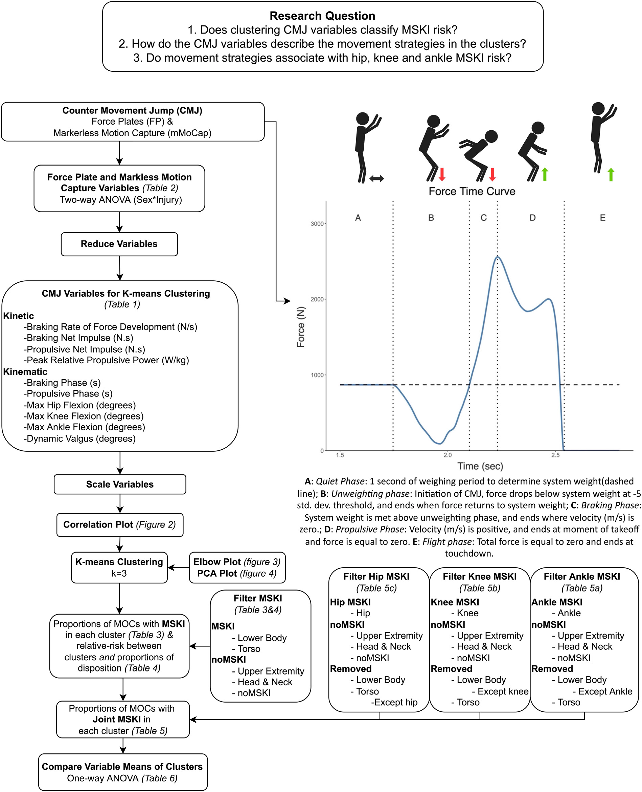
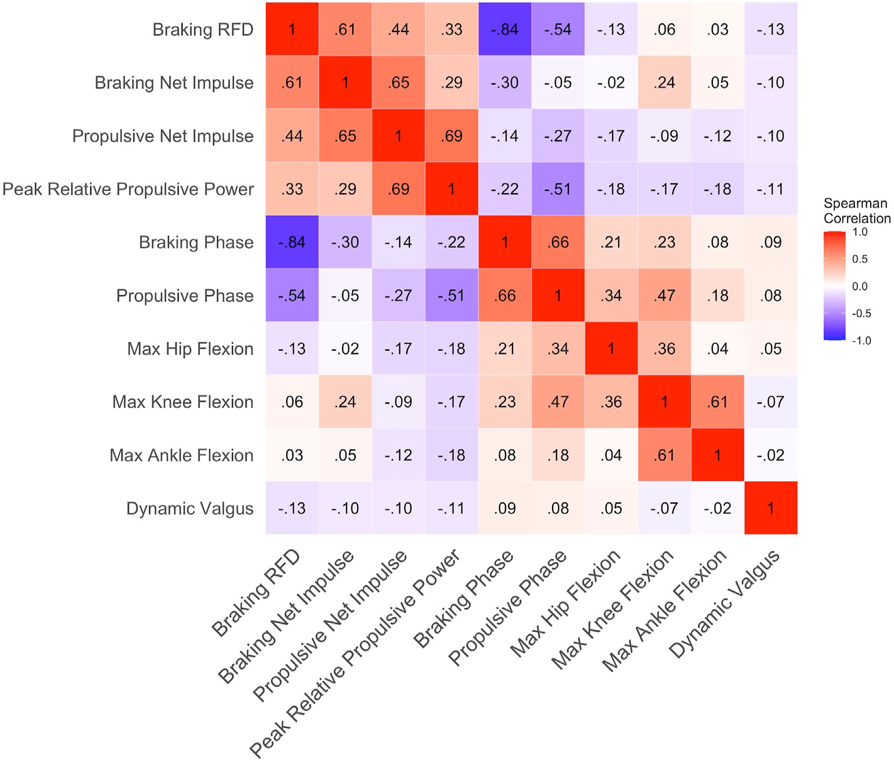
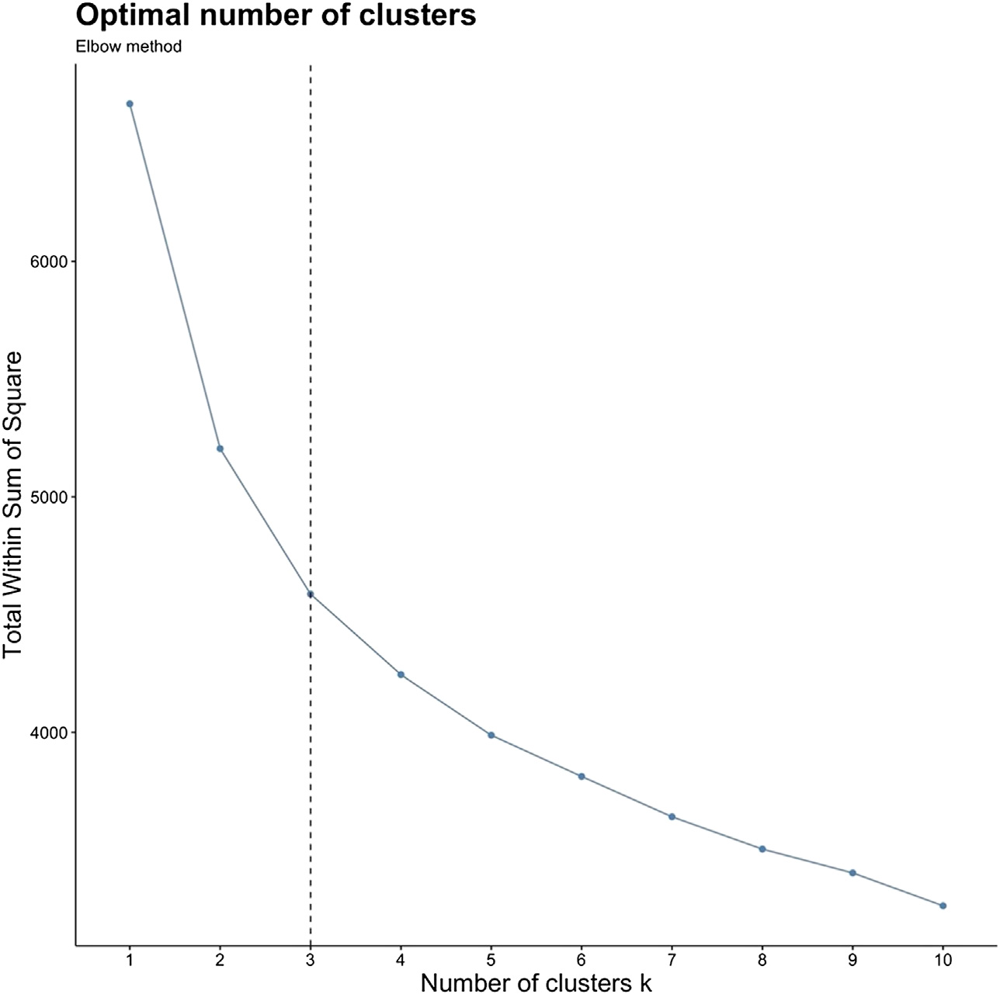
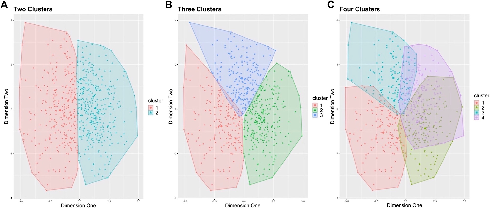
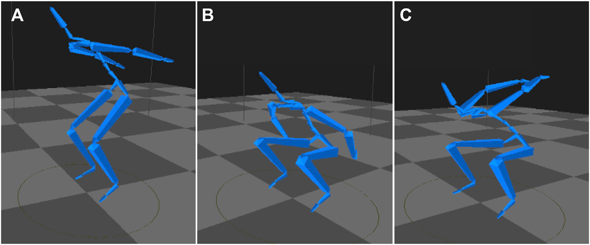

<!--
provenance:
  doi: 10.3389/fphys.2022.868002
  title: Unsupervised Clustering Techniques Identify Movement Strategies in the Countermovement Jump
  source: unknown
  download_url: unknown
  final_host: unknown
  filed: 2026-07-12
-->

<!-- page 1 -->

# Unsupervised Clustering Techniques Identify Movement Strategies in the Countermovement Jump Associated With Musculoskeletal Injury Risk During US Marine Corps Officer Candidates School 

Matthew B. Bird1 *, Qi Mi1 , Kristen J. Koltun1 , Mita Lovalekar1 , Brian J. Martin1 , AuraLea Fain2 , Angelique Bannister3 , Angelito Vera Cruz3 , Tim L. A. Doyle2 and Bradley C. Nindl1 

> 1Neuromuscular Research Laboratory/Warrior Human Performance Research Center, Department of Sports Medicine and Nutrition, University of Pittsburgh, Pittsburgh, PA, United States,2 Biomechanics, Physical Performance and Exercise Research Group, Department of Health Sciences, Macquarie University, Sydney, NSW, Australia,3 USMC Officer Candidates School, Quantico, VA, United States 

Edited by: Dustin Robert Grooms, Ohio University, United States 

Reviewed by: Philip Malloy, Rush University, United States Žiga Kozinc, University of Primorska, Slovenia 

*Correspondence: Matthew B. Bird mab642@pitt.edu 

Specialty section: This article was submitted to Integrative Physiology, a section of the journal Frontiers in Physiology Received: 01 February 2022 Accepted: 05 April 2022 Published: 11 May 2022 

Citation: 

Bird MB, Mi Q, Koltun KJ, Lovalekar M, Martin BJ, Fain A, Bannister A, Vera Cruz A, Doyle TLA and Nindl BC (2022) Unsupervised Clustering Techniques Identify Movement Strategies in the Countermovement Jump Associated With Musculoskeletal Injury Risk During US Marine Corps Officer Candidates School. Front. Physiol. 13:868002. doi: 10.3389/fphys.2022.868002 

Musculoskeletal injuries (MSKI) are a significant burden on the military healthcare system. Movement strategies, genetics, and fitness level have been identified as potential contributors to MSKI risk. Screening measures associated with MSKI risk are emerging, including novel technologies, such as markerless motion capture (mMoCap) and force plates (FP) and allow for field expedient measures in dynamic military settings. The aim of the current study was to evaluate movement strategies (i.e., describe variables) of the countermovement jump (CMJ) in Marine officer candidates (MOCs) via mMoCap and FP technology by clustering variables to create distinct movement strategies associated with MSKI sustained during Officer Candidates School (OCS). 728 MOCs were tested and 668 MOCs (Male MOCs = 547, Female MOCs = 121) were used for analysis. MOCs performed 3 maximal CMJs in a mMoCap space with FP embedded into the system. Deidentified MSKI data was acquired from internal OCS reports for those who presented to the OCS Physical Therapy department for MSKI treatment during the 10 weeks of OCS training. Three distinct clusters were formed with variables relating to CMJ kinetics and kinematics from the mMoCap and FPs. Proportions of MOCs with a lower extremity and torso MSKI across clusters were significantly different (p < 0.001), with the high-risk cluster having the highest proportions (30.5%), followed by moderate-risk cluster (22.5%) and low-risk cluster (13.8%). Kinetics, including braking rate of force development (BRFD), braking net impulse and propulsive net impulse, were higher in low-risk cluster compared to the high-risk cluster (p < 0.001). Lesser degrees of flexion and shorter CMJ phase durations (braking phase and propulsive phase) were observed in low-risk cluster compared to both moderate-risk and high-risk clusters. Male MOCs were distributed equally across clusters while female MOCs were primarily distributed in the high-risk cluster. Movement strategies (i.e., clusters), as quantified by mMoCap and FPs, were

<!-- page 2 -->

successfully described with MOCs MSKI risk proportions between clusters. These results provide actionable thresholds of key performance indicators for practitioners to use for screening measures in classifying greater MSKI risk. These tools may add value in creating modifiable strength and conditioning training programs before or during military training. 

Keywords: musculoskeletal injuries, markerless motion capture, force plates, marines, screening, unsupervised learning, k-means clustering, military 

## INTRODUCTION 

Musculoskeletal injuries (MSKIs) sustained during initial military training remain a significant cause of lost duty time, attrition, and financial burden on the military healthcare system, as well as degrade military readiness and subsequent deployability (Piantanida et al., 2000; Nindl et al., 2013a; Nindl et al., 2013b; Lovalekar et al., 2021). According to the Army Public Health Command's, Health of the Force Report 2020, over 50% of soldiers experienced an injury resulting in 2 million medical encounters and 10 million limited duty days (APHC, 2020). Consequently, there is heightened awareness and interest in screening tests that can inform military leadership regarding MSKI risk and be incorporated into policy and practices to mitigate training related MSKIs. 

MSKIs sustained during military training are multifaceted and can be attributed to a host of factors, such as genotype (Bray et al., 2009), low fitness (Robinson et al., 2016), female sex (Lovalekar et al., 2020), or prior MSKI history (Eagle et al., 2019). Additionally, movement strategies have been associated with MSKI risk in both athletic and military populations (Chorba et al., 2010; Lisman et al., 2013; Markström et al., 2019). Previous attempts to evaluate movement strategies have included the goldstandard method of marker-based motion capture (MoCap) (Russell et al., 2006). Although the data is clinically meaningful, MoCap is burdensome on time and largely confined to state-of-the-art biomechanical laboratories and thereby preventing field data collection. In an attempt to move “from the lab to the field” and to address limitations of MoCap, emerging technologies and algorithms have been developed as alternative testing modalities. Markerless motion capture (mMoCap) is an emerging technology (Mündermann et al., 2006; Sonnenfeld et al., 2021) for movement screening that reportedly produces valid ground reaction force estimates (Fry et al., 2016; Mosier et al., 2019), valid to MoCap system kinematics (Perrott et al., 2017; Drazan et al., 2021), and is reliable (Martinez et al., 2018; Mosier et al., 2018). mMoCap may provide a field expedient measure to evaluate movement strategy-related kinetics, kinematics and performance measures and provide insight into MSKI risk. In addition, the incorporation of concurrent FP and mMoCap assessment measures could create a higher fidelity system to detect kinetics in different phases of commonly performed dynamic movements, such as the countermovement jump (CMJ) (Beckham et al., 2014; McMahon et al., 2018). 

One particular movement, the CMJ, may be beneficial for incorporation with FP and mMoCap testing as it has been used widely as a screening and readiness measure for athletes and 

military personnel as it is directly correlated to isometric strength, one repetition maximum half squat (Boraczyński et al., 2020), and is reliable and repeatable for quantifying neuromuscular readiness (Cormack et al., 2008; Welsh et al., 2008; Merrigan et al., 2020). The CMJ is a simple and field-ready test that may provide information regarding MSKI risk and preventative strategies to mitigate MSKIs through information, such as force production, loading kinematics via FP or mMoCap technology (Hart et al., 2019; Pontillo and Sennett, 2019; Pontillo et al., 2021). To analyze movement strategies associated with MSKI risk, independent statistics (i.e., T-tests, ANOVAs) and univariate prediction modeling (i.e., logistic and linear regression) have traditionally been used indicate and predict MSKI (Dudley et al., 2017; de la Motte et al., 2019), whereas more robust analytical, statistical, and machine learning approaches have been underutilized for MSKI prediction. These advanced methodologies may better indentify the relevant information and complex relationships associated with MSKI and provide an appropriately robust approach to a non-linear problem (i.e., indicating MSKI risk), but have yet to be fully evaluated in this manner. Specifically, supervised learning that utilizes labeled data such as MSKI or noMSKI to train an algorithm for prediction (Connaboy et al., 2018) and unsupervised learning, which uses unlabeled data to detect trends or hidden patterns within the data set (i.e., Clustering), warrant further investigation for identifying MSKI risk. 

To date, cluster analysis, a specific type of unsupervised learning, has been incorporated into human performance investigations to evaluate physical performance standards (Allison et al., 2019; Gaudet et al., 2019), questionnaires (i.e., pre-game expectations) (Kumar et al., 2019; Popovych et al., 2020), shoulder injuries in volleyball players (Gaudet et al., 2019), and change of direction movement strategies during ACL injuries (Sigurðsson and Briem, 2019). More recently, Rauch et al. (2020), used k-means clustering, a type of clustering method to describe kinetic and kinematic variables that accurately describe CMJ movement strategies for basketball players positional groups. However, clustering has not been applied to assess MSKI risk via movement strategies during military training. Therefore, we explored movement strategies associated with MSKI by clustering CMJ kinetic and kinematic variables in FP and mMoCap in Marine Corps Officer candidates (MOCs) undergoing 10 weeks of arduous military training known to cause a high incidence rate for MSKIs (Cumulative injury incidence in Marine Officer Candidates School: Male MOCs = 59.5%, Female MOCs = 80% (Piantanida et al., 2000). The primary aim of the current study was to evaluate movement

<!-- page 3 -->

strategies (i.e., description of variables) of the CMJ in MOCs via mMoCap and FP technology by clustering variables to create distinct movement strategies associated with MSKI sustained during Officer Candidates School (OCS). In addition, we explore other analytical techniques such as two-way ANOVA and provide rationale why movement strategies may be better suited for clustering techniques to assess MSKI risk. 

## MATERIALS AND METHODS 

Researchers briefed and consented MOCs for the study. Ethical approval was provided by The University of Pittsburgh (STUDY19030386) and the research was endorsed by the Office of Naval Research and Officer Candidates School. 728 MOCs (Male MOCs = 599, Female MOCs = 129) volunteered and participated in the mMoCap and FP testing which comprised four intake classes. 

## Of cer Candidates School 

One pathway to be commissioned as an Officer in the United States Marine Corps (USMC) requires the completion of OCS. OCS is a 10-week initial military training course for male and female MOCs that consists of intense physical and military training within a controlled and challenging environment. Physical training is conducted based on a predetermined schedule and includes graded events that are designed to test general strength and endurance under field and tactical conditions. In addition, running, hiking, obstacle course navigation and bodyweight exercises are performed as part of regular supervised training occurring 3–5 days/week. 

## Movement Assessment 

Prior to the start of physical training, height and weight were recorded by a stadiometer and digital scale (Healthometer Professional 500KL, McCook, IL). MOCs were required to perform a warm-up and familiarization phase before testing. DARI mMoCap (DARI Motion, Inc. Overland Park, KS), a 3- dimensional mMoCap system was used for data collection. 8 Black-fly FLIR GigE cameras (50 Hz) were placed around an 2.5 × 3.5 m matted area with Hawkin Dynamic dual FP (Hawkin Dynamics, ME), sampling at 1,000 Hz, embedded into the mat. Prior to daily testing, the DARI mMoCap was calibrated to the manufacturer’s specifications, and FPs were tested to ensure device ground contact. DARI mMoCap use Captury Live motion tracking software (CL, The Captury Ltd., Saarbrücken, Germany) that uses sums of spatial Gaussian functions to generate a subject-specific body model representing the shape and color statistics to estimate joint centers (Stoll et al., 2011). Before capture, the FPs were zeroed and a background subtraction was performed on the DARI mMoCap system so that when MOCs enters the mMoCap area, MOCs are differentiated from the background during initialization of the tracking model. MOCs placed one foot on each FP, and cued into a calibration position, in which both elbows were at 90° , and hands downwards. A computerized subject-based model was generated and virtually overlaid on the live image of the 

MOCs, and scaling actions (lunges, squats, arm rotations) were performed to capture the MOCs joint centers. 

MOCs performed three maximal-effort CMJs, with 15 s rest between each jump. The MOCs were cued to start with hands above head, stand still (1 s of quiet phase to register system weight), and performed the jump with a counter-movement and arm swing to a self-selected depth. Participants were instructed to jump immediately after researchers verbally gave a 3-2-1 countdown. A trial was unsuccessful and redone if the MOC failed to land within the confines of the force plates. If the skeleton was visually misaligned from a joint center, either the MOCs would redo the CMJ or the skeleton would be re-tracked posthoc. MOCs flagged for a misalignment in the skeleton were further evaluated visually for misalignments in skeleton joint centers. After visual inspection, the mean for each FP and mMoCap variable were calculated and three standard deviations above or below the mean were visually inspected for the potential removal of trail (i.e., mMoCap: Skeleton misalignment or joint center deviating from joint center and FP: Unweighting phase starting early due to movement artifact from MOCs). A total of 728 MOCs were tested, while 668 MOCs (Male MOCs = 547, Female MOCs = 121) were retained after filtering of artifacts in mMoCap and FPs. 

All variables from DARI mMoCap were uploaded to DARI’s cloud platform and processed using DARI Insight Processing (version 1.0.4-250) and DARI Insight Vault (version 1.0.3-854) software. mMoCap joint coordinate systems are defined during movement tracking and calculations for knee, hip and ankle kinematics follow the methods prescribed by the International Society of Biomechanics (Grood and Suntay, 1983; Wu et al., 2005). Variables from FPs were uploaded to Hawkin Dynamic Cloud (v16.2.0) and processed using Hawkin Dynamic Software (v7.3.8) using force-time curve cut-offs for varying phases (i.e., Braking and Propulsive phase) explained in Figure 1, along with the description of variable calculations in Table 1. Analysis was performed on one CMJ that was based on peak CMJ jump height via FPs with the matching jump number from mMoCap. DARI mMoCap outputs right and left limbs, which limbs were averaged for a gross bilateral movement (i.e., (Left + Right Ankle Flexion)/2). 

## Musculoskeletal Injuries Labeling 

De-identified MSKI data was acquired from internal OCS reports for those who presented to the OCS Physical Therapy department for MSKI treatment during the 10 weeks of OCS training. MSKIs were presented into four anatomical regions: 1) lower body (LB), 2) torso, 3) upper body (UB), 4) head and neck (HN). The specific body parts associated with each region include: 1) LB: foot, ankle, knee, lower leg, and upper leg, 2) Torso: lumbar spine, thoracic spine, ribs, hip 3) UB: shoulder, elbow, upper arm, forearm, hand, and wrist 4) HN: cervical spine. Severity of injury was defined as Disposition and was either Light Duty: limitations to full training or Full Duty: No limitations to training. To account for inclusion of multiple MSKIs within a MOC, injury severity was rounded up to the most severe (i.e., light duty) when analyzing for light duty MSKIs per cluster, and joint MSKI was rounded to the specific joint MSKI analyzed (i.e., Hip MSKI, Knee MSKI, Ankle MSKI).

<!-- page 4 -->

FIGURE 1 | Analytical pipeline describing the data analysis methods, and the force plate force-time curve describing the different phases of the CMJ.

Transcribed pipeline flowchart (left column, top to bottom, is the full analysis recipe):

1. Counter Movement Jump (CMJ) captured by Force Plates (FP) and Markerless Motion Capture (mMoCap).
2. FP and mMoCap variables (Table 2); two-way ANOVA (Sex*Injury).
3. Reduce Variables -> the 10 CMJ variables selected for k-means clustering (Table 1): kinetic (Braking RFD, Braking Net Impulse, Propulsive Net Impulse, Peak Relative Propulsive Power) and kinematic (Braking Phase, Propulsive Phase, Max Hip Flexion, Max Knee Flexion, Max Ankle Flexion, Dynamic Valgus).
4. Scale Variables (mean 0, SD 1).
5. Correlation Plot (Figure 2) to screen for redundant pairs.
6. K-means Clustering, k=3, with k chosen using the Elbow Plot (Figure 3) and PCA Plot (Figure 4).
7. Proportions of MOCs with MSKI in each cluster (Table 3) and relative-risk between clusters plus disposition proportions (Table 4). MSKI = Lower Body or Torso; noMSKI = Upper Extremity, Head & Neck, or no injury.
8. Proportions of MOCs with Joint MSKI (hip/knee/ankle) in each cluster (Table 5).
9. Compare variable means of clusters, one-way ANOVA (Table 6).

Right side is the force-time curve with five phases: A Quiet (1 s weighing to set system weight), B Unweighting (force drops below system weight past a −5 SD threshold), C Braking (system weight met, ends where velocity = 0), D Propulsive (velocity positive, ends at takeoff where force = 0), E Flight (total force = 0, ends at touchdown).

The rounding technique was performed so that the correct joint MSKI and the highest severity was pulled, and so that no duplicate MOCs were presented in the data. 

## Data Analysis 

Two-way independent measures analysis of variance (ANOVAs) were conducted to analyze the effect of sex (between-subjects

<!-- page 5 -->

TABLE 1 | K-means clustering variables definitions. 

|Variables|Defnitions|
|---|---|
|Kinetic measures||
|Braking RFD (N/s)|Difference in newtons from the end of braking to the start of braking divided by the duration of the braking phase|
|Braking net impulse (N.s)|Impulse above system weight during braking phase|
|Propulsive net impulse (N.s)|Impulse above system weight during propulsive phase|
|Peak relative propulsive power (W/kg)|Peak power during propulsive phase divided by kg of subject mass|
|Kinematic measures||
|Braking phase (s)|Duration of braking phase|
|Propulsive phase (s)|Duration of propulsive phase|
|Max hip fexion (degrees)a|Max fexion angle between pelvis and femur during loading phase|
|Max knee fexion (degrees)a|Max fexion angle between femur and tibia during loading phase|
|Max ankle fexion (degrees)a|Max fexion angle between tibia and foot during loading phase|
|Dynamic valgus (degrees)a|Measure of knee deviation from the leg Plane, which is defned using the positions of hip and ankle joint centers and the pelvis anterior direction|

> aMarkerless Motion Capture variables are from the start of the movement to the pelvis reaching minimum height; Force plate variables are described in Figure 1. 

TABLE 2 | Force plate and markerless motion capture variables in Marine Officer Candidates (MOCs). 

| Variables | Abbreviation | Male MSKI (n = 109) | Male noMSKI (n = 438) | Male MOCs (n = 547) | Female MSKI (n = 44) | Female noMSKI (n = 77) | Female MOCs (n = 121) |
|---|---|---|---|---|---|---|---|
|Kinetic variables||||||||
|Braking RFD (N/s)|BRFD|3,349 ± 1,675|3,782 ± 1,832|3,696 ± 1,808|2,180 ± 1,153|2,524 ± 1,223|2,399 ± 1,205|
|Avg. braking force (N)|ABF|1,190 ± 207|1,235 ± 201|1,226 ± 203|907 ± 128|963 ± 147|943 ± 143|
|Avg. relative braking force (%BW)|ARBF|152.7 ± 19.6|156.4 ± 19.1|155.6 ± 19.3|147.7 ± 18.5|150.2 ± 16.6|149.3 ± 17.3|
|Avg. propulsive force (N)|APF|1,364 ± 198|1,404 ± 208|1,396 ± 206|995 ± 125|1,044 ± 144|1,026 ± 139|
|Avg. relative propulsive force (%BW)|ARPF|174.9 ± 13.0|177.6 ± 16.3|177.1 ± 15.7|161.6 ± 12.1|162.6 ± 11.9|162.2 ± 12.0|
|Braking net impulse (N.s)|BNI|109 ± 21|112 ± 21|111 ± 21|76 ± 14|83 ± 15|81 ± 15|
|Propulsive net impulse (N.s)|PNI|222 ± 33|227 ± 33|226 ± 33|147 ± 21|157 ± 22|153 ± 22|
|Peak relative propulsive power (W/kg)|PRPP|53 ± 7|54 ± 8|54 ± 8|43 ± 6|44 ± 6|43 ± 6|
|Peak propulsive power (W)|PPP|4,215 ± 789|4,335 ± 827|4,311 ± 820|2,699 ± 491|2,853 ± 492|2,797 ± 495|
|Kinematic variables||||||||
|Braking phase (s)|BP|0.29 ± 0.08|0.27 ± 0.07|0.28 ± 0.07|0.28 ± 0.07|0.28 ± 0.06|0.28 ± 0.06|
|Propulsive phase (s)|PP|0.39 ± 0.05|0.38 ± 0.06|0.38 ± 0.05|0.40 ± 0.05|0.40 ± 0.06|0.40 ± 0.06|
|Time to take off (s)|TTTO|1.11 ± 0.14|1.09 ± 0.14|1.10 ± 0.14|1.10 ± 0.14|1.10 ± 0.12|1.10 ± 0.13|
|Max hip fexion (degrees)a|HF|99.9 ± 15.4|97.6 ± 16.1|98.0 ± 16.0|103.0 ± 17.7|105.7 ± 15.5|104.8 ± 16.4|
|Max knee fexion (degrees)a|KF|116.3 ± 14.0|114.7 ± 14.7|115.0 ± 14.6|109.1 ± 11.2|113.3 ± 14.7|111.8 ± 13.6|
|Max ankle fexion (degrees)a|AF|33.7 ± 6.3|32.8 ± 6.0|33.0 ± 6.0|34.5 ± 6.7|33.7 ± 5.1|34.0 ± 5.7|
|Dynamic valgus (degrees)a Performance variables|DV|5.7 ± 3.4|5.5 ± 3.0|5.5 ± 3.0|6.7 ± 3.4|7.1 ± 3.8|6.9 ± 3.6|
|Jump height (m)|JH|0.40 ± 0.07|0.40 ± 0.07|0.40 ± 0.07|0.28 ± 0.05|0.29 ± 0.05|0.29 ± 0.05|
|Modifed reactive strength index (JH/TTTO)|mRSI|0.36 ± 0.08|0.38 ± 0.09|0.38 ± 0.09|0.26 ± 0.06|0.27 ± 0.07|0.27 ± 0.07|

aMarkerless motion capture variables; MSKI = Lower Extremity and Torso; noMSKI = Upper Extremity, Head and Neck, and noMSKI; Two-way ANOVA for Sex*Injury results in text; MSKI = Musculoskeletal Injury; data presented as mean ± standard deviation. 

variable: male and female), the effect of injury (between-subject variable: MSKI and noMSKI), and the effect of interaction between sex and injury, on 18 FP and mMoCap dependent variables in Table 2. If the interaction effect was statistically significant, simple main effects of injury at each level of sex were analyzed. 

K-means clustering (MacQueen, 1967) is an unsupervised technique that initially randomly assigns cluster centroids, then in an iterative process attempts to group the values 

closest to the cluster centroid in which to minimize the sum of squares within each cluster. Before k-means clustering, ten variables were reduced and scaled from Table 2 to reduce dimensionality (Steinbach et al., 2004), characterizing the kinetic and kinematic braking and propulsive phases. Each variable was scaled so that its mean equals zero and the standard deviation equals one. Spearman correlations were performed on the ten variables to assess for highly correlated variables that display similar concepts, thus the concepts may be

<!-- page 6 -->

represented twice (Sambandam, 2003). Thresholds of highly correlated variables were set at r >0.85 or <−0.85, and if pairwise variables fell >0.85 or <−0.85 one of the pairwise variables would be subject to be removed. To determine the number of clusters, an elbow plot and visual inspection of three separate runs (two, three, and four number of clusters) of k-means were performed. The elbow method is a subjective measure, evaluating for a “kink” in the curve, in which optimal number of clusters are chosen (Figure 3), by measuring the total within sum of squares (Kodinariya and Makwana, 2013). The separate runs of k-means were visualized by a 2-dimensional principal component analysis (PCA) plot (Figure 4) to evaluate for the minimization of cluster overlap. R Version 3.6.1 (R Core Team, 2019) packages including Hmisc V. 4.5 (rcorr, Spearman correlation), stat V. 3.6.2 (kmeans, K-Means Clustering), ggplot2 V. 3.3.5 (Elbow plot and Cluster visualization) were used for analysis and visualization. 

Fisher’s exact tests were used to compare the proportions across clusters for MOCs with MSKIs, Male and Female MOCs with MSKI, Female and Male MOCs, MOCs with ankle MSKI, Knee MSKI, and Hip MSKI, Male and Female MOCS with ankle MSKI, Knee MSKI, and Hip MSKI, MOCs with Light Duty MSKI, and Male and Female MOCs with Light Duty MSKI. Relative risk and 95% confidence intervals were calculated between each cluster for each of the proportions. One-way independent measures analysis of variance (ANOVAs) were conducted to analyze the effect of cluster (between-subjects variable: C1,C2,C3), on each of the ten dependent variables used in k-means clustering. All Statistical analysis was conducted using IBM SPSS Statistics Version 25 (IBM Corp; Armonk, NY). Statistical significance was set a priori at α = 0.05, two-sided. 

## RESULTS 

Female MOCs were significantly shorter (M = 176.5 ± 6.9 cm; F = 163.9 ± 5.4 cm, p < 0.001) and weighed less than male MOCs (M = 80.2 ± 9.4 kg; F = 64.6 ± 7.2 kg, p < 0.001), while age was not different (M = 24.8 ± 3.0 years; F = 24.8 ± 3.3 years). Two-way ANOVAs were conducted to analyze the effect of sex and injury on the variables listed in Table 2. There was no significant interaction between Sex and Injury in their effect on any of the dependent variables analyzed (all interaction p values >0.05). There was a statistically significant main effect of sex on all dependent variables analyzed (all main effect of sex p values < 0.05), except for AF (p = 0.183, ηp2 = 0.003), TTTO (p = 0.894, ηp2 = 0.000), and BP (p = 0.674, ηp2 = 0.000). There were significant 2 main effects for injury for BRFD (p = 0.037, ηp = 0.007), ABF (p = 0.016, ηp2 = 0.009), APF (p = 0.037, ηp2 = 0.007), BNI (p = 0.029, ηp2 = 0.007), and PNI (p = 0.042, ηp2 = 0.006). The main effects of injury were not statistically significantly different for the other dependent variables. 

## K-Means Clustering 

Ten variables were reduced and scaled from Table 2 to characterize the CMJ kinetics and kinematic braking and 

propulsive phases for k-means clustering. Before clustering, Spearman correlations were performed to check for highly correlated variables and none of the ten variables used for k-means clustering presented with the criterion described in Figure 2 (r >0.85 or <−0.85). BP and BRFD had the greatest correlation (r = −0.84), while all other pairwise correlations were below r = 0.69 and greater than r = −0.54. 

The ten scaled variables were analyzed using k-means clustering for male and female MOCs (MOCs = 668, Male MOCs = 547, Female MOCs = 121). The Elbow plot determined (Figure 3) the optimal number of clusters were two and three clusters. Clusters were visualized (Figure 4) in a 2-dimensional PCA plot, displaying two and three clusters had the least amount of overlap when compared to four clusters, thus three clusters where chosen. 

Fishers exact test was used to compare proportion of MOCs with MSKIs between clusters (Table 3) and showed that clusters were significantly different (p < 0.001). C3 having the highest proportion of MSKIs (30.5%) and C1 having the lowest (13.8%), while C2 moderate (22.5%). This defines C3 as a “high-risk” cluster, C1 as a “low-risk” cluster, and C2 as a “moderate-risk” cluster based on proportions MOCs with MSKIs in each cluster. Relative-risk (95% Confidence Interval) (Table 3) compared high-risk to low-risk (RR (95% CI) =2.2 (1.5–3.3)), moderate risk to low risk (RR (95% CI) = 1.6 (1.1–2.5)), and high-risk to – moderate-risk (RR (95% CI) = 1.3 (1.0 1.9)). After stratifying by sex MSKI, the percent of male MOCs with MSKI was proportionally different between clusters (p = 0.011). While the percent of female MOCs with MSKI were proportionally similar for the low-risk and moderate-risk cluster (25% MSKI), while high-risk (38.1% MSKI) was different, although not significant across clusters (p = 0.770). Lastly, proportions of sex were calculated and the percent of female MOCs were primarily distributed to high-risk cluster (41%), while similar distributions in low-risk (3.9%) and moderate-risk (3.8%). 

Disposition of MSKI was assessed by evaluating proportion of MOCs with a light duty MSKI within each cluster (Table 4). There were no significant differences across clusters (p = 0.149), with high-risk having largest percentage of light duty MSKI (79.4%) and moderate risk the lowest (64.8%). Joint specific MSKI (Table 5) hip (Table 5C) and knee (Table 5B) MSKI across clusters were not significantly different, while ankle (Table 5A) MSKI was significantly different (p = 0.010, lowrisk: 3.3%, moderate-risk: 3.6%, high-risk: 10.1%). 

One-way ANOVAs were conducted on each dependent variable (Table 6), demonstrating that k-means clustering performed well at separating groups for each of the ten variables (p < 0.001). Bonferroni Post Hoc identified significant differences in BNI, PNI, PRPP, BP, PP, KF, and AF across the clusters, and BRFD, HF, and DV were significantly different between low-risk and high-risk. Between low-risk and high-risk, high-risk resulted in lesser values in kinetics (i.e., BRFD: low-risk = 4,518 ± 1,725 N/s, high-risk = 2,019 ± 761 N/s and PNI: low-risk: 238 ± 33 N.s, high-risk: 180 ± 35 N.s) and greater values in kinematics measures (i.e., KF: low-risk = 102.6 ± 10.4° , high-risk = 114.3 ± 13.0° , and BP: low-risk = 0.23 ± 0.05 s, high-risk = 0.32 ± 0.07 s), although BNI was significantly

<!-- page 7 -->

FIGURE 2 | Correlation plot on the 10 variables used for k-means clustering; r values represented by value and color representation (darker red = greater positive r values and darker blue = greater negative r values); If pairwise r values were >0.85 and <−0.85 then one variable of the pairwise variables were removed; No variables were removed.

Transcribed Spearman correlation matrix (10 clustering variables). Rows/columns in order: BRFD (Braking RFD), BNI (Braking Net Impulse), PNI (Propulsive Net Impulse), PRPP (Peak Relative Propulsive Power), BP (Braking Phase), PP (Propulsive Phase), HF (Max Hip Flexion), KF (Max Knee Flexion), AF (Max Ankle Flexion), DV (Dynamic Valgus). Diagonal = 1.

| | BRFD | BNI | PNI | PRPP | BP | PP | HF | KF | AF | DV |
|---|---|---|---|---|---|---|---|---|---|---|
| BRFD | 1 | .61 | .44 | .33 | −.84 | −.54 | −.13 | .06 | .03 | −.13 |
| BNI | .61 | 1 | .65 | .29 | −.30 | −.05 | −.02 | .24 | .05 | −.10 |
| PNI | .44 | .65 | 1 | .69 | −.14 | −.27 | −.17 | −.09 | −.12 | −.10 |
| PRPP | .33 | .29 | .69 | 1 | −.22 | −.51 | −.18 | −.17 | −.18 | −.11 |
| BP | −.84 | −.30 | −.14 | −.22 | 1 | .66 | .21 | .23 | .08 | .09 |
| PP | −.54 | −.05 | −.27 | −.51 | .66 | 1 | .34 | .47 | .18 | .08 |
| HF | −.13 | −.02 | −.17 | −.18 | .21 | .34 | 1 | .36 | .04 | .05 |
| KF | .06 | .24 | −.09 | −.17 | .23 | .47 | .36 | 1 | .61 | −.07 |
| AF | .03 | .05 | −.12 | −.18 | .08 | .18 | .04 | .61 | 1 | −.02 |
| DV | −.13 | −.10 | −.10 | −.11 | .09 | .08 | .05 | −.07 | −.02 | 1 |

Strongest pair is BRFD vs Braking Phase (r = −.84), below the ±0.85 removal threshold, so all ten variables were kept.

greater in the moderate-risk cluster among clusters (low-risk: 111 ± 21 N.s, moderate-risk: 122 ± 18 N.s, high-risk: 88 ± 16 N.s). Representation of MOCs movement strategy from each cluster are presented in Figure 5. 

## DISCUSSION 

This study applied unsupervised learning (k-means clustering) to baseline CMJ kinetic and kinematic variables to discriminate distinct movement strategies that were prospectively associated with developing an MSKI during OCS in Marine Officer Candidates. Significant differences in the variables used to designate each cluster were indicative of greater kinetics (BRFD, impulse, power) and lower/ shorter kinematics (joint flexions, time duration measures) in the low-risk cluster, while the high-risk cluster demonstrated longer time durations and moderate joint flexion kinematics, and lower kinetics. Such findings suggest that efficient CMJ movement strategies are associated with a lower risk for MSKI during military training. 

## K-Means Clustering has Utility for Classifying MSKI Risk 

Two separate analyses were conducted in this study to evaluate MSKI risk in Marine Officer Candidates. When utilizing a two- 

way ANOVA to compare between sexes and injury groups, kinetic variables, such as BRFD, braking net impulse, and propulsive net impulse were significantly greater in the noMSKI group compared to MSKI. No kinematic variables were significantly different between MSKI and noMSKI, suggesting that CMJ kinematics are not associated with MSKI risk. In agreement with our results, similar analyses were previously reported using multiple independent sample t-tests to evaluate running gait kinematics and reported few kinetics and kinematics were significantly different between MSKI and noMSKI in runners (Dudley et al., 2017). Additionally, some kinetic and kinematic measures in the single-leg drop jump were significantly different between male and female adolescents (Romanchuk et al., 2020). The interpretation from these analyses are limited, because each individual kinetic or kinematic variable are compared across groups (MSKI vs. noMSKI or Male vs. Female) one at a time, whereas in reality, the kinematic chain functions as a synchronized movement of multiple components. Therefore, clustering movement strategies incorporates combinations of kinetics and kinematics that relate to MSKI risk and sex differences. Such approaches allow not only for clustering of CMJ variables to create a comprehensive movement profile, but also compare MSKI status and sex between movement strategies rather than grouping based on MSKI classification.

<!-- page 8 -->

FIGURE 3 | Elbow plot demonstrating, y-axis = total within sum of squares by x-axis = number of clusters (k); Subjective evaluation for number of clusters chosen for analysis, used for determination of k; “Kink” in curve occurs at k = 2 and 3.

Transcribed elbow curve (total within-cluster sum of squares vs k, read from the plot; approximate y-values): k=1 ≈ 6700, k=2 ≈ 5200, k=3 ≈ 4650, k=4 ≈ 4400, k=5 ≈ 3970, k=6 ≈ 3600, k=7 ≈ 3300, k=8 ≈ 3050, k=9 ≈ 2800, k=10 ≈ 2550. A dashed vertical line marks k=3. The curve bends most between k=2 and k=3; the drop from k=3 onward is gradual.

FIGURE 4 | Three separate analyses of k-means clustering (k = 2, 3, and 4). (A) k = 2, Two Clusters. (B) k = 3, Three Clusters. (C) k = 4, Four Clusters; Represented by PCA 2-d plot for representation of cluster distribution and overlap; (B) was chosen with insight from elbow plot, and visual comparison of cluster distributions with minimal overlap of clusters.

Three PCA 2-D scatter plots (axes: Dimension One horizontal, roughly −5.0 to 5.0; Dimension Two vertical, roughly −4 to 4), each showing the same 668 points colored by k-means label with convex hulls drawn per cluster. (A) k=2: two side-by-side hulls (left/right) meeting near Dimension One = 0, little overlap. (B) k=3: a left cluster, a lower-right cluster, and an upper cluster; hulls touch but overlap is small. (C) k=4: four hulls with substantial mutual overlap in the center. The authors read (A) and (B) as the cleanest separations and picked k=3.

<!-- page 9 -->

TABLE 3 | Proportions of MOCs with Lower Body and Torso Musculoskeletal Injury by Cluster. 

||C1 (low-risk)|C2 (moderate-risk)|C3 (high-risk)|Fisher’s exact test p va|lue Rel|ative-risk (95%|CI)|
|---|---|---|---|---|---|---|---|
||||||C3/C1|C2/C1|C3/C2|
|%MSKI|28/203 = 13.8%|47/209 = 22.5%|78/256 = 30.5%|<0.001|2.2 (1.5–3.3)|1.6 (1.1–2.5)|1.3 (1.0–1.9)|
|%MSKI Male|26/195 = 13.3%|45/201 = 22.4%|38/151 = 25.2%|0.011|1.9 (1.2–3.0)|1.7 (1.1–2.6)|1.1 (0.77–1.6)|
|%MSKI Female|2/8 = 25.0%|2/8 = 25.0%|40/105 = 38.1%|0.770|1.5 (0.5–5.1)|1.0 (0.2–5.5)|1.5 (0.5–5.1)|
|%Male|195/203 = 96.1%|201/209 = 96.2%|151/256 = 59.0%|<0.001||||
|%Female|8/203 = 3.9%|8/209 = 3.8%|105/256 = 41.0%|<0.001||||

Fisher’s exact test comparing clusters; p < 0.05 across all three clusters; Relative-Risk (95% confidence interval) comparing between clusters; MSKI = Musculoskeletal Injury; Each MOCs received a MSKI, or noMSKI label: MSKI = lower body and torso and noMSKI = upper body, head and neck, and noMSKI; %MSKI = (MSKI/(MSKI + noMSKI)); %MSKI Male=(Male MSKI/(Male MSKI+Male noMKSI)); %MSKI Female=(Female MSKI/(Female MSKI+Female noMSKI)); %Female=(Female/(Female+Male)); %Male = (Male/(Female+Male)). 

TABLE 4 | Proportion of MOCs with Light Duty Musculoskeletal Injury by Cluster. 

||C1 (low-risk)|C2 (moderate-risk)|C3 (high-risk)|Fisher’s exact test p value|
|---|---|---|---|---|
|%MSKI Light duty|21/28 = 75.0%|30/47 = 64.8%|62/78 = 79.4%|0.149|
|%MSKI Light duty male|20/26 = 76.9%|28/45 = 62.2%|26/38 = 68.4%|0.458|
|%MSKI Light duty female|1/2 = 50.0%|2/2 = 100%|36/40 = 90.0%|0.394|

Fisher’s exact test comparing clusters; p < 0.05 across all three clusters; Light Duty = Missed training days due to MSKI; MSKI = Musculoskeletal Injury; %MSKI Light duty=(Light duty/ (Light duty+Full duty)); %MSKI Light duty male=(Male light duty/(Male light duty+Male full duty)); %MSKI Light duty female=(Female light duty/(Female light duty+Female full duty)). 

TABLE 5 | Proportions of MOCs with Joint Musculoskeletal Injury by Cluster. 

||C1 (low-risk)|C2 (moderate-risk)|C3 (high-risk)|Fisher’s exact test p value|
|---|---|---|---|---|
|A. Ankle MSKI (n = 547)|||||
|%MSKI Ankle|6/181 = 3.3%|6/168 = 3.6%|20/198 = 10.1%|0.010|
|%MSKI Ankle male|5/174 = 2.9%|6/162 = 3.7%|9/122 = 7.4%|0.166|
|%MSKI Ankle female|1/7 = 14.3%|0/6 = 0.0%|11/76 = 14.4%|1.00|
|B. Knee MSKI (n = 557)|||||
|%MSKI Knee|8/183 = 4.4%|18/180 = 10.0%|16/194 = 8.2%|0.106|
|%MSKI Knee male|8/177 = 4.5%|17/173 = 9.8%|8/121 = 6.6%|0.153|
|%MSKI Knee female|0/6 = 0.0%|1/7 = 14.3%|8/73 = 11.0%|0.789|
|C. Hip MSKI (n = 532)|||||
|%MSKI Hip|2/177 = 1.1%|5/167 = 3.0%|10/188 = 5.3%|0.072|
|%MSKI Hip male|2/171 = 1.1%|5/161 = 3.1%|4/117 = 3.4%|0.346|
|%MSKI Hip female|0/6 = 0.0%|0/6 = 0.0%|6/71 = 8.5%|1.00|

Fisher's exact test comparing clusters; p < 0.05 across all three clusters; 5a. MSKI Ankle (n = 547): MSKI = Ankle, noMSKI = upper body, head and neck and noMSKI, NA = lower body, and torso MSKIs excluding ankle; 5b. Knee MSKI (n = 557): MSKI = Knee, noMSKI = upper body, head and neck and noMSKI, NA = lower body and torso MSKIs excluding knee; 5c. Hip MSKI (n = 532): MSKI = Hip, noMSKI = upper body, head and neck and noMSKI, NA = lower body and torso MSKIs excluding hip; If labeled “NA” then excluded from analysis; %MSKI Joint=(MSKI Joint/(MSKI Joint+noMSKI)); %MSKI Joint male=(MSKI Joint male/(MSKI Joint male+noMSKI male)); %MSKI Joint female=(MSKI Joint female/(MSKI Joint female+noMSKI female)). 

When comparing kinetic and kinematic variables among injury groups, there are often substantial overlap of variables, which limits significant results between groups that contribute to MSKI risk associations (Bahr, 2016). This highlights the need for analyses to distinctly stratify groups (i.e., clustering) and then observe MSKI and sex proportions for clear thresholds of variables associated with varying MSKI risk with minimal overlap of variables. Recently, Rauch et al. (2020) used k-means clustering to stratify three groups to evaluate the CMJ kinetic and kinematic variables associated with basketball player positional group movement strategies, concluding that CMJ movement strategies indicated positional groups 

(i.e., forward, guards). Our analysis followed a similar method and approach to understand CMJ movement strategies and their relation to MSKI. While k-means clustering is a readily used technique to stratify biomechanics data (i.e., gait pattern) it has rarely been used to classify proportions of MSKIs. Typical machine learning biomechanical analyses use predictive modeling [classification (80.6%) and regression (11.6%)] with limited use of data mining techniques, such as clustering (7.8%) (Halilaj et al., 2018). Due to differences in methodologies, it is difficult to compare the present results with previous literature, therefore this analysis highlights the utility of clustering techniques to identify MSKI risk associations.

<!-- page 10 -->

TABLE 6 | Markerless motion capture and force plate variables used for K-means clustering in Marine Officer Candidates. 

||Abbreviation|C1 (low-risk)|C2 (moderate-risk)|C3 (high-risk)|Omnibus p value|Bonferr h com|oni adjus oc pairwi parison p|ted post se -value|
|---|---|---|---|---|---|---|---|---|
|||||||C3,C1|C2,C1|C3,C2|
|Kinetic measures|||||||||
|Braking RFD (N/s)|BRFD|4,518 ± 1,725|4,200 ± 1,556|2,019 ± 761|<0.001|<0.001|0.057|<0.001|
|Braking net impulse (N.s)|BNI|111 ± 21|122 ± 18|88 ± 16|<0.001|<0.001|<0.001|<0.001|
|Propulsive net impulse (N.s)|PNI|238 ± 33|228 ± 30|180 ± 35|<0.001|<0.001|0.004|<0.001|
|Peak relative propulsive power (W/kg)|PRPP|59 ± 7|51 ± 6|46 ± 6|<0.001|<0.001|<0.001|<0.001|
|Kinematic measures|||||||||
|Braking phase (s)|BP|0.23 ± 0.05|0.27 ± 0.05|0.32 ± 0.07|<0.001|<0.001|<0.001|<0.001|
|Propulsive phase (s)|PP|0.33 ± 0.04|0.40 ± 0.04|0.42 ± 0.05|<0.001|<0.001|<0.001|<0.001|
|Max Hip Flexion (degrees)a|HF|89.8 ± 15.9|104.3 ± 13.3|102.6 ± 15.6|<0.001|<0.001|<0.001|0.712|
|Max Knee Flexion (degrees)a|KF|102.6 ± 10.4|126.0 ± 9.4|114.3 ± 13.0|<0.001|<0.001|<0.001|<0.001|
|Max Ankle Flexion (degrees)a|AF|29.6 ± 4.9|36.8 ± 5.3|33.0 ± 5.6|<0.001|<0.001|<0.001|<0.001|
|Dynamic Valgus (degrees)a|DV|5.4 ± 2.8|5.5 ± 3.2|6.4 ± 3.4|<0.001|0.002|1.0|0.007|

amMoCap variables; One-way ANOVA, analyze effect of cluster (between-subjects variable: C1, C2, C3); Figure 5A (Left). = low-risk cluster, Figure 5B (Middle). = moderate-risk cluster, Figure 5C (Right). = high-risk cluster; data presented as: mean ± standard deviation. 

FIGURE 5 | Example of Marine Officer Candidates from each cluster during max joint flexion in the CMJ (A) (Left): Low-risk cluster (B) (Middle): Moderate-risk cluster (C) (Right): High-risk cluster; Cluster names defined by proportions of MOCs with MSKI (Table 3); Low-risk cluster: lower joint flexions, shorter time durations, and higher kinetics; Moderate-risk cluster: higher joint flexions, moderate time durations, and moderate kinetics; High-risk cluster: moderate joint flexions, longer time durations, and lower kinetics.

[Low-value figure: three side-by-side photographs of a representative candidate from each cluster frozen at maximum joint flexion, illustrating the postural differences the caption describes. No numeric data.]

In our clustering analysis, the proportion of MSKIs across movement strategy clusters significantly differed, in which the low-risk cluster had the lowest proportion of MOCs with a MSKI (13.8%), followed by moderate-risk (22.5%) and high-risk (30.5%). Similar associations were present for the proportion of MSKIs in male and females MOCs, in which the highest proportion of MSKI were in the high-risk cluster. Although, female MOC's proportions of MSKIs across clusters were not significantly different, potentially due to a smaller sample size than male MOCs. In addition, opposite trends existed where female MOCs were highly distributed to the high-risk cluster and male MOCs in the low and moderate-risk cluster. Therefore, we have demonstrated that female MOCs have different CMJ movement strategies than male MOCs that associate with a higher risk of MSKI across clusters. However, there was a large proportion of male MOCs (59%) with similar CMJ movement strategies as female MOCs demonstrating that 

movement strategies, along with female sex are risk factors for higher MSKI risk. 

## Kinetic and Kinematic Variables Associate With the MSKI Risk Clusters 

The MSKI risk labeled proportions (high, moderate and low risk) coincided with kinetic values, such that higher values associated with low-risk (except for breaking net impulse), and lower values associated with high-risk (see Table 6). On the other hand, the low-risk cluster had lower/shorter kinematics (joint flexion, time duration), while the moderate and high-risk cluster had higher/ longer kinematic values. The trends of variables across groups parallel similarly to those reported by McHugh et al. (2021). Specifically, when distributing male NCAA athletes across three groups (average, below average, and above average) FP variables, inverse trends were observed. Peak relative propulsive power was

<!-- page 11 -->

highest (63.8 ± 3.2 W/kg) and propulsive phase was lowest (0.268 ± 0.025 s) in the above average group, while peak relative propulsive power was lowest (52.3 ± 1.9 W/kg), and propulsive phase was highest (0.295 ± 0.041 s) in the below average group. In addition, Márquez et al. (2018) reported that recreationally trained athletes’ relative peak power was greater in men (52.91 ± 7.13 W/kg) than women (43.36 ± 2.58 W/kg). These values suggest that the MOCs in the moderate-risk cluster, predominantly male MOCs (96.2%), were more similar to both the below average male NCAA and male recreationally trained athletes. While the high-risk cluster MOCs (41% female and 59% male MOCs) were lower in peak relative propulsive power when compared to below average male NCAA and male recreationally trained athletes, but greater than female recreationally trained athletes. As the military emphasizes enhanced training and preparation to optimize performance for the “tactical athlete,” it may be advantageous for MOCs to meet similar thresholds of performance that have similar training demands as an average NCAA D1 athlete. In addition, as the military facilitates gender integration (male and female service members in the same roles, i.e., ground combat), the baseline strength and power gap between sexes should be attenuated, as the training demands for male and female MOCs are similar at OCS. 

As previously mentioned, there is limited research in clustering with MSKI risk association. There is also limited research regarding the utility of the CMJ for classifying MSKI risk. More prevalent is the drop landing and drop jump for risk indicators of MSKI, specifically anterior cruciate ligament, and patellofemoral pain (Krosshaug et al., 2016; Holden et al., 2017; Boling et al., 2021). During the drop landing, females are at risk for greater knee valgus at initial contact (Lam and McLeod, 2014; Prieske et al., 2015). In our sample, dynamic valgus was significantly greater in the high-risk cluster (6.4 ± 3.4° ) comprising 41% of the female MOCs, when compared to the low-risk cluster (5.4 ± 2.8° ), which could be postulated to be a risk factor for greater MSKI risk, although a 1-degree difference may not be clinically relevant. 

Due to the lesser joint flexions in the low-risk clusters for hip (89.8 ± 15.9° ), knee (102.6 ± 10.4° ), and ankle (29.6 ± 4.9° ), there were shorter time durations (i.e., braking phase), but greater kinetics (i.e., BRFD) thus indicating these MOCs were more efficient in the CMJ movement strategies, with greater energy storage utilization, such as the stretch shortening cycle (Komi, 2000) in the amortization phase (McMahon et al., 2018). Alternatively, the high-risk and moderate-risk cluster had greater degrees of flexion in all joints with longer time durations for the braking and propulsive phase. The moderate-risk cluster had approximately two times the BRFD values and significantly greater braking net impulse, propulsive net impulse measures than the high-risk cluster, concluding that both moderate-risk and high-risk clusters were less efficient in CMJ variables due to their underlying kinematics, but the moderate-risk cluster was protected by greater kinetic measures (peak relative propulsive power, braking net impulse, propulsive net impulse and BRFD) than the high-risk cluster. 

## Joint MSKI Location is Associated With Movement Strategies 

Hip, Knee and Ankle MSKI proportions were calculated in each cluster (Table 5), with the proportion of MOCs with an ankle MSKI (Table 5A) significant across clusters, but not hip or knee MSKI. Ankle sprains have been attributed to poor transition of non-weight bearing to weight bearing conditions during dynamic movements (Delahunt and Remus, 2019). In the high-risk cluster, there is a low braking impulse and rate of force development, thus pre-disposing these individuals if repetitive loading occurs, causing fatigue in the braking phase or a scenario if the external force exceeds their capacity to develop force. Lastly, hip extension strength was reported to be a significant indicator of an ankle sprain (De Ridder et al., 2017). While not directly measured, the CMJ relies heavily on the musculature around the hip (Mackala et al., 2013) and may contribute to the significant findings. Interestingly, the proportion of knee MSKI did not follow the same distribution as ankle and hip MSKI, with the largest proportion of knee MSKIs in the moderate-risk cluster (Table 5B). This could be related to greater knee flexions, lower performance in the propulsive phase, but similar BRFD when compared to the low-risk cluster. This demonstrates the moderate-risk cluster lacked the strength to transition and apply force into the propulsive phase due to the large degrees of flexion. This is turn, over acute repetitive dynamic loading and take-off, may lead to fatigue in the musculature causing structural properties around the knee joint to be at a greater risk for MSKI (Marshall et al., 2014). In addition, patellofemoral stresses are greatest at the deepest degrees of knee flexion, thus contributing to the potential of chronic overuse MSKIs (Schoenfeld, 2010). 

## The Countermovement Jump, a Useful Tool for MSKI Risk Screening 

The high-risk cluster had a relative risk (RR) 2.2 times higher risk for developing an MSKI compared to the low-risk cluster when grouping dependent variables in the CMJ for both male and female MOCs. In a recent systematic review, Pedley et al. (2020), reported that 11/14 = 78.6% of articles reviewed reported MSKI associations with drop-jump, while only 1/12 = 8.3% articles reviewed reported MSKI associations with CMJ. Interestingly, many of these articles in the review by Pedley et al. solely evaluated CMJ jump height. Knapik et al. (2001) reported no risk associations with MSKI when vertical jump height was stratified by higher jump heights vs. lower heights in men and women during U.S. Army Basic Combat Training. While jump height is a readily utilized measure to identify neuromuscular readiness and MSKI risk, the current state of force plate technology enables practitioners to readily identify different phase characteristics (braking and propulsive phase) as simply as calculating jump height (Lake et al., 2018). In addition, Knapik et al. (2001) reported Army Physical Fitness Test measures and reported that slower 3.2-km – – run time [RR (CI) = Men: 1.6 (1.0 2.4) and Women: 1.9 (1.1 2.5)] – and fewer push-ups [RR (CI) = Men: 1.8 (1.2 2.8) and Women: 1.6 (1.1–2.5)] were significant contributors to MSKI risk associations when compared to faster 3.2-km run times and greater push-ups.

<!-- page 12 -->

This further demonstrates that CMJ kinetic and kinematic variables, when stratifying by high and low performers, have similar utility in classifying MSKI risk associations as physical fitness test in the military. 

## Limitations and Strengths 

Strengths of this study include MSKI diagnosing and reporting by the same medical staff through all OCS classes. Since OCS has the same requirements for all MOC, the training is similar regarding volume, load, and duration, and allowed for a controlled environment mitigating confounders in physical training. Limitations of this study were the relatively smaller sample sizes when MOCs were stratified by MSKI anatomic sublocation and then further by sex. In addition, because a MSKI may result in attrition from OCS or a light duty classification, it is possible that some of the MOCs with noMSKI did not seek medical attention. While we have suggested thresholds with variables according to MSKI risk (Table 6), these thresholds may not be generalizable to other populations (i.e., NCAA athletes). As force plates begin to become mainstream in usage for tactical and athletic populations, we encourage researchers to report multiple descriptive measures (Tables 2, 6) for carryover of population similarity. We have demonstrated the CMJ variables indicate MSKI using multiple domains of technology (i.e., FP and mMoCap), although novel, backend cleaning of data and filtering of artifacts consumed time in the final interpretation of results. In a dynamic military setting needing quick actionable decision aids, future software updates or technology should include automatic re-processing of data or flags in artifacts of data. In addition, the proprietary MSKI risk algorithms used by the commercial grade technology, should be properly validated before use in a population. 

## CONCLUSION 

This study demonstrates that CMJ movement strategies are associated with MSKI risk in military populations. By utilizing robust analytical techniques (i.e., unsupervised cluster analysis), we successfully identified three distinct CMJ movement strategies that differed in the proportion of MOCs with a MSKI, such that the high-risk cluster had a relative risk of developing a MSKI 1.6 and 2.2 times higher than the moderate and low risk clusters, respectively. These data further provide thresholds for practitioner use, to make actionable decisions for interventions to modify CMJ strategies (i.e., joint flexions) and/ or implement auxiliary training programs to improve strength and power, and thus, reduce MSKI. As the field of human performance expands into military populations, combined with the growing market of technology used for screening, it is necessary to understand the applicability and usefulness of screening tools in this population. 

## AUTHORS NOTE 

This work was funded by ONR N00014-20-C2020, the views expressed in this paper are those of the authors and do not reflect the official policy of the Department of Army/Navy/Air Force, Department of Defense, or the U.S. Government. 

## DATA AVAILABILITY STATEMENT 

The datasets presented in this article are not readily available because of the contracting through the Office of Naval Research. Requests to access the datasets should be directed to Dr. Bradley Nindl, bnindl@pitt.edu. 

## ETHICS STATEMENT 

The studies involving human participants were reviewed and approved by University of Pittsburgh IRB and Office of Naval Research. The patients/participants provided their written informed consent to participate in this study. 

## AUTHOR CONTRIBUTIONS 

MB was involved in study design, study organization, data collection, analyses, and writing. QM was involved in data collection, analyses, writing, and manuscript review. KK was involved with data collection, analyses, and writing. ML was involved with data cleaning, analyses, and manuscript review. BM was involved with funding acquisition, study design, data collection, and manuscript review. AF was involved in data collection, and manuscript review. TD was involved in manuscript review. AV was involved in manuscript review. AB was involved with manuscript review. BN was involved with funding acquisition, study design, and manuscript review. All authors have approved the final version of the manuscript. 

## FUNDING 

This work was funded by ONR N00014-20-C2020, the views expressed in this paper are those of the authors and do not reflect the official policy of the Department of Army/Navy/Air Force, Department of Defense, or the U.S. Government. 

## ACKNOWLEDGMENTS 

We thank The Marine Human Performance Division and The Marine Corps Officer Candidates School: Marine Officer candidates, Leadership, Cadre, and Medical staff for their support.

<!-- page 13 -->

## REFERENCES 

- Allison, K. F., Keenan, K. A., Lovalekar, M., Mi, Q., Beals, K., Coleman, L. C., et al. (2019). Fight Load index and Body Composition are Most Associated with Combat Fitness in Female Marines. J. Sci. Med. Sport 22 (4), 494–499. doi:10. 1016/j.jsams.2018.10.014 

- APHC (2020). 2020 Health of the Force. Aberdeen Proving Ground, MD: Health of the Force. 

- Bahr, R. (2016). Why Screening Tests to Predict Injury Do Not Work-And Probably Never Will.: A Critical Review: A Critical Review. Br. J. Sports Med. 50 (13), 776–780. doi:10.1136/bjsports-2016-096256 

- Beckham, G., Suchomel, T., and Mizuguchi, S. (2014). Force Plate Use in Performance Monitoring and Sport Science Testing. New Stud. Athl. 29 (3), 25–37. 

- Boling, M. C., Nguyen, A. D., Padua, D. A., Cameron, K. L., Beutler, A., and Marshall, S. W. (2021). Gender-Specific Risk Factor Profiles for Patellofemoral Pain. Clin. J. Sport Med. 31 (1), 49–56. doi:10.1097/JSM. 0000000000000719 

- Boraczyński, M., Boraczyński, T., Podstawski, R., Wójcik, Z., and Gronek, P. (2020). Relationships Between Measures of Functional and Isometric Lower Body Strength, Aerobic Capacity, Anaerobic Power, Sprint and Countermovement Jump Performance in Professional Soccer Players. J. Hum. Kinet 75, 161–175. doi:10.2478/hukin-2020-0045 

- Bray, M. S., Hagberg, J. M., Pérusse, L., Rankinen, T., Roth, S. M., Wolfarth, B., et al. (2009). The Human Gene Map for Performance and Health-Related Fitness Phenotypes. Med. Sci. Sports Exerc. 41 (1), 34–72. doi:10.1249/mss.0b013e3181844179 

- Chorba, R. S., Chorba, D. J., Bouillon, L. E., Overmyer, C. A., and Landis, J. A. (2010). Use of a Functional Movement Screening Tool to Determine Injury Risk in Female Collegiate Athletes. N. Am. J. Sports Phys. Ther. 5 (2), 47–54. 

- Connaboy, C., Eagle, S. R., Johnson, C., Flanagan, S., Mi, Q., and Nindl, B. C. (2018). Employing Machine Learning to Predict Lower Extremity Injury in US Special Forces. Med. Sci. Sports Exerc. 51 (5), 1. doi:10.1249/MSS. 0000000000001881 

- Cormack, S. J., Newton, R. U., McGuigan, M. R., and Doyle, T. L. A. (2008). Reliability of Measures Obtained During Single and Repeated Countermovement Jumps. Int. J. Sports Physiol. Perform. 3 (2), 131–144. doi:10.1123/ijspp.3.2.131 

- de la Motte, S. J., Clifton, D. R., Gribbin, T. C., Beutler, A. I., and Deuster, P. A. (2019). Functional Movement Assessments are Not Associated with Risk of Injury During Military Basic Training. Mil. Med. 184 (11-12), e773–e780. doi:10.1093/milmed/usz118 

- De Ridder, R., Witvrouw, E., Dolphens, M., Roosen, P., and Van Ginckel, A. (2017). Hip Strength as an Intrinsic Risk Factor for Lateral Ankle Sprains in Youth Soccer Players: A 3-Season Prospective Study. Am. J. Sports Med. 45 (2), 410–416. doi:10.1177/0363546516672650 

- Delahunt, E., and Remus, A. (2019). Risk Factors for Lateral Ankle Sprains and Chronic Ankle Instability. J. Athl. Train. 54 (6), 611–616. doi:10.4085/10626050-44-18 

- Drazan, J. F., Phillips, W. T., Seethapathi, N., Hullfish, T. J., and Baxter, J. R. (2021). Moving Outside the Lab: Markerless Motion Capture Accurately Quantifies Sagittal Plane Kinematics during the Vertical Jump. J. Biomech. 125, 110547. doi:10.1016/j.jbiomech.2021.110547 

- Dudley, R. I., Pamukoff, D. N., Lynn, S. K., Kersey, R. D., and Noffal, G. J. (2017). A Prospective Comparison of Lower Extremity Kinematics and Kinetics Between Injured and Non-Injured Collegiate Cross Country Runners. Hum. Move. Sci. 52, 197–202. doi:10.1016/j.humov.2017.02.007 

- Eagle, S. R., Keenan, K. A., Connaboy, C., Wohleber, M., Simonson, A., and Nindl, B. C. (2019). Bilateral Quadriceps Strength Asymmetry is Associated with Previous Knee Injury in Military Special Tactics Operators. J. Strength Cond. Res. 33 (1), 89–94. doi:10.1519/jsc.0000000000002920 

- Fry, A. C., Herda, T. J., Sterczala, A. J., Cooper, M. A., and Andre, M. J. (2016). Validation of a Motion Capture System for Deriving Accurate Ground Reaction Forces Without a Force Plate. Big Data Anal. 1 (1), 1–8. doi:10.1186/s41044016-0008-y 

- Gaudet, S., Begon, M., and Tremblay, J. (2019). Cluster Analysis Using Physical Performance and Self-Report Measures to Identify Shoulder Injury in Overhead Female Athletes. J. Sci. Med. Sport 22 (3), 269–274. doi:10.1016/j.jsams.2018. 09.224 

- Grood, E. S., and Suntay, W. J. (1983). A Joint Coordinate System for the Clinical Description of Three-Dimensional Motions: Application to the Knee. J. Biomech. Eng. 105 (2), 136–144. doi:10.1115/1.3138397 

- Halilaj, E., Rajagopal, A., Fiterau, M., Hicks, J. L., Hastie, T. J., and Delp, S. L. (2018). Machine Learning in Human Movement Biomechanics: Best Practices, Common Pitfalls, and New Opportunities. J. Biomech. 81, 1–11. doi:10.1016/j. jbiomech.2018.09.009 

- Hart, L. M., Cohen, D. D., Patterson, S. D., Springham, M., Reynolds, J., and Read, P. (2019). Previous Injury is Associated with Heightened Countermovement Jump Force-Time Asymmetries in Professional Soccer Players. Transl Sports Med. 2 (5), 256–262. doi:10.1002/tsm2.92 

- Holden, S., Boreham, C., Doherty, C., and Delahunt, E. (2017). TwoDimensional Knee Valgus Displacement as a Predictor of Patellofemoral Pain in Adolescent Females. Scand. J. Med. Sci. Sports 27 (2), 188–194. doi:10.1111/sms.12633 

- Knapik, J. J., Sharp, M. A., Canham-Chervak, M., Hauret, K., Patton, J. F., and Jones, B. H. (2001). Risk Factors for Training-Related Injuries Among Men and Women in Basic Combat Training. Med. Sci. Sports Exerc. 33 (6), 946–954. doi:10.1097/00005768-200106000-00014 

- Kodinariya, T. M., and Makwana, P. R. (2013). Review on Determining Number of Cluster in K-Means Clustering. Int. J. 1 (6), 90–95. 

- Komi, P. V. (2000). Stretch-shortening Cycle: A Powerful Model to Study normal and Fatigued Muscle. J. Biomech. 33 (10), 1197–1206. doi:10.1016/s00219290(00)00064-6 

- Krosshaug, T., Steffen, K., Kristianslund, E., Nilstad, A., Mok, K.-M., Myklebust, G., et al. (2016). The Vertical Drop Jump is a Poor Screening Test for ACL Injuries in Female Elite Soccer and Handball Players. Am. J. Sports Med. 44 (4), 874–883. doi:10.1177/0363546515625048 

- Kumar, R., Liu, Z., and Zamri, W. (2019). Sports Competition Stressors Based on K-Means Algorithm. Malays. Sport. J. 1 (1), 04–07. doi:10.26480/msj.01.2019. 04.07 

- Lake, J., Mundy, P., Comfort, P., McMahon, J. J., Suchomel, T. J., and Carden, P. (2018). Concurrent Validity of a Portable Force Plate Using Vertical Jump Force-Time Characteristics. J. Appl. Biomech. 34 (5), 410–413. doi:10.1123/jab. 2017-0371 

- Lam, K. C., and Valovich McLeod, T. C. (2014). The Impact of Sex and Knee Injury History on Jump-Landing Patterns in Collegiate Athletes. Clin. J. Sport Med. 24 (5), 373–379. doi:10.1097/jsm.0000000000000053 

- Lisman, P., O’Connor, F. G., Deuster, P. A., and Knapik, J. J. (2013). Functional Movement Screen and Aerobic Fitness Predict Injuries in Military Training. Med. Sci. Sports Exerc. 45 (4), 636–643. doi:10.1249/mss.0b013e31827a1c4c 

- Lovalekar, M., Hauret, K., Roy, T., Taylor, K., Blacker, S. D., Newman, P., et al. (2021). Musculoskeletal Injuries in Military Personnel–Descriptive Epidemiology, Risk Factor Identification, and Prevention. J. Sci. Med. Sport 24, 963–969. doi:10.1016/j.jsams.2021.03.016 

- Lovalekar, M., Keenan, K. A., Beals, K., Nindl, B. C., Pihoker, A. A., Coleman, L. C., et al. (2020). Incidence and Pattern of Musculoskeletal Injuries Among Women and Men during Marine Corps Training in Sex-Integrated Units. J. Sci. Med. Sport 23 (10), 932–936. doi:10.1016/j.jsams.2020.03.016 

- Mackala, K., Stodółka, J., Siemienski, A., and Ćoh, M. (2013). Biomechanical Analysis of Squat Jump and Countermovement Jump from Varying Starting Positions. J. Strength Cond. Res. 27 (10), 2650–2661. doi:10.1519/jsc. 0b013e31828909ec 

- MacQueen, J. (1967). “Some Methods for Classification and Analysis of Multivariate Observations,” in Paper Presented at the Proceedings of the Fifth Berkeley Symposium on Mathematical Statistics and Probability (Berkeley: Statistical Laboratory of the University of California). 

- Markström, J. L., Grip, H., Schelin, L., and Häger, C. K. (2019). Dynamic Knee Control and Movement Strategies in Athletes and Non-Athletes in Side Hops: Implications for Knee Injury. Scand. J. Med. Sci. Sports 29 (8), 1181–1189. doi:10.1111/sms.13432 

- Márquez, G., Alegre, L. M., Jaén, D., Martin-Casado, L., and Aguado, X. (2017). Sex Differences in Kinetic and Neuromuscular Control during Jumping and landing. J. Musculoskelet. Neuronal Interact 17 (1), 409–416. 

- Marshall, P. W. M., Lovell, R., Jeppesen, G. K., Andersen, K., and Siegler, J. C. (2014). Hamstring Muscle Fatigue and central Motor Output during a Simulated Soccer Match. PLoS One 9 (7), e102753. doi:10.1371/journal.pone. 0102753

<!-- page 14 -->

- Martinez, H. R., Garcia-Sarreon, A., Camara-Lemarroy, C., Salazar, F., and GuerreroGonzález, M. L. (2018). Accuracy of Markerless 3D Motion Capture Evaluation to Differentiate Between On/Off Status in Parkinson’s Disease after Deep Brain ’ 

- Stimulation. Monterrey, NL, Mexico: Parkinson s Disease. 

- McHugh, M. P., Hickok, M., Cohen, J. A., Virgile, A., and Connolly, D. A. J. (2021). Is There a Biomechanically Efficient Vertical Ground Reaction Force Profile for Countermovement Jumps? Transl. Sports Med. 4 (1), 138–146. doi:10.1002/tsm2.200 

- McMahon, J. J., Suchomel, T. J., Lake, J. P., and Comfort, P. (2018). Understanding the Key Phases of the Countermovement Jump Force-Time Curve. Strength Cond. J. 40 (4), 96–106. doi:10.1519/ssc.0000000000000375 

- Merrigan, J. J., Stone, J. D., Thompson, A. G., Hornsby, W. G., and Hagen, J. A. (2020). Monitoring Neuromuscular Performance in Military Personnel. Int. J. Environ. Res. Public Health 17 (23), 9147. doi:10.3390/ijerph17239147 

- Mosier, E., Fry, A., Nicoll, J., Cabarkapa, D., Sontag, S., and Beemer, R. (2019). “Comparison of Ground Reaction Forces Derived from Force Plate and Motion Capture Systems During Vertical Jumps,” Paper Presented International Journal of Exercise Science Conference Proceedings, 11, 78. 

- Mosier, E., Fry, A., Nicoll, J., and Cabarkapa, D. (2018). Test-Retest Reliability of Performance Scores Using A Markerless Motion Capture System. Paper Presented International Journal of Exercise Science Conference Proceedings, 11, 53. 

- Mündermann, L., Corazza, S., and Andriacchi, T. P. (2006). The Evolution of Methods for the Capture of Human Movement Leading to Markerless Motion Capture for Biomechanical Applications. J. Neuroeng. Rehabil. 3 (1), 6–11. doi:10.1186/1743-0003-3-6 

- Nindl, B. C., Castellani, J. W., Warr, B. J., Sharp, M. A., Henning, P. C., Spiering, B. A., et al. (2013a). Physiological Employment Standards III: Physiological Challenges and Consequences Encountered during International Military Deployments. Eur. J. Appl. Physiol. 113 (11), 2655–2672. doi:10.1007/s00421-013-2591-1 

- Nindl, B. C., Williams, T. J., Deuster, P. A., Butler, N. L., and Jones, B. H. (2013b). Strategies for Optimizing Military Physical Readiness and Preventing Musculoskeletal Injuries in the 21st century. JBSA Fort Sam Houston, TX: US Army Med Dep J, 5–23. 

- Pedley, J. S., Lloyd, R. S., Read, P. J., Moore, I. S., Croix, M. D. S., Myer, G. D., et al. (2020). Utility of Kinetic and Kinematic Jumping and landing Variables as Predictors of Injury Risk: a Systematic Review. J. Sci. Sport Exerc. 2, 1–18. doi:10.1007/s42978-020-00090-1 

- Perrott, M. A., Pizzari, T., Cook, J., and McClelland, J. A. (2017). Comparison of Lower Limb and Trunk Kinematics between Markerless and Marker-Based Motion Capture Systems. Gait Posture 52, 57–61. doi:10.1016/j.gaitpost.2016.10.020 

- Piantanida, N. A., Knapik, J. J., Brannen, S., and O’Connor, F. (2000). Injuries during Marine Corps Officer Basic Training. Mil. Med. 165 (7), 515–520. doi:10. 1093/milmed/165.7.515 

- Pontillo, M., Hines, S. M., and Sennett, B. J. (2021). Prediction of ACL Injuries from Vertical Jump Kinetics in Division 1 Collegiate Athletes. Int. J. Sports Phys. Ther. 16 (1), 156–161. doi:10.26603/001c.18819 

- Pontillo, M., and Sennett, B. (2019). Prediction of Lower Extremity Injuries from Vertical Jump Kinetic Data in Collegiate Athletes: 3458: Board# 146 June 1 9: 30 AM-11: 00 AM. Med. Sci. Sports Exerc. 51 (6), 950. doi:10.1249/01.mss. 0000563349.77782.55 

- Popovych, I., Zavatskyi, V., Tsiuniak, O., Nosov, P., Zinchenko, S., Mateichuk, Y., et al. (2020). Research on the Types of Pre-game Expectations in the Athletes of Sports Games. J. Phys. Edu. Sport 20 (1), 43–52. doi:10.7752/jpes.2020.01006 

- Prieske, O., Muehlbauer, T., Krueger, T., Kibele, A., Behm, D., and Granacher, U. (2015). Sex-specific Effects of Surface Instability on Drop Jump and landing Biomechanics. Int. J. Sports Med. 36 (01), 75–81. doi:10.1055/s-0034-1384549 

- R Core Team (2019). R: A Language and Environment for Statistical Computing. Version 3.6.1. Vienna, Austria: R Foundation for Statistical Computing. Available at: https://www.R-project.org/. 

- Rauch, J., Leidersdorf, E., Reeves, T., Borkan, L., Elliott, M., and Ugrinowitsch, C. (2020). Different Movement Strategies in the Countermovement Jump Amongst a Large Cohort of NBA Players. Int. J. Environ. Res. Public Health 17 (17), 6394. doi:10.3390/ijerph17176394 

- Robinson, M., Siddall, A., Bilzon, J., Thompson, D., Greeves, J., Izard, R., et al. (2016). Low Fitness, Low Body Mass and Prior Injury Predict Injury Risk during Military Recruit Training: a Prospective Cohort Study in the British Army. BMJ Open Sport Exerc. Med. 2 (1), e000100. doi:10.1136/bmjsem-2015000100 

- Romanchuk, N. J., Del Bel, M. J., and Benoit, D. L. (2020). Sex-specific landing Biomechanics and Energy Absorption During Unanticipated Single-Leg DropJumps in Adolescents: Implications for Knee Injury Mechanics. J. Biomech. 113, 110064. doi:10.1016/j.jbiomech.2020.110064 

- Russell, K. A., Palmieri, R. M., Zinder, S. M., and Ingersoll, C. D. (2006). Sex Differences in Valgus Knee Angle During a Single-Leg Drop Jump. J. Athl Train. 41 (2), 166–171. 

- Sambandam, R. (2003). Cluster Analysis Gets Complicated. Marketing Research 15, 16–21. 

- Schoenfeld, B. J. (2010). Squatting Kinematics and Kinetics and Their Application to Exercise Performance. J. Strength Cond. Res. 24 (12), 3497–3506. doi:10. 1519/jsc.0b013e3181bac2d7 

- Sigurðsson, H. B., and Briem, K. (2019). Cluster Analysis Successfully Identifies Clinically Meaningful Knee Valgus Moment Patterns: Frequency of Early Peaks Reflects Sex-Specific ACL Injury Incidence. J. Exp. Orthop. 6 (1), 37–12. doi:10. 1186/s40634-019-0205-5 

- Sonnenfeld, J. J., Crutchfield, C. R., Swindell, H. W., Schwarz, W. J., Trofa, D. P., Ahmad, C. S., et al. (2021). An Analysis of In Vivo Hip Kinematics in Elite Baseball Batters Using a Markerless Motion-Capture System. Arthrosc. Sports Med. Rehabil. 3 (3), e909–e917. doi:10.1016/j.asmr.2021.03.006 

- Steinbach, M., Ertöz, L., and Kumar, V. (2004). “The Challenges of Clustering High Dimensional Data,” in New Directions in Statistical Physics (Springer), 273–309. doi:10.1007/978-3-662-08968-2_16 

- Stoll, C., Hasler, N., Gall, J., Seidel, H.-P., and Theobalt, C. (2011). “Fast Articulated Motion Tracking Using a Sums of Gaussians Body Model,” in Paper Presented at the 2011 International Conference on Computer Vision (United States: IEEE). doi:10.1109/iccv.2011.6126338 

- Welsh, T., Alemany, J., Montain, S., Frykman, P., Tuckow, A., Young, A., et al. (2008). Effects of Intensified Military Field Training on Jumping Performance. Int. J. Sports Med. 29 (1), 45–52. doi:10.1055/s-2007-964970 

- Wu, G., Van der Helm, F. C. T., Veeger, H. E. J., Makhsous, M., Van Roy, P., Anglin, C., et al. (2005). ISB Recommendation on Definitions of Joint Coordinate Systems of Various Joints for the Reporting of Human Joint Motion-Part II: Shoulder, Elbow, Wrist and Hand. J. Biomech. 38 (5), 981–992. doi:10.1016/j.jbiomech.2004.05.042 

Author Disclaimer: The views expressed in this paper are those of the authors and do not reflect the official policy of the Department of Army/Navy/Air Force, Department of Defense, or the U.S. Government. 

Conflict of Interest: The authors declare that the research was conducted in the absence of any commercial or financial relationships that could be construed as a potential conflict of interest. 

Publisher’s Note: All claims expressed in this article are solely those of the authors and do not necessarily represent those of their affiliated organizations, or those of the publisher, the editors and the reviewers. Any product that may be evaluated in this article, or claim that may be made by its manufacturer, is not guaranteed or endorsed by the publisher. 

Copyright © 2022 Bird, Mi, Koltun, Lovalekar, Martin, Fain, Bannister, Vera Cruz, Doyle and Nindl. This is an open-access article distributed under the terms of the Creative Commons Attribution License (CC BY). The use, distribution or reproduction in other forums is permitted, provided the original author(s) and the copyright owner(s) are credited and that the original publication in this journal is cited, in accordance with accepted academic practice. No use, distribution or reproduction is permitted which does not comply with these terms.