# Where the new-court annotator succeeds and fails

**Better courts fix both earlier court failures and match 671 more labelled hits than a fresh old-court refit, but complete rallies stay level.** The new model gets 1,744 of 3,327 rallies fully correct (52.4%). The fresh refit gets 1,734 and the historical model 1,763. Each gap is smaller than the 33 rallies that separated two training seeds of one refit.

**Few failures trace back to the labels.** Footage checks back the official labels in the largest failure groups. The one large label error found, four video 12 rallies with shifted timestamps, moves the headline by 0.1 points.

**A code audit finds a cause behind each of the three largest failures.** The court detector checks for players at the wrong moment in long scenes. Nothing challenges a false hit after the rally ends. Most side errors follow from missed hits. The [detector audit](detector_audit.md) gives the detail.

**The shuttle track's guard already flags half the false hits after a rally ends.** It flags 110 of them, against 12 real final hits in fully correct rallies. Dropping a flagged final hit would take the test videos from 1,744 to 1,842 fully correct rallies; the development videos have to confirm it first. The [shuttle guard addendum](shuttle_guard_addendum.md) gives the detail.

This closeout repeats the [earlier investigation](../../../scratch/annotator_wrapup_evaluation/README.md) for the model refitted on the new court detector, with the same videos, labels and scoring. The [model selection report](../reports/model_selection.md) chose that model, and it stayed fixed here. The main results cover **46 ShuttleSet22 videos**; video 15 stays excluded for misaligned labels. Scores use cleaned labels and **±10 frames at 30 fps**. These videos had already been examined during earlier work.

**Contents**  
[What did better courts change?](#what-did-better-courts-change)  
[How much does it vary between videos?](#how-much-does-it-vary-between-videos)  
[Does every rally get a complete clip?](#does-every-rally-get-a-complete-clip)  
[What does selection leave behind?](#what-does-selection-leave-behind)  
[What kinds of errors occur together?](#what-kinds-of-errors-occur-together)  
[Are hits mistimed, or missing?](#are-hits-mistimed-or-missing)  
[What inputs were available?](#what-inputs-were-available)  
[Do the labels agree with the footage?](#do-the-labels-agree-with-the-footage)  
[Are the court failures fixed?](#are-the-court-failures-fixed)  
[What useful output is left for review?](#what-useful-output-is-left-for-review)  
[What about original ShuttleSet?](#what-about-original-shuttleset)  
[What next?](#what-next)  
[Details and evidence](#details-and-evidence)

## What did better courts change?

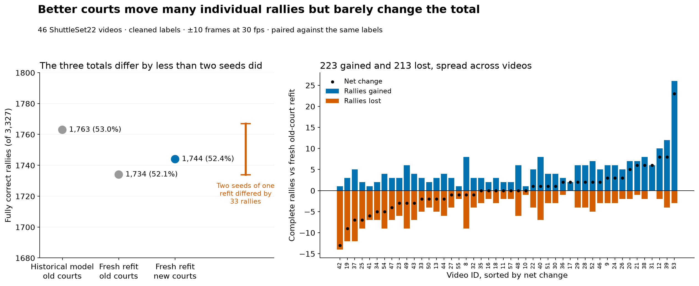

Better courts move hundreds of individual rallies but leave the total where it was. Against the fresh old-court refit, the new model gains 223 complete rallies and loses 213. Video 53 accounts for 26 of the gains; most other videos move by a few rallies each way.

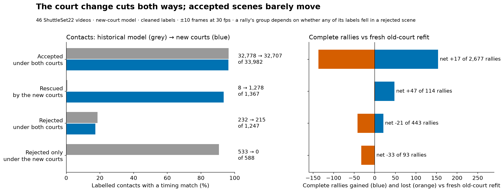

The court change works in both directions. Grouping each rally by the court decision at its labelled hits shows where the gains and losses come from:

| Court decision at the rally's labelled hits | Rallies | Gained | Lost |
|---|---:|---:|---:|
| Accepted under both courts | 2,677 | 154 | 137 |
| Rescued by the new courts | 114 | **48** | 1 |
| Rejected under both courts | 443 | 21 | 42 |
| Rejected only under the new courts | 93 | 0 | **33** |

Rescued scenes gain what the earlier report expected: 1,278 of their 1,367 labelled hits now match, up from eight. But the new detector also rejects some scenes the old one accepted. Their 588 labelled hits went from 533 matches to none.

Where both versions accepted the scene, the more accurate outline changed little. Matched hits went from 32,778 to 32,707, and rally gains and losses roughly cancel. That churn is about the size of the 170 rallies lost when the old-court model was simply refitted.

So the flat total is not one effect. Rescued scenes add 47 rallies and new rejections remove 33. The other two groups move by about 20 each, in opposite directions. The [court comparison](court_comparison.md) gives the full breakdown.

## How much does it vary between videos?

A fully correct rally fits in one clip: every labelled hit matched once, the right players, and no extra hits.

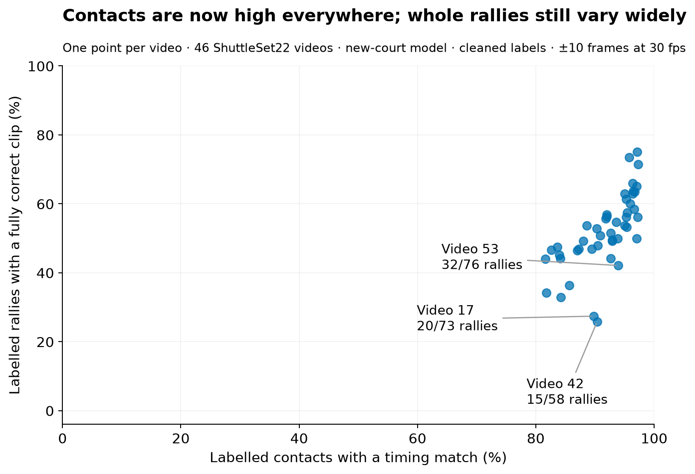

Every video now matches at least 81.6% of its labelled hits; the earlier low was 20.8% in video 53. Whole-rally success still varies widely, from 25.9% in video 42 to 75.0% in video 18.

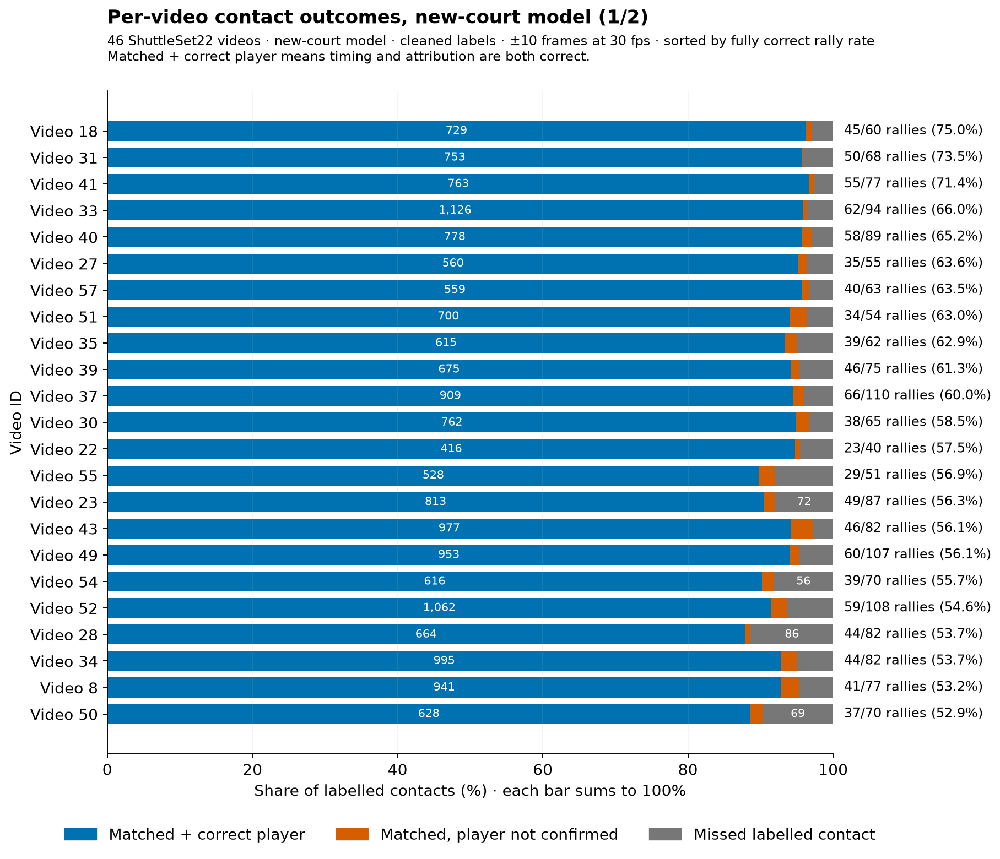

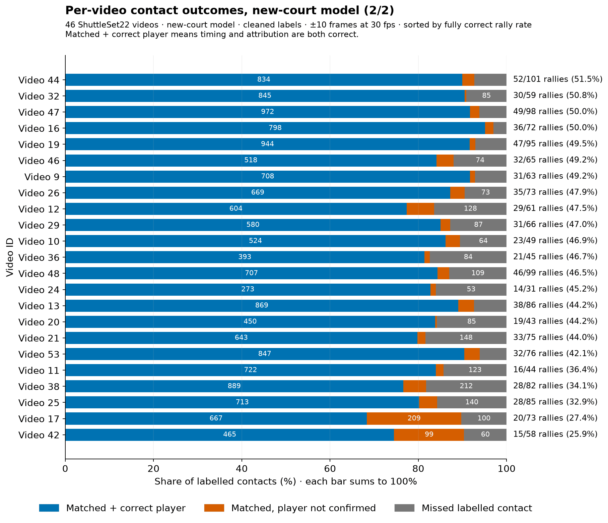

The bars count labelled hits. The scores alongside count fully correct rallies. Videos 17 and 42 have many wrong-player matches; video 53 now looks ordinary on hits. Extra predictions and each video's old-versus-new court result are in the [interactive video breakdown](VIDEO_BREAKDOWN.html), which also shows player confusion and input conditions. Open it locally to explore each video.

## Does every rally get a complete clip?

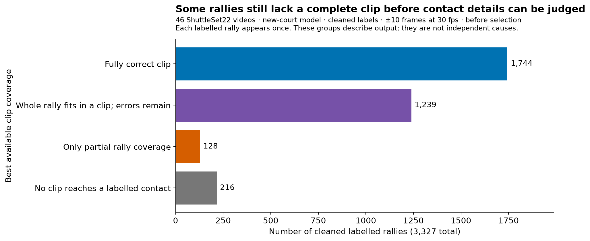

Even before selection, some rallies are only partly reached or missed entirely. **216 rallies** still have no labelled contact reached by a clip; the earlier model left 225.

## What does selection leave behind?

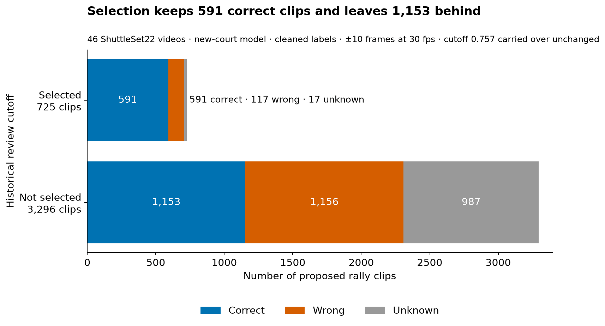

Selection makes the review queue cleaner, but discards many correct clips too. It keeps 591 of the 1,744 correct clips (33.9%); the earlier model kept 616 of 1,763. The cutoff is the historical value, carried over unchanged to the new confidence model.

## What kinds of errors occur together?

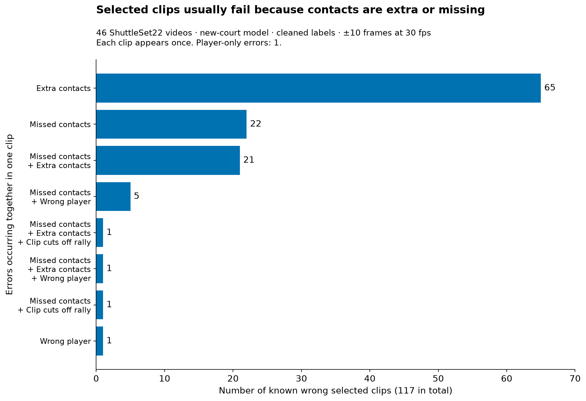

Extra hits dominate. Of the 117 wrong selected clips, 88 have an extra contact and 51 a missed one; 65 fail on extras alone. One clip fails only because of a player error.

The wrong clips contain 103 extra events, and 65 of them come after the final label. Separate [footage checks](video_checks.md#extra-hit-after-the-last-label) found no real hit at any of 16 sampled extras after a rally's last label: the shuttle had landed or the rally was over. Missed events are spread across serves (21), middle contacts (21) and final contacts (27).

## Are hits mistimed, or missing?

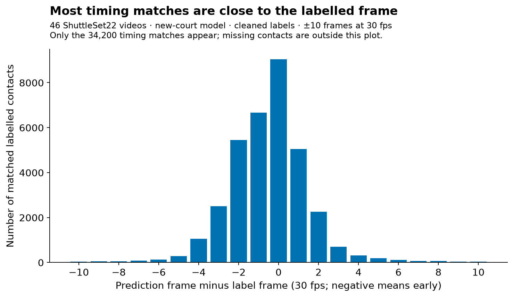

**98.0% of matches are within five frames**, as before. The 2,984 missing contacts are outside this plot.

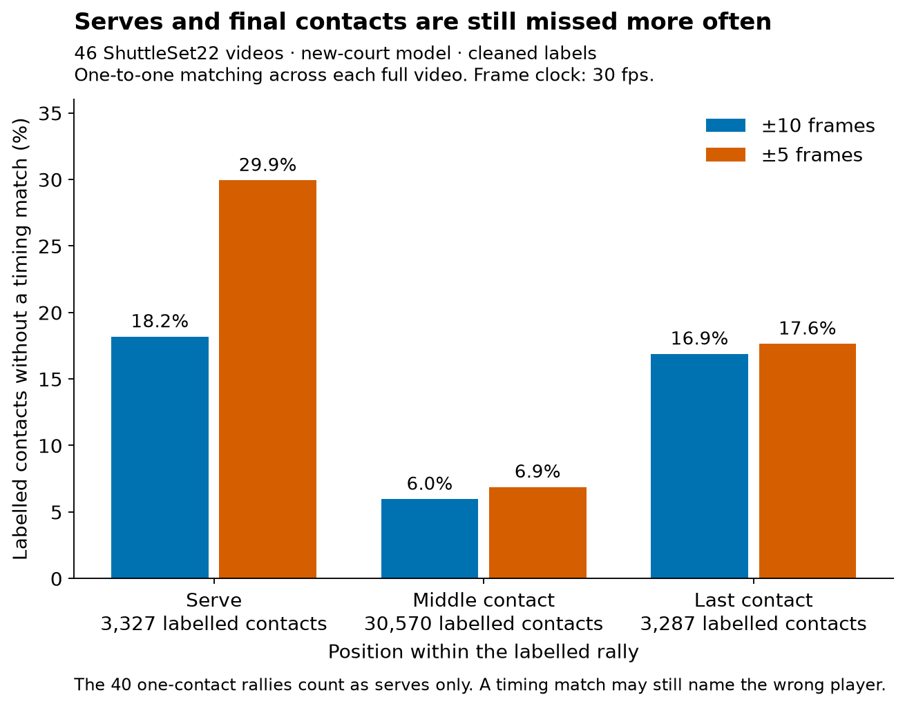

Starts and finishes are still harder. In court-accepted scenes the new model misses **10.4%** of serves, **2.4%** of middle contacts and **11.4%** of final contacts; the earlier model missed 9.0%, 2.3% and 11.2%. Serve timing matches fell overall, from 2,766 to 2,722. Serve timing is also loose: at ±5 frames, 29.9% of serves miss.

## What inputs were available?

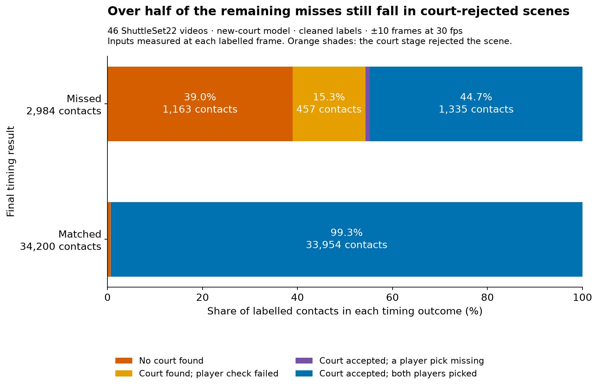

Of 2,984 misses, **1,620 (54.3%)** still fall in court-rejected scenes. In 1,163 the detector found no usable court; in 457 it found one but the two-player check failed. Only 29 misses have a missing player pick, and 1,335 have both players available. The earlier figures were 2,374 (65.3%) rejected, 96 missing a pick and 1,163 with both players.

Most of that drop is video 53. Outside it, rejected-scene misses barely moved: 1,602 now against 1,640 before.

The rejected scenes are not brief cutaways. These misses sit in 339 scenes across 45 videos, and 91% of them are in scenes longer than ten seconds. For 1,499 of them no candidate was scored within ten frames, so no later model could have chosen them.

These are input states within each outcome group. For miss rates among contacts with each kind of input, see the [input-state table](evaluation_tables.md#where-misses-occur).

## Do the labels agree with the footage?

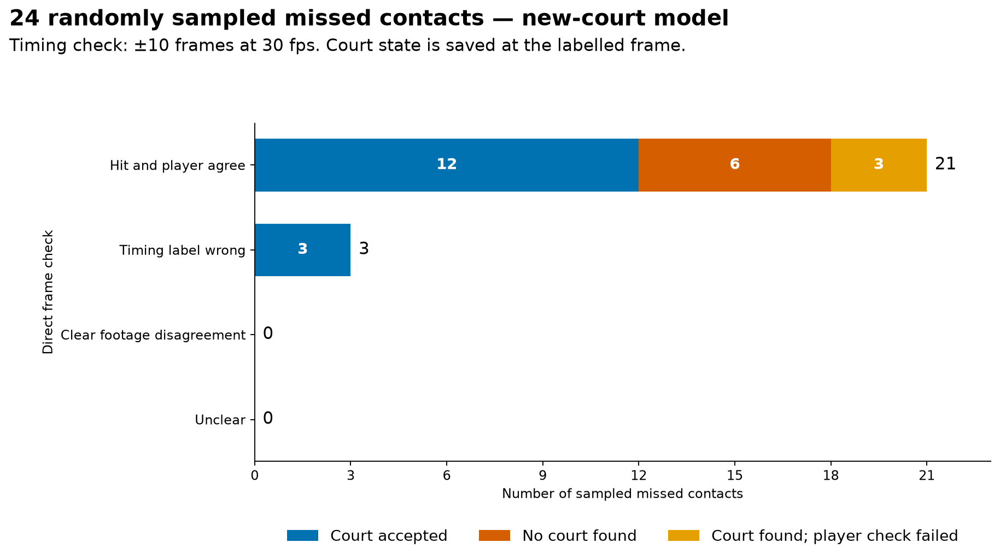

**The labels hold up.** Of 24 randomly sampled misses, 21 show the labelled player hitting at the labelled time. The other three are label timing errors, two of them in video 12. All nine misses in rejected scenes show ordinary play with the labelled hit. There is no second video 15: every game of every video matches at least 72.9% of its labelled hits, while video 15 matched 16% in the earlier run.

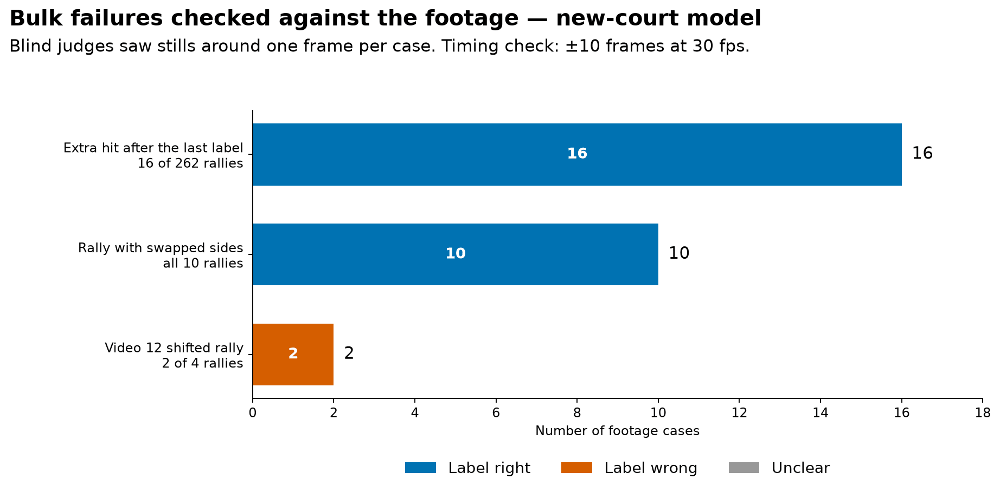

The largest failure groups were checked the same way, by judges who did not know which frames came from labels.

- **Extra hit after the last label:** 233 rallies fail on this alone. In 16 of 16 sampled, the shuttle lands untouched or is handled after the rally. The official rows record the same endings. These hits are the model's errors.
- **Swapped sides:** in 10 of 10 rallies checked, the labelled player hits. These are model side errors too.
- **Video 12:** four rallies have official timestamps about 15 frames off the visible hits. They hold 101 of its 128 misses. Setting them aside moves fully correct rallies from 52.4% to 52.5%.

The cleaned labels copy the official ShuttleSet22 rows unchanged, so any label error comes from the official files. [Label and video checks](video_checks.md) give the detail.

## Are the court failures fixed?

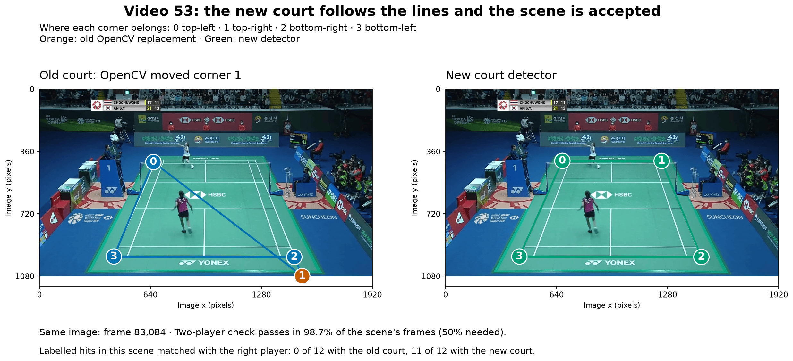

Both regression cases from the earlier investigation pass. Video 53's checked scene is accepted, and 11 of its 12 labelled hits now match with the right player, up from none. Video 53 as a whole rises from 7 to 32 complete rallies.

In video 17 the far player is picked again at both checked frames. Its player errors persist, though: 208 of its 209 wrong-side matches sit in one scene record covering its first 40 minutes. [Court checks](court_checks.md) has the details.

## What useful output is left for review?

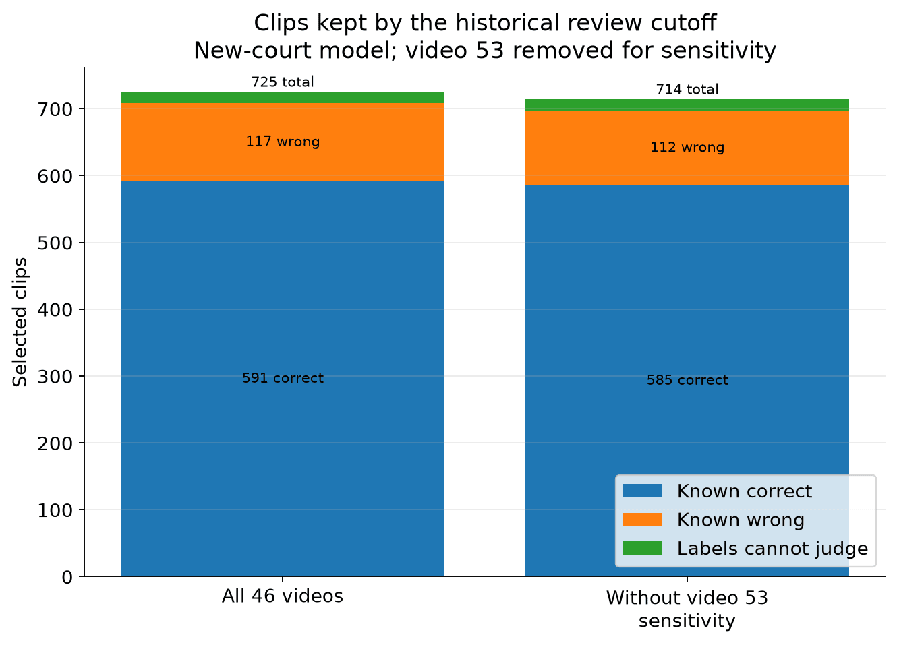

The 46-video queue is **83.5% correct among its 708 judgeable clips**; the earlier queue was 84.4% of 730. Another 17 clips remain unjudgeable. These clips still need review before use as ground truth.

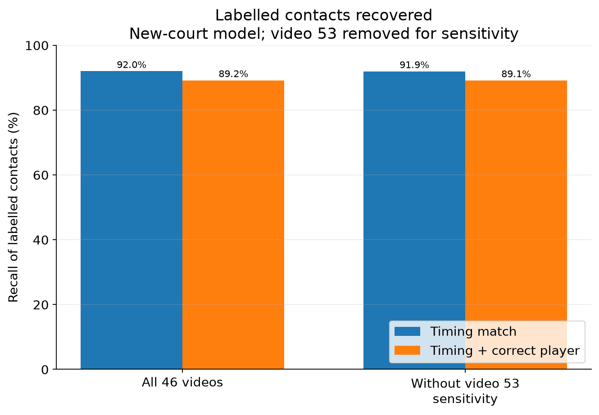

Removing video 53 now barely changes the rates. Its court failure no longer drags the totals down.

## What about original ShuttleSet?

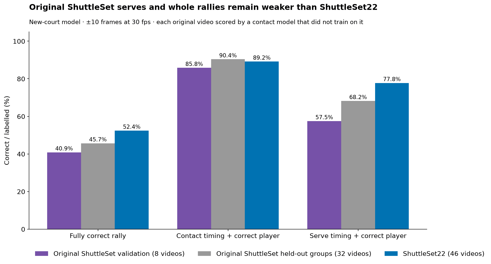

Original ShuttleSet still trails ShuttleSet22 on serves and whole rallies. On the 32 development videos, each scored while its group was left out of contact-model training, the new model gets **1,229 of 2,691 rallies** fully correct (45.7%); the earlier recount gave 1,209. The eight validation videos are weaker again at 273 of 668 (40.9%), mostly through serves: only 384 of 668 have the right timing and player.

## What next?

- **Stop the model adding a hit after the rally ends.** 233 rallies, 14.7% of the failed ones, fail only on one extra hit 10–60 frames after the last label. No sampled case shows a real hit there, and the official rows record the rally as over. The contact model scores it highly, and the landing search starts only after it. Start by dropping a final hit that the shuttle guard flags: that would rescue 110 of these rallies for 12 broken.
- **Fix where the court detector looks for players.** It checks only the three seconds around each scene's middle frame. In 145 rejected scenes that window falls mostly between rallies: 888 missed hits. Another 286 sit in scenes where it accepted a court far larger than the frame.
- **Fix video 42's net position, then revisit side errors.** Video 42 takes its net position from a broken court. Most other side errors follow from missed hits, because sides alternate within a rally.
- **Then inspect serves.** Their timing matches fell from 2,766 to 2,722, and their timing is the loosest.

The optional nomination veto was tested on the new courts and not adopted. The [completed experiments](last_followups.md) record that test. The [backlog](promising_leads.md) gives the follow-up checks in more detail.

## Details and evidence

| To inspect… | Read… |
|---|---|
| Exact counts, error tables and scoring definitions | [Evaluation numbers](evaluation_tables.md) |
| Where old and new courts gain and lose rallies | [Court comparison](court_comparison.md) |
| Whether the earlier court failures are fixed, and where rejections remain | [Court checks](court_checks.md) |
| Whether the labels agree with the footage | [Label and video checks](video_checks.md) |
| Why the failures happen in the code | [Detector audit](detector_audit.md) |
| Whether the shuttle guard marks the false final hits | [Shuttle guard addendum](shuttle_guard_addendum.md) |
| Saved files, scripts and rerun commands | [Methods and reproduction](evaluation_reproduction.md) |

These results describe previously examined footage. The sampled checks establish particular label and pipeline failures; they are not collection-wide rates.
