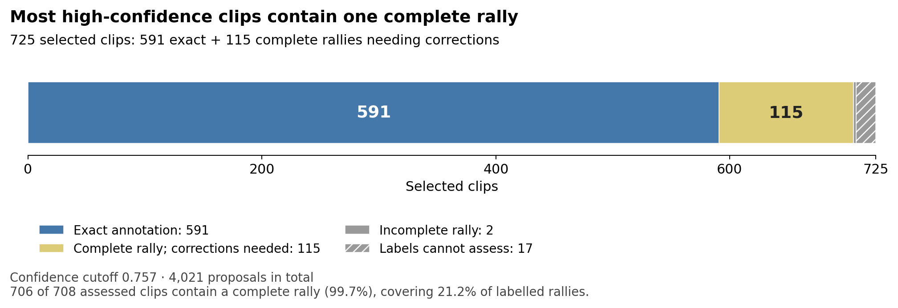
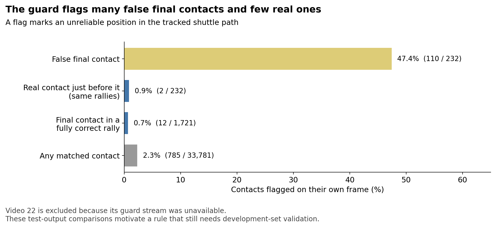

# Badminton annotator: practical value, court improvements and next steps

The annotator turns badminton video into rally clips, with a time and player assigned to each racket–shuttle contact. The aim is to reduce the work needed to build a labelled dataset. This report evaluates the annotator after replacing its court detector and examines the errors that remain.

**The annotator already provides a useful starting point for building a labelled dataset.** It finds more than nine in ten labelled contacts and produces fully correct annotations for just over half the labelled rallies. Confidence filtering selects a smaller set for review: almost every selected clip that can be assessed contains exactly one complete rally, and more than four in five have fully correct annotations. These complete-rally clips cover about a fifth of the labelled rallies.

**Better court detection makes more of the play available to annotate.** The new detector reduces missed contacts by 18.4%. Its net gain of ten fully correct rallies is modest, but that total conceals substantial recoveries and losses as court acceptance changes. The remaining errors suggest several specific fixes using information the pipeline already has. Other errors, particularly missed serves and contacts within accepted scenes, need further investigation before a suitable fix is clear.

*Left: contact accuracy across all output. Right: the quality and coverage of confidence-selected rally clips. The panels measure different units—individual contacts and whole rally clips—so their scores describe complementary aspects of usefulness.*

**In this report:** [How it works](#how-the-annotator-works) · [Evaluation](#what-the-evaluation-measures) · [Performance](#current-performance) · [Selected clips](#what-the-high-confidence-clips-provide) · [Court change](#what-the-new-court-detector-changed) · [Video variation](#how-much-does-it-vary-between-videos) · [Errors](#why-annotations-still-fail) · [Label checks](#how-much-of-the-error-comes-from-the-labels) · [Next steps](#recommended-follow-up-work)

## How the annotator works

A **contact** is the moment a racket hits the shuttle, including the serve. The annotated player is **near** or **far**, according to their half of the court relative to the camera. These labels describe court position, rather than a player's identity across changes of ends or camera view.

The annotator processes a video in four steps:

1. **Find usable court views.** The court stage works on video segments called scenes. It estimates the court outline and checks whether two players are on court. Accepted scenes proceed to player tracking and contact search.
2. **Build contact sequences.** The contact model scores possible contacts. A sequence model compares candidate rally sequences and can repair a missing serve or add one later contact. Near/far assignments alternate through the chosen sequence.
3. **Set the clip boundaries.** The annotator adjusts the start and end of each proposed rally clip around the chosen contacts.
4. **Rank the clips.** A separate confidence model estimates which completed annotations are most likely to be correct. The confidence score determines which clips are selected for review.

The court change kept this design and retrained its decision-tree models using the new court outputs. The [development history](last_followups.md#how-the-annotator-was-built) records how the earlier contact and sequence repairs were introduced.

## What the evaluation measures

The main evaluation uses ShuttleSet22, a dataset of badminton videos with contact and rally labels. It covers **46 videos, 3,327 rallies and 37,184 contacts**. Cleaning removes whole rallies with flawed label rows; it preserves every contact in each retained rally. Video 15 is excluded because its labels refer to the wrong rallies.

A predicted contact matches a label when their times differ by at most **10 frames on a 30 fps clock**, about one-third of a second. Matching is one to one: a prediction cannot satisfy two labels.

A rally is **fully correct** only if:

- its clip contains exactly one complete labelled rally;
- every labelled contact has a matching prediction;
- there are no extra predicted contacts; and
- every matched contact has the correct near/far player.

This is an all-or-nothing measure. One extra contact can fail a rally whose remaining annotation is correct.

The results below describe these evaluation videos. The later error investigations revisit the same outputs, so rules suggested by those investigations need separate validation before their gains can be treated as evidence of performance on new videos.

## Current performance

The annotator recovers **34,200 of 37,184 labelled contacts (92.0%)**. Of those labels, **33,156 (89.2%)** are recovered with the correct player as well. At the rally level, **1,744 of 3,327 labelled rallies have a fully correct annotation (52.4%)**.

Contact recovery alone does not count false predictions. **Precision** measures the share of predicted contacts that match labels; **recall** measures the share of labels recovered. F1 combines precision and recall into one score.

| Contact measure | Precision | Recall | F1 |
|---|---:|---:|---:|
| Correct timing | 85.0% | 92.0% | 88.3% |
| Correct timing and player | 82.4% | 89.2% | 85.6% |

The fully correct rally score sets a demanding standard: every contact and player must be right. The output also includes many whole-rally clips whose annotations need correction. The following table separates those useful starting points from rallies that the clips cover only partly or miss altogether:

| Best available output before confidence selection | Labelled rallies |
|---|---:|
| Fully correct annotation | 1,744 |
| Whole rally fits in a clip, but annotation errors remain | 1,239 |
| Clips cover only part of the rally | 128 |
| No clip includes a labelled contact | 216 |
| **Total** | **3,327** |

A whole-rally clip can still include extra contacts or a neighbouring rally, so it needs checking before use. The practical question is how to select the most useful clips from this output. The confidence filter provides a smaller set where both the clip boundaries and annotations are more likely to be correct.

## What the high-confidence clips provide

**Confidence filtering produces a reliable set of complete-rally clips for a person to check.** Most already have fully correct annotations. For the others, review usually means correcting contacts or player labels within a clip that already contains the right rally.

At the confidence cutoff of **0.757**, carried over from the historical model, the annotator selects **725 of its 4,021 proposed clips**. The cleaned labels can assess 708 of them; the other 17 overlap no retained labels.

*The figure separates clip completeness from annotation correctness: both the blue and sand groups contain one complete rally, but the sand group needs annotation corrections.*

| Use of the selected output | Successful clips among the 708 assessed | Coverage of the 3,327 labelled rallies |
|---|---:|---:|
| **Fully correct annotation:** every contact and player correct, with no manual correction needed | **591 / 708 (83.5%)** | **591 / 3,327 (17.8%)** |
| **Complete rally clip for review:** exactly one complete rally, with annotation corrections allowed | **706 / 708 (99.7%)** | **706 / 3,327 (21.2%)** |

Of the 117 assessed clips with incorrect annotations, **115 already contain the right complete rally**. Only two cut off part of the rally. Even if the 17 unassessed clips receive no credit, **706 of all 725 selected clips (97.4%)** are confirmed complete-rally clips. This makes the selected output a promising starting point for manual annotation. Review remains necessary: accepting every selected annotation as ground truth would retain the errors in those 117 clips.

The errors within selected clips are mainly extra or missing contacts:

The trade-off is coverage. The strict cutoff keeps **591 of the 1,744 available fully correct annotations (33.9%)**, leaving **1,153 correct clips outside the selected set**. The annotator therefore produces considerably more useful output than this selection captures. A less selective cutoff would offer more clips to review, with their quality needing to be measured.

The evaluation measures correctness and coverage. The time saved by reviewing and correcting these clips has not been measured. The [evaluation tables](evaluation_tables.md#selected-review-queue) give the full selection counts.

## What the new court detector changed

**The new court detector reduces missed contacts by nearly a fifth, with almost unchanged contact precision.** Court acceptance determines which scenes proceed to tracking and contact search, so improving it can restore play that later stages would otherwise have little opportunity to annotate.

The main comparison uses two versions of the annotator trained with the same fitting code and software environment:

- **Old-court refit:** trained again using the old court detector's outputs.
- **New-court annotator:** trained using the new detector's outputs; this is the system evaluated above.

The new court inputs recover **671 additional contacts**, with almost unchanged precision:

| Measure, ±10 frames | Old-court refit | New-court annotator |
|---|---:|---:|
| Matched contacts / 37,184 | 33,529 | **34,200** |
| Contact recall | 90.17% | **91.98%** |
| Contact precision | 85.04% | 84.98% |
| Contact F1 | 87.53% | **88.34%** |
| Fully correct rallies / 3,327 | 1,734 (52.1%) | **1,744 (52.4%)** |

Missed contacts fall from **3,655 to 2,984**, an **18.4% reduction**. The stable precision means the additional recovery comes with little change in the proportion of predictions that are correct.

### Why fully correct rallies increase by only ten

The ten additional fully correct rallies combine substantial gains and losses: **223 rallies become correct and 213 stop being correct**.

Newly accepted play supplies the largest net gain, but newly rejected play cancels much of it. Even where both detectors accept the scene, many rallies change correctness. Also, recovering contacts only makes a rally fully correct if every other contact, player assignment and clip boundary passes the evaluation. The rally total therefore captures the final outcome, while the contact results show progress within rallies that may still need correction.

The ten-rally gain also needs to be read alongside training variation. Two runs of one refit setup with different random seeds differed by 33 complete rallies. The stronger result here is the improvement in contact recovery, supported by the court-decision breakdown. The small overall rally difference alone gives little evidence of a reliable improvement in complete annotations.

### Why recovering previously rejected play matters

The effect is clearest where the new detector accepts play that the old court stage rejected. The new annotator recovers **1,278 of the 1,367 contacts in those scenes**. An older saved version, the **historical model**, recovered only eight. This diagnostic uses that older model because its individual contact matches were saved; it is separate from the two-refit comparison above.

The change gives contact detection access to substantial amounts of previously excluded play. It also introduces losses: newly rejected scenes contain **588 labelled contacts, all now missed**, of which the historical model matched 533. The remaining challenge is to retain the recovered play while reducing rejection of other usable scenes.

*Read the panels as separate comparisons. Left: contact recovery against the historical model. Right: fully correct rally gains and losses against the old-court refit. Newly accepted play contributes strongly in both comparisons, while new rejections offset part of the benefit.*

**The court improvement matters because it restores opportunities to annotate real play.** Turning those recovered contacts into more fully correct rallies also requires reliable scene acceptance and fewer errors in later stages. [Court comparison](court_comparison.md) records both baselines and the exact gains and losses.

## How much does it vary between videos?

Every video recovers at least **81.6% of its labelled contacts**. Fully correct annotations vary much more: from **25.9% of rallies in video 42 to 75.0% in video 18**. The median video has 92.8% contact recovery and 52.2% fully correct rallies.

Video 53 gives a concrete example of the court improvement: its contact recovery rises from 20.8% in the historical model to within the range of the other videos. Its fully correct rally rate remains below the median, showing that recovering play is an important first step with further annotation errors still to address. Videos 17 and 42 also recover most contacts but lose many correct player assignments.

Detailed contact and rally outcomes for all 46 videos

The next two plots separate those outcomes for every video. **Each bar shows percentages of labelled contacts**, split into correct timing and player, correct timing without a confirmed correct player, and misses. Counts are printed inside larger segments. **The figures on the right describe fully correct rallies**, which require every contact and player in the rally to be correct.

These differences help explain why one overall score cannot identify the next fix. Videos 17 and 42 need player-assignment investigation; videos 11, 21, 25 and 38 lose many contacts to court rejection. The [interactive video breakdown](VIDEO_BREAKDOWN.html) adds extra predictions, input conditions and old-versus-new court results for each video. It can be opened locally.

### Results on original ShuttleSet

A separate evaluation uses the earlier **original ShuttleSet** dataset. On its 32 development videos, the annotator gets **1,229 of 2,691 rallies fully correct (45.7%)**. Each video is scored with a contact model trained while its group was held out. The eight validation videos are scored with a contact model trained on the other 32; they yield **273 of 668 fully correct rallies (40.9%)**.

Both groups score below ShuttleSet22 on complete rallies. Serves are especially weak: only **384 of 668 validation serves (57.5%)** have the correct timing and player. Original ShuttleSet also has known first-contact label problems, so these serve errors need footage checks before being attributed entirely to the annotator. The [evaluation tables](evaluation_tables.md#original-shuttleset) give the full comparison.

## Why annotations still fail

**Several remaining errors point to specific changes worth testing.** Court sampling and false final contacts are the clearest examples. Missed contacts within accepted play and some player-assignment errors still need a firmer diagnosis. The evidence so far does not establish how much of that remaining error can be eliminated.

The following diagnosis uses the 46 ShuttleSet22 videos and follows the processing order: court acceptance, contact selection, then player assignment. The causes overlap, so their counts should not be added together.

### Court rejection blocks more than half the missed contacts

Of the **2,984 missed contacts**, **1,620 (54.3%)** lie in scenes rejected by the court stage. For 1,499 of those misses, no contact candidate was scored within the matching window. Later sequence selection has no candidate available to recover those contacts.

The code audit identifies two substantial groups:

- **888 misses occur in scenes dropped before court search.** The detector checks players in a three-second window around each scene's midpoint. In these rejected scenes, that window usually falls between labelled rallies. Sampling active play or several windows could preserve the player checks while making the search less dependent on one moment.
- **286 misses occur after an oversized court passes detection but fails the two-player vote.** The vote requires exactly two people inside the court in at least half the scene's frames. An oversized outline can include officials or spectators; the saved evidence makes this a likely explanation, although the required pose arrays were unavailable to confirm it.

The new detector fixes the two previously checked geometry failures in videos 53 and 17. Coverage remains a wider problem: outside video 53, court-rejected misses number 1,602, compared with 1,640 in the historical model. [Court checks](court_checks.md) and the [detector audit](detector_audit.md#the-court-stage) give the scene-level evidence.

### An extra contact after play ends spoils 233 otherwise-correct rallies

In **233 rallies**, the annotator matches every labelled contact with the correct player, then adds one extra contact after play ends. That single error accounts for **14.7% of the 1,583 failed rallies**.

All 16 sampled cases show no real contact at the added time. The shuttle has landed, fallen off the net, or is being handled after the rally. The contact model nevertheless scores the false contact at least 0.9 in 231 of the 233 rallies. The sequence model keeps it. Landing detection starts after the last chosen contact, so it cannot use the earlier landing to correct that choice.

The existing **shuttle guard** offers a possible way to detect some of these errors. It flags unreliable positions in the shuttle track, including positions filled in when the tracker loses the shuttle.

The guard flags **110 of the 232 checkable false final contacts (47.4%)**. In those same rallies it flags only two preceding real contacts. It also flags **12 of 1,721 final contacts in fully correct rallies (0.7%)**.

A simulation on saved outputs removes the last predicted contact when its frame is flagged. It rescues 110 rallies and breaks 12, increasing the fully correct total from 1,744 to **1,842 (55.4%)**. This makes the guard a promising next experiment: a small change could turn some nearly correct annotations into fully correct ones. The gain remains exploratory because the rule was found using these test outputs. Development videos, used to assess proposed changes before a final evaluation, are the next place to check it. [Shuttle guard analysis](shuttle_guard_addendum.md) records the simulation and its limits.

### Serves and final contacts remain harder to recover

Even when the court is accepted and both players are available, **1,335 labelled contacts are missed**. Their causes still need to be separated through direct checks of footage, candidate contacts and sequence choices.

Across all court-accepted frames, serves and final contacts are missed much more often than contacts in the middle of a rally:

The plot includes all accepted frames, including the small group with a missing player. Among contacts that match at the main ±10-frame allowance, **98.0% are within five frames** of the label. Most matched contacts therefore have fairly precise timing.

The stricter allowance still matters for complete annotations: at **±5 frames**, fully correct rallies fall from **52.4% to 41.9%**. A rally must pass at every contact. Serves are particularly sensitive: across all scenes, 29.9% lack a match within five frames. The remaining contact work includes both finding missed contacts and improving timing at rally starts. The [evaluation tables](evaluation_tables.md#rally-position) give the position and timing breakdowns.

### A missed contact can also cause a run of wrong player labels

The annotator assigns near/far players in an alternating sequence. When it misses a contact in the middle of a rally, the contacts on either side of the gap require opposite alternating patterns. Whichever pattern it chooses, one part of the rally can have the wrong player labels.

Of **1,043 wrong or missing player assignments among timing matches**, **837 occur in rallies with a missed interior contact**. In a separate group of 117 rallies with exactly one miss, no extras and a player error, 115 have every contact on one side of the gap assigned incorrectly. These rallies already fail the complete-annotation check because of the miss, but their incorrect player labels would also matter if partly correct annotations were used downstream.

Two videos warrant separate geometry checks. Video 42 uses a net position taken from a badly distorted court. Video 17 concentrates 208 of its 209 player errors in one scene lasting about 40 minutes. The [detector audit](detector_audit.md#wrong-sides) explains both cases and the evidence still needed for video 17.

## How much of the error comes from the labels?

The footage checks support the main error diagnosis. In a random sample of **24 missed contacts**, 21 show the labelled player hitting at the labelled time. The other three have timing errors. All nine sampled contacts in rejected scenes show ordinary live play and the labelled contact.

The targeted checks also support the labels: all 16 sampled extra contacts are false, and all ten sampled cases of swapped players outside video 12 show the labelled player hitting. These are small samples; their role is to check the proposed explanations for the errors.

The largest retained label problem is four video 12 rallies with timestamps shifted by about 15 frames. They account for 101 missed contacts. Excluding those rallies changes the fully correct rate only from **52.4% to 52.5%**. [Label and video checks](video_checks.md) documents the samples, their limits and the separate reason for excluding video 15.

## Recommended follow-up work

**The next step is to build on the annotator's useful output by addressing a few well-defined failures.** The shuttle guard and court-sampling changes can be tested using signals already available in the pipeline. Geometry errors and missed contacts need further investigation before their remedies are clear.

The proposed order is:

1. **Test removal of a flagged final contact on development videos.** Count both rescued rallies and real final contacts incorrectly removed. Check any changes to landing detection and downstream outputs.
2. **Improve court sampling and reject implausibly large outlines.** Try player checks during active play or across several windows. Inspect newly accepted scenes as well as aggregate scores.
3. **Check player geometry in videos 42 and 17.** Compare a trustworthy net position in video 42 and inspect camera views across video 17's long scene.
4. **Sample missed serves and other contacts in accepted scenes.** Separate label errors, absent candidates and poor sequence choices before choosing a model change. Serves are a distinct part of this work because they have both recovery and timing problems.

The distinction is between errors with a concrete fix to test and errors whose cause remains uncertain. This evaluation does not identify an unavoidable level of error. Some apparent misses require label corrections rather than annotator changes; other cases may require changes to contact detection or sequence selection. The checks above should establish which changes offer worthwhile gains.

The current result already supports a practical use: selecting complete-rally clips with largely correct annotations for review. Better court detection has extended contact recovery into previously excluded play. The next experiments can test how much more of that recovered play can become fully correct annotations, while preserving the useful output already available.

[Next investigations](promising_leads.md) gives the evidence and proposed checks for each priority. [Completed experiments](last_followups.md) records earlier trials.

## Supporting documents

| Document | Purpose |
|---|---|
| [Court comparison](court_comparison.md) | Baselines, contact gains and rally gains/losses |
| [Court checks](court_checks.md) | Corrected geometry cases and remaining scene rejections |
| [Detector audit](detector_audit.md) | Code paths behind court, final-contact and player errors |
| [Shuttle guard analysis](shuttle_guard_addendum.md) | Flag comparisons and the exploratory deletion rule |
| [Label and video checks](video_checks.md) | Footage evidence and label problems |
| [Evaluation tables](evaluation_tables.md) | Exact counts, definitions and additional breakdowns |
| [Methods and reproduction](evaluation_reproduction.md) | Saved evidence, commands and required local inputs |
