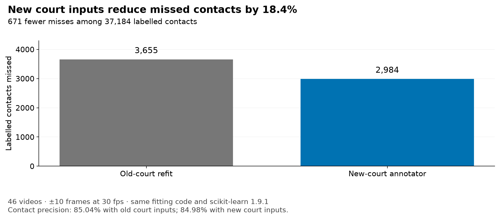
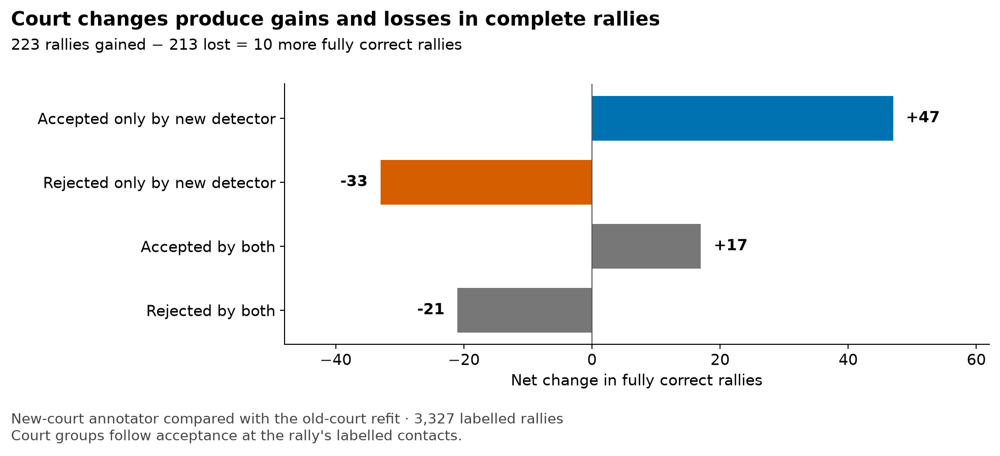

# Court comparison: more contacts recovered, little net change in complete rallies

The new court inputs recover **671 additional labelled contacts** compared with an annotator refitted on the old court outputs. Contact recall rises from **90.17% to 91.98%**, with almost unchanged precision. Fully correct rallies rise by only ten because gains in newly accepted play are partly offset by newly rejected scenes.

This comparison uses the same 46 videos, 3,327 rallies and 37,184 contact labels. A fully correct rally contains every labelled contact, no extras and the correct player assignments within one complete rally clip.

**Contents**

- [What is being compared](#what-is-being-compared)
- [Where the court decision changed](#where-the-court-decision-changed)
- [Why the whole-rally total moves by only ten](#why-the-whole-rally-total-moves-by-only-ten)
- [Overall contact and rally scores](#overall-contact-and-rally-scores)
- [Which videos moved](#which-videos-moved)
- [What remains after the court change](#what-remains-after-the-court-change)
- [Player assignment](#player-assignment)
- [Evidence](#evidence)

## What is being compared

Three saved outputs are scored against the same labels:

- **historical model** — old courts, fitted with scikit-learn 1.6.1; this is the output scored by the earlier investigation;
- **old-court refit** — old court detector outputs, refitted with the current annotator code and scikit-learn 1.9.1;
- **new-court annotator** — the evaluated system, fitted in the same environment as the old-court refit using the new court outputs.

Use the **old-court refit** for the aggregate contact and rally comparison. It shares the new-court annotator's fitting code and environment. Use the **historical model** for the diagnostic of individual contact matches by court decision: it is the only old run whose per-label matches were saved.

Two refits with different random seeds differed by **33 complete rallies** ([refit regression](../reports/refit_regression.md)). The ten-rally overall gain is smaller than that observed training variation.

## Where the court decision changed

This diagnostic compares the **historical model** with the **new-court annotator**. Each contact label is grouped by whether its scene was accepted under the old and new court stages:

| Court decision at the labelled frame | Labels | Historical matches | New matches |
|---|---:|---:|---:|
| Accepted under both courts | 33,982 | 32,778 | 32,707 |
| **Rescued: rejected old, accepted new** | **1,367** | **8** | **1,278** |
| Rejected under both courts | 1,247 | 232 | 215 |
| Newly rejected: accepted old, rejected new | 588 | 533 | **0** |
| **Total** | **37,184** | **33,551** | **34,200** |

In newly accepted scenes, contact recovery rises from **0.6% to 93.5%**. This supports the explanation that court acceptance restores play to the downstream annotator, which then recovers most of its contacts.

The opposite group is equally informative. The 588 labels newly rejected by the new court stage fall from 533 matches to zero. Court acceptance can therefore restore contacts or prevent them from reaching detection.

Where both versions already accept the scene, matched hits barely change: 32,778 before and 32,707 now. This is consistent with court geometry having most value when the old geometry was bad enough to block the scene or lose a player.

The rescued labels are concentrated but not confined to one video: 717 are in video 53 and the remaining 650 are spread across 14 others. Newly rejected labels are spread across 33 videos.

## Why the whole-rally total moves by only ten

Against the old-court refit, 223 rallies become fully correct and 213 stop being fully correct.

| Court decision at the rally's labelled hits | Rallies | Gained | Lost | Net |
|---|---:|---:|---:|---:|
| **Rescued by the new courts** | 114 | **48** | 1 | **+47** |
| **Rejected only under the new courts** | 93 | 0 | **33** | **−33** |
| Accepted under both courts | 2,677 | 154 | 137 | +17 |
| Rejected under both courts | 443 | 21 | 42 | −21 |
| **Total** | **3,327** | **223** | **213** | **+10** |

The two groups where the court decision changes contribute **+14 net rallies**: +47 from rescued play and −33 from new rejections. The groups whose accept/reject status does not change contribute −4 net and contain the ordinary variation introduced by refitting and by changed downstream sequences.

The complete-rally metric is also stricter than contact recovery. One missed hit, one false extra hit or one wrong player fails the whole rally. The new court stage can therefore recover dozens of contacts in a rally population without making the rally fully correct if a separate downstream error remains.

## Overall contact and rally scores

| Measure, ±10 frames | Historical model | Old-court refit | New custom court inputs |
|---|---:|---:|---:|
| Fully correct rallies / 3,327 | 1,763 (53.0%) | 1,734 (52.1%) | **1,744 (52.4%)** |
| Matched contacts / 37,184 | 33,551 (90.2%) | 33,529 (90.2%) | **34,200 (92.0%)** |
| Predicted contacts | — | 39,428 | 40,246 |
| Contact precision | — | **85.04%** | 84.98% |
| Contact recall | — | 90.17% | **91.98%** |
| Contact F1 | — | 87.53% | **88.34%** |

The new model recovers **671 more labels** than the fresh refit while adding 818 predictions. Precision is effectively unchanged, so the contact-level improvement is a recall gain rather than a precision trade-off.

The historical total is included for continuity with the saved diagnostics. The old-court refit is the comparator for the effect of changing court inputs.

At ±5 frames the new model gets 1,394 rallies fully correct. The historical 47-video result was 1,430, including excluded video 15.

## Which videos moved

| Video | Old-court refit | New custom court inputs | Gained / lost |
|---|---:|---:|---:|
| 53: earlier corrupted-court case | 9 | **32** | 26 / 3 |
| 12 | 21 | **29** | 10 / 2 |
| 39 | 38 | **46** | 12 / 4 |
| 17: earlier far-player case | 18 | **20** | 2 / 0 |
| 19 | **56** | 47 | 3 / 12 |
| 42: largest loss | **28** | 15 | 1 / 14 |

Video 53 has the largest rally gain in this comparison. Its earlier court outline blocked much of the play. [Court checks](court_checks.md#video-53-the-scene-is-accepted) shows the corrected outline and the separate historical contact comparison.

Video 42 shows why the global total needs diagnosis rather than a single verdict. Only 13 of its 60 missed contacts are in rejected scenes. Its losses are mostly missed hits and wrong sides. Some of those side errors come from its video-wide net position, which is taken from a broken accepted court. [Detector audit](detector_audit.md#video-42-takes-its-net-position-from-a-broken-court) traces that mechanism.

## What remains after the court change

The new model misses 2,984 labels, down from 3,633 in the historical output.

| State for missed labels | Historical misses | New misses |
|---|---:|---:|
| Court rejected | 2,374 | **1,620** |
| Court accepted; a player pick missing | 96 | **29** |
| Court accepted; both players picked | 1,163 | **1,335** |
| **Total** | **3,633** | **2,984** |

Court rejection falls sharply overall, but most of that improvement comes from video 53. Without it, rejected-scene misses are 1,602 now against 1,640 before. The remaining court problem is therefore coverage rather than the two old geometry regressions.

Misses within accepted scenes also need investigation. Rescued scenes introduce 89 misses into the accepted population, and scenes accepted by both versions contain 71 more misses than before. Across all accepted scenes, serves and final contacts remain much harder than middle contacts. These misses require contact-level investigation alongside the court-coverage work.

## Player assignment

The new model gets 33,156 of 34,199 known-side timing matches right (**96.9%**):

| Labelled side | Predicted far | Predicted near | No player |
|---|---:|---:|---:|
| Far | 16,468 | 373 | 5 |
| Near | 653 | 16,688 | 12 |

Most side errors are not independent player-recognition failures. The sequence assigns alternating sides, so one missed interior hit flips the required pattern after the gap. The [detector audit](detector_audit.md#wrong-sides) finds 837 of 1,043 wrong or missing sides in rallies with an interior miss.

Videos 17 and 42 have additional geometry-linked side problems. Video 17 contains 208 of its 209 wrong or missing sides in one 40-minute scene; video 42 derives its net position from a broken court. [Court checks](court_checks.md#video-17-the-far-player-is-back-but-sides-still-fail) and the [detector audit](detector_audit.md#video-42-takes-its-net-position-from-a-broken-court) give the details.

## Evidence

- `results/court_change_groups.json.gz` — label and rally groups by old and new court decision
- `results/summary.json.gz` — overall metrics and per-video court comparison
- `results/contexts.csv.gz` — new court and player state at each labelled frame
- `scratch/annotator_wrapup_evaluation/results/contexts.csv.gz` — historical court state at each labelled frame
- `experiments/annotator/good_court_refit/evidence/saved-stream-analysis.json.gz` — gained and lost rally IDs against both old models
- [model_selection.md](../reports/model_selection.md) — fresh-refit totals and per-video regressions

Commands and plot generation are recorded in [evaluation methods and reproduction](evaluation_reproduction.md).
