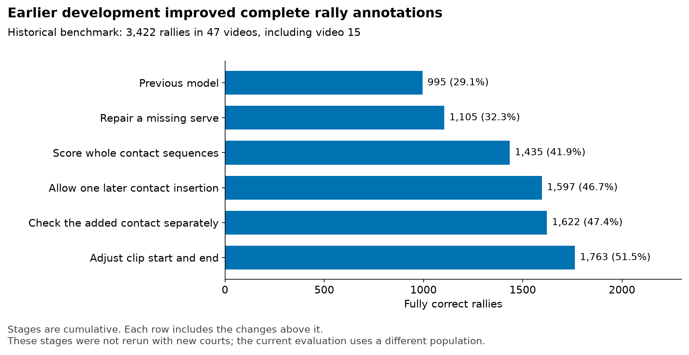

# Completed follow-up experiments

**The optional candidate veto remains disabled.** This rule rejects a possible contact when the shuttle track is flagged unreliable and no nearby player was selected. After refitting on the new courts, it loses four ShuttleSet22 rallies for a three-rally validation gain. The detector experiments rejected before the court change are in the [earlier follow-ups](../../../scratch/annotator_wrapup_evaluation/last_followups.md), and the old-court refit trials are in the [refit regression report](../reports/refit_regression.md). Remaining work is listed in [Next investigations](promising_leads.md).

**Contents**

[Nomination veto on the new courts](#nomination-veto-on-the-new-courts)  
[Earlier experiments](#earlier-experiments)\
[How the annotator was built](#how-the-annotator-was-built)

## Nomination veto on the new courts

The saved experiments call this candidate rule the **nomination veto**.

The veto rejects a possible hit when the shuttle track is flagged unreliable and no player was selected at any of five nearby samples (−10 to +10 frames at 30 fps). On the old courts it gained nine complete rallies and lost none. It was retested on the new courts with refitted sequence and review models.

| Measure | Base | Veto |
|---|---:|---:|
| Validation complete rallies / 668 | 273 | **276** |
| ShuttleSet22 complete rallies / 3,327 | **1,744** | 1,740 |
| ShuttleSet22 timing matches | **34,200** | 34,197 |
| ShuttleSet22 gained / lost against base | — | 44 / 48 |

Simply switching the rule on, without refitting, made validation worse: 270 complete rallies. Most of the validation side-assignment gain came from one video, `sset_31`.

The review ranking briefly favoured the veto, but the advantage faded as the queue grew:

| ShuttleSet22 clips reviewed | Base: correct / wrong / unjudgeable | Veto: correct / wrong / unjudgeable |
|---|---:|---:|
| 500 | 407 / 84 / 9 | 423 / 67 / 10 |
| 1,000 | 802 / 169 / 29 | 798 / 174 / 28 |
| 2,000 | 1,356 / 462 / 182 | 1,361 / 478 / 161 |

Of the 48 ShuttleSet22 rallies the veto lost, 27 miss their first labelled hit. The rule tends to damage rally starts, where serves are already weakest.

**Decision:** the nomination veto remains off. Its old-court gain did not carry over, and the new court geometry changes which players get nominated.

Evidence: `experiments/annotator/good_court_refit/evidence/test-base-vs-veto.json.gz`, `validation-base-vs-veto.json.gz`, `validation-base-vs-base_inference_veto.json.gz`  
Report: [model_selection.md](../reports/model_selection.md)

## Earlier experiments

- **Adjusting clip boundaries independently of contact selection:** two proposals changed, none became correct.
- **Training the sequence chooser against the adjusted clip boundaries:** a real target mismatch was corrected, but the broader run lost two complete rallies.
- **Repair with one edit:** 58 of 119 incorrect development clips could be repaired in hindsight. The trial did not justify another correction model.
- **Endpoint deletion:** “after the last label” is not a safe deletion rule.
- **Repairing video 15:** excluded instead.
- **Noise-aware training:** deferred until a small verified contact set exists.

The [earlier follow-ups](../../../scratch/annotator_wrapup_evaluation/last_followups.md) give the counts and evidence.

## How the annotator was built

The earlier development pass added a series of contact and sequence repairs. It first repaired likely missing serves, then scored complete candidate sequences. A later repair could insert one missing contact from the existing candidates when the sequence score improved by at least 0.05. The added contact was also checked independently. Finally, clip boundaries were adjusted around the chosen contacts.

These stages were evaluated on the earlier **3,422-rally, 47-video benchmark**, which included video 15. They were not rerun as separate stages with the new courts. The figure documents the design's development; its percentages cannot be compared directly with the current 46-video result.

The development pass trained decision-tree models to combine existing signals. It did not train a new tracking, pose or contact-vision network. The new-court refit keeps that architecture.
