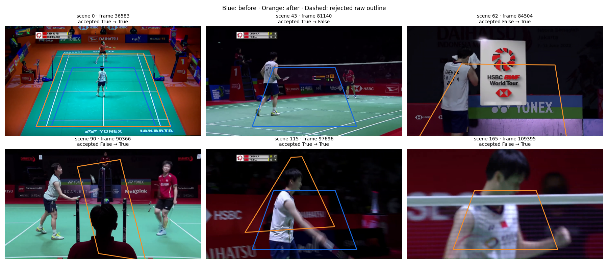
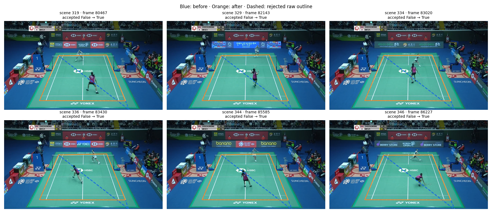

# Court geometry repair: evidence and reproduction

This bundle makes the [issue #148 results report](../../../docs/courtkeynet/fallback_evaluation/scene_geometry_repair.md)
checkable from saved outputs. It includes both sides of the comparison, the
geometry controls and the frozen contact model. No models were retrained or
tuned for these results.

Start with the saved-output checks below. They require no videos or GPU.
The [pipeline reproduction recipe](REPRODUCE.md) lists the larger inputs needed
to regenerate detections, annotations and model predictions.

## What is included

| Location | Contents and purpose |
| --- | --- |
| `evidence/video_17/`, `evidence/video_53/` | Baseline and final court evidence, contact/rally streams, run metadata and player-selection probes; `expected.json.gz` holds the reported scores |
| `evidence/controls/video_3/`, `evidence/controls/video_21/` | Same-frame old/new fallback outputs, neural predictions, painted-line measurements, ground-truth corners and expected geometry results |
| `evidence/labels/` | The saved clean contact/rally labels for ShuttleSet22 videos 17 and 53 |
| `models/` | Frozen contact model and its original fit/setting receipts; the other frozen selection models already live in the repository |
| `scripts/` | Saved-output checks and the cleaned experiment entry points |
| `figures/` | Two selected **prototype** contact sheets, explained below |

JSON and CSV records are gzip-compressed. Court corners use the recorded image
resolution; the geometry controls use 1280×720 reference pixels. Scene intervals
are half-open: the start frame is included and the end frame is excluded.

The baseline represents saved production evidence at `a111181`. Source changes
are recorded in `87f66e7` and `2b486d5`. The final pipeline records here come from
the completed runs after the replay-mask correction. Earlier failed integration
outputs are excluded from the numerical results.

## Check the saved results

Run from the repository root in its Python environment. The scripts reuse the
repository's existing scoring functions; install the project dependencies first.
The [CPU CI setup](../../../docs/ci.md) provides a suitable starting point for
these saved-output checks. The frozen-model rerun needs the older versions
listed separately in [REPRODUCE.md](REPRODUCE.md#inputs-and-environment).
They compare recomputed results with the supplied expected records and fail on
a mismatch.

```bash
export PYTHONPATH="$PWD/src:$PWD"
BUNDLE="$PWD/experiments/annotator/court_geometry_repair"
OUT="$(mktemp -d)"

for VIDEO in 17 53; do
  python "$BUNDLE/scripts/evaluate_court_comparison.py" \
    --video-id "$VIDEO" \
    --baseline "$BUNDLE/evidence/video_$VIDEO/before" \
    --changed "$BUNDLE/evidence/video_$VIDEO/after" \
    --labels-root "$BUNDLE/evidence/labels" \
    --expected "$BUNDLE/evidence/video_$VIDEO/expected.json.gz" \
    --output "$OUT/video_$VIDEO.json.gz"
done

python "$BUNDLE/scripts/check_geometry.py"
```

The contact checks cover both ±10-frame and ±5-frame matching at 30 fps.
At ±10, fully correct rallies remain 17 on video 17 and rise from 7 to 35 on
video 53. No previously correct rally is lost. The geometry controls retain
46 and 45 courts, with final mean corner errors of about 5.17 and 4.74 pixels.
The report explains the denominators and the precision loss on video 17.

These checks establish that the saved evidence supports the reported numbers.
They do not rerun perception or establish performance on new footage.

The geometry checker reconstructs the final control outline from the median of
the unflagged donor courts. It recomputes painted-line support for that outline
from the saved finite fragments, then checks the resulting errors against the
recorded summary. This checks the reported control calculation, not every
donor-selection and person-voting step of the production adapter.

## Checks performed for this bundle

Both saved-stream evaluations matched the supplied expected records. The two
geometry checks also passed. Negative checks confirmed that an incorrect
expected contact count and missing line evidence for a repaired court fail.
The new scripts passed syntax, CLI and scoped lint checks.

The cleaned preparation and scoring scripts were also run on all 119,849 frames
of video 53. That rerun regenerated baseline and final annotations and features
from the original cached perception inputs, then applied the frozen models.
Its evaluation matched the saved expected result at both tolerances. Neural
inference was reused for this portability check.

The whole-project type check still reported the same 11 existing import errors.
Production source was unchanged while packaging this bundle.

## Selected visual evidence

These images show the first scene-aware prototype, before the final painted-line
acceptance rule. In both sheets, blue is the old outline and orange is the
prototype outline. Dashed outlines were rejected. They illustrate why further
validation was needed; they are not a gallery of final acceptances.

### Preserved view and false close-ups — ShuttleSet22 video 17

The opening court is correctly restored in the top-left panel. Several other
panels show false courts on close-ups. The final run rejects scenes 62, 90, 115
and 165 shown here; its decisions are in `evidence/video_17/after/court_evidence.json.gz`.



### Boundary recovery — ShuttleSet22 video 53

The top-right panel is the reported scene 334. The old fallback follows a
diagonal; the recovered outline follows the painted court. Scene and frame
identifiers in every panel allow a reader to locate the underlying records.
These six scenes also survive final acceptance.



## Provenance and limits

Numerical evidence retains the recorded measurements. Machine-specific source
paths in control metadata were replaced by video filenames and public input
references. Control interval CSVs were reconstructed from the saved intervals.
Model receipts preserve their original decompressed contents for the existing
model loader. The figures are unchanged excerpts from the investigation's
contact sheets, using ShuttleSet22 broadcast footage.

The clean labels are a two-video subset of the earlier frozen evaluation's
ShuttleSet22 label record. They retain its frame coordinates, rally membership
and player sides. The source annotation project is
[CoachAI ShuttleSet22](https://github.com/wywyWang/CoachAI-Projects/tree/main/CoachAI-Challenge-IJCAI2023/ShuttleSet22).

Official static court templates only describe their matching wide views.
The controls are geometry experiments; they do not reproduce the complete
person-voting and rally pipeline on videos 3 and 21. The two ShuttleSet22 runs
are development checks on known failures.

Grouping repeated matching views and evaluating partial courts remain next
steps, as described in the [investigation trail](../../../docs/courtkeynet/fallback_evaluation/scene_geometry_repair_worklog.md).
