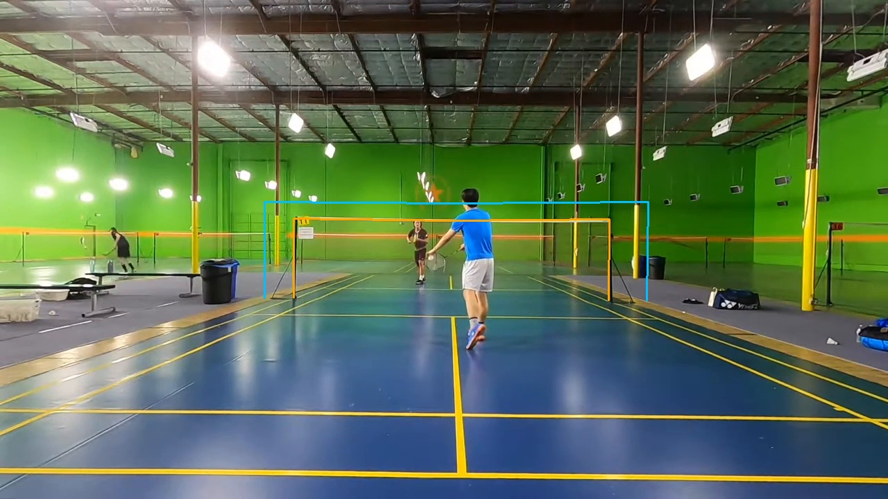

# Player-guided court experiment, 8 September 2026

[The latest stripe and refinement experiment](stripes.md) reaches 10/20 under
the original corner cutoff, including off-screen corners. Subsequent visual
review prioritises visible outer-boundary accuracy, a consistent paint-edge
convention and soft post-base evidence. The score is not a count of usable
courts. The report also records an accurate proposal rejected by the floor gate
and floor texture mistaken for a court-line continuation. Production keeps
CourtKeyNet.

[The earlier assignment experiment](assignment.md) compares explicit marking
assignments on frozen geometries. That first matcher reaches 5/20 accurate fits.

[The previous scoring experiment](marking_refit.md) tests which multi-fragment
refits to keep and records the remaining court-selection failures.

This experiment asks whether moving players and visible markings can locate a
badminton court without CourtKeyNet. Player movement provides useful evidence,
but the first temporal prototype still accepts wrong courts. Adding the net's
projected position helps resolve one floor-line ambiguity. The annotation
pipeline continues to use its existing court detector.

[The follow-up](followup.md) records wider search, image-motion experiments and
thin-overlay checks of the amateur centre-line errors.

The intended replacement must locate the main playing court in partial amateur
views so those videos can be annotated automatically.

Fresh RTMDet person detections cover ten 30-second windows from four amateur videos
and three further clips of roughly three seconds each. The exports use a strict
score cut above 0.2 and sample at 10 Hz. DeepLSD supplies lines independently.
All 20 labelled anchor frames match their source pixels. These are development
examples; this pass does not establish performance on unseen videos or controls.

The tracker preserves missing observations. A selected pair must appear together
in at least half the samples, with at least one present throughout. The fitter
assigns intersecting line rectangles to possible parts of the badminton grid.
It checks people against the completed court before retaining candidates.

Long windows fragment player identities. Three-second patches recover more
pair choices, including many spectators and false detections. Neither a fixed
pair nor the eight most active persistent tracks reliably identifies the main
court in the harder views. Cropping lines above the players also gives unstable
results between adjacent frames.

## Replayed short-clip comparison

The table covers the three short clips described above. It compares the same
set of player-guided candidate courts across three raw frames per clip.
Floor-only scoring is the comparator. Each stage chooses one court for all
three frames. Values are the worst corner error across those frames in
**1280×720 coordinates**.
The existing accuracy cutoff is **15 pixels**, including off-screen corners.

| Clip | Floor score | Floor + net score | Then multi-fragment refit |
|---|---:|---:|---:|
| Yellow court | 221.19 px | 26.01 px | 21.22 px |
| Letterboxed court | 10.06 px | 17.38 px | 14.75 px |
| Centre court | 4.04 px | 4.04 px | 3.20 px |

Floor scores use the median, or middle value, of the three frame scores. The
second stage adds projected net evidence with a 3:1 floor-to-net weighting.
The final stage, **multi-fragment refit**, adjusts the court to align with
several nearby DeepLSD line pieces, then repeats the scoring. The labels
are used only to measure the resulting corner errors. The replay includes the
retained proposals, observations, lines, labels and diagnostic scripts.

Floor-only scoring and the multi-fragment refit stage each meet the cutoff on two of
the three clips. The yellow court improves substantially but still fails it.
Net scoring initially worsens the letterboxed result. These results concern the selected geometry; **the
replay does not define an automatic acceptance rule**.



On frame 90 of the yellow clip, the floor-score winner predicts the blue
net above the visible tape. The closer candidate predicts the orange net along
the tape and posts. Both candidates contain the selected players. Net evidence
therefore distinguishes geometry that player containment alone leaves unresolved.

The net diagnostic assumes a pinhole camera, square pixels and an optical centre
at the image centre. It searches focal lengths from 0.4 to 4 image widths.
It uses the standard net heights of 1.55 m at the posts and 1.524 m at the centre.
These follow the [Badminton World Federation court rules](https://system.bwfbadminton.com/documents/folder_1_81/Statutes/CHAPTER-4---RULES-OF-THE-GAME/SECTION%204.1-%20Laws%20of%20Badminton.pdf).
The camera calculation follows the plane-pose relationship described in
[OpenCV's homography tutorial](https://docs.opencv.org/4.11.0/d9/dab/tutorial_homography.html).
Cropping, lens distortion and non-standard net placement can weaken this evidence.

## Replay

Extract [replay.zip](replay.zip) to a temporary directory. From the repository
root, use an environment with the existing NumPy, OpenCV and SciPy dependencies:

```bash
PYTHONPATH="$PWD:$PWD/src" python /tmp/court-replay/joint_short.py \
  --run /tmp/court-replay --no-overlays
```

The command recomputes candidate ranking and the multi-fragment refit without
videos or model inference. It writes `joint_short/results.json.gz`. Compare its top-candidate
metrics with [summary.json.gz](summary.json.gz). Images are omitted from the
archive; the displayed net comparison is included separately above.

First, test sustained playing zones as a guide for proposal construction, with
net evidence applied before candidates are discarded. Then test acceptance on
competing courts and non-court scenes before considering pipeline integration.
