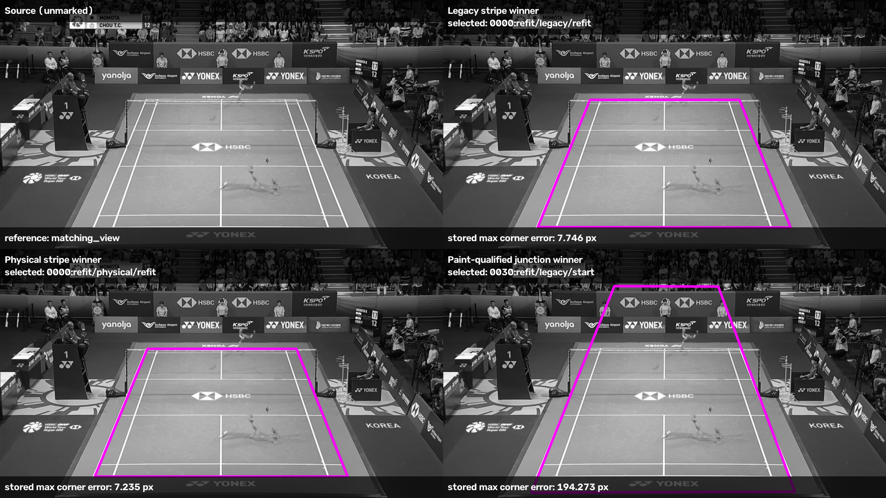
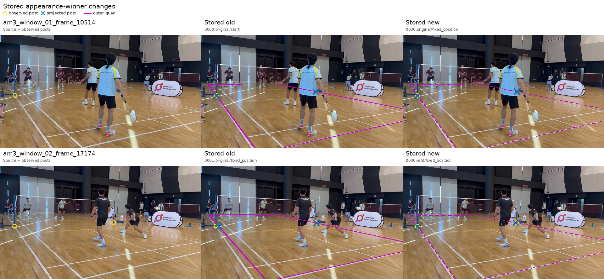

# Court fitting on additional footage

**The wider checks expose two unresolved problems: junction-first ranking often
chooses the wrong broadcast court, and the newest amateur video produces no
retained courts.** Filtering out floor texture repairs one reviewed amateur
selection. Post constraints help some fits but do not resolve the two difficult
reviewed cases. These results support further investigation, not production
replacement.

This checkpoint follows the [paint-geometry trial](paint_geometry.md). The goal
is an automatic detector that locates the main badminton court in partial amateur
views. The tests below ask whether better paint evidence and post constraints
repair known failures, and whether those changes survive a wider comparison.
CourtKeyNet remains the production detector.

## Evaluation contract

These are development and regression checks. They do not measure held-out
generalisation or automatic acceptance. The original twenty amateur frames cover
seven videos. The new video, identified here as GX, adds seven annotated frames from one video.
A separate broadcast comparison uses twenty cached median images from two videos.
Eighteen broadcast images have matching references; two have unverified views.
The latter are shown but excluded from accuracy counts.

The broadcast measurement is the worst of four corner errors, scaled to
1280×720 coordinates. Its historical cutoff is 15 pixels, including off-screen
corners. The amateur boundary measurement is root mean square (RMS) distance
from clicked boundary landmarks to the corresponding projected court side.
It also uses 1280×720 coordinates. These measure different errors; neither has
been established as a usable-court criterion.

Reference labels are attached after fitting and ranking. Manually observed post
bases are explicit fitting inputs in the post trials. A separate GX diagnostic
scores the annotated court itself to inspect rejection gates; it never supplies
a candidate to the detector.

## Broadcast: junction-first ranking loses good fits

The replay regenerates proposals using all available person-foot observations.
It then fits both legacy and physical paint geometry, retaining their starts.
Both paint models use the existing 3:1 stripe/net score for selection.
“Stripe ranking” below means that blended score.

Two further orders use the legacy geometry pool. They prioritise complete
agreements at line intersections, then fewer contradictions, then stripe score.
The paint-qualified version removes an unexpected-continuation contradiction
when the existing bright-stripe filter cannot support it. It adds no agreements
and changes no geometry or eligibility checks.

| Selection rule | Within 15 px / 18 matching references |
| --- | ---: |
| Legacy paint, stripe ranking | 16/18 |
| Physical paint, stripe ranking | 16/18 |
| Legacy paint, original junction-first ranking | 3/18 |
| Legacy paint, paint-qualified junction-first ranking | 3/18 |

Every scoreable broadcast image has retained candidates. The two stripe failures
are `shuttleset_03_scene_0016` and `shuttleset_21_scene_0020`.
Their physical-paint maximum corner errors are 105.99 and 43.34 pixels.
Paint qualification leaves every broadcast junction winner unchanged.
It therefore does not repair junction-first selection on this population.

For scene 0017, the legacy and physical stripe selections have maximum corner
errors of 7.75 and 7.23 pixels. The junction selection has 194.27 pixels of error
and extends into the audience. Magenta outlines show the selected outside
boundary. [All twenty broadcast comparisons](extension_overlays/broadcast/index.html)
include the two unverified references without error measurements.

Visual review identifies the same two stripe-ranked failures as severely broken
fits. The other sixteen matching-view cases look good, with a slight preference
for physical paint. This is a qualitative judgement of these comparisons, not a
new acceptance threshold.

The two unverified images are special-effect transitions. Scene
`shuttleset_21_scene_0010` shows only a partly visible court; its empty detection
was judged appropriate. Scene `shuttleset_21_scene_0039` is also degraded by a
transition, though less severely. Both remain outside the accuracy denominator.
This feedback does not establish a measured false-positive rate on transitions.

Inputs reuse cached median images and three person samples per image.
Person coordinates are rescaled from 1920×1080 to the 960×540 image coordinates.
The current all-people adapter excludes out-of-frame feet; this differs from
the older broadcast chain. The counts above are a new comparison of the latest
chain, not an exact replay of the earlier 15/18 result. They also do not establish
behaviour on individual raw video frames.

## New amateur video: all seven frames are rejected

GX frames 0, 5, 689, 5111, 5766, 77876 and 86088 were evaluated as native anchor
images. Existing person and line models supplied cached observations.
Five temporal windows supply three-second person patches around the anchors.
The same proposal generator and existing gates retain **zero courts on all
seven frames**. Consequently neither paint model has a candidate to refine.
[All seven source frames](extension_overlays/gx/index.html) are available for
inspection, without a fitted-court overlay.

The annotation convention for these outer lines is approximately 5 mm inward
from the outside paint edge. The reference clicks are unchanged. This convention
would affect boundary measurement, but there are no selected courts to measure.

Scoring the annotated geometry separately also fails the old floor-evidence gate
on all seven frames. This gate requires enough supporting line evidence from
the floor. Geometry, player containment and camera checks pass.
The old support score for the sideline family ranges from 0.417 to 0.444,
below its required 0.55; only two lines in that family meet its support test,
below the required three. All three alternative saved line-evidence schemes also reject all
seven reference geometries. Replacing the old family score with those existing
alternatives is therefore not an established fix.

This identifies a rejection at plausible court geometry. It does not establish
that the generator produced a sufficiently accurate candidate. Fixed image-angle
line groups, fragment coverage and marking assignments remain leads to inspect.
No gate threshold was relaxed to admit these references.

## Original amateur cases: a local selection improvement

The appearance diagnostic freezes the saved candidate pool on all twenty
original frames. It reassesses only contradictions caused by an unexpected
painted continuation. Out of 140 candidate line arms checked, 87 lose their contradiction.
An unsupported arm becomes unresolved; it never becomes an agreement.
Only two selected courts change.

| Frame | Previous boundary RMS | Paint-qualified boundary RMS |
| --- | ---: | ---: |
| Amateur-3 10514 | 4.66 px | 4.21 px |
| Amateur-3 17174 | 17.31 px | 5.32 px |

Each row shows the source image, the previous selection and the paint-qualified
selection. The lower row, frame 17174, recovers exactly the alternative preferred in review
case 1. The upper row is a different alternative from the post-closest court
previously shown as case 4. Direct review of this new comparison judged both
changed selections good, with a minor bias towards the inner edge of the white
stripe.
Circles mark observed post bases, crosses mark projected posts, and magenta
outlines mark outside boundaries. The other eighteen selections stay unchanged,
including the empty Amateur-2 result.

The deciding false line continuations follow wooden-floor detail beyond the
centre-line termination. [The inspected fragment crops](extension_overlays/junction_support.png)
show this evidence. The diagnostic uses saved JPEG content. An initial version
incorrectly resized three letterboxed gallery canvases. The corrected version
removes the canvas first and replays all twenty cases. It retains 5,313 fragments,
compared with 5,110 before correction. All rankings and contradiction dispositions
remain identical; the archive contains the corrected measurements.

## Post constraints and fresh line assignments

Thirty-two physical-paint starts across five reviewed cases were fitted at post
weights 0, 0.25, 1 and 4. Each visible post contributes independently; occluded
sides contribute nothing. The first trial holds line assignments and fitting
samples fixed. Every start and attempt is recorded, and the existing gates remain.
Of 128 attempts, 127 produce successful fits. One converges to an invalid
projection and is excluded. All 32 zero-weight controls reproduce the saved fits
exactly. Reference labels are measured after selection.

[Score-selected post fits](extension_overlays/post_refit_stripe_ranked.png)
show improvements in some cases. However, every new nonzero-post fit in
Amateur-3 frame 24515 and Amateur-4 frame 0 fails the existing floor gate.
[Post-distance selection](extension_overlays/post_refit_post_ranked.png) is a
separate manual-cue diagnostic. The [rejected-fit examples](extension_overlays/gate_rejected_diagnostic.png)
show why accurate post placement alone does not establish accurate boundaries.
These trials report post RMS; the earlier saved-alternative trial reported mean
post distance, so the two numbers should not be treated as the same metric.

A second trial refreshes line assignments for up to three more fitting steps,
using weights 0 and 0.25. It retains all 64 original start rows and 63 successful
saved refits. Another 184 successful steps give 311 scored rows. The single
unsuccessful saved seed remains in the first trial's result and the second
trial's summary count. It is never eligible for selection.
Neither difficult case gains an eligible new fit with post weight 0.25.
Fresh local assignments therefore do not resolve these cases within this trial.

## Checkpoint and review questions

The completed comparisons justify investigating proposal coverage and rejection
before extending post fitting. Junction-first ranking needs a broader rethink
given its broadcast losses. Appearance qualification remains a useful local
observation, rather than a sufficient general selection rule.

Useful review questions include whether the current line evidence represents
the visible court under strong perspective, and which useful proposals disappear
before refinement. A newly captured pre-floor candidate population is saved in
the working investigation, but has not been verified or analysed. It supplies no
result in this report. These questions are leads, not limits on independent review.

[Machine-readable summary](extension_summary.json.gz) records the selected IDs,
per-case broadcast errors, GX generation counts and reference-gate evidence.
[Evidence archive](extension_diagnostics.zip) contains the completed result
populations, prepared extension inputs and diagnostic source snapshots.
Its README distinguishes recorded evidence from the images and model assets
needed for a full runtime replay. The production implementation is unchanged.

All reported fitting and inference runs completed in the experiment environment,
including the recorded invalid-projection outcome. The first broadcast case reproduced exactly between its smoke run
and the full run. Saved-result counts, gallery links and archive contents were
checked for this checkpoint. The earlier code checks remain recorded in the
paint trial; this checkpoint adds evidence and documentation only.
