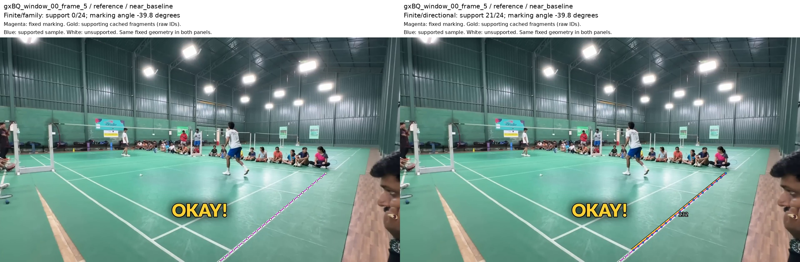
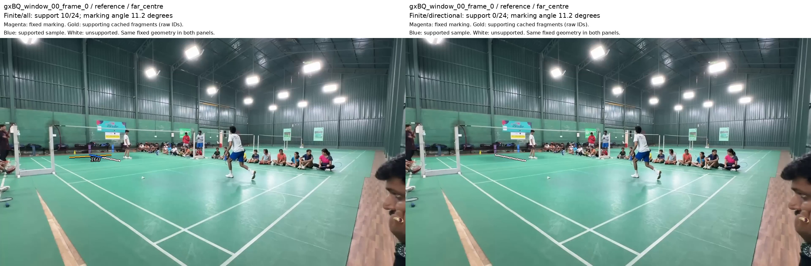

# Directional evidence on fixed courts

**Directional matching restores support on a close GX court and rejects a known
wrong broadcast court.** These fixed-court results justify another controlled
comparison before wider search testing. The finite-distance calculation also
loses one previously good amateur fit before direction filtering is added.

The goal is to locate useful courts in partial amateur videos. GX identifies one
such video. This experiment extends the [GX trace](gx_proposal_trace.md) while
holding every court fixed.
It measures floor support only. Generation, players, camera checks, retention,
ranking and final acceptance are not rerun. Production is unchanged.

## Controlled comparison

There are 63 fixed courts across 22 cached frames: 25 GX examples and 38 older
controls. GX examples include seven references, seven saved starts, two close
complete-search examples, the frame-0 legacy refit, one wrong floor survivor and
seven saved random proposals. The random proposals are not labelled negatives.
Reference-selected geometry makes this development evidence, not an automatic
selection test.

All arms use the same twelve painted intervals and visible sample locations.
They retain 24 samples per interval, a four-working-pixel support radius, 0.55
support thresholds and three required distinct lines in each court direction.
Distinct-line matching retains the eight-pixel endpoint tolerance. These fixed
GX settings also govern the older controls; their scores are not presented as
reproductions of historical eligibility decisions.

- **Original:** existing raster distance maps and image-angle families.
- **Finite/family:** the same families and merged pools, with exact distance to
  finite observed fragments. This isolates the distance-method change.
- **Finite/directional:** fragments must lie within five degrees of each
  projected marking. This is a test setting, not a calibrated default.
- **Finite/all:** unrestricted fragments, as an explanatory control.

The last two arms share one all-fragment merged pool. The first two retain the
original family pools. Every pool uses the original merging algorithm, eight-pixel
and three-degree merge tolerances, and 32-line cap. Directional versus unrestricted
therefore isolates angle compatibility. Family versus directional also changes
which fragments enter the merged pool; it is not a pure angle-only comparison.
The assignment module supplies finite-distance geometry, not its grouping or score.

## Results and individual matches

Cells count courts passing the unchanged **floor rule**, not accepted detections.
The older controls include four previously good amateur views and two broadcast
views. Their six saved stripe winners are separate from their reference courts.
The seventh older reference is a known floor-texture continuation case.

| Fixed population | Original | Finite/family | Finite/directional | Finite/all |
| --- | ---: | ---: | ---: | ---: |
| GX references | 0/7 | 0/7 | 2/7 | 5/7 |
| GX saved starts | 0/7 | 0/7 | 0/7 | 1/7 |
| GX close complete-search examples | 0/2 | 0/2 | 1/2 | 1/2 |
| GX frame-0 legacy refit | 0/1 | 0/1 | 0/1 | 1/1 |
| Known wrong courts | 2/2 | 2/2 | 0/2 | 1/2 |
| Older references | 7/7 | 7/7 | 7/7 | 7/7 |
| Previously good stripe winners | 6/6 | 5/6 | 5/6 | 6/6 |
| Fixed placements on non-court frames | 0/24 | 0/24 | 0/24 | 0/24 |
| Random GX proposals | 0/7 | 0/7 | 0/7 | 0/7 |

Projected fragment access together with the all-fragment merged pool passes
the references for GX frames 5 and 5111. It also passes the saved close frame-5
proposal. Holding the restored point support fixed while retaining original
family lines leaves both references with only two lengthwise matches; the new
merged pool is necessary for their passes. On the frame-5 reference, cached fragment
132 lies at −39.3°, close to the projected near baseline at −39.8°. The original
crosscourt family excludes angles beyond ±35°. Its finite-distance support is
0/24 samples; directional access restores 21/24 without moving the court. The
[right-singles comparison](fixed_matching_overlays/gxBQ_window_00_frame_5__reference__right_singles.jpg)
shows the lengthwise case: a projected 7.1° marking falls below the original 10° limit.

The [full-court frame-5 comparison](gx_trace_overlays/gxBQ_window_00_frame_5__cap.jpg)
was visually judged a huge improvement over the sampled court. Its geometry is
unchanged by this matching experiment.

Unrestricted access can credit the wrong marking. On frame 0, fragment 160 at
−3.2° contributes 10/24 samples towards a far centre interval projected at +11.2°.
Directional matching removes that contribution. The far centre interval has
zero compatible support in all seven GX references. That identifies missing
matched observations; it does not establish occlusion, visibility or correct
projection of that interval.

The wrong broadcast junction winner in scene 0017 passes the family and
unrestricted arms but fails directional matching. Both tested broadcast stripe
winners retain their passes. The wrong GX floor survivor is also rejected, but
changing to the unrestricted merged pool already rejects it. That case cannot
attribute the pass/fail change to direction alone.

The eight existing non-court frames have no saved candidate courts. Each receives
three dimension-normalised placements from frozen GX, broadcast and amateur
references. Rejection of these 24 placements is a bounded background check; it
is not a false-acceptance rate from a complete search or a neighbouring-court test.
The known false continuation fragment 458 in Amateur-3 frame 17174 lies at least
7.77 working pixels from all reference samples, outside the four-pixel radius.

## Regression, decision and checks

The saved Amateur-3 frame-0 stripe winner passes the original raster score but
fails the finite/family control. Its far short-service support falls from 17/24
to 13/24, below 0.55, reducing distinct crosscourt lines from three to two.
Four samples credited by rasterisation have finite distances of 4.30–4.96 pixels.
This regression precedes the direction change; directional filtering further
reduces crosscourt support. Keeping the same numeric radius does not make the
two distance methods equivalent.

Run another fixed-court comparison before wider search testing. Preserve
the original distance convention while testing directional access, and
inspect the missing centre/right-side correspondences. Do not weaken the floor
gate on the assumption that low support means occlusion. The present results
establish useful directional discrimination, not a validated replacement scorer.

The [replay archive](fixed_court_matching.zip) contains frozen inputs, complete
per-interval results, correspondence IDs, the runner and checks. All 63 reconstructed
baseline scores exactly match the existing scorer at the same fixed homographies.
Original corners remain identical across arms. Saved support, distinct counts and
threshold decisions pass independent arithmetic checks. The 22 case measurements
total 6.72 seconds on the experiment host, excluding imports and transfers.
Relevant tests passed (35); scoped lint and types passed, all with exit code 0.

A bounded Fable 5.1 review independently replayed three cases with exact saved
field agreement. It confirmed fragment identities and identified the dependence
of the two GX reference passes on the merged pool. A separate scalar count
check confirmed that dependence. No implementation defect was established in
its stated coverage; the pool and distance-method limitations remain explicit.
