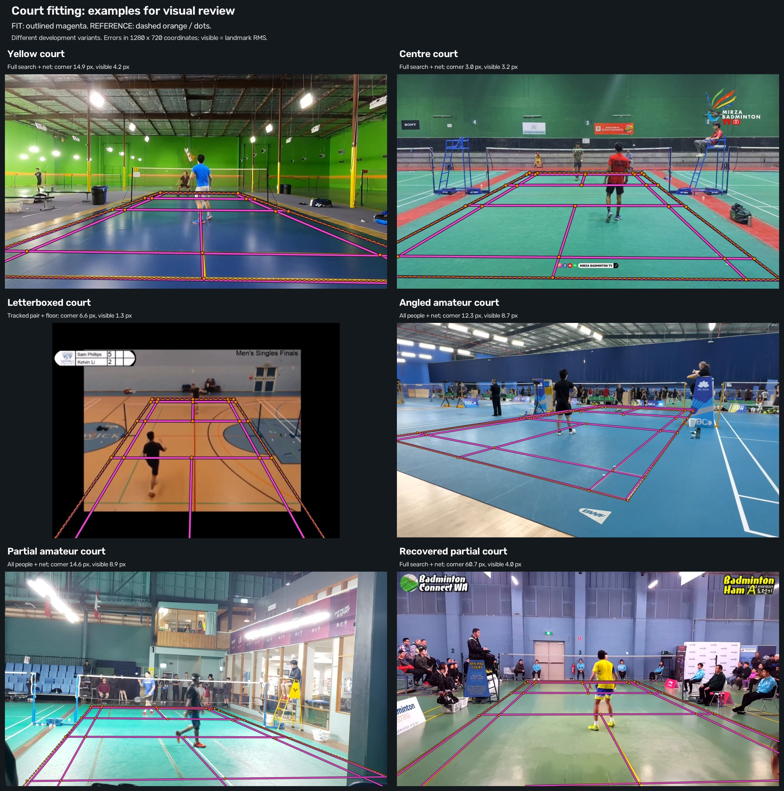
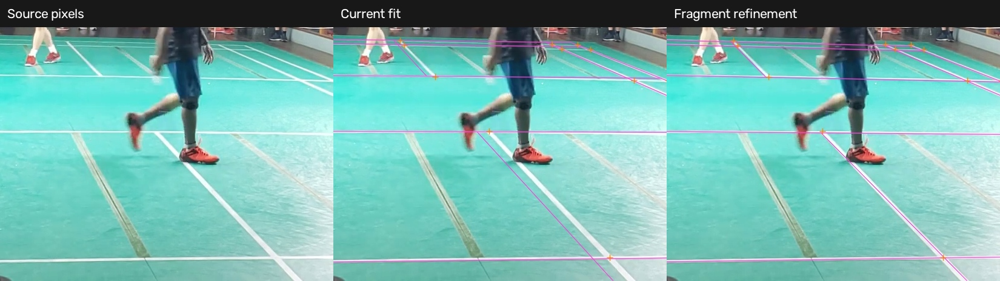
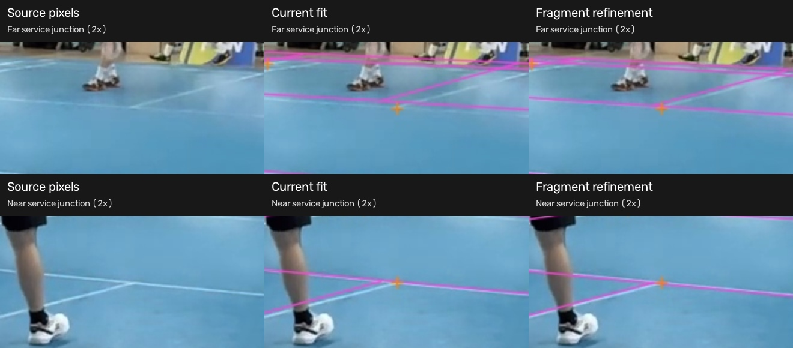

# Wider court search, 8 September 2026

Searching more line combinations recovers plausible courts that the sampled
search missed. It also introduces ranking regressions. The experiment now fits
several partial amateur views closely, but automatic court selection remains
unreliable. The annotation pipeline keeps its existing detector.

The aim is to locate the main playing court without CourtKeyNet. This follow-up
uses the same 20 labelled development frames: nine from three short clips and
11 from four longer amateur videos. A frame is accurate when its worst-corner
error is at most 15 pixels in 1280×720 coordinates, including off-screen
corners. Visible error is the root mean square distance between projected
markings and manual clicks.
Labels measure results; they do not guide the search or ranking. A leading
candidate can be accurate yet rejected because competing courts remain plausible.

## Search coverage

As a diagnostic, the manually labelled court passes the existing line-support
requirements in 19 of 20 frames. Some searches still return no court. The search
normally samples 4,096 rectangles formed by intersecting lines. Testing every
rectangle from its retained line families recovers candidates in two previously
empty frames from one amateur video. The line evidence, selected players and
scoring rules stay fixed. Each line family still has a 32-line limit. Coverage
beyond those retained lines remains untested.

| Frame | Sampled search | Full search: corner error | Full search: visible error |
|---|---|---:|---:|
| am1, 54 | No candidate | 60.67 px | 4.04 px |
| am1, 5352 | No candidate | 58.10 px | 3.25 px |

These are the leading candidates under floor-plus-net scoring. Their visible
markings fit closely, but their extrapolated corners fail the accuracy cutoff.
Refitting nearby line fragments changes their corner errors to 80.47 and
48.99 pixels; it does not improve both views.

Across the nine short-clip frames, each search size ranks an accurate candidate
first in four frames. Neither search accepts a court. The wider search improves the yellow
clip's final frame from 288.51 to 14.89 pixels. It worsens the letterboxed
clip's middle frame from 6.61 to 24.48 pixels.

Combining the full-search candidates lets one court be scored across all three
frames of each short clip. The following errors are the worst across those
three frames, using the existing median floor-plus-net score:

| Clip | Before line refinement | After line refinement |
|---|---:|---:|
| Yellow | 14.89 px | 671.37 px |
| Letterboxed | 19.49 px | 11.06 px |
| Centre | 3.00 px | 3.20 px |

This comparison only selects geometry. It does not define an acceptance rule.
Refinement can promote the wrong court, so it cannot be applied unconditionally.

## Player evidence and controls

Image movement was measured inside person boxes after estimated camera movement
was subtracted. Selecting a fixed pair from those measurements reduces accurate
leading candidates on the 11 amateur frames from three to zero,
compared with keeping all people and scoring the net. With all people retained,
adding movement scores on opposite sides of each court leaves the leading
geometries unchanged. Both all-person variants give three accurate leading
candidates among the 11 frames, with one correct and three wrong acceptances.

Two further cues also fall short. A broad physical player-height check keeps
the leading candidate in all eight amateur frames that returned one, including
the wrong ones. Adding
painted-stripe contrast to ranking reduces accurate leading candidates from
four to two across 11 full-search frames: the nine short-clip frames and the two
am1 frames above.

Both search sizes reject all eight frozen non-court controls. Those controls
use historical person detections with an observed score floor near 0.3; the
amateur exports use a strict cut above 0.2. This is a separate negative check,
not a test on unseen videos or matched detector thresholds.

## Visual check



Magenta outlines show the fitted grid. Dashed orange lines and orange dots show
manual references. The gallery selects examples from different variants; it is
not a benchmark for one detector. The first five examples meet the corner cutoff
on their displayed frames. Visual inspection found centre-line offsets in both
the 'Angled amateur court' and 'Partial amateur court' examples, although
those frames pass the 15-pixel corner cutoff. The targeted check below measures these offsets. The last example shows the
recovered partial court whose off-screen
corners remain uncertain.

## Centre-line check

The partial and angled amateur examples pass the corner cutoff, but their
centre lines remain visibly offset.
Refitting each selected candidate against nearby detected line fragments gives:

| Example | Visible error before | Visible error after | Centre-marker error before → after |
|---|---:|---:|---:|
| Partial amateur court, am4 frame 13782 | 8.88 px | 2.80 px | 12.36 → 2.47 px |
| Angled amateur court, am2 frame 150 | 8.66 px | 6.44 px | 7.66 → 4.16 px |

The partial-court candidate was rejected as ambiguous; the angled candidate was
accepted. This comparison examines their geometry. It does not change acceptance.

Centre-marker error is the root mean square error over manually marked centre-line
intersections. These figures use the same 1280×720 scaling. The refit uses only
image line fragments; the manual markers measure its result.

Both figures below show source pixels, the original fit and the refit from left
to right. Each row uses the same crop across its three panels. Thin magenta lines show the fitted grid;
orange crosses are manual markers.



The refit brings both centre sections much closer to the white markings. The original near-centre section has line support at only
one of 24 sampled positions. Other markings let the overall score pass.



The angled court improves less. Its two service-line junctions are enlarged
above to expose the remaining offsets. As a separate diagnostic, fitting a perspective
transform to all manual clicks gives visible errors of 1.84 pixels for the
partial court and 1.66 pixels for the angled court. Excluding all centre clicks
still predicts their positions with errors of 3.06 and 2.36 pixels respectively.
These labelled fits show that the existing perspective model can represent
both grids substantially better. They are not detector results.

The floor fit uses a general homography, which maps the flat court into the
image. The extra pinhole-camera assumptions affect net scoring and candidate
selection. This check does not isolate their effect on ranking. It establishes
that line fitting and scoring leave useful accuracy unrecovered.

Across the six gallery examples, the unchanged fragment refit improves visible
error in four and worsens it in two. Together with the yellow-clip regression above,
this rules out applying the refit unconditionally. The next experiment should
check residual distances for each visible marking, rather than only counting
points within a tolerance. It should then test whether a refit improves those
distances across frames. Occluded markings need separate treatment.

## Replay and next step

[The replay archive](followup_replay.zip) contains frozen lines, person
observations, movement weights, results and diagnostic scripts. It starts from
these recorded features. Source videos and model inference are excluded.
Extract it to a temporary directory, then run from the repository root:

```bash
PYTHONPATH="$PWD:$PWD/src" python /tmp/court-followup/replay_followup.py \
  --cases /tmp/court-followup/followup_cases.json.gz \
  --output /tmp/court-followup/replayed.json.gz \
  --ids yellow_short_frame_90 am4_window_00_frame_0
```

Use `--max-rectangles 500000` for the full search. The archive also includes
the multi-frame and refinement runners. Seven independently recorded case and
variant results replay exactly, including candidate order, scores and metrics.
[The measurement summary](followup_summary.json.gz) preserves the comparisons.

The next step is to improve marking assignment and candidate selection while
preserving the wider proposal coverage. More line detections alone are a lower
priority because the known court already passes the line requirements in most
frames.
The wrong acceptances must be resolved before pipeline integration.
