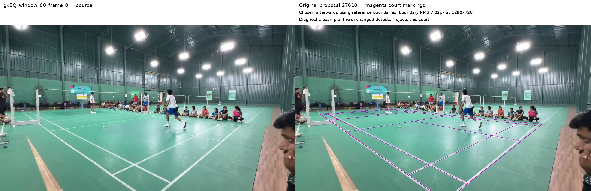
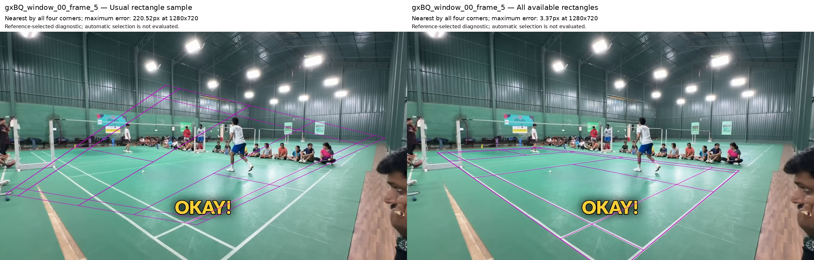

# Where the GX court proposals are lost

**GX has both proposal-coverage and rejection problems.** The original generator
contains a useful starting court for frame 0, but the floor gate rejects it.
On frame 5, the random limit on seed rectangles discards a much closer court
that the existing lines can generate. A threshold change alone would leave
that proposal missing.

The goal is to locate the main court in partial amateur videos. GX identifies
one amateur video. This diagnostic uses seven frozen frames, with the original DeepLSD fragments
and person observations. It extends the [additional-footage check](extension_results.md).
CourtKeyNet remains in production. No detector setting has changed.

## What the unchanged generator produces

The generator builds rectangles from image lines and assigns them to possible
court markings. It then checks players, geometry, floor-line support and camera
consistency. Across seven frames:

| Stage | Proposals remaining |
| --- | ---: |
| Generated | 4,271,850 |
| Passed players and geometry | 521,473 |
| Passed floor-line support | 1 |
| Passed camera check and retained | 0 |

Every frame finishes without a court. That includes rejection of the useful
starting proposal shown below.

The table shows one example per frame, chosen **after detection using the
reference boundaries**, from proposals that pass players and geometry. These
are diagnostic examples, not automatic selections. Each one fails the original
floor gate. The camera column is a separate check of that example.

All table errors use 1280×720 coordinates. Boundary RMS is the root mean square
distance from clicked boundary landmarks to their projected court sides. It uses
the annotation's approximate 5 mm inward offset from the outside paint edge.
The maximum corner error includes extrapolated corners and is a different
measurement. Neither metric defines a usable court.

| Frame | Boundary RMS (px) | Maximum corner error (px) | Camera check |
| --- | ---: | ---: | --- |
| [0](gx_trace_overlays/gxBQ_window_00_frame_0.jpg) | 7.02 | 27.24 | Pass |
| [5](gx_trace_overlays/gxBQ_window_00_frame_5.jpg) | 81.44 | 358.22 | Fail |
| [689](gx_trace_overlays/gxBQ_window_00_frame_689.jpg) | 5.39 | 21.99 | Pass |
| [5111](gx_trace_overlays/gxBQ_window_01_frame_5111.jpg) | 37.76 | 166.17 | Fail |
| [5766](gx_trace_overlays/gxBQ_window_02_frame_5766.jpg) | 9.70 | 37.86 | Fail |
| [77876](gx_trace_overlays/gxBQ_window_03_frame_77876.jpg) | 75.40 | 5226.40 | Fail |
| [86088](gx_trace_overlays/gxBQ_window_04_frame_86088.jpg) | 19.36 | 62888.30 | Fail |

Frame 86088 illustrates a limit of boundary distance: long projected sides can
lie near the boundary clicks while an extrapolated corner is wildly misplaced.
Inspect the whole court and camera result alongside that measurement.

Visual review judged frame 0's proposal 27610 a useful starting fit. Its far
baseline catches the first inner horizontal rather than the uppermost line.
The near baseline drifts from the middle towards the outer right, and the right
sideline moves too close to the seated children. This is an endorsed starting
point, not a final court. The existing refitter can now be tested from that
unchanged start.

## The rectangle cap loses a close proposal

A paired diagnostic keeps the original fragments, line merging and court
assignments. It compares the usual sample of 4096 rectangles with every valid
rectangle before that sampling step. Tiny rectangles are discarded afterwards,
so the usual arm actually evaluates 4076 rectangles on frame 0 and 4067 on frame 5.
The full arms evaluate 136,661 and 133,001 rectangles respectively.

For this comparison, the diagnostic selects the smallest maximum four-corner
error. These are different selections from the boundary-based examples above.
Errors below again use 1280×720 coordinates.

| Frame | Usual rectangle sample | All available rectangles |
| --- | ---: | ---: |
| 0 | 27.24 px | 16.65 px |
| 5 | 220.52 px | 3.37 px |

The usual arm exactly reproduces the full detector trace's generated count,
geometry-valid count and closest examples. The frame-5 result establishes that
the existing line pool can generate a close court which the cap removes.
The closest frame-5 proposal also passes the player and camera checks, but
still fails the original floor gate. This is a label-guided coverage diagnostic.
It does not run the complete detector over the enlarged population or establish
automatic selection accuracy.

## Family restrictions also remove useful evidence

A separate diagnostic scores each unchanged annotated court using the cached
neural fragments. It varies which fragments are available to the scorer's
distance maps and merged-line pools. The original lengthwise group admits
image-line angles at least 10 degrees from horizontal. The crosscourt group
admits angles within 35 degrees of horizontal. These fixed image angles can
exclude actual court lines in an oblique view.

A distance map measures proximity to the
observed fragments; merged lines supply the distinct-line count.

| Evidence available to the floor scorer | References passing / 7 |
| --- | ---: |
| Original angle families | 0/7 |
| All fragments in maps; original merged lines | 3/7 |
| Original maps; all fragments in merged pools | 0/7 |
| All fragments in both | 5/7 |

The thresholds remain unchanged. Lengthwise mean support averages the fraction
of sampled points near observed fragments over visible lengthwise markings.
Letting all fragments into the maps raises
lengthwise mean support from 0.417–0.444 to 0.639–0.833. Unrestricted access can
also admit incidental background or differently oriented evidence, so it is a
diagnostic control rather than a validated matching rule.

Reducing merge distance from eight to two working pixels gives 0/7 with the
original families and 1/7 with all fragments in both pools. The maximum number
of merged lines stays at 32 per family. A smaller merge tolerance is therefore
not an established repair. Exact reference outer lines also construct one seed
rectangle in every case; image-centre line ordering does not block those seeds.

The earlier four saved scoring schemes all share the original floor-eligibility
condition. Their joint rejection is not evidence from four independent gates.
The web diagnostic used OpenCV's line segment detector (LSD); the measurements here use the
original cached DeepLSD observations.

## Next tests and reproducibility

Prioritise how seed rectangles are selected and how scoring uses line evidence.
Keep the original starts and already-good cases as controls. The next bounded
recovery test applies the existing refitter to the rejected GX examples while
retaining each starting court. Reference-selected recovery cannot establish
automatic ranking or acceptance.

The [diagnostic archive](gx_proposal_diagnostics.zip) contains the producers,
saved examples, accounting checks and replay instructions. It uses input and
generator dependencies from the existing published archives. The original
checkpoint is `d7523c1`. Detector, boundary-metric and legacy generator sources
matched that checkpoint in the experiment environment.

Every GX case ran once uninstrumented and once with observers. Complete final
outputs matched exactly, and historical generation counts matched for all seven.
The saved-example checker independently recomputed corner and boundary metrics.
The prior Amateur-2 control also reproduced its final result and the exact
coordinates of known rejected proposal 405298.
An independent Fable 5.1 review found no trace-correctness defect within its
source and frame-0 coverage. The subsequent seed-cap comparison verifies its
sampling concern for frames 0 and 5.

The trace's support-mean and distinct-line subcounts cover player-and-geometry
rows. Diagnostic examples are ordered by boundary distance without an inset;
the table then applies the recorded 5 mm inset. References enter only after
generation. Original labels remain unchanged.
