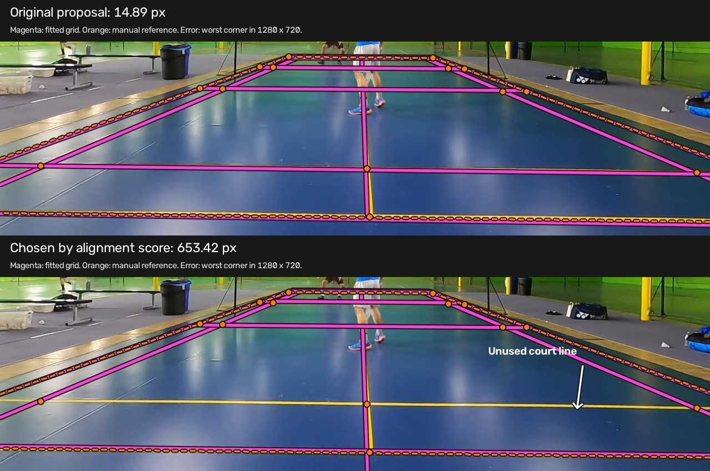

# Choosing multi-fragment refits, 8 September 2026

This round ends at a rethink point. More precise line-alignment scores improve
some courts, but they still select wrong grids and harmful refits. No tested
score is ready to replace the existing detector. Production remains unchanged.
The goal remains automatic detection of the main playing court, including
partial amateur views, without CourtKeyNet.

We tested whether visible markings can identify helpful **multi-fragment
refits**. A refit adjusts an existing court to align with nearby DeepLSD line
pieces. This follows the [centre-line investigation](followup.md).

## What was compared

The experiment freezes 357 retained candidates from 20 labelled development
frames. Nine frames are from three short clips; eleven are from four amateur
videos. Full-search proposals cover the short clips and two frames from the first
amateur video (am1). The other amateur proposals come from the earlier sampled all-person/net search.
This measures scoring on mixed proposal sources, not a complete detector run.
One frame has no candidates. A separate gallery probe is excluded from counts.

Each candidate receives the same multi-fragment refit used in the previous
round. Labels measure results after scoring and selection. Accuracy still means
worst-corner error at most **15 pixels in 1280×720 coordinates**, including
extrapolated corners. Visible error is root mean square (RMS) distance to manual marking clicks.

All scores keep the existing geometry, distinct-line, player-presence and
camera checks. Floor and net evidence keep their 3:1 weighting. The alternatives
change how floor alignment is measured:

- **Existing:** count samples close enough to detected lines in broad angle groups.
- **Continuous:** reward smaller distances within those same groups.
- **Direction-aware:** match each marking directly to similarly directed finite
  DeepLSD pieces. This avoids fixed image-angle groups in the score.
- **Bidirectional:** also measure how much detected line length inside the
  proposed court is explained by its markings. Combine the two directions with
  a harmonic mean, which gives the weaker direction more influence.

The new distance scores use a two-pixel scale in a working image capped at 960
pixels. Direction matching allows five degrees. Direction-aware and
bidirectional scores are also tested with samples inside person boxes excluded.
Five frames use boxes sampled one or two frames away from the anchor.

Reverse coverage counts direction-compatible line pieces at least 12 working
pixels long, within the proposed court plus a four-centimetre margin. Lines
outside a too-small proposal therefore cannot count against it.

## Keeping the current court versus reopening selection

For each of the 19 available leading candidates, accept its refit only when it
passes the existing gates and improves the existing score. This improves visible
error in **four**, worsens none and leaves fifteen unchanged, using a 0.1-pixel
change threshold. That includes both centre-line examples and another partial
amateur view.

Applying the same rule separately to every candidate chooses **35 harmful
refits out of 357 original/refit pairs**. The four improvements among current
leaders therefore do not establish a reliable general rule.
It also preserves existing wrong court choices.

Allowing every original candidate and its refit to compete produces the table
below. All 20 frames count, including the empty pool.

| Score | Accurate leading fits / 20 | Wrong acceptances / 20 |
|---|---:|---:|
| Existing | 7 | 2 |
| Continuous | 8 | 1 |
| Direction-aware | 7 | 2 |
| Direction-aware, person boxes excluded | 7 | 3 |
| Bidirectional | 8 | 2 |
| Bidirectional, person boxes excluded | 8 | 3 |

A wrong acceptance is a court that passes selection but exceeds the 15-pixel
error cutoff. Selection rejects competing separate courts and requires the
leader to beat the next distinct fit by at least 0.035 when one exists.
That gap has not been calibrated for the new scores. Pooling originals and refits also changes which
candidates compete. These acceptance counts apply to this experiment's pool.



The top panel shows the original proposal; the bottom shows the selected refit.
Magenta is the fitted grid, orange is the manual reference, and the white arrow
points to the bare yellow line crossing the lower panel. The original fit
follows this line; the selected fit skips it and assigns a different marking
to the visible baseline below. Its predicted baseline falls below the image,
so the crop cannot show the full corner error. On frame 156, the accurate
original proposal has 14.89-pixel corner error. The direction-aware score chooses a
653.42-pixel refit. It aligns with many markings but leaves a visible interior
court line unused. The existing score also selects a badly wrong refit, with
641-pixel corner error. Averages can reward a fit despite contradictory line evidence.

## Does evidence from other frames resolve it?

Each short clip has three labelled frames. Score every frozen geometry on all
three and rank by the median score. The table gives the worst corner error
across those frames. A failed check gives a frame score of −1, allowing a
geometry valid on two of three frames to compete. Every winner below passed
the checks on all three frames:

| Clip | Existing score | Direction-aware | Bidirectional |
|---|---:|---:|---:|
| Yellow | 653.42 px | 653.42 px | 26.36 px |
| Letterboxed | 19.49 px | 31.94 px | 26.61 px |
| Centre | 5.67 px | 4.20 px | 4.20 px |

Bidirectional scoring helps the yellow clip substantially, but still misses the
15-pixel cutoff. It worsens the letterboxed result. Requiring no score loss on
either neighbouring frame and a positive mean gain also fails as a safeguard.
Both direction-aware and bidirectional scoring retain one harmful refit among
the nine leading short-clip candidates. These neighbouring frames are development evidence,
not unseen-video validation.

## What the next session should tackle

A label-only availability check finds an accurate candidate in **13 of 20**
pools after refitting. Seven pools still need better proposals; scoring cannot
recover a geometry absent from its input. Search coverage beyond the retained
line families remains untested, and most amateur frames still use sampled seeds.

For ranking, investigate explicit assignments between observed line groups and
named court markings. Start with the yellow court's near baseline versus long
service line. The next method should explain strong contradictory markings,
rather than compensate for them with support elsewhere. This is a proposed
next experiment, not an established solution.

Keep the current leading-candidate refit as a comparison. Avoid another round
of score-weight tuning until line assignments can explain these failures.

## Replay and checks

[The replay archive](marking_refit_replay.zip) contains frozen inputs, all six
score results, cross-frame results, scripts and synthetic checks. It starts
from recorded DeepLSD lines and person observations; no model inference or
source videos are required. Extract it to `/tmp/court-marking`, then run from
the repository root:

```bash
PYTHONPATH="$PWD:$PWD/src" python /tmp/court-marking/run_alignment.py \
  --inputs /tmp/court-marking/marking_inputs.json.gz \
  --output /tmp/court-marking/replayed.json.gz --workers 4

PYTHONPATH="$PWD:$PWD/src" python /tmp/court-marking/run_reverse.py \
  --inputs /tmp/court-marking/marking_inputs.json.gz \
  --results /tmp/court-marking/replayed.json.gz \
  --output /tmp/court-marking/replayed_reverse.json.gz --workers 4

PYTHONPATH="$PWD:$PWD/src" python /tmp/court-marking/cross_frame.py \
  --inputs /tmp/court-marking/marking_inputs.json.gz \
  --results /tmp/court-marking/replayed_reverse.json.gz \
  --output /tmp/court-marking/replayed_cross_frame.json.gz
```

[The compact summary](marking_refit_summary.json.gz) preserves counts and metrics.
Synthetic checks cover exact and shifted grids, oblique markings, finite line
pieces, endpoint reversal, occlusion and unexplained interior lines. They pass,
as does Ruff. Both full runs and the cross-frame checks completed successfully.

A fresh extracted replay of one 12-candidate case reproduces all six selector
orders and decisions. Its 24 original/refitted geometries agree within 0.001
pixels across the two environments.
