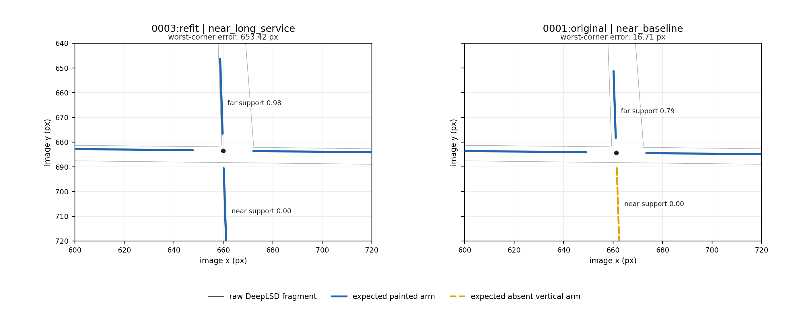
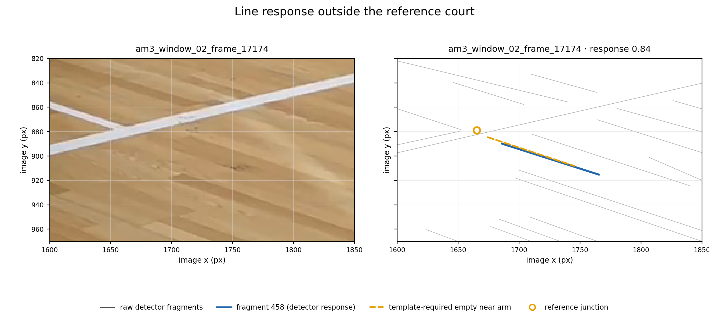

# Stripe identities and fixed-assignment refits, 9 September 2026

Keeping the starts alongside new refits selects **10/20 accurate courts**,
up from 9/20. Half the frames still fail the accuracy requirement, so the result
is insufficient to replace CourtKeyNet in the annotation pipeline. Finite junction evidence resolves two large yellow-court ambiguities,
but line responses outside the court can mislead it. Refinement improves some
fits and worsens others. Keeping the starting fits prevents one clear loss.

The goal is to locate the playing court in partial amateur views without
CourtKeyNet. This continuation tests stripe measurement, fragment identity,
finite junctions and geometry refinement. It follows the
[first assignment comparison](assignment.md), which selected 5/20 accurate fits.
It does not test a complete graph matcher or establish that graph matching fails.

## Evaluation contract

All results use the same **20 development frames from seven videos**. Several
frames share a video, so they are not independent test examples. Accuracy means
**worst corner error at most 15 pixels in 1280×720 coordinates**, including
off-screen corners. Visible-landmark root-mean-square (RMS) error is reported
separately. No held-out performance or automatic acceptance rule is evaluated.

The frozen pool contains 714 original/refit geometries. The saved shared gates
admit 682; an accurate geometry exists in 13/20 pools before and after those
gates. Two extra gallery probes are excluded. The empty frame remains in every
20-frame denominator. Labels are read after ranking or fitting, except for the
label-guided diagnostics below.

## What changed the result

The [stripe protocol](stripe_protocol.md) separates two choices. Measurement
uses either the nominal marking centre or that centre plus two possible paint
edges, offset by ±0.02 metres. Membership either lets fragments support several
markings or assigns each fragment one marking and position. Several fragments
may support the same marking. The template is treated as the stripe centre;
its exact relationship to painted boundaries and manual references remains a
limitation.

Forward support measures how much of the projected court the observations cover.
Reverse support measures how much observed fragment length the court explains.
The new scores average forward and reverse support, then retain the existing
3:1 floor-to-net blend. Fragment membership maximises the reverse term; it does
not globally optimise the combined score.

| Frozen-geometry comparison | Accurate selections /20 |
|---|---:|
| Recorded original score | 7 |
| Recorded bidirectional score | 8 |
| Previous one-group-per-marking assignment | 5 |
| Nominal centre, independent fragments | 8 |
| Nominal centre, exclusive fragments | 8 |
| Centre or paint edge, independent fragments | 8 |
| Centre or paint edge, exclusive fragments | 9 |

Exclusive membership changes three stripe winners. Only centre frame 71 crosses
the accuracy cutoff. The gain from the old grouped matcher to raw fragments
bundles several changes; the four-way comparison isolates only the two choices
within the new representation. Paired-edge support is a diagnostic and does not
cleanly separate the yellow frame 156 ambiguity.

### Finite junctions help with identity, but need paint attribution

Both junction rankings use the exclusive centre-or-paint-edge stripe score
as their base. A centre line terminates at a baseline and crosses a long-service line. The
junction diagnostic samples four short arms around each projected intersection.
It uses only observable sites with sufficient transverse and vertical support.
Missing observations remain unknown. A raw detector endpoint is never directly
classified as a physical termination.

The stripe winner on yellow frame 156 interprets the near baseline as a
long-service crossing. Its predicted continuation has no line support. A
baseline interpretation agrees with the observed termination. The figure's
candidate IDs identify the two saved fits:



Penalising contradictions alone lets an unobserved wrong alternative win that
frame at 731 pixels. Rewarding fully explained junctions first reduces the
selected errors on yellow frames 14 and 156 from 696/653 pixels to 16.56/16.71.
Both junction rankings still select 9/20 accurate fits. The complete-agreement
rule also worsens amateur 3 frame 17174 from 29.14 to 75.15 pixels.

Only 439 of 682 eligible geometries have any usable junction. There are 547
usable sites and 161 disagreeing arms across 159 geometries. None of the 78
accurate candidate entries has a disagreement. Entries are individual fits,
including similar alternatives from the same frame. **That zero is not validation:**
the separate manual-reference probe below produces three disagreements.

### Fixed identities make refinement inspectable; they do not guarantee accuracy

The [refinement protocol](fixed_refit_protocol.md) holds fragment identities,
stripe positions and finite interval assignments fixed. Both controls start
from the same 682 geometries. One fits the nominal marking centres; the
other fits the recorded centre/edge positions. Both minimise weighted squared
distances to finite intervals. Strong starting support defines the fitting
subset; no reassignment occurs during optimisation.

Following the already selected candidates through their refits leaves both
controls at 9/20. Yellow frame 90 improves, while letterboxed frame 58 loses
accuracy. Across all 78 accurate starts, nominal-centre fitting loses ten and
fixed-position fitting loses four. These are candidate entries, including near
duplicates, rather than independent examples. Across all 682 entries,
visible-landmark RMS improves for 361 nominal-centre fits and 424 fixed-position
fits. The median changes are −0.12 and −0.20 pixels respectively. The remaining
321 and 258 fits worsen. Refinement is useful for some geometries, but its
objective cannot guarantee improvement in the reference metric.

The next comparison keeps every starting fit alongside its new geometry.
Player, camera, floor and net evidence are recomputed. Fragment assignments stay
fixed during rescoring, and their support is measured again. Junction
observations are also measured again. A changed response is not a changed
marking identity.

| Pool, with renewed gates | Eligible geometries | Pools containing an accurate fit /20 | Stripe selection /20 | Junction-first selection /20 |
|---|---:|---:|---:|---:|
| Starts | 682 | 13 | 9 | 9 |
| Starts + nominal-centre fits | 1,325 | 14 | 9 | 9 |
| Starts + fixed-position fits | 1,343 | 14 | 10 | 10 |

The added success is yellow frame 90 at **14.84 pixels**, just inside the cutoff.
Its visible-landmark RMS is 6.03 pixels, compared with 3.22 for the previous
21.92-pixel winner. Its own starting fit was already accurate at 9.68 pixels but
ranked lower. The gain comes from changed selection and has a metric trade-off.
The original accurate letterboxed frame 58 fit remains selected at 6.36 pixels.
Automatically replacing it with its fixed-position refit would give 18.77.

## Limits exposed by the reference-only diagnostic

The manual-reference homographies were scored separately on all twenty frames.
They were never inserted into any candidate pool. This label-guided diagnostic
asks whether missing proposals are the only obstacle; it does not establish that
manual references are exact.

The reference court for the empty amateur 2 frame 28019 passes player and camera
checks but fails the old floor gate. Its two line families have support
0.410/0.556 and matched-line counts 2/3. The gate requires support at least 0.55
and three lines in each family. More search alone cannot make this reference
geometry pass that unchanged gate.

Three amateur 3 references have a near-baseline continuation disagreement.
Their outside-arm responses are 0.59, 0.84 and 0.83. A DeepLSD response has not
been established as paint belonging to the target court. The clean-looking
0/78 candidate statistic therefore cannot justify a contradiction veto.



The image crop and line plot show the same area of amateur 3 frame 17174.
Their axes use native 1920×1080 image pixels; reported errors still use 1280×720.
Fragment 458 follows floor texture beyond the painted baseline. It supplies
0.84 support to a region the template expects to be empty.

## The empty pool already had an accurate proposal

A separate pass traced the unchanged proposal generator on four difficult
amateur frames. It kept the existing budget of 4,096 line rectangles and 150
court mappings per rectangle. All four retained candidate lists and scores
exactly reproduced the archived run. Labels only measured what each stage lost.

For amateur 2 frame 28019, the search generated **592,950 hypotheses**. One
had an 8.75-pixel worst-corner error and passed player and geometry checks.
The floor gate rejected it: family support was 0.403/0.583 with two/three
matched lines. A separate rescore confirms that it also passes the camera check
and has net support 0.853. Increasing the search budget is therefore unnecessary
to generate an accurate proposal for this case.

The other three traced frames had no accurate generated hypothesis: their best
errors were 38.06, 27.41 and 58.50 pixels. The floor gate further reduced pool
quality on two of them. These observations separate missing proposals from
rejection of useful proposals; they do not establish a general search budget or
solve the remaining selection problem.

## Per-frame results

Values are worst-corner errors in the primary metric. “Junction” rewards complete
junction agreements before stripe score. The two final columns retain starts and
use that same junction ranking after renewed evidence. “Best start” is
label-guided pool availability, not a selector. A dash denotes the empty pool.

| Frame | Best start | Stripe | Junction | + Centre refit | + Position refit |
|---|---:|---:|---:|---:|---:|
| yellow 14 | 16.56 | 696.24 | 16.56 | 18.57 | 26.15 |
| yellow 90 | 9.68 | 21.92 | 21.92 | 20.00 | 14.84 |
| yellow 156 | 14.89 | 653.42 | 16.71 | 22.50 | 20.55 |
| letterboxed 45 | 10.97 | 11.88 | 11.88 | 11.88 | 11.88 |
| letterboxed 58 | 6.36 | 6.36 | 6.36 | 6.36 | 6.36 |
| letterboxed 78 | 3.33 | 16.35 | 16.35 | 16.35 | 16.35 |
| centre 36 | 3.00 | 3.13 | 3.13 | 0.98 | 1.71 |
| centre 64 | 4.59 | 4.59 | 4.59 | 2.77 | 2.28 |
| centre 71 | 4.20 | 4.20 | 4.20 | 1.75 | 3.38 |
| Amateur 1 54 | 21.53 | 60.67 | 60.67 | 60.67 | 60.67 |
| Amateur 1 5352 | 26.84 | 48.99 | 48.99 | 44.15 | 42.35 |
| Amateur 2 150 | 12.30 | 12.44 | 12.44 | 10.88 | 11.71 |
| Amateur 2 28019 | — | — | — | — | — |
| Amateur 3 0 | 11.54 | 13.87 | 13.87 | 13.87 | 14.19 |
| Amateur 3 10514 | 14.83 | 27.83 | 27.83 | 27.83 | 27.83 |
| Amateur 3 17174 | 29.14 | 29.14 | 75.15 | 26.93 | 76.53 |
| Amateur 3 24515 | 70.53 | 124.87 | 72.14 | 126.10 | 123.70 |
| Amateur 4 0 | 134.67 | 1662.55 | 136.01 | 136.01 | 137.00 |
| Amateur 4 319 | 13.62 | 13.62 | 13.62 | 10.12 | 9.64 |
| Amateur 4 13782 | 5.21 | 5.21 | 5.21 | 4.05 | 3.67 |

## Replay and verification

[Full stripe results](stripe_results.json.gz) retain every original candidate
and fragment assignment. [The diagnostic archive](stripe_diagnostics.zip)
contains junction measurements and rankings, both refit runs, renewed selection,
reference probes, plotting scripts and a replay driver. It reuses the existing
[raw observation replay](marking_refit_replay.zip).

```bash
unzip stripe_diagnostics.zip -d /tmp/court-stripe-replay
PYTHONPATH=src:. python /tmp/court-stripe-replay/replay_stripes.py \
  --recorded experiments/annotator/independent_court/recorded/player_guided \
  --output /tmp/court-stripe-replay/fresh
```

The new fits make 1,364 requests for **1,090 exact optimisation states** and
reuse 274 results. Every unique fit converges within 100 solver evaluations.
Ten unique states sampled with a fixed random seed were also refitted with
stricter solver tolerances. All converged; the largest corner change was
0.000391 pixels. This sample gives no evidence of a convergence problem.
An initial key missed reuse after precision conversion; all geometry, objective,
status and metric outputs remain exactly equal after correcting it. The first
run is preserved. No approximate hashing or geometric pruning is involved.

All 682 starting eligibility flags and net scores reproduce exactly. The
renewed-evidence run first exposed a 2.98e-8 net-score difference from OpenCV
threading. Restoring the archived one-thread setting fixes it; the exact control
was retained. Forty focused tests, scoped Ruff and scoped Pyrefly pass (exit 0).
The whole-project Pyrefly follow-up was deliberately omitted. All 714 frozen
geometries, 682 gates and saved baseline scores match their sources. All frozen
orders survive candidate shuffling; a fresh 24-geometry frame replay matches.

Fable 5.1 reviewed the implementation and the reference counterexamples. The
final review inspected source and saved evidence; it did not rerun the
experiments. Its claim of broadly worsening fits was checked against all paired
errors and was not supported. The supported concern is narrower: improving the
fitting objective can worsen reference accuracy, including for the added winner.

The next step is to examine whether the floor gate measures the available paint
correctly in partial views. The rejected 8.75-pixel proposal supplies a specific
counterexample. Pair that investigation with checks for floor texture,
neighbouring courts and missing observations before changing a threshold.
Establish separate evaluation examples before choosing further score rules.
A complete graph matcher remains an open option, but it would inherit these
observation and eligibility problems. The evidence does not yet justify
replacing the production detector.
