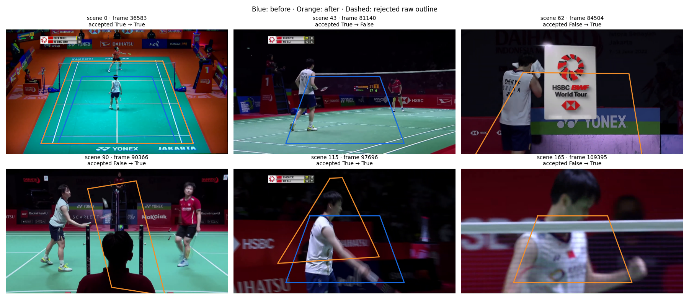
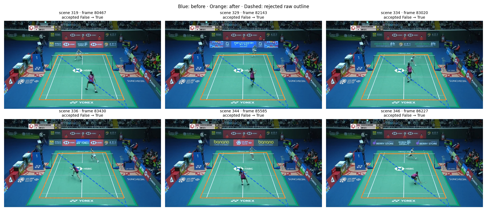

# Court geometry repair: evidence and reproduction

The saved evidence supports checking the [issue #148 results](../../../scratch/court_det_fix/evidence/retirement/README.md)
from saved before/after outputs. It includes court and contact results, separate
court-geometry checks and the contact model used for the comparison. The fitted
models stayed fixed, so these results measure changes in the inputs and processing
around them rather than a retraining.

[Reproduction commands and inputs](#reproduction)

The saved-output checks below require no videos or GPU.
The [pipeline reproduction recipe](#reproduction) lists the larger inputs needed
to regenerate detections, annotations and model predictions.

The files described below are in
[`court_geometry_repair/`](../court_geometry_repair/).

## What is included

| Location | Contents and purpose |
| --- | --- |
| `evidence/video_17/`, `evidence/video_53/` | Baseline and final court evidence, contact/rally streams, run metadata and player-selection probes; `expected.json.gz` holds the reported scores |
| `evidence/controls/video_3/`, `evidence/controls/video_21/` | Old and repaired court estimates for the same frames, neural predictions, detected court lines, reference corners and expected errors |
| `evidence/labels/` | The saved clean contact/rally labels for ShuttleSet22 videos 17 and 53 |
| `evidence/followup.json.gz` | Retained grouping, fresh-broadcast, player-feature and painted-line pilot outputs; scope below |
| `models/` | Unchanged contact model and its original training/settings records; the other frozen selection models already live in the repository |
| `scripts/` | Saved-output checks and the cleaned experiment entry points |
| `figures/` | Two sheets of **prototype** comparison images, explained below |

JSON and CSV records are gzip-compressed. Court corners use the recorded image
resolution; the geometry controls use 1280×720 reference pixels. Scene intervals
are half-open: the start frame is included and the end frame is excluded.

The baseline represents saved production evidence at `a111181`. Source changes
are recorded in `87f66e7` and `2b486d5`. The final pipeline records here come from
the completed runs after the replay-mask correction. Earlier failed integration
outputs are excluded from the numerical results.

## Check the saved results

The commands run from the repository root in its Python environment. The
scripts use the project dependencies and existing scoring functions.
The [CPU CI setup](../../../docs/ci.md) provides a suitable starting point for
these saved-output checks. The frozen-model rerun needs the older versions
listed separately in [REPRODUCE.md](#inputs-and-environment).
They compare recomputed results with the supplied expected records and fail on
a mismatch.

```bash
export PYTHONPATH="$PWD/src:$PWD"
BUNDLE="$PWD/experiments/annotator/court_geometry_repair"
OUT="$(mktemp -d)"

for VIDEO in 17 53; do
  python "$BUNDLE/scripts/evaluate_court_comparison.py" \
    --video-id "$VIDEO" \
    --baseline "$BUNDLE/evidence/video_$VIDEO/before" \
    --changed "$BUNDLE/evidence/video_$VIDEO/after" \
    --labels-root "$BUNDLE/evidence/labels" \
    --expected "$BUNDLE/evidence/video_$VIDEO/expected.json.gz" \
    --output "$OUT/video_$VIDEO.json.gz"
done

python "$BUNDLE/scripts/check_geometry.py"
python "$BUNDLE/scripts/check_followup.py"
```

The contact checks cover both ±10-frame and ±5-frame matching at 30 fps.
With a ±10-frame allowance, video 17 keeps its 17 fully correct rallies.
Video 53 improves from 7 to 35. **All previously correct rallies remain correct.** The report explains
the denominators and the precision loss on video 17.

Separate geometry checks use original-ShuttleSet videos 3 and 21. In video 3,
seven scene outlines disagreed with the outlines accepted in other scenes.
The checker rebuilds replacements for those seven using the median corner
positions from the other accepted scenes. It then checks that the replacements
fit the detected painted court lines better than the original outlines.
Video 21 needed no repairs: all 45 original outlines were kept.

The final corner positions are compared with each video's reference court at
an image size of 1280 × 720 pixels:

| Video | Scenes with an accepted court | Outlines repaired | Average distance from a predicted corner to its reference corner |
|---|---:|---:|---:|
| 3 | 46 / 47 | 7 | 5.17 pixels |
| 21 | 45 / 45 | 0 | 4.74 pixels |

These checks reproduce the reported calculations from saved outputs. Testing
the full production path—including how it selects source scenes and uses player
detections to accept courts—requires the separate pipeline reproduction. New
footage would require its own evaluation.

## Checks performed for this bundle

Both saved-stream evaluations matched the supplied expected records. The two
geometry checks also passed. The failure checks also worked: the scripts rejected an incorrect expected
contact count and a repaired court with missing line evidence.
The new scripts passed syntax, CLI and scoped lint checks.

The cleaned preparation and scoring scripts were also run on all 119,849 frames
of video 53. That earlier rerun rebuilt the before/after annotations and features from
saved detection outputs, then applied the unchanged fitted models. It matched
the expected result at both timing tolerances. The neural detections were reused
while checking that the packaged scripts could reproduce the result.

The whole-project type check still reported the same 11 existing import errors.
Production source was unchanged while packaging this bundle.

## Retained follow-up evidence

`evidence/followup.json.gz` collects 31 later output files under their original
filenames. It preserves the measured values while shortening local and remote
paths to filenames. The records are grouped here by the question they help
check:

| Records | Evidence |
|---|---|
| Video 17/53 grouping outputs, rally evaluations and player-feature summaries | How court sharing changed geometry and annotation on the two problem videos. |
| Original-data matching, sharing-guard comparisons and pooled-fit summaries | Which scene estimates were grouped and how the alternative fits behaved. |
| Full before/after court payloads, masks and review summaries for videos 8/9/10 | What happened on the fresh-video checks. |
| The 26-scene painted-line pilot | How well proposed outlines followed the detected court markings. |
| `mask_runs` | Which frames were flagged before and after each change, recorded as start-inclusive, end-exclusive ranges alongside the frame count. These ranges were checked against the original masks before packaging. |

These are the saved outputs of the historical revisions. The check script
recalculates their reported comparisons; reproducing them with current code
requires the separate pipeline recipe.

`check_followup.py` checks how many scenes have accepted courts and how many
share an outline. It verifies that scenes in the same sharing group use exactly
the same corners.

To measure how much the original scene estimates disagreed, it takes the same
105 image points and maps them onto the court using each scene's original
calibration. It compares the resulting on-court positions and also measures
the largest difference between corresponding corners. This uses the saved group
median and the original repaired corners in `evidence/video_{17,53}/after/`.

For the fresh-video checks, it compares the before/after court records while
ignoring only their `case_id` labels, then compares the frame masks. For the
painted-line pilot, it first takes each line's median coverage across frames,
then averages the lines in each direction group. The fields `mean_x_family`
and `mean_y_family` average all samples directly, which is a different calculation.

Other archived summaries can be inspected directly by their source keys. Source
videos, decoded images and full player arrays remain external. The archive records what the earlier visual review concluded. Checking those
judgements again requires the source images; rerunning the full experiments
also requires the external video and player data.

## Selected visual evidence

These images show an early prototype that fitted courts scene by scene. It
predates the final rule that checks the outline against painted court lines.
Blue shows the old outline and orange the prototype outline; dashed outlines
were rejected. The captions identify which example scenes the final run accepted or rejected.

### Preserved view and false close-ups — ShuttleSet22 video 17

The opening court is correctly restored in the top-left panel. Several other
panels show false courts on close-ups. The final run rejects scenes 62, 90, 115
and 165 shown here; its decisions are in `evidence/video_17/after/court_evidence.json.gz`.



### Boundary recovery — ShuttleSet22 video 53

The top-right panel is the reported scene 334. The old fallback follows a
diagonal; the recovered outline follows the painted court. Scene and frame
identifiers in every panel allow a reader to locate the underlying records.
These six scenes also survive final acceptance.



## Provenance and limits

Numerical evidence retains the recorded measurements. Machine-specific source
paths in control metadata were replaced by video filenames and public input
references. Control interval CSVs were reconstructed from the saved intervals.
The saved model records keep their original contents so the existing model
loader can read them. The figures are unchanged excerpts from the original
comparison images, using ShuttleSet22 broadcast footage.

The clean labels are a two-video subset of the earlier frozen evaluation's
ShuttleSet22 label record. They retain its frame coordinates, rally membership
and player sides. The source annotation project is
[CoachAI ShuttleSet22](https://github.com/wywyWang/CoachAI-Projects/tree/main/CoachAI-Challenge-IJCAI2023/ShuttleSet22).

The reference court templates apply to their matching wide camera views. The
video 3 and 21 checks test the court geometry; a full annotation run would also
need to repeat player-based court acceptance and rally detection. The
ShuttleSet22 videos 17 and 53 were chosen because their failures were already
known, so their improvements describe those cases rather than unseen footage.

Grouping repeated matching views and evaluating partial courts remain next
steps, as described in the [investigation trail](../../../scratch/court_det_fix/evidence/retirement/README.md).

## Reproduction

The [saved-output checks](#check-the-saved-results) are the quickest
way to evaluate the published evidence. This recipe regenerates the heavier
court-dependent pipeline with the same frozen models.

### Inputs and environment

The source implementation
measured by the report is `2b486d5`; the baseline evidence is from `a111181`.
The experiment scripts retain the comparison logic while accepting portable
input locations. All commands run from the repository root.

| Input | Required contents |
| --- | --- |
| `SOURCES` | Original ShuttleSet22 MP4s for videos 17 and 53 |
| `PREPARED` | Matching per-video directories containing the original `court_evidence.json.gz`, `court_receipt.json.gz` and pose arrays |
| `INPAINTED` | Matching per-video directories containing `shuttle_track_inpainted.npy.xz`, its guard codes and sidecar |
| Repository | CourtKeyNet weights, existing selection-model files and the evaluation code imported by the scripts |
| Bundle `models/` | Frozen contact model and fit/setting receipts |

The source basenames are:

- `17 CHEN_Yu_Fei_HE_Bing_Jiao_DAIHATSU_Indonesia_Masters_2022_Semifinals.mp4`
- `53 AN_Se_Young_Pornpawee_CHOCHUWONG_Korea_Open_Badminton_Championships_2022_Finals.mp4`

Prepared and inpainted directories use the same basenames without `.mp4`.
Both ShuttleSet22 sources must be 1920×1080 at 30 fps; preparation rejects other
formats because the frozen scorer assumes those dimensions and frame rate.
The pose files are `pose_kps.npy.xz`, `pose_bboxes.npy.xz`, `pose_scores.npy.xz`,
`pose_kp_scores.npy.xz` and `pose_ndet.npy.xz`. Preserve the original frame
alignment. Replacing these arrays with a fresh pose/shuttle extraction is a
new experiment rather than an exact rerun of the paired comparison.

The large video, pose and shuttle inputs are not distributed in this Git bundle.
Their absence does not prevent the saved-output checks. This bundle does not
currently provide a separate downloadable archive of those prepared inputs.

The frozen contact loader requires the recorded versions: Python 3.11.13,
NumPy 2.2.6, scikit-learn 1.6.1 and joblib 1.5.3. OpenCV, PyTorch and CourtKeyNet
also require the project's inference dependencies. The original detector
runs used CUDA and `resize_mode="pad"`; other detector options used the defaults
at the measured revision. No tree-model fitting or tuning occurs in this recipe.

### Prepare the frozen contact model

`SOURCES`, `PREPARED` and `INPAINTED` identify the input directories listed above.
`OUT` is a fresh output directory. `MODEL_REPO` points to this checkout, which
contains the other selection models.

```bash
export PYTHONPATH="$PWD/src:$PWD"
BUNDLE="$PWD/experiments/annotator/court_geometry_repair"
MODEL_REPO="$PWD"
OUT="$(mktemp -d)"
mkdir -p "$OUT/contact_model"
cp "$BUNDLE/models/contact_model.joblib" "$OUT/contact_model/"
gzip -dc "$BUNDLE/models/final_contact_model_result.json.gz" \
  > "$OUT/contact_model/final_contact_model_result.json"
gzip -dc "$BUNDLE/models/final_contact_setting_result.json.gz" \
  > "$OUT/contact_model/final_contact_setting_result.json"
```

The model loader verifies its existing receipt identities and runtime versions.
The saved run metadata lists the opening, later and local selection-model paths
and the fixed policy file. Those versions define the comparison.

The historical measured report was produced from source revision `2b486d5`
with the public evidence bundle at `c9dc6ac`. The commands below run the
current checkout against the same kind of frozen inputs; current output is not
expected to reproduce every historical score exactly. The saved evidence
provides the reference for assessing differences.

### Regenerate annotations and predictions

For each video, first sample the recorded scene frames and regenerate neural
court predictions. Current fallback outputs include the finite line fragments
needed by the acceptance rule. The original experiment added those fragments
to cached predictions in a separate step; the current producer includes them.
The scene cache also records the lossless image view summary and retained
alternative corners required by current grouping and final validation. The
preparation step rejects older or incomplete cache records with a regeneration
message; rerun `rebuild_scene_courts.py` instead of silently replaying a
historical cache without those fields. Cached frame dimensions must match the
source video used for replay; thumbnail dimensions are a separate check.

```bash
for VIDEO in 17 53; do
  python "$BUNDLE/scripts/rebuild_scene_courts.py" \
    --prepared-root "$PREPARED" --sources "$SOURCES" \
    --video-ids "$VIDEO" --device cuda --output "$OUT/nn_$VIDEO"

  for ROLE in before after; do
    BASELINE_ARGS=()
    if [ "$ROLE" = before ]; then
      BASELINE_ARGS=(--baseline)
    fi
    python "$BUNDLE/scripts/prepare_court_comparison.py" \
      --prepared-root "$PREPARED" --inpaint-root "$INPAINTED" \
      --sources "$SOURCES" --nn-results "$OUT/nn_$VIDEO" \
      --video-id "$VIDEO" --output "$OUT/${ROLE}_$VIDEO" \
      "${BASELINE_ARGS[@]}"
    python "$BUNDLE/scripts/score_court_comparison.py" \
      --prepared "$OUT/${ROLE}_$VIDEO" --model-repo "$MODEL_REPO" \
      --contact-model-dir "$OUT/contact_model" --video-id "$VIDEO" \
      --output "$OUT/${ROLE}_${VIDEO}_scores" "${BASELINE_ARGS[@]}"
  done

  python "$BUNDLE/scripts/evaluate_court_comparison.py" \
    --video-id "$VIDEO" --baseline "$OUT/before_${VIDEO}_scores" \
    --changed "$OUT/after_${VIDEO}_scores" \
    --labels-root "$BUNDLE/evidence/labels" \
    --output "$OUT/video_${VIDEO}_evaluation.json.gz"
done
```

Baseline mode loads the saved old court evidence and restores the old global
tracking and perspective-mask behaviour within the experiment process. Final
mode uses the repaired scene-specific pipeline. Both regenerate annotations and
features before applying the same models. This is a reconstruction of the
baseline, not a checkout-wide execution of historical source.

The comparison targets are `evidence/video_17/expected.json.gz` and
`evidence/video_53/expected.json.gz` within `court_geometry_repair/`. The original
reconstructed baselines matched the saved contact and section records. Fresh
neural inference can vary with the runtime or source decoding.

### Rerun the original ShuttleSet geometry controls

These controls use original ShuttleSet videos 3 and 21, distinct from the
ShuttleSet22 video numbering above. Their exact filenames and frame metadata
are recorded in each control's `comparison.json.gz`.

This command exports the old fallback from Git and runs both implementations
on the same freshly sampled frames and neural outputs:

```bash
git show a111181:src/courtkeynet/court_corners.py \
  > "$OUT/baseline_court_corners.py"

# VIDEO=21 uses its corresponding MP4.
VIDEO=3
python "$BUNDLE/scripts/rebuild_control_courts.py" \
  --video "$CONTROL_VIDEO" --video-id "$VIDEO" \
  --scenes-csv "$BUNDLE/evidence/controls/video_$VIDEO/scenes.csv.gz" \
  --homography-csv data/shuttleset/set/homography.csv \
  --baseline-module "$OUT/baseline_court_corners.py" \
  --device cuda --output "$OUT/control_$VIDEO"
```

`CONTROL_VIDEO` must name the corresponding original ShuttleSet MP4. Frames
are resized to 1280×720 with `INTER_AREA`. This command reproduces the boundary
comparison before donor repair. The saved control checker separately evaluates
the recorded donor candidates and painted-line evidence behind the final
geometry table; it requires no source video.
