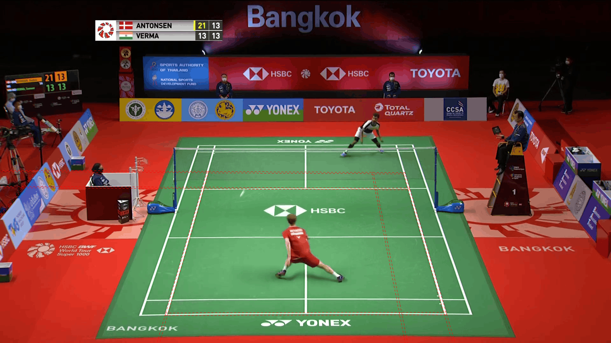
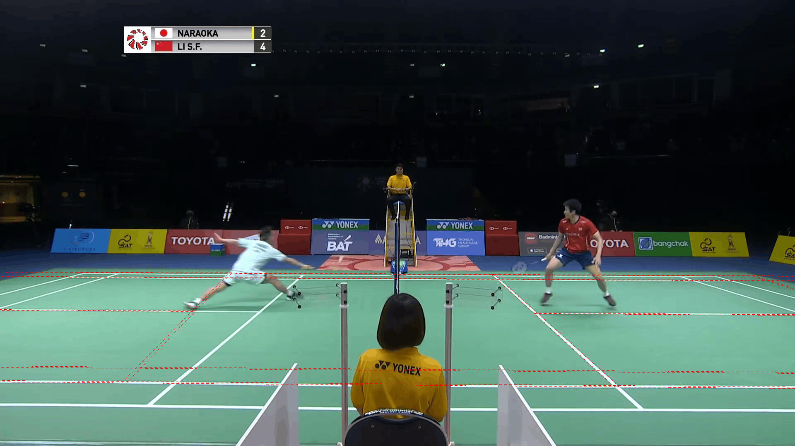

# Eight courts with large reference disagreements

These original detections were selected because their corners lay far from the
official main-camera corners. There are four examples from each dataset, all
sampled during labelled rallies. Some show other camera angles, where those
labels cannot judge the predicted court.

The [results report](../../report.md) compares the original and repaired results.

## sset_30, frame 82096

Average corner difference from the main-camera reference: **974.0 px**;
worst corner: 2341.2 px (at 1280 × 720).

## sset_21, frame 88834

Average corner difference from the main-camera reference: **828.8 px**;
worst corner: 1462.0 px (at 1280 × 720).

The normal match view is visible. The predicted far baseline sits on the advertising, and the predicted court extends beyond the near baseline.

## sset_06, frame 83803

Average corner difference from the main-camera reference: **668.1 px**;
worst corner: 1453.9 px (at 1280 × 720).

This is a low camera angle, unlike the default reference view. The overlay follows several visible court markings. Its large reference error does not establish a failed prediction.

## sset_26, frame 83161

Average corner difference from the main-camera reference: **497.1 px**;
worst corner: 1088.0 px (at 1280 × 720).

The normal match view is visible. The predicted court is skewed and extends far to the right.

## ss22_54, frame 56533

Average corner difference from the main-camera reference: **1177.9 px**;
worst corner: 2337.9 px (at 1280 × 720).

The predicted far baseline lies on the advertising and the court extends beyond the near baseline. A neighbouring court is also visible.

## ss22_16, frame 72836

Average corner difference from the main-camera reference: **1113.2 px**;
worst corner: 2072.5 px (at 1280 × 720).

The normal match view is visible. The predicted far baseline lies on the advertising and the court extends beyond the near baseline.

## ss22_41, frame 91230

Average corner difference from the main-camera reference: **759.5 px**;
worst corner: 1469.1 px (at 1280 × 720).

The predicted far baseline lies above the visible court and the court extends beyond the near baseline.

## ss22_43, frame 18505

Average corner difference from the main-camera reference: **717.6 px**;
worst corner: 988.1 px (at 1280 × 720).

