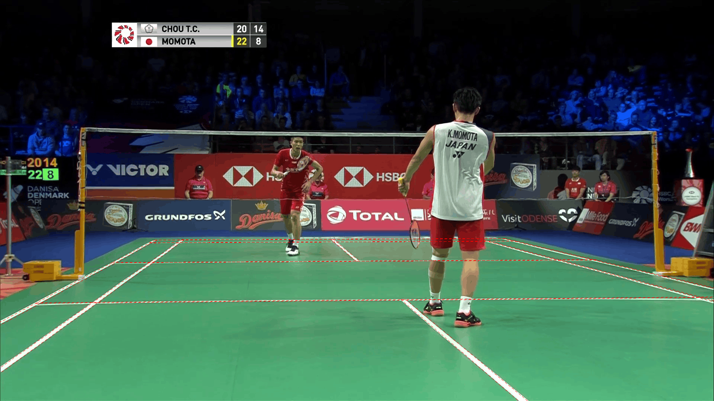
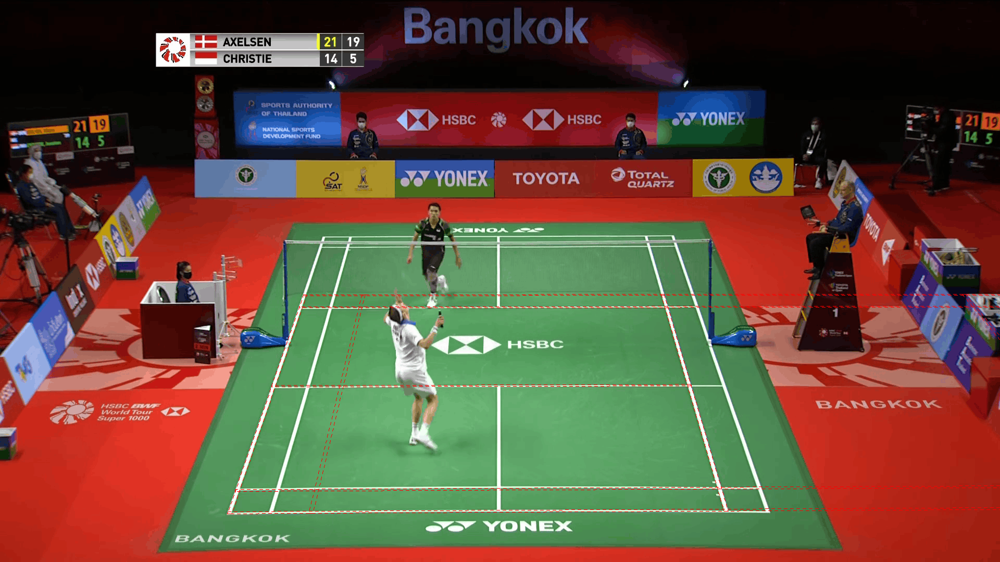
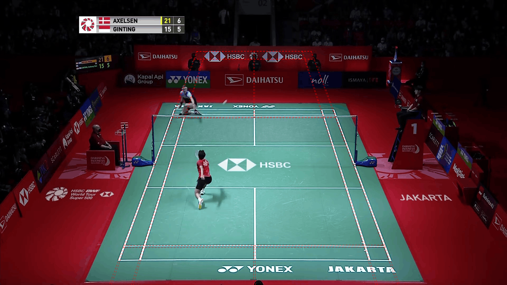

# Eight hard court predictions

Four per dataset, from different videos. These are the largest reference disagreements among eligible sampled scenes. Every sampled frame is within a usable labelled rally. The scene has the greatest overlap with at least one rally. A different camera view can invalidate the static reference; large numerical error alone is not proof of a bad fit.

See the [report](../README.md) for the full evaluation.

## sset_30, frame 82096

sset_30 frame 82096: disagreement example, not a proven detector error. Labelled rallies that fall mostly in this scene: 1. Its court is 974.0 px from the official corners on average (largest 2341.2 px, overlap 0.07) at 1280x720. The official corners are one static set per match.

## sset_21, frame 88834

sset_21 frame 88834: disagreement example, not a proven detector error. Labelled rallies that fall mostly in this scene: 1. Its court is 828.8 px from the official corners on average (largest 1462.0 px, overlap 0.11) at 1280x720. The official corners are one static set per match.

Visual check: the normal match view is visible. The predicted far baseline sits on the advertising, and the predicted court extends beyond the near baseline.

## sset_06, frame 83803

sset_06 frame 83803: disagreement example, not a proven detector error. Labelled rallies that fall mostly in this scene: 1. Its court is 668.1 px from the official corners on average (largest 1453.9 px, overlap 0.20) at 1280x720. The official corners are one static set per match.

Visual check: this is a low camera angle, unlike the default reference view. The overlay follows several visible court markings. Its large reference error does not establish a failed prediction.

## sset_26, frame 83161

sset_26 frame 83161: disagreement example, not a proven detector error. Labelled rallies that fall mostly in this scene: 1. Its court is 497.1 px from the official corners on average (largest 1088.0 px, overlap 0.36) at 1280x720. The official corners are one static set per match.

Visual check: the normal match view is visible. The predicted court is skewed and extends far to the right.

## ss22_54, frame 56533

ss22_54 frame 56533: disagreement example, not a proven detector error. Labelled rallies that fall mostly in this scene: 1. Its court is 1177.9 px from the official corners on average (largest 2337.9 px, overlap 0.06) at 1280x720. The official corners are one static set per match.

Visual check: the predicted far baseline lies on the advertising and the court extends beyond the near baseline. A neighbouring court is also visible.

## ss22_16, frame 72836

ss22_16 frame 72836: disagreement example, not a proven detector error. Labelled rallies that fall mostly in this scene: 1. Its court is 1113.2 px from the official corners on average (largest 2072.5 px, overlap 0.07) at 1280x720. The official corners are one static set per match.

Visual check: the normal match view is visible. The predicted far baseline lies on the advertising and the court extends beyond the near baseline.

## ss22_41, frame 91230

ss22_41 frame 91230: disagreement example, not a proven detector error. Labelled rallies that fall mostly in this scene: 1. Its court is 759.5 px from the official corners on average (largest 1469.1 px, overlap 0.11) at 1280x720. The official corners are one static set per match.

Visual check: the predicted far baseline lies above the visible court and the court extends beyond the near baseline.

## ss22_43, frame 18505

ss22_43 frame 18505: disagreement example, not a proven detector error. Labelled rallies that fall mostly in this scene: 1. Its court is 717.6 px from the official corners on average (largest 988.1 px, overlap 0.26) at 1280x720. The official corners are one static set per match.

