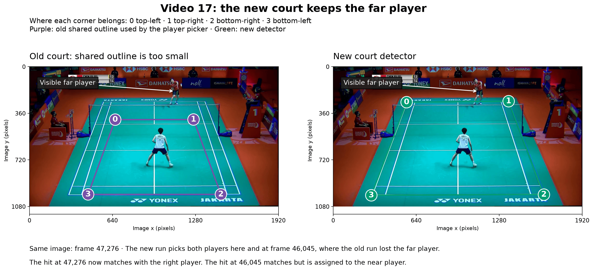

# Court checks: the old failures are fixed; coverage is the remaining gap

**Both earlier court failures are fixed in the checked scenes, but 1,620 of the 2,984 remaining misses are still in scenes the court stage rejected.** Outside video 53, that count has barely moved: 1,602 now against 1,640 before.

**Contents**  
[How the gate works now](#how-the-gate-works-now)  
[How much error is still upstream](#how-much-error-is-still-upstream)  
[Video 53: the scene is accepted](#video-53-the-scene-is-accepted)  
[Video 17: the far player is back, but sides still fail](#video-17-the-far-player-is-back-but-sides-still-fail)  
[Why scenes are still rejected](#why-scenes-are-still-rejected)  
[What the footage shows](#what-the-footage-shows)  
[What these checks prove](#what-these-checks-prove)  
[Evidence](#evidence)

## How the gate works now

For each scene, the new detector first tries courts found earlier in the same video, then searches. It commits to a court only when a candidate passes its checks, and those checks use where detected players stand. When nothing passes, the scene has no court. A court can also be refused after its final refit, for example when the implied camera position is implausible.

The two-player vote is unchanged. A scene passes when at least half its frames have exactly two detected people on the court. Only then does it reach player tracking and contact search.

So a scene can still be removed before the contact model sees it, either because no court was found or because the vote failed.

## How much error is still upstream

The 46 videos contain 37,184 cleaned contact labels. The new model matches 34,200 and misses 2,984.

| State at the labelled frame | Old courts: missed | New courts: missed |
|---|---:|---:|
| Court rejected | 2,374 | **1,620** |
| Court accepted; a player pick missing | 96 | 29 |
| Court accepted; both players picked | 1,163 | 1,335 |
| **Total** | **3,633** | **2,984** |

At 1,499 of the 1,620 court-rejected misses, no scored candidate exists within ±10 frames. A later sequence model cannot choose a contact that never entered scoring.

Most of the drop comes from one video. Remove video 53 and 1,602 of 2,927 remaining misses are still in rejected scenes (54.7%). The old figure was 1,640 of 2,891 (56.7%).

The rest of the drop cancels out. The new courts rescue 1,367 labelled hits, 717 of them in video 53. They also newly reject 588 hits across 33 videos that the old courts accepted. [Court comparison](court_comparison.md#same-label-contact-comparison) has the full table.

## Video 53: the scene is accepted

The checked scene now passes the two-player vote in 98.7% of its frames. The earlier replay predicted this: swapping in a better outline passed 315 of 319 frames. Eleven of the scene's 12 labelled hits now match with the right player; the old run matched none.

Across the whole video, matched hits rise from 195 to 880 of 937, and complete rallies from 7 to 32 of 76. Eighteen of its remaining 57 misses are in rejected scenes.

Video 53 now looks like an ordinary video on hits. Its rally rate, 42.1%, is still below the median of 52.2%.

## Video 17: the far player is back, but sides still fail

At both checked frames, 47,276 and 46,045, the new run picks the visible far player. The hit at 47,276 now matches with the right player. The hit at 46,045 matches but is assigned to the near player.

Video 17 has no misses with a missing player pick; the old run had 80. Its complete rallies rise only from 17 to 20 of 73.

The player errors remain. **208 of its 209 wrong or missing sides sit in scene 0**, a single scene record covering frames 0–73,167, about the first 40 minutes. In that scene 458 of 553 labelled hits match, but only 250 have the right player; the old run had 429 and 229. One court and one net position serve that whole span. The next check is whether the camera view changes inside it.

Video 42 has the second-most side errors, 99, but they are spread across many scenes. It needs a separate look.

## Why scenes are still rejected

| Reason at the missed hit | Missed hits |
|---|---:|
| No candidate court passed the detector's checks | **919** |
| Court found; two-player vote failed | **457** |
| Scene too short to check player feet | 98 |
| Refitted court implied an implausible camera | 91 |
| Other refit or search failures | 55 |
| **Total** | **1,620** |

The [detector audit](detector_audit.md#the-court-stage) traces the two largest groups. 888 of the 919 no-court misses are in scenes the detector dropped before searching. Its 3-second player check sat at the scene's middle frame, mostly between rallies. 286 of the vote failures carry a court far larger than the frame.

The rejected scenes are not brief cutaways. The misses sit in 339 scenes across 45 videos. Half those scenes run longer than 16 seconds, and 91% of the misses are in scenes longer than ten.

The vote failures are not near misses. The median scene had exactly two people on court in 19% of its frames, against 50% needed. Lowering the cutoff to 40% would reach scenes holding only 81 of the 457 misses.

Rejected misses concentrate in a few videos: 38 (140), 21 (114), 11 (108), 25 (92) and 20 (80).

## What the footage shows

Nine of the [24 randomly sampled misses](video_checks.md#random-missed-contact-sample) sit in rejected scenes: six where no court passed the checks and three where the two-player vote failed. All nine labelled frames show full-court live play, with all four court corners and both players in view. In every one, the labelled player hits at the labelled time.

So the rejections in this sample are not replays, close-ups or cutaways. The court stage is blocking valid labelled hits in ordinary play.

The three vote failures are in videos 26, 38 and 52. Both players were on court at the checked frame in each. The vote measures the whole scene, so one frame cannot say why it failed. It does show that the scene holds normal play.

## What these checks prove

They show that:

- the two earlier geometry failures are fixed in the checked scenes;
- rescued scenes yield matched hits at nearly the normal rate: 1,278 of 1,367;
- outside video 53, the court stage blocks about as many misses as before;
- the new detector rejects some scenes the old one accepted, and those hits are all lost;
- video 17's remaining failure is player side, not court rejection.

The next court question is coverage: why the detector finds no court, or the vote fails, in long scenes that show play.

Live work: [promising_leads.md](promising_leads.md).

## Evidence

- `results/contexts.csv.gz` — new court and player state at each labelled frame
- `results/scenes.csv.gz` — new scene records, status and two-player vote
- `results/court_change_groups.json.gz` — old-versus-new court decisions per label and rally
- `raw/run/output/shared/court/test/<video>/court_evidence.json.gz` — new court records (local, ignored)
- `raw/player_state/<video>.npz` — rerun player picks, identical to the saved streams (local, ignored)
- `../annotator_wrapup_evaluation/results/visual_geometry.json.gz` — old outlines drawn in the two figures

Commands: [evaluation_reproduction.md](evaluation_reproduction.md).
