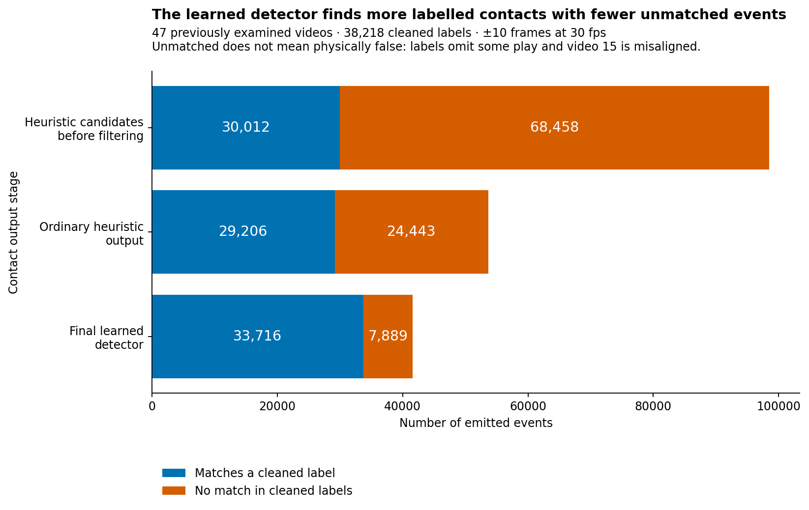
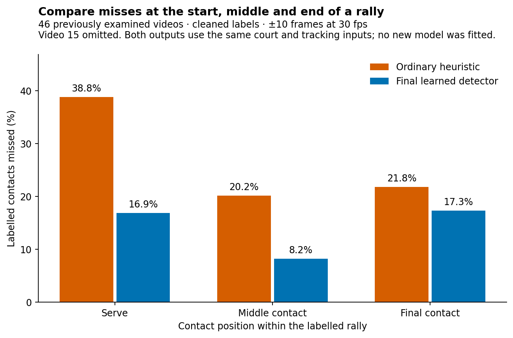

# What the ordinary heuristic annotator produces

The ordinary heuristic finds many individual contacts, but very few exact rally
sequences. Across the same 47 previously examined videos, it supplies **four fully
correct rallies out of 3,422 cleaned labelled rallies**. The final learned detector
supplies 1,763. Both use the same cached court, pose and shuttle inputs.

This evaluation asks where the ordinary heuristic succeeds and fails before the
learned contact chooser is applied. It reuses saved end-to-end annotation outputs.
There was no vision-model rerun, new fit or change to the detector.

A contact is one predicted hit. A timing match places it within the allowed number
of frames of a labelled hit. A fully correct rally needs a clip containing the whole
labelled rally, every contact
matched once, no extra contact, and the correct player. The main allowance is ±10
frames at 30 fps. Results below use cleaned labels unless another population is named.
The cleaned set contains 38,218 contacts in 3,422 rallies. The all-source check uses
43,159 contacts in 3,965 rallies. All 47 videos have been examined before; this is a description of saved output, not
a new generalisation test.

## Why this is the ordinary output

The broader prediction job first ran the shipped annotation stage with its default
configuration. It saved that result before creating features for the learned model.
Those files retain the heuristic's candidate contacts, final filtered contacts,
rally spans and native fitted player sequence.

The relaxed impulse and wrist settings belong to the later feature-region search.
They widen where the learned model can look. They do not replace the saved ordinary
heuristic contact stream. The stage called “original” in the closing-pass comparison
is also a learned detector, so it would be the wrong baseline here.

This report separates two saved outputs:

- **Heuristic candidates before filtering:** every raw contact candidate. These are
  a diagnostic stage, not the ordinary delivered annotation.
- **Ordinary heuristic output:** contacts kept by the heuristic's wrist, nearby-event
  suppression and exclusion checks. This is the primary end-to-end comparison.

Player scores use the heuristic's own saved fitted first-player side, alternated over
its saved filtered sequence. No learned-stage side rule or selection policy was applied.
Raw candidate rows have no native per-contact side, so their comparison is timing-only.

All 47 receipts identify the same producer commit. The relevant annotation code and
defaults are unchanged from that producer. Loading and scoring the saved files took
about **7.4 minutes**, after a 22-second one-video smoke check. No expensive reconstruction
was necessary.

## How much does filtering help?

Filtering removes many unmatched candidates, but the remaining contact sequence still
contains too many extras for exact rally annotation.

| Output stage | Events emitted | Cleaned labels matched | Labels matched | Emitted events matching a label |
|---|---:|---:|---:|---:|
| Heuristic candidates before filtering | 98,470 | 30,012/38,218 | 78.5% | 30.5% |
| Ordinary heuristic output | 53,649 | 29,206/38,218 | 76.4% | 54.4% |
| Final learned detector | 41,605 | 33,716/38,218 | 88.2% | 81.0% |

The last two columns ask different questions. The first asks how many labelled hits
are found. The second asks how much of the emitted output has a label match.

The ordinary gates remove 44,821 candidates: 12,415 fail the wrist check and 32,406
are removed by nearby-event suppression. Across these saved files, those removals account for
the full raw-to-filtered difference. Matching the labels again loses 806 timing matches.
The number of unmatched events falls from 68,458 to 24,443.

This is useful filtering, but 24,443 unmatched events remain against the cleaned
labels. An unmatched event is not necessarily a physically false hit. Cleaning omitted
some rallies, and video 15 has a confirmed label-to-footage mismatch. Using all source
labels reduces the ordinary output's unmatched count to 21,101.

## Why are there only four fully correct rallies?

Whole-rally correctness is demanding because one extra event is enough to fail an
otherwise good clip. Only five ordinary heuristic clips contain exactly the full
labelled contact sequence at ±10 frames. Four also have the correct players.
The fifth has the wrong player sequence.

| Check | Ordinary heuristic | Final learned detector |
|---|---:|---:|
| Fully correct cleaned rallies, ±10 frames | 4/3,422 | 1,763/3,422 |
| Fully correct cleaned rallies, ±5 frames | 3/3,422 | 1,430/3,422 |
| Fully correct all-source rallies, ±10 frames | 4/3,965 | 1,763/3,965 |
| Fully correct all-source rallies, ±5 frames | 3/3,965 | 1,429/3,965 |

All four primary heuristic successes also succeed in the final learned output.
The learned output adds 1,759 fully correct cleaned rallies without losing those four.
At the tighter ±5-frame allowance, two of the three native successes stay correct
and one does not. The overall gain therefore does not preserve every success under
every timing rule.

This comparison includes the final system's contact choices, player handling and clip
boundary adjustments. It does not isolate the effect of one model component.

The four successful heuristic sequences contain 2, 5, 3 and 10 labelled contacts,
in videos 21, 31, 37 and 50 respectively. The ten-contact example shows that success
is possible beyond very short exchanges. It remains rare in this saved collection.

Across the heuristic's 3,982 proposed clips, the cleaned-label judgement is four
correct, 3,035 wrong and 943 unknown. Unknowns remain visible because absent or incomplete
labels do not justify a failure judgement by themselves.

The known wrong clips have overlapping problems:

| Problem | Wrong clips affected |
|---|---:|
| Extra contacts | 2,899 |
| Missing contacts | 2,358 |
| Wrong player on a matched contact | 2,024 |
| Clip cuts off part of the labelled rally | 454 |
| Clip overlaps several labelled rallies | 70 |

The most common combination is missing contacts, extras and wrong matched players,
in 1,516 clips. Another 412 have extras alone, and 370 have missing and extra contacts
without the other listed problems. The complete combinations are in
[the result table](results/heuristic_error_combinations.csv.gz).

Among clips that overlap exactly one cleaned rally, the median clip has two missing
contacts and four extras. Only 70 of these clips have no extra event. This explains
why a reasonably high contact-matching rate does not translate into many exact rallies.

## Does the learned output simply keep every heuristic success?

At the individual-contact level, no. Outside misaligned video 15, the comparison is:

| Timing result for the same cleaned contact label | Contacts |
|---|---:|
| Both outputs match it | 28,351 |
| Only the learned output matches it | 5,200 |
| Only the ordinary heuristic matches it | 660 |
| Neither matches it | 2,973 |

The learned output gains 5,200 matches and loses 660, for a net gain of 4,540.
These are labels matched under the same ±10-frame rule. They are not independently
verified physical repairs and regressions.

Across all 47 videos, the corresponding counts are 28,486 shared matches, 5,230
learned-only matches, 720 heuristic-only matches and 3,782 misses in both outputs.
The [paired table](results/heuristic_paired_contacts.csv.gz) retains both populations
and both timing allowances.

## Where do contacts fail within a rally?

Serves show the largest gap: the ordinary heuristic misses 1,292/3,327 (38.8%),
compared with 561/3,327 (16.9%) for the learned output. For middle contacts, the missed
rates are 20.2% versus 8.2%; for final contacts, 21.8% versus 17.3%.

The figure uses the same cleaned labels outside video 15 for both systems. It counts
misses across the full output, including times blocked upstream. Single-contact rallies
count as serves only. The [position table](results/heuristic_position.csv.gz) also keeps
the all-video results and the tighter ±5-frame check.

Tightening the allowance on all 47 videos reduces ordinary timing matches from 29,206
to 27,466. That loses 1,740 matches. The final learned output loses 744 under the same
change. Ordinary heuristic timing is therefore more sensitive to the allowance as well
as missing more contacts overall.

## How much of the problem is upstream?

Court and tracking failures affect both systems, but they make up different shares
of each system's remaining misses.

Outside video 15, the ordinary heuristic misses 8,173 cleaned labels. The final
learned output misses 3,633. Each column groups its misses by the saved input state:

| Saved input state | Ordinary heuristic misses | Final learned detector misses |
|---|---:|---:|
| Court rejected | 2,541 | 2,374 |
| Court accepted; at least one player pick missing | 69 | 96 |
| Court accepted; both players picked | 5,563 | 1,163 |
| **Total misses** | **8,173** | **3,633** |

Court-rejected frames account for 31.1% of ordinary misses, compared with 65.3% of
learned-output misses. The court inputs did not improve between those columns.
The learned output removes many more errors where inputs are available, leaving the
shared court problem as a larger fraction of its remaining errors.

The missing-player row also needs care. A player pick missing at the exact labelled
frame does not force both contact methods to miss within the whole timing window.
Its 69 versus 96 counts are not evidence that the learned model damaged tracking.
They compare different final contact choices against the same saved player inputs.

The earlier visual checks still establish useful upstream mechanisms: some rejected
scenes show ordinary match play, and a shared court outline loses a clearly visible
far player in two inspected cases. Those checks used the same upstream evidence.
Their samples were chosen around learned-detector failures and controls; they are not
a new representative sample of heuristic errors.

The [expanded report](REPORT_BIG.md#what-happens-before-contact-scoring) explains the
court checks and their limits. This comparison did not repeat them or claim a new
population-wide false-rejection rate.

## How reliable are the heuristic's player assignments?

Among the ordinary output's 29,205 timing matches with known target sides, 20,204
have the right side: 69.2%. The final learned output has the right side on 32,667 of
33,715 such matches: 96.9%. The sets of matched contacts differ, so this is a description
of each delivered output rather than an isolated player-model comparison.

The ordinary output leaves 1,619 timing matches without a player assignment. Its
saved results contain 386 rally spans with unresolved fitted player sides; 34 spans
have no filtered contacts. Empty spans and unresolved sides remain in the evaluation.

Sides refer to the near and far players in the image. They do not follow an athlete's
identity through court-end changes. No physical player-swap rate was measured.

## What about video 15 and selection?

Video 15 has 195 ordinary heuristic timing matches and 165 learned timing matches
against its 1,034 cleaned labels. The apparent advantage is not trustworthy evidence
for choosing the heuristic there. The label-to-footage mapping is wrong, and even
complete learned timing matches can refer to another rally.

The [expanded alignment checks](REPORT_BIG.md#was-any-of-video-15-actually-fine) found
that all five strong-match windows checked showed a different game or score. Across
ten targeted windows, no labelled section was confirmed aligned. These checks did not
cover all 95 labelled rallies or establish that every emitted clip is unusable.

The final detector's 784-clip selection rule uses scores produced by the learned
path. Applying its selected identities to ordinary heuristic contacts would not be an
equivalent heuristic selection policy. This report therefore evaluates all native
heuristic output and does not invent a new acceptance threshold.

## What this changes about the next step

The ordinary heuristic is useful as a source of candidates and as a diagnostic
comparison. Its saved delivered sequences need substantial contact and player correction
before they can support exact player-performance records.

The learned path provides a large improvement in complete rally output on these
previously examined videos. It still needs human review. Its remaining errors now give
more prominence to court rejection and source alignment, which supports investigating
those inputs before another contact-model fit.

The original detector, cached inputs and selection remain fixed. Scoring preserved
source-frame and label-row identity, including repeated label timestamps. The one-video
smoke, full recount and complete joins passed. Scripts and compact results are listed
in [the reproduction guide](README.md).
