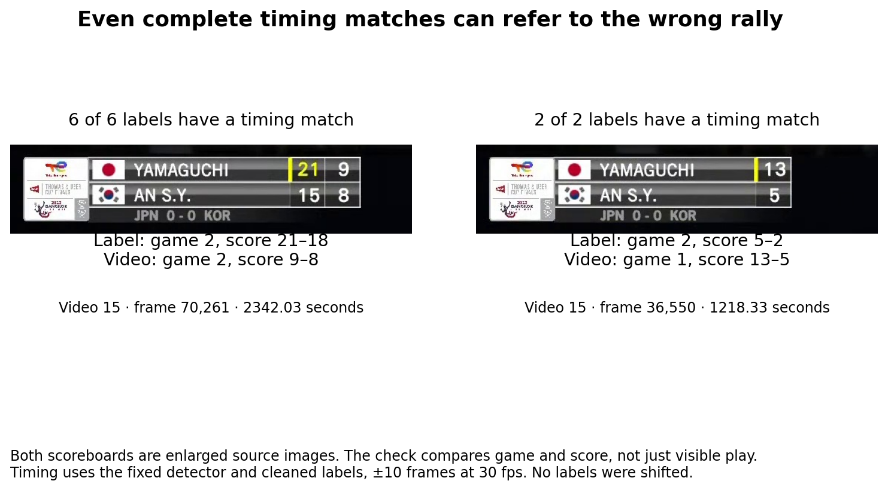
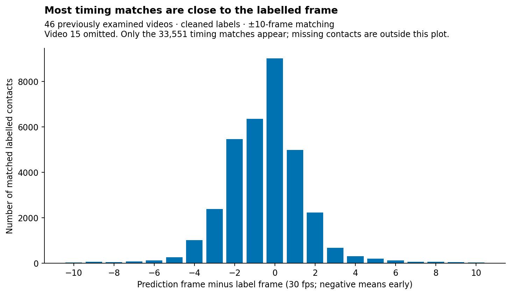

# More questions about the finished annotator

The annotator finds useful match sequences, but a reliable player-performance dataset
still needs human review. The main obstacles are missed or extra contacts, footage
blocked by court decisions, and a confirmed disagreement between one video's labels
and its actual frames.

This expanded report asks what else the saved results can tell us about those
failures. It adds detail that would have slowed down [the short report](REPORT.md).
It uses the same fixed detector and previously examined 47-video collection. There
was no new fit, selection threshold or label correction.

## Find the question you need

- [What exactly counts as success?](#what-exactly-counts-as-success)
- [How much error comes from labels pointing to the wrong video time?](#how-much-error-comes-from-labels-pointing-to-the-wrong-video-time)
- [Was any of video 15 actually fine?](#was-any-of-video-15-actually-fine)
- [Are the contacts mistimed, or missing altogether?](#are-the-contacts-mistimed-or-missing-altogether)
- [How often is the player wrong?](#how-often-is-the-player-wrong)
- [Do all rallies get a usable proposed clip?](#do-all-rallies-get-a-usable-proposed-clip)
- [What useful output does selection leave behind?](#what-useful-output-does-selection-leave-behind)
- [What changes when all source labels are used?](#what-changes-when-all-source-labels-are-used)
- [How large are the errors inside selected clips?](#how-large-are-the-errors-inside-selected-clips)
- [Which videos need a different explanation?](#which-videos-need-a-different-explanation)
- [What happens before contact scoring?](#what-happens-before-contact-scoring)
- [Can a clearly visible player still be lost?](#can-a-clearly-visible-player-still-be-lost)
- [What did the footage checks establish?](#what-did-the-footage-checks-establish)
- [What remains worth investigating?](#what-remains-worth-investigating)

## What exactly counts as success?

The saved system proposes 3,982 rally clips. A clip succeeds only if it contains one
whole labelled rally, matches every contact once, adds no unmatched contact, and names
the right player. The primary allowance is ±10 frames at 30 fps, about a third of a
second. The secondary allowance is ±5 frames.

The main label set contains 3,422 rallies and 38,218 contacts. These are the previously
cleaned labels, called “trusted” in earlier reports. The broader source-label check
contains 3,965 rallies and 43,159 contacts. Cleaning did not remove every source problem:
video 15's labels still disagree with the downloaded footage.

The 32-video development collection is separate. The present results describe footage
that has already been examined repeatedly, so they do not establish performance on
new matches.

Three units matter. A **contact** measures whether a hit appears at the right time and
with the right player. A **labelled rally** measures whether the system supplies a
fully correct clip for that rally. A **proposed clip** measures whether an item in the
output can be used. A high contact-matching rate can coexist with many unusable clips:
one extra or missing hit is enough to break an otherwise good sequence.

Unknown means the available labels cannot settle the clip. It is kept separate from
both correct and wrong. The evaluation never treats the millions of non-contact
frames as useful true negatives.

## How much error comes from labels pointing to the wrong video time?

**The evaluation establishes a serious alignment problem in video 15. It does not
measure the fraction of all detector errors caused by bad labels.** No corrected
label-to-video mapping was built. Measuring the effect would require aligning the
labels and scoring the corrected pairs.

The initial investigation checked five short windows in video 15 and three in video
53. It started with unusually bad scores, then compared labelled game/rally identity
with the actual footage. Video 15's first labelled serve lands on opening graphics.
Later windows show a different game or score. The video 53 pilot showed ordinary court
footage and led to the separate court-geometry investigation.

The follow-up added five video 15 windows chosen for **strong timing matches**, including
both rallies where every cleaned contact has a timing match. This tested the alternative
that some apparently successful labelled sections were aligned. All five had a clearly
different game or score in the footage. Their details are below.

That is ten targeted video 15 windows in total, not a review of all 95 cleaned rallies.
The original middle/late checks plus the new examples reach across all three labelled
games. The work did not inspect every event, recover the annotation's original video
edit, search a range of timestamp shifts, or repair any labels. The other sixteen
scene-control windows assessed view and visibility; they were not a collection-wide
check of label-to-rally identity.

What can be measured directly is how much of the reported error **occurs in video 15**:

| Reported outcome, cleaned labels at ±10 frames | Video 15 | All 47 videos | Share occurring in video 15 |
|---|---:|---:|---:|
| Missed labelled contacts, full-video matching | 869 | 4,502 | 19.3% |
| Emitted contacts without a label match | 2,092 | 7,889 | 26.5% |
| Labelled rallies without a fully correct clip | 95 | 1,659 | 5.7% |
| Known wrong selected clips | 10 | 124 | 8.1% |
| Extra events within wrong selected clips | 97 | 182 | 53.3% |
| Missed events within wrong selected clips | 118 | 185 | 63.8% |

For example, 869 means that 869 of the 4,502 missed labelled contacts occur in video
15. It does not mean that the label mismatch caused all 869 misses.

These rows count different things and must not be added. Video 15 also contains 27
of the 44 unknown selected clips (61.4%); unknown clips are outside the error rows.

Video 15 affects some summaries much more than others. It supplies over half of the
event errors inside wrong selected clips,
but only about one fifth of all missed labelled contacts. It cannot explain away the
remaining 3,633 misses outside that video.

The shares above are **not percentages proved to be caused by misalignment**. Some
video 15 output may also have real detector errors. Other videos may have label problems
that this evaluation has not discovered. Setting video 15 aside shows how conclusions
change without it; it does not produce a corrected estimate of detector accuracy.

## Was any of video 15 actually fine?

**The footage contains clear, usable match play. No inspected labelled section has
been confirmed to line up with the correct rally.** These are different questions.

The saved score finds 165 timing matches among 1,034 cleaned labels in video 15.
That number alone is not evidence of aligned sections. In particular, its two rallies
with a timing match for every label still refer to the wrong part of the match:

| Labelled rally checked | Timing matches | Source-row game and score | Game and score visible in the video |
|---|---:|---|---|
| Game 2, rally 39 | 6/6 | Game 2, 21–18 | Game 2, 9–8 |
| Game 2, rally 7 | 2/2 | Game 2, 5–2 | Game 1, 13–5 |
| Game 1, rally 31 | 6/12 | Game 1, 13–18 | Game 1, 1–0 |
| Game 3, rally 30 | 4/5 | Game 3, 15–15 | Game 3, 5–2 |
| Game 2, rally 24 | 5/6 | Game 2, 10–14 | Game 2, 2–0 |

The table copies each source row's A/B score order. The visible score follows the
broadcast display's player order. The disagreements remain even if that order is
reversed, or the source score is recorded after the point rather than before it.

These five checks intentionally favour apparently successful timing. They add evidence
against trusting those matches as proof of alignment. They do not prove that every
remaining section is wrong, nor that the detector failed on the actual visible rally.
The 6/6 example, for instance, is visibly a normal exchange; the evaluation is comparing
it with another rally's labels.

Across video 15's saved proposed clips, none contains an exact complete labelled
contact sequence, even before player correctness is required. But because the labels
are misaligned, that result cannot establish that none of the detector's actual clips
is correct. Certifying an aligned subset or useful unlabelled output would require
matching the footage to the right rally and checking its contacts.

The additional checks stop here. They answer the immediate question without attempting
a full reannotation. Exact requests and source rows are retained in
[the follow-up table](results/video15_followup_labels.csv.gz), with observed scores in
[the visual findings](results/video15_followup_review.csv.gz).

## Are the contacts mistimed, or missing altogether?

Both happen, but tightening the timing allowance explains only part of the gap.
Across all 47 videos, the final stream emits 41,605 contacts. At ±10 frames it matches
33,716 of the 38,218 cleaned contact labels: 88.2%. At ±5 frames it matches 32,972:
86.3%. Thus 744 timing matches disappear under the tighter allowance.

Of the 41,605 emitted events, 33,716 match a cleaned label, or 81.0%. The other 7,889
are unmatched **against that label set**. This is not a count of physically false hits.
The cleaned labels omit some rallies, and video 15 has a source mismatch. Using all
source labels matches 37,485 emitted events and leaves 4,120 unmatched.

For timing detail, set video 15 aside. Among the remaining 33,551 timing matches:

| Distance from the labelled frame | Matched contacts | Share of timing matches |
|---|---:|---:|
| Exactly the same frame | 9,012 | 26.9% |
| Within two frames | 28,035 | 83.6% |
| Within five frames | 32,878 | 98.0% |

These rows overlap: an exact match also falls within two and five frames. The median
offset is zero. The mean is about half a frame early. That small average does not
justify shifting the whole output; positive and negative errors can cancel.

This plot conditions on a successful timing match. It cannot explain the 3,633 missing
contacts outside video 15. It shows that many hits the detector does find are already
located closely in time.

Starts and finishes remain harder than middle contacts. Across all 47 videos at ±10
frames, the system matches 2,781/3,422 serves, 28,195/31,415 middle contacts and
2,740/3,381 final contacts. The 41 one-contact rallies count as serves only.

This ordering persists after removing video 15 and restricting to court-accepted
frames: missed rates are 9.0% for serves, 2.3% for middle contacts and 11.2% for final
contacts. The tighter allowance particularly affects serves. The
[contact-position figure](figures/contact_position.png) shows both timing allowances.

## How often is the player wrong?

Most timing matches have the right player, but player assignment is not perfect.
At ±10 frames, 33,715 matched cleaned labels have a known target side. Of those,
32,667 have the correct side: 96.9%.

Here, Top means the player on the far side of the image and Bot means the near side.
It does not identify a particular athlete throughout the match. The following counts
use the final stream's existing whole-rally alternation rule.

| Labelled player | Predicted far player | Predicted near player | No player assigned |
|---|---:|---:|---:|
| Far player | 16,183 | 410 | 0 |
| Near player | 632 | 16,484 | 6 |

One additional timing match has an unknown target side and is outside this table.
There are 1,042 known side confusions and six unassigned predictions. Calling all
33,716 minus 32,667 cases “wrong player” would incorrectly include that unknown label.

These are side-assignment errors on matched contacts. They do not establish physical identity swaps. A raw
pose-detection index can change when detections are reordered. A persistent athlete
identity would need separate evidence.

In the selected output, ten of the 124 known wrong clips include a wrong player on a
matched contact. Every one also has another error. Fixing player assignment alone
therefore cannot make any of those 124 clips fully correct. This does not make player
tracking unimportant: missing player inputs can prevent a contact from appearing at all.

## Do all rallies get a usable proposed clip?

No. For 419 of the 3,422 cleaned rallies, no proposed clip contains every labelled
contact. Of these, 153 receive only partial coverage and 266 have no clip that reaches
any of their labelled contact times.

The complete breakdown is:

| Best available output for a labelled rally | Rallies |
|---|---:|
| Fully correct clip | 1,763 |
| At least one clip contains all labels, but no clip is fully correct | 1,240 |
| Some labelled contacts fall inside a clip, but no clip contains them all | 153 |
| No proposed clip reaches a labelled contact | 266 |

A clip containing all labels can also contain contacts from another rally or have the
wrong sequence. Containment is therefore a necessary step, not success by itself.
The table describes what is available; the rows are not independent failure causes.

This also explains why different containment counts can appear in result tables.
Here, 3,003 rallies fit inside at least one clip. The stricter proposal summary counts
2,817 rallies contained by a clip that overlaps **exactly one** labelled rally.
The difference comes from the question being asked.

Removing video 15 leaves 3,327 rallies: 1,763 fully correct, 1,226 contained with errors,
113 partially covered and 225 without a clip reaching a label. Removing videos 15 and
53 leaves 169 such unreached rallies. The problem extends beyond those two outliers.

## What useful output does selection leave behind?

The fixed rule selects 784 clips from the 3,982 proposals. At the primary allowance,
the cleaned labels give 616 correct, 124 wrong and 44 unknown selected clips.
The rejected output contains 1,147 correct, 1,153 wrong and 898 unknown clips.

Selection keeps only 34.9% of the 1,763 correct clips already available. It raises
known correctness among selected items, but useful coverage falls from 51.5% to 18.0%
of all cleaned labelled rallies.

This is the practical trade-off: the queue is shorter and more useful to review,
while many correct clips remain outside it. These results do not say how far a new
threshold could move that trade-off on unseen footage. No threshold was retuned here.

Useful output is spread across the videos. For example:

| Video | Correct clips before selection | Correct selected | Wrong selected | Unknown selected |
|---|---:|---:|---:|---:|
| 33 | 66 | 29 | 3 | 0 |
| 52 | 56 | 28 | 5 | 1 |
| 41 | 59 | 23 | 4 | 0 |
| 47 | 54 | 23 | 6 | 0 |
| 15 | 0 | 0 | 10 | 27 |

These examples illustrate the saved queue, not a ranking of matches suitable for
future deployment. The [full per-video selection table](results/selection_per_video.csv.gz)
keeps every video's counts.

Video 15 alone supplies 37 selected clips, including 27 of the 44 unknowns. This is
another reason to resolve its labels before using its failures to guide model work.

## What changes when all source labels are used?

The overall fully correct total stays at 1,763, but the identities are not identical.
Three clips that were correct under cleaned labels become wrong with all source labels.
Three previously unknown clips become correct. Equal totals conceal these changes.

For the selected 784 clips, the change is:

| Judgement with cleaned labels | Judgement with all source labels | Selected clips |
|---|---|---:|
| Correct | Correct | 615 |
| Correct | Wrong | 1 |
| Wrong | Wrong | 124 |
| Unknown | Wrong | 15 |
| Unknown | Unknown | 29 |

Adding the source rows settles fifteen unknown selections as wrong. It also exposes
one contradiction in a previously correct clip. It does not turn an unknown selected
clip into a confirmed correct one. The totals change from 616/124/44 to 615/140/29.

Across all proposals, the number with no overlapping cleaned rally is 942. Another
71 overlap more than one cleaned rally. The remaining 2,969 overlap exactly one.
These distinctions matter when interpreting “unknown” and clip-boundary failures.

Labels are an evaluation input, not unquestionable footage truth. The video 15 pilot
found its first labelled serve on opening graphics. Later scoreboard checks showed
wrong game/rally identity. Those checks establish disagreement, but not a single
correct offset or the exact source-edit difference. The short report shows the
[comparison frames](figures/label_alignment.png).

## How large are the errors inside selected clips?

At ±10 frames, the 124 wrong selected clips include 92 with extra contacts, 74 with
missing contacts, ten with a wrong matched player and twelve that cut off part of the
labelled rally. These groups overlap.

The largest exclusive groups are 49 clips with extras alone, 28 with misses alone,
and 28 with both. Nine have missing and extra contacts together with a cut-off rally.
The remaining combinations are smaller, as the figure shows.

Eighty of the 92 clips with extras contain exactly one extra event. The other twelve
contain between two and 26. Nine of those twelve come from video 15. Severe-looking
extra counts therefore deserve a source-alignment check before a physical explanation.

Set video 15 aside. The remaining 114 wrong selected clips contain 85 extra events
and 67 missed labelled contacts:

| Event error | Position | Events |
|---|---|---:|
| Extra | Before the first labelled contact | 2 |
| Extra | Between the first and last labelled contacts | 31 |
| Extra | After the last labelled contact | 52 |
| Missed | Serve | 35 |
| Missed | Middle contact | 8 |
| Missed | Final contact | 24 |

These are event counts, not clip counts. They come from matching within each selected
clip. The earlier full-video contact table can match a nearby event outside the clip,
so its answers need not be identical.

The concentration near rally ends is useful for choosing footage to inspect. It does
not prove that every event after the final label is a false physical hit. The preceding
endpoint-deletion work found that its unsupported events had unknown deletion targets.
Those model attempts remain rejected; this evaluation does not reopen them through
new wording. Their outcomes are in [the earlier report](../contact_det_closing_pass/last_followups.md).

## Which videos need a different explanation?

Performance varies considerably. The median video has 94.1% of cleaned contacts
matched and 53.2% of cleaned rallies supplied with a fully correct clip. These are
medians across 47 videos, giving each video one place in the ordering.

At the high end, video 41 has 59/77 fully correct rallies (76.6%). Videos 33 and 18
have 66/94 (70.2%) and 42/60 (70.0%). This shows that the pipeline can produce many
complete sequences in some matches. It does not establish why those matches are easier.

At the low end:

| Video | Fully correct rallies | Matched contacts | What the checks support |
|---|---:|---:|---|
| 15 | 0/95 | 165/1,034 | Labels and downloaded footage disagree |
| 53 | 7/76 | 195/937 | 734 of its 742 misses fall in court-rejected scenes |
| 17 | 17/73 | 842/976 | Missing player picks concentrate here; two inspected failures trace to court geometry |
| 20 | 15/43 | 324/537 | One sampled rejected scene has no raw court outline despite usable footage |
| 38 | 29/82 | 1,022/1,161 | No additional visual explanation established in this evaluation |

The last row matters. A low score is a reason to inspect the evidence, not enough to
assign a cause. The same caution applies to high-scoring videos.

Removing video 15 raises fully correct rally coverage from 51.5% to 53.0%. Removing
both 15 and 53 gives 54.0%. The major overall limitation remains after those outliers
are removed.

## What happens before contact scoring?

Outside video 15, the final stream misses 3,633 of 37,184 cleaned contact labels.
At the labelled frames, the saved input states give the following comparison:

| Input state | Labelled contacts | Matched | Missed | Share missed within this state |
|---|---:|---:|---:|---:|
| Court rejected | 2,614 | 240 | 2,374 | 90.8% |
| Court accepted; at least one player pick missing | 140 | 44 | 96 | 68.6% |
| Court accepted; both players picked | 34,430 | 33,267 | 1,163 | 3.4% |

These rates reverse the question in the short report. There, 65.3% of misses lie in
court-rejected scenes. Here, 90.8% of labels in court-rejected scenes are missed.
The denominator changes, so the percentages answer different questions.

The rows are linked stages, not three independent causes. Court rejection skips
normal player tracking and excludes the scene from the usual contact search.
At 2,277 of the 2,374 court-rejected misses, no scored row exists within ±10 frames.
A later chooser cannot select a candidate that is absent.

A label can still match when its exact frame is rejected: the allowed timing window
can reach a nearby available event. The 240 matched cases in the first row show why
frame-level input state and contact-level matching must remain distinct.

At all 1,259 missed times in accepted scenes, exact saved features and nearby scored
candidates exist. That narrows the remaining question to input accuracy and contact
choices. It does not prove that a correct candidate was recognised or could be inserted
without harming another part of the rally.

The scene check itself uses a raw court outline to decide whether exactly two detected
people stand within the court margin. At least half the scene's frames must pass.
Only scenes that already pass enter the later comparison of court outlines across
the video. A bad initial outline can therefore reject usable play before correction.

Four deliberately sampled rejected scenes all showed the whole court, both players
and an ongoing exchange. Recomputing their original votes reproduced every saved frame.
Changing only the outline to the existing shared outline made three pass the original
50% threshold. Video 21 rose from 17.8% to 48.9% and still failed. All four successful
controls retained their vote counts. This isolates a geometry problem in the sample;
it does not estimate how many rallies a changed gate would recover.

## Can a clearly visible player still be lost?

Yes. Video 17 contributes 80 of the 96 missed contacts with missing player picks in
accepted scenes outside video 15. Both inspected failures show the far player clearly.

Rerunning the original tracker over all 213,154 frames used its original 38 tracking
segments and state resets. Both current-frame player-availability fields matched all
91,970 saved feature rows. This verifies the reconstructed availability decisions;
it does not assert equality of every saved feature or raw detection identity.

The picker projects each detected person's foot position into court coordinates.
It then checks distance from the expected player position, which combines a fixed
court location with recent tracking state. In the two failed examples, the shared
court outline puts the far player too far away in those coordinates.

| Sampled contact | Distance using shared outline | Distance using original scene outline | Allowed maximum |
|---|---:|---:|---:|
| Video 17, frame 47,276 | 0.706 | 0.280 | 0.600 |
| Video 17, frame 46,045 | 0.654 | 0.240 | 0.600 |

These distances use the tracker's normalised court coordinates, not image pixels.
Both original distances fail the check. Changing only the outline restores the
far-player pick in both isolated calculations. The two successful comparison centres
retain their picks, as do all their half-second and one-second witness frames.

The calculation uses the actual incoming tracking state and never feeds the alternative
result into later frames. That keeps the measurement narrow. The surrounding frames
also show that the missing pick comes and goes. Neither finding is a count of contacts
or rallies recovered by a full pipeline change.

The [side-by-side figure](figures/player_geometry.png) makes the mismatch visible.
Together with the rejected-scene examples, it suggests a more precise follow-up than
“use the shared outline everywhere”: check whether the outline fits each camera view.

## What did the footage checks establish?

The first pilot inspected eight targeted times in videos 15 and 53. It tested the
assumption that unusually bad scores referred to the expected match action.
It exposed the video 15 disagreement. The inspected video 53 serve examples showed
ordinary court footage, so that video needed a different explanation.

A second sample used eight missed middle contacts and eight successful controls from
the same videos. Four misses came from rejected scenes, two from accepted scenes with
a missing player pick, and two from accepted scenes with both picks. Controls came
from fully correct rallies, using the closest rally length and then time.

The sampling seed was fixed at 20260906. Random IDs hid detector outcome and input
state from the scene reader. Each request showed nine frames at half-second intervals
across ±2 seconds. All sixteen centre frames showed the whole court and both players.
The broad observations and exact requests are kept in the
[visual review](results/visual_review.csv.gz) and [sample table](results/visual_sample.csv.gz).

This sample deliberately contains many failures. It demonstrates that usable footage
can be rejected; it cannot estimate the collection-wide false-rejection rate. Sparse
stills also cannot certify exact racket contacts or playback speed. Camera view and
likely live/replay status were recorded separately.

All sample centres were more than two seconds from a saved scene cut. Nevertheless,
one successful control visibly changes from a close-up to the court within its
four-second window. Its nearest saved cut is 11.6 seconds away. Saved scene boundaries
are incomplete evidence of actual camera changes.

The existing 44-clip unknown review answers another question. It found 39 live-play
clips, four mixtures and one apparent warm-up. It did not certify exact contacts.
Reusing those observations avoids pretending that a second table creates new truth.

Finally, shuttle availability is not shuttle accuracy. A filled coordinate exists at
3,514 of the 3,633 missed times outside video 15. The opening graphic in video 15 also
has a filled coordinate. That flag tells us an input is present, not that it follows
the physical shuttle.

## What remains worth investigating?

First resolve video 15's source alignment. Its labels cannot support a trustworthy
failure diagnosis until they refer to the correct footage. Check the annotation's
source edit rather than assuming one constant timestamp shift will fix everything.

Then investigate court geometry before another contact-model fit. The evidence identifies
two distinct problems: bad raw outlines can reject useful scenes, while a shared outline
can fit another camera view poorly and lose a visible player. A useful test must count
newly admitted non-play footage as well as rescued live scenes.

After that, revisit contact sequences where the court is accepted and both players are
available. There are still 1,163 missed labelled contacts in that group outside video 15.
Starts, ends and unsupported extra events offer concrete cases for review, but the
existing labels do not settle every physical hit.

Human review remains necessary for player-performance records. The present selection
improves the review queue while leaving many correct clips behind. No result here
establishes unattended exact annotation, a new repair count or a changed detector ready
for adoption.

The [data and script guide](README.md) records how the tables were produced.
`results/extended_summary.json.gz` holds the added totals; the accompanying CSV tables
preserve player confusions, label-judgement changes, per-video selection and conditional
input rates. These additions reuse the completed evaluation's row-level evidence.
