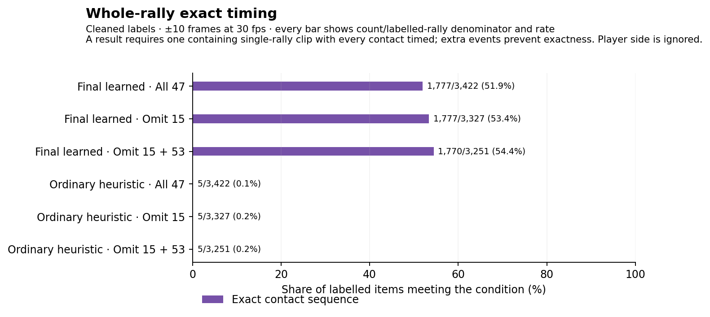
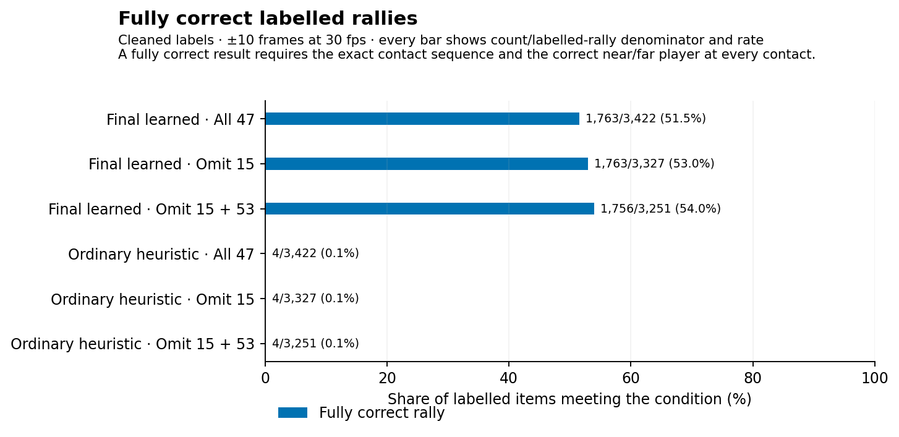

# What changes without videos 15 and 53?

The main recommendation is to keep video 53 in the evaluation and treat video 15's
current label-to-video pairing as unusable for accuracy claims.

The comparison uses saved outputs on 47 previously examined ShuttleSet22 videos, the
current cleaned labels, and a timing allowance of ±10 frames at 30 frames per second.
These are descriptive results; no detector was retrained or changed.

Removing videos 15 and 53 raises the percentage of fully correct rallies from 51.5% to
54.0%. Contact matches that also identify the hitting player rise from 85.5% to 89.4%.

The two videos need different explanations. Video 15's labels point to the wrong parts
of the match. Video 53's new game-and-score checks agree with its labels; its main
recorded problem is court rejection. Keeping video 53 shows how much that difficult case
affects the result. The comparison without it is useful as a sensitivity check.

This report answers the follow-up questions using saved outputs and 53 new visual
windows across 19 of the 47 previously examined ShuttleSet22 videos. The windows include
a uniform random sample of missed contacts, checks of weak videos, checks of video 53,
and successful controls.

For a player-performance dataset, the exclusions still leave nearly half of labelled
rallies without a fully correct clip. Improving court handling and checking a small set
of contact labels by hand are useful next steps.

## Results with both videos included and excluded

The results use the current cleaned-label subset and allow a timing error of ±10 frames
at 30 frames per second. “Cleaned” identifies the subset used for the evaluation; the
checks below show that it can still contain errors. A contact is correct only when its
timing and hitting player are correct. The timing-only result is shown alongside it. A
serve is the first labelled contact in a rally.

The whole-rally timing check requires a clip containing one complete labelled rally,
with every hit matched once and no extra hit. A fully correct rally also needs the right
player for every contact. Merely containing the rally's time interval is a weaker check,
so that result is reported separately.

| Final learned output | All 47 videos | Without 15: 46 videos | Without 15 and 53: 45 videos |
|---|---:|---:|---:|
| Whole rally: exact contact sequence | 1,777/3,422 (51.9%) | 1,777/3,327 (53.4%) | 1,770/3,251 (54.4%) |
| Fully correct rally, including players | 1,763/3,422 (51.5%) | 1,763/3,327 (53.0%) | 1,756/3,251 (54.0%) |
| Contact timing match | 33,716/38,218 (88.2%) | 33,551/37,184 (90.2%) | 33,356/36,247 (92.0%) |
| Contact timing and player correct | 32,667/38,218 (85.5%) | 32,586/37,184 (87.6%) | 32,392/36,247 (89.4%) |
| Serve timing match | 2,781/3,422 (81.3%) | 2,766/3,327 (83.1%) | 2,752/3,251 (84.7%) |
| Serve timing and player correct | 2,647/3,422 (77.4%) | 2,642/3,327 (79.4%) | 2,628/3,251 (80.8%) |

Whole-rally containment rises from 3,003/3,422 (87.8%) with all videos to 2,978/3,251
(91.6%) when both videos are removed. Many clips therefore contain the needed time
interval but still have the wrong contact sequence. That gap remains after both videos
are removed.

Removing videos does not recover any output. The number of fully correct rallies falls
from 1,763 to 1,756 because video 53 contains seven successes; the percentage rises
because the denominator falls faster.

The ordinary heuristic remains far behind. Without both videos, it gives four fully
correct rallies out of 3,251 and a contact timing-and-player score of 55.2%, compared
with 89.4% for the learned output. The charts use each method's saved player answers.

The [complete comparison table](results/exclusion_metrics.csv.gz) also contains the
±5-frame check and all source labels. The frozen selection is unchanged. Without both
videos, its 746 clips comprise 615 correct, 114 wrong and 17 unknown clips.

## Is video 15 usable for evaluation?

Its current label-to-video pairing is unusable for judging detector accuracy. The
footage itself contains ordinary match play, and the detector may still produce useful
clips from it. The current labels cannot reliably tell us which clips are correct.

The earlier ten targeted windows included the two rallies whose every labelled contact
was timing-matched. Both showed a different rally on screen. This pass added four
randomly sampled misses from video 15. Two had a clear game or score contradiction. Two
had no readable scoreboard in the four-second window. No inspected section has been
confirmed as aligned.

The recorded scores are severe: zero fully correct rallies out of 95, 165 timing matches
out of 1,034 contacts, and only 81 contacts with both timing and player correct. These
are disagreements with the current labels. They are not verified counts of physical
detector mistakes.

Video 15 contributes 869 of the 4,502 recorded missed contacts, or 19.3%. It also
contributes 674 court-rejected misses. Those counts overlap. A wrong label can point to
footage that the court stage quite reasonably rejects. The [expanded
report](REPORT_BIG.md#how-much-error-comes-from-labels-pointing-to-the-wrong-video-time)
keeps the other error-count shares and the earlier comparison frames.

## What did the video 53 inspection show?

Video 53 has now received a direct check of the game and score against the source
labels. Earlier inspection mainly established that rejected scenes could contain usable
play. This follow-up checked nine new windows: seven missed contacts and two contacts
inside fully correct rallies. They span both labelled games.

All nine visible games and scores are consistent with the source rows. The comparison
allows the player order to reverse and the score to differ by one point because the
broadcast can show the score before the point finishes. This is evidence against the
large label-to-footage mismatch found in video 15. It does not certify every hit time.

Eight centres show the whole court and both players. One shows a single player from the
side; surrounding frames return to the whole court. Some misses therefore occur in
clearly usable views, while others occur during difficult camera changes.

The saved inputs support court rejection as the main recorded problem. Of video 53's 742
missed contacts, 734 fall in court-rejected scenes and eight in accepted scenes. In
accepted scenes, 195 of 203 labelled contacts have a timing match. Of those matches, 194
have the right player. The detector can work well in this video when its inputs reach
contact scoring.

An earlier geometry-only check also made one sampled rejected scene pass by changing its
court outline. This demonstrates a possible mechanism in one scene. It does not show
that all 734 misses would be recovered. Excluding the entire video would hide both
pipeline difficulty and successful output.

## What about the other weak videos?

The scatter plot does not define a formal elbow. The new sample covers the next five
videos with the lowest contact-match rates after videos 15 and 53: **12, 20, 21, 24 and
39**. It also covers **17 and 38**, which have low fully correct rally rates.

Three missed contacts were checked in each video, spread across early, middle and late
misses. All 21 game-and-score checks were consistent with the labels. Twenty centres
showed the whole court and both players. The remaining centre was a close-up in video
38; the camera returned to a rally in progress half a second later.

| Video | Timing matches | Fully correct rallies | Misses in court-rejected scenes | New game-and-score checks |
|---|---:|---:|---:|---:|
| 12 | 469/781 | 23/61 | 234/312 misses | 3/3 consistent |
| 20 | 324/537 | 15/43 | 207/213 misses | 3/3 consistent |
| 21 | 583/806 | 31/75 | 200/223 misses | 3/3 consistent |
| 24 | 248/330 | 11/31 | 76/82 misses | 3/3 consistent |
| 39 | 577/717 | 38/75 | 120/140 misses | 3/3 consistent |
| 17 | 842/976 | 17/73 | 1/134 misses | 3/3 consistent |
| 38 | 1,022/1,161 | 29/82 | 65/139 misses | 3/3 consistent |

This sample did not expose another large wrong-rally problem. It did expose different
input conditions. Court rejection dominates several weak videos, while almost all video
17 misses occur after the court was accepted. A single explanation does not fit the
whole low-performing group.

## Could most failures still be wrong ground truth?

The current evidence does not support that conclusion, but it cannot assign a reliable
probability to every kind of label error. The new random sample gives a narrower answer.

Twenty-four contacts were drawn uniformly from the 4,502 missed cleaned labels, using
the fixed seed 20260907. The readers saw the frames without the labels or detector
states. Their recorded games and scores were then compared with the original source
rows. The court stage's accepted or rejected status was retained for comparison.

| Random missed-contact checks | Court accepted | Court rejected | Total |
|---|---:|---:|---:|
| Game and score consistent | 7 | 13 | 20 |
| Different game or score | 1 | 1 | 2 |
| Game or score unreadable | 0 | 2 | 2 |

The two contradictions and two unreadable windows all came from video 15. All twenty
other sampled misses had a consistent game and score. This argues against most of these
sampled misses being labels attached to a completely different rally.

Smaller errors remain possible. A label can name the right rally but the wrong frame or
player, omit a hit, or refer to action hidden by a camera cut. One random example in
video 24 places a labelled serve during a replay-to-live transition. The game and score
agree, but the sparse frames do not settle the exact serve time.

The table also answers the overlap question directly. Court rejection occurs both where
the game and score agree and where they disagree. Neither state proves label
correctness. The 53 windows must not be pooled into a population error rate: the weak
videos and successful controls were deliberately selected.

All new source requests and observations are in the [53-window review
table](results/alignment_review.csv.gz). The new sample covers 19 of the 47 available
ShuttleSet22 videos, not all 58 matches in the published collection. It contains no new
original-ShuttleSet footage.

## Can we inspect a confusion matrix for each video?

Yes. Open the [per-video results viewer](VIDEO_BREAKDOWN.html) and choose a video and
output method. It works as a standalone local page. It shows:

- labelled far or near player against predicted far or near player, missing player and missing hit;
- unmatched emitted events separately, because they do not start from a labelled hit;
- contact, serve and whole-rally scores;
- court and player availability at matched and missed times; and
- the saved selection's correct, wrong and unknown clips for the learned output.

The weaker half of the videos is also shown below. Every row names its video. The number
at the right gives fully correct rallies. The [other
half](figures/video_outcome_breakdown_1.png) and [complete numeric
table](results/video_outcome_breakdown.csv.gz) retain the rest.

A huge number of background frames would make a conventional contact or no-contact
accuracy look misleadingly good. These views keep missed labels, wrong players and
unmatched predictions visible.

## Can original ShuttleSet receive the same analysis?

Yes, using cached outputs and features. The model identity is recoverable: use the same
final local chooser and fixed-membership padding. The chooser is the later model that
selects the final contact candidates. Boundary padding is the saved post-processing step
that adjusts a candidate's clip boundary; padding replay means applying that same step
to the cached candidates. Pose, court and shuttle inference do not need to be rerun.

The original prepared collection has 40 eligible videos. A final equivalent output for
all forty is not already saved. The other eight have earlier detector outputs and cached
features; they need the later chooser and padding replayed before a fair whole-rally
comparison. The 32-video result already saved for this path must remain labelled as
development evidence.

This is a bounded follow-up using existing data, rather than a new model-discovery
exercise. Original ShuttleSet has been used repeatedly during training and selection, so
another chart would not create an untouched test set.

The saved original source videos, court and annotation stages are still present on
Carmack. Earlier original-dataset visual work covered a small named set, including
`sset_01`, `sset_15` and `sset_21`; it was not a collection-wide alignment sample. Those
IDs are different from ShuttleSet22 video IDs. This pass checked feasibility and
available records. It did not run a second full evaluation.

## Did HGB training account for noisy labels?

The histogram gradient boosting (HGB) models used regularisation, but not dropout or
label smoothing. Regularisation means limits
that make a model less willing to fit each individual training example. It can reduce
overfitting. It cannot move a label to the right rally or restore a contact candidate
that the court stage removed.

Both models used tree-size limits and L2 regularisation, which penalises large values
at the tree leaves. The main contact model also limited sampled negatives.

| Training setting | Main contact model | Later chooser |
|---|---:|---:|
| Learning rate | 0.06 | 0.05 |
| Maximum leaves per tree | 31 | 15 |
| Minimum examples per leaf | 40 | 20 |
| L2 penalty strength | 1.0 | 1.0 |
| Early stopping | Automatic | Disabled |

Targets were hard yes-or-no answers. Options that the labels could not judge were
omitted. There were no soft targets or per-example confidence weights. Class balancing
changes the influence of common and rare answers; it is not a judgement of label
reliability.

Scikit-learn's HGB classifier has no built-in dropout or label-smoothing setting. It can
randomly restrict the features considered at each split through `max_features`. Our
models left that at 1.0, so they did not use that option. Tree-size limits, L2, learning
rate and early stopping provide other controls. The raw contact fit used automatic early
stopping. The chooser explicitly disabled it. See the [scikit-learn HGB
documentation](https://scikit-learn.org/1.8/modules/generated/sklearn.ensemble.HistGradientBoostingClassifier.html).

The rejected corrected-target experiment addressed a different problem: whether a
candidate became correct after boundary padding. It did not smooth uncertain human
labels. On the broader videos it lost more complete rallies than it recovered, changing
the count from 1,763 to 1,761.

A useful next noise experiment would start with a small set of manually checked
contacts. That would separate real gains from fitting faulty labels more closely.
Stronger regularisation is testable, but the results give more immediate reasons to fix
source alignment and court handling first.

## Video 17 and the shared court outline

Video 17's cached court stage included the OpenCV fallback. Its 657 scene records
contain 173 fallback outlines, 107 model outlines and 377 scenes without a raw outline.
Only 38 scenes passed the subsequent court test. Consensus replaced eleven outlines.

The two previously inspected player failures lie in a scene where the model supplied all
four corners. The shared-outline check flagged that outline at a distance of about 164
pixels and replaced it. Using the original scene outline restored the far-player pick in
the earlier isolated calculation. This is why OpenCV recovery elsewhere in the video did
not prevent these two failures.

The shared outline is the median of accepted scenes. It replaces an outline when its
worst-corner distance is more than 55 pixels; scenes below that threshold retain their
own outline. If at least half of the scenes disagree, the code declines consensus
repair. It does not form separate groups for different camera views or decide that a
large shift deserves a new persistent court.

These facts give a concrete starting point for a separate video 17 investigation. They
do not yet explain every failed rally or measure the benefit of a changed court policy.
The [saved court summary](results/video17_court_summary.json.gz) and [earlier player
checks](REPORT_BIG.md#can-a-clearly-visible-player-still-be-lost) keep the relevant
evidence together.
