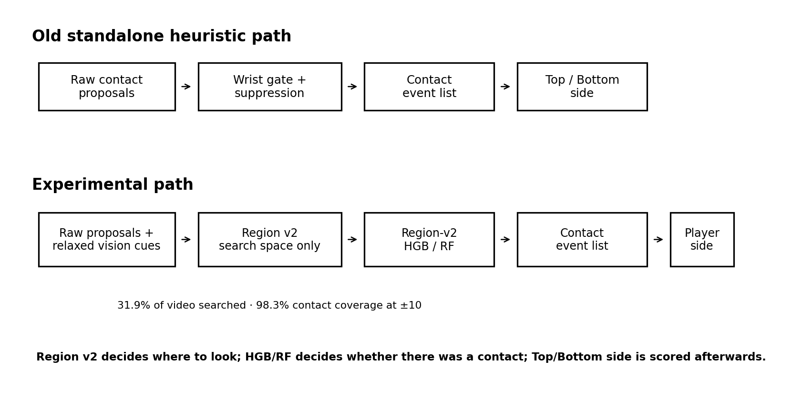
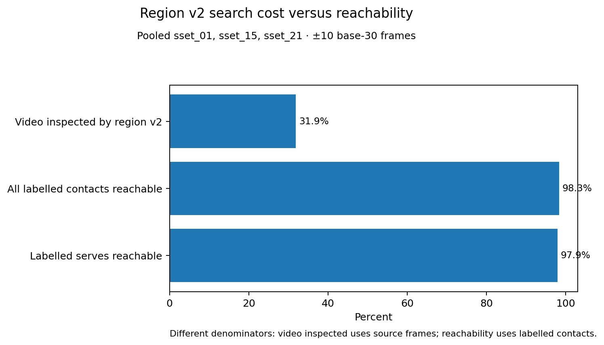
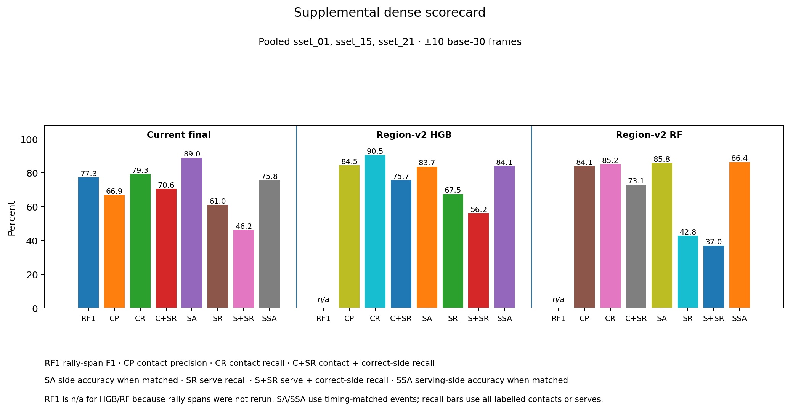

# Contact detector exploration

This directory contains three readable reports plus the separate BST-X implementation plan.

The reports and PDFs stay here. Supporting Python modules live in `scripts/`, generated plots live in `figures/`, and retained experiment data lives in `raw/`.

Each report has one job:

| File | Question it answers |
| --- | --- |
| [`README.md`](README.md) | **What did we learn, and which document should I read next?** |
| [`auto_annotator_progress.md`](auto_annotator_progress.md) | **How good is each annotator output now?** |
| [`tree_contact_detector_results.md`](tree_contact_detector_results.md) | **Exactly what contact-detector experiments produced those results?** |
| [`bst_x_contact_detector_plan.md`](bst_x_contact_detector_plan.md) | **How should the proposed BST-X detector be implemented?** |

## Bottom line

The old heuristic contact path tries to produce a usable contact list with hand-written rules alone.

The experimental path separates the problem:

```text
broad deterministic search region
→ learned contact classifier
→ contact events
→ existing Top/Bottom attribution rule
```

The search region is deliberately relaxed. It is not a detector and is not produced by a tree. Its job is only to discard obviously irrelevant video without making real contacts unrecoverable.

Region v2 searches about **31.9% of the video** and contains a candidate within ±10 of **98.3% of labelled contacts**.

Inside that fixed region, HGB is the best timing model in the region-v2 sweep.
The first three rows use each model's original decision settings:

- current final heuristics: **72.6% contact-timing F1**
- region-v2 RF: **84.6%**
- region-v2 HGB: **87.4%**

The selected wider duplicate-removal distance raises the resulting HGB event
stream to **88.8%** timing F1 without refitting the model.

Player side is scored separately. These event-level side results use the
models' original decision settings. When the existing Top/Bottom rule is
applied to the frozen event streams:

- current final heuristics get **70.6%** of all labelled contacts correct in both time and player side;
- region-v2 HGB gets **75.7%**;
- region-v2 RF gets **73.1%**.

For serves, the corresponding “right time + correct serving side” result is:

- current final: **46.2%**
- region-v2 HGB: **56.2%**
- region-v2 RF: **37.0%**

So the useful conclusion is:

> **Use region v2 as the search surface and HGB as the timing model. Region v1
> has a small edge when both regions use their original decisions. Region v2
> keeps more contacts and serves reachable, and its selected wider
> duplicate-removal rule now has the best measured timing F1.**

The new end-to-end rally check is much stricter than event F1. With the raw
model's original decision settings, the system keeps 291 predicted spans and
only 21 are fully correct. A 0.90 timing-score cut keeps 51 spans and nine are
fully correct. Confidence filtering alone does not yet produce a useful clean
rally subset.

The frame-rate check did not improve that result. Removing raw motion values
reduced timing F1 to **84.8%** and left 16 fully correct spans with no
timing-score cut. Converting motion to a common 30 fps scale gave **87.0%**
timing F1 and 15 fully correct spans. The existing raw-motion model remains the
baseline with **87.4%** timing F1 and 21 fully correct spans.

A separate decision-layer check replayed five choices from the held-out HGB
scores without refitting the model. Increasing the duplicate-removal distance
from 5 to 6 base-30 frames is the best pilot choice. It keeps 3,238 predicted
contact events across the three fixtures and raises timing F1 to **88.8%**.
With no timing-score cut, fully correct spans rise from 21 to 27. At a 0.90
score cut, it keeps 68 spans and 13 are fully correct. The lower-score choices
recover more serves but produce fewer fully correct rallies.

The label-blind shortlist check also has a clear answer. N+ is the selected
decision row: the original score cut-off with a 6-base-30-frame
duplicate-removal distance. The shortlist kept every N+ event and made one
nearby raw-score alternative selection per event before reading timing labels.
It then deduplicated those selections. This produced 6,305 candidates, up from
3,238. At ±10, the shortlist recovered 97 of N+'s 303 misses and raised contact
coverage from 90.3% to 93.4%. The pass rule required 152 recoveries while
staying below twice the N+ size. The size passed, but the coverage gain did not.
Stop this pilot before a merge, refit or cleanup tree.




## Why use region v2

Region v1 is slightly more selective and has marginally better event F1 on these three fixtures.

Use region v2 because its job is **search-space reduction**, not final event prediction. It keeps more serves reachable:

- region v1 serve coverage at ±10: **91.4%**
- region v2 serve coverage at ±10: **97.9%**



For the next classifier, that extra coverage matters more than v1's small precision/F1 edge.

## What is still open

The RF/HGB work does **not** change the rally-span finder. It now measures the
current HGB events and Top/Bottom answers inside those fixed spans.

Direct Top/Bottom attribution is measured on frozen HGB/RF contact events for
the original event-level table. The selected N+ stream has a strict rally
score with Top/Bottom answers, but no separate event-level side table yet.

The separate **rally-level alternation fit** has not been rerun on those new events, so we do not yet know whether its final-hitter or server-side scores improve.

The original-decision strict result shows what usually blocks complete output. Of 311 predicted
spans, 210 map to one real rally but fail contact timing or event count before
player side is considered. Only 29 first fail at player side after exact
timing.

The original B0 missed-contact audit narrowed the shortlist question. It finds a
seeded HGB candidate near 244 of 296 missed contacts. This includes 89 of 95
missed serves. All 13 predicted spans that are otherwise exact apart from one
missing contact already have a region-v2 candidate nearby.

The shortlist result shows that nearby candidates are not compact enough to
support another learned stage on this pilot. Adding 3,067 rows recovered 97
contacts and left 2,970 more shortlist rows unmatched. These are unmatched
shortlist candidates, not measured detector false positives.

`sset_21` is the main warning sign: region v2 contains **94.7%** of its serves.
The original decision rule finds **44.0%**, while the selected wider
duplicate-removal rule finds **42.7%**. The pooled improvement does not solve
the weak serve result on this fixture.

## Where to go next

Read [`auto_annotator_progress.md`](auto_annotator_progress.md) if you care about the annotator's outputs: rally spans, contact time + player side, serve time + serving side, and rally-level server attribution.

Read [`tree_contact_detector_results.md`](tree_contact_detector_results.md) for the experiment itself: region construction, exact feature sets, RF/HGB training, controls, player-side scoring and failure cases.

The frame-rate, decision-layer and shortlist checks are now settled for this
pilot. Keep the raw-motion HGB and use the 6-base-30-frame duplicate-removal
distance. The shortlist missed its predeclared coverage gate, so stop before a
handcrafted merge, refit or cleanup tree. Rescue search also remains deferred.
The next model work belongs on the planned larger video set, where all fitted
pilot settings must be chosen again.

Read [`bst_x_contact_detector_plan.md`](bst_x_contact_detector_plan.md) only when moving on to the neural detector implementation. That specification is intentionally separate from the experiment reports.

## Full scorecard

This puts the main measured outputs in one place. The focused plots in the two reports are easier to read when comparing contact or serve performance alone.


