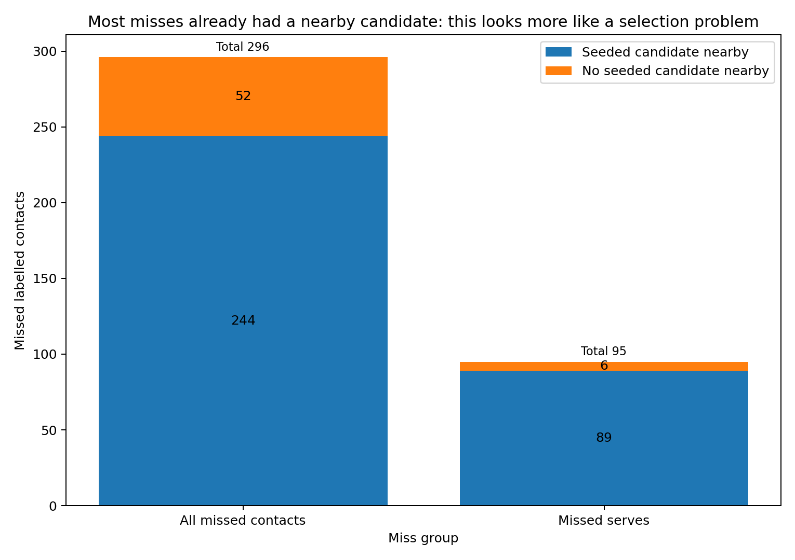

# Visual quick guide

This is the “cannot be bothered reading all of it” route through the contact-detector pilot.

## Table of contents

- [The six pictures to look at](#the-six-pictures-to-look-at)
- [What they say in one paragraph](#what-they-say-in-one-paragraph)
- [Optional extra pictures](#optional-extra-pictures)

## The six pictures to look at

### 1. Contact timing got much better

The old final heuristics are at 72.6% timing F1. The original HGB stream reaches 87.4%. The selected event rule reaches 88.8%.

### 2. Whole rallies are still much harder

Even the selected event stream gives only 27 fully correct rallies out of 291 kept with no timing cut. Raising confidence throws away a lot of output without creating a very clean subset.

### 3. Most misses already had evidence nearby

Of the 296 contacts missed by the original HGB stream, 244 already had a candidate nearby in the fixed search surface. This is more of a scoring/selection problem than a “search the entire video” problem.

### 4. The broad candidate union contains more useful rallies than the current selector can find

The selected stream has 27 fully correct rallies. Inside the unchanged one-rally spans, an oracle can find 42 timing-and-side-correct rallies in the frozen candidate union, while timing alone is feasible for 144. Fifty-three candidates outside every span remain unassigned. These are upper bounds, not achieved output. There is selector headroom, and player side is a major limit.

### 5. The compact serve list is promising; the tested chooser is not

Of 96 missed serves, 60 have a compact prefix candidate nearby and a timing-only oracle recovers 58. The fixed hand-written chooser recovers only 8.

The compact list was designed after inspecting this three-video pilot. It is development evidence and needs a fresh-data test.

### 6. `sset_21` is still the warning sign

The search region covers most serves in `sset_21`, but the detector still finds fewer than half. Do not let pooled numbers hide that fixture.

## What they say in one paragraph

The HGB detector is clearly better than the old heuristics at contact timing. A slightly wider duplicate-removal rule helps again. That improvement is real, but whole-rally output is still weak. Most misses already have plausible nearby evidence. The broad nearby-alternative shortlist is too noisy to justify a practical second stage as tested, yet an oracle shows there is still useful rally-level evidence inside the union. A compact serve-prefix list is a cleaner lead: it contains many missed serves, but the tested hand-written chooser is bad. The next useful work is therefore a properly validated selector on fresh data, with player-side attribution treated as a first-class limit.

## Optional extra pictures

