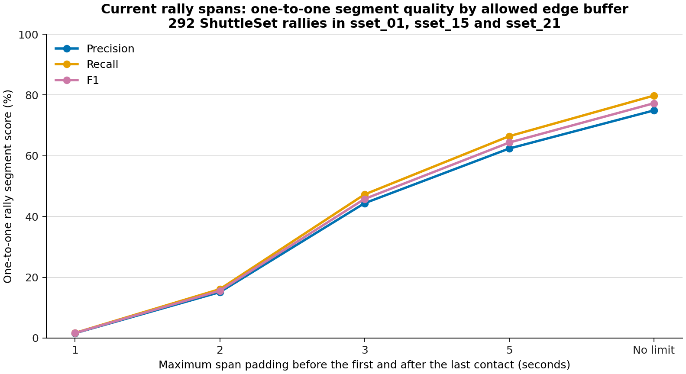
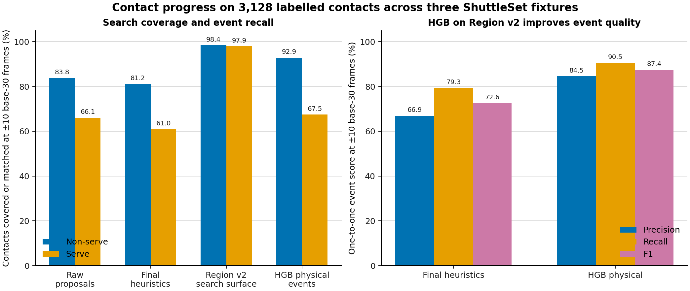

# Auto-annotator progress

## Bottom line

Keep region v2 as the contact search surface and histogram gradient boosting (HGB) as the cheap cleanup baseline. Region v2 contains a centre within ±10 base-30 frames of 98.4% of non-serves and 97.9% of serves. HGB turns that broad surface into contact events at 84.5% precision, 90.5% recall and 87.4% F1. This is a large improvement over the current final heuristics, which reach 66.9%, 79.3% and 72.6% on the same 3,128 contacts.

The rally-span result is much weaker. A new read-only score of the retained current spans finds 233 clean one-to-one rally segments among 311 predictions and 292 labelled rallies. With no limit on extra edge padding, this is 74.9% segment precision, 79.8% recall and 77.3% F1. Requiring both boundaries to be within five seconds lowers the result to 62.4%, 66.4% and 64.3%. No contact experiment changed the span finder, so there is no measured rally-segmentation gain yet.

We are substantially closer to a useful in-region contact detector. We are not close to detecting and attributing every contact, especially serves. HGB serve recall is 67.5% pooled and 44.0% on held-out `sset_21`. Direct Top/Bottom attribution is 89.0% accurate when a current final contact is matched, but final-hitter accuracy after rally alternation is 49.1%. Missed-contact parity is a plausible cause, not an isolated one.

A dedicated contact-detector BST-X is the right bounded next test. The measured search ceiling leaves room for at most 244 more matched contacts than HGB within region v2 at this tolerance. That is headroom, not a forecast. No BST-X contact model has been trained, so the evidence supports an acceptance test rather than an expected gain.

## Starting point and metric definitions

The investigation started from the saved `ad8da4f` annotator output for `sset_01`, `sset_15` and `sset_21`. These fixtures contain 292 rallies and 3,128 labelled contacts: 292 serves and 2,836 non-serves.

The starting ruleset was:

1. Mask excluded broadcast frames, then split the shuttle track into active regions separated by long rest. A sustained fast shuttle run qualifies a region as a rally. The configured back-fill rule opens the span at the active-region start.
2. Inside each span, propose shuttle direction-change impulses relative to a rolling local floor. De-duplicate nearby impulses.
3. Keep proposals close enough to the nearest tracked wrist in player-body units. Suppress nearby weaker proposals.
4. Assign the nearest-wrist player to Top or Bottom from the bottom of that player's box and the calibrated net band.
5. Fit one strict alternating Top/Bottom phase across the rally.

Ground truth was not used to produce the saved spans, proposals, regions or features. The prediction freezes were checked before the scorers loaded labels.

The report uses these metrics:

- **Contact search coverage**: the fraction of labelled contacts with at least one eligible centre within the timing tolerance. A search surface is not an event predictor, so it has no precision or F1.
- **Contact precision**: one-to-one matched predicted events divided by all predicted events.
- **Contact recall**: one-to-one matched labelled contacts divided by all labelled contacts. **Non-serve recall** and **serve recall** use the corresponding labelled subsets.
- **Contact F1**: the harmonic mean of contact precision and recall.
- **Covered rally**: every labelled contact in a rally lies inside the same predicted span. This is first-and-last-contact containment, not a one-to-one segment match.
- **One-to-one rally segment**: one predicted span contains every contact from exactly one labelled rally and contains no contact from another rally.
- **Rally-segment precision, recall and F1**: one-to-one matched spans divided by predicted spans, matched rallies divided by labelled rallies, and their harmonic mean. A buffer limit also requires the span to start and end no more than that many seconds outside the first and last labelled contacts.
- **Side accuracy**: correct Top/Bottom answers divided by side answers, conditional on a temporally matched contact. **Side-answer coverage** is answers divided by matched contacts.

A ±10 base-30 tolerance is eight frames in the 25 fps fixtures and ten frames in the 30 fps fixture. “Serve coverage” below always means serve recall or search coverage. The tree predicts contact events, not a serve class, so serve precision is undefined.

## What was tested and how the pieces relate

| Component | Evidence used explicitly | Fit or rule | Relationship to the stack |
| --- | --- | --- | --- |
| Current raw proposals | Detected rally spans, shuttle visibility and direction-change impulse relative to a rolling floor | Fixed deterministic rules | Starting event proposals |
| Current final heuristics | Raw proposals, nearest-wrist distance in body heights and impulse strength for suppression | Fixed deterministic rules | Cleanup stacked after raw proposals |
| Ankle-height attribution | Current contact and nearest-wrist player; mean ankle image height for two players, or ankle height against the net-band midpoint for one player | Fixed counterfactual | Replaces only the box/net Top/Bottom rule |
| PR88 preferred server rule | Accepted contacts, selected player's side, coherent shuttle motion away after the contact and incoming motion before it; PR82 alternation fallback | Fixed development rule over 239 rallies | Replaces server inference only; does not generate contacts or spans |
| Region v1 | Expanded raw, relaxed-impulse, wrist-minimum, visibility-change, rally-start and scene-start seeds inside detected rally spans | Deterministic and label-blind | Replaces the narrow raw-proposal search surface for a learned cleanup model |
| Region v2 | The six v1 seeds over eligible court-view intervals, plus 45 base-30 frames of pre-roll before each interval | Deterministic and label-blind | Replaces region v1; it is not a tree model |
| Extreme shuttle diagnostic | Relaxed shuttle impulse across the full broadcast | Deterministic ceiling check | Replaces the bounded surface for diagnosis only; it received no cleanup pass |
| HGB and random forest (RF), physical | Shuttle velocity, speed, impulse and impulse ratio; Top/Bottom wrist gaps; nearest-wrist relative position; Top/Bottom ankle speed; shuttle, pose and wrist validity at offsets −10, −5, 0, +5 and +10 base-30 frames | Supervised trees | Alternative cleanup classifiers trained on centres inside a frozen region; they replace one another |
| HGB and RF, physical + context | All physical and validity features, plus absolute shuttle/ankle position, box height, standing count, interval and scene timing, and region-source flags | Supervised trees | Feature-set alternative to the physical model |
| Context-only and missingness-only controls | Respectively the context fields, or only shuttle/pose/wrist validity | Supervised trees | Shortcut checks, not candidate detectors |
| Eligible-court-only HGB sensitivity | Physical and validity features after removing pre-roll and other non-eligible rows | Full refit | Tests whether boundary rows explain HGB's result |
| Planned contact BST-X | Twenty-one consecutive frames of two-player pose, player court position, shuttle position and explicit validity masks | Not trained | Would replace HGB cleanup on region v2 if it passes; an auxiliary side head may later replace direct geometry |

Region v2 froze 128,824 scored centres, or 31.9% of the three videos. The tree scorer labelled centres within ±1 base-30 frame as positive, ignored offsets through ±4, kept all hard negatives through ±15, and sampled easier negatives up to a 12:1 negative-to-positive ratio. HGB and RF used three outer leave-one-fixture-out folds. Within each outer training pair, inner out-of-fold predictions chose the probability threshold from 0.05 to 0.95 by ±5 event F1. A fixed five-base-30-frame temporal NMS kept the strongest nearby event. The untouched outer fixture was then scored at ±5, ±10 and ±15, and event counts were pooled across folds.

This matters for `sset_21`: its outer HGB model was trained on `sset_01` and `sset_15`. Region v2 covers 71/75 serves there, but HGB recovers 33/75. The current final heuristics recover 40/75. This is poor generalisation. The current evidence cannot separate domain shift from model overfit.

## Rally segmentation: a measured baseline, not an improvement

This is new read-only analysis. It applies the existing boundary scorer to the label-blind spans in the retained `ad8da4f` contact-evidence freeze. A one-to-one match is stricter than the older “covered rally” count because a span fails if it also contains contacts from another rally.

| Fixture | Labelled rallies | Predicted spans | First/last contained in one span | Clean one-to-one | Split | Missed | Merged spans | Spurious spans |
| --- | ---: | ---: | ---: | ---: | ---: | ---: | ---: | ---: |
| `sset_01` | 113 | 109 | 108 | 102 | 3 | 2 | 3 | 1 |
| `sset_15` | 104 | 123 | 84 | 84 | 2 | 18 | 0 | 37 |
| `sset_21` | 75 | 79 | 49 | 47 | 22 | 4 | 1 | 9 |
| **Pooled** | **292** | **311** | **241** | **233** | **27** | **24** | **4** | **47** |

“Merged spans” counts predicted spans that fully contain at least two labelled rallies. “Spurious spans” contain no labelled contact. A partially mixed span can fail the clean one-to-one test without meeting the stricter merged-span definition.

| Maximum extra start and end buffer | One-to-one matches | Segment precision | Segment recall | Segment F1 |
| --- | ---: | ---: | ---: | ---: |
| 1 second | 5 | 1.6% | 1.7% | 1.7% |
| 2 seconds | 47 | 15.1% | 16.1% | 15.6% |
| 3 seconds | 138 | 44.4% | 47.3% | 45.8% |
| 5 seconds | 194 | 62.4% | 66.4% | 64.3% |
| No edge limit | 233 | 74.9% | 79.8% | 77.3% |

The current span output is not ready for precise contiguous rally extraction. Even with a five-second allowance, 117 of 311 predicted spans fail the match and 98 of 292 rallies remain unmatched. The current span finder also has no retained confidence score that would support a measured high-precision, low-recall operating point. The smallest useful next evaluation is a label-blind segment decoder that clusters accepted contact events, emits a confidence per segment, and reports a precision-recall curve with these same one-to-one and buffer rules.

The earlier calibration capture reported 248/292 covered rallies, but “covered” allowed two labelled rallies to share a span and came from an older source commit. It should not be presented as precise rally segmentation or compared as an improvement.

## Contact detection gains and losses

The following event results use one-to-one matching at ±10. Search-surface results are separate because a surface has no event precision.

| Event output | Precision | Recall | F1 | Non-serve recall | Serve recall |
| --- | ---: | ---: | ---: | ---: | ---: |
| Current raw proposals | 41.7% | 82.2% | 55.3% | 83.8% | 66.1% |
| Current final heuristics | 66.9% | 79.3% | 72.6% | 81.2% | 61.0% |
| Region-v1 HGB physical | 87.5% | 88.4% | **87.9%** | 91.1% | 62.7% |
| Region-v2 HGB physical | **84.5%** | **90.5%** | **87.4%** | **92.9%** | **67.5%** |
| Region-v2 HGB physical + context | 81.7% | 89.8% | 85.5% | 92.5% | 63.4% |
| Region-v2 RF physical | 84.1% | 85.2% | 84.6% | 89.6% | 42.8% |
| Region-v2 RF physical + context | 83.9% | 86.5% | 85.2% | 90.4% | 47.9% |
| HGB context only | 47.0% | 79.6% | 59.1% | 82.7% | 49.3% |
| HGB missingness only | 16.1% | 96.9% | 27.5% | 98.0% | 86.3% |
| RF context only | 37.1% | 82.2% | 51.1% | 85.5% | 50.0% |
| RF missingness only | 16.0% | 96.9% | 27.5% | 98.0% | 86.6% |

The current wrist and suppression cleanup gains 25.2 precision points over raw proposals, but loses 2.9 recall points, 2.6 non-serve points and 5.1 serve points. HGB physical on region v2 then gains 17.6 precision, 11.2 recall and 14.8 F1 points over the current final heuristics. It gains 11.7 non-serve and 6.5 serve recall points.

Region v2 trades some event precision for search coverage. Against region-v1 HGB, it loses 3.0 precision and 0.5 F1 points, while gaining 2.1 overall recall, 1.8 non-serve recall and 4.8 serve recall points. The v1 F1 remains the best observed tree F1, but v2 is the correct baseline for a model using the repaired serve search.

| Search surface at ±10 | All-contact coverage | Non-serve coverage | Serve coverage | Share of video searched |
| --- | ---: | ---: | ---: | ---: |
| Region v1 | — | 98.3% | 91.4% | 27.8% frozen rows |
| Region v2 | 3,076/3,128 (98.3%) | 2,790/2,836 (98.4%) | 286/292 (97.9%) | 31.9% scored centres |
| Region v2, `sset_21` only | 622/663 (93.8%) | 551/588 (93.7%) | 71/75 (94.7%) | Included above |
| Extreme full-video shuttle diagnostic | 3,127/3,128 (100.0% rounded) | 2,836/2,836 (100.0%) | 291/292 (99.7%) | 366,048/404,229 frames (90.6%) |

The extreme diagnostic had no HGB, RF or heuristic cleanup. Its near-total coverage therefore says nothing about precision. It mainly shows that an unbounded relaxed shuttle rule is too broad to be the production search path.

All 37 `sset_21` non-serves outside region v2 have a visible shuttle within ±10. None has sticky player analysis or lies inside a detected rally span. They need a separate live close-up or off-court search path; widening the pose region cannot create missing player evidence.

The eligible-court-only HGB sensitivity reaches 86.3% precision, 89.1% recall and 87.7% F1. This is close to the main result. Pre-roll and boundary rows do not explain HGB's performance.

PR88 is historical and not directly comparable. Its fixed 239-rally development subset has 3,200 accepted predictions. At ±10, 2,316 predictions match 2,839 contacts, giving 72.4% precision, 81.6% recall and 76.7% F1. Non-serve recall is 2,149/2,600 (82.7%); serve recall is 167/239 (69.9%). The preferred server rule gets 170/239 server sides and 132/239 visible starts right. The 239 rallies are a preselected one-to-one population, not a rally-coverage result. A later held-out test tied the older rule overall and became worse on one video, so PR88 should not enter the auto-annotator stack.

## Player attribution

The ankle counterfactual does not help. At ±10, the current box/net rule gets 2,207/2,480 answered matched contacts right. The ankle rule gets 2,208/2,481 right. Both round to 89.0% accuracy, and both answer essentially every matched contact.

The rally-level alternation fit remains weak:

| Result | Current box/net rule | Ankle-height rule |
| --- | ---: | ---: |
| Final hitter side | 112/228 (49.1%) | 111/226 (49.1%) |
| Server side | 148/228 (64.9%) | 145/226 (64.2%) |
| Rallies with an answer | 228/292 (78.1%) | 226/292 (77.4%) |

These numbers do not prove that missed-contact parity is the only cause. They show that changing the side boundary leaves the result unchanged. HGB was scored only as a contact detector, so its higher contact recall has not yet produced a measured attribution gain.

## What to keep and what the result means

Keep:

- region v2, because it is deterministic, label-blind and removes most of the old search ceiling without scanning the full broadcast;
- HGB physical plus validity, because it is the strongest useful cleanup model and the cheapest reference for a neural trial;
- one-to-one event scoring, separate serve and non-serve recall, and temporal NMS;
- the current direct nearest-wrist Top/Bottom attribution as the baseline, because the ankle replacement gives no gain;
- the current rally-span scorer and the new one-to-one buffer view, because they prevent side-answer coverage from being mistaken for segmentation accuracy.

Drop or hold:

- further RF tuning;
- absolute context features in the main tree;
- the ankle-height replacement;
- PR88 as a production rule;
- the 90.6%-of-video shuttle diagnostic as an operating surface;
- X3D-S until a failure audit shows that RGB supplies evidence absent from pose and shuttle inputs.

For precise rally segments, the measured distance to the goal has not closed. This work supplies a stricter baseline and exposes the main errors, but it has not changed or improved the rally decoder. A contact-driven boundary experiment is still required.

For every contact and player, the distance has closed materially inside region v2. HGB raises event F1 from 72.6% to 87.4%. The remaining serve and attribution gaps are large: 95 serves are still missed pooled, `sset_21` serve recall is 44.0%, and direct side accuracy is conditional on receiving a matched event. The region also misses 52 contacts at ±10. No classifier confined to that surface can recover them.

## BST-X: measured headroom and forecast

**Measured headroom:** region v2 covers 3,076 contacts at ±10, while HGB matches 2,832. The difference is 244 contacts: 155 non-serves and 89 serves. This is an upper bound on additional matches available to any replacement classifier on the same surface. It does not imply that those contacts are separable from false centres. The other 52 contacts lie outside the surface.

The gap is largest where confidence is weakest. In the `sset_21` outer fold, region v2 covers 71/75 serves and HGB recovers 33/75. This 38-serve difference is measured search headroom, not expected BST-X recovery. It may reflect fixture-specific view and missingness patterns that also affect a neural model.

**Forecast:** BST-X can learn motion directly from 21 consecutive pose, shuttle and court frames instead of seeing only five hand-selected offsets. Explicit validity masks let it distinguish missing inputs from real zeros. Those properties make a gain plausible, especially for broad or shifted peaks and serve lead-ins. There is no trained result that supports a numerical forecast.

Use the planned pilot as the decision gate. It should replace HGB on the same frozen region and matcher, not add a second union of predictions. Require at least 89.9% F1 and 87.5% precision at ±10, plus a clear gap over a validity-only control. Test ShuttleSet22 only after the data alignment and whole-match event path are fixed.

A successful contact model could support a useful feedback loop:

1. Better contact peaks give stronger first-contact, last-contact and inter-contact-gap evidence for rally boundaries.
2. Better boundaries remove between-rally negatives and give the contact model cleaner live-play regions.
3. Fewer missed contacts stabilise Top/Bottom alternation. A separate side head could then flag attribution or parity contradictions without suppressing a strong contact.
4. The resulting boundary and attribution failures can identify where region v3 needs a new seed, especially live close-ups outside court tracking.

Every step in that loop is a forecast. Each region version must remain label-blind and be frozen before classifier evaluation. The next measured result should be the bounded BST-X contact pilot, followed by a separate contact-driven rally-boundary score using the one-to-one buffer metric above.
