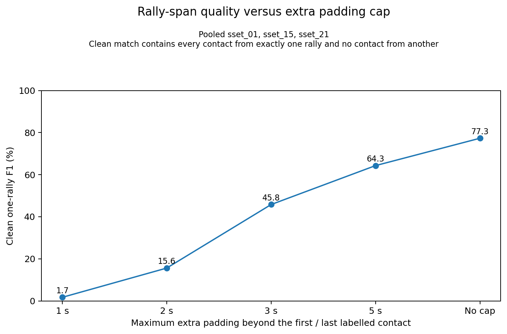
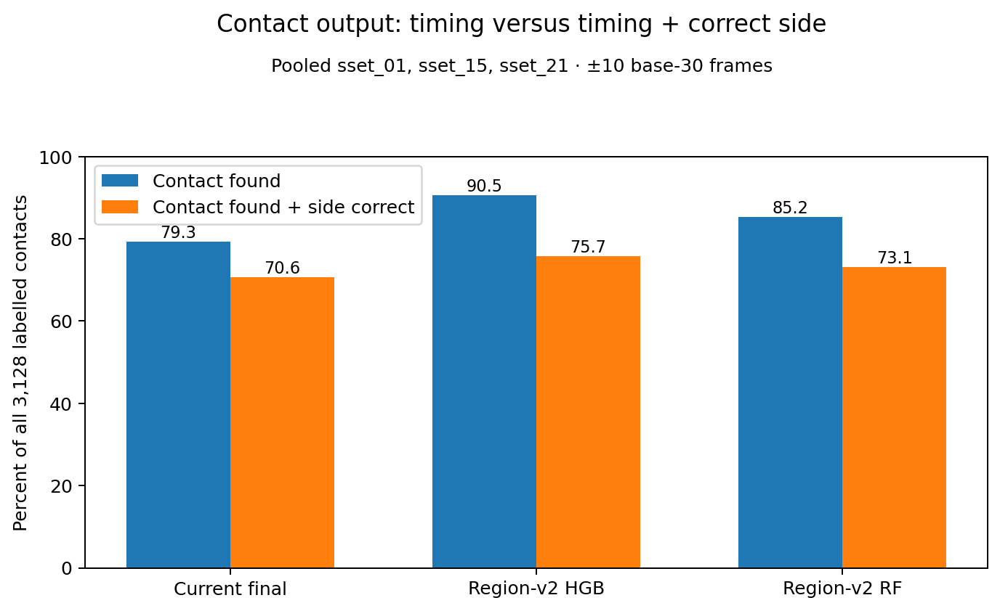
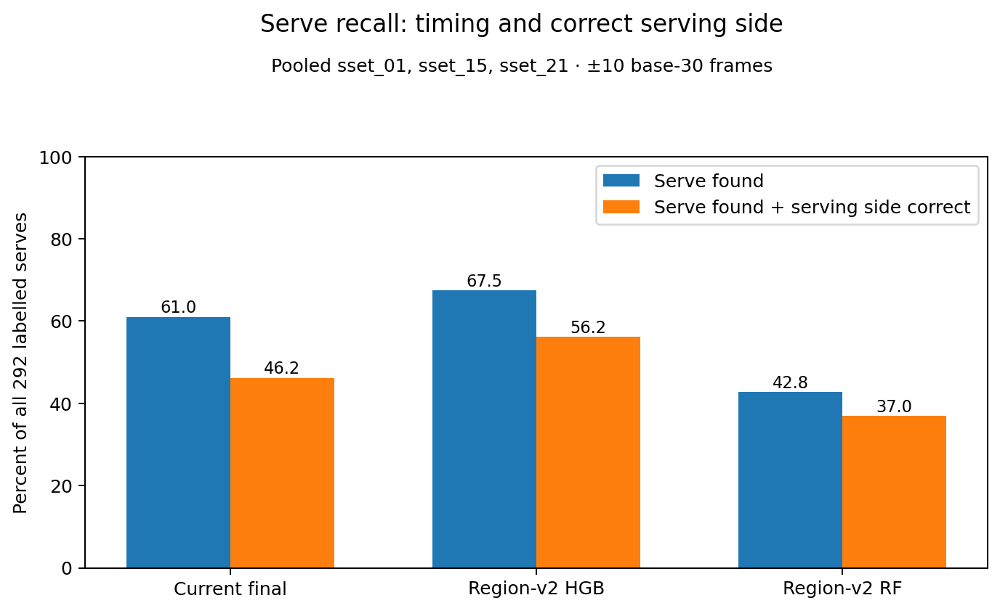

# Auto-annotator progress after the contact-detector experiments

This report is organised by **annotator output**.

It does not explain the RF/HGB feature engineering or training procedure. Those details live in [`tree_contact_detector_results.md`](tree_contact_detector_results.md).

## Table of contents

- [Current scorecard](#current-scorecard)
- [Rally identification](#rally-identification)
- [Strict complete-rally result](#strict-complete-rally-result)
- [Contact timing and contact player side](#contact-timing-and-contact-player-side)
- [Serve timing and serving side](#serve-timing-and-serving-side)
- [Rally-level server attribution](#rally-level-server-attribution)
- [What the new contact stream changes](#what-the-new-contact-stream-changes)
- [Recommendation](#recommendation)
- [Metric definitions](#metric-definitions)
- [Data and limits](#data-and-limits)

## Current scorecard

The outputs should stay separate.

The decision rows in the table use the original held-out HGB scores. B0 uses
the original score cut-off and duplicate-removal distance. N+ increases that
distance to 6 base-30 frames. T− keeps the original distance and lowers the
score cut-off by one point in the frozen grid.

| Output | Current result | Best result from this work | What changed |
| --- | ---: | ---: | --- |
| Rally segmentation | 77.3% clean one-rally F1 with no padding cap | unchanged | RF/HGB not rerun through span finder |
| Fully correct kept rally | not previously measured | **27 / 291 at no score cut; 13 / 68 at a 0.90 cut** | wider duplicate removal selected from five fixed decision rows |
| Contact timing | 72.6% F1 | **88.8% selected region-v2 HGB F1** | raw HGB is unchanged; only its duplicate-removal distance changes |
| Contact timing + correct player side | 70.6% recall | **75.7% B0 HGB recall** | N+ not separately tabulated at this boundary |
| Serve timing | 61.0% recall | **73.6% T− recall** | selected N+ reaches 67.1% |
| Serve timing + correct serving side | 46.2% recall | **56.2% B0 HGB recall** | N+ not separately tabulated at this boundary |
| Rally-level server side | 64.9% accuracy on answered rallies | unchanged | not rerun on HGB events |

The biggest improvement is contact timing. On B0, the complete contact+side
output improves over the current final heuristics. The event-level side table
has not been rerun for N+. The strict N+ rally result does include Top/Bottom
answers.

## Rally identification

Nothing in the tree work changed the rally-span finder.

Across the three fixtures:

- **292 labelled rallies**
- **311 predicted spans**
- **233 clean one-to-one matches** with no cap on extra padding

A clean match is still strict: the predicted span must contain **every labelled contact from exactly one rally and no labelled contact from another rally**. The seconds below do not relax that rule. They only cap how much extra time the predicted span may include before the rally's first contact and after its last contact.

| Maximum extra padding beyond the first/last contact | Precision | Recall | F1 |
| --- | ---: | ---: | ---: |
| 1 second | 1.6% | 1.7% | 1.7% |
| 2 seconds | 15.1% | 16.1% | 15.6% |
| 3 seconds | 44.4% | 47.3% | 45.8% |
| 5 seconds | 62.4% | 66.4% | 64.3% |
| No padding cap | 74.9% | 79.8% | 77.3% |

With no padding cap, the same clean one-rally containment rule gives **77.3% F1**.

The new contact stream has now been scored inside these fixed spans. The span finder itself is still unchanged.

## Strict complete-rally result

The earlier 77.3% rally-span F1 answers a boundary question. It checks whether
a predicted span contains one complete labelled rally and no contact from
another rally. It does not check the predicted contact list or player sides.

The new strict score checks the complete output. A predicted span is fully
correct only when:

- it maps to exactly one real rally
- every contact is found within ±10 base-30 frames
- no extra event remains
- every event has a Top/Bottom answer
- every Top/Bottom answer is correct

The system may abstain on a whole predicted span. Its timing confidence is the
lowest held-out HGB score among the retained events in that span. Player-side
confidence remains the current binary answered-or-missing signal.

The first table is the original HGB decision rule, B0. It is retained because
the failure audit and frame-rate comparison used this event stream.

| Minimum timing score | Predicted spans kept | Fully correct | Fully correct among kept |
| --- | ---: | ---: | ---: |
| 0.00 | 291 | 21 | 7.2% |
| 0.80 | 216 | 17 | 7.9% |
| 0.85 | 123 | 13 | 10.6% |
| 0.90 | 51 | 9 | **17.6%** |
| 0.95 | 11 | 1 | 9.1% |

These are kept predicted spans, not automatically valid rallies. At a zero
score cut, 34 kept spans do not map to one real rally. The curve also shows
that timing confidence alone is a weak rejection rule. A 0.90 cut discards
most output and leaves only nine fully correct spans.

At the stricter ±5 timing tolerance, 19 spans are fully correct at a zero
score cut and seven are fully correct at 0.90.

The frame-rate feature check did not improve the complete-rally result:

| HGB physical trial | Fully correct / kept at 0.00 | Fully correct / kept at 0.85 | Fully correct / kept at 0.90 |
| --- | ---: | ---: | ---: |
| **Existing raw motion** | **21 / 291** | **13 / 123** | **9 / 51** |
| Remove raw motion | 16 / 293 | 9 / 156 | 6 / 67 |
| Common 30 fps scale | 15 / 295 | 10 / 124 | 6 / 58 |

The common-scale trial slightly raises serve timing recall, from 67.5% to
68.2%, but it lowers overall timing F1 and loses fully correct rallies. The
existing raw-motion model therefore remained the feature baseline for the
decision-layer checks.

The decision-layer check then replayed five choices from those held-out scores.
It did not refit HGB. The selected N+ row increases the temporal
duplicate-removal distance from 5 to 6 base-30 frames:

| Minimum timing score | Predicted spans kept | Fully correct | Fully correct among kept |
| --- | ---: | ---: | ---: |
| 0.00 | 291 | 27 | 9.3% |
| 0.80 | 231 | 23 | 10.0% |
| 0.85 | 146 | 19 | 13.0% |
| 0.90 | 68 | 13 | **19.1%** |
| 0.95 | 14 | 1 | 7.1% |

N+ raises timing F1 from 87.4% to 88.8% and produces more fully correct
rallies through the 0.90 confidence setting. Timing confidence still leaves
fewer than one in five kept spans fully correct. The lower-score alternatives
recover more serves, but their extra events make more complete rallies fail.

### Serve-prefix candidate check

A compact serve-only candidate list finds a plausible earlier event for 60 of
N+'s 96 missed serves at ±10. A timing oracle recovers 58 new serve matches from
those frozen lists. It raises fully correct rallies from 27 to 29 with no
timing-score cut and loses none of N+'s correct rallies.

The predeclared fixed rule is not useful. It adds 79 events but only eight new
serve matches. Seventy additions remain unmatched. Fully correct rallies fall
from 27 to 16 at a zero score requirement and from 13 to 9 at 0.90.

This means the candidate list has headroom, but the hand-written chooser does
not. Do not add or tune that rule. A learned chooser needs a fresh-video test or
nested HGB cross-fitting before it can be assessed without leakage.

For the original B0 stream, each span is assigned to the first checkpoint it
fails in the order shown below:

| First failed checkpoint at ±10 | Predicted spans |
| --- | ---: |
| No predicted event | 16 |
| Events but no real rally | 31 |
| More than one real rally | 4 |
| Contact timing or event count | **210** |
| Player side after exact timing | 29 |
| Fully correct | 21 |

Among the 210 timing failures, 101 have both missing and extra events. Another
58 have extra events only, while 51 have missing contacts only. These groups
are derived from overlapping rejection flags. They describe where the
evaluation rules first fail, not a physical cause for the model error.

## Contact timing and contact player side

These are two different questions:

1. **Did we find the contact at the right time?**
2. **For a timing-matched contact, did the existing Top/Bottom rule identify the correct player side?**

At ±10, before the decision-layer change:

| Event stream | Timing precision | Timing recall | Timing F1 | Player-side accuracy given timing match | Timing + correct-side recall | Joint event+side F1 |
| --- | ---: | ---: | ---: | ---: | ---: | ---: |
| Current final heuristics | 66.9% | 79.3% | 72.6% | **89.0%** | 70.6% | 64.6% |
| **Region-v2 HGB (B0)** | **84.5%** | **90.5%** | **87.4%** | 83.7% | **75.7%** | **73.1%** |
| Region-v2 RF | 84.1% | 85.2% | 84.6% | 85.8% | 73.1% | 72.6% |

On timing-matched contacts, the side rule is right **83.7%** of the time for HGB and **89.0%** for the current final heuristics.

For non-serves:

- current side accuracy on timing matches: **90.0%**
- HGB side accuracy on timing matches: **83.7%**

But HGB raises non-serve timing recall from **81.2% to 92.9%**, so the share of all non-serves with both time and side right still rises from **73.1% to 77.7%**.

That leaves player-side attribution as the next obvious weak point.

The selected N+ decision layer has **87.2% precision, 90.3% recall and 88.8%
F1** for timing. Its event-level player-side score has not been tabulated
separately. The strict rally score above does include its Top/Bottom answers.

## Serve timing and serving side

A serve here means the **first labelled contact in a rally**. The tree does not predict a special serve class.

At ±10, before the decision-layer change:

| Event stream | Serve timing recall | Serving-side accuracy given timing match | Serve timing + correct-side recall |
| --- | ---: | ---: | ---: |
| Current final heuristics | 61.0% | 75.8% | 46.2% |
| **Region-v2 HGB (B0)** | **67.5%** | 84.1% | **56.2%** |
| Region-v2 RF | 42.8% | **86.4%** | 37.0% |

HGB finds more serves, and the side rule is also more accurate on the serves it finds.

The fixture split shows the remaining problem:

| Fixture | HGB serve timing recall | Serving-side accuracy when matched | Serve timing + correct-side recall |
| --- | ---: | ---: | ---: |
| `sset_01` | 74.3% | 81.0% | 60.2% |
| `sset_15` | 76.9% | 87.5% | 67.3% |
| `sset_21` | **44.0%** | 83.9% | **34.7%** |

On `sset_21`, the side rule is reasonable once a serve is found; the main problem is that HGB finds only **44.0%** of the serves.

The selected N+ rule finds **67.1%** of serves overall and **42.7%** on
`sset_21`. The pooled timing improvement does not fix the weakest fixture.

## Rally-level server attribution

This is separate from the per-serve side table above.

The per-serve table asks:

> “For this detected first contact, did the direct side rule identify the correct serving side?”

The rally-level logic asks:

> “After fitting one strict Top/Bottom alternation phase across the whole rally, what server side does that imply?”

On the current final-heuristic event stream:

- final hitter side: **112 / 228 = 49.1%**
- server side: **148 / 228 = 64.9%**
- 228 of 292 rallies answered

The alternation fit has **not** been rerun on HGB contacts.

Better contact recall may help because a missed contact can flip the parity of every later stroke. We have not rerun the alternation fit yet.

## What the new contact stream changes

The main change is simple: many fewer contacts are missed.

Before the tree experiment, many errors came from **not finding the contact at all**.

The selected N+ HGB stream removes a substantial part of that problem:

- contact timing recall: **79.3% → 90.3%**
- non-serve timing recall: **81.2% → 92.7%**
- serve timing recall: **61.0% → 67.1%**

On the original B0 stream, the side rule is right less often on HGB's
timing-matched contacts: **83.7%** versus **89.0%** for the current final
heuristics. N+ has not been tabulated separately at this event-level boundary.

So contact timing and player-side attribution should keep being measured separately.

## Recommendation

For the current auto-annotator:

- use **region v2** as the search region;
- use **HGB physical + validity** as the simple learned contact model;
- keep the existing raw-motion features;
- use the **6-base-30-frame duplicate-removal distance** selected by the
  decision-layer check;
- treat the selected HGB stream as a pilot, not as a ready complete-rally output;
- always report timing and timing+correct-side metrics together;
- do not treat **88.8% timing F1** as the score for the complete contact+side output;
- stop the three-fixture second-stage work because the label-blind shortlist
  recovered 97 contacts, below its predeclared 152-contact gate;
- keep the compact serve-prefix list as a fresh-video research lead, because
  its timing oracle passes the headroom gate;
- do not use or tune the tested fixed serve rule, because it loses 12 fully
  correct rallies while gaining one at the zero score requirement;
- treat its 3,383 unmatched rows as shortlist burden, not detector false
  positives;
- keep rescue search deferred because the original B0 audit found a region-v2
  candidate near all 13 otherwise-exact one-missing spans;
- do not claim rally-level server attribution improved until the alternation fit is rerun.

The exact region, features, controls and failure cases are in [`tree_contact_detector_results.md`](tree_contact_detector_results.md).

The proposed BST-X detector is specified separately in [`bst_x_contact_detector_plan.md`](bst_x_contact_detector_plan.md).

**Leave X3D-S aside for now.** RGB may show racket motion, shuttle blur or other clues that pose and shuttle features miss. Revisit it only if the failure cases point to useful visual information that is absent from the numeric streams.

## Metric definitions

**Contact timing precision / recall / F1**

One-to-one temporal matching between predicted contact events and labelled contact frames.

**Player-side accuracy given timing match**

Among timing-matched events for which the side rule answers Top/Bottom, the fraction with the correct labelled player side.

**Timing + correct-side recall**

Fraction of all labelled contacts for which both the event time and player side are correct.

**Joint event+side F1**

A prediction counts as correct only if it matches a labelled contact in time and gives the correct player side.

**Serve timing recall**

Contact timing recall restricted to the first labelled contact in each rally.

**Serve timing + correct-side recall**

Fraction of labelled serves for which both the serve time and serving side are correct.

## Data and limits

The measured fixtures are:

- `sset_01`
- `sset_15`
- `sset_21`

Together they contain:

- **292 rallies**
- **3,128 contacts**
- **292 serves**
- **2,836 non-serves**

The tree timing experiment is evaluated whole-fixture leave-one-out.

For player-side scoring, the event streams are frozen before player-side ground truth is loaded.

All three fixtures come from the same dataset, and there are only three of them. `sset_21` is the clearest reminder that the pooled score is not the whole story.

The strict rally curve uses the current fixed spans. It does not claim that a
new span finder would give the same result. The score cut-offs are pilot
measurements on three videos and must be refitted on the planned larger set.
The selected duplicate-removal distance is also a three-video pilot choice.
