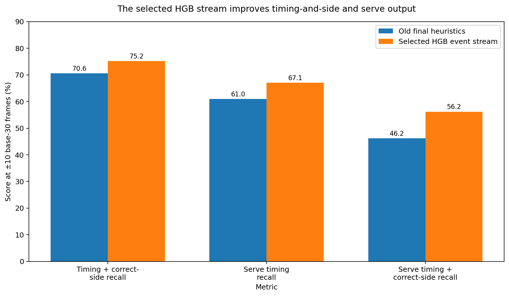
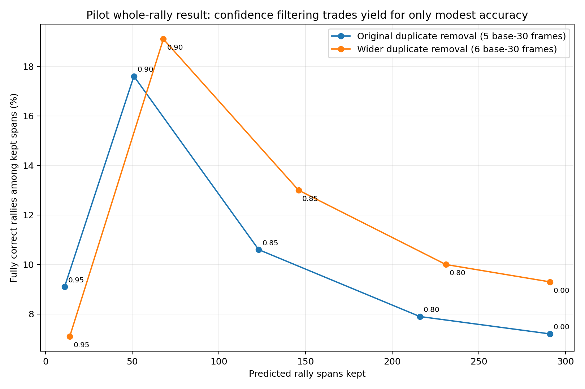
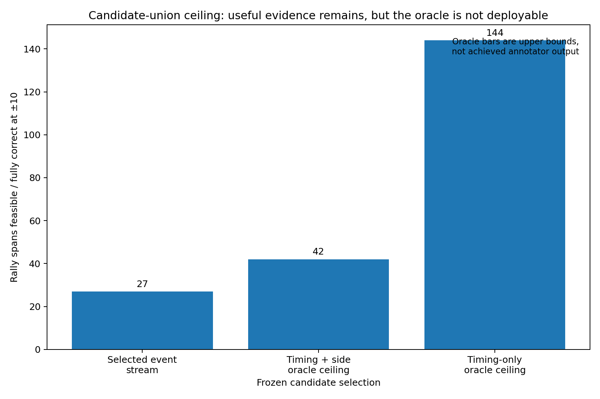
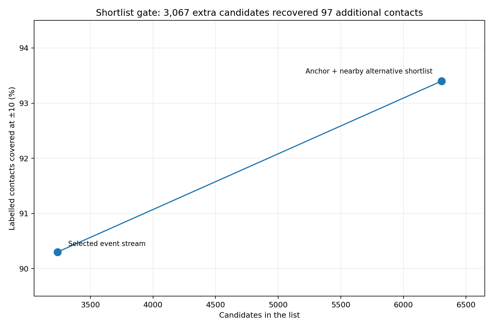
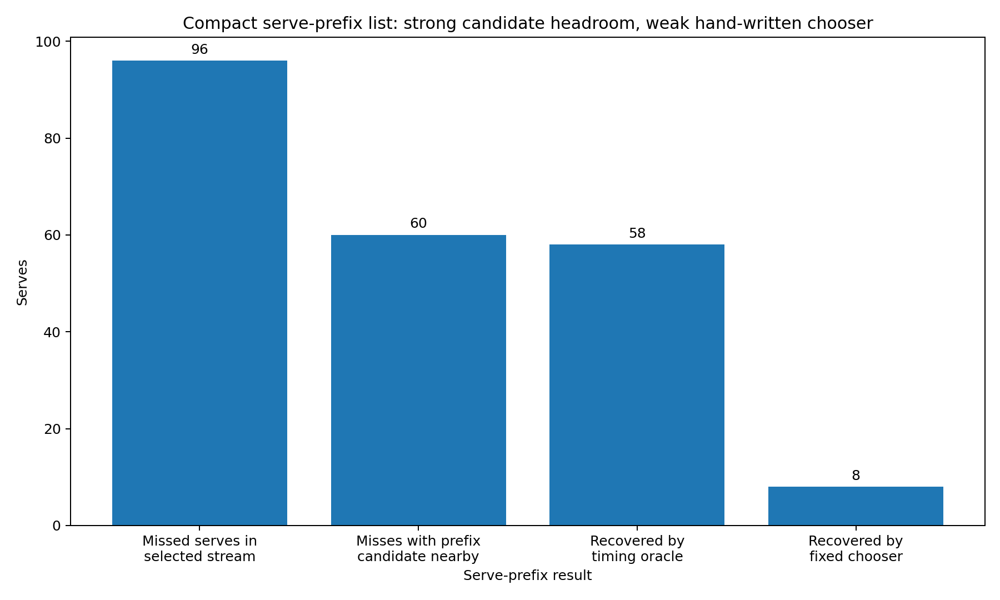
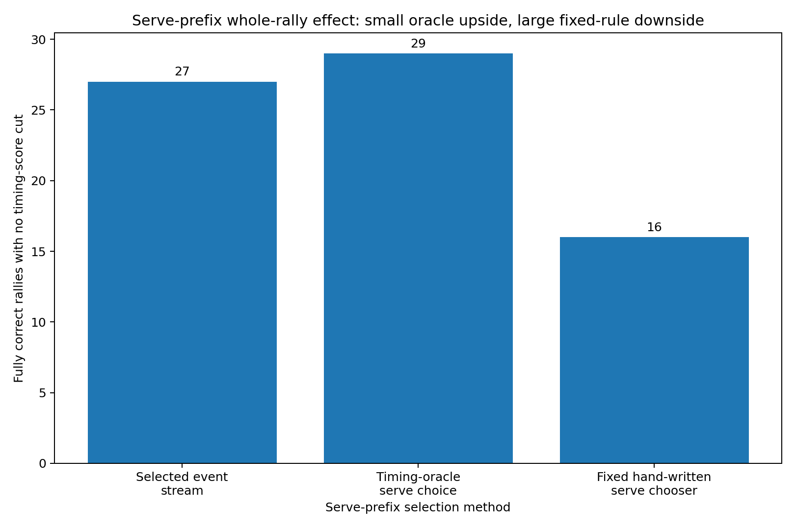

# Auto-annotator progress after the contact-detector experiments

This report answers one practical question:

> **What can the annotator produce correctly now, and what is still blocking useful end-to-end output?**

For the experiment details, see [`tree_contact_detector_results.md`](tree_contact_detector_results.md). For the short project-level summary, see [`README.md`](README.md).

## Table of contents

- [Current state in one minute](#current-state-in-one-minute)
- [Rally spans](#rally-spans)
- [Contact timing](#contact-timing)
- [Player side](#player-side)
- [Serves](#serves)
- [Fully correct kept rallies](#fully-correct-kept-rallies)
- [How much better could the current frozen evidence be?](#how-much-better-could-the-current-frozen-evidence-be)
- [What is breaking complete rallies](#what-is-breaking-complete-rallies)
- [What changed because of the follow-up experiments](#what-changed-because-of-the-follow-up-experiments)
- [What should be tested next](#what-should-be-tested-next)
- [Metric reference](#metric-reference)
- [Data and limits](#data-and-limits)

## Current state in one minute

| Annotator output | Current useful result | What to take from it |
| --- | ---: | --- |
| Rally-span identification | **77.3% F1** with no extra-padding cap | unchanged by the contact-tree work |
| Contact timing, old final heuristics | **72.6% F1** | old comparison point |
| Contact timing, original region-v2 HGB decisions | **87.4% F1** | large timing gain |
| Contact timing, best cheap decision-layer variant | **88.8% F1** | best pilot event stream; uses wider duplicate removal |
| Contact timing + correct player side, selected stream | **75.2% recall** | up from 70.6% for the old heuristics |
| Joint event-and-side F1, selected stream | **73.9%** | direct selected-stream side result is now available |
| Serve timing, selected stream | **67.1% recall** | still weak, especially on `sset_21` |
| Serve timing + correct serving side, selected stream | **56.2% recall** | up from 46.2% for the old heuristics |
| Fully correct kept rally | **27 / 291** with no timing-score cut; **13 / 68** at a 0.90 cut | complete output is still the bottleneck |
| Candidate-union full-rally ceiling | **42 fully correct rallies at ±10** | upper bound only; not a deployable selector |
| Candidate-union timing-only ceiling | **144 timing-exact rallies at ±10** | shows how much player-side attribution limits this frozen union |
| Rally-level server side | **64.9% accuracy on answered rallies** on the old heuristic stream | not rerun on HGB events |

The main improvement is real: **contact timing is much better**.

The main disappointment is also clear: **better contact timing has not yet produced a large, reliable set of fully correct rallies**.

## Rally spans

The contact-tree work did not change the upstream rally-span finder.

Across the three pilot videos there are:

- **292 labelled rallies**;
- **311 predicted spans**;
- **233 clean one-to-one span matches** when there is no limit on extra padding before the first contact or after the last contact.

The span score asks only whether one predicted span contains one complete labelled rally and no labelled contact from another rally. It does **not** ask whether the predicted contact events inside that span are correct.

| Maximum extra padding beyond first/last labelled contact | Precision | Recall | F1 |
| --- | ---: | ---: | ---: |
| 1 second | 1.6% | 1.7% | 1.7% |
| 2 seconds | 15.1% | 16.1% | 15.6% |
| 3 seconds | 44.4% | 47.3% | 45.8% |
| 5 seconds | 62.4% | 66.4% | 64.3% |
| No padding cap | 74.9% | 79.8% | **77.3%** |

So the rally-span finder is not solved, but it is also not what the new contact experiments changed.

## Contact timing

The old final heuristic contact list has:

- **66.9% precision**;
- **79.3% recall**;
- **72.6% F1**.

The original region-v2 HGB event stream improves that to:

- **84.5% precision**;
- **90.5% recall**;
- **87.4% F1**.

A later cheap decision-layer test used the same held-out HGB scores and only changed how nearby predictions were collapsed into events. The best pilot choice increased the duplicate-removal distance from 5 to 6 base-30 frames.

That selected event stream has:

- **87.2% precision**;
- **90.3% recall**;
- **88.8% F1**.

This is the best contact-timing result in the pilot.

The 6-base-30-frame distance is **not** a decided constant. It was the best of a small fixed set on these three videos and must be selected again on the larger dataset.

## Player side

The contact tree predicts **when** a contact happened. It does not predict Top versus Bottom.

The existing Top/Bottom rule is applied afterwards.

The selected event stream has now been scored directly for player side.

| Event stream | Timing recall | Side accuracy on answered timing matches | Timing + correct-side recall | Joint event-and-side F1 |
| --- | ---: | ---: | ---: | ---: |
| Old final heuristics | 79.3% | **89.0%** | 70.6% | 64.6% |
| Original region-v2 HGB decisions | **90.5%** | 83.7% | **75.7%** | 73.1% |
| **Selected wider-duplicate-removal stream** | 90.3% | 83.4% | 75.2% | **73.9%** |
| Region-v2 random forest | 85.2% | 85.8% | 73.1% | 72.6% |

The selected HGB stream still improves the combined timing-and-side output over the old heuristics. It trades a small amount of timing-plus-correct-side recall against the original HGB decisions for fewer events and a slightly higher joint event-and-side F1.

**88.8% timing F1 is still only the timing score.** Keep timing and player-side metrics separate.

## Serves

A serve here means the first labelled contact in a rally.

For the original HGB decisions:

| Event stream | Serve timing recall | Serving-side accuracy when timing matches | Serve timing + correct-side recall |
| --- | ---: | ---: | ---: |
| Old final heuristics | 61.0% | 75.8% | 46.2% |
| Original region-v2 HGB decisions | **67.5%** | **84.1%** | **56.2%** |
| Region-v2 random forest | 42.8% | 86.4% | 37.0% |

The selected wider-duplicate-removal stream reaches **67.1% serve timing recall** overall and **56.2% serve timing + correct-side recall**.

The pooled number hides the main problem:

| Fixture | Original HGB serve timing recall | Selected wider-duplicate-removal recall |
| --- | ---: | ---: |
| `sset_01` | 74.3% | not separately highlighted here |
| `sset_15` | 76.9% | not separately highlighted here |
| `sset_21` | **44.0%** | **42.7%** |

Region v2 contains **71 of 75** serves in `sset_21`, so most of this fixture's serve problem happens after search-region construction.

The larger experiment should keep serves as a separate slice rather than assuming pooled contact F1 will fix them automatically.

## Fully correct kept rallies

This is the metric that most directly matches the desired annotator output.

A kept predicted span counts as fully correct only when:

1. it maps to exactly one real rally;
2. every labelled contact is found;
3. no extra contact event remains;
4. every contact has a Top/Bottom answer;
5. every Top/Bottom answer is correct.

A missing side answer rejects the whole rally.

That meaning stays fixed across the follow-up experiments.

The system can reject a whole span using a timing-confidence requirement. The confidence used here is the weakest retained HGB event score in that span.

### Original HGB event decisions

| Minimum whole-rally timing score | Spans kept | Fully correct | Fully correct among kept |
| --- | ---: | ---: | ---: |
| 0.00 | 291 | 21 | 7.2% |
| 0.80 | 216 | 17 | 7.9% |
| 0.85 | 123 | 13 | 10.6% |
| 0.90 | 51 | 9 | 17.6% |
| 0.95 | 11 | 1 | 9.1% |

### Wider duplicate-removal decisions

| Minimum whole-rally timing score | Spans kept | Fully correct | Fully correct among kept |
| --- | ---: | ---: | ---: |
| 0.00 | 291 | 27 | 9.3% |
| 0.80 | 231 | 23 | 10.0% |
| 0.85 | 146 | 19 | 13.0% |
| 0.90 | 68 | 13 | **19.1%** |
| 0.95 | 14 | 1 | 7.1% |

The wider duplicate-removal rule is an improvement, but timing confidence by itself is still a weak abstention signal. At the best reported point, fewer than one in five kept spans are fully correct.

That is why the 88.8% contact-timing F1 should not be presented as if the annotator is 88.8% correct end to end.

## How much better could the current frozen evidence be?

The broad candidate-union oracle is deliberately unrealistic. It chooses the best possible subset **after** the candidate list and player-side answers are frozen.

Its purpose is to answer whether more useful rallies are even present in the evidence.

At ±10:

| What is required | Rally count |
| --- | ---: |
| Fully correct using the selected event stream | **27** |
| Some subset finds every contact within ±10 and adds no extras | **144** |
| Some subset also gives every contact the correct side | **42** |

This gives two useful conclusions.

First, **there is meaningful selector headroom**: 42 fully correct rallies are possible with the current frozen side answers, versus 27 selected now.

Second, **player side is the larger evidence limit inside this union**. Timing alone could support 144 rallies.

Do not describe 42 or 144 as achieved annotator performance. They are upper bounds.

## What is breaking complete rallies

The original HGB event stream gives the clearest diagnostic because the detailed miss audit was run on it.

Of the 311 predicted spans:

- **210** reach one real rally but fail on contact timing or event count before player side becomes the deciding issue;
- **29** get the contact list right and then first fail on player side;
- **21** are fully correct;
- the remainder have no predicted event or do not cleanly map to one real rally.

Within those 210 timing/event-count failures, missing and extra events both matter.

The contact audit gives the more useful explanation of the misses:

- the original HGB stream misses **296 contacts** at ±10;
- **244** of those misses already have a seeded HGB candidate nearby;
- **89 of 95** missed serves have a candidate nearby in the fixed search surface;
- all **13** otherwise-exact one-missing-contact spans have a candidate nearby.

So the useful interpretation is not “the search region failed 296 times.” In most of these cases the system saw a plausible place to score and then did not turn it into the correct final event.

## What changed because of the follow-up experiments

### Frame-rate feature check

The pilot mixes 25 fps and 30 fps video, so raw movement-per-frame values were a legitimate concern.

| Motion treatment | Timing F1 | Serve recall | Fully correct / kept with no timing cut |
| --- | ---: | ---: | ---: |
| Existing raw per-frame motion | **87.4%** | 67.5% | **21 / 291** |
| Remove frame-rate-sensitive motion | 84.8% | 47.9% | 16 / 293 |
| Convert motion to a common 30 fps scale | 87.0% | **68.2%** | 15 / 295 |

Raw motion won this pilot. The common-30 version found two more serves overall, but lost pooled timing F1 and complete rallies.

That is suggestive, not definitive. Retest the convention with more videos and more frame-rate diversity.

### Cheap event-selection check

Five fixed decision-layer variants were replayed from the same held-out HGB scores.

| Plain-language variant | Predicted events | Timing F1 | Serve recall | Fully correct rallies with no timing cut |
| --- | ---: | ---: | ---: | ---: |
| Original score cut-off, duplicate distance 5 | 3,350 | 87.4% | 67.5% | 21 |
| Lower score cut-off everywhere | 3,559 | 86.4% | **73.6%** | 14 |
| Smaller duplicate distance 4 | 3,704 | 83.1% | 67.5% | 7 |
| **Wider duplicate distance 6** | **3,238** | **88.8%** | 67.1% | **27** |
| Lower score cut-off only near rally starts | 3,386 | 87.3% | 70.5% | 20 |

The useful lesson is that **removing a few more nearby duplicate peaks helped more than lowering the score threshold**.

The larger dataset should retune the distance. It should not inherit “6” as a constant.

### Broad shortlist and candidate-union ceiling

The selected event stream has 3,238 events and matches 2,825 contacts at ±10.

The label-blind shortlist kept all of those events and added one nearby alternative around each anchor where possible. After deduplication:

- candidate count: **3,238 → 6,305**;
- matched contacts: **2,825 → 2,922**;
- contact coverage: **90.3% → 93.4%**;
- recovered misses: **97 of 303**;
- added candidates: **3,067**;
- added candidates still unmatched: **2,970**.

The predeclared recovery requirement was at least **152** recovered contacts while staying below twice the original list size. The shortlist passed the size limit and failed the recovery requirement.

So stop this exact shortlist as a practical second-stage input on the pilot.

A separate oracle changes the interpretation of **why** it stopped. The frozen union still has theoretical complete-rally headroom: at ±10, fully correct rallies can rise from **27 to 42** if the correct subset is chosen, while timing alone is feasible for **144** rallies.

The tested shortlist and handcrafted chooser failed, but the evidence itself does not lack headroom. **No validated label-blind selector has realised that headroom.**

### Compact serve-prefix candidate list

The broad shortlist is noisy, so a serve-specific follow-up keeps at most five candidates before each detected span's first selected event.

Among the selected stream's **96 missed serves**:

- **60** have a frozen prefix candidate within ±10;
- a timing oracle recovers **58** new serve matches;
- no existing serve match is lost;
- fully correct rallies rise **27 → 29** with no timing-score cut.

The fixed hand-written chooser is not useful. It adds **79** events, finds only **8** new serves, leaves **70** added events unmatched, and reduces fully correct rallies from **27 to 16** with no timing-score cut.

Keep the candidate-list idea for a fresh-data selector experiment. Do not use or tune the tested chooser.

### Serve-lookback threshold closure

Lowering the score only in the existing serve-lookback region adds five events and two serve timing matches.

It adds **no correctly sided serve** and **no fully correct rally**. Joint event-and-side F1 falls slightly because of the extra predictions.

Close this exact threshold idea on the pilot.

## What should be tested next

On the larger dataset:

- refit the contact model from scratch with whole-video splits;
- retest raw versus frame-rate-normalised motion;
- reselect score thresholds and duplicate-removal distance;
- investigate serves separately if their error pattern persists;
- keep the selected-stream Top/Bottom table in the main scoreboard;
- rerun rally-level alternation after the contact stream is fixed;
- keep the strict whole-rally definition unchanged;
- test a serve-prefix selector only on fresh whole videos or with nested cross-fitting;
- only revisit a broad second stage if a new candidate list gives better coverage per candidate;
- measure player-side improvements alongside timing, because the candidate-union ceiling shows that side evidence can dominate the remaining rally gap;
- do not spend more pilot effort on the failed fixed serve chooser or the serve-lookback threshold;
- only widen off-region search if it recovers a useful number of otherwise-complete rallies.

## Metric reference

**Contact timing precision / recall / F1:** one-to-one temporal matching between predicted contact events and labelled contact frames.

**Player-side accuracy on timing matches:** among timing-matched contacts for which the side rule answers Top/Bottom, the fraction with the correct labelled player side.

**Timing + correct-side recall:** the fraction of all labelled contacts for which both event timing and player side are correct.

**Joint event-and-side F1:** a prediction counts as correct only if it matches a labelled contact in time and gives the correct player side.

**Oracle ceiling:** an upper bound obtained by using labels to choose from an already-frozen candidate set. It measures available evidence, not deployable performance.

**Serve timing recall:** contact timing recall restricted to the first labelled contact in each rally.

**Fully correct kept rally:** a kept predicted span that maps to one real rally, contains all and only the correct contacts, and gives the correct player side for every contact.

## Data and limits

The pilot uses:

- `sset_01`;
- `sset_15`;
- `sset_21`.

Together they contain:

- **292 rallies**;
- **3,128 contacts**;
- **292 serves**;
- **2,836 non-serves**.

The contact-tree evaluation keeps whole fixtures together.

All three fixtures come from the same dataset. This is a small, low-diversity pilot. Treat differences of a few points as clues about design, not as stable production estimates.

The fitted trees, score cut-offs and duplicate-removal settings all need to be chosen again on the planned larger dataset.
