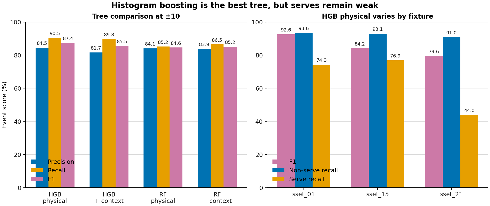

# Tree contact detector trial

## Bottom line

Region version 2 substantially raises pooled serve coverage. It searches ordinary physical seeds across court-view intervals and adds 45 base-30 frames before each interval for serves shown just before a broadcast cut. At ±10, the region contains 98.4% of non-serves and 97.9% of serves.

`sset_21` still limits the result. Its region contains 93.7% of non-serves and 94.7% of serves at ±10. All 37 missing non-serves have a visible shuttle nearby, but no usable sticky player evidence and no detected rally span. A wider shuttle-only search could reach them, but the simple version covers about 91% of the whole broadcast and admits replay noise.

Histogram boosting remains the best tree. With physical features and validity masks on region v2, it reaches 84.5% precision, 90.5% recall and 87.4% F1 at ±10. Non-serve recall is 92.9%; serve recall is 67.5%. Against region v1, version 2 trades 3.0 precision points for 2.1 recall points.

The sensible next step is a BST-X pilot on the same frozen region. Keep the tree as the cheap baseline. Treat the missing off-court `sset_21` contacts as a separate search problem rather than tuning the tree around them.

## What region v2 does

The freezer does not load ground truth. It derives hard court-view intervals from the saved tracker intervals and definitive exclusion mask. It then:

- calculates shuttle and player features across the full search intervals, including pre-roll;
- keeps the six region-v1 seeds and expansion widths;
- adds a 45-base-30-frame pre-roll before every eligible interval;
- clips feature windows to the resulting search interval;
- freezes every search frame so the full ceiling can be measured;
- trains and scores trees only on frames selected by at least one region channel.

The six retained seeds are current raw proposals, relaxed shuttle impulse, wrist-gap minima, shuttle visibility changes, detected rally starts and scene starts. The seventh channel is the serve pre-roll.

The three videos contain 404,229 source frames. Region v2 freezes 130,624 frames and selects 128,824 for model scoring, or 31.9% of the videos. Two independent freezes are byte-identical.

The pre-roll deliberately sits outside the eligible court-view interval. The headline region ceiling therefore means “the model's full search surface”, not “court-view frames only”. Both ceilings are reported below.

## Search ceiling

Strict coverage requires the exact labelled frame to be present. Operational coverage allows the normal evaluation margin.

| Surface | Measure | Non-serves | Serves | All contacts |
| --- | --- | ---: | ---: | ---: |
| Court-view intervals only | Strict | 2,783 / 2,836 (98.1%) | 251 / 292 (86.0%) | 3,034 / 3,128 (97.0%) |
| Court-view intervals only | ±10 | 2,789 / 2,836 (98.3%) | 272 / 292 (93.2%) | 3,061 / 3,128 (97.9%) |
| Region v2 with serve pre-roll | Strict | 2,790 / 2,836 (98.4%) | 285 / 292 (97.6%) | 3,075 / 3,128 (98.3%) |
| Region v2 with serve pre-roll | ±10 | 2,790 / 2,836 (98.4%) | 286 / 292 (97.9%) | 3,076 / 3,128 (98.3%) |

The seed union and the full version-2 search surface have the same contact coverage. The relaxed impulse and wrist channels already cover nearly every eligible frame.

At ±10, the fixture split is:

| Fixture | Non-serve coverage | Serve coverage | All contacts |
| --- | ---: | ---: | ---: |
| `sset_01` | 1,519 / 1,528 (99.4%) | 111 / 113 (98.2%) | 1,630 / 1,641 (99.3%) |
| `sset_15` | 720 / 720 (100.0%) | 104 / 104 (100.0%) | 824 / 824 (100.0%) |
| `sset_21` | 551 / 588 (93.7%) | 71 / 75 (94.7%) | 622 / 663 (93.8%) |

The pre-roll is doing real work. Without it, `sset_15` serve coverage is 95.2% and `sset_21` serve coverage is 82.7% at ±10.

### `sset_21` miss audit

The following table counts the 37 `sset_21` non-serves still outside region v2 at ±10.

| Evidence within ±10 of the labelled contact | Missed contacts meeting the condition |
| --- | ---: |
| Shuttle visible | 37 / 37 |
| Sticky player frame analysed | 0 / 37 |
| Player pick available | 0 / 37 |
| Inside a detected rally span | 0 / 37 |

The common failure is therefore a shuttle-visible frame outside both court tracking and the detected rally spans. A wider pose search cannot add player evidence that is absent.

### The deliberately noisy ceiling

As a diagnostic, the same relaxed impulse rule was run across each entire video with no court, replay or rally boundary. Its ±15 expansion covers 366,048 of 404,229 source frames, or 90.6% of the broadcasts. At ±10 it contains every non-serve and 291 of 292 serves.

That answers the pure ceiling question: the saved shuttle track can seed almost every contact if noise is allowed to become extreme. It is not a useful shared search region yet. It does not exclude replay, close-up or between-rally footage, and it gives the pose model mostly missing player inputs.

## Main tree result

The physical input contains shuttle motion and impulse, player–shuttle wrist gaps, relative wrist position, ankle motion and explicit validity masks. It excludes absolute image position, player size, interval progress, scene timing and proposal-source flags.

| Margin | Precision | Recall | F1 | Non-serve recall | Serve recall | Median error |
| --- | ---: | ---: | ---: | ---: | ---: | ---: |
| ±5 | 81.1% | 86.9% | 83.9% | 90.1% | 55.8% | 1 frame |
| ±10 | 84.5% | 90.5% | **87.4%** | 92.9% | 67.5% | 1 frame |
| ±15 | 85.1% | 91.1% | 88.0% | 93.1% | 71.9% | 1 frame |

At ±10, the model emits 3,350 events and matches 2,832 of 3,128 labelled contacts.

The held-out fixtures still differ substantially:

| Fixture | Threshold | Precision | Recall | F1 | Non-serve recall | Serve recall |
| --- | ---: | ---: | ---: | ---: | ---: | ---: |
| `sset_01` | 0.80 | 92.9% | 92.3% | 92.6% | 93.6% | 74.3% |
| `sset_15` | 0.75 | 78.4% | 91.0% | 84.2% | 93.1% | 76.9% |
| `sset_21` | 0.75 | 74.3% | 85.7% | 79.6% | 91.0% | 44.0% |

Thresholds come from inner held-out fixture predictions. The outer test fixture does not choose its threshold.

## Region-v1 comparison

| Region and model | Precision | Recall | F1 | Non-serve recall | Serve recall |
| --- | ---: | ---: | ---: | ---: | ---: |
| V1 HGB physics | **87.5%** | 88.4% | **87.9%** | 91.1% | 62.7% |
| V2 HGB physics | 84.5% | **90.5%** | 87.4% | **92.9%** | **67.5%** |

Version 2 finds more real contacts and more false contacts. Its 2.1-point recall gain costs 3.0 precision points. The best observed tree F1 remains version 1, while version 2 is the fair baseline for any model using the corrected search surface.

## Model and shortcut comparison

| Model | Features | Precision | Recall | F1 | Non-serve recall | Serve recall |
| --- | --- | ---: | ---: | ---: | ---: | ---: |
| Histogram boosting | Physics + validity | **84.5%** | **90.5%** | **87.4%** | **92.9%** | **67.5%** |
| Histogram boosting | Physics + context + validity | 81.7% | 89.8% | 85.5% | 92.5% | 63.4% |
| Random forest | Physics + validity | 84.1% | 85.2% | 84.6% | 89.6% | 42.8% |
| Random forest | Physics + context + validity | 83.9% | 86.5% | 85.2% | 90.4% | 47.9% |

Histogram boosting is still the clear tree choice. Context no longer gives a useful recall trade on version 2. It lowers every main pooled measure.

| Control at ±10 | Precision | Recall | F1 |
| --- | ---: | ---: | ---: |
| HGB context only | 47.0% | 79.6% | 59.1% |
| RF context only | 37.1% | 82.2% | 51.1% |
| HGB missingness only | 16.1% | 96.9% | 27.5% |
| RF missingness only | 16.0% | 96.9% | 27.5% |

The missingness controls obtain high recall by spraying predictions across the search surface. Their precision makes the shortcut obvious. Context carries broadcast timing, but remains far below the physical model.

### Boundary sensitivity

The physical model includes validity masks, so it can recognise tracking and scene boundaries. An independent audit reran every fold after removing all frames outside the eligible court-view intervals. Threshold selection, training and temporal NMS were all repeated on the filtered rows.

At ±10, that stricter refit reaches 86.3% precision, 89.1% recall and 87.7% F1. Non-serve recall is 91.5% and serve recall is 65.8%. This is effectively the same result as the full search surface. Only 9 of the full model's 3,350 detections land in pre-roll frames.

The main table should still be read as physical features plus explicit validity information. It is not a test of shuttle mechanics with every broadcast-boundary cue removed.

## Recommendation

Use region v2 for the next bounded classifier comparison. Keep the serve pre-roll as a backwards window because its purpose is to inspect the close-up lead-in before the court view begins. A forward window starts after that evidence.

Keep HGB physics as the cheap baseline. Do not tune the random forest further. For a same-region comparison, BST-X needs to beat the version-2 HGB result of 87.4% F1. The existing plan's harder acceptance floor remains sensible: 89.9% F1 with at least 87.5% precision at ±10.

Region v2 still misses the plan's 97% per-fixture non-serve gate on `sset_21`. A small BST-X pilot can still answer whether temporal pose and shuttle evidence beat the tree inside the bounded region. It cannot establish whole-video recall.

Before claiming a final detector, add a separate search path for shuttle-visible frames outside court tracking. The likely choices are a stricter shuttle-only proposal with replay rejection, or an RGB/scene model that can distinguish live close-ups from replay and cutaway footage. Do not widen the pose search to 91% of the whole broadcast and call that solved.

## Limits

There are only three fixture videos. Leave-one-fixture-out prevents direct frame leakage, but it remains a small in-domain test.

The `sset_21` miss audit above supports a search and missing-input diagnosis. It does not show whether an RGB view model can reliably separate live close-ups from replay.

The negative sampler uses fixture ground truth only after the label-blind freeze. That is correct for supervised fitting. ShuttleSet22 is still needed before treating a threshold as portable.

Event scoring uses the project's closest-pair greedy matcher for comparability. The earlier maximum-cardinality sensitivity check left the HGB physics matched total unchanged at ±10.

## Reproduction record

The current result uses `tree-contact-features/2` from standard-stage source commit `ad8da4f`. The two final compressed freezes and manifests are byte-identical. The feature SHA-256 is `4a5efbd6582701a708270a3b273be2d2572bc3753085ec449b7db815dffec722`.

The ignored evidence lives under `scratch/contact_det/raw/region_v2/`. Version-1 evidence remains under `scratch/contact_det/raw/tree_trial/`.

The tracked scripts are:

- `freeze_tree_contact_features.py`
- `score_tree_contact_detector.py`
- `test_tree_contact_detector.py`
- `plot_contact_det_reports.py`

Focused Ruff and pytest results, whole-repository gates and the read-only audit are recorded in the ignored worklog. The scorer now also verifies that every saved row matches its declared search interval and fixture frame rate.
