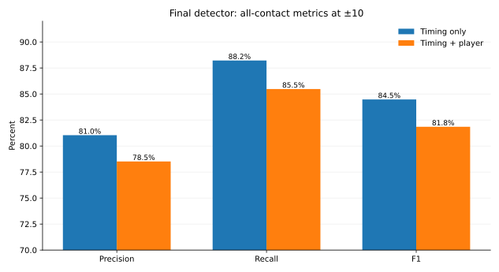
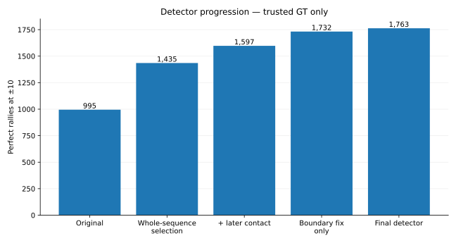
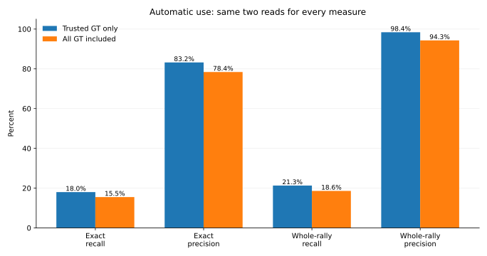
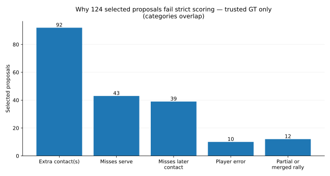

# Contact detection closing pass: what to keep

This folder records the last scripts-only experiments on badminton contact detection.

## How the numbers are reported

The 47 ShuttleSet22 videos contain **3,965 rallies** in the source CSVs.

The existing cleaning drops **543 rallies** from strict scoring:

- 542 have at least one contact marked `flaw`;
- 1 has contact timestamps out of order.

That leaves **3,422 rallies whose ground truth we trust**.

The tables compare two sets of labels:

| Read | What it means |
|---|---|
| **Trusted GT only** | Score against the 3,422 retained rallies. Selection precision uses judgeable proposals. |
| **All GT included** | Restore all source labels, including flagged rows. Unknown selections receive no credit. |

Both reads are now measured from the saved predictions. The [compact reference](serve_tables.md) contains the full comparison.

## Final detector

At ±10 frames on a 30 fps clock:

### Individual contacts

| Task | Labels | Precision | Recall | F1 |
|---|---|---:|---:|---:|
| Timing only | Trusted GT | 81.0% | 88.2% | 84.5% |
| Timing only | All GT | 90.1% | 86.9% | 88.4% |
| Timing + correct player | Trusted GT | 78.5% | 85.5% | 81.8% |
| Timing + correct player | All GT | 87.2% | 84.0% | 85.6% |

Recall by contact type:

| Contact type | Labels | Timing recall | Timing + correct-player recall |
|---|---|---:|---:|
| Non-serve | Trusted GT | 88.9% | 86.3% |
| Non-serve | All GT | 88.4% | 85.7% |
| Serve | Trusted GT | 81.3% | 77.4% |
| Serve | All GT | 72.0% | 67.3% |

There is no separate full-stream non-serve precision because the detector does not classify every prediction as serve/non-serve.

### Rally start and full rally

| Task | Labels | Precision | Recall | F1 |
|---|---|---:|---:|---:|
| Start is serve | Trusted GT | 70.4% | 76.7% | 73.4% |
| Start is serve | All GT | 72.1% | 67.7% | 69.8% |
| Start + correct server | Trusted GT | 68.1% | 74.1% | 71.0% |
| Start + correct server | All GT | 68.5% | 64.4% | 66.4% |

**Perfect-rally recall is 1,763 / 3,422 = 51.5% with trusted GT, or 1,763 / 3,965 = 44.5% with all GT.**

## Automatic use

The ranking model selects **784** proposed rallies.

For fully correct rally selection:

| Measure | Trusted GT only | All GT included |
|---|---:|---:|
| **Fully correct rally precision** | **616 / 740 = 83.2%** | **615 / 784 = 78.4%** |
| **Fully correct rally recall** | **616 / 3,422 = 18.0%** | **615 / 3,965 = 15.5%** |
| **Fully correct rally F1** | **29.6%** | **25.9%** |

Restoring the original labels gives **615 correct, 140 wrong and 29 still unknown**. Unknown cases receive no credit in the all-GT column.

The more useful surprise is that most of the 124 fully-correct-rally failures are still recognisably the right rally.

- **616** selected proposals are perfect.
- **112** more contain exactly one whole labelled rally, but have contact-level mistakes.
- Only **12** have a more fundamental problem: the segment cuts off the rally or overlaps more than one labelled rally.

So if the task is simply **“is this one whole rally?”**:

| Measure | Trusted GT only | All GT included |
|---|---:|---:|
| **Contains one whole rally precision*** | **728 / 740 = 98.4%** | **739 / 784 = 94.3%** |
| **Contains one whole rally recall*** | **728 / 3,422 = 21.3%** | **739 / 3,965 = 18.6%** |
| **Contains one whole rally F1*** | **35.0%** | **31.1%** |

*Some contact details inside the rally may still be incorrect.*

That is a very different product result from the fully-correct-rally score. The ranking model is not safe enough to write exact ground truth automatically, but it is **extremely good at selecting clips that really are one whole rally**.

### What is wrong in the 124 fully-correct-rally failures?

These categories overlap:

| Problem | Selected proposals |
|---|---:|
| Extra predicted contact(s) | **92** |
| Misses the serve | **43** |
| Misses a later contact | **39** |
| Wrong or missing player assignment | **10** |
| Does not cleanly contain one whole rally | **12** |

So **112 / 124 = 90.3%** of the fully-correct-rally failures are still the correct whole rally. They fail because the contact sequence is imperfect, not because the system found the wrong piece of video.

## What “perfect” means

A proposed rally is perfect only if it:

1. contains one whole labelled rally;
2. matches every labelled contact once within ±10 frames;
3. has no extra contact that contradicts the GT; and
4. assigns every contact to the correct player.

The ±5 figures in the detailed reports use the same predictions with a stricter timing allowance. The main target is ±10.

## What changed the detector

### 1. Choose between finished contact sequences

Instead of judging each possible repair by itself, we generated a few finished versions of each rally and trained one model to pick between them.

On the 47 videos, the trusted-GT count rose **995 → 1,435** perfect rallies.

See [broader_comparison.md](broader_comparison.md).

### 2. Allow one missed contact later in the rally

The pipeline had already saved plausible contact timestamps that were not selected.

Letting the model add one of those later candidates raised the trusted-GT count **1,435 → 1,597**.

A simple safety rule mattered: only make the change if the new sequence scores at least **0.05 higher** than the old one.

See [later_contact_comparison.md](later_contact_comparison.md).

### 3. Fix the proposed rally's start and end times

This was the biggest late surprise.

Some proposed rallies already had the right contact sequence, but the video segment started too late or ended too early.

Fixing those boundaries alone raised the trusted-GT count **1,597 → 1,732**, with **135 repairs and no observed losses at ±10**.

Adding a local score for the proposed inserted contact brought the final count to **1,763**.

A substantial part of the remaining “contact detector” problem was therefore **rally segmentation**, not contact detection.

See [followup_comparison.md](followup_comparison.md).

## What did not earn a place in the final system

- Looking at more possible serve timestamps reached 1,767 instead of 1,763, but repaired 19 rallies while breaking 15 relative to the recommended version.
- Allowing two later contacts to be inserted did not produce a useful learned gain.
- A separate model for deleting extra contacts made a small development gain but damaged too much good output.
- A vision-language-model veto removed some bad approval candidates but rejected far more good ones.

Those branches are not all equivalent: some are genuinely closed, while others exposed useful follow-up questions. See [promising_leads.md](promising_leads.md) for the research backlog and the evidence behind each decision.

## Final recommendation

Keep:

- the model that picks the finished contact sequence;
- one later-contact insertion;
- the 0.05 minimum improvement rule;
- the local inserted-contact score;
- conservative correction of rally start/end times;
- the alternating player-assignment rule;
- the ranking score for review order.

For **fully correct rally selection**, keep automatic approval off.

For **macro rally extraction**, the selected set is already strong: **98.4% precision with trusted GT, 94.3% verified with all GT included**.

## Files

- [experiment_lineage.md](experiment_lineage.md) — the branch's experiment history, branching decisions, code names and saved result files.
- [contact_performance.md](contact_performance.md) — individual-contact recovery, including non-serve contacts and player attribution.
- [whole_rally_report.md](whole_rally_report.md) — why choosing the whole sequence jointly helped.
- [broader_comparison.md](broader_comparison.md) — the first 47-video result.
- [later_contact_comparison.md](later_contact_comparison.md) — adding one missed contact later in the rally.
- [followup_comparison.md](followup_comparison.md) — the final detector refinements.
- [serve_and_acceptance.md](serve_and_acceptance.md) — serve performance and automatic-use results.
- [serve_tables.md](serve_tables.md) — compact reference numbers and the reproduction command.
- [promising_leads.md](promising_leads.md) — useful ideas we stopped, deferred, closed, or folded into the final detector.

Machine-readable experiment outputs remain under `results/`. Production code under `src/` was not changed.

Historical launch templates and checked audit findings are in the small [development archive](archive/README.md).
