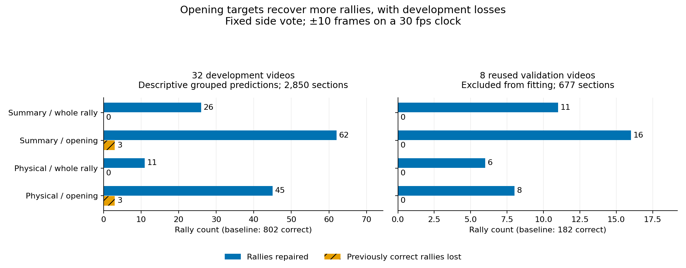

# Contact detection: closing experiments

*5 September 2026 · scripts and saved outputs*

The larger goal is a badminton video annotator that can identify a small set of fully correct rallies for use without manual checking. This pass tests contact repairs that might help reach that goal.

**The combined detector holds up across the existing 47 ShuttleSet22 videos.** At the usable ±10 tolerance it reaches **1,435 correct rallies from 995: 447 repairs and seven losses**. Forty-four videos improve and three tie. At ±5 it reaches 1,224 from 901, with 366 repairs and 43 losses.

That is **29.9% more complete rallies than the previous best opening-only model**. At ±10, joint contact-time-and-attribution F1 is **77.8%**; **41.9% of retained labelled rallies** are recovered completely, and **36.0% of generated sections** are complete. The report explains the label-cleaning exclusions behind those denominators.

The score-only acceptance test falls short: the development-chosen 0.99 cutoff accepts 382 sections, with 278 correct, 95 wrong and nine unjudgeable at ±10. Saved-input preparation plus chooser work averages 27.5 seconds per video, about 21.5 minutes across all 47. These videos were previously examined; predictions were saved before loading their labels for this comparison.

Read the [broader comparison, acceptance results and per-video costs](broader_comparison.md) for the latest result. The original [eight-video whole-rally comparison](whole_rally_report.md) and its predictions remain the reference. Physical measurements stay in the combined model. The next separate branch is insertion from saved candidates for missing later contacts; this run did not test that capability. Everything remains in experiment scripts, with production integration reserved for a later round.

The component experiments below explain what led to that comparison. They tested the first-contact chooser in isolation. Physical measurements did not improve complete-rally recovery in those shallow standalone models. The combined result shows why that finding was insufficient to rule them out from the whole-rally chooser.

## Contents

- [What the comparison measures](#what-the-comparison-measures)
- [First-contact results](#first-contact-results)
- [Errors hidden by complete-rally totals](#errors-hidden-by-complete-rally-totals)
- [What changed in the scoring](#what-changed-in-the-scoring)
- [Where missed contacts disappear](#where-missed-contacts-disappear)
- [Cost and next steps](#cost-and-next-steps)
- [Methods, records and checks](#methods-records-and-checks)

## What the comparison measures

A **section** is a predicted stretch of video containing a proposed rally. It is completely correct only when it contains every labelled contact of exactly one whole rally, predicts each contact once, and assigns every player side correctly. The fixed side rule chooses the alternating Top/Bottom sequence that agrees with more original wrist/net guesses.

All results use the same predictions at two timing allowances: **±10 frames on a 30 fps clock** is the usable goal; ±5 is the tighter check. Allowances scale once to the source frame rate. Repairs and losses compare the same labelled rally identities. Every proposed section stays in the denominator, including sections that lack sufficient labels. Those sections cannot be certified correct; their individual contacts are not automatically false.

The four variants change two things independently:

| Inputs | Whole-rally target | Opening target |
|---|---|---|
| Ten existing summaries | Reward an edit that completes contact count and timing | Reward recovery of a missing serve without duplicating or deleting a real contact |
| Summaries plus physical measurements | Same whole-rally question | Same opening question |

The physical versions use 85 saved motion, wrist, player and missingness measurements at each of the candidate and current first contact: **180 inputs in total**. A later missing contact does not invalidate a good opening edit. Both targets allow every successful action to be positive. Unknown or ambiguous labelled sections are excluded from teaching, but remain in evaluation.

The detector, two earlier candidates, add/replace actions, side vote and shallow histogram gradient boosting model (HGB) stay fixed. The edit cutoff remains 0.90. All new models learn at ±10. The historical chooser used ±5 and one positive action, so comparison with it measures the combined change.

The evidence has two levels:

- **32 development videos, 2,850 sections:** each edit model predicts a group left out of its fit. Cached detector scores are not fully isolated across these groups: a held-out group's labels may have trained detectors supplying other groups' edit-training inputs. These results are descriptive, not a fully nested validation estimate.
- **Eight reused validation videos, 677 sections:** excluded from the edit fits and the detector fits supplying development training scores. Predictions were saved before loading their labels for this evaluation. These videos had already been examined in earlier work, including detector setting selection. They are not a fresh test.

At the component stage recorded below, the separate 47-video ShuttleSet22 population was used only for saved-output scoring checks. The later combined run on that population is reported in the [broader comparison](broader_comparison.md).

## First-contact results

Both references use corrected matching and require whole-rally containment. All rows retain 677 validation sections. The baseline has **182 correct rallies at ±10 and 175 at ±5**; these are the previously correct populations behind each loss count.

| Validation system | ±10 correct / 677 | ±10 repaired / lost | ±5 correct / 677 | ±5 repaired / lost |
|---|---:|---:|---:|---:|
| Unchanged detector + side vote | 182 | — | 175 | — |
| Historical saved chooser | 188 | 6 / 0 | 181 | 6 / 0 |
| Summary / whole rally | **193** | **11 / 0** | **185** | **10 / 0** |
| Summary / opening | 198 | 16 / 0 | 189 | 14 / 0 |
| Physical / whole rally | 188 | 6 / 0 | 180 | 5 / 0 |
| Physical / opening | 190 | 8 / 0 | 182 | 7 / 0 |

[Paired comparison records](results/start_comparison_result.json.gz) and [historical chooser recount](results/historical_start_reference.json.gz) retain every repaired and lost rally identity.

The zero losses above are relative to the unchanged detector and side vote. Direct comparison with the historical chooser gives a different answer. Here “gained / lost” compares each edited output with the old chooser’s **188 correct rallies at ±10 and 181 at ±5**.

| New validation chooser versus historical chooser | ±10 gained / lost | ±5 gained / lost |
|---|---:|---:|
| Summary / whole rally | 6 / 1 | 5 / 1 |
| Summary / opening | 11 / 1 | 9 / 1 |
| Physical / whole rally | 4 / 4 | 3 / 4 |
| Physical / opening | 6 / 4 | 5 / 4 |

For summary/whole rally, the missed historical repair is `sset_18/set1:25` at both tolerances. The old chooser adds the missing serve; the new chooser leaves that section unchanged with six of seven contacts. Its higher pooled total therefore does not establish a loss-free replacement for the old chooser.

The development comparison shows the larger recovery-versus-loss tradeoff of the opening targets. Here the baseline has **802 correct rallies at ±10 and 710 at ±5**.

| Development system | ±10 correct / 2,850 | ±10 repaired / lost | ±5 correct / 2,850 | ±5 repaired / lost |
|---|---:|---:|---:|---:|
| Unchanged detector + side vote | 802 | — | 710 | — |
| Summary / whole rally | 828 | 26 / 0 | 735 | 25 / 0 |
| Summary / opening | 861 | 62 / 3 | 763 | 56 / 3 |
| Physical / whole rally | 813 | 11 / 0 | 720 | 10 / 0 |
| Physical / opening | 844 | 45 / 3 | 742 | 35 / 3 |



*The two panels are different populations, with separate count scales. Opening targets recover more rallies within each population. The development losses are shown separately from the larger repair counts.*

The validation gains are uneven. The summary/whole-rally repairs appear in four of eight videos at ±10, with eight of the eleven in `sset_31` and `sset_39`. This supports a limited improvement across several videos, not broad reliability.

Each cell below is **repairs at ±10 / ±5**, relative to the unchanged detector and side vote. Losses are zero for every cell.

| Validation video | Historical | Summary / whole | Summary / opening | Physical / whole | Physical / opening |
|---|---:|---:|---:|---:|---:|
| `sset_18` | 1 / 1 | 0 / 0 | 1 / 1 | 0 / 0 | 1 / 1 |
| `sset_22` | 0 / 0 | 0 / 0 | 2 / 1 | 0 / 0 | 2 / 1 |
| `sset_24` | 0 / 0 | 0 / 0 | 2 / 2 | 0 / 0 | 1 / 1 |
| `sset_25` | 1 / 1 | 2 / 2 | 2 / 2 | 1 / 0 | 1 / 1 |
| `sset_30` | 0 / 0 | 0 / 0 | 0 / 0 | 0 / 0 | 0 / 0 |
| `sset_31` | 1 / 1 | 4 / 4 | 3 / 3 | 3 / 3 | 2 / 2 |
| `sset_39` | 3 / 3 | 4 / 4 | 4 / 4 | 2 / 2 | 1 / 1 |
| `sset_40` | 0 / 0 | 1 / 0 | 2 / 1 | 0 / 0 | 0 / 0 |


## Errors hidden by complete-rally totals

A zero whole-rally loss count can hide damage to a rally that was already incomplete. Local correctness asks whether an edit recovers the missing serve while preserving real contacts and avoiding extra copies. It does not require the rest of the rally to become complete.

The table shows **correct opening edits / judgeable edits**, with the number of selected actions and unjudgeable actions alongside them. “Unnecessary additions” counts added unmatched contacts, including duplicates that take an old contact's match. No variant removes a matched real contact in the judgeable validation actions at either tolerance.

| Validation system | Actions / unjudgeable | Correct local edits ±10 / ±5 | Unnecessary additions ±10 / ±5 |
|---|---:|---:|---:|
| Historical chooser | 15 / 1 | 11/14 · 11/14 | 2 / 2 |
| Summary / whole rally | 26 / 2 | 17/24 · 16/24 | 4 / 5 |
| Summary / opening | 52 / 4 | 30/48 · 27/48 | 13 / 16 |
| Physical / whole rally | 8 / 1 | 7/7 · 6/7 | 0 / 1 |
| Physical / opening | 24 / 3 | 18/21 · 16/21 | 3 / 5 |

At ±10, edits failing the opening definition in already-wrong validation sections number 3 for the historical chooser, then 7, 18, 0 and 3 for the four new variants in table order. These counts include unsuccessful repairs as well as added false events; they are not an extra count of newly damaged rallies. Unjudgeable actions are kept separate.

The three development losses for each opening model are extra-event failures at both tolerances. The summary version adds an unmatched event to `sset_03` rallies `set2:8`, `set2:29` and `set2:37`. The physical version affects the latter two plus `sset_13/set1:4`. Each lost section retains all its original matches and correct sides, but now contains one extra event. These are real count errors, not harmless movement within ±10. The affected rallies contain 9–28 labelled contacts.

The summary/whole-rally version is therefore a modest, cheap improvement candidate, not a reliable automatic editor. The physical/whole-rally version makes fewer mistakes on this small validation set, but also recovers fewer rallies. These results do not establish that physical measurements are generally unhelpful; they did not improve complete-rally recovery in this fixed shallow-model comparison.

The complete video streams show smaller contact-level changes. All rows below use the same **5,696 labelled contacts and 668 labelled serves** across eight validation videos. Paired cells give **±10 / ±5** counts. Side counts show correct answers among time-matched contacts with both a known label side and a predicted side, after the fixed vote.

| Validation stream | Predictions | Matched contacts | Matched serves / 668 | Correct sides / answered |
|---|---:|---:|---:|---:|
| Unchanged detector + vote | 5326 | 4790 / 4753 | 304 / 279 | 4512/4785 · 4482/4748 |
| Summary / whole rally | 5352 | 4811 / 4773 | 322 / 296 | 4532/4806 · 4501/4768 |
| Summary / opening | 5372 | 4821 / 4781 | 331 / 303 | 4542/4821 · 4509/4781 |
| Physical / whole rally | 5334 | 4797 / 4759 | 311 / 285 | 4519/4792 · 4488/4754 |
| Physical / opening | 5348 | 4808 / 4769 | 322 / 295 | 4529/4805 · 4497/4766 |

The summary/whole-rally version finds 18 additional serves at ±10 and 17 at ±5. That is distinct from completing another rally or choosing the server correctly. The saved records also retain the original per-contact side guesses.

## What changed in the scoring

### Removed labels explain substantial uncertainty

The 47 ShuttleSet22 videos contain **39,994 saved predictions and 3,982 sections**. Cleaning retained 38,218 of 43,159 annotation rows. It removed 543 whole rallies: 542 had flaw flags and one had non-increasing timestamps. No invalid-frame removal occurred in these files.

Of the 4,941 removed rows, **4,257 had an unflagged, in-range timestamp**. They are uncertain anchors: the rally was rejected, but those timestamps may still explain nearby predictions.

| Historical coverage diagnostic, 47 videos | ±10 | ±5 |
|---|---:|---:|
| Unmatched predictions, all outputs retained | 7,391 | 7,751 |
| One-to-one nearby uncertain anchors | 3,645 (49.3%) | 3,608 (46.6%) |

Of **943 sections with no retained rally label, 397 contain an uncertain anchor**. The [coverage record](results/label_coverage.json.gz) saves video, rally, row, frame and removal reason. It uses individual timestamps, not broad ignored video ranges. This diagnostic reproduces the historical matching convention; it does not turn those predictions into true positives or produce a corrected precision. The training dataset uses different label cleaning, so this estimate applies specifically to ShuttleSet22.

### Better matching changes few headline counts

The shared matcher first maximises the number of one-to-one time matches, then minimises total timing error with deterministic ties. Player sides never influence pairing. Contact metrics use complete video streams; labelled rally boundaries do not remove predictions.

Both matcher columns below use the strict whole-rally containment requirement. These are scorer changes on identical outputs, not detector gains.

| Population and tolerance | Matches: old → new | Complete after side vote: old → new |
|---|---:|---:|
| ShuttleSet22, 47 videos, ±10 | 32,603 → 32,603 | 995 → 995 |
| ShuttleSet22, 47 videos, ±5 | 32,243 → 32,243 | 901 → 901 |
| Development plus validation, 40 videos, ±10 | 29,106 → 29,111 | 982 → 984 |
| Development plus validation, 40 videos, ±5 | 28,781 → 28,781 | 885 → 885 |

On ShuttleSet22, pairings change in four videos at each tolerance. First-contact matches fall by one: 1,987→1,986 at ±10 and 1,845→1,844 at ±5. On the 40 videos, pairings change in 13 videos at ±10 and 11 at ±5. Side-correct matches rise from 26,440→26,453 and 26,194→26,200 respectively. First-contact matches stay at 1,788 at ±10 and change from 1,634→1,633 at ±5. The [two matching records](results/matching_development.json.gz) retain changed pairs; the [ShuttleSet22 record](results/matching_shuttleset22.json.gz) preserves its separate population.

**Containment also corrects the historical development baseline.** The original development scorer could certify a rally whose label lay just outside the section. Direct reproduction gives 822/726 correct development rallies at ±10/±5. Requiring all labels inside gives 800/710 with the old matcher; optimal matching then gives 802/710. Validation changes from 186/177 to 182/175 through containment. The saved old chooser still repairs the same six validation rallies at both tolerances, reaching 188/181. Earlier totals of 192/183 used the original scorer.

## Where missed contacts disappear

The companion census uses the **32 development videos only**, with 27,571 retained contact labels. It accounts for 3,250 missed contacts at ±10 and 3,543 at ±5. Of these, 2,043 and 2,206 are later contacts rather than serves.

| Where a missed later contact disappears | ±10: 2,043 misses | ±5: 2,206 misses |
|---|---:|---:|
| No nearby row in the frozen feature files | 1,072 | 1,072 |
| Saved row exists but the scoring mask skips it | **0** | **0** |
| Nearby scores all below 0.90 | 668 | 990 |
| A score reaches 0.90 but suppression removes it | 181 | 118 |
| A retained prediction competes for another label | 122 | 26 |

The saved kept frames agree with the frozen prediction stream. No selected feature rows unexpectedly lack scores. The [census](results/missed_candidate_census.json.gz) records individual misses and nearby row identities. An absent feature row establishes a limit of this saved dataset; it does not by itself establish why the earlier preparation omitted that frame.

There is **no opportunity here to recover contacts merely by widening the scoring mask over existing rows**. A label-guided upper bound reinforces that distinction. In otherwise complete, contained development sections, inserting one ideal later contact could complete 214 rallies at ±10 or 184 at ±5. Every one already has a scored candidate nearby. This bound supplies the true timestamp and player side, preserves the section and other events, then applies the fixed side vote. It is not a working detector result.

The existing start shortlist also has unused capacity. With labels choosing among eligible actions, it can repair **255 development rallies at ±10 and 237 at ±5**, or 66/54 validation rallies, after the fixed side vote. These are corrected, label-guided opportunities; the old 300-at-±5 estimate used different scoring and eligibility. The [capacity record](results/repair_capacity.json.gz) saves identities and rules. A larger candidate pool is not the first bottleneck to address.

## Cost and next steps

Training all 16 development group fits took **3.76 seconds**. Final fitting on all development videos took about 0.10 seconds per summary model and 0.41 seconds per physical model. Scoring and applying one model's actions across the eight validation videos took about **0.043 seconds**.

Those small timings exclude loading and joining feature files, evaluation, the side vote and upstream vision processing. They are not end-to-end runtime measurements. All physical joins succeeded; missing measurement cells remained NaN. No tracking, pose, video model or vision-language model (VLM) inference was rerun.

These component results justified testing the promising inputs together. The [whole-rally continuation](whole_rally_report.md) now does that: it compares unchanged sections, opening edits, one deletion and combined edits using the same saved candidates. The summary/opening standalone model remains a useful lower-intervention reference, with 16 validation repairs and zero baseline losses at ±10.

The physical branch remains useful in the combined model. The scoring-mask branch has no recoverable skipped rows in this census. Later-contact insertion remains untested. The broader comparison found the tested score-only acceptance rules insufficient for near-certain acceptance. Production integration stays for the planned later round.

## Methods, records and checks

The experiment environment used scikit-learn 1.6.1, NumPy 2.2.6 and pandas 2.3.3. All four variants retain 100 boosting iterations, seven leaves, learning rate 0.05, minimum leaf size 20, L2 regularisation penalty 1, balanced class weights and seed 20260824. Early stopping is disabled. No validation threshold search was run. There is no rally-length filter.

Development has 10,484 action rows; validation has 2,460. At ±10, 9,560 development actions have sufficient labels for teaching. The whole-rally target has 360 positive actions across 271 sections; the opening target has 989 across 623. This difference is intentional. Whole-rally targets require the original timing/count list to need repair, and the edited section to contain the whole rally. Original side guesses do not decide the training target.

An initial control run omitted the requirement that the original list need repair. The condition was restored to match the historical target, a regression test was added, and the fixed four-way comparison was rerun. Only that corrected run is included in the result tables and retained public result files.

[Saved validation predictions](results/start_comparison_predictions.json.gz) contain scores and chosen actions before label-based evaluation. The [comparison result](results/start_comparison_result.json.gz) includes development group scores, targets, feature-join accounting, timings, full section rows and contact pairs. Historical chooser scores were replayed without refitting. Raw side guesses and results after the fixed vote remain separately available.

Run modules from the repository root in the existing experiment environment, with the saved feature and prediction inputs available:

```bash
export PYTHONPATH="$PWD/src:$PWD"
python -m scratch.contact_det_closing_pass.scripts.run_start_comparison \
  --feature-root scratch/contact_det_full_ds_fit/raw/full_raw \
  --output-root scratch/contact_det_closing_pass/results
python -m scratch.contact_det_closing_pass.scripts.score_saved_start_reference
python -m scratch.contact_det_closing_pass.scripts.census_missed_candidates \
  --labels training/data/shuttleset/annotations/shots_master.csv
python -m scratch.contact_det_closing_pass.scripts.diagnose_repair_capacity
python -m scratch.contact_det_closing_pass.scripts.plot_results
```

The [coverage helper](scripts/check_label_coverage.py) takes `--annotations`, `--predictions` and `--output`. The [matching recount](scripts/recount_matching.py) takes `--dataset development` or `--dataset shuttleset22`, plus `--output`. Inputs remain external to this small experiment directory; result files use repository-relative input names.

Verification used the requested project gates and focused boundary checks:

| Check | Outcome |
|---|---|
| Closing scripts and tests: Ruff | Exit 0 |
| Closing tests: matching, containment, targets, joins, coverage and census | Exit 0; 33 passed |
| Full project pytest with the project environment on PATH | Exit 0; 2,040 passed, 29 skipped |
| Full project Ruff | Exit 1; 915 existing errors outside this pass |
| Full project Pyrefly | Exit 1; 11 existing import errors; scratch is excluded by that profile |
| Saved-output scoring, model comparison, census and capacity jobs | Exit 0 |

Matching tests include the closest-pair counterexample, exhaustive small cases, deterministic ties and frame-rate scaling. Edit tests cover a valid serve followed by a later miss, acceptable alternative candidates, a real receiver contact, duplicate insertion and an already-complete list. Production pipeline files were unchanged.
