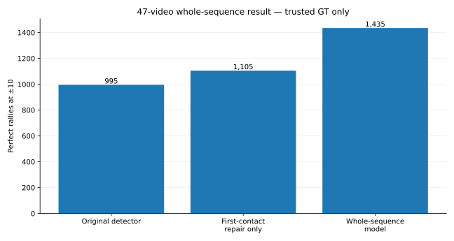

# First 47-video test of whole-sequence selection

## Result

The whole-sequence model held up across the 47 ShuttleSet22 videos.

The same saved predictions are scored against the trusted labels and all original source labels.

| Measure | Trusted GT only | All GT included |
|---|---:|---:|
| Perfect-rally recall: original detector | 995 / 3,422 = **29.1%** | 993 / 3,965 = **25.0%** |
| Perfect-rally recall: first-contact repair only | 1,105 / 3,422 = **32.3%** | 1,103 / 3,965 = **27.8%** |
| Perfect-rally recall: whole-sequence model | **1,435 / 3,422 = 41.9%** | 1,433 / 3,965 = **36.1%** |

Compared with the original detector, the whole-sequence model:

- repairs **447** rallies;
- breaks **7** previously perfect rallies;
- gains **440** perfect rallies overall;
- improves in 44 videos and ties in three.

Against trusted GT, individual-contact timing P/R/F1 is **81.1% / 87.3% / 84.1%**. Requiring the player to be correct gives **75.0% / 80.8% / 77.8%**.

So the whole-rally gain is not only a rally-level effect: it also recovers more labelled contacts, although it still produces too many unmatched predictions.

## What the model changed

The 447 repairs came from:

- **364** missing first contacts added;
- **52** extra contacts removed;
- **13** first contacts replaced;
- **18** first-contact repair + removal combinations.

The seven losses were four bad additions, two bad replacements and one bad removal.

The first-contact problem still dominates, but choosing the whole finished sequence makes removals and combined repairs useful too.

## The model score was not an automatic-approval score

A score rule chosen on development data selected 382 proposals:

- 278 perfect;
- 95 wrong under strict scoring;
- 9 with GT that could not settle the result.

That was useful evidence that the sequence-selection model could build better output, but its own score was not a reliable “this is ground truth” probability.

A separate ranking model was tested later.

## Cost

The expensive video models were not rerun.

Rebuilding the saved inputs and applying the model took about **21.5 minutes across all 47 videos**.

## Decision

Keep this as the new reference and test the next missing capability: **adding one missed contact later in the rally**.

Next: [later_contact_comparison.md](later_contact_comparison.md).

Saved results: `results/broader_result.json.gz` and `results/broader_predictions.json.gz`.
