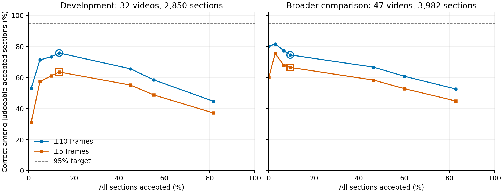

# Combined detector on 47 videos

**The combined detector holds up on the broader comparison.** Across 47 previously examined videos, it reaches **1,435 correct rallies at ±10**, up from 995: **447 repairs and seven losses**. Forty-four videos improve and three tie. Physical measurements remain part of this combined version. The aim is to recover more usable badminton rallies for the eventual annotator.

Compared with the previous best opening-only model, that is **330 more complete rallies, a 29.9% increase**. This confirms the same combined version previously tested on eight videos; the model itself has not changed.

Its scores identify a better subset, but the tested acceptance rules do not make that subset almost always correct. The development-chosen 0.99 cutoff accepts 382 sections: **278 correct, 95 wrong and nine unjudgeable** at ±10. Saved-input preparation plus chooser work averages **27.5 seconds per video**, about **21.5 minutes across all 47**. That is well below an extra hour for this population.

This comparison uses all 3,982 detected sections from the existing 47 ShuttleSet22 videos. **±10 frames at 30 fps is the usable goal**; ±5 is a diagnostic on the same predictions. The videos have been examined before. All predictions were saved before their labels were loaded for this run, but this is a broader comparison, not an untouched benchmark.

A fully correct section contains every contact of exactly one whole labelled rally. It predicts each contact once within tolerance and gives each contact the correct player side. The fixed side vote chooses the alternating Top/Bottom sequence that agrees with more original side guesses. Repairs and losses compare labelled rally identities, so a previously correct rally that disappears still counts as a loss.

## Does the combined detector hold up?

Each system retains all 3,982 sections. Repairs / losses are relative to the unchanged detector plus side vote.

| System | Correct ±10 | Repairs / losses ±10 | Correct ±5 | Repairs / losses ±5 |
| --- | ---: | ---: | ---: | ---: |
| Unchanged detector + side vote | 995 | — | 901 | — |
| Useful opening-only model | 1,105 | 117 / 7 | 1,001 | 107 / 7 |
| **Frozen combined model** | **1,435** | **447 / 7** | **1,224** | **366 / 43** |

The current accuracy measures are:

| Combined detector metric | ±10 | ±5 |
| --- | ---: | ---: |
| Contact F1 requiring both correct time and hitting side | **77.8%** | 76.4% |
| Retained labelled rallies recovered completely | **41.9%** (1,435 / 3,422) | 35.8% (1,224 / 3,422) |
| Generated sections that are complete | **36.0%** (1,435 / 3,982) | 30.7% (1,224 / 3,982) |

Joint contact F1 uses the full label-blind prediction streams. At ±10, its precision is 75.0% and recall is 80.8%; a contact earns credit only when both timing and attribution are correct.

The retained labels cover 3,422 of 3,965 originally listed rallies. The inherited cleaner excluded 542 whole rallies containing a source `flaw` flag and one with non-increasing timestamps. **These exclusions do not establish that every omitted contact label is unusable.** Their predictions remain in scoring, so potentially valid contacts can count as unmatched and depress F1. Across all originally listed rallies, 1,435 are known complete: **36.2%**. The [cleaning record](results/label_coverage.json.gz) preserves the exclusions.

The combined model adds 440 correct rallies over the baseline, a 44.2% increase. Its seven losses represent 0.7% of the 995 previously correct rallies. Compared directly with opening-only, it gains 346 rallies and loses 16 at ±10, for a net gain of 330. At ±5, that direct comparison gains 274 and loses 51.

At ±10, 44 videos have a positive net gain; videos 15, 17 and 36 tie. No video has a negative net change. At ±5, 44 improve, two tie and video 36 loses two rallies. The detailed tables below retain every video.

Opening additions account for 364 of the 447 repairs at ±10. Deletions account for 52, simple replacements for 13, and opening-plus-deletion choices for 18. The seven losses are four additions, two replacements and one deletion. At ±5, 40 of the 43 losses are replacements. Those tighter-timing losses do not represent 43 unusable rallies under the ±10 goal.

The combined chooser uses rally summaries, local opening scores, disagreement between player-side guesses, and 85 saved physical measurements at each relevant contact. It selects among keep, opening add/replace, one-contact deletion, and opening-plus-deletion alternatives. The opening-only reference is the earlier useful summary/opening model with its fixed 0.90 cutoff. Each model uses the same unchanged detector outputs.

The combined chooser makes 1,895 edits, compared with 327 for opening-only. Its original local edit audit can compare 1,353 edits against one retained labelled rally; 542 edits lack that comparison. Among the 1,353:

| Contact effect relative to retained labels | ±10 | ±5 |
| --- | ---: | ---: |
| Newly matched labelled contacts | 863 | 674 |
| Previously matched labelled contacts lost | 61 | 172 |
| Added unmatched predictions | 154 | 475 |
| Removed unmatched predictions | 170 | 191 |
| Beneficial edits with no contact loss or unmatched addition | 964 | 773 |

These are local before/after comparisons, with contacts matched again after editing. They do not cover the 542 unjudgeable edits. Missing labels also mean that an unmatched prediction is not necessarily a false contact.

Across the complete video streams, the combined model predicts 41,150 contacts, up from 39,994. At ±10, matched contacts rise from 32,603 to 33,376. Unmatched predictions rise from 7,391 to 7,774: **383 additional unmatched predictions overall**. The share of predictions matched to retained labels falls slightly, from 81.52% to 81.11%; labelled-contact recall rises from 85.31% to 87.33%. At ±5, the combined model matches 32,707 contacts, with 8,443 unmatched predictions. This is a useful whole-rally gain with a real remaining cost in unwanted edits.

## What happened when replacements became keep?

Only a selected simple opening replacement was cancelled. Its original section and contacts were restored. Every other decision stayed the same, including opening-plus-deletion choices. There was no reselection from remaining actions.

The following cells show correct rallies, then repairs / losses against the unchanged detector plus side vote. Development has 2,850 sections from 32 videos. The already-seen validation replay has 677 sections from eight videos.

| Version | Development ±10 | Development ±5 | Validation diagnostic ±10 | Validation diagnostic ±5 |
| --- | ---: | ---: | ---: | ---: |
| Original combined | 991 (205 / 16) | 823 (166 / 53) | 235 (56 / 3) | 195 (44 / 24) |
| Simple replacement → keep | 987 (194 / 9) | 860 (158 / 8) | 236 (55 / 1) | 217 (43 / 1) |

Cancelling replacements avoided seven development losses at ±10, but gave up eleven repairs. It also removed 213 edits. On the validation diagnostic, cancelling them avoided two losses and gave up one repair. The tighter timing results improved substantially in both populations.

**The original combined version was retained for the broader run.** The development rule preferred the larger number of correct rallies at ±10, with fewer edits breaking a tie. The favourable validation replay did not change that decision. This keeps the original reference intact while recording the replacement tradeoff. This replacement check used one action rule, with no threshold search or named-rally patch.

The final development fit reproduced all 677 saved combined validation choices and their scores. The opening-only fit reproduced its 52 saved choices. The original [whole-rally results](results/whole_rally_result.json.gz), [predictions](results/whole_rally_predictions.json.gz), and source version `24e4256` remain the reference.

## Can the model recognise reliable outputs?

Acceptance uses the combined score of the output actually selected, including keep. It does not use a separate model or the score of a rejected alternative. A score of 0.99 is **not a calibrated 99% probability**.

The rule was chosen using the saved grouped development predictions, before the 47-video results were available. Six fixed score cutoffs were checked: 0.5, 0.9, 0.95, 0.99, 0.995 and 0.999. Three development score cutoffs also checked the top 10%, top 5%, and top 32 sections. Ties were included. These extra checks addressed the narrow score range, without a broad search.

For each of two targets—95% and 99% correct among judgeable accepted sections—the rule would choose the largest accepted set meeting the target. At least 32 judgeable development sections were required. That minimum avoids a tiny-set claim; it is not a statistical guarantee.

**No development cutoff met either target.** The best nonempty cutoff was 0.99: 384 accepted, with 291 correct and 93 wrong at ±10 (75.8%). At ±5, 244 were correct and 140 wrong. All 384 were judgeable. Taking smaller score-ranked sets made the ±10 result worse: 209/285, 102/143, then 17/32 correct. The 0.995 and 0.999 cutoffs accepted nothing.

The 0.99 cutoff was therefore frozen as a diagnostic fallback, rather than an automatic-acceptance recommendation. Development acceptance covered 13.5% of sections. Its ±10 judged correctness ranged from 58.9% to 85.7% across the four existing development groups. Those grouped predictions remain descriptive: the cached upstream detector scores are not fully isolated across all training stages.

On the 47 videos, the frozen cutoff accepts **382 / 3,982 sections (9.6%)**. It improves judged correctness from 47.4% over all outputs to 74.5% among accepted outputs at ±10. That enrichment is useful evidence, but 95 known wrong accepted rallies rule out near-certain acceptance with this rule.

| Output set | Sections | Correct / wrong / unjudgeable ±10 | Correct / wrong / unjudgeable ±5 |
| --- | ---: | ---: | ---: |
| All combined outputs | 3,982 | 1,435 / 1,594 / 953 | 1,224 / 1,808 / 950 |
| Accepted at score ≥ 0.99 | 382 | 278 / 95 / 9 | 248 / 125 / 9 |
| Rejected by this rule | 3,600 | 1,157 / 1,499 / 944 | 976 / 1,683 / 941 |

Accepted judged correctness is **278 / 373 = 74.5% at ±10**, and **248 / 373 = 66.5% at ±5**. The nine unjudgeable accepted sections have no retained rally labels. Of the 95 known wrong outputs at ±10, 66 miss a labelled contact, 26 have extra events and three cut off a known rally.



*Outlined points mark the development-chosen 0.99 cutoff. The dashed line is the lower, 95% reliability target. Empty selections are omitted from the lines: cutoffs 0.995 and 0.999 accept nothing in either population. The leftmost broader point contains only five sections (four correct at ±10). Neither a tiny set nor an empty set establishes reliable acceptance. No threshold was changed after seeing these results.*

Correct / wrong / unjudgeable are reported separately. Missing a retained labelled contact, merging labelled rallies, cutting off a known rally, or contradicting a known side makes an output wrong. A section without retained labels cannot be judged. Unknown human sides and uncertainty anchors also prevent certification when there is no known contradiction. These anchors are in-range, unflagged timestamps from rallies removed during earlier label cleaning. An extra prediction in a section containing uncertain label evidence is not automatically treated as false.

The original retained-label rally totals and this acceptance judgement answer different questions. Acceptance explicitly withholds certification where the existing label record is uncertain. At ±5, three uncertain sections expose a known missed contact, so they move from unjudgeable to wrong. All sections, contacts, scores and judgements remain saved, including rejected and unjudgeable outputs. No human adjudication or new labels were added.

## What extra work does it cost?

| Measured work | Mean per video | Median per video | Total, 47 videos |
| --- | ---: | ---: | ---: |
| Rebuild chooser inputs from saved vision | 26.26 s | 24.44 s | 20.57 min |
| Load measurements, build features and apply combined choice | 1.19 s | 1.07 s | 56.14 s |
| **Both stages** | **27.45 s** | **25.67 s** | **21.51 min** |

The two measured stages range from 15.93 to 68.63 seconds per video. These totals exclude small startup and result-writing overheads. The prediction runner took 63.78 seconds across all 47 videos, including the opening-only comparison before result writing. The complete prediction-and-evaluation job took 247.35 seconds. Input preparation plus that experiment job was about 24.7 minutes.

Rebuilding the frozen models and checking them against the reference took 145.14 seconds once. The final whole-model fit itself took 8.09 seconds. Training is not repeated per video. All 47,408 requested joins to saved physical measurements succeeded.

The saved detector scores and full physical feature arrays were reused. Input preparation rebuilt the earlier-candidate lists and player-side evidence from the saved tracks, poses and court data. It ran no vision model. The timed chooser work includes physical-array loading, feature construction, both local opening models, whole-rally scoring, selection and applying edits. The separate opening-only comparison and label scoring are experiment costs.

These are measured saved-output script costs, not a production end-to-end benchmark. The scripts record [per-video timing](results/broader_result.json.gz); the preparation record gives each video's input-rebuild time. Production integration remains for the later round.

## What should happen next?

**Keep this combined detector as the reference for further scripts-only work.** It recovers substantially more usable rallies than both comparators, with few losses at the primary tolerance. The physical inputs stay in the combined model. The result does not depend on recovering the five-frame ideal.

Unnecessary edits remain worth reducing, but they do not erase the larger useful gain. The acceptance test also shows that a high chooser score is insufficient to certify a whole rally. It should not silently discard lower-scoring output or approve higher-scoring output as ground truth.

Missing later contacts remain a separate, untested capability. The next specific branch is to test insertion from the candidates already saved by the detector. This run neither tests nor disproves that capability. No maximum rally length was imposed. All work remains in scripts; `src/` and the production end-to-end flow were unchanged.

## Records and checks

- [Replacement replay](results/simple_replacement_replay.json.gz) and [frozen action policy](results/broader_action_policy.json.gz).
- [Model settings and reference reproduction](results/broader_model_freeze.json.gz).
- [Development acceptance rows](results/broader_acceptance_development.json.gz) and [frozen acceptance rule](results/broader_acceptance_policy.json.gz).
- [All broader predictions and option scores](results/broader_predictions.json.gz), saved before evaluation loaded labels.
- [Broader paired results, contact matches, acceptance rows and timing](results/broader_result.json.gz).

Focused checks passed 64 tests. The full repository suite passed 2,040 tests, with 29 skips (exit 0). Scoped Ruff passed (exit 0). Whole-project Ruff exited 1 with 915 existing errors outside this pass. Pyrefly exited 1 with 11 existing import errors; its project profile excludes scratch scripts. The independent read-only source audit found no material issue with prediction/label separation, selected-score identity or acceptance accounting.

The [input preparation record](results/broader_input_preparation.json.gz) retains counts, source identifiers and per-video costs. Preparation produced 3,725 candidate lists and 11,175 entries. All 257 sections without a kept contact remain present. The complete regenerated inputs and exact fitted model objects are preserved in the ignored `raw/` cache.

The combined model uses 304 inputs and the original 200-iteration, 15-leaf histogram gradient boosting settings. Local opening models retain their 100-iteration, seven-leaf settings. Both learn at ±10. The whole chooser keeps its minimum score of zero, with an edit required to beat keep. Fits use the 32 development videos only. The frozen settings record includes all remaining parameters; the run used scikit-learn 1.6.1.

Replay also requires the original saved physical feature files. Input preparation creates a view of those files under `raw/broader_inputs/features`; the arrays remain in the existing dataset cache. With those files, the regenerated inputs and the model cache available, run from the repository root. A fresh output directory preserves the reference predictions:

```bash
export PYTHONPATH="$PWD/src:$PWD"
python -m scratch.contact_det_closing_pass.scripts.run_broader_comparison \
  --output-root scratch/contact_det_closing_pass/raw/broader_replay
```

The [preparation script](scripts/prepare_broader_inputs.py) takes the existing saved detector, prepared-vision and inpainted-track roots as explicit arguments. The [model-freeze script](scripts/freeze_broader_models.py) rebuilds the fit from the original development inputs. The [acceptance plot](scripts/plot_broader_acceptance.py) reads only saved result records.

## Results by video

Each correct-count cell shows **±10 / ±5**. Repairs / losses compare combined with the unchanged detector plus vote. Video IDs use the existing ShuttleSet22 numbering. No separate broadcast grouping was available for these 47 videos.

| Video | Sections | Baseline correct | Opening-only correct | Combined correct | Combined repairs / losses ±10 | Combined repairs / losses ±5 |
| --- | ---: | ---: | ---: | ---: | ---: | ---: |
| 8 | 95 | 15 / 14 | 18 / 17 | 25 / 21 | 10 / 0 | 8 / 1 |
| 9 | 66 | 9 / 7 | 11 / 9 | 20 / 11 | 11 / 0 | 4 / 0 |
| 10 | 52 | 20 / 20 | 22 / 22 | 22 / 22 | 2 / 0 | 2 / 0 |
| 11 | 49 | 1 / 1 | 5 / 5 | 11 / 9 | 10 / 0 | 8 / 0 |
| 12 | 58 | 13 / 8 | 14 / 8 | 15 / 12 | 3 / 1 | 4 / 0 |
| 13 | 97 | 18 / 17 | 20 / 19 | 26 / 21 | 8 / 0 | 7 / 3 |
| 15 | 243 | 0 / 0 | 0 / 0 | 0 / 0 | 0 / 0 | 0 / 0 |
| 16 | 75 | 28 / 25 | 29 / 26 | 35 / 31 | 7 / 0 | 6 / 0 |
| 17 | 38 | 15 / 14 | 15 / 14 | 15 / 14 | 0 / 0 | 0 / 0 |
| 18 | 69 | 19 / 18 | 25 / 23 | 34 / 30 | 15 / 0 | 12 / 0 |
| 19 | 119 | 22 / 18 | 22 / 18 | 35 / 25 | 13 / 0 | 12 / 5 |
| 20 | 40 | 5 / 5 | 7 / 7 | 7 / 6 | 2 / 0 | 1 / 0 |
| 21 | 93 | 16 / 15 | 20 / 19 | 22 / 18 | 6 / 0 | 5 / 2 |
| 22 | 54 | 11 / 9 | 12 / 10 | 20 / 16 | 9 / 0 | 9 / 2 |
| 23 | 100 | 27 / 27 | 31 / 31 | 41 / 34 | 14 / 0 | 10 / 3 |
| 24 | 47 | 5 / 4 | 6 / 5 | 7 / 6 | 2 / 0 | 2 / 0 |
| 25 | 123 | 14 / 12 | 14 / 12 | 26 / 22 | 12 / 0 | 10 / 0 |
| 26 | 77 | 10 / 10 | 11 / 10 | 27 / 21 | 17 / 0 | 11 / 0 |
| 27 | 63 | 31 / 31 | 33 / 33 | 35 / 35 | 4 / 0 | 4 / 0 |
| 28 | 96 | 27 / 19 | 29 / 21 | 41 / 33 | 14 / 0 | 14 / 0 |
| 29 | 71 | 14 / 14 | 17 / 17 | 27 / 23 | 13 / 0 | 9 / 0 |
| 30 | 66 | 25 / 21 | 27 / 23 | 33 / 26 | 8 / 0 | 6 / 1 |
| 31 | 71 | 38 / 34 | 40 / 36 | 41 / 37 | 3 / 0 | 4 / 1 |
| 32 | 57 | 23 / 18 | 25 / 20 | 31 / 22 | 8 / 0 | 4 / 0 |
| 33 | 98 | 58 / 55 | 57 / 54 | 62 / 60 | 4 / 0 | 5 / 0 |
| 34 | 88 | 32 / 28 | 37 / 33 | 42 / 36 | 10 / 0 | 9 / 1 |
| 35 | 62 | 31 / 29 | 33 / 31 | 37 / 33 | 6 / 0 | 4 / 0 |
| 36 | 46 | 18 / 16 | 17 / 15 | 18 / 14 | 0 / 0 | 0 / 2 |
| 37 | 133 | 37 / 36 | 45 / 44 | 71 / 65 | 35 / 1 | 30 / 1 |
| 38 | 100 | 11 / 10 | 11 / 10 | 20 / 19 | 9 / 0 | 9 / 0 |
| 39 | 68 | 19 / 15 | 22 / 17 | 30 / 22 | 12 / 1 | 9 / 2 |
| 40 | 113 | 43 / 40 | 45 / 42 | 51 / 44 | 10 / 2 | 8 / 4 |
| 41 | 89 | 32 / 31 | 31 / 30 | 49 / 46 | 17 / 0 | 15 / 0 |
| 42 | 124 | 7 / 7 | 7 / 7 | 17 / 16 | 10 / 0 | 9 / 0 |
| 43 | 148 | 22 / 22 | 23 / 23 | 40 / 39 | 18 / 0 | 17 / 0 |
| 44 | 105 | 36 / 32 | 43 / 36 | 49 / 40 | 13 / 0 | 9 / 1 |
| 46 | 72 | 19 / 15 | 20 / 16 | 22 / 18 | 3 / 0 | 3 / 0 |
| 47 | 105 | 39 / 39 | 41 / 41 | 44 / 41 | 5 / 0 | 4 / 2 |
| 48 | 93 | 30 / 26 | 33 / 29 | 43 / 35 | 14 / 1 | 11 / 2 |
| 49 | 110 | 36 / 30 | 41 / 33 | 47 / 35 | 11 / 0 | 7 / 2 |
| 50 | 73 | 15 / 13 | 19 / 17 | 32 / 26 | 17 / 0 | 13 / 0 |
| 51 | 67 | 15 / 14 | 18 / 17 | 23 / 22 | 8 / 0 | 8 / 0 |
| 52 | 117 | 35 / 34 | 40 / 39 | 45 / 40 | 10 / 0 | 9 / 3 |
| 53 | 23 | 1 / 1 | 2 / 2 | 6 / 5 | 5 / 0 | 4 / 0 |
| 54 | 75 | 20 / 19 | 26 / 25 | 35 / 27 | 15 / 0 | 9 / 1 |
| 55 | 65 | 16 / 11 | 18 / 13 | 25 / 17 | 9 / 0 | 8 / 2 |
| 57 | 89 | 17 / 17 | 23 / 22 | 31 / 29 | 15 / 1 | 14 / 2 |

## Acceptance and extra work by video

The cutoff remains 0.99 for every video. Correct / wrong / unjudgeable counts refer only to accepted sections. Extra seconds include saved-input preparation and measured combined chooser work; all other sections remain in the saved outputs.

| Video | Accepted / all | Correct / wrong / unjudgeable ±10 | Correct / wrong / unjudgeable ±5 | Extra seconds |
| --- | ---: | ---: | ---: | ---: |
| 8 | 2 / 95 | 1 / 1 / 0 | 1 / 1 / 0 | 27.53 |
| 9 | 1 / 66 | 0 / 1 / 0 | 0 / 1 / 0 | 18.95 |
| 10 | 5 / 52 | 5 / 0 / 0 | 5 / 0 / 0 | 23.45 |
| 11 | 1 / 49 | 0 / 1 / 0 | 0 / 1 / 0 | 25.68 |
| 12 | 4 / 58 | 3 / 1 / 0 | 2 / 2 / 0 | 22.86 |
| 13 | 4 / 97 | 3 / 1 / 0 | 3 / 1 / 0 | 32.19 |
| 15 | 6 / 243 | 0 / 2 / 4 | 0 / 2 / 4 | 68.63 |
| 16 | 15 / 75 | 10 / 5 / 0 | 10 / 5 / 0 | 23.60 |
| 17 | 5 / 38 | 4 / 1 / 0 | 3 / 2 / 0 | 54.13 |
| 18 | 7 / 69 | 5 / 2 / 0 | 4 / 3 / 0 | 21.46 |
| 19 | 10 / 119 | 9 / 1 / 0 | 5 / 5 / 0 | 31.82 |
| 20 | 3 / 40 | 2 / 1 / 0 | 2 / 1 / 0 | 17.65 |
| 21 | 3 / 93 | 2 / 1 / 0 | 1 / 2 / 0 | 27.01 |
| 22 | 7 / 54 | 3 / 3 / 1 | 1 / 5 / 1 | 17.94 |
| 23 | 10 / 100 | 10 / 0 / 0 | 8 / 2 / 0 | 36.38 |
| 24 | 3 / 47 | 1 / 2 / 0 | 1 / 2 / 0 | 16.25 |
| 25 | 4 / 123 | 3 / 1 / 0 | 3 / 1 / 0 | 30.14 |
| 26 | 4 / 77 | 2 / 2 / 0 | 2 / 2 / 0 | 20.61 |
| 27 | 5 / 63 | 5 / 0 / 0 | 5 / 0 / 0 | 19.21 |
| 28 | 16 / 96 | 12 / 4 / 0 | 10 / 6 / 0 | 26.38 |
| 29 | 8 / 71 | 6 / 2 / 0 | 6 / 2 / 0 | 20.22 |
| 30 | 10 / 66 | 7 / 3 / 0 | 6 / 4 / 0 | 21.71 |
| 31 | 8 / 71 | 7 / 1 / 0 | 5 / 3 / 0 | 22.20 |
| 32 | 10 / 57 | 10 / 0 / 0 | 9 / 1 / 0 | 25.67 |
| 33 | 16 / 98 | 15 / 1 / 0 | 15 / 1 / 0 | 32.51 |
| 34 | 17 / 88 | 13 / 4 / 0 | 13 / 4 / 0 | 29.63 |
| 35 | 7 / 62 | 6 / 1 / 0 | 6 / 1 / 0 | 20.89 |
| 36 | 7 / 46 | 5 / 2 / 0 | 5 / 2 / 0 | 20.12 |
| 37 | 11 / 133 | 8 / 3 / 0 | 8 / 3 / 0 | 30.48 |
| 38 | 1 / 100 | 1 / 0 / 0 | 1 / 0 / 0 | 35.07 |
| 39 | 1 / 68 | 1 / 0 / 0 | 1 / 0 / 0 | 21.62 |
| 40 | 5 / 113 | 5 / 0 / 0 | 4 / 1 / 0 | 26.50 |
| 41 | 9 / 89 | 8 / 1 / 0 | 7 / 2 / 0 | 25.50 |
| 42 | 3 / 124 | 1 / 1 / 1 | 1 / 1 / 1 | 30.32 |
| 43 | 8 / 148 | 7 / 0 / 1 | 7 / 0 / 1 | 41.84 |
| 44 | 24 / 105 | 17 / 7 / 0 | 16 / 8 / 0 | 31.20 |
| 46 | 9 / 72 | 5 / 3 / 1 | 5 / 3 / 1 | 21.06 |
| 47 | 25 / 105 | 18 / 7 / 0 | 17 / 8 / 0 | 34.24 |
| 48 | 25 / 93 | 19 / 6 / 0 | 15 / 10 / 0 | 29.64 |
| 49 | 6 / 110 | 3 / 3 / 0 | 3 / 3 / 0 | 35.91 |
| 50 | 10 / 73 | 3 / 7 / 0 | 3 / 7 / 0 | 22.03 |
| 51 | 7 / 67 | 4 / 2 / 1 | 3 / 3 / 1 | 24.22 |
| 52 | 28 / 117 | 17 / 11 / 0 | 15 / 13 / 0 | 41.41 |
| 53 | 0 / 23 | 0 / 0 / 0 | 0 / 0 / 0 | 15.93 |
| 54 | 5 / 75 | 5 / 0 / 0 | 5 / 0 / 0 | 27.84 |
| 55 | 4 / 65 | 4 / 0 / 0 | 3 / 1 / 0 | 20.94 |
| 57 | 3 / 89 | 3 / 0 / 0 | 3 / 0 / 0 | 19.85 |
