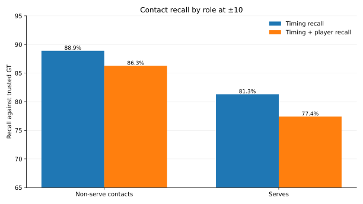
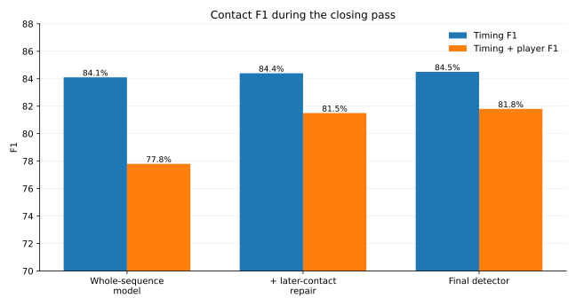

# Contact-level performance

The whole-rally score is deliberately strict: one missed contact, one extra contact, or one wrong player makes the entire rally fail.

This page answers the middle question:

**How well does the final detector find individual contacts?**

## All contacts: precision, recall and F1

The 47 videos contain **38,218 trusted contact labels**, or **43,159 with all source labels restored**. Both scores use the same predictions at ±10 frames on a 30 fps clock.

| Task | Labels | Precision | Recall | F1 |
|---|---|---:|---:|---:|
| Timing only | Trusted GT | 81.0% | 88.2% | 84.5% |
| Timing only | All GT | 90.1% | 86.9% | 88.4% |
| Timing + correct player | Trusted GT | 78.5% | 85.5% | 81.8% |
| Timing + correct player | All GT | 87.2% | 84.0% | 85.6% |

The trusted-GT score comes from:

- **41,605 predicted contacts**;
- **33,716 timing matches**;
- **32,667 matches with both correct timing and correct player**.

Restoring labels lets more of the same predictions count as matches, which raises precision. The restored labels include the 543 rallies excluded during cleaning.

## Serves versus later contacts

The saved full-stream matcher tells us which labelled contacts were serves, so recall splits cleanly:

| Contact type | Labels | Timing recall | Timing + correct-player recall |
|---|---|---:|---:|
| Non-serve | Trusted GT | 88.9% | 86.3% |
| Non-serve | All GT | 88.4% | 85.7% |
| Serve | Trusted GT | 81.3% | 77.4% |
| Serve | All GT | 72.0% | 67.3% |

**Serves are the harder contact class under both sets of labels.**

### Why there is no separate non-serve precision here

The full-stream detector outputs **contacts**, not a serve/non-serve class for every prediction. “Serve” becomes an explicit prediction only when a contact is used as the first event of a proposed rally.

So subtracting serves from the label denominator gives a clean **non-serve recall**, but there is no equally natural full-stream “predicted non-serve” denominator.

Rather than invent one, the next section reports precision/recall/F1 for the task that *does* explicitly predict a serve.

## Does the proposed rally actually start at the serve?

Every nonempty proposed rally makes one explicit start prediction. There are **3,725** such starts, compared with **3,422 trusted serves** or **3,965 across all GT**.

At ±10:

| Task | Labels | Precision | Recall | F1 |
|---|---|---:|---:|---:|
| Start is serve | Trusted GT | 70.4% | 76.7% | 73.4% |
| Start is serve | All GT | 72.1% | 67.7% | 69.8% |
| Start + correct server | Trusted GT | 68.1% | 74.1% | 71.0% |
| Start + correct server | All GT | 68.5% | 64.4% | 66.4% |

## How contact performance changed during the closing pass

This stage comparison uses **trusted GT at ±10**.

| Detector stage | Timing P / R / F1 | Timing + player P / R / F1 |
|---|---:|---:|
| Whole-sequence model | 81.1 / 87.3 / 84.1% | 75.0 / 80.8 / 77.8% |
| + one later-contact repair | 81.1 / 88.0 / 84.4% | 78.3 / 85.0 / 81.5% |
| **Final detector** | **81.0 / 88.2 / 84.5%** | **78.5 / 85.5 / 81.8%** |

The large player-aware gain happens when the later-contact work is added. That stage does more than insert missed contacts: the alternating player sequence also fixes many player labels at timestamps that were already present.

The final rally-boundary fix then adds many **perfect whole rallies** while barely moving contact P/R/F1, because its main job is to make the proposed video interval contain contacts the detector had already found.

## How this fits with the rally-level results

Contact scores measure individual events. A perfect rally needs every event to be right, so long rallies multiply the chances of at least one mistake. Whole-rally clip selection checks whether the video contains the rally, even when some contact details need repair.

## Reproduce the numbers

The [compact reference](serve_tables.md) gives both label populations at ±10 and ±5, plus the command to rebuild them from saved predictions.
