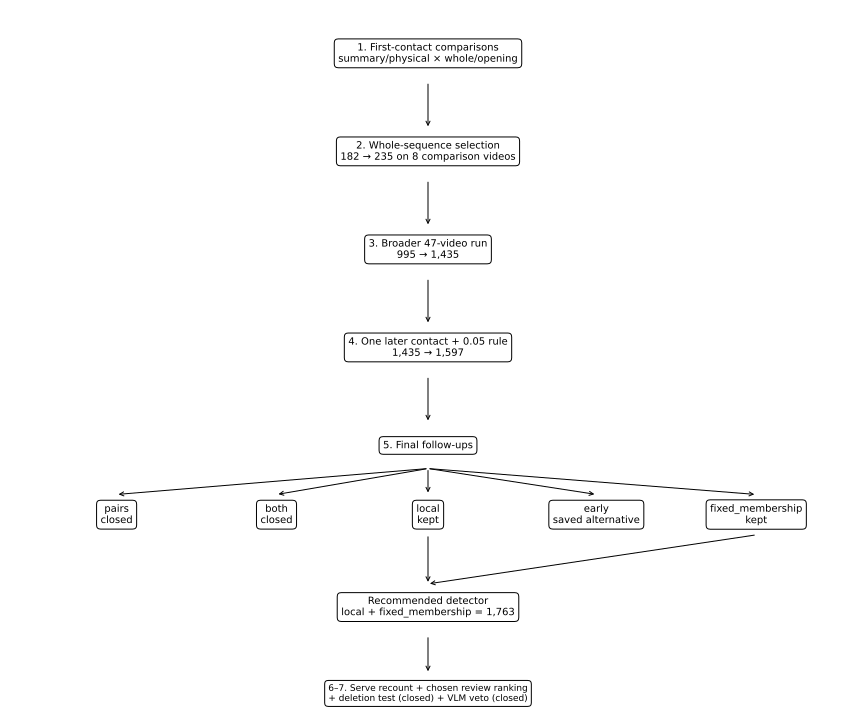

# Experiment lineage: what we actually ran on this branch

This is the map of the experiments that happened on **`contact-det-last-effort`**.

It is chronological by **research decision**, not commit-by-commit. The point is to make it possible to read a result in the docs, see a name like `local` or `early`, and know where it came from in the code.

The branch starts with the existing detector and saved vision outputs. Everything below is work done in this closing-pass series.



## The short version

```text
Existing contact detector
        |
        v
1. First-contact comparisons
   summary/whole
   summary/opening
   physical/whole
   physical/opening
        |
        v
2. Choose the whole finished contact sequence
        |
        v
3. Run that model on 47 ShuttleSet22 videos
        |
        v
4. Allow one missed later contact
   + require a 0.05 score improvement before changing output
        |
        v
5. Final detector follow-ups
   ├── local  = score the proposed inserted contact itself
   ├── pairs  = allow two later insertions
   ├── both   = pairs + local score
   ├── early  = consider more possible serve timestamps
   └── fixed_membership = extend clip boundaries without changing contacts
        |
        +---- pairs/both: closed
        +---- early: saved alternative, not recommended
        |
        v
Recommended detector
local + fixed_membership
        |
        +---- gap review-ranking evidence
        +---- VLM veto: closed
        +---- deletion score: closed
        |
        v
6. Final serve + ranking pass
   serve recount
   chosen acceptance on the actual recommended detector
   accepted-error breakdown
```

The final detector is therefore **not** one giant model. It is the result of a sequence of branch decisions.

---

# 1. First-contact comparisons

## Question

**Can we repair the start of a rally more reliably, and which evidence is actually useful?**

This is the branch's first model-comparison stage.

The experiment compares four small models:

| Name in the writeup | What it learns from | What “whole” / “opening” means |
|---|---|---|
| `summary/whole` | numerical summaries of the proposed rally | target is whether the whole rally becomes correct |
| `summary/opening` | the same summary inputs | target asks specifically whether the opening repair is useful |
| `physical/whole` | summary inputs + saved physical measurements | whole-rally target |
| `physical/opening` | summary inputs + saved physical measurements | opening-specific target |

### Main runner

`run_start_comparison.py`

Supporting code:

- `features.py`
- `targets.py`
- `score_saved_start_reference.py`

Main saved outputs:

- `results/start_comparison_result.json.gz`
- `results/start_comparison_predictions.json.gz`
- `results/historical_start_reference.json.gz`

## What happened

The opening-specific target was more aggressive and found more repairs. The physical measurements were not especially useful **as a standalone first-contact model**.

That did **not** kill the physical features. It led directly to the next question:

**What if all of this evidence is judged together when choosing the finished rally, instead of forcing one local model to make the whole decision?**

## Diagnostics that grew out of this stage

These were not competing detector versions; they were investigations prompted by the first results.

| Diagnostic | Code | What it answered |
|---|---|---|
| Correct the old scoring baseline | `recount_matching.py` | Does the old scorer incorrectly certify clipped rallies or make avoidable contact pairings? |
| Check excluded GT | `check_label_coverage.py` | What did the inherited label cleaner remove? |
| Find where missed contacts disappear | `census_missed_candidates.py` | Are misses absent from the saved rows, below threshold, suppressed, or merely not selected? |
| Measure repair headroom | `diagnose_repair_capacity.py` | How many rallies could be repaired if labels were allowed to pick among existing candidates? |

Main records:

- `results/matching_*.json.gz`
- `results/label_coverage.json.gz`
- `results/missed_candidate_census.json.gz`
- `results/repair_capacity.json.gz`

These diagnostics are why later work focused on **selection and insertion from already-saved candidates** before rerunning upstream vision.

---

# 2. Choose the whole finished contact sequence

## Question

**Instead of deciding each repair separately, can one model compare a few finished versions of the rally and pick the best one?**

The alternatives included:

- leave the rally unchanged;
- add or replace the first contact;
- delete one apparent extra contact;
- combine a first-contact repair with one deletion.

It did **not** yet add a missing contact later in the rally.

### Main runner

`run_whole_rally_comparison.py`

Supporting code:

- `whole_rally_options.py`
- `whole_rally_features.py`
- `whole_rally_learning.py`
- `whole_rally_evaluation.py`

Main saved outputs:

- `results/whole_rally_result.json.gz`
- `results/whole_rally_predictions.json.gz`

## What happened

On the eight comparison videos, the fully correct count rose from **182 to 235 at ±10**.

This is where the physical measurements found a useful role: they added little raw gain, but reduced bad edits when the whole finished sequence was being judged.

**Decision:** carry the whole-sequence model into the 47-video comparison.

See [whole_rally_report.md](whole_rally_report.md).

---

# 3. Broader 47-video run

## Question

**Does the whole-sequence model still help when we run it across the full 47-video ShuttleSet22 comparison?**

### Main runners

- `prepare_broader_inputs.py`
- `freeze_broader_models.py`
- `run_broader_comparison.py`

Related checks:

- `replay_simple_replacements.py`
- `freeze_acceptance.py`
- `plot_broader_acceptance.py`

Main saved outputs:

- `results/broader_predictions.json.gz`
- `results/broader_result.json.gz`
- `results/broader_model_freeze.json.gz`
- `results/broader_action_policy.json.gz`
- `results/simple_replacement_replay.json.gz`
- `results/broader_acceptance_development.json.gz`
- `results/broader_acceptance_policy.json.gz`

## What happened

Fully correct rallies rose from **995 to 1,435**.

The branch also tested whether the whole-sequence model's own score was safe enough to act as an automatic-approval score. It was not.

A small side experiment also asked whether simple first-contact replacements should just be cancelled. That reduced damage at ±5, but the original combined model still won on the main ±10 target.

**Decision:** keep the combined whole-sequence detector and attack the obvious remaining problem: missed contacts later in the rally.

See [broader_comparison.md](broader_comparison.md).

---

# 4. Add one missed later contact

## Question

**Can the detector recover a contact that occurs after the serve, using candidates it already saved but did not select?**

This is the stage that introduces the branch's `later` family.

### Main runners

- `prepare_later_inputs.py`
- `run_later_comparison.py`
- `run_later_margin.py`
- `prepare_later_broader_inputs.py`
- `run_later_broader.py`

Supporting code:

- `later_options.py`
- `later_evaluation.py`
- `later_acceptance_features.py`

Main saved outputs:

- `results/later/later_opportunity.json.gz`
- `results/later/later_predictions.json.gz`
- `results/later/later_result.json.gz`
- `results/later/later_margin_predictions.json.gz`
- `results/later/later_margin_result.json.gz`
- `results/later/later_detector_policy.json.gz`
- `results/later/later_broader_predictions.json.gz`
- `results/later/later_broader_result.json.gz`

## Two versions were actually compared

### Take the new model's favourite every time

This reached **1,096** fully correct development rallies at ±10, but caused **42 losses**.

### Require a 0.05 score improvement

`run_later_margin.py` kept the old output unless the new choice scored at least **0.05 higher**.

That kept essentially the same gain — **1,095** fully correct development rallies — while cutting losses to **8**.

That 0.05 rule became part of the branch's detector lineage.

## Broader result

On the 47 videos, the detector moved:

**1,435 → 1,597 fully correct rallies.**

**Decision:** keep one later-contact insertion with the 0.05 rule.

See [later_contact_comparison.md](later_contact_comparison.md).

---

# 5. Final detector follow-ups

The 1,597-rally detector above becomes the reference for the next branching stage.

In the follow-up code this reference is often called **`session_start`**.

That name is easy to misread. It does **not** mean the original detector at the beginning of the project.

> **`session_start` = the 1,597-rally detector: whole-sequence selection + one later contact + the 0.05 rule.**

The follow-up work then branches in several directions.

## 5a. `local`: score the proposed inserted contact itself

### Question

**Can we judge the proposed insertion locally, instead of asking only whether the whole edited rally looks good?**

Code:

- `local_insertion.py`
- `insertion_learning.py`
- `run_insertion_followup.py --variant local`
- `run_insertion_broader.py --variant local`

Results:

- `results/followups/local_result.json.gz`
- `results/followups/local_broader_predictions.json.gz`
- `results/followups/local_broader_result.json.gz`

Broader result:

**1,597 → 1,622 fully correct rallies.**

**Decision:** keep the local insertion score.

---

## 5b. `pairs`: allow two later insertions

### Question

**Some rallies miss two later contacts. Does allowing a pair of insertions produce a useful learned gain?**

Code:

- `pair_targets.py`
- `run_insertion_followup.py --variant pairs`

Result:

- `results/followups/pairs_result.json.gz`

There was genuine theoretical headroom, but the learned model gained too little and changed too much output.

**Decision:** close this version.

---

## 5c. `both`: pair insertions + local insertion evidence

### Question

**Does the local insertion score make the two-insertion branch safe enough to become useful?**

Code:

`run_insertion_followup.py --variant both`

Results:

- `results/followups/both_result.json.gz`
- `results/followups/both_boundary_result_fixed_membership.json.gz`

With the later boundary fix included, this version reached **1,210** fully correct development rallies at ±10 versus **1,209** for the simpler local version.

That one-rally net gain involved **15 repairs and 14 losses**.

**Decision:** close `both` along with `pairs`.

---

## 5d. `early`: consider more possible serve timestamps

### Question

**Are we missing serves because the early candidate list is too small?**

The old path considered up to two earlier candidates. This version expands that to four.

Code:

- `early_shortlist.py`
- `run_early_followup.py`
- `prepare_early_broader_inputs.py`
- `run_insertion_broader.py --variant early`

Results:

- `results/followups/early_window_diagnosis.json.gz`
- `results/followups/early_result.json.gz`
- `results/followups/early_broader_predictions.json.gz`
- `results/followups/early_broader_result.json.gz`

It looked useful on development data.

On the 47-video comparison, once the boundary fix was added, it reached **1,767** versus **1,763** for the recommendation.

Against the recommended version it repaired **19** rallies and broke **15**.

**Decision:** preserve `early` as the highest-count alternative, but do not prefer it.

---

## 5e. Rally-boundary correction

### Question

**How many “contact detector failures” are actually clips whose start/end times cut off a rally that the detector otherwise has?**

Code:

- `boundary_followup.py`
- `run_boundary_followup.py`
- `run_boundary_broader.py`

The final boundary mode is called:

**`fixed_membership`**

That means:

> extend the proposed clip only when doing so **does not change which predicted contacts belong to it**.

This distinction matters because an earlier boundary version could accidentally pull a neighbouring contact into a previously good rally.

### Main comparisons

`session_start + fixed_membership`

Result:

- `results/followups/session_start_boundary_broader_result_fixed_membership.json.gz`

Broader fully correct count:

**1,732**, with **135 repairs and 0 losses** against `session_start`.

`local + fixed_membership`

Results:

- `results/followups/local_boundary_broader_predictions_fixed_membership.json.gz`
- `results/followups/local_boundary_broader_result_fixed_membership.json.gz`

Broader fully correct count:

**1,763**.

This becomes the **recommended detector**.

`early + fixed_membership`

Result:

- `results/followups/early_boundary_broader_result_fixed_membership.json.gz`

Broader fully correct count:

**1,767**, but with too much repair/loss churn for four extra successes.

**Decision:** final detector = **`local + fixed_membership`**.

See [followup_comparison.md](followup_comparison.md).

---

# 6. Review-ranking experiments

These experiments do **not** change the contact sequence. They try to answer:

**Which outputs should a human look at first, or which ones look safe enough to use automatically?**

There are two generations of this work on the branch.

## 6a. Earlier `gap` ranking experiment

### Question

**Does evidence inside the spaces between predicted contacts help us recognise incomplete rallies?**

Code:

- `gap_evidence.py`
- `run_gap_acceptance.py`
- `run_gap_broader.py`

Results:

- `results/followups/gap_acceptance_result.json.gz`
- `results/followups/gap_broader_predictions.json.gz`
- `results/followups/gap_broader_result.json.gz`

Important historical detail:

> This first `gap` experiment scored the **preceding 1,597 detector**, not the final `local + fixed_membership` detector.

It improved ranking, but did not make the selected output safe enough for automatic use.

---

## 6b. Visual-model veto

### Question

**Can a visual-language model reject bad automatically selected rallies?**

Code:

- `prepare_vlm_acceptance.py`
- `score_vlm_acceptance.py`

Results:

- `results/followups/vlm_acceptance_decisions.json.gz`
- `results/followups/vlm_acceptance_result.json.gz`

On the routed development cases at ±10:

**45 correct / 12 wrong → 6 correct / 1 wrong** after the visual veto.

It removed most of the mistakes and also removed most of the good output.

**Decision:** close this task.

---

# 7. Final serve + ranking pass on the recommended detector

Once **`local + fixed_membership`** had been chosen, the branch ran a final measurement pass on that actual detector.

This is where the final serve numbers, deletion test and current ranking results come from.

## 7a. Serve recount

### Question

**On the actual recommended detector, how often do we find the serve, start the clip on it, and name the correct server?**

Code:

- `serve_metrics.py`
- `run_serve_followups.py`
- `write_serve_tables.py`

Results:

- `results/serve_followups/development_serves.json.gz`
- `results/serve_followups/broader_serves.json.gz`
- `results/serve_followups/serve_per_video.csv.gz`

This is the source of the final serve/contact tables in [contact_performance.md](contact_performance.md) and [serve_tables.md](serve_tables.md).

---

## 7b. Serve-error diagnosis

### Question

**Why are the remaining serves missed?**

Code:

`run_serve_diagnosis.py`

Result:

`results/serve_followups/development_diagnosis.json.gz`

This is where the branch found, among other things, that many missed serves already had a useful candidate available and were **selection failures rather than candidate-generation failures**.

That finding remains open in [promising_leads.md](promising_leads.md).

---

## 7c. Local deletion score

### Question

**Can a separate score safely remove extra contacts from the recommended detector?**

Code:

- `deletion_evidence.py`
- `local_deletion.py`
- `run_deletion_followup.py`

Results:

- `results/serve_followups/deletion_predictions.json.gz`
- `results/serve_followups/deletion_development.json.gz`

Development result at ±10:

**1,209 → 1,217**, from **22 repairs and 14 losses**.

**Decision:** close the broad deletion model. It was not run on the 47-video comparison.

---

## 7d. `chosen` acceptance: ranking the actual final detector

### Question

**Now that the detector itself has changed, how well can we rank the outputs it actually produces?**

This supersedes the earlier `gap` result for deployment discussion.

Code:

- `chosen_acceptance.py`
- `broader_acceptance_inputs.py`
- `run_chosen_acceptance.py`
- `run_chosen_acceptance_broader.py`
- `score_acceptance.py`
- `acceptance_breakdown.py`
- `write_acceptance_tables.py`

The two feature names are:

- **`base`** = ranking features without the extra between-contact evidence;
- **`gap`** = the same ranking model with the extra between-contact evidence.

The word `gap` here changes the **ranking score only**. It does not add or remove a contact.

Main results:

- `results/serve_followups/chosen_acceptance_development.json.gz`
- `results/serve_followups/chosen_acceptance_broader_predictions.json.gz`
- `results/serve_followups/chosen_acceptance_broader.json.gz`
- `results/serve_followups/acceptance_breakdown.json.gz`
- `results/serve_followups/acceptance_per_video.csv.gz`

This is the source of the current **616 fully correct / 124 imperfect / 44 untrusted-GT** selected-output result.

It is also where the important **112 of 124 still contain one whole rally** result comes from.

See [serve_and_acceptance.md](serve_and_acceptance.md).

---

# Code-name dictionary

This is the shortest route from an internal result filename to what it means.

| Code/result name | Plain-English meaning |
|---|---|
| `session_start` | The 1,597-rally detector after one later insertion + the 0.05 rule; reference at the start of the final follow-up |
| `local` | Add a score for whether the proposed inserted contact itself looks useful |
| `pairs` | Allow two later-contact insertions |
| `both` | `pairs` + `local` |
| `early` | Consider more possible early/serve timestamps |
| `fixed_membership` | Extend rally start/end times without changing which predicted contacts belong to the rally |
| `guarded_only` | Apply only the boundary correction to the preceding detector |
| `recommended` | Final `local + fixed_membership` detector |
| `base` acceptance | Review-ranking model without extra between-contact evidence |
| `gap` acceptance | Review-ranking model with extra evidence from spaces between predicted contacts |
| `chosen` acceptance | Ranking experiment run on the actual recommended detector rather than an earlier detector |
| `original` in serve tables | Original saved contact stream before this branch's repair sequence |
| `preceding` in serve tables | The 1,597 detector before the final local/boundary follow-up |
| `wider_early` in serve tables | The saved `early + fixed_membership` alternative |

---

# What actually survives into the final detector

The experiments above leave this path:

```text
whole-sequence selection
        +
one later-contact insertion
        +
0.05 minimum score improvement
        +
local inserted-contact score
        +
fixed_membership boundary correction
        +
alternating player assignment
```

The ranking model is **downstream of that detector**. It decides review priority; it does not change the contact sequence.

The branches that were tested and then dropped are:

- `pairs`
- `both`
- broad local deletion
- the visual-model veto

The branch that remains saved as an alternative but is not recommended is:

- `early`

For ideas that remain worth revisiting, see [promising_leads.md](promising_leads.md).
