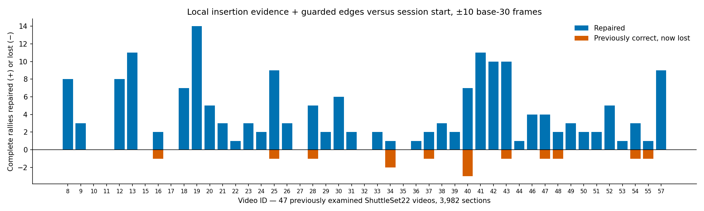

# Better contacts and safer section edges

*5 September 2026 · experimental scripts; production defaults unchanged*

**Keep local insertion evidence plus guarded section edges.** Each proposed
video section should contain one whole rally. A complete output matches every
labelled contact once, adds no extra event and assigns player sides correctly.
The primary timing tolerance is ±10 frames on a 30 fps clock.

Across the same 47 previously examined ShuttleSet22 videos, this detector
completes **1,763 of 3,982 sections at ±10, up from 1,597**.
It repairs 180 previously incomplete rallies and loses 14 previously correct
ones. At ±5, the same output completes 1,430 rallies instead of 1,327, with
113 repairs and ten losses. Production defaults remain unchanged.

The highest-count alternative widens the early shortlist and reaches **1,767
at ±10**. Against the recommended version it repairs 19 rallies and loses 15,
for just four more complete outputs. Its ±5 total falls to 1,425. Preserve that
result, but keep the smaller shortlist as the recommended recovery-versus-harm
tradeoff. This is not a zero-loss rule: the recommended detector retains a
substantial gain despite its 14 losses against session start.

Boundary extension alone is a useful lower-risk choice: **1,732 complete rallies
at ±10**, with 135 repairs and no observed losses. Most of the combined gain is
better containment of existing contacts, not newly detected hits. Acceptance
ranking also improves, but accepted mistakes remain too common for automatic
trust. A small visual-model acceptance test rejects too much correct output.

## Contents

- [What counts as an improvement](#what-counts-as-an-improvement)
- [Which detector changes helped](#which-detector-changes-helped)
- [Errors hidden by the totals](#errors-hidden-by-the-totals)
- [Can acceptance recognise good output?](#can-acceptance-recognise-good-output)
- [Why the visual gate stopped](#why-the-visual-gate-stopped)
- [Cost and remaining questions](#cost-and-remaining-questions)
- [Methods and reproduction](#methods-and-reproduction)

## What counts as an improvement

A section is an automatically proposed stretch of video. It is complete only
when it contains exactly one whole labelled rally, matches every contact once,
adds no extra event and assigns every player side correctly. The final side rule
chooses the alternating Top/Bottom sequence supported by more original side
guesses. Raw guesses remain saved separately.

The decision tolerance is **±10 frames on a 30 fps clock**. The tighter ±5 check
uses the same predictions. Tolerances scale once to native frame rate. Repairs
and losses compare labelled rally identities, not just section totals. Unknown
sections remain in the denominator. Unlabelled contacts are not automatically
false events, and unknown output is not safe output.

The new models were screened on 32 development videos, containing 2,850 sections.
Each learned stage excludes its scored group, including the upstream learned
scores used to teach downstream models. The original cached contact-detector
scores retain cross-group dependence. These screens are therefore not fully
independent end-to-end estimates.

Settings were then frozen for the same **47 previously examined videos** used
in the preceding report. This population contains 3,982 proposed sections,
3,422 retained labelled rallies and 38,218 labelled contacts. New predictions
were saved before loading evaluation labels. Reusing these videos can show
transfer across the existing collection; it is not a fresh test set.

## Which detector changes helped

The session-start detector already considers two earlier candidates and up to
six saved later candidates. It crosses one later insertion with opening and
deletion choices. Every experiment keeps its exact reference output available,
including inserted contacts, raw sides and edges. An edit must beat that output
by 0.05 when both are scored by the new model.

### Local evidence helps the combined chooser

The new local model asks whether one insertion recovers a distinct labelled hit,
preserves previously represented hits and avoids an extra event or duplicate.
A missing contact elsewhere does not make a useful insertion negative.
The local question does not require the candidate's raw side guess to be right.
Its score becomes one extra input to the complete-rally chooser.

Development complete rallies rise from 1,095 to **1,109 at ±10**, with 21 repairs
and seven losses. All four groups gain: +1, +3, +1 and +9. At ±5, the change is
896 to 906, with 15 repairs and five losses. This modest, distributed gain earned
the frozen broader test.

Across 47 videos, local evidence alone reaches **1,622 / 1,350 complete rallies
at ±10 / ±5**. Against the session-start detector, repairs/losses are 41/16 and
33/10. At ±10, 18 videos gain, 23 tie and six lose. The net gain is useful but
does not erase the regressions.

### Small edge extensions recover existing complete contact sequences

Development diagnosis found 545 sections with incomplete labelled-rally
containment. The boundary rule extends a section towards ten base-30 frames
before its first predicted contact and after its last. Neighbouring original
sections limit the extension. Competing extensions split the old gap at its
midpoint.

An initial version pulled an outside contact into one previously correct
section. The retained refinement keeps the original edges whenever extension
would change the section's event list. This choice was made on development
before applying it to the broader videos. It changes no contact timestamps,
raw sides or event membership.

On development, the guarded rule raises the session-start detector to 1,196
complete rallies at ±10 and 949 at ±5, with 101/0 and 53/0 repairs/losses.
Applied after local evidence, it reaches 1,209 and 958, adding 100 and 52 complete
rallies without a previously correct loss at either tolerance.

| Frozen detector on 47 videos | Complete at ±10 / ±5 | Repairs / losses at ±10 | Repairs / losses at ±5 |
|---|---:|---:|---:|
| Session start | 1,597 / 1,327 | — | — |
| Local insertion evidence | 1,622 / 1,350 | 41 / 16 | 33 / 10 |
| Guarded edges only | 1,732 / 1,404 | 135 / 0 | 77 / 0 |
| Local evidence + guarded edges | 1,763 / 1,430 | 180 / 14 | 113 / 10 |
| Wider early shortlist + local evidence + guarded edges | 1,767 / 1,425 | 194 / 24 | 117 / 19 |

Every row retains all 3,982 sections. Repairs/losses above compare directly with
the session-start detector. Against local evidence alone, adding guarded edges
repairs 141 rallies at ±10 and 80 at ±5, with no losses. Do not add successive
repair counts: the same rally can appear in more than one comparison.

Against guarded edges alone, the recommended combination adds 31 complete
rallies at ±10, with 45 repairs and 14 losses. At ±5 it adds 26, with 38 repairs
and 12 losses. This direct comparison separates the value of local evidence
from the larger boundary gain.

The completed combined detector recovers 51.5% of retained labelled rallies at
±10, versus 46.7% at session start. Its complete sections are 44.3% of all proposed
sections. These are different denominators.



*The recommended combination improves the net complete-rally count in 38 videos,
ties in eight and loses one rally in one video. Blue bars show repairs; orange
bars below zero show losses. At ±5, 34 videos improve, ten tie and three lose.*

The [recommended combined result](results/followups/local_boundary_broader_result_fixed_membership.json.gz)
and [boundary-only result](results/followups/session_start_boundary_broader_result_fixed_membership.json.gz)
retain every paired rally identity, unknown section and per-video count.

### Pair opportunity is larger than the learned gain

The existing six later candidates permit compatible pairs. Label-selected
opportunity rises from 1,538 to 1,620 complete development rallies when two
insertions replace the one-insertion limit, allowing the same opening/deletion
choices. With the base choice fixed, the corresponding ceiling rises from
1,254 to 1,309. Those extra 82 and 55 possibilities are diagnostic upper bounds,
not achieved detector improvements.

The learned pair-only model reaches 1,101 at ±10: 12 repairs and six losses
against session start. At ±5 it reaches 897: six repairs and five losses. Three
groups gain and one ties at ±10; the net gain is smaller than local evidence alone.
Adding local evidence to the pair model reaches 1,105 / 903 at ±10 / ±5.
Against session start, repairs/losses are 14/4 and 10/3. This is better than
pairs alone, but below local evidence alone at both tolerances. With guarded
edges it reaches 1,210 / 956, versus 1,209 / 958 for local evidence plus edges.
At ±10 that one extra rally involves 15 repairs and 14 losses against the
simpler combination. At ±5 it repairs seven and loses nine.

That result does not justify tripling the alternative pool or another broader
pair campaign. Both learned pair tests and their boundary interaction are saved;
pairs were tested inside the complete detector, not rejected from their local
or opportunity scores alone. See the [pair combination](results/followups/both_result.json.gz)
and [pair-boundary comparison](results/followups/both_boundary_result_fixed_membership.json.gz).

### Earlier proposals deserve a targeted test

Among 331 first-contact misses near scored but unshortlisted frames, 318 fall
inside the existing early window. Eight fall outside it, and five have no such
window. The tested change keeps the windows and old candidates, then adds the
next eligible score-ranked candidates up to four earlier proposals instead of
two. Automatic sides come from saved tracks and poses. The combined detector
reaches 1,121 at ±10, with 18 repairs and six losses against local evidence alone.
Three groups gain and one ties. At ±5 it reaches 911, with nine repairs and four
losses. Against session start, repairs/losses are 36/10 and 23/8.

With guarded edges, development reaches 1,227 / 964 at ±10 / ±5. Against local
evidence plus those same edges, repairs/losses are 25/7 and 10/4. Directly against
session start they are 142/10 and 76/8. This useful combined gain earned the
frozen broader run.

Across 47 videos, the wider shortlist alone reaches 1,625 / 1,345, versus
1,622 / 1,350 for local evidence. With guarded edges it reaches 1,767 / 1,425.
Against the recommended combination, ±10 repairs/losses are **19/15**, and
±5 repairs/losses are **6/11**. At ±10, 11 videos gain, 29 tie and seven lose.
The extra net four complete rallies come with substantial changes to good
output. That weak transfer, rather than the tighter-tolerance loss alone,
is why the smaller shortlist remains recommended.

The [wider-early development result](results/followups/early_result.json.gz),
[frozen broader result](results/followups/early_broader_result.json.gz) and
[combined boundary result](results/followups/early_boundary_broader_result_fixed_membership.json.gz)
remain available as a higher-count alternative. No broader failure was used to
tune its candidates, margin or model.

## Errors hidden by the totals

Local insertion evidence can damage a rally that was already incomplete. On
the broader videos, its 246 contact-changing sections contain 171 judgeable
edits and 75 unknown edits. Widening the early shortlist changes another 164
sections against the recommended combination; 91 are judgeable and 73 unknown.

| Contact-changing comparison | Tolerance | Matches recovered / lost | Unnecessary events added / removed | Already-wrong sections harmed |
|---|---:|---:|---:|---:|
| Local evidence vs session start | ±10 | 103 / 33 | 61 / 28 | 54 |
| Same comparison | ±5 | 117 / 63 | 106 / 57 | 83 |
| Wider early + edges vs recommended | ±10 | 46 / 36 | 24 / 11 | 29 |
| Same comparison | ±5 | 43 / 54 | 65 / 31 | 60 |

These local counts cover judgeable edits. Harm means losing a represented hit
or gaining an unnecessary event in a section that was already wrong. It is
separate from losing a previously complete rally.

Guarded edges leave those contact lists unchanged. Their extra complete-rally
count is a containment improvement and does not show better serve detection.

| Full video streams, 47 videos | Session start | Recommended | Wider early alternative |
|---|---:|---:|---:|
| Predicted contacts | 41,473 | 41,605 | 41,661 |
| Matched contacts, ±10 / ±5 | 33,637 / 32,907 | 33,716 / 32,972 | 33,728 / 32,965 |
| Correct time-matched sides, ±10 / ±5 | 32,492 / 31,850 | 32,667 / 32,006 | 32,708 / 32,030 |
| Matched first contacts, ±10 / ±5, out of 3,422 | 2,769 / 2,350 | 2,781 / 2,371 | 2,784 / 2,366 |

Full-stream accounting includes contacts outside sections. Matching the first
labelled contact measures serve recovery; it does not establish visibility,
server identity or the point winner.

Joint time-and-side F1 rises from 81.5% to 81.8% at ±10 and from 79.9% to 80.2%
at ±5. This is twice the correctly sided timing matches divided by predicted
plus labelled contacts. The saved timing-only F1 is a different metric.
The wider early version gives 81.9% / 80.2% joint F1. Its three extra matched
first contacts at ±10 do not turn the weak complete-rally gain into a large
serve-recovery improvement.

## Can acceptance recognise good output?

The acceptance comparison holds the **session-start detector output fixed**.
It does not evaluate acceptance of the new local-plus-boundary detector. The
new model adds 15 summaries of saved candidate evidence across separate gaps,
computed against the selected contact list. A gap without a shortlisted
proposal remains missing evidence, not evidence of completeness.

At the fixed development comparison of 570 accepted sections, the control has
432 correct, 135 wrong and three unknown outputs at ±10. Gap evidence gives
451 correct, 117 wrong and two unknown. At ±5 the counts are 370/197/3 versus
385/183/2. Both models use the required nested training exclusions.

Two frozen thresholds were carried to the broader videos. Their coverage
differs, so a common-coverage comparison is shown separately.

| Broader rule at ±10 | Accepted | Correct | Wrong | Unknown | Correct rejected |
|---|---:|---:|---:|---:|---:|
| Frozen control threshold | 740 | 549 | 144 | 47 | 1,048 |
| Frozen gap threshold | 785 | 599 | 149 | 37 | 998 |
| Control, common coverage | 797 | 587 | 158 | 52 | 1,010 |
| Gap, common coverage | 797 | 610 | 150 | 37 | 987 |

At ±5 the same frozen-threshold selections contain 496/197/47 and 536/212/37
correct/wrong/unknown outputs. They reject 831 and 791 correct rallies,
respectively. Gap evidence improves ranking; it does not make
the selected output almost always right. The saved curves retain small tails
and unknown counts rather than hiding them with a new cutoff search.

At common coverage of 797 sections, the ±5 counts are 530/215/52 for the
control and 547/213/37 for gap evidence. They reject 797 and 780 correct rallies,
respectively. The [acceptance result](results/followups/gap_broader_result.json.gz)
also retains the full curves. This acceptance model has not been transferred
or calibrated onto the recommended changed detector.

For the frozen gap rule at ±10, 80.1% of judged accepted outputs are correct;
only 76.3% of everything accepted is verified correct. At ±5 those shares are
71.7% and 68.3%. Unknown cases explain the difference between each pair.

## Why the visual gate stopped

The frozen gap rule naturally routes 57 accepted sections across the three
existing scene fixtures. Qwen3.8 receives a clean, 120-native-frame clip and the
existing serve-timing question. It does not see the tree score or predicted
contact time. Missing, malformed or unclear replies keep tree acceptance.
A reply saying service is not shown rejects acceptance; a timed answer must
agree with the first prediction within ±10. The contact list never changes.

At ±10, tree-only acceptance contains 45 correct and 12 wrong sections. The
visual gate keeps seven: six correct and one wrong. It removes 11 wrong outputs
but rejects 39 correct ones. At ±5, the same selections change from 32 correct
and 25 wrong to four correct and three wrong. This is not a useful practical
filter, so no wider visual campaign follows.

Unrouted outputs retain tree acceptance. Across all 2,850 development sections,
the visual gate reduces acceptance from 570 to 520. At ±10 those 520 contain
412 correct, 106 wrong and two unknown outputs; 683 correct rallies are rejected.
At ±5 the counts are 357/161/2, with 539 correct rallies rejected.

All 69 calls completed: 57 natural cases and 12 shifted-window controls. There
were no generation or parser failures. All shifted pairs retain the same
accept/reject decision, but only four pairs return two timed answers. Their
source-frame differences are 20, 9, 2 and 2; stable rejection does not establish
accurate timing. Existing visibility and replay warnings remain relevant.
No new visibility labels or visual adjudications were created.

The [visual comparison](results/followups/vlm_acceptance_result.json.gz) and
[per-call decisions with raw replies](results/followups/vlm_acceptance_decisions.json.gz)
preserve the failed branch. The old reviewed controls found exact-time claims
in 11 of 13 invisible-contact cases and live claims on 21 of 25 pure replays.
Those [historical controls](../vlm_pr80_eval/QWEN3_8_COMPARISON.md) were reused as
warnings, not mixed into the naturally routed performance estimate.

## Cost and remaining questions

Local development preparation and fitting took 27.6 minutes. Pair-only took
40.1 minutes, pairs with local evidence took 62.3 minutes, and the wider early
shortlist took 26.3 minutes. These times include reusable features, training
and evaluation. They are not recurring per-video prediction costs.

Frozen local processing of the 47 cached inputs took 241.8 seconds with four
workers. The sum of per-video work was 659.8 seconds, including loading,
features and prediction. This is saved-output processing, not a rerun of the
vision pipeline or an end-to-end speed comparison. Applying guarded edges took
another 8.5 seconds across all 47 videos; the longer 91.4-second boundary job
also includes evaluation. The gap acceptance pass
took 26.8 seconds. Visual preparation took 32.0 seconds and 69 calls took
408.9 seconds of inference, excluding model startup.

The wider early bundle took 340.8 seconds to prepare. Its frozen prediction
pass took 217.9 seconds, followed by 8.4 seconds for guarded edges. Per-video
work sums to 522.7 seconds before edges. These runs shared changing machine
load and caches; their wall times are not a controlled speed comparison.
The wider shortlist is not rejected over a few minutes of compute. Its extra
losses buy too little additional complete output.

Keep the local score and guarded edges. Keep gap evidence as an experimental
ranking improvement. Preserve the wider early model as a higher-count
alternative, but do not prefer it. Close the tested pair and visual-gate
branches. All experiments are complete.

The following branches were deliberately not run:

- A gap-diverse later shortlist: the initial diagnosis found 551 later misses
  already near shortlisted candidates, versus 87 near scored but unshortlisted
  frames. The much larger early shortlisting gap took priority.
- A separate local deletion target: unwanted events remain a useful question,
  but this optional branch was not part of the completed insertion, boundary
  and acceptance comparisons. Existing physical evidence already feeds the
  whole-rally chooser; its presence does not establish that a local deletion
  target would be redundant.
- Further player attribution: after the recommended local evidence and edges,
  only 21 development sections at ±10 have complete timing and containment
  but wrong sides; at ±5 there are 14. Side errors also coexist with other
  failures. No broad server campaign was launched.
- New vision extraction, a larger iterative search, or a second visual task:
  this pass found useful changes in saved evidence and no demonstrated need
  for those added systems. No missing truth was replaced with new annotation.

The next useful model question is whether a local deletion target can remove
unnecessary events without losing represented contacts. That remains untested.
No production integration, rally-length cap or broad hyperparameter search is
included.

## Methods and reproduction

The new trees retain the existing histogram-gradient-boosting settings and
the 0.05 same-model reference advantage. Local insertion contributes one score;
pair context contributes two when enabled. The wider early shortlist reuses
the saved local models with the same nested exclusions and retrains the opening
and whole-rally chooser for its expanded alternatives.

All experiment paths below are relative to `scratch/contact_det_closing_pass/`.
The saved models are ignored artefacts; the result records and compact broader
predictions are versioned.

| Role | Saved artefact |
|---|---|
| Recommended frozen opening, whole-rally and local models | `raw/followups/local_models.joblib` |
| Pair-only / local-plus-pair / wider early models | `raw/followups/{pairs,both,early}_models.joblib` |
| Acceptance control and gap models | `raw/followups/gap_acceptance_models.joblib` |
| Recommended full broader streams | [local boundary predictions](results/followups/local_boundary_broader_predictions_fixed_membership.json.gz) |
| Higher-count full broader streams | [early boundary predictions](results/followups/early_boundary_broader_predictions_fixed_membership.json.gz) |
| Original saved chooser and later inputs | `raw/broader_inputs/chooser_inputs.json.gz`, `raw/later_inputs/broader.json.gz` |
| Wider early inputs | `raw/followups/early_broader_inputs.json.gz` |
| Archived development streams | `raw/followups/development_predictions/{local,pairs,both,early}_predictions.json.gz` |

Development reuses `raw/later_run/prepared.joblib` and the preceding later
models. The [preceding report](later_contact_comparison.md#saved-files-reproduction-and-checks)
records their preparation. The local and whole-rally trees use 200 iterations,
15 leaves, learning rate 0.05, minimum leaf size 20, L2 regularisation 1.0,
balanced classes, no early stopping and random state 20260905. The
[opening model configuration](../contact_det_full_ds_fit/records/rally_start_model_runs.json)
and [learning source](scripts/whole_rally_learning.py) retain the other settings.
Only the shallow_hgb model settings are reused from that configuration; its
historical repair and acceptance gates are not used here.
Tree runs used scikit-learn 1.6.1, NumPy 2.2.6 and pandas 2.3.3.

Run from the repository root in the experiment environment. `CONTACT_STAGE_ROOT`
is the existing development stage bundle. The other variables name the saved
ShuttleSet22 predictions, prepared stages and inpainted tracks. They contain no
new labels or new vision outputs.

```bash
export PYTHONPATH=src:.
closing_module=scratch.contact_det_closing_pass.scripts

python -m "$closing_module.run_followup_diagnostics"
python -m "$closing_module.run_insertion_followup" --variant local --jobs 2
python -m "$closing_module.run_insertion_broader" --variant local --jobs 4
python -m "$closing_module.run_boundary_followup" \
  --variant local --boundary-mode fixed_membership
python -m "$closing_module.run_boundary_broader" \
  --variant local --boundary-mode fixed_membership

python -m "$closing_module.run_insertion_followup" --variant pairs --jobs 2
python -m "$closing_module.run_insertion_followup" --variant both --jobs 2
python -m "$closing_module.run_boundary_followup" \
  --variant both --boundary-mode fixed_membership

python -m "$closing_module.run_early_followup" \
  --side-root "$CONTACT_STAGE_ROOT" --jobs 2
python -m "$closing_module.prepare_early_broader_inputs" \
  --saved-root "$CONTACT_SAVED_ROOT" --prepared-root "$CONTACT_PREPARED_ROOT" \
  --inpaint-root "$CONTACT_INPAINT_ROOT" --jobs 4
python -m "$closing_module.run_insertion_broader" --variant early --jobs 4
python -m "$closing_module.run_boundary_followup" \
  --variant early --boundary-mode fixed_membership
python -m "$closing_module.run_boundary_broader" \
  --variant early --boundary-mode fixed_membership

python -m "$closing_module.run_gap_acceptance"
python -m "$closing_module.run_gap_broader"
```

The visual test uses `Qwen/Qwen3.8-27B-FP8`, revision
`017b9c7af6b5689d5dd426a76e0bc077eb5ca20a`, with vLLM 0.17.0. Clips contain
120 consecutive native frames at 512×288. A displayed clip index maps to
`source_start + clip_index`; it is not a base-30 frame number. The existing
configured visual runtime supplies its model/cache settings.

```bash
python -m "$closing_module.prepare_vlm_acceptance" \
  --artifacts-root "$CONTACT_STAGE_ROOT" --output "$VLM_INPUT"
bash scratch/vlm_pr80_eval/experiments/rally_start_remote.sh \
  qwen3-8 "$VLM_INPUT/manifest.json" "$VLM_OUTPUT"
python -m "$closing_module.score_vlm_acceptance" \
  --routing "$VLM_INPUT/routing.json" --attempts-root "$VLM_OUTPUT"
```

Whole-project checks: pytest exit 0 (2,040 passed, 29 skipped); Ruff exit 1
(915 existing issues); Pyrefly exit 1 (11 existing import errors). Scoped Ruff
and 139 focused experiment tests passed. Synthetic checks cover exact-reference
restoration, pair compatibility, local matching targets, training exclusions,
non-30-fps boundaries and visual frame conversion. All completed experiment jobs
exited 0. No check establishes invisible-contact truth or removes the cached-score
dependence described above.
