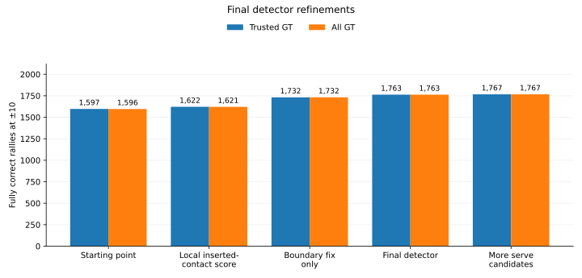

# Final detector refinements

This experiment produced the final recommended detector.

The same predictions are scored against **3,422 trusted rallies** and **all 3,965 source rallies**.

## Result

| Version | Trusted GT only | All GT included | Repairs / losses vs 1,597 |
|---|---:|---:|---:|
| Starting point | 1,597 / 3,422 = **46.7%** | 1,596 / 3,965 = **40.3%** | — |
| + local score for the inserted contact | 1,622 / 3,422 = **47.4%** | 1,621 / 3,965 = **40.9%** | 41 / 16 |
| Fix rally start/end times only | 1,732 / 3,422 = **50.6%** | 1,732 / 3,965 = **43.7%** | **135 / 0** |
| **Final detector: both** | **1,763 / 3,422 = 51.5%** | 1,763 / 3,965 = **44.5%** | **180 / 14** |
| Also consider more possible serve timestamps | 1,767 / 3,422 = **51.6%** | 1,767 / 3,965 = **44.6%** | 194 / 24 |

At the individual-contact level, the final detector reaches **81.0% precision / 88.2% recall / 84.5% F1** for timing. Requiring the correct player gives **78.5% / 85.5% / 81.8%**. The detector entering this follow-up was already at **81.1% / 88.0% / 84.4%** for timing and **78.3% / 85.0% / 81.5%** with the player.

That small contact-level change is important context for the much larger whole-rally gain below: most of the final improvement comes from fixing rally boundaries, not finding many more contacts.

## The biggest late gain was not new contact detection

Fixing the proposed rally's start and end times raises **1,597 → 1,732** by itself.

It repairs **135 rallies and loses none at ±10**.

It does not move contact timestamps, change player assignments, or add/remove contacts. It only expands the video interval when that can be done without changing which predicted contacts belong to the proposal.

So those 135 failures were basically **segmentation errors**: the contact sequence was useful, but the proposed clip was cut too tightly.

This is one of the strongest practical findings in the closing pass.

## The local inserted-contact score helps modestly

The later-contact model sometimes inserts a plausible candidate for the wrong reason.

The extra score asks a narrow question:

**Does this one proposed inserted contact look like a useful distinct hit, rather than a duplicate or extra event?**

That score raises **1,597 → 1,622** by itself.

Combined with the boundary fix, the final result reaches **1,763**.

## Why not use more possible serve timestamps?

The wider search reaches **1,767**, only four more perfect rallies than the recommendation.

Against the final 1,763 version it repairs **19** rallies and breaks **15**.

That is too much churn for four net successes.

The serve results agree: the wider search finds only three more serves at ±10 and is slightly worse at ±5.

## Adding two later contacts did not earn its complexity

There are examples where two insertions could theoretically repair a rally.

But the trained two-insertion versions did not beat the simpler one-insertion detector by enough to matter.

Close that branch.

## The vision-language-model veto was far too aggressive

A small visual check was tested as a way to reject unsafe automatic approvals.

On the cases sent to it at ±10:

- ranking model alone: **45 correct, 12 wrong**;
- after the visual veto: **6 correct, 1 wrong**.

It removes 11 mistakes and throws away 39 correct rallies.

Close that branch.

## Final detector

Keep:

- whole-sequence selection;
- one later-contact insertion;
- the 0.05 minimum improvement rule;
- the local inserted-contact score;
- conservative correction of rally start/end times;
- the alternating player-assignment rule.

The final serve and automatic-use results are in [serve_and_acceptance.md](serve_and_acceptance.md).
