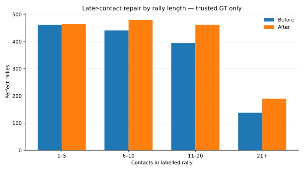

# Adding one missed contact later in the rally

## Result

This experiment was scored against the **3,422 rallies with trusted GT**. The 543 dropped rallies were not re-scored, so the all-GT result is not measured.

| Measure | Trusted GT only | All GT included |
|---|---:|---:|
| Perfect-rally recall before later-contact repair | 1,435 / 3,422 = **41.9%** | **not measured** |
| Perfect-rally recall after later-contact repair | **1,597 / 3,422 = 46.7%** | **not measured** |

At ±10, the new version repairs **178** rallies and breaks **16**, for a net gain of **162**.

The gain appears in 39 videos; seven tie; one loses one rally.

It also improves individual contacts:

| Contact task | Before P / R / F1 | After P / R / F1 |
|---|---:|---:|
| Timing only | 81.1 / 87.3 / 84.1% | **81.1 / 88.0 / 84.4%** |
| Timing + correct player | 75.0 / 80.8 / 77.8% | **78.3 / 85.0 / 81.5%** |

The player-aware jump is much larger than the timing-only jump. A lot of this stage's contact-level improvement comes from the final alternating-player assignment correcting player labels at timestamps that were already present.

## Where the new contact comes from

No new vision model was run.

The detector had already saved plausible contact timestamps that were not selected. The final-sequence model was allowed to add one of up to six plausible later candidates.

## The 0.05 rule matters

Always taking the new model's favourite sequence caused unnecessary changes.

On development data:

| Rule | Perfect at ±10, trusted GT | Repairs / losses |
|---|---:|---:|
| Previous detector | 991 | — |
| Always take the new model's favourite | 1,096 | 147 / 42 |
| **Only change if the new sequence scores ≥0.05 higher** | **1,095** | **112 / 8** |

The 0.05 rule gives up one successful rally and avoids **34 losses**.

That is the version carried forward.

## What the 178 repairs are

Of the 178 repaired rallies:

- **150** use a newly inserted contact;
- **147** of those insertions match a genuinely later labelled contact;
- the other 28 repairs come from changing one of the existing first-contact/removal decisions.

The gain is strongest on longer rallies:

| Contacts in the rally | Perfect before | Perfect after | Net gain |
|---|---:|---:|---:|
| 1–5 | 462 | 465 | +3 |
| 6–10 | 441 | 480 | +39 |
| 11–20 | 394 | 462 | +68 |
| 21+ | 138 | 190 | **+52** |

There is no length rule in the detector. This is just where the repairs happened.

## It still makes unwanted local edits

Among 471 changed proposals that can be compared cleanly with one trusted rally:

- 350 previously missed contacts become matched;
- 86 previously matched contacts are lost;
- 84 unmatched predictions are added;
- 92 unmatched predictions are removed.

So the rally-level gain is strong, but the insertion decision itself is still noisy.

That motivates the next experiment: give the final model a separate score for whether the proposed inserted contact itself looks useful.

## Cost

The added saved-output work took about **26.9 minutes across 47 videos**, roughly 34 seconds per video.

## Decision

Keep one later-contact insertion with the 0.05 minimum improvement rule.

Next: [followup_comparison.md](followup_comparison.md).
