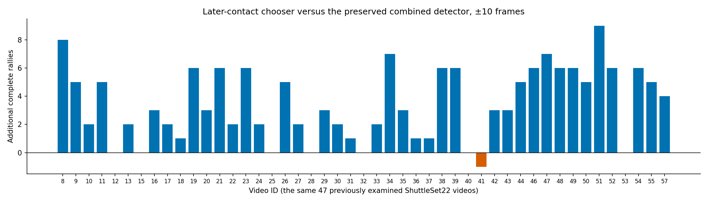
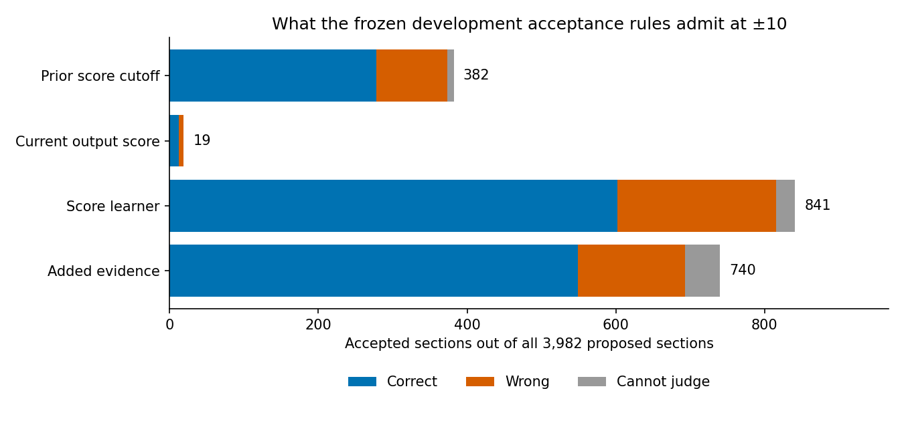

# Later contacts: a better complete detector

**The detector improves again across the 47 previously examined ShuttleSet22 videos.** At the usable ±10 tolerance, it reaches **1,597 complete rallies versus the previous best 1,435: 178 repairs and 16 losses**. That is **11.3% more usable rallies**. Joint contact-time-and-side F1 rises from **77.8% to 81.5%**. The new version completes **46.7% of retained labelled rallies**, or **40.1% of all generated sections**.

The added acceptance evidence helps rank outputs, but still falls short of almost-always-correct acceptance. Its development-chosen rule accepts **740 sections: 549 correct, 144 wrong and 47 unjudgeable** at ±10. That is 79.2% correct among judged cases, and 74.2% verified correct across everything accepted.

The extra saved-input preparation and prediction cost is **26.9 minutes across all 47 videos**, about **34 seconds per video**. The expensive vision outputs are reused. The detector improvement is worth keeping; the tested acceptance rules remain diagnostic. Everything stays in experiment scripts.

The aim is a badminton video annotator that produces more usable rallies and can recognise a useful set for automatic acceptance.

## Contents

- [What the comparison measures](#what-the-comparison-measures)
- [What the detector gains and loses](#what-the-detector-gains-and-loses)
- [What was tested and frozen](#what-was-tested-and-frozen)
- [Can it recognise reliable rallies?](#can-it-recognise-reliable-rallies)
- [Cost and next work](#cost-and-next-work)
- [Per-video and acceptance details](#per-video-and-acceptance-details)
- [Saved files, reproduction and checks](#saved-files-reproduction-and-checks)

## What the comparison measures

The comparison keeps all **3,982 proposed sections**, with **3,422 retained labelled rallies and 38,218 contact labels**. A complete section contains exactly one whole labelled rally, every contact once within tolerance, and the correct player side for every contact. The side vote chooses the alternating Top/Bottom sequence that agrees with more original automatic side guesses. Repairs and losses compare labelled rally identities, so a lost correct rally cannot disappear from the accounting.

**±10 frames on a 30 fps clock is the goal.** The allowance scales once to the source frame rate. ±5 is a tighter diagnostic on the same predictions. These videos have been examined before. Settings were frozen using development data, and every new detector and acceptance prediction was saved before loading the 47 videos' labels. This is a broader comparison, not an untouched benchmark.

The inherited label cleaner retained 3,422 of 3,965 listed rallies. It excluded 542 whole rallies with a source `flaw` flag and one with non-increasing timestamps. That does not establish that every omitted contact label is unusable. All predictions remain visible, so missing labels can depress contact F1. The [earlier report](broader_comparison.md) explains these unchanged exclusions. Against all 3,965 listed rallies, the new detector has **40.3% known complete**.

## What the detector gains and loses

Every row uses the same 3,982 sections. New repairs and losses below are measured directly against the preserved combined detector.

| Detector | Complete ±10 | Complete ±5 |
| --- | ---: | ---: |
| Unchanged detector plus side vote | 995 | 901 |
| Useful opening-only model | 1,105 | 1,001 |
| Preserved combined detector | 1,435 | 1,224 |
| **Combined detector with later contacts** | **1,597** | **1,327** |
| **New repairs / previous correct rallies lost** | **178 / 16** | **121 / 18** |

The ±10 gain appears in **39 videos; seven tie and one loses one rally**. The losing video is 41. At ±5, 35 improve, nine tie and three decline. The 16 ±10 losses are 1.1% of the reference's previously correct rallies.



*Each bar is a video's net gain, after subtracting losses. Video IDs follow the existing source manifest; overlapping dataset identities remain excluded.*

| Current accuracy | ±10 | ±5 |
| --- | ---: | ---: |
| Contact F1 requiring correct time **and** side | **81.5%** | 79.9% |
| Retained labelled rallies complete | **46.7%** (1,597 / 3,422) | 38.8% (1,327 / 3,422) |
| Generated sections complete | **40.1%** (1,597 / 3,982) | 33.3% (1,327 / 3,982) |

Joint F1 uses all 41,473 predicted contacts. At ±10, 32,492 receive credit for both timing and side: precision is 78.3% and recall 85.0%. Time-only matches rise from 33,376 to 33,637. Unmatched predictions rise from 7,774 to **7,836**, an increase of 62. An unmatched prediction is not necessarily false where labels were excluded.

Most of the joint-contact gain comes from attribution changes at unchanged timestamps. At ±10, 1,357 contacts become correctly attributed and 61 go the other way, a net gain of 1,296. This accounts for most of the 1,625 additional jointly correct contacts. It is a whole-detector comparison; the gain cannot be assigned to insertion alone.

There are **610 changed sections**, including 490 selected later insertions. Of the 178 repairs, 150 include an insertion; 147 of those insertions match a genuinely later labelled contact. Three recover a labelled first contact after a spurious earlier prediction. The other 28 repairs change existing opening/deletion choices. Five of the 16 losses include an insertion; eleven change the old choices without one. These are action associations, not isolated causal ablations.

The local edit comparison can judge 471 changed sections against one unambiguously associated retained rally. The other 139 remain unjudgeable in this comparison.

| Local contact effect versus the combined reference | ±10 | ±5 |
| --- | ---: | ---: |
| Newly matched labelled contacts | 350 | 331 |
| Previously matched labelled contacts lost | 86 | 130 |
| Added unmatched predictions | 84 | 201 |
| Removed unmatched predictions | 92 | 146 |
| Harmful edits in already-wrong sections | 128 | 209 |

“Harmful” means losing a labelled match or adding an unmatched prediction. These local counts cover the 471 comparable edits, so they differ from full-stream totals. The detector gains complete rallies while still making unwanted edits.

Longer rallies benefit substantially. These groups were counted after prediction; true length never controlled eligibility.

| Labelled contacts in the associated rally | Complete ±10, before → after | Repairs / losses ±10 | Complete ±5, before → after | Repairs / losses ±5 |
| --- | ---: | ---: | ---: | ---: |
| 1–5 | 462 → 465 | 12 / 9 | 393 → 392 | 8 / 9 |
| 6–10 | 441 → 480 | 44 / 5 | 371 → 398 | 33 / 6 |
| 11–20 | 394 → 462 | 70 / 2 | 343 → 386 | 46 / 3 |
| 21+ | 138 → 190 | 52 / 0 | 117 → 151 | 34 / 0 |

Sections without an associated labelled length remain in the full totals above. There is no rally-length or contact-count cap.

## What was tested and frozen

The experiment adds up to six later candidates from the saved contact scores. Candidates use their real timestamps, automatic player sides and 85 saved physical measurements. They sit after the predicted first contact and before the section end. The existing six-frame duplicate distance separates candidates from retained predictions and each other. This distance also scales from 30 fps.

Every old keep, opening add/replace, deletion and combined opening/deletion option remains available. Each can be combined with one later insertion. The limit controls alternatives tried; it does not exclude long rallies. The whole-rally chooser uses the same shallow histogram gradient boosting family and settings, with 397 inputs instead of 304. It learns complete output correctness at ±10. A separate local insertion scorer was not fitted.

First, the 32 development videos showed useful candidate opportunity. With labels allowed to choose the answer, real candidates could repair **248 sections while retaining the reference opening/deletion choice**, or **429 with alternative opening/deletion choices**. Those are diagnostic possibilities, not learned gains.

The learned comparison then exposed unnecessary changes. One fixed margin was tested: retain the entire reference output unless the expanded model scores its preferred output at least **0.05 above its score for the reference**. This compares both outputs using the same expanded model. There was no threshold search or named-rally patch.

| Development version, all 2,850 sections | Complete ±10 | Repairs / losses ±10 | Complete ±5 | Repairs / losses ±5 |
| --- | ---: | ---: | ---: | ---: |
| Preserved combined | 991 | — | 823 | — |
| Expanded chooser, highest score | 1,096 | 147 / 42 | 755 | 127 / 195 |
| **Expanded chooser, 0.05 advantage required** | **1,095** | **112 / 8** | **896** | **80 / 7** |

The margin retains 104 of the 105 additional usable rallies while cutting changed sections from 1,143 to 419. All four development groups improve. It was frozen before the broader comparison. The ungated model, scores and predictions remain saved separately; the ±5 improvement did not determine the choice.

Development results remain screening evidence. The cached upstream detector scores retain the previously documented cross-group dependence. New downstream fits exclude held groups explicitly. In acceptance training, both the expanded detector and the reference chooser are fitted inside the outer exclusions; global reference choices are used only for the held group's actual output.

## Can it recognise reliable rallies?

The acceptance comparison asks whether the score of the selected output can identify reliable sections, and whether extra evidence helps. The extra evidence covers discarded-contact support inside gaps, physical measurements, raw side disagreement and alternative starts. A shallow acceptance model using only the selected score is the control for the same model with all this evidence.

Training uses actual outputs made without fitting on that video's labels. Unknown outputs remain scored and reported, but do not teach the classifier.

For each score, five development tails were checked: the top 32 sections, then 5%, 10%, 20% and 40%, with ties included. A proposed rule needed at least 32 judged development sections and 95% correctness; 99% was also reported. **No rule met either target.** The best nonempty development point was retained as a diagnostic fallback. The 47-video data did not alter any threshold.

At the frozen rules, the broader results are:

| Rule | Accepted / 3,982 | Correct / wrong / unjudgeable ±10 | Judged correct ±10 | Verified correct / all accepted ±10 | Correct rallies rejected ±10 | Correct / wrong / unjudgeable ±5 |
| --- | ---: | ---: | ---: | ---: | ---: | ---: |
| Previous combined score cutoff | 382 | 278 / 95 / 9 | 74.5% | 72.8% | 1,157 | 248 / 125 / 9 |
| Current output score | 19 | 12 / 7 / 0 | 63.2% | 63.2% | 1,585 | 9 / 10 / 0 |
| Score-only learner | 841 | 602 / 213 / 26 | 73.9% | 71.6% | 995 | 529 / 286 / 26 |
| Added-evidence learner | 740 | 549 / 144 / 47 | 79.2% | 74.2% | 1,048 | 496 / 197 / 47 |

The added evidence improves judged correctness from **73.9% to 79.2%** against the score-only learner at their development-chosen rules. It accepts fewer sections: 740 rather than 841. Compared with the previous detector's cutoff, it accepts nearly twice as many verified correct rallies, with more wrong and unjudgeable outputs too. This is useful ranking progress, not near-certain acceptance or calibrated probabilities.

At ±5, the added-evidence rule is 71.6% correct among judged cases and 67.0% verified correct across all accepted outputs; it rejects 831 correct rallies. At ±10 it rejects 1,048 correct rallies. Its accepted set spans every video, with between one and 35 sections per video. Development group correctness ranges from 56.0% to 91.7%, so pooled performance hides substantial variation.



*The same complete output remains saved whether acceptance admits or rejects it. Each row uses its own rule chosen on development data. None met the development reliability target.*

The narrowest tails do not rescue acceptance. On the 47 videos, the score learner's development top-32 and top-5% thresholds accept nothing. The added-evidence top-32 threshold accepts only two sections. Both are correct at ±10; one is correct and one wrong at ±5. This tiny set does not establish reliable acceptance. All five points remain visible below, including these failures.

## Cost and next work

| Extra stage across 47 videos | Time |
| --- | ---: |
| Candidate preparation, including automatic side replay and physical joins | 21.3 minutes |
| Expanded chooser and acceptance prediction, including loading overhead | 5.6 minutes |
| **Total added saved-output work** | **26.9 minutes** |

Per-video preparation plus prediction averages **34.1 seconds**: median 30.6, minimum 16.5 and maximum 83.4 seconds. One-time model/bundle loading adds 9.7 seconds across the run. Label-based evaluation and reporting are separate from these prediction costs.

The earlier combined stages cost 21.5 minutes across the same 47 videos. Adding the measured stages gives about **48.4 minutes of saved-output processing in total**. That is an accounting total, not a newly timed end-to-end vision pass. Training costs are separate: the development expanded run took 21.7 minutes including feature building and evaluation; its five whole-model fits took 4.8 minutes. The nested acceptance run took 8.2 minutes. Those fits are a development expense, not recurring work per video.

**Keep the frozen detector improvement.** Retain the acceptance scores as experimental ranking evidence; the tested rules do not support almost-always-correct automatic acceptance. Further cutoff tightening has no support here.

A useful next development branch is a local insertion target that rewards adding a distinct contact without losing an existing match or creating a duplicate. The current model learns whole-rally correctness directly. Its remaining unmatched insertions and unwanted edits give that branch a concrete purpose. Inserting several later contacts, serve discovery beyond the existing shortlist and boundary changes remain untested by this run. None has been disproved. Production integration remains for a later round.

## Per-video and acceptance details

<details>
<summary>All 47 videos: detector changes, added-evidence acceptance and extra time</summary>

Acceptance uses the frozen added-evidence fallback. C / W / U means correct / wrong / unjudgeable. Times include candidate preparation and that video's prediction work, excluding the small shared loading overhead.

| Video | Complete ±10 before → after | Repairs / losses ±10 | Complete ±5 before → after | Repairs / losses ±5 | Accepted C / W / U ±10 | Accepted C / W / U ±5 | Extra seconds |
| --- | ---: | ---: | ---: | ---: | ---: | ---: | ---: |
| 8 | 25 → 33 | 8 / 0 | 21 → 23 | 2 / 0 | 7 / 4 / 0 | 7 / 4 / 0 | 34.5 |
| 9 | 20 → 25 | 5 / 0 | 11 → 15 | 4 / 0 | 4 / 2 / 0 | 3 / 3 / 0 | 23.8 |
| 10 | 22 → 24 | 2 / 0 | 22 → 23 | 1 / 0 | 11 / 0 / 2 | 11 / 0 / 2 | 28.6 |
| 11 | 11 → 16 | 6 / 1 | 9 → 14 | 5 / 0 | 0 / 2 / 0 | 0 / 2 / 0 | 33.6 |
| 12 | 15 → 15 | 1 / 1 | 12 → 10 | 0 / 2 | 3 / 1 / 1 | 2 / 2 / 1 | 26.8 |
| 13 | 26 → 28 | 2 / 0 | 21 → 24 | 3 / 0 | 11 / 0 / 0 | 10 / 1 / 0 | 38.4 |
| 15 | 0 → 0 | 0 / 0 | 0 → 0 | 0 / 0 | 0 / 7 / 21 | 0 / 7 / 21 | 83.4 |
| 16 | 35 → 38 | 5 / 2 | 31 → 31 | 2 / 2 | 21 / 4 / 0 | 19 / 6 / 0 | 29.3 |
| 17 | 15 → 17 | 2 / 0 | 14 → 14 | 0 / 0 | 12 / 0 / 0 | 11 / 1 / 0 | 80.5 |
| 18 | 34 → 35 | 1 / 0 | 30 → 31 | 1 / 0 | 10 / 1 / 2 | 9 / 2 / 2 | 29.5 |
| 19 | 35 → 41 | 6 / 0 | 25 → 29 | 4 / 0 | 13 / 6 / 2 | 9 / 10 / 2 | 40.1 |
| 20 | 7 → 10 | 3 / 0 | 6 → 8 | 2 / 0 | 5 / 1 / 2 | 4 / 2 / 2 | 21.2 |
| 21 | 22 → 28 | 6 / 0 | 18 → 24 | 6 / 0 | 5 / 5 / 0 | 5 / 5 / 0 | 33.3 |
| 22 | 20 → 22 | 2 / 0 | 16 → 17 | 1 / 0 | 5 / 5 / 2 | 5 / 5 / 2 | 21.9 |
| 23 | 41 → 47 | 7 / 1 | 34 → 35 | 3 / 2 | 10 / 2 / 0 | 9 / 3 / 0 | 43.6 |
| 24 | 7 → 9 | 2 / 0 | 6 → 8 | 2 / 0 | 5 / 1 / 1 | 4 / 2 / 1 | 19.0 |
| 25 | 26 → 26 | 2 / 2 | 22 → 21 | 1 / 2 | 6 / 3 / 0 | 5 / 4 / 0 | 37.6 |
| 26 | 27 → 32 | 5 / 0 | 21 → 25 | 4 / 0 | 7 / 2 / 0 | 7 / 2 / 0 | 26.3 |
| 27 | 35 → 37 | 2 / 0 | 35 → 36 | 1 / 0 | 15 / 1 / 2 | 15 / 1 / 2 | 22.0 |
| 28 | 41 → 41 | 1 / 1 | 33 → 33 | 1 / 1 | 15 / 4 / 1 | 12 / 7 / 1 | 30.0 |
| 29 | 27 → 30 | 4 / 1 | 23 → 24 | 1 / 0 | 13 / 0 / 0 | 13 / 0 / 0 | 23.3 |
| 30 | 33 → 35 | 2 / 0 | 26 → 28 | 2 / 0 | 11 / 6 / 0 | 10 / 7 / 0 | 25.1 |
| 31 | 41 → 42 | 1 / 0 | 37 → 37 | 0 / 0 | 17 / 5 / 0 | 15 / 7 / 0 | 25.8 |
| 32 | 31 → 31 | 0 / 0 | 22 → 22 | 0 / 0 | 15 / 2 / 1 | 13 / 4 / 1 | 30.1 |
| 33 | 62 → 64 | 2 / 0 | 60 → 62 | 2 / 0 | 28 / 4 / 0 | 27 / 5 / 0 | 42.8 |
| 34 | 42 → 49 | 7 / 0 | 36 → 42 | 6 / 0 | 20 / 3 / 0 | 17 / 6 / 0 | 38.5 |
| 35 | 37 → 40 | 3 / 0 | 33 → 35 | 2 / 0 | 19 / 4 / 1 | 18 / 5 / 1 | 28.4 |
| 36 | 18 → 19 | 1 / 0 | 14 → 15 | 1 / 0 | 12 / 4 / 0 | 10 / 6 / 0 | 25.9 |
| 37 | 71 → 72 | 4 / 3 | 65 → 65 | 3 / 3 | 12 / 4 / 2 | 12 / 4 / 2 | 37.4 |
| 38 | 20 → 26 | 6 / 0 | 19 → 23 | 4 / 0 | 9 / 0 / 0 | 7 / 2 / 0 | 44.4 |
| 39 | 30 → 36 | 6 / 0 | 22 → 23 | 1 / 0 | 8 / 0 / 0 | 5 / 3 / 0 | 25.3 |
| 40 | 51 → 51 | 1 / 1 | 44 → 44 | 1 / 1 | 16 / 1 / 0 | 15 / 2 / 0 | 33.1 |
| 41 | 49 → 48 | 2 / 3 | 46 → 45 | 2 / 3 | 14 / 4 / 0 | 13 / 5 / 0 | 31.4 |
| 42 | 17 → 20 | 3 / 0 | 16 → 18 | 2 / 0 | 6 / 1 / 2 | 6 / 1 / 2 | 37.2 |
| 43 | 40 → 43 | 3 / 0 | 39 → 40 | 3 / 2 | 20 / 1 / 1 | 20 / 1 / 1 | 52.6 |
| 44 | 49 → 54 | 5 / 0 | 40 → 45 | 5 / 0 | 27 / 8 / 0 | 25 / 10 / 0 | 40.5 |
| 46 | 22 → 28 | 6 / 0 | 18 → 23 | 5 / 0 | 12 / 4 / 1 | 10 / 6 / 1 | 27.7 |
| 47 | 44 → 51 | 7 / 0 | 41 → 48 | 7 / 0 | 24 / 8 / 0 | 24 / 8 / 0 | 45.1 |
| 48 | 43 → 49 | 6 / 0 | 35 → 40 | 5 / 0 | 21 / 9 / 0 | 16 / 14 / 0 | 37.1 |
| 49 | 47 → 53 | 6 / 0 | 35 → 38 | 3 / 0 | 15 / 4 / 0 | 13 / 6 / 0 | 45.6 |
| 50 | 32 → 37 | 5 / 0 | 26 → 30 | 4 / 0 | 9 / 3 / 0 | 7 / 5 / 0 | 24.6 |
| 51 | 23 → 32 | 9 / 0 | 22 → 27 | 5 / 0 | 7 / 3 / 2 | 6 / 4 / 2 | 27.5 |
| 52 | 45 → 51 | 6 / 0 | 40 → 45 | 5 / 0 | 23 / 10 / 1 | 23 / 10 / 1 | 46.1 |
| 53 | 6 → 6 | 0 / 0 | 5 → 5 | 0 / 0 | 1 / 0 / 0 | 1 / 0 / 0 | 16.5 |
| 54 | 35 → 41 | 6 / 0 | 27 → 30 | 3 / 0 | 8 / 1 / 0 | 7 / 2 / 0 | 33.8 |
| 55 | 25 → 30 | 5 / 0 | 17 → 20 | 3 / 0 | 9 / 1 / 0 | 8 / 2 / 0 | 24.5 |
| 57 | 31 → 35 | 4 / 0 | 29 → 32 | 3 / 0 | 8 / 3 / 0 | 8 / 3 / 0 | 30.6 |

</details>

<details>
<summary>Every frozen acceptance point, at both tolerances</summary>

A tail names the development population used to set the threshold. It does not promise that the same fraction will be accepted on other videos. All thresholds were fixed on development data.

| Score | Development tail | Threshold | Development accepted C / W / U ±10 | Development C / W / U ±5 | 47-video accepted C / W / U ±10 | 47-video C / W / U ±5 |
| --- | --- | ---: | ---: | ---: | ---: | ---: |
| Current output score | top32 | 0.9892554310 | 26 / 6 / 0 | 24 / 8 / 0 | 12 / 7 / 0 | 9 / 10 / 0 |
| Current output score | top5pct | 0.9884327133 | 101 / 42 / 0 | 91 / 52 / 0 | 71 / 20 / 0 | 66 / 25 / 0 |
| Current output score | top10pct | 0.9876180803 | 212 / 73 / 0 | 192 / 93 / 0 | 204 / 80 / 6 | 189 / 95 / 6 |
| Current output score | top20pct | 0.9857869942 | 422 / 147 / 1 | 371 / 198 / 1 | 475 / 172 / 17 | 416 / 231 / 17 |
| Current output score | top40pct | 0.9730434847 | 774 / 357 / 9 | 646 / 485 / 9 | 992 / 434 / 108 | 871 / 555 / 108 |
| Score-only learner | top32 | 0.8423108336 | 25 / 15 / 0 | 21 / 19 / 0 | 0 / 0 / 0 | 0 / 0 / 0 |
| Score-only learner | top5pct | 0.7956477765 | 89 / 54 / 0 | 78 / 65 / 0 | 0 / 0 / 0 | 0 / 0 / 0 |
| Score-only learner | top10pct | 0.7576767129 | 216 / 95 / 0 | 194 / 117 / 0 | 166 / 66 / 6 | 147 / 85 / 6 |
| Score-only learner | top20pct | 0.6940630134 | 414 / 162 / 1 | 364 / 212 / 1 | 602 / 213 / 26 | 529 / 286 / 26 |
| Score-only learner | top40pct | 0.4994208244 | 773 / 368 / 12 | 641 / 500 / 12 | 942 / 408 / 98 | 827 / 523 / 98 |
| Added-evidence learner | top32 | 0.8805347399 | 19 / 13 / 0 | 17 / 15 / 0 | 2 / 0 / 0 | 1 / 1 / 0 |
| Added-evidence learner | top5pct | 0.8295865322 | 104 / 39 / 0 | 89 / 54 / 0 | 76 / 13 / 4 | 69 / 20 / 4 |
| Added-evidence learner | top10pct | 0.7838763622 | 214 / 71 / 0 | 182 / 103 / 0 | 236 / 55 / 15 | 209 / 82 / 15 |
| Added-evidence learner | top20pct | 0.7077233398 | 432 / 135 / 3 | 370 / 197 / 3 | 549 / 144 / 47 | 496 / 197 / 47 |
| Added-evidence learner | top40pct | 0.5038834538 | 796 / 330 / 14 | 673 / 453 / 14 | 1015 / 396 / 118 | 891 / 520 / 118 |

The frozen fallbacks are current output score/top32, score-only/top20%, and added evidence/top20%. The added-evidence development group results are:

| Group | Accepted | C / W / U ±10 | Judged correct ±10 | C / W / U ±5 | Judged correct ±5 |
| --- | ---: | ---: | ---: | ---: | ---: |
| A | 163 | 133 / 29 / 1 | 82.1% | 107 / 55 / 1 | 66.0% |
| B | 124 | 102 / 20 / 2 | 83.6% | 93 / 29 / 2 | 76.2% |
| C | 175 | 98 / 77 / 0 | 56.0% | 81 / 94 / 0 | 46.3% |
| D | 108 | 99 / 9 / 0 | 91.7% | 89 / 19 / 0 | 82.4% |

All generated outputs, including acceptance rejections, remain accounted for:

| Tolerance | Correct | Wrong | Unjudgeable | Total |
| --- | ---: | ---: | ---: | ---: |
| ±10 | 1597 | 1432 | 953 | 3982 |
| ±5 | 1327 | 1704 | 951 | 3982 |

</details>

## Saved files, reproduction and checks

- [Frozen broader predictions](results/later/later_broader_predictions.json.gz) and [broader evaluation](results/later/later_broader_result.json.gz) retain every choice, original side guess, acceptance score, paired rally identity and per-video result.
- [Development margin predictions](results/later/later_margin_predictions.json.gz), [comparison](results/later/later_margin_result.json.gz) and [detector policy](results/later/later_detector_policy.json.gz) preserve the selected version. The [ungated result](results/later/later_result.json.gz) and [scores](results/later/later_predictions.json.gz) remain separate.
- [Acceptance development results](results/later/later_acceptance_result.json.gz) and [frozen policies](results/later/later_acceptance_policy.json.gz) include all tails, grouped results and fitting times. [Candidate opportunity](results/later/later_opportunity.json.gz) records the label-chosen diagnostic.
- Fitted models are retained at `raw/later_run/models.joblib` and `raw/later_acceptance/models.joblib`. The preserved reference is `raw/broader_models.joblib` with [its original predictions](results/broader_predictions.json.gz). Large raw caches and operational notes are excluded from commits.

Run from the repository root in the existing project environment. The measured run used scikit-learn 1.6.1 and NumPy 2.2.6. The saved reference models and original prediction/feature caches are prerequisites. The three broader root variables below refer to the existing saved detector outputs, prepared vision data and inpainted tracks; they introduce no new vision run.

```bash
export PYTHONPATH="$PWD/src:$PWD"
export OMP_NUM_THREADS=8 OPENBLAS_NUM_THREADS=1 MKL_NUM_THREADS=1
python -m scratch.contact_det_closing_pass.scripts.prepare_later_inputs \
  --data-root "$DEVELOPMENT_CACHE"
python -m scratch.contact_det_closing_pass.scripts.run_later_comparison
python -m scratch.contact_det_closing_pass.scripts.run_later_margin
python -m scratch.contact_det_closing_pass.scripts.run_later_acceptance
python -m scratch.contact_det_closing_pass.scripts.prepare_later_broader_inputs \
  --saved-root "$SAVED_PREDICTIONS" \
  --prepared-root "$PREPARED_VISION" \
  --inpainted-root "$INPAINTED_TRACKS"
python -m scratch.contact_det_closing_pass.scripts.run_later_broader
python -m scratch.contact_det_closing_pass.scripts.plot_later_comparison
```

The input smoke, development fit, frozen replay, nested acceptance and broader run all exited **0**. Eleven focused tests passed, covering duplicate competition, FPS scaling, side changes, section boundaries, combined edits and acceptance reference isolation. Scoped Ruff exited **0**. The full project suite exited **0** with 2,040 passed and 29 skipped. Whole-project Ruff exited **1** with 915 existing errors; Pyrefly exited **1** with 11 existing import errors. No production code changed.
