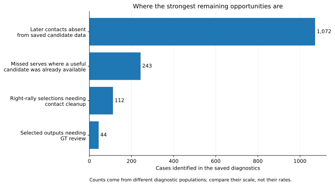
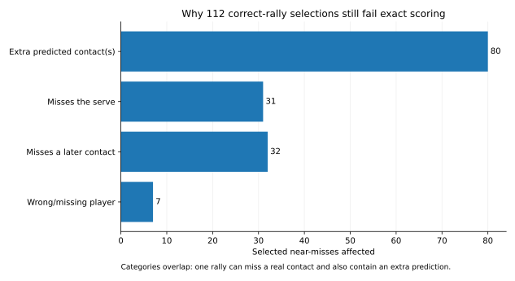

# Promising leads we stopped, deferred, or folded into later work

This is the research backlog for the closing pass.

The main reports answer **“what should we use now?”** This file answers a different question:

**“What looked worth pursuing, but did not become part of the final detector — and should we ever come back to it?”**

The distinction matters. Some ideas were tested properly and failed. Some were only deprioritised. Some were useful, but a later experiment absorbed the good part.

## What I would revisit first

| Lead | Status | Why it still matters |
|---|---|---|
| Fix the contact-level mistakes inside already-correct rally clips | **Revisit first** | 112 of the 124 selected proposals that fail fully correct rally scoring are still the correct whole rally. |
| Pick the serve better from candidates we already have | **Revisit** | Many missed serves already had a useful candidate; the model chose the wrong one. |
| Recover contacts that never entered the saved candidate files | **Deferred upstream work** | More than half of the missed later contacts in the development census had no nearby row to choose from. |
| Manually check the 44 selected proposals with untrusted GT | **Cheap measurement win** | It would settle the current all-GT automatic-use result instead of treating those 44 as unknown. |

The rest of this document explains those leads, then records the branches that are genuinely closed.

---

## 1. Turn “right rally, slightly wrong contacts” into fully correct rallies

**Status: revisit first**

This is the clearest opportunity left by the final results.

The ranking model selects 740 proposals whose trusted GT lets us score them exactly:

- **616 are perfect**;
- **112 are the correct whole rally but have contact-level mistakes**;
- only **12** have a fundamental rally-level problem.

So **728 / 740 = 98.4%** of the selected clips are already the correct whole rally.

The 112 near-misses mostly fail because of **extra contacts, missed contacts, or a smaller number of player-assignment errors**. These categories overlap.

This suggests a much narrower next problem than “build a better detector”:

**Given a clip we are already very confident contains one whole rally, can a second pass clean up its remaining contact mistakes?**

That was not tested in this branch.

A useful version would predict concrete residual errors — for example:

- “there is probably one extra contact here”;
- “the serve is missing”;
- “a later contact is missing”;
- “this player assignment is probably wrong”.

That is different from making the approval threshold stricter. The experiments already showed that simply taking the highest ranking scores does **not** produce a reliably exact subset.

**Why this is promising:** the hard macro problem — finding one whole rally — is already mostly solved inside the selected set. The remaining problem is much more local.

Saved evidence:
`results/serve_followups/acceptance_breakdown.json.gz`

---

## 2. Choose the serve better before generating more serve candidates

**Status: revisit**

The final detector finds **81.3% of serves** with trusted GT, compared with **88.9% recall for non-serve contacts**, so there is still meaningful serve-specific headroom.

The development diagnosis split 797 missed serves into four groups:

| Why the serve was missed | Missed serves |
|---|---:|
| A useful scored frame existed, but it was not included in the small candidate list | **347** |
| A useful candidate was already in the list, but the model chose something else | **243** |
| No prepared physical evidence was available for the useful frame | **181** |
| Useful scored evidence existed outside the current early-search window | **26** |

The key number is **243**.

Those serves did **not** need a bigger search. A useful candidate was already available and the model picked the wrong result.

We did test the obvious brute-force response — let the model consider more early candidates. On the 47-video comparison, that version gains only **four** perfect rallies over the final detector. It repairs 19 and breaks 15. It finds only three extra serves at ±10.

So the next serve experiment should **not** be “make the candidate list wider again.”

A better question is:

**What evidence would help the model choose the right serve when a good candidate is already present?**

That might mean a serve-specific ranking target, better use of player/pose evidence, or a local score aimed specifically at the first contact. This exact experiment was not run.

Saved evidence:
`results/serve_followups/development_diagnosis.json.gz`

---

## 3. Recover later contacts that never entered the saved candidate files

**Status: deferred upstream work**

The early missed-contact census found **2,043 missed later contacts** at ±10 across the 32 development videos.

Where did they disappear?

| What happened | Missed later contacts |
|---|---:|
| **No nearby row existed in the frozen feature files** | **1,072** |
| Nearby candidates existed, but all scores were below 0.90 | 668 |
| A score reached 0.90, but suppression removed it | 181 |
| A retained prediction competed for another label | 122 |
| A row existed but the scoring mask skipped it | **0** |

The important number is **1,072**.

For more than half of the missed later contacts, the final selection model never had a nearby saved candidate to work with. No amount of reranking the existing candidate rows can recover those contacts.

This closing pass deliberately reused saved tracks, poses, court data and detector scores instead of rerunning upstream vision work. That was sensible while large gains were still available from the saved evidence.

But if we want another substantial recall jump after the current detector, this is an obvious ceiling:

**Why are those 1,072 contacts missing from the prepared candidate data, and can upstream candidate generation recover them?**

That may require changing or rerunning the feature/candidate preparation rather than adding another downstream tree.

Saved evidence:
`results/missed_candidate_census.json.gz`

---

## 4. Check the 44 selected outputs whose GT is not trusted

**Status: cheap measurement win**

The ranking model selects **784** proposals.

Strict scoring can verify:

- 616 as perfect;
- 124 as imperfect;
- **44 cannot be settled because their GT was removed from strict scoring**.

Those 44 are a small, unusually valuable annotation target.

The original-label recount resolves 15 as wrong. Another 28 have no source labels, and one lacks player information. None of the 44 is confirmed fully correct. Thirteen contain a whole source-labelled rally.

Visual inspection is the next useful check.

This does not improve the detector. It improves our knowledge of what we already have.

It is also much cheaper than cleaning all 543 rallies whose source GT was excluded.

One broadcast is especially worth noting: an An Se Young–Akane Yamaguchi 2022 Uber Cup semi-final contributes 37 selected proposals in the saved breakdown, including **27 whose GT cannot settle the result**. That is enough concentration in one source that a small amount of targeted checking could materially clarify the aggregate result.

Saved evidence:
`results/serve_followups/acceptance_breakdown.json.gz`
and `results/serve_followups/acceptance_per_video.csv.gz`

---

# Lower-priority ideas that still have a reason to exist

## 5. Try a more diverse set of later-contact candidates

**Status: deferred, lower priority**

The follow-up diagnosis found:

- **551** missed later contacts already had a nearby candidate in the existing shortlist;
- only **87** were near a scored frame that had not made the shortlist.

That says the immediate problem is usually **choosing or scoring the candidates we already have**, not candidate diversity.

A more diverse later-contact shortlist was therefore deliberately not run.

It may become worth revisiting if:

1. selection among the current later candidates improves substantially; and
2. the remaining misses are then dominated by candidates that never make the shortlist.

Until then, it is not the first bottleneck.

---

## 6. Rerun upstream vision extraction

**Status: deferred**

No new tracking, pose, contact vision model or broad iterative extraction pass was run in this closing work.

That was deliberate: the saved evidence still contained large cheap gains, including later-contact insertion and the rally-boundary fix.

The reason to revisit upstream vision is now concrete rather than vague: the **1,072 missed later contacts with no nearby frozen feature row**.

So if this branch continues, “rerun vision” should mean:

**change the upstream candidate-generation step specifically to address those missing rows**, then measure whether they become recoverable.

A broad rerun without that target would just be expensive archaeology.

---

# Tested ideas that are closed in their current form

## 7. Insert two later contacts instead of one

**Status: closed in this form**

There was real theoretical headroom.

On development data, letting the labels choose two compatible insertions instead of one increased the best possible complete-rally count by:

- **82** when the other rally edits could also change;
- **55** when the existing base choice was held fixed.

So the candidate pool contains genuine two-miss cases.

But the learned model could not exploit that opportunity cleanly.

With the final boundary fix, the two-insertion version reaches **1,210** perfect development rallies at ±10 versus **1,209** for the simpler one-insertion version.

That one-rally net gain comes from **15 repairs and 14 losses**.

The current brute-force pair expansion is therefore closed. It adds complexity without dependable gain.

The underlying idea is not impossible forever. It would make more sense to revisit after a much better local insertion model or as a sequential cleanup step, rather than by tripling the whole alternative pool again.

Saved results:
`results/followups/both_result.json.gz`
and `results/followups/both_boundary_result_fixed_membership.json.gz`

---

## 8. Add a separate model for deleting extra contacts

**Status: closed in this form**

Extra contacts are clearly a real problem. They are the most common exact-scoring failure in the final selected set.

The development diagnosis also found **723 deletions** that appeared locally useful across 479 proposals.

But there was an important catch:

- the existing whole-sequence model already offered **675** of those opportunities;
- **637 / 723** locally useful deletions still left a different labelled contact missing;
- only **16** would have made the whole rally perfect by themselves.

A separate deletion score was then tested.

At ±10 it moves the final development detector from **1,209 → 1,217** perfect rallies:

- 22 repairs;
- 14 losses.

It also harms 67 proposals that were already imperfect.

That is not a good enough trade for another model, so this version was closed before the 47-video run.

### Why deletion may still come back in a different role

This result says **do not add a broad deletion model to the main detector**.

It does *not* say “never remove extra contacts.”

The final ranking results show 92 selected near-misses with extra predicted contacts. A conservative cleanup pass applied only after we already know the clip is almost certainly one whole rally is a much narrower problem than the deletion experiment tested here.

That narrower version remains plausible; it was not tested.

Saved results:
`results/serve_followups/deletion_development.json.gz`

---

## 9. Use a visual-language model to veto bad automatic selections

**Status: closed for this task**

This looked attractive because the question sounds visual: “does the clip really show the serve where we think it does?”

The small test failed badly.

Among 57 selected development proposals sent to the visual model at ±10:

- before the visual veto: **45 correct, 12 wrong**;
- after the veto: **6 correct, 1 wrong**.

It catches 11 of the 12 mistakes, but throws away **39 of the 45 correct proposals**.

Historical controls were also worrying:

- exact timing was claimed in **11 / 13** cases where the contact was not visible;
- “live” contact was claimed on **21 / 25** pure replay clips.

Do not rerun the same visual veto with more clips.

A future visual experiment would need a different task, stronger visibility/replay labels, and evidence that the model can answer that narrower question reliably.

Saved results:
`results/followups/vlm_acceptance_result.json.gz`

---

## 10. Widen the scoring mask over the existing saved rows

**Status: closed by diagnosis**

This one does not need another model run.

Among the 2,043 missed later contacts in the development census, **zero** had a nearby saved row that was merely skipped by the scoring mask.

So widening that mask over the existing frozen rows has no demonstrated recovery opportunity.

If upstream candidate preparation changes in future, this can be checked again. With the current saved data, it is a dead end.

---

## 11. Launch a broad new player-attribution campaign

**Status: low priority / effectively closed for now**

Player attribution is not perfect, but it is no longer the main bottleneck.

After the final local insertion work and rally-boundary fix, only **21 development proposals at ±10** have:

- complete timing;
- the whole rally contained;
- but the wrong player assignment.

The final alternating-player rule already turns the serve-side result from:

- 2,222 correct / 250 wrong / 309 missing

into:

- **2,647 correct / 128 wrong / 6 missing**

among the 2,781 trusted-GT serves found in time.

There are still side errors mixed with other failures, but a broad player-attribution campaign is unlikely to buy as much as fixing missing/extra contacts.

Revisit only after contact-sequence errors are substantially lower.

---

# Ideas that were absorbed rather than abandoned

## 12. Physical measurements

**Status: absorbed into the final model**

The standalone first-contact experiments made the physical measurements look weak.

On the eight comparison videos, adding direct physical measurements to the first-contact-only models did not improve complete-rally recovery.

But when the whole finished rally was scored jointly, the same physical evidence helped **reduce bad edits**:

- without direct physical measurements: 233 perfect rallies, 9 losses;
- with them: **235 perfect rallies, 3 losses**.

So the lesson is not “physics did nothing.”

The useful part of that branch is already in the final whole-sequence model. There is no reason to resurrect the standalone physical model.

---

## 13. A local score for inserted contacts

**Status: absorbed into the final detector**

The later-contact experiment originally left this as the obvious next branch:

**judge whether the proposed inserted contact itself is useful, instead of only asking whether the whole edited rally looks good.**

That experiment was later run.

The local inserted-contact score raises the 47-video perfect-rally count from **1,597 to 1,622** by itself, and remains part of the final **1,763** detector.

This lead is complete.

---

## 14. Fixing rally boundaries

**Status: absorbed into the final detector**

Earlier work left rally containment as a possible source of error.

The follow-up confirmed it strongly:

- starting point: 1,597 perfect rallies;
- conservative boundary correction only: **1,732**;
- repairs / losses: **135 / 0** at ±10.

That branch is no longer research debt. It is one of the main final-system changes.

---

# What not to do next

The old reports contain several tempting ways to spend time without attacking the current bottleneck.

I would **not** start with:

- another broad threshold search for exact automatic approval;
- a still-wider serve candidate list;
- the same two-insertion expansion;
- the same deletion model;
- the same VLM veto;
- widening the scoring mask over the current frozen rows;
- a broad new player-side campaign.

The strongest next questions are much narrower:

1. **Can we clean up the 112 selected clips that are already the correct whole rally?**
2. **Can we choose the correct serve more often when the useful candidate is already present?**
3. **What upstream step is responsible for the 1,072 missed later contacts that never enter the saved candidate files?**
4. **What are the 44 selected untrusted-GT cases actually doing?**

Those are the leads this closing pass leaves open.
