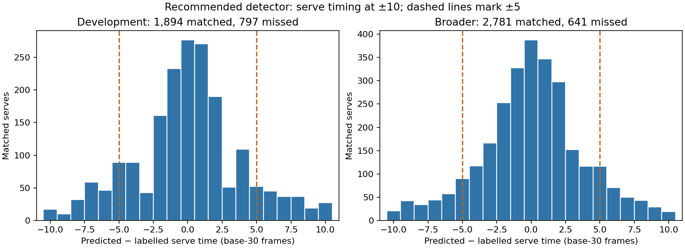
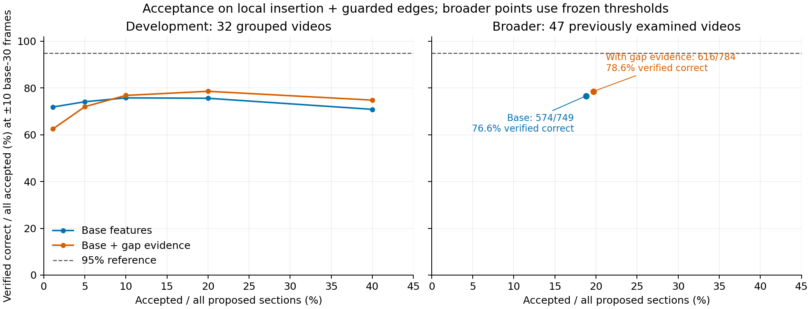

# Serve timing, deletion evidence and acceptance on the recommended detector

*6 September 2026 · experimental scripts and saved outputs*

## What to keep

Keep the current detector with local insertion evidence and guarded section edges. Drop the deletion model after its development test. Use gap evidence to rank work for manual review only, and keep automatic acceptance off.

Across the 47 previously examined ShuttleSet22 videos, the detector finds 2,781 of 3,422 labelled serves at ±10 base-30 frames (81.3%). It finds the serve and assigns the correct server in 2,647 rallies (77.4%). Of 3,725 nonempty proposals, 2,624 start at the serve (70.4%); 2,536 also name the correct server (68.1%). There are 257 empty sections.

The deletion model gives a small development gain but causes too many losses. The retained detector was then scored with its guarded edges. A frozen gap-based rule accepts 784 broader sections: 616 correct, 124 wrong and 44 unknown at ±10. That is 78.6% verified correct among all accepted sections. The rule improves review ranking, but the evidence does not support automatic acceptance.

## Contents

- [What was measured](#what-was-measured)
- [Serve timing and server identity](#serve-timing-and-server-identity)
- [The deletion experiment](#the-deletion-experiment)
- [Acceptance on the retained detector](#acceptance-on-the-retained-detector)
- [Complete output and local losses](#complete-output-and-local-losses)
- [Runtime and the next useful question](#runtime-and-the-next-useful-question)
- [Saved outputs and replay](#saved-outputs-and-replay)

## What was measured

The goal is to produce complete rally annotations that need little manual correction. A **section** is a video interval with a contact sequence. It is completely correct only when it contains exactly one entire labelled rally, matches every contact once, adds no extra contacts and assigns every player side correctly. Complete sections and unique recovered labelled rallies are counted separately where those populations differ.

The development population contains 32 videos in four groups of eight. Each new model excludes the group it scores. Acceptance adds nested fits: a training example from group G under held-out group H excludes both G and H from its new upstream fits. Old cached detector scores retain historical cross-group dependence. The development results therefore do not establish fully independent generalisation.

The broader comparison uses the same fixed 47 videos as the preceding experiments. These are previously examined comparison videos, not a fresh test set. Their earlier failures did not choose this session’s settings. Source URLs and broadcast names are distinct from the 32 development videos, and the source manifest excludes all eight known cross-dataset overlaps. Numeric fixture IDs alone cannot establish that separation.

The primary timing window is **±10 base-30 frames**. ±5 is the tighter window for identical predictions. Each window is scaled once to the source frame rate, so ±10 and ±5 become ±20 and ±10 source frames at 60 fps. Existing label cleaning remains in force. Unlabelled footage is not evidence of a false contact or a replay.

## Serve timing and server identity

The serve is the first labelled contact in a retained rally. The proposed start is the first event in a nonempty section. Timing uses the existing one-to-one matching over each full video stream. The scorer identifies which matches are serves afterwards; it does not rematch against serve labels alone.

| Recommended detector | Development ±10 / ±5 | Broader ±10 / ±5 |
|---|---:|---:|
| Retained labelled serves | 2,691 / 2,691 | 3,422 / 3,422 |
| Serve found anywhere | 1,894 / 1,565 | 2,781 / 2,371 |
| Serve found with correct final server | 1,790 / 1,487 | 2,647 / 2,263 |
| Proposed start is the serve | 1,803 / 1,486 | 2,624 / 2,234 |
| Proposed start is the serve with correct final server | 1,732 / 1,435 | 2,536 / 2,167 |
| Nonempty starts | 2,621 / 2,621 | 3,725 / 3,725 |
| Starts that labels can judge | 2,311 / 2,135 | 2,910 / 2,709 |
| Unknown starts | 310 / 486 | 815 / 1,016 |
| Empty sections | 229 / 229 | 257 / 257 |

All retained serves have known label sides in these populations. A missing predicted side counts as a failure. Unknown proposed starts stay in the all-start denominator. Among judgeable broader starts, timing is right in 90.2% / 82.5% at ±10 / ±5. Timing and final side are right in 87.1% / 80.0%. These conditional percentages cover only judgeable starts; the all-start counts are shown in the table.

Sequence-based side attribution helps. Among the 2,781 broader serve matches at ±10, the original wrist/net guesses give 2,222 correct sides, 250 wrong and 309 missing. The final alternating-sequence answer gives 2,647 correct, 128 wrong and six missing. At ±5, the corresponding counts are 1,972 / 200 / 199 before the vote and 2,263 / 102 / 6 afterwards. These counts concern timing-matched serves. Missed serves remain in the joint recall denominator.

Full-stream recovery and a correct section start are different measures. At ±10 in the broader population, 161 starts match a later hit and 125 are unmatched leading events inside a retained rally’s contact envelope. Another 815 starts are unknown. Eight matched serves fall outside every section. A recovered serve is preceded by an unmatched event in 65 proposed starts, covering 97 labelled serves. These categories can overlap, so they are not an exclusive error partition.

Relative to the preceding detector, the recommendation recovers 24 serves and loses 12 at ±10. Among serves matched by both versions, nine final server answers change from right to wrong and 29 change from wrong to right. Correct proposed starts gain 26 and lose 15. Correct timing-plus-server starts gain 49 and lose 16. Guarded edges preserve contacts and their membership. Their extra complete-rally recovery mainly reflects containment.

For the 32-video development comparison, the recommendation recovers 15 serves and loses 14 at ±10, and recovers 19 and loses 14 at ±5. At ±10, 18 timing-correct starts are gained and 19 are spoiled; timing-plus-server starts gain 33 and lose 20. At ±5, the corresponding changes are +20 / −18 and +28 / −16. These are development counts and should not be mixed with the broader counts above.

The wider early shortlist changes the broader recovery by +3 serves at ±10 and −5 at ±5 relative to the recommendation. Its joint proposed-start change is +5 / −1. That does not justify replacing the recommendation. The [full serve tables](serve_tables.md) include the original contact stream, preceding detector, guarded-edges-only alternative and wider shortlist. The [per-video table](results/serve_followups/serve_per_video.csv.gz) retains every population and tolerance.



The dashed lines mark ±5. Each panel includes the number of serves missed at ±10. A correct server at the wrong hit is not counted as a successful serve.

## The deletion experiment

The development diagnosis found local evidence for deleting an extra event. At ±10, 723 supported event deletions across 479 sections remove an extra event without losing a represented labelled hit. The existing chooser already offers 675 of those opportunities. Of the 723 supported opportunities, 637 still miss a different hit; only 16 would complete a rally. A further 1,032 apparently useful removals have no reliable label support and remain unknown.

The test reused the existing option pool and physical measurements. It added one local deletion score to the combined chooser. The target asks whether removing an event reduces extra contacts while preserving previously represented labelled hits after rematching. Duplicate predictions may exchange match ownership. A missed hit elsewhere does not make a useful deletion negative.

The exact current output, including inserted events, remained a candidate. The new chooser scored that reference and each alternative, retaining the existing required advantage of 0.05. The same guarded edge rule was applied to both outputs. Candidate generation and prediction choices used no evaluation labels. All 32 development videos were scored before this branch was judged.

| Deletion evidence versus retained detector | ±10 | ±5 |
|---|---:|---:|
| Complete rallies before → after | 1,209 → 1,217 | 958 → 963 |
| Complete rallies recovered / lost | 22 / 14 | 14 / 9 |
| Serves recovered / lost in the full stream | 24 / 14 | 24 / 18 |
| Correct serve-and-server starts gained / spoiled | 24 / 18 | 22 / 17 |
| Represented contacts recovered / lost in judgeable edits | 86 / 36 | 96 / 66 |
| Unnecessary contacts added / removed in judgeable edits | 68 / 61 | 111 / 84 |
| Already-wrong sections harmed | 67 | 95 |

The model changes 185 sections: 156 have judgeable local edits and 29 remain unknown. The four development groups gain +5, +3, +1 and −1 complete rallies at ±10. The last group also loses one at ±5. The added model improves some openings, but its six net correct serve-and-server starts at ±10 come with 18 spoiled starts. The small net rally gain does not outweigh the lost useful output or the extra model.

**The deletion branch is closed after development.** Its predictions, fitted-input caches and detailed gains and losses remain available. No all-group deployment model or broader deletion comparison was run. This is a completed negative combined-detector experiment.

The opening diagnosis also found 347 missed serves with scored evidence omitted from the early shortlist and 243 with a useful shortlisted frame that was not chosen. Another 181 had no prepared physical evidence, and 26 had scored evidence outside the early window. These 797 cases account for the missed development serves at ±10. They do not show that a new ranking rule would work. The supported leading-extra problem earned the deletion test; a new serve-ranking model remains a research question.

## Acceptance on the retained detector

Acceptance uses the retained contact choices and guarded section edges for both feature sets. **Base features** describe the chosen option, competing options and resulting section. **Gap evidence** adds local insertion scores and summaries of gaps where a contact might be missing. Gap evidence changes the acceptance score; it does not change the contact sequence.

The missing singleton and pair fits were built before acceptance training. For an outer held-out group H, each training group’s detector and gap inputs exclude both H and that training group from its new upstream fits. The fallback includes the preceding detector’s inserted events. Output summaries and correctness targets use the actual guarded spans. The outer detector choices reproduce the saved recommendation.

Five development selections were reported: the highest-scoring 32 sections, then the top 5%, 10%, 20% and 40%. The 20% comparison was fixed before this test. The policy would also freeze the largest reported selection reaching 95% or 99% verified correctness among **all accepted sections**. Neither feature set reached either target. No 95/99 policy is qualified, and no minimum sample count rescued a failed target.

The 20% thresholds are 0.7264487568 for base features and 0.7570784854 with gap evidence. They are score cut-offs, not calibrated correctness probabilities. The final all-development models and cut-offs were saved before broader scoring. Development threshold results describe selection on development data; the broader result tests the frozen rules. There was no broader threshold search.

| Population and features | Accepted / all sections | Correct / wrong / unknown, ±10 | Correct / wrong / unknown, ±5 | Verified correct / all accepted, ±10 / ±5 | Correct sections rejected, ±10 / ±5 |
|---|---:|---:|---:|---:|---:|
| Development, base | 570 / 2,850 | 431 / 135 / 4 | 371 / 195 / 4 | 75.6% / 65.1% | 778 / 587 |
| Development, base + gap | 570 / 2,850 | 448 / 119 / 3 | 393 / 174 / 3 | 78.6% / 68.9% | 761 / 565 |
| Broader, base | 749 / 3,982 | 574 / 129 / 46 | 510 / 193 / 46 | 76.6% / 68.1% | 1,189 / 920 |
| Broader, base + gap | 784 / 3,982 | 616 / 124 / 44 | 549 / 191 / 44 | 78.6% / 70.0% | 1,147 / 881 |

At the same development count, gap evidence selects 17 more correct sections. Its frozen broader rule selects 42 more correct sections while accepting 35 more overall. Against the base rule, gap acceptance adds 152 correct sections and drops 110 correct sections at ±10. Its net gain of 42 does not mean it preserves every previously accepted correct section. Broader coverage is 19.7% of all proposals. Excluding the 44 unknowns gives judged precision of 83.2% / 74.2% at ±10 / ±5. That narrower denominator does not establish near-certain output.

The highest-scoring development sections are not the most reliable group in these pooled results. Only 20 of the gap model’s top 32 sections are correct at ±10; the base model gets 23. Raising the score threshold is therefore not an established route to automatic acceptance.



The plot includes unknowns in its denominator. Lines connect the five development selections. The two broader points use the frozen 20% development rules. The dashed line is the 95% reference, not an achieved operating point.

### Serves in the selected output

The gap rule retains the serves below. Full-stream matches are reused; accepting a section does not trigger more favourable rematching. The labelled-serve denominator stays at 2,691 for development and 3,422 for the broader comparison.

| Population and tolerance | Serve found / all labelled serves | Raw server: correct / wrong / missing | Final server: correct / wrong / missing | Correct timing + server / all accepted starts | Correct timing + server / judgeable accepted starts | Unknown starts / empty sections |
|---|---:|---:|---:|---:|---:|---:|
| Development, ±10 | 504 / 2,691 | 490 / 12 / 2 | 504 / 0 / 0 | 498 / 570 | 498 / 552 | 18 / 0 |
| Development, ±5 | 450 / 2,691 | 438 / 10 / 2 | 450 / 0 / 0 | 445 / 570 | 445 / 534 | 36 / 0 |
| Broader, ±10 | 697 / 3,422 | 659 / 31 / 7 | 696 / 1 / 0 | 695 / 784 | 695 / 734 | 50 / 0 |
| Broader, ±5 | 641 / 3,422 | 610 / 26 / 5 | 641 / 0 / 0 | 640 / 784 | 640 / 713 | 71 / 0 |

For this rule, every correctly timed accepted proposed start also has the right final server. Timing-only proposed-start counts therefore equal the joint counts in the table. Broader accepted starts are jointly correct in 88.6% / 81.6% of all accepted starts, or 94.7% / 89.8% of judgeable accepted starts. The rule retains only 20.4% / 18.7% of all labelled serves at ±10 / ±5. Good conditional attribution comes with limited recovery.

At ±10, the broader accepted starts also include ten later hits and 29 supported extra leading events. At ±5, the corresponding counts are ten and 63. Unknown starts remain separate. The saved acceptance results retain the equivalent base-feature tables and per-video counts.

### What still goes wrong

Among the gap rule’s 124 wrong broader sections at ±10, 43 miss the serve, 39 miss a later contact, 92 have extra unmatched predictions, ten have wrong or missing final sides, and 12 have section containment or overlap problems. At ±5, the corresponding counts among 191 wrong sections are 99, 59, 161, seven and 12. Categories overlap. A prediction outside the matching window can count as both a missing label match and an extra prediction; these counts do not prove that a separate physical strike occurred.

The 44 unknown accepted sections are additional cases. They are not hidden successes or proven failures. Of the 3,198 rejected sections, 1,147 / 881 are completely correct at ±10 / ±5. Acceptance leaves substantial useful output for manual review.

| Broader labelled rally length | All proposals in group | Accepted | Correct / wrong / unknown, ±10 | Correct / wrong / unknown, ±5 |
|---|---:|---:|---:|---:|
| 1–5 contacts | 833 | 236 | 204 / 32 / 0 | 183 / 53 / 0 |
| 6–10 contacts | 886 | 241 | 193 / 48 / 0 | 164 / 77 / 0 |
| 11–20 contacts | 860 | 198 | 165 / 33 / 0 | 153 / 45 / 0 |
| 21+ contacts | 390 | 65 | 54 / 11 / 0 | 49 / 16 / 0 |
| No single retained labelled rally | 1,013 | 44 | 0 / 0 / 44 | 0 / 0 / 44 |

Length is joined after prediction and never filters eligible output. The last row includes proposals with no retained rally or multiple overlaps; the accepted members here are all unknown. Development length groups and every base/gap partition are in the [saved breakdown](results/serve_followups/acceptance_breakdown.json.gz).

The [per-video acceptance table](results/serve_followups/acceptance_per_video.csv.gz) includes broader broadcast names. Variation matters. The An Se Young–Akane Yamaguchi 2022 Uber Cup semi-final contributes 37 gap-accepted sections, with zero verified correct, ten wrong and 27 unknown at ±10. The labels do not establish that all 37 are wrong. The aggregate result must not be treated as uniform reliability across broadcasts.

**Keep gap evidence as a candidate for prioritising manual review. Keep automatic acceptance off.** This measures the recommended detector directly. The earlier 599-correct acceptance result concerned the preceding detector and is not substituted for it.

## Complete output and local losses

The retained broader detector recovers 1,763 / 1,430 unique complete rallies at ±10 / ±5. That is 51.5% / 41.8% of 3,422 retained labelled rallies and 44.3% / 35.9% of 3,982 proposed sections. The guarded-edges-only alternative gives 1,732 / 1,404. The preceding detector gives 1,597 / 1,327. This session recounted those saved outputs; it did not create an additional detector gain.

Across all 47 full streams, the recommendation predicts 41,605 contacts against 38,218 retained labels. It time-matches 33,716 / 32,972 contacts at ±10 / ±5. The [saved full-stream scores](results/followups/local_broader_result.json.gz) give 32,667 / 32,006 matches with the correct final side after the sequence vote. The serve recount also preserves the separate raw wrist/net side counts. Joint time-and-side precision is 78.5% / 76.9%, recall is 85.5% / 83.7%, and F1 is 81.8% / 80.2%. Precision divides correct sided matches by predictions; recall divides them by retained labels. F1 is their harmonic mean. Timing-only F1 is a separate quantity.

Relative to the preceding detector, the retained package repairs 180 and loses 14 complete rallies at ±10. At ±5 it repairs 113 and loses ten. Net complete-rally recovery improves in 38 videos, ties in eight and falls by one in one video at ±10. The [preceding comparison](followup_comparison.md#errors-hidden-by-the-totals) records local contact losses and shorter or longer rally changes. Those losses remain part of the recommendation’s trade-off.

## Runtime and the next useful question

The reusable nested fits for acceptance took 13.3 minutes. Building and fitting acceptance from those caches took another 2.5 minutes. These runs fit two acceptance feature sets on the actual guarded detector; the older acceptance result concerned the preceding detector. The frozen broader acceptance pass took 21.4 seconds across 47 videos with four workers, including option reconstruction, feature loading and both acceptance scores. One video reused features from the smoke check; the other 46 built them during this pass. Original per-video feature work summed to 43.3 seconds, including that first video. Scoring both acceptance trees summed to 0.18 seconds. The full job took 25.8 seconds including evaluation. These costs are additional to the retained detector and reuse its saved option scores.

The deletion test took 14.3 minutes, including 9.3 minutes to prepare local features and fits. The four whole-chooser fits took 44–54 seconds each. These are one-off experiment costs. The serve recount took 3.5 minutes for development and 4.9 minutes for the broader videos. That is evaluation work, not inference.

The earlier retained detector run took 241.8 seconds over 47 cached video inputs with four workers, plus 8.5 seconds for guarded edges. Its per-video work summed to 659.8 seconds before edges, including feature loading and prediction. Those historical times are reused here. Shared load and warm caches prevent a controlled speed comparison between runs. Neither the old timing nor this session measures the vision pipeline from raw video.

The remaining question is whether automatic evidence can predict a complete rally’s residual errors reliably across broadcasts. This test does not answer it. Extra unmatched predictions and missed contacts remain common in accepted output, and the highest pooled scores are not reliably calibrated. A future serve-specific ranking or acceptance study needs a concrete feature or target change with grouped development evidence. Another broad shortlist sweep or visual serve veto has not earned a run. The current package is replayable and useful for review while automatic acceptance remains experimental.

## Saved outputs and replay

All paths below are relative to `scratch/contact_det_closing_pass/`. Results and prediction records are versioned. Large feature caches and model files use the existing ignored `raw/` storage convention.

| Purpose | Saved artefact |
|---|---|
| Serve rows, matches, section judgements and identity changes | `results/serve_followups/{development,broader}_serves.json.gz` |
| Development diagnosis and deletion opportunity | `results/serve_followups/development_diagnosis.json.gz` |
| Closed deletion branch | `results/serve_followups/deletion_{predictions,development}.json.gz` |
| Acceptance development rows and frozen policies | `results/serve_followups/chosen_acceptance_development.json.gz` |
| Broader scores saved before evaluation | `results/serve_followups/chosen_acceptance_broader_predictions.json.gz` |
| Broader acceptance and accepted serve accounting | `results/serve_followups/chosen_acceptance_broader.json.gz` |
| Accepted errors, length groups and per-video counts | `results/serve_followups/acceptance_breakdown.json.gz`, `acceptance_per_video.csv.gz` |
| Recommended detector models | `raw/followups/local_models.joblib` |
| Actual-detector acceptance models, feature names and thresholds | `raw/serve_followups/chosen_acceptance_models.joblib` |
| Reusable nested fit and per-video feature caches | `raw/serve_followups/chosen_*`, `acceptance_block_*.joblib` |
| Archived development fallback and embedded option scores | `raw/serve_followups/reference_development_predictions/local_predictions.json.gz` |

The unchanged [recommended broader predictions](results/followups/local_boundary_broader_predictions_fixed_membership.json.gz) and [lower-intervention alternative](results/followups/session_start_boundary_broader_predictions_fixed_membership.json.gz) remain the reference streams. The models and caches have been preserved using the existing experiment storage. A copied cache tree can restore `raw/serve_followups/`; the commands below rebuild it from the earlier saved inputs if needed. The failed deletion branch has no frozen deployment model because it was not retained.

Run these commands from the repository root in the experiment environment. Model runs used scikit-learn 1.6.1 and NumPy 2.2.6. The [preceding report](followup_comparison.md#methods-and-reproduction) records the upstream prepared data, model settings and detector rebuild. The new whole and local trees retain those settings. Acceptance retains the existing family and its settings in `scripts/run_later_acceptance.py`. No visual model or new vision processing ran in this pass.

```bash
export PYTHONPATH=src:.
closing_module=scratch.contact_det_closing_pass.scripts

# Rebuild presentation from versioned result records; no fitting or video inputs.
python -m "$closing_module.write_serve_tables"
python -m "$closing_module.write_acceptance_tables"

# Recount saved detector outputs and reproduce the development-only deletion test.
python -m "$closing_module.run_serve_followups"
python -m "$closing_module.run_serve_diagnosis"
python -m "$closing_module.run_deletion_followup" --jobs 2

# Rebuild nested acceptance inputs if absent, freeze policies, then apply them.
python -m "$closing_module.run_chosen_acceptance" --jobs 2
python -m "$closing_module.run_chosen_acceptance_broader" --jobs 4
```

Learning requires `raw/later_run/prepared.joblib`, the earlier opening and local caches, and `raw/later_acceptance/nested_pair_fits.joblib`. The new nested runner fills the missing singleton and pair fits. Broader scoring uses the saved chooser/later inputs, physical measurements and `raw/followups/local_<fixture>_option_scores.npy.xz`. It reuses the saved detector choices and never refits on the broader videos. Per-video acceptance features are cached. A warm replay’s wall time must not be reported as fresh feature preparation.

Verification: all 23 focused serve, deletion and nested-acceptance tests passed (exit 0). The full repository suite passed with 2,040 tests and 29 skips (exit 0) after putting the project virtual environment on PATH. The first invocation failed one interpreter-lookup test because bare `python` was absent from PATH. Scoped lint and import checks passed (exit 0). Whole-repository Ruff returned exit 1 with the existing 915 issues. Pyrefly returned exit 1 with the existing 11 missing-import errors. Production source files were unchanged.
